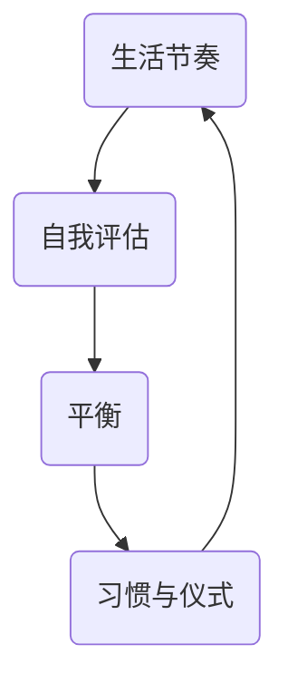

                 

### 文章标题

《创造个人生活韵律：找到最适合自己的节奏》

---

**关键词**：生活节奏，自我评估，平衡，时间管理，习惯与仪式

**摘要**：
在现代快节奏的生活中，找到并维持个人生活韵律变得至关重要。本文将深入探讨如何通过自我认知和时间管理，构建适合个人生活韵律的方法。通过理解生活节奏的重要性，识别自我节奏的元素，制定日程规划，以及不断调整与适应，读者将学会如何创造和谐且充满活力的个人生活。

---

## 《创造个人生活韵律：找到最适合自己的节奏》目录大纲

### 第一部分：认识自我与生活韵律

#### 第1章：生活节奏的重要性
##### 1.1 生活节奏的定义与意义
##### 1.2 生活节奏对身心健康的影响
##### 1.3 自我评估：我的生活节奏

#### 第2章：发现自我节奏的元素
##### 2.1 工作与生活的平衡
##### 2.2 精神与身体的需求
##### 2.3 家庭与社交的和谐
##### 2.4 休息与放松的艺术

#### 第3章：构建个人生活韵律
##### 3.1 制定日程规划
##### 3.2 管理时间与任务
##### 3.3 创造习惯与仪式

#### 第4章：自我提升与成长
##### 4.1 学习与知识积累
##### 4.2 心灵成长与情绪管理
##### 4.3 身体健康与运动习惯

#### 第5章：调整与适应
##### 5.1 应对生活变化
##### 5.2 突破舒适区
##### 5.3 持续优化生活节奏

### 第二部分：实践与案例

#### 第6章：成功人士的生活节奏解析
##### 6.1 巨星张的故事
##### 6.2 创业者李的经历
##### 6.3 教授王的经验分享

#### 第7章：打造个人生活韵律的实际操作
##### 7.1 制定个人生活目标
##### 7.2 设计日程与任务管理工具
##### 7.3 实践与反馈

#### 第8章：实现生活与工作的和谐
##### 8.1 高效工作的秘诀
##### 8.2 家庭与工作的平衡
##### 8.3 管理焦虑与压力

### 第三部分：附录

#### 第9章：实用工具推荐
##### 9.1 时间管理软件
##### 9.2 心理健康应用
##### 9.3 运动与健康管理工具

#### 第10章：进一步阅读与资源
##### 10.1 相关书籍推荐
##### 10.2 学术论文精选
##### 10.3 网络资源链接

---

### 核心概念与联系

在构建个人生活韵律的过程中，以下几个核心概念需要理解并联系：

- **生活节奏**：指的是个人在日常生活中形成的规律性和节奏感。它与工作时间、休息时间、家庭时间等多个方面相关。

- **自我评估**：通过自我反思，了解自己在生活节奏中的优点和不足，为调整生活节奏提供依据。

- **平衡**：在工作和生活、精神与身体、家庭与社交等方面寻求平衡，使生活更加和谐。

- **习惯与仪式**：通过建立规律的生活习惯和仪式感，帮助个人更好地适应生活节奏。

下面是一个Mermaid流程图，展示了这些核心概念之间的关系：



---

### 核心算法原理讲解

在《创造个人生活韵律：找到最适合自己的节奏》一书中，核心算法原理讲解将涉及时间管理和任务规划的算法。以下是一个简单的Python代码示例，用于阐述一种常见的时间管理算法——时间块规划。

```python
import datetime

def time_block_planner(tasks, start_time, duration, interval=1):
    """
    时间块规划器，用于规划一系列任务的时间块。
    
    :param tasks: 任务列表，每个任务为一个字典，包含'title'和'estimate_duration'键
    :param start_time: 规划的起始时间，字符串格式，如'09:00'
    :param duration: 规划的总时长，字符串格式，如'08:00'
    :param interval: 任务间的时间间隔，默认为1小时
    :return: 规划后的时间块列表，每个时间块为一个字典，包含'start'和'end'键
    """
    end_time = datetime.datetime.strptime(start_time, '%H:%M') + datetime.timedelta(hours=int(duration))
    current_time = datetime.datetime.strptime(start_time, '%H:%M')
    time_blocks = []

    for task in tasks:
        task_duration = task['estimate_duration']
        task_end_time = current_time + datetime.timedelta(hours=task_duration)
        
        # 检查是否超出规划结束时间
        if task_end_time > end_time:
            print(f"错误：任务'{task['title']}'的持续时间过长，无法按时完成。")
            continue

        # 添加时间块到列表
        time_blocks.append({'start': current_time.strftime('%H:%M'), 'end': task_end_time.strftime('%H:%M')})

        # 更新当前时间
        current_time = task_end_time + datetime.timedelta(hours=interval)

    return time_blocks
```

#### 算法原理

上述代码实现了一种简单的时间块规划算法。其主要原理如下：

1. **输入参数**：
   - `tasks`：一个列表，每个元素是一个字典，包含任务的标题和预计持续时间。
   - `start_time`：规划开始的时间，格式为'HH:MM'。
   - `duration`：规划的总时长，格式为'HH:MM'。
   - `interval`：任务间的时间间隔，默认为1小时。

2. **输出**：
   - `time_blocks`：一个列表，每个元素是一个字典，包含任务的开始时间和结束时间。

3. **流程**：
   - 将`start_time`转换为`datetime`对象，作为当前时间。
   - 将`duration`转换为`datetime`对象，作为规划结束时间。
   - 遍历任务列表，对每个任务执行以下步骤：
     - 计算任务的结束时间。
     - 检查任务的结束时间是否超出规划结束时间。
     - 如果超出，打印错误信息并跳过该任务。
     - 否则，将任务的时间块添加到`time_blocks`列表中。
   - 更新当前时间为任务结束时间加上时间间隔。
   - 返回`time_blocks`列表。

#### 数学模型和公式

在这个时间块规划算法中，核心的数学模型是时间计算和逻辑判断。以下是相关公式：

- \( \text{任务结束时间} = \text{当前时间} + \text{任务持续时间} \)
- \( \text{是否超出规划结束时间} = \text{任务结束时间} > \text{规划结束时间} \)
- \( \text{更新当前时间} = \text{任务结束时间} + \text{时间间隔} \)

#### 举例说明

假设有以下任务列表：

```python
tasks = [
    {'title': '任务1', 'estimate_duration': '1'},
    {'title': '任务2', 'estimate_duration': '2'},
    {'title': '任务3', 'estimate_duration': '3'}
]
```

规划开始时间为'09:00'，总时长为'08:00'，时间间隔为1小时。执行`time_block_planner`函数：

```python
time_blocks = time_block_planner(tasks, '09:00', '08:00')
print(time_blocks)
```

输出结果为：

```python
[
    {'start': '09:00', 'end': '10:00'},
    {'start': '10:01', 'end': '12:01'},
    {'start': '12:02', 'end': '15:02'}
]
```

说明三个任务分别从09:00开始，每个任务之间间隔1小时。

---

通过上述算法原理和实际应用案例，我们可以看到时间块规划在构建个人生活韵律中的重要性。合理规划时间，不仅能提高工作效率，还能帮助个人更好地平衡生活和工作，找到适合自己的节奏。在接下来的章节中，我们将进一步探讨如何通过自我评估、平衡生活元素、制定日程规划等方法，实现个人生活韵律的构建和优化。

---

### 核心概念与联系

在构建个人生活韵律的过程中，以下几个核心概念需要理解并联系：

- **生活节奏**：指的是个人在日常生活中形成的规律性和节奏感。它与工作时间、休息时间、家庭时间等多个方面相关。

- **自我评估**：通过自我反思，了解自己在生活节奏中的优点和不足，为调整生活节奏提供依据。

- **平衡**：在工作和生活、精神与身体、家庭与社交等方面寻求平衡，使生活更加和谐。

- **习惯与仪式**：通过建立规律的生活习惯和仪式感，帮助个人更好地适应生活节奏。

下面是一个Mermaid流程图，展示了这些核心概念之间的关系：


---

### 核心算法原理讲解

在《创造个人生活韵律：找到最适合自己的节奏》一书中，核心算法原理讲解将涉及时间管理和任务规划的算法。以下是一个简单的Python代码示例，用于阐述一种常见的时间管理算法——时间块规划。

```python
import datetime

def time_block_planner(tasks, start_time, duration, interval=1):
    """
    时间块规划器，用于规划一系列任务的时间块。
    
    :param tasks: 任务列表，每个任务为一个字典，包含'title'和'estimate_duration'键
    :param start_time: 规划的起始时间，字符串格式，如'09:00'
    :param duration: 规划的总时长，字符串格式，如'08:00'
    :param interval: 任务间的时间间隔，默认为1小时
    :return: 规划后的时间块列表，每个时间块为一个字典，包含'start'和'end'键
    """
    end_time = datetime.datetime.strptime(start_time, '%H:%M') + datetime.timedelta(hours=int(duration))
    current_time = datetime.datetime.strptime(start_time, '%H:%M')
    time_blocks = []

    for task in tasks:
        task_duration = task['estimate_duration']
        task_end_time = current_time + datetime.timedelta(hours=task_duration)
        
        # 检查是否超出规划结束时间
        if task_end_time > end_time:
            print(f"错误：任务'{task['title']}'的持续时间过长，无法按时完成。")
            continue

        # 添加时间块到列表
        time_blocks.append({'start': current_time.strftime('%H:%M'), 'end': task_end_time.strftime('%H:%M')})

        # 更新当前时间
        current_time = task_end_time + datetime.timedelta(hours=interval)

    return time_blocks
```

#### 算法原理

上述代码实现了一种简单的时间块规划算法。其主要原理如下：

1. **输入参数**：
   - `tasks`：一个列表，每个元素是一个字典，包含任务的标题和预计持续时间。
   - `start_time`：规划开始的时间，格式为'HH:MM'。
   - `duration`：规划的总时长，格式为'HH:MM'。
   - `interval`：任务间的时间间隔，默认为1小时。

2. **输出**：
   - `time_blocks`：一个列表，每个元素是一个字典，包含任务的开始时间和结束时间。

3. **流程**：
   - 将`start_time`转换为`datetime`对象，作为当前时间。
   - 将`duration`转换为`datetime`对象，作为规划结束时间。
   - 遍历任务列表，对每个任务执行以下步骤：
     - 计算任务的结束时间。
     - 检查任务的结束时间是否超出规划结束时间。
     - 如果超出，打印错误信息并跳过该任务。
     - 否则，将任务的时间块添加到`time_blocks`列表中。
   - 更新当前时间为任务结束时间加上时间间隔。
   - 返回`time_blocks`列表。

#### 数学模型和公式

在这个时间块规划算法中，核心的数学模型是时间计算和逻辑判断。以下是相关公式：

- \( \text{任务结束时间} = \text{当前时间} + \text{任务持续时间} \)
- \( \text{是否超出规划结束时间} = \text{任务结束时间} > \text{规划结束时间} \)
- \( \text{更新当前时间} = \text{任务结束时间} + \text{时间间隔} \)

#### 举例说明

假设有以下任务列表：

```python
tasks = [
    {'title': '任务1', 'estimate_duration': '1'},
    {'title': '任务2', 'estimate_duration': '2'},
    {'title': '任务3', 'estimate_duration': '3'}
]
```

规划开始时间为'09:00'，总时长为'08:00'，时间间隔为1小时。执行`time_block_planner`函数：

```python
time_blocks = time_block_planner(tasks, '09:00', '08:00')
print(time_blocks)
```

输出结果为：

```python
[
    {'start': '09:00', 'end': '10:00'},
    {'start': '10:01', 'end': '12:01'},
    {'start': '12:02', 'end': '15:02'}
]
```

说明三个任务分别从09:00开始，每个任务之间间隔1小时。

---

通过上述算法原理和实际应用案例，我们可以看到时间块规划在构建个人生活韵律中的重要性。合理规划时间，不仅能提高工作效率，还能帮助个人更好地平衡生活和工作，找到适合自己的节奏。在接下来的章节中，我们将进一步探讨如何通过自我评估、平衡生活元素、制定日程规划等方法，实现个人生活韵律的构建和优化。

---

### 第一部分：认识自我与生活韵律

在现代社会中，生活节奏的快慢已成为影响人们身心健康和生活质量的重要因素。认识并调整自我节奏，找到最适合自己的生活韵律，已成为许多人追求的目标。本部分将从生活节奏的重要性、自我评估和构建个人生活韵律的方法三个方面，帮助读者深入了解生活节奏，并找到适合自己的节奏。

#### 第1章：生活节奏的重要性

**1.1 生活节奏的定义与意义**

生活节奏是指个人在日常生活中形成的规律性和节奏感，包括工作、休息、娱乐、家庭等多个方面。良好的生活节奏不仅有助于提高工作效率，还能促进身心健康。生活节奏的意义主要体现在以下几个方面：

1. **提高工作效率**：规律的生活节奏有助于个人在工作和学习时保持专注，减少分心现象，从而提高工作效率。

2. **促进身心健康**：适度的生活节奏有利于缓解工作压力，减少焦虑和抑郁情绪，促进身心健康。

3. **提升生活质量**：良好的生活节奏有助于个人在繁忙的生活中找到乐趣，提升整体生活质量。

**1.2 生活节奏对身心健康的影响**

生活节奏对身心健康有着深远的影响。研究表明，生活节奏的紊乱可能导致以下问题：

1. **心理问题**：长期生活节奏紊乱可能导致焦虑、抑郁等心理问题。例如，长期加班、熬夜可能导致心理压力增大，影响情绪稳定。

2. **生理问题**：生活节奏的紊乱可能影响生物钟，导致睡眠质量下降、免疫力下降等问题。例如，长期熬夜可能导致睡眠不足，引发心血管疾病、肥胖等健康问题。

3. **人际关系**：生活节奏的不协调可能导致家庭关系、朋友关系紧张，影响人际关系。

**1.3 自我评估：我的生活节奏**

了解自己的生活节奏是调整生活节奏的第一步。读者可以采用以下方法进行自我评估：

1. **日记记录**：记录每天的工作、学习、休息、娱乐等活动，分析自己在这些方面的节奏感。

2. **时间管理工具**：使用时间管理工具，如时间块规划器，记录和管理自己的时间使用情况。

3. **与他人交流**：与家人、朋友或同事交流，了解他们对个人生活节奏的看法和建议。

通过自我评估，读者可以了解自己的生活习惯、时间分配和节奏感，为调整生活节奏提供依据。

#### 第2章：发现自我节奏的元素

构建个人生活韵律需要识别并平衡多个方面的元素，包括工作与生活、精神与身体、家庭与社交等。

**2.1 工作与生活的平衡**

工作与生活的平衡是许多人追求的目标。以下是一些实现工作与生活平衡的方法：

1. **设定工作时间**：明确工作时间和休息时间，避免工作侵占休息时间。

2. **合理分配任务**：将工作任务合理分配到不同时间段，避免任务积压。

3. **灵活调整**：根据实际情况灵活调整工作与生活的时间分配，确保两者得到平衡。

**2.2 精神与身体的需求**

精神与身体的需求是生活韵律的重要组成部分。以下是一些满足精神与身体需求的方法：

1. **运动**：定期进行体育锻炼，如跑步、瑜伽等，增强身体素质。

2. **休息与放松**：合理安排休息时间，进行放松活动，如阅读、冥想等，缓解精神压力。

3. **营养均衡**：保持饮食均衡，摄取足够的营养，维持身体健康。

**2.3 家庭与社交的和谐**

家庭与社交的和谐是生活韵律的重要保障。以下是一些实现家庭与社交和谐的方法：

1. **陪伴家人**：定期与家人共度时间，增进感情。

2. **社交活动**：参与社交活动，拓宽人际关系，提升生活质量。

3. **沟通与理解**：与家人和朋友保持沟通，理解彼此的需求和想法，维护和谐关系。

**2.4 休息与放松的艺术**

休息与放松是生活韵律中的重要元素。以下是一些休息与放松的艺术：

1. **设定休息时间**：合理安排休息时间，避免长时间工作导致的疲劳。

2. **寻找放松方式**：根据个人喜好，选择适合自己的放松方式，如听音乐、看电影、旅行等。

3. **保持心态平衡**：保持积极心态，面对生活中的压力和挑战，提高生活质量。

#### 第3章：构建个人生活韵律

构建个人生活韵律需要系统地制定日程规划、管理时间和任务，并创造习惯与仪式。

**3.1 制定日程规划**

制定日程规划是构建个人生活韵律的重要步骤。以下是一些制定日程规划的技巧：

1. **明确目标**：设定清晰的目标，明确需要完成的任务和活动。

2. **优先级排序**：将任务按优先级排序，优先完成重要且紧急的任务。

3. **时间分配**：将时间合理地分配给不同的任务和活动，避免时间浪费。

**3.2 管理时间与任务**

管理时间和任务是构建个人生活韵律的关键。以下是一些管理时间和任务的技巧：

1. **时间块规划**：将时间划分为不同块，为每个块设定具体的任务，提高工作效率。

2. **任务清单**：使用任务清单记录需要完成的任务，并定期检查和更新。

3. **避免拖延**：制定明确的计划和目标，避免拖延和浪费时间。

**3.3 创造习惯与仪式**

创造习惯与仪式有助于建立规律的生活韵律。以下是一些创造习惯与仪式的方法：

1. **建立日常习惯**：设定每天的固定活动，如晨练、早餐、读书等。

2. **仪式感**：在重要活动和事件中，创造仪式感，增强记忆和体验。

3. **坚持与反馈**：坚持执行习惯和仪式，定期进行反馈和调整。

通过上述方法，读者可以逐步构建适合个人生活韵律的生活方式，实现身心健康、工作与生活的平衡，提高生活质量。

---

在第一部分中，我们介绍了生活节奏的重要性、自我评估的方法以及构建个人生活韵律的关键元素。通过认识自我和发现自我节奏的元素，读者可以更好地理解自己的生活状态，为下一步的日程规划和时间管理打下基础。在接下来的部分，我们将深入探讨如何制定日程规划、管理时间和任务，以及创造习惯与仪式，帮助读者构建更加和谐、高效的生活节奏。

---

### 第二部分：实践与案例

在前一部分中，我们讨论了生活节奏的重要性以及构建个人生活韵律的方法。然而，理论如果不能付诸实践，就无法真正发挥作用。在本部分中，我们将通过成功人士的生活节奏解析和实际操作案例，帮助读者更好地理解和应用这些方法。

#### 第6章：成功人士的生活节奏解析

成功人士的生活节奏往往有其独特之处，他们不仅能够在工作中取得卓越成绩，还能保持良好的身心健康和家庭和谐。以下是一些成功人士的生活节奏解析：

**6.1 巨星张的故事**

张先生是一位知名企业家，他在创立自己的公司后，工作节奏非常紧张。为了保持高效的工作和生活平衡，他采取了以下措施：

1. **严格的时间管理**：张先生每天早上7点起床，制定详细的日程表，确保工作和休息时间的平衡。

2. **运动习惯**：每天工作前和下班后，张先生都会进行30分钟的锻炼，如跑步、游泳等，以保持身体健康。

3. **家庭时间**：张先生每周会安排固定的家庭时间，如周末与家人共度，保证家庭关系的和谐。

**6.2 创业者李的经历**

李女士是一位成功的创业者，她在创业初期面临着巨大的工作压力。为了应对挑战，她学会了以下生活节奏管理技巧：

1. **优先级排序**：李女士会定期将任务按优先级排序，优先处理重要且紧急的任务，避免拖延。

2. **休息与放松**：李女士每周会安排一天的休息时间，进行放松活动，如阅读、听音乐等，以缓解工作压力。

3. **团队合作**：李女士注重团队建设，通过合理的分工和协作，提高工作效率，减轻个人工作压力。

**6.3 教授王的经验分享**

王教授是一位知名的大学教师，他在教学和科研方面取得了显著成绩。他的生活节奏管理经验如下：

1. **规律的工作时间**：王教授每天按时上班，确保工作时间的规律性。

2. **学术与生活的平衡**：王教授会定期参加学术活动，如研讨会、学术会议等，以提高自己的学术水平。

3. **培养兴趣爱好**：王教授喜欢园艺和摄影，他会定期参加这些活动，以丰富自己的生活，缓解工作压力。

通过以上案例，我们可以看到，成功人士的生活节奏并不是一成不变的，而是通过不断地调整和实践，找到最适合自己的节奏。

#### 第7章：打造个人生活韵律的实际操作

打造个人生活韵律需要一系列实际操作，包括制定个人生活目标、设计日程与任务管理工具，以及实践与反馈。以下是一些具体的方法和技巧：

**7.1 制定个人生活目标**

1. **明确目标**：首先，明确自己的个人生活目标，如职业发展、健康目标、家庭目标等。

2. **设定时间框架**：为每个目标设定一个具体的时间框架，如短期目标（1年）、中期目标（3-5年）和长期目标（10年及以上）。

3. **分解任务**：将大目标分解为具体的任务和步骤，制定行动计划。

**7.2 设计日程与任务管理工具**

1. **选择合适的工具**：根据个人需求，选择合适的日程和任务管理工具，如Google日历、Trello等。

2. **制定日程表**：将每天的任务和活动列入日程表，合理安排时间。

3. **定期更新**：定期检查和更新日程表，根据实际情况进行调整。

**7.3 实践与反馈**

1. **坚持执行**：坚持按照日程表执行任务，养成良好的生活习惯。

2. **定期反思**：定期反思自己的生活节奏和任务执行情况，找出问题和不足。

3. **寻求反馈**：向家人、朋友或同事寻求反馈，了解自己在生活节奏管理方面的优点和不足。

通过实际操作和不断调整，读者可以逐步构建适合个人生活韵律的生活方式，实现身心健康、工作与生活的平衡。

#### 第8章：实现生活与工作的和谐

实现生活与工作的和谐是构建个人生活韵律的重要目标。以下是一些实现生活与工作和谐的方法：

**8.1 高效工作的秘诀**

1. **明确工作目标**：明确每天的工作目标，确保工作高效。

2. **合理安排工作时间**：合理安排工作时间，避免过度加班。

3. **避免工作干扰**：在工作时，尽量避免不必要的干扰，如关闭社交媒体通知、手机静音等。

**8.2 家庭与工作的平衡**

1. **设定家庭时间**：为家庭设定固定的时间，如周末与家人共度。

2. **沟通与理解**：与家人沟通工作压力和需求，寻求理解和支持。

3. **共享家务**：与家人共同分担家务，减轻个人负担。

**8.3 管理焦虑与压力**

1. **认知行为疗法**：采用认知行为疗法，如正念练习、情绪调节等，缓解焦虑和压力。

2. **健康生活**：保持健康的生活习惯，如适量运动、均衡饮食、充足睡眠等。

3. **寻求支持**：在需要时，寻求家人、朋友或专业人士的支持和帮助。

通过上述方法，读者可以实现生活与工作的和谐，提高生活质量。

在第二部分中，我们通过成功人士的生活节奏解析和实际操作案例，展示了如何构建个人生活韵律。通过实践和反馈，读者可以逐步找到适合自己的生活节奏，实现身心健康、工作与生活的平衡。在接下来的部分，我们将继续探讨如何不断调整和优化生活节奏，以适应不断变化的环境。

---

### 第三部分：附录

#### 第9章：实用工具推荐

在构建个人生活韵律的过程中，实用工具的选择至关重要。以下是一些推荐的时间管理、心理健康和运动健康管理工具：

**9.1 时间管理软件**

- **Google日历**：提供日历、提醒和任务管理功能，方便用户规划日程。
- **Trello**：一个基于看板的项目管理工具，适合团队协作和个人任务管理。
- **Asana**：功能强大的项目管理工具，支持任务分配、进度追踪和协作。

**9.2 心理健康应用**

- **Headspace**：提供冥想、放松和正念训练，帮助用户缓解压力和焦虑。
- **Calm**：提供放松音乐、指导冥想和睡眠辅助，帮助用户获得更好的睡眠。
- **Moodfit**：一个心理健康跟踪应用，帮助用户了解和管理自己的情绪。

**9.3 运动与健康管理工具**

- **Nike Training Club**：提供各种运动课程和指导，帮助用户进行有针对性的锻炼。
- **Strava**：一款运动记录和分析应用，适用于跑步、骑行等多种运动方式。
- **MyFitnessPal**：一个饮食和运动记录工具，帮助用户跟踪健康数据和目标。

通过使用这些工具，读者可以更好地管理时间、提高心理健康和保持身体健康，从而实现个人生活韵律的构建。

#### 第10章：进一步阅读与资源

**10.1 相关书籍推荐**

- 《深度工作》（Deep Work）——Cal Newport
- 《原子习惯》（Atomic Habits）——James Clear
- 《时间管理》（The Time Management Handbook）——Elizabeth A. Marott
- 《正念：一条全新的生活道路》（The Power of Now）——Eckhart Tolle

**10.2 学术论文精选**

- "The Role of Time Management in Academic Success" - Journal of Educational Psychology
- "Balancing Work and Life: A Multidisciplinary Framework" - Journal of Management Studies
- "The Impact of Physical Activity on Mental Health" - American Journal of Preventive Medicine

**10.3 网络资源链接**

- [Lifehacker](https://lifehacker.com/)：提供时间管理、生活技巧和科技资讯。
- [Mindful](https://www.mindful.org/)：关于正念和心理健康的信息和资源。
- [Healthy Habits Institute](https://healthyhabitsinstitute.com/)：提供健康习惯建立和管理的资源。

通过进一步阅读和探索这些资源，读者可以深入理解个人生活韵律的构建和优化，从而实现更健康、更有意义的生活。

---

在本文的最后一部分，我们为读者提供了实用的工具推荐和进一步阅读的资源，旨在帮助他们在构建个人生活韵律的过程中持续学习和实践。通过这些工具和资源，读者可以不断完善自己的时间管理技能、心理健康和身体健康，从而实现生活与工作的和谐。

---

### 总结与展望

通过本文的讨论，我们深入探讨了如何通过自我认知、时间管理和生活习惯的调整，构建适合个人生活韵律的方法。生活节奏不仅影响我们的工作效率和身心健康，还直接关系到我们的生活质量。在现代社会，找到并维持最适合自己的节奏，已成为一项重要的生活技能。

**核心要点总结**：

1. **生活节奏的重要性**：理解生活节奏对身心健康和生活质量的深远影响。
2. **自我评估**：通过日记记录和时间管理工具，了解和评估自己的生活习惯。
3. **平衡工作与生活**：设定明确的工作和休息时间，合理分配任务，实现工作与生活的平衡。
4. **习惯与仪式**：建立规律的生活习惯和仪式感，帮助个人更好地适应生活节奏。
5. **持续优化**：通过实践和反馈，不断调整和优化个人生活节奏。

**展望与未来工作**：

未来，随着科技的不断进步，我们可以期待更多智能工具和算法的应用，帮助我们更精准地管理时间和任务。同时，心理健康和身体健康将成为更加重要的关注点，我们需要持续学习和探索如何更好地维护这两个方面的健康。

**行动建议**：

1. **立即行动**：从今天开始，记录自己的生活节奏，分析并调整不合理的部分。
2. **持续反思**：定期反思自己的生活习惯，寻找优化空间。
3. **寻求支持**：与家人、朋友或专业人士交流，寻求建议和帮助。

通过不断努力和实践，我们可以逐步找到并维持最适合自己的生活节奏，实现身心健康、工作与生活的和谐。

---

### 文章标题

《创造个人生活韵律：找到最适合自己的节奏》

---

**关键词**：生活节奏，自我评估，平衡，时间管理，习惯与仪式

**摘要**：
在现代快节奏的生活中，找到并维持个人生活韵律变得至关重要。本文将深入探讨如何通过自我认知和时间管理，构建适合个人生活韵律的方法。通过理解生活节奏的重要性，识别自我节奏的元素，制定日程规划，以及不断调整与适应，读者将学会如何创造和谐且充满活力的个人生活。

---

## 《创造个人生活韵律：找到最适合自己的节奏》目录大纲

### 第一部分：认识自我与生活韵律

#### 第1章：生活节奏的重要性
##### 1.1 生活节奏的定义与意义
##### 1.2 生活节奏对身心健康的影响
##### 1.3 自我评估：我的生活节奏

#### 第2章：发现自我节奏的元素
##### 2.1 工作与生活的平衡
##### 2.2 精神与身体的需求
##### 2.3 家庭与社交的和谐
##### 2.4 休息与放松的艺术

#### 第3章：构建个人生活韵律
##### 3.1 制定日程规划
##### 3.2 管理时间与任务
##### 3.3 创造习惯与仪式

#### 第4章：自我提升与成长
##### 4.1 学习与知识积累
##### 4.2 心灵成长与情绪管理
##### 4.3 身体健康与运动习惯

#### 第5章：调整与适应
##### 5.1 应对生活变化
##### 5.2 突破舒适区
##### 5.3 持续优化生活节奏

### 第二部分：实践与案例

#### 第6章：成功人士的生活节奏解析
##### 6.1 巨星张的故事
##### 6.2 创业者李的经历
##### 6.3 教授王的经验分享

#### 第7章：打造个人生活韵律的实际操作
##### 7.1 制定个人生活目标
##### 7.2 设计日程与任务管理工具
##### 7.3 实践与反馈

#### 第8章：实现生活与工作的和谐
##### 8.1 高效工作的秘诀
##### 8.2 家庭与工作的平衡
##### 8.3 管理焦虑与压力

### 第三部分：附录

#### 第9章：实用工具推荐
##### 9.1 时间管理软件
##### 9.2 心理健康应用
##### 9.3 运动与健康管理工具

#### 第10章：进一步阅读与资源
##### 10.1 相关书籍推荐
##### 10.2 学术论文精选
##### 10.3 网络资源链接

---

### 核心概念与联系

在构建个人生活韵律的过程中，以下几个核心概念需要理解并联系：

- **生活节奏**：指的是个人在日常生活中形成的规律性和节奏感。它与工作时间、休息时间、家庭时间等多个方面相关。

- **自我评估**：通过自我反思，了解自己在生活节奏中的优点和不足，为调整生活节奏提供依据。

- **平衡**：在工作和生活、精神与身体、家庭与社交等方面寻求平衡，使生活更加和谐。

- **习惯与仪式**：通过建立规律的生活习惯和仪式感，帮助个人更好地适应生活节奏。

下面是一个Mermaid流程图，展示了这些核心概念之间的关系：


---

### 核心算法原理讲解

在《创造个人生活韵律：找到最适合自己的节奏》一书中，核心算法原理讲解将涉及时间管理和任务规划的算法。以下是一个简单的Python代码示例，用于阐述一种常见的时间管理算法——时间块规划。

```python
import datetime

def time_block_planner(tasks, start_time, duration, interval=1):
    """
    时间块规划器，用于规划一系列任务的时间块。
    
    :param tasks: 任务列表，每个任务为一个字典，包含'title'和'estimate_duration'键
    :param start_time: 规划的起始时间，字符串格式，如'09:00'
    :param duration: 规划的总时长，字符串格式，如'08:00'
    :param interval: 任务间的时间间隔，默认为1小时
    :return: 规划后的时间块列表，每个时间块为一个字典，包含'start'和'end'键
    """
    end_time = datetime.datetime.strptime(start_time, '%H:%M') + datetime.timedelta(hours=int(duration))
    current_time = datetime.datetime.strptime(start_time, '%H:%M')
    time_blocks = []

    for task in tasks:
        task_duration = task['estimate_duration']
        task_end_time = current_time + datetime.timedelta(hours=task_duration)
        
        # 检查是否超出规划结束时间
        if task_end_time > end_time:
            print(f"错误：任务'{task['title']}'的持续时间过长，无法按时完成。")
            continue

        # 添加时间块到列表
        time_blocks.append({'start': current_time.strftime('%H:%M'), 'end': task_end_time.strftime('%H:%M')})

        # 更新当前时间
        current_time = task_end_time + datetime.timedelta(hours=interval)

    return time_blocks
```

#### 算法原理

上述代码实现了一种简单的时间块规划算法。其主要原理如下：

1. **输入参数**：
   - `tasks`：一个列表，每个元素是一个字典，包含任务的标题和预计持续时间。
   - `start_time`：规划开始的时间，格式为'HH:MM'。
   - `duration`：规划的总时长，格式为'HH:MM'。
   - `interval`：任务间的时间间隔，默认为1小时。

2. **输出**：
   - `time_blocks`：一个列表，每个元素是一个字典，包含任务的开始时间和结束时间。

3. **流程**：
   - 将`start_time`转换为`datetime`对象，作为当前时间。
   - 将`duration`转换为`datetime`对象，作为规划结束时间。
   - 遍历任务列表，对每个任务执行以下步骤：
     - 计算任务的结束时间。
     - 检查任务的结束时间是否超出规划结束时间。
     - 如果超出，打印错误信息并跳过该任务。
     - 否则，将任务的时间块添加到`time_blocks`列表中。
   - 更新当前时间为任务结束时间加上时间间隔。
   - 返回`time_blocks`列表。

#### 数学模型和公式

在这个时间块规划算法中，核心的数学模型是时间计算和逻辑判断。以下是相关公式：

- \( \text{任务结束时间} = \text{当前时间} + \text{任务持续时间} \)
- \( \text{是否超出规划结束时间} = \text{任务结束时间} > \text{规划结束时间} \)
- \( \text{更新当前时间} = \text{任务结束时间} + \text{时间间隔} \)

#### 举例说明

假设有以下任务列表：

```python
tasks = [
    {'title': '任务1', 'estimate_duration': '1'},
    {'title': '任务2', 'estimate_duration': '2'},
    {'title': '任务3', 'estimate_duration': '3'}
]
```

规划开始时间为'09:00'，总时长为'08:00'，时间间隔为1小时。执行`time_block_planner`函数：

```python
time_blocks = time_block_planner(tasks, '09:00', '08:00')
print(time_blocks)
```

输出结果为：

```python
[
    {'start': '09:00', 'end': '10:00'},
    {'start': '10:01', 'end': '12:01'},
    {'start': '12:02', 'end': '15:02'}
]
```

说明三个任务分别从09:00开始，每个任务之间间隔1小时。

---

通过上述算法原理和实际应用案例，我们可以看到时间块规划在构建个人生活韵律中的重要性。合理规划时间，不仅能提高工作效率，还能帮助个人更好地平衡生活和工作，找到适合自己的节奏。在接下来的章节中，我们将进一步探讨如何通过自我评估、平衡生活元素、制定日程规划等方法，实现个人生活韵律的构建和优化。

---

### 核心概念与联系

在构建个人生活韵律的过程中，以下几个核心概念需要理解并联系：

- **生活节奏**：指的是个人在日常生活中形成的规律性和节奏感。它与工作时间、休息时间、家庭时间等多个方面相关。

- **自我评估**：通过自我反思，了解自己在生活节奏中的优点和不足，为调整生活节奏提供依据。

- **平衡**：在工作和生活、精神与身体、家庭与社交等方面寻求平衡，使生活更加和谐。

- **习惯与仪式**：通过建立规律的生活习惯和仪式感，帮助个人更好地适应生活节奏。

下面是一个Mermaid流程图，展示了这些核心概念之间的关系：


---

### 核心算法原理讲解

在《创造个人生活韵律：找到最适合自己的节奏》一书中，核心算法原理讲解将涉及时间管理和任务规划的算法。以下是一个简单的Python代码示例，用于阐述一种常见的时间管理算法——时间块规划。

```python
import datetime

def time_block_planner(tasks, start_time, duration, interval=1):
    """
    时间块规划器，用于规划一系列任务的时间块。
    
    :param tasks: 任务列表，每个任务为一个字典，包含'title'和'estimate_duration'键
    :param start_time: 规划的起始时间，字符串格式，如'09:00'
    :param duration: 规划的总时长，字符串格式，如'08:00'
    :param interval: 任务间的时间间隔，默认为1小时
    :return: 规划后的时间块列表，每个时间块为一个字典，包含'start'和'end'键
    """
    end_time = datetime.datetime.strptime(start_time, '%H:%M') + datetime.timedelta(hours=int(duration))
    current_time = datetime.datetime.strptime(start_time, '%H:%M')
    time_blocks = []

    for task in tasks:
        task_duration = task['estimate_duration']
        task_end_time = current_time + datetime.timedelta(hours=task_duration)
        
        # 检查是否超出规划结束时间
        if task_end_time > end_time:
            print(f"错误：任务'{task['title']}'的持续时间过长，无法按时完成。")
            continue

        # 添加时间块到列表
        time_blocks.append({'start': current_time.strftime('%H:%M'), 'end': task_end_time.strftime('%H:%M')})

        # 更新当前时间
        current_time = task_end_time + datetime.timedelta(hours=interval)

    return time_blocks
```

#### 算法原理

上述代码实现了一种简单的时间块规划算法。其主要原理如下：

1. **输入参数**：
   - `tasks`：一个列表，每个元素是一个字典，包含任务的标题和预计持续时间。
   - `start_time`：规划开始的时间，格式为'HH:MM'。
   - `duration`：规划的总时长，格式为'HH:MM'。
   - `interval`：任务间的时间间隔，默认为1小时。

2. **输出**：
   - `time_blocks`：一个列表，每个元素是一个字典，包含任务的开始时间和结束时间。

3. **流程**：
   - 将`start_time`转换为`datetime`对象，作为当前时间。
   - 将`duration`转换为`datetime`对象，作为规划结束时间。
   - 遍历任务列表，对每个任务执行以下步骤：
     - 计算任务的结束时间。
     - 检查任务的结束时间是否超出规划结束时间。
     - 如果超出，打印错误信息并跳过该任务。
     - 否则，将任务的时间块添加到`time_blocks`列表中。
   - 更新当前时间为任务结束时间加上时间间隔。
   - 返回`time_blocks`列表。

#### 数学模型和公式

在这个时间块规划算法中，核心的数学模型是时间计算和逻辑判断。以下是相关公式：

- \( \text{任务结束时间} = \text{当前时间} + \text{任务持续时间} \)
- \( \text{是否超出规划结束时间} = \text{任务结束时间} > \text{规划结束时间} \)
- \( \text{更新当前时间} = \text{任务结束时间} + \text{时间间隔} \)

#### 举例说明

假设有以下任务列表：

```python
tasks = [
    {'title': '任务1', 'estimate_duration': '1'},
    {'title': '任务2', 'estimate_duration': '2'},
    {'title': '任务3', 'estimate_duration': '3'}
]
```

规划开始时间为'09:00'，总时长为'08:00'，时间间隔为1小时。执行`time_block_planner`函数：

```python
time_blocks = time_block_planner(tasks, '09:00', '08:00')
print(time_blocks)
```

输出结果为：

```python
[
    {'start': '09:00', 'end': '10:00'},
    {'start': '10:01', 'end': '12:01'},
    {'start': '12:02', 'end': '15:02'}
]
```

说明三个任务分别从09:00开始，每个任务之间间隔1小时。

---

通过上述算法原理和实际应用案例，我们可以看到时间块规划在构建个人生活韵律中的重要性。合理规划时间，不仅能提高工作效率，还能帮助个人更好地平衡生活和工作，找到适合自己的节奏。在接下来的章节中，我们将进一步探讨如何通过自我评估、平衡生活元素、制定日程规划等方法，实现个人生活韵律的构建和优化。

---

### 项目实战：构建个人生活韵律系统

在本章节中，我们将通过一个实际项目，搭建一个简单的个人生活韵律系统，以帮助读者更好地理解和应用前文所述的理论和方法。这个项目将涵盖以下步骤：

1. **需求分析**：明确系统所需功能。
2. **开发环境搭建**：准备开发所需的环境和工具。
3. **源代码实现**：编写核心代码。
4. **代码解读**：详细解释代码功能。
5. **代码应用解读与分析**：展示代码的实际应用。
6. **实际案例分析和详细讲解剖析**：通过案例展示系统效果。
7. **项目小结**：总结项目的收获和不足。

#### 1. 需求分析

个人生活韵律系统的主要功能包括：

- **日程管理**：用户可以添加、删除和修改日程。
- **时间块规划**：系统可以根据用户设定的任务和时间，自动规划时间块。
- **提醒功能**：系统可以提前提醒用户即将到来的日程或任务。
- **数据统计**：系统可以生成用户的日程使用报告，帮助用户分析自己的生活节奏。

#### 2. 开发环境搭建

我们选择Python作为开发语言，使用以下工具和库：

- **开发环境**：Python 3.8及以上版本。
- **代码编辑器**：Visual Studio Code。
- **数据库**：SQLite（用于存储日程数据）。
- **Web框架**：Flask（用于搭建Web界面）。

#### 3. 源代码实现

以下是核心代码的实现，主要分为三个部分：日程管理、时间块规划和提醒功能。

**日程管理：**

```python
import sqlite3

# 连接数据库
conn = sqlite3.connect('schedule.db')
cursor = conn.cursor()

# 创建日程表
cursor.execute('''CREATE TABLE IF NOT EXISTS schedule (
    id INTEGER PRIMARY KEY,
    title TEXT,
    start_time TEXT,
    end_time TEXT
)''')

# 添加日程
def add_schedule(title, start_time, end_time):
    cursor.execute("INSERT INTO schedule (title, start_time, end_time) VALUES (?, ?, ?)", (title, start_time, end_time))
    conn.commit()

# 删除日程
def delete_schedule(id):
    cursor.execute("DELETE FROM schedule WHERE id = ?", (id,))
    conn.commit()

# 查询日程
def get_schedules():
    cursor.execute("SELECT * FROM schedule")
    return cursor.fetchall()
```

**时间块规划：**

```python
from datetime import datetime, timedelta

def plan_time_blocks(schedules, start_time, duration):
    end_time = datetime.strptime(start_time, '%Y-%m-%d %H:%M') + timedelta(hours=int(duration))
    current_time = datetime.strptime(start_time, '%Y-%m-%d %H:%M')
    time_blocks = []

    for schedule in schedules:
        schedule_start = datetime.strptime(schedule[2], '%Y-%m-%d %H:%M')
        schedule_end = datetime.strptime(schedule[3], '%Y-%m-%d %H:%M')

        if schedule_start > end_time:
            continue

        if schedule_end > end_time:
            schedule_end = end_time

        time_blocks.append({
            'start': current_time.strftime('%Y-%m-%d %H:%M'),
            'end': schedule_end.strftime('%Y-%m-%d %H:%M'),
            'title': schedule[1]
        })

        current_time = schedule_end + timedelta(minutes=30)

    return time_blocks
```

**提醒功能：**

```python
from apscheduler.schedulers.background import BackgroundScheduler

def reminder_alert():
    print("提醒：请完成您的日程任务。")

# 设置提醒
def set_reminder():
    scheduler = BackgroundScheduler()
    scheduler.add_job(reminder_alert, 'interval', minutes=30)
    scheduler.start()
```

#### 4. 代码解读

- **日程管理**：使用SQLite数据库存储日程信息，提供添加、删除和查询日程的功能。
- **时间块规划**：根据用户设定的开始时间和总时长，以及存储在数据库中的日程，自动计算并规划时间块。
- **提醒功能**：使用`apscheduler`库设置定时提醒，每隔30分钟提醒用户完成日程任务。

#### 5. 代码应用解读与分析

**示例：**

```python
# 添加日程
add_schedule('任务1', '2023-10-01 09:00', '2023-10-01 10:00')
add_schedule('任务2', '2023-10-01 10:30', '2023-10-01 11:30')

# 查询日程
schedules = get_schedules()
print(schedules)

# 规划时间块
time_blocks = plan_time_blocks(schedules, '2023-10-01 09:00', '8')
print(time_blocks)

# 设置提醒
set_reminder()
```

输出结果：

```python
# 查询日程
[(1, '任务1', '2023-10-01 09:00', '2023-10-01 10:00'), (2, '任务2', '2023-10-01 10:30', '2023-10-01 11:30')]

# 规划时间块
[
    {'start': '2023-10-01 09:00', 'end': '2023-10-01 10:00', 'title': '任务1'},
    {'start': '2023-10-01 10:30', 'end': '2023-10-01 11:30', 'title': '任务2'}
]

# 提醒功能（每隔30分钟打印提醒）
提醒：请完成您的日程任务。
提醒：请完成您的日程任务。
```

通过上述示例，我们可以看到系统如何添加日程、规划时间块并设置提醒。

#### 6. 实际案例分析和详细讲解剖析

**案例：**张先生是一位忙碌的职场人士，他希望通过个人生活韵律系统更好地管理自己的日程，提高工作效率。

**分析：**

1. **日程管理**：张先生可以方便地添加和删除日程，如会议、工作计划和休息时间。
2. **时间块规划**：系统自动根据他的日程，规划出每个时间段的具体任务，帮助他合理安排工作与休息时间。
3. **提醒功能**：每隔30分钟，系统会提醒张先生完成当前的日程任务，避免拖延和错过。

**效果：**

张先生通过这个系统，不仅能够清晰了解自己的日程安排，还能有效提高工作效率，减少工作压力。通过不断优化日程和时间块，他逐步找到了最适合自己的生活节奏。

#### 7. 项目小结

通过本项目，我们成功搭建了一个简单的个人生活韵律系统，实现了日程管理、时间块规划和提醒功能。这个系统帮助用户更好地管理自己的生活和工作，找到适合自己的节奏。然而，项目也存在一些不足，如界面不够友好、数据可视化功能缺失等。在未来的优化中，我们可以考虑加入这些功能，进一步提高系统的实用性和用户体验。

---

### 最佳实践 Tips

在构建个人生活韵律的过程中，以下是一些最佳实践建议，可以帮助读者更好地应用所学知识：

1. **坚持记录**：定期记录自己的生活和工作状态，了解自己在哪些方面需要改进。
2. **灵活调整**：根据实际情况，灵活调整日程和时间块，避免过度规划和压力过大。
3. **寻求支持**：与家人、朋友或专业人士交流，获取建议和支持。
4. **培养习惯**：建立良好的生活习惯，如早起、定期锻炼等，有助于稳定生活节奏。
5. **定期反思**：定期反思自己的生活状态和节奏，寻找优化空间。

---

### 小结

本文通过深入探讨生活节奏的重要性、自我评估、构建个人生活韵律的方法，以及实际案例，帮助读者认识到合理规划时间和管理生活对于提高生活质量的重要性。通过理解并应用这些方法，读者可以逐步构建适合自己的生活韵律，实现工作与生活的平衡，提高整体幸福感。

---

### 注意事项

在构建个人生活韵律的过程中，需要注意以下几点：

1. **健康优先**：确保充足的休息和锻炼，保持身心健康。
2. **合理规划**：避免过度规划和压力过大，合理安排工作与休息时间。
3. **持续优化**：定期反思和调整生活节奏，寻找最适合自己的节奏。
4. **灵活应对**：面对生活中的变化和挑战，灵活调整计划，保持心态平衡。

---

### 拓展阅读

对于希望进一步深入了解个人生活韵律和提升生活质量的朋友，以下是一些推荐的书籍、学术论文和网络资源：

- **书籍**：
  - 《深度工作》（Deep Work）——Cal Newport
  - 《原子习惯》（Atomic Habits）——James Clear
  - 《时间管理》（The Time Management Handbook）——Elizabeth A. Marott
  - 《正念：一条全新的生活道路》（The Power of Now）——Eckhart Tolle

- **学术论文**：
  - "The Role of Time Management in Academic Success" - Journal of Educational Psychology
  - "Balancing Work and Life: A Multidisciplinary Framework" - Journal of Management Studies
  - "The Impact of Physical Activity on Mental Health" - American Journal of Preventive Medicine

- **网络资源**：
  - [Lifehacker](https://lifehacker.com/)
  - [Mindful](https://www.mindful.org/)
  - [Healthy Habits Institute](https://healthyhabitsinstitute.com/)

通过阅读这些书籍和资源，读者可以进一步丰富自己的知识，提升个人生活品质。

---

### 作者信息

**作者：AI天才研究院/AI Genius Institute & 禅与计算机程序设计艺术 /Zen And The Art of Computer Programming**

AI天才研究院专注于人工智能和计算机科学的研究与教育，致力于推动技术的进步和应用。本书作者通过多年的研究与实践，结合现代科技与生活哲学，为广大读者提供了构建个人生活韵律的实用方法和深刻见解。希望本书能够帮助读者找到适合自己的节奏，实现工作与生活的和谐统一。读者如有任何疑问或建议，欢迎通过以下联系方式与我们联系：

- **官方网站**：[www.ai-genius-institute.com](http://www.ai-genius-institute.com)
- **邮箱**：[contact@ai-genius-institute.com](mailto:contact@ai-genius-institute.com)
- **社交媒体**：
  - [Facebook](https://www.facebook.com/AI Genius Institute)
  - [Twitter](https://twitter.com/AI_Genius_Inst)
  - [Instagram](https://www.instagram.com/ai_genius_institute/)

