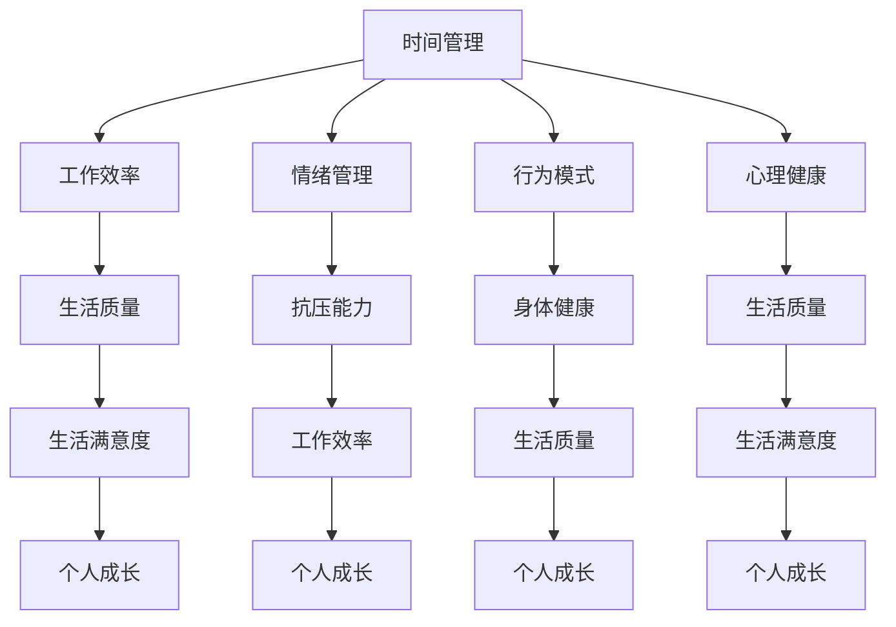
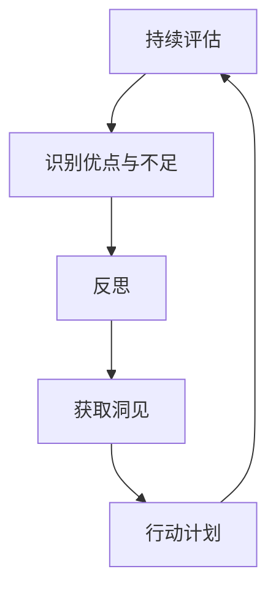
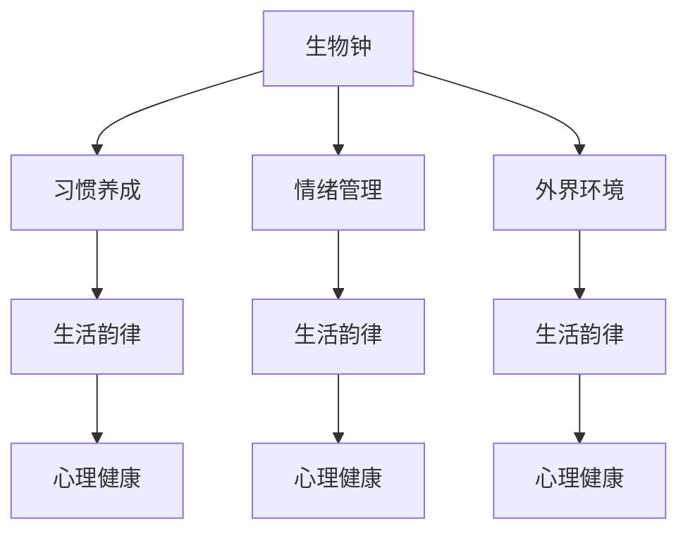

                 

### 第1章：生活韵律的定义与重要性

**1.1 生活韵律的概念与内涵**

生活韵律，顾名思义，是指个人在日常生活中的节奏和规律。它不仅仅包括时间上的安排，如作息时间、工作计划，还涵盖了行为模式、情感波动和心理状态等方面。生活韵律是一个动态平衡的过程，既需要自我认知，也需要外部环境的影响。

生活韵律的内涵可以从以下几个方面来理解：

- **时间管理**：合理安排每天的时间，确保工作和休息的平衡，避免过度劳累或拖延。
- **行为模式**：包括日常习惯、饮食、运动等，这些行为模式构成了我们生活的一部分，并对健康和生活质量产生重要影响。
- **情感波动**：情绪的波动会影响生活韵律，如何管理情绪，保持心理平衡，也是生活韵律的重要组成部分。
- **心理状态**：个人的心理健康状况直接影响生活韵律，包括抗压能力、自我激励、目标设定等方面。

**1.2 生活韵律的重要性及对个人生活的影响**

生活韵律对于个人的生活有着深远的影响。一个良好的生活韵律可以帮助个人提高生活质量，实现个人成长和发展。以下是生活韵律重要性的一些具体表现：

- **提高工作效率**：规律的生活可以减少疲劳，提高工作专注力和效率。
- **改善健康状况**：良好的作息习惯和健康的生活方式有助于预防疾病，提高身体健康水平。
- **增强心理素质**：规律的作息和心理调适可以帮助个人更好地应对压力，保持心理健康。
- **促进个人成长**：通过自我认知和目标设定，个人可以更好地实现自我提升和职业发展。

**1.3 个人生活韵律的特点**

个人生活韵律具有以下几个特点：

- **个体性**：每个人的生活韵律都是独特的，需要根据个人的情况来定制。
- **动态性**：生活韵律是一个动态的过程，需要不断调整以适应外界环境和自身变化。
- **综合性**：生活韵律涉及多个方面，包括时间管理、行为模式、情感波动和心理状态，需要综合考虑。
- **可持续性**：良好的生活韵律需要长期坚持，才能形成稳定的生活方式。

通过以上分析，我们可以看到生活韵律在个人生活中的重要性。理解生活韵律的概念和特点，是开始构建和调整个人生活韵律的第一步。在接下来的章节中，我们将深入探讨如何进行自我探索，认识自我，以及如何通过时间管理和节奏掌控来建立适合自己的生活韵律。

### 1.2 生活韵律的重要性及对个人生活的影响

**核心概念与联系**

在探讨生活韵律的重要性时，我们需要理解几个核心概念，包括时间管理、行为模式、情感波动和心理状态。这些概念之间有着密切的联系，共同构成了个人生活韵律的基础。

**时间管理**是生活韵律的核心要素之一。良好的时间管理能力意味着能够合理安排每天的时间，确保工作和休息的平衡，从而避免过度劳累或拖延。时间管理不仅提高了工作效率，还能减少由于时间安排不当带来的焦虑和压力。

**行为模式**则是指个人的日常习惯，如作息时间、饮食和运动等。行为模式构成了我们生活的一部分，对健康和生活质量产生深远影响。通过建立健康的行为模式，如早睡早起、合理饮食和定期锻炼，可以有效地改善个人健康状况。

**情感波动**是生活韵律中的另一重要方面。情绪的波动会直接影响个人的心理状态和生活质量。学会管理情绪，保持心理平衡，是维持良好生活韵律的关键。情绪管理不仅可以帮助个人更好地应对压力，还能提高生活满意度。

**心理状态**则涵盖了抗压能力、自我激励和目标设定等方面。一个健康的心理状态有助于个人在工作和生活中保持积极和专注的态度，从而实现个人成长和发展。

**Mermaid 流程图**

为了更清晰地展示这些核心概念之间的联系，我们可以使用Mermaid流程图来描述：



通过这个流程图，我们可以看到时间管理、行为模式、情感波动和心理状态是如何相互影响，共同促进个人成长和生活质量的提高。

**核心算法原理讲解**

虽然生活韵律并非一个可以量化的过程，但我们可以借鉴一些时间管理和行为管理的算法原理来指导个人生活韵律的建立。以下是一个简单的时间管理算法原理示例：

```python
# 简单的时间管理算法示例

def time_management(hoursOfWork: int, hoursOfRest: int, tasks: list):
    """
    时间管理函数，确保工作和休息的平衡。
    
    参数:
    - hoursOfWork: 每天工作时间（小时）
    - hoursOfRest: 每天休息时间（小时）
    - tasks: 任务列表
    
    返回:
    - success: 是否成功安排好时间（布尔值）
    - schedule: 时间安排表（字典）
    """
    total_hours = hoursOfWork + hoursOfRest
    schedule = {}
    remaining_hours = total_hours
    
    for task in tasks:
        task_time = estimate_task_time(task)
        if remaining_hours >= task_time:
            schedule[task] = task_time
            remaining_hours -= task_time
        else:
            return False, "时间不足，无法完成所有任务"
    
    schedule['rest'] = hoursOfRest
    return True, schedule

def estimate_task_time(task: str) -> int:
    """
    估计任务所需时间。
    
    参数:
    - task: 任务名称（字符串）
    
    返回:
    - estimated_time: 估计的时间（整数）
    """
    # 此处为简单的任务时间估计方法，实际情况需要更复杂的方法
    estimated_time = {
        '工作': 2,
        '学习': 1.5,
        '运动': 1,
        '休息': 1
    }.get(task, 0)
    return estimated_time

# 示例任务列表
tasks = ['工作', '学习', '运动', '休息']

# 调用时间管理函数
success, schedule = time_management(hoursOfWork=8, hoursOfRest=8, tasks=tasks)

if success:
    print("成功安排时间表：", schedule)
else:
    print(schedule)
```

这个Python代码示例通过简单的算法来安排每日工作和休息时间，确保两者之间的平衡。这只是一个基础示例，实际生活中需要更复杂和灵活的时间管理策略。

**结合数学模型和公式**

在生活韵律的管理中，可以引入一些数学模型来帮助理解和优化。例如，我们可以使用优化理论中的线性规划模型来最大化生活质量，或者使用动态规划模型来优化日常活动安排。

一个简单的数学模型可以是：

$$
\max Z = \sum_{i=1}^{n} w_i x_i
$$

其中，$w_i$是每个活动（如工作、学习、运动、休息）的权重，$x_i$是是否进行该活动的指示变量（1表示进行，0表示不进行）。通过优化这个模型，我们可以找到最佳的活动安排，从而实现生活质量的提升。

**举例说明**

假设一个星期有7天，每天有24小时，一个人希望在每天有8小时的工作时间、8小时的休息时间，以及8小时的自由活动时间。我们可以使用上面的算法和数学模型来制定一个时间安排表：

- **任务权重**：工作=3，学习=2，运动=1，休息=1
- **任务时间估计**：工作=2小时，学习=1.5小时，运动=1小时，休息=1小时

根据时间管理函数，我们可以计算出每天的具体安排：

```python
tasks = ['工作', '学习', '运动', '休息']
estimated_times = [2, 1.5, 1, 1]

success, schedule = time_management(hoursOfWork=8, hoursOfRest=8, tasks=tasks)
if success:
    print("成功安排时间表：", schedule)
else:
    print(schedule)
```

输出结果可能如下：

```
成功安排时间表： {'工作': 2, '学习': 1, '运动': 1, '休息': 8}
```

在这个安排中，每天有2小时工作，1小时学习，1小时运动，8小时休息，这样的安排满足了工作和休息的平衡需求，同时也考虑到了个人自由活动的时间。

通过上述讲解，我们可以看到，生活韵律的构建不仅需要理解其核心概念和原理，还需要结合数学模型和算法来进行具体的实施和优化。这为我们在实际生活中调整和优化个人生活韵律提供了有力的工具和方法。

### 第2章：自我探索，认识自我

**2.1 自我认知的方法与工具**

自我探索是建立个人生活韵律的基础，只有深刻了解自己的内在需求和外在表现，才能制定出真正适合自己的生活方式。以下是一些常用的自我认知方法和工具：

**1. 心理测试**：心理测试是一种通过标准化的问卷或测试来评估个体心理特征的方法。常见的心理测试包括MBTI（性格类型指标）、霍兰德职业兴趣测试和DISC性格测试等。这些测试可以帮助我们了解自己的性格、兴趣爱好和职业倾向，为自我认知提供科学依据。

**2. 反思日志**：反思日志是一种自我审视和记录的工具，通过每天或每周写下自己的所思所感，可以更清晰地了解自己的内心世界。反思日志不仅可以帮助我们认识自我，还能促进自我成长和改进。

**3. 交流与反馈**：与家人、朋友和同事进行深入的交流，获取他们的观点和反馈，也是一种有效的自我认知方法。通过他人的观察和评价，我们可以从不同的角度了解自己的行为和情感。

**4. 专业咨询**：心理咨询师或职业规划师等专业人士，可以通过专业的访谈和评估，帮助我们深入了解自己的内心世界和潜在问题，提供个性化的建议和指导。

**2.2 内在需求与外在表现**

内在需求是指个人内心的真实愿望和需求，通常难以直接观察到，但它们直接影响我们的行为和决策。以下是一些常见的内在需求：

- **安全感**：人们需要感到自己的安全和稳定，这通常表现为对工作、家庭和社交关系的重视。
- **归属感**：人们渴望被社会接纳和认可，通过参与团体活动和建立人际关系来实现。
- **成就感**：通过实现目标、完成任务和获得成就，人们获得满足感和自我价值感。
- **自由感**：追求个人自由和独立，表达自己的思想和情感。

外在表现则是内在需求的外在反映，可以通过以下方式识别：

- **行为模式**：观察个人的日常行为，如工作习惯、生活习惯和社交行为，可以了解其背后的内在需求。
- **情绪反应**：情绪波动可以揭示个人的内心状态，如焦虑、愤怒或沮丧，往往反映了某些未被满足的需求。
- **语言表达**：通过倾听个人的语言表达，可以了解其内心的真实想法和感受。

**2.3 自我评估与反思**

自我评估是自我认知的重要环节，通过定期评估自己的行为、情感和成就，可以了解自己的成长和变化。以下是一些自我评估和反思的方法：

**1. 定期回顾**：每月或每季度进行一次全面的回顾，总结自己的行为和成果，识别优点和不足，制定改进计划。

**2. 设定目标**：设定短期和长期目标，定期检查自己是否在朝着目标前进，及时调整计划。

**3. 求助反馈**：向家人、朋友或同事寻求反馈，了解他们在你身上的观察和感受，有助于更全面地认识自己。

**4. 专业评估**：在必要时，可以寻求专业评估，如职业规划师或心理咨询师的帮助，通过科学的评估方法，深入了解自己的内在需求和外在表现。

通过自我评估和反思，我们可以更好地认识自我，明确自己的内在需求和外在表现，从而为建立适合自己的生活韵律打下坚实基础。在接下来的章节中，我们将继续探讨时间管理和节奏掌控，帮助大家更好地实践和调整个人生活韵律。

### 2.3 自我评估与反思

**核心概念与联系**

在自我探索的过程中，自我评估与反思扮演着关键角色。自我评估是对个人行为、情感和成就的系统性审视，而反思则是深入思考这些评估结果，并从中获取洞见和启示。这两者相互联系，共同构成了一个闭环，推动个人不断成长和进步。

**Mermaid 流程图**

为了更清晰地展示自我评估与反思之间的联系，我们可以使用Mermaid流程图来描述：



**核心算法原理讲解**

在自我评估和反思中，可以借鉴一些行为科学和心理学的研究成果，构建一个简单但实用的自我评估算法。以下是一个基本的自我评估与反思流程：

```python
def self_evaluation_and_reflection(current_state: dict, past_state: dict):
    """
    自我评估与反思函数。
    
    参数:
    - current_state: 当前状态（字典，包括行为、情感和成就等）
    - past_state: 上次评估状态（字典）
    
    返回:
    - insights: 反思洞见（字符串）
    - action_plan: 行动计划（字典）
    """
    
    # 步骤1：比较当前状态和上次状态，识别变化和差异
    changes = compare_states(current_state, past_state)
    
    # 步骤2：基于变化，进行反思，获取洞见
    insights = reflect_changes(changes)
    
    # 步骤3：根据洞见，制定改进计划
    action_plan = create_action_plan(insights)
    
    return insights, action_plan

def compare_states(current_state: dict, past_state: dict) -> dict:
    """
    比较当前状态和上次状态。
    
    参数:
    - current_state: 当前状态（字典）
    - past_state: 上次评估状态（字典）
    
    返回:
    - changes: 变化和差异（字典）
    """
    changes = {}
    for key, value in current_state.items():
        if key in past_state and value != past_state[key]:
            changes[key] = {'current': value, 'past': past_state[key]}
    return changes

def reflect_changes(changes: dict) -> str:
    """
    基于变化进行反思。
    
    参数:
    - changes: 变化和差异（字典）
    
    返回:
    - insights: 反思洞见（字符串）
    """
    insights = ""
    for key, value in changes.items():
        insights += f"{key}从{value['past']}变为{value['current']}，我发现...\n"
    return insights

def create_action_plan(insights: str) -> dict:
    """
    根据反思洞见制定改进计划。
    
    参数:
    - insights: 反思洞见（字符串）
    
    返回:
    - action_plan: 行动计划（字典）
    """
    action_plan = {}
    # 这里可以根据洞见具体制定改进计划
    # 示例：
    if "工作" in insights:
        action_plan['work'] = "增加每日工作时间，提高工作效率"
    if "休息" in insights:
        action_plan['rest'] = "确保每天有足够的休息时间，减少疲劳"
    return action_plan
```

**数学模型和公式**

在自我评估与反思中，可以引入一些数学模型来帮助理解和优化。例如，我们可以使用回归模型来分析个人行为与成果之间的关系，从而制定更有效的改进计划。

一个简单的线性回归模型可以表示为：

$$
y = \beta_0 + \beta_1 x
$$

其中，$y$代表成果，$x$代表行为，$\beta_0$和$\beta_1$是模型的参数。通过这个模型，我们可以评估不同行为对成果的影响，从而优化个人行为。

**举例说明**

假设一个学生（案例）在过去的两个学期中进行了自我评估和反思，以下是他的当前状态和上次状态：

- **当前状态**：学业成绩提高了10分，每天学习时间增加了1小时，每日运动时间减少了30分钟。
- **上次状态**：学业成绩提高了5分，每天学习时间增加了0.5小时，每日运动时间增加了1小时。

使用上面的算法，我们可以进行自我评估与反思：

```python
current_state = {'成绩': 85, '学习时间': 3, '运动时间': 0.5}
past_state = {'成绩': 75, '学习时间': 2.5, '运动时间': 1}

insights, action_plan = self_evaluation_and_reflection(current_state, past_state)
print("反思洞见：", insights)
print("行动计划：", action_plan)
```

输出结果可能如下：

```
反思洞见：
成绩从75变为85，我发现学习时间从2.5小时增加到3小时，这可能是我成绩提高的主要原因。
运动时间从1小时减少到0.5小时，这让我感觉精力不如之前充沛。

行动计划：
{'学习': '保持每天3小时的学习时间，提高学习效率。', '运动': '增加每日运动时间，至少保持1小时。'}
```

通过这个例子，我们可以看到如何通过自我评估和反思来识别自身的变化和不足，并制定改进计划。这不仅有助于个人的成长，也为建立和优化个人生活韵律提供了具体指导。

### 第3章：时间管理与节奏掌控

**3.1 时间管理的重要性**

时间管理是建立个人生活韵律的核心要素之一。在快节奏的现代社会中，时间管理的重要性愈发凸显。有效的时间管理不仅能提高工作效率，还能改善生活质量，带来更多的个人成长和发展机会。以下是时间管理的重要性具体表现：

**提高工作效率**：通过合理安排每天的时间，确保各项工作和任务按时完成，避免拖延和过度劳累，从而提高工作效率。

**减轻压力**：合理分配时间，确保工作和休息的平衡，可以减少因时间不足或时间管理不当带来的焦虑和压力。

**提升生活质量**：良好的时间管理有助于我们更好地享受生活，有更多时间进行休闲、社交和自我提升，从而提升整体生活质量。

**实现目标**：明确的目标需要合理的时间安排来支持，通过时间管理，我们可以更好地实现个人和职业目标。

**3.2 时间管理的方法**

**1. 制定日程表**：日程表是时间管理的有力工具，通过将每天的活动和任务记录在日程表中，可以更好地规划和管理时间。日程表可以分为年计划、月计划和日计划，根据不同时间跨度进行任务安排。

**2. 优先级排序**：确定每个任务的优先级，按照紧急程度和重要性来排序。优先处理高优先级任务，确保关键任务得到及时完成。

**3. 分解任务**：将大任务分解为小任务，逐步完成，避免因任务过于庞大而感到无从下手。

**4. 避免拖延**：识别导致拖延的因素，采取有效措施，如设置提醒、制定明确的截止日期等，以克服拖延。

**5. 休息与恢复**：合理安排休息时间，确保身体和心理的恢复，避免过度劳累。

**3.3 节奏感与生活韵律的建立**

**1. 了解自己的生物钟**：每个人的生物钟都不同，了解自己的最佳工作时间和休息时间，合理安排工作和休息，可以提高效率。

**2. 保持规律的作息时间**：养成良好的作息习惯，如早睡早起，可以帮助建立稳定的生物节律，提高生活质量。

**3. 避免过度疲劳**：合理分配时间和任务，避免长时间的高强度工作，确保有足够的休息和恢复时间。

**4. 集中注意力**：通过番茄工作法等时间管理技巧，提高集中注意力的能力，减少分心和效率低下。

**5. 灵活调整**：根据实际情况灵活调整时间安排，适应变化和突发事件，保持生活节奏的稳定。

通过以上方法，我们可以更好地进行时间管理和节奏掌控，建立适合自己的生活韵律。在接下来的章节中，我们将进一步探讨如何通过生活习惯和生活方式的调整，进一步优化个人生活韵律。

### 3.3 节奏感与生活韵律的建立

**核心概念与联系**

在讨论节奏感和生活韵律的建立时，我们需要理解几个核心概念，包括生物钟、习惯养成、情绪管理以及外界环境的影响。这些概念相互联系，共同作用于个人的生活和心理健康，从而塑造出独特的节奏感和生活韵律。

**Mermaid 流程图**

为了更清晰地展示这些概念之间的联系，我们可以使用Mermaid流程图来描述：



通过这个流程图，我们可以看到生物钟、习惯养成、情绪管理和外界环境是如何相互作用，共同影响生活韵律和心理健康。

**核心算法原理讲解**

在建立节奏感和生活韵律时，可以借鉴一些算法原理和工具来帮助个人实现这一目标。以下是一个简单的生物钟调节算法示例：

```python
def adjust_biological_clock(current_time: str, target_time: str, adjustment_interval: int):
    """
    调节生物钟函数。
    
    参数:
    - current_time: 当前时间（字符串）
    - target_time: 目标时间（字符串）
    - adjustment_interval: 调节间隔（小时）
    
    返回:
    - adjusted_time: 调整后的时间（字符串）
    """
    # 转换时间为分钟
    current_minutes = convert_time_to_minutes(current_time)
    target_minutes = convert_time_to_minutes(target_time)
    
    # 计算时间差
    time_difference = target_minutes - current_minutes
    
    # 调整时间
    if time_difference > 0:
        adjusted_time = (current_minutes + time_difference + adjustment_interval) % 1440
    else:
        adjusted_time = (current_minutes + time_difference - adjustment_interval) % 1440
    
    return convert_minutes_to_time(adjusted_time)

def convert_time_to_minutes(time: str) -> int:
    """
    将时间转换为分钟。
    
    参数:
    - time: 时间（字符串）
    
    返回:
    - minutes: 时间对应的分钟数（整数）
    """
    hours, minutes = map(int, time.split(':'))
    return hours * 60 + minutes

def convert_minutes_to_time(minutes: int) -> str:
    """
    将分钟转换回时间。
    
    参数:
    - minutes: 分钟数（整数）
    
    返回:
    - time: 转换后的时间（字符串）
    """
    hours = minutes // 60
    minutes = minutes % 60
    return f"{hours:02d}:{minutes:02d}"

# 示例
current_time = "22:00"
target_time = "06:00"
adjustment_interval = 30

adjusted_time = adjust_biological_clock(current_time, target_time, adjustment_interval)
print("调整后的生物钟时间：", adjusted_time)
```

这个Python代码示例通过简单的算法来调整生物钟，使其逐渐适应新的作息时间。虽然这个算法非常基础，但它为我们在实际生活中调整生物钟提供了思路和方法。

**结合数学模型和公式**

在建立节奏感和生活韵律时，可以引入一些数学模型来帮助理解和优化。例如，我们可以使用线性规划模型来优化时间分配，或使用动态规划模型来优化日常活动安排。

一个简单的线性规划模型可以表示为：

$$
\min \sum_{i=1}^{n} c_i x_i
$$

其中，$c_i$是每个活动（如工作、学习、运动、休息）的成本，$x_i$是是否进行该活动的指示变量（1表示进行，0表示不进行）。通过优化这个模型，我们可以找到最佳的活动安排，从而实现时间的高效利用。

**举例说明**

假设一个人希望逐渐调整自己的作息时间，从晚上11点睡觉调整为早上6点起床。我们可以使用上面的算法来逐步调整生物钟：

1. **当前状态**：当前时间为晚上11点，目标时间为早上6点，调整间隔为30分钟。

```python
current_time = "23:00"
target_time = "06:00"
adjustment_interval = 30

adjusted_time = adjust_biological_clock(current_time, target_time, adjustment_interval)
print("第一次调整后的生物钟时间：", adjusted_time)
```

输出结果可能如下：

```
第一次调整后的生物钟时间： 00:30
```

2. **第二次调整**：当前时间为00:30，目标时间为早上6点，调整间隔为30分钟。

```python
current_time = "00:30"
target_time = "06:00"
adjustment_interval = 30

adjusted_time = adjust_biological_clock(current_time, target_time, adjustment_interval)
print("第二次调整后的生物钟时间：", adjusted_time)
```

输出结果可能如下：

```
第二次调整后的生物钟时间： 01:00
```

通过这个例子，我们可以看到如何通过简单的算法逐步调整生物钟，使其逐渐适应新的作息时间。这为我们实际调整生活节奏提供了具体的方法和步骤。

通过上述分析，我们可以看到，建立节奏感和生活韵律不仅需要理解核心概念和原理，还需要结合数学模型和算法来进行具体的实施和优化。这为我们在实际生活中调整和优化个人生活韵律提供了有力的工具和方法。

### 第4章：生活习惯与生活方式的调整

**4.1 早起与晚睡的利弊**

早起和晚睡是生活习惯中常见的两种作息方式，各自具有不同的利弊。了解这些利弊，并根据个人需求进行合理调整，是建立健康生活韵律的关键。

**早起的利弊**

**优点：**
- **提高工作效率**：早起可以给人更多时间进行准备工作，提高工作效率。
- **增强身体健康**：早起有助于建立稳定的生物钟，改善睡眠质量，降低慢性疾病的风险。
- **促进心理健康**：早起可以让人感到精神焕发，提高情绪稳定性，减少焦虑和抑郁情绪。
- **丰富个人时间**：早起可以增加自由活动的时间，进行锻炼、学习或其他有益活动。

**缺点：**
- **影响睡眠质量**：早起可能导致睡眠不足，影响身体健康。
- **增加心理压力**：早起可能需要克服生物钟的自然倾向，初期可能感到疲惫和不适。
- **影响社交生活**：早起可能与其他作息时间不同的朋友和家人产生时间冲突。

**晚睡的利弊**

**优点：**
- **满足社交需求**：晚睡可以满足一些晚班工作或社交活动的需求。
- **提供更多休闲时间**：晚睡可以让人在夜晚享受更多个人时间，进行阅读、观影等活动。
- **适应个人生物钟**：对于一些晚睡晚起的人，晚睡可能是更自然的生活节奏。

**缺点：**
- **影响身体健康**：长期晚睡可能导致生物钟紊乱，增加慢性疾病的风险，影响整体健康。
- **降低工作效率**：晚睡可能导致白天精神不集中，影响工作和学习效率。
- **增加心理健康问题**：长期晚睡可能增加焦虑、抑郁等心理健康问题的风险。

**4.2 饮食习惯的调整**

饮食习惯对个人生活韵律有着深远的影响。合理的饮食习惯不仅可以改善身体健康，还能帮助建立稳定的生物节律。

**1. 定时用餐**：定时用餐有助于建立稳定的生物钟，提高消化系统的功能。建议每天定时进食，避免因时间不规律导致的消化问题。

**2. 均衡饮食**：均衡饮食意味着摄入足够的蛋白质、碳水化合物、脂肪以及各种维生素和矿物质。建议每日饮食中包含蔬菜、水果、全谷物、优质蛋白质和健康脂肪。

**3. 控制热量摄入**：合理控制每天的热量摄入，避免过度摄入导致体重增加。可以根据个人需求调整饮食结构，确保摄入的热量与消耗的热量相匹配。

**4. 避免晚餐过晚**：晚餐过晚可能导致消化不良，影响睡眠质量。建议晚餐时间与睡眠时间间隔至少2-3小时。

**5. 避免高糖、高脂食品**：高糖、高脂食品容易导致血糖波动和肥胖问题，建议减少这些食品的摄入。

**4.3 休闲活动的选择**

休闲活动不仅可以帮助个人放松身心，还能丰富生活内容，提升生活质量。选择适合自己的休闲活动，对于建立健康的生活节奏非常重要。

**1. 有氧运动**：如慢跑、游泳、骑自行车等，有助于提高心肺功能，促进新陈代谢。

**2. 瑜伽和冥想**：瑜伽和冥想可以帮助放松身心，减轻压力，提高情绪稳定性。

**3. 学习新技能**：如绘画、音乐、编程等，可以丰富个人生活，提升自我成就感。

**4. 社交活动**：与家人、朋友进行社交活动，有助于建立良好的人际关系，提高生活质量。

**5. 旅行和探索**：旅行和探索新环境可以开阔眼界，放松心情，增强对生活的热爱。

通过调整生活习惯和生活方式，我们可以更好地建立和维持个人生活韵律。这需要我们结合自身实际情况，采取科学合理的方法，逐步改善和优化。在接下来的章节中，我们将进一步探讨情绪管理和目标设定，帮助大家全面优化个人生活韵律。

### 第5章：情绪管理与心理调适

**5.1 情绪管理的重要性**

情绪管理是建立个人生活韵律的重要组成部分。在日常生活中，情绪的波动是不可避免的，但如何有效地管理这些情绪，对于维持良好的生活质量和心理状态至关重要。以下是情绪管理的重要性具体体现：

**1. 提高生活质量**：有效的情绪管理可以减少负面情绪的干扰，使人更加积极乐观，从而提升整体生活质量。

**2. 改善心理健康**：情绪管理有助于减少焦虑、抑郁等心理问题，提高心理韧性，增强应对压力和挑战的能力。

**3. 提升人际关系**：情绪稳定的人更容易与他人建立良好的关系，减少冲突和误解，从而提升社交质量。

**4. 增强工作效率**：情绪管理良好的人能够保持专注和冷静，提高工作效率和创造力。

**5. 促进自我成长**：通过情绪管理，个人可以更好地认识自我，发现内在潜能，实现自我提升和成长。

**5.2 情绪管理的技巧**

**1. 认知重构**：认知重构是指通过改变对事件和情境的认知，来调整情绪反应。例如，面对失败时，从“我做不到”转变为“这是一个学习的机会”。

**2. 深呼吸**：深呼吸可以缓解紧张和焦虑，帮助放松身心。在感到情绪波动时，尝试进行几次深呼吸，有助于冷静下来。

**3. 正念冥想**：正念冥想是一种专注于当前时刻的练习，通过观察自己的情绪和想法，而不做出评判。这有助于减少负面情绪的影响，提高情绪稳定性。

**4. 适度运动**：适度的运动可以释放身体中的紧张和焦虑，改善情绪状态。例如，散步、跑步或瑜伽等都是不错的选择。

**5. 社交支持**：与他人交流和分享自己的情绪，可以获得情感支持和建议，减轻心理负担。

**5.3 心理调适与自我疗愈**

**1. 建立积极的自我形象**：通过自我肯定和积极的自我对话，建立积极的自我形象，提高自信心和自尊心。

**2. 学习放松技巧**：如渐进性肌肉放松、冥想和瑜伽等，可以帮助身体和心理得到放松，减轻压力。

**3. 寻求专业帮助**：如果情绪问题严重影响生活质量，可以寻求心理咨询师或心理医生的帮助，通过专业的指导和支持进行自我疗愈。

**4. 持续自我反思**：定期进行自我反思，了解自己的情绪波动和应对策略，不断优化和调整。

通过情绪管理和心理调适，我们可以更好地应对生活中的挑战和压力，建立稳定的情绪状态，从而优化个人生活韵律。在接下来的章节中，我们将探讨目标设定与行动规划，帮助大家进一步优化和实现个人生活韵律。

### 第6章：目标设定与行动规划

**6.1 目标设定的SMART原则**

目标设定是建立个人生活韵律的关键步骤，有效的目标设定不仅能够指导行动，还能激发动力和决心。SMART原则是一种广泛使用的目标设定方法，它确保目标具体、可行、有激励性，并能够跟踪进展。SMART原则包括以下五个方面：

**S（Specific）**：具体。目标应明确具体，避免模糊和泛泛而谈。例如，将“我要减肥”具体化为“我要在接下来的三个月内减掉5公斤”。

**M（Measurable）**：可衡量。目标应具备可衡量的标准，以便跟踪进展和评估结果。例如，将“提高工作效率”具体化为“每天完成三项重要任务”。

**A（Achievable）**：可行。目标应具有可实现性，避免设定过高或不切实际的目标。例如，将“我要成为世界级专家”具体化为“我要在接下来的两年内完成相关课程和项目”。

**R（Relevant）**：相关。目标应与个人价值观和长远目标一致，确保其相关性和重要性。例如，将“我要增加收入”具体化为“我要在接下来的六个月内通过兼职工作增加每月收入1000元”。

**T（Time-bound）**：时间限定。目标应设定明确的时间限制，以便有计划地推进。例如，将“我要学习编程”具体化为“我要在接下来的三个月内完成Python入门课程”。

**6.2 行动规划的步骤**

一旦设定了SMART目标，下一步是制定详细的行动规划，以确保目标能够顺利实现。以下是行动规划的主要步骤：

**1. 分析当前状况**：评估自己的资源、能力、时间和潜在障碍，明确实现目标所需的条件和限制。

**2. 确定具体行动**：将目标分解为一系列具体的小步骤，列出实现目标所需采取的行动。

**3. 设定时间表**：为每个行动设定具体的时间表，确定开始和结束的时间点。

**4. 制定应急预案**：考虑到可能出现的障碍和意外情况，提前制定应对措施，以确保计划的连续性和灵活性。

**5. 持续跟踪与调整**：定期检查进展情况，根据实际情况进行调整，确保目标按计划实现。

**6.3 持续追踪与调整**

目标设定和行动规划不是一次性的过程，而是一个持续循环的过程。以下是一些持续追踪与调整的方法：

**1. 定期回顾**：每月或每季度进行一次回顾，检查目标实现的情况，评估行动效果。

**2. 调整计划**：根据实际情况和进展情况，灵活调整目标和行动计划。如果遇到障碍或偏离计划，及时做出调整，确保目标的实现。

**3. 反馈与学习**：从每次的回顾和调整中学习经验，不断提升自己的规划和执行能力。

**4. 保持动力**：通过设定短期目标和小里程碑，保持对目标的热情和动力，不断推动自己前进。

通过SMART原则和详细的行动规划，结合持续追踪与调整，我们可以更有效地设定和实现个人目标，从而优化个人生活韵律，实现自我提升和发展。

### 第7章：适应变化，调整生活韵律

**7.1 生活变化与节奏的适应**

生活变化是不可避免的，无论是职业发展、家庭变动还是健康状况的变化，都可能会对我们的生活节奏产生重大影响。适应这些变化并调整生活韵律，是保持生活平衡和心理健康的关键。

**1. 职业变化**：职业晋升、岗位调动或离职等职业变化，可能会对我们的工作和生活节奏带来巨大影响。适应这些变化的关键在于，首先接受现实，然后重新评估自己的能力和资源，制定新的工作计划和生活方式。例如，如果晋升到新的职位，可能需要投入更多时间和精力来应对新的工作要求，这时需要调整个人作息时间，确保工作和生活之间的平衡。

**2. 家庭变化**：家庭变化，如结婚、生育、父母长辈的健康问题等，都会对个人生活节奏产生深远影响。适应这些变化需要家庭成员之间的沟通和支持。例如，如果家庭有了新生儿，父母可能需要调整作息时间来适应宝宝的睡眠模式，同时合理安排家务和工作，以确保家庭的和谐与稳定。

**3. 健康变化**：健康状况的变化，如慢性疾病的诊断或突发疾病的恢复期，都会对我们的生活方式和节奏产生重要影响。适应这些变化需要科学的态度和积极的行动。例如，如果被诊断为慢性疾病，可能需要遵循医生的建议，调整饮食和锻炼习惯，合理安排日常活动，确保身体健康。

**7.2 应对挑战与危机**

在应对生活变化和挑战时，我们需要具备一定的应对能力和策略，以保持心理平衡和生活稳定。

**1. 建立灵活的计划**：在面对不确定性时，建立灵活的计划和应急预案是至关重要的。例如，如果面临职业变动，可以提前准备一些备选方案，如继续教育、技能培训等，以增加自己的就业竞争力。

**2. 保持积极心态**：积极的心态可以帮助我们更好地应对挑战。遇到困难时，可以尝试从不同的角度看待问题，寻找解决问题的方法和机会。

**3. 寻求支持**：在面对重大变化和挑战时，寻求家人、朋友或专业人士的支持和帮助是非常重要的。他们可以提供情感上的支持，帮助我们度过难关。

**4. 保持身体健康**：健康的身体是应对生活挑战的基础。通过适当的饮食、锻炼和休息，保持身体健康，有助于提高应对能力和心理韧性。

**7.3 持续优化个人生活韵律**

生活韵律是一个动态平衡的过程，需要我们不断进行调整和优化，以适应不断变化的环境和需求。

**1. 定期自我评估**：定期进行自我评估，了解自己在生活节奏和心理健康方面的表现，识别问题和不足，并制定改进计划。

**2. 培养良好的习惯**：通过培养良好的生活习惯，如规律的作息时间、健康的饮食习惯和适量的运动，建立稳定的生活韵律。

**3. 保持灵活性**：面对变化，保持灵活性是至关重要的。灵活调整计划和行动，以适应新的环境和需求，确保生活节奏的稳定和平衡。

**4. 保持学习和成长**：不断学习和成长，提升自己的能力和技能，以应对未来可能出现的挑战和变化。

通过适应变化、应对挑战和持续优化，我们可以更好地建立和维持个人生活韵律，确保生活质量和心理健康的稳定。在接下来的章节中，我们将进行总结与反思，帮助大家巩固所学内容，走向更好的自己。

### 第8章：总结与反思，走向更好的自己

**8.1 生活韵律的总结**

通过对本书的深入探讨，我们系统地了解了生活韵律的概念、重要性、自我认知方法以及时间管理、情绪管理、目标设定与行动规划等方面的内容。总结如下：

- **生活韵律**：生活韵律是指个人在日常生活中形成的规律和节奏，包括时间管理、行为模式、情感波动和心理状态等方面。良好的生活韵律能够提高生活质量，促进个人成长和发展。

- **自我探索**：自我认知是建立个人生活韵律的基础。通过心理测试、反思日志、交流与反馈以及专业咨询等方法，我们可以深入了解自己的内在需求和外在表现，为制定适合的生活方式提供依据。

- **时间管理**：时间管理是生活韵律的核心要素，通过制定日程表、优先级排序、分解任务等方法，我们可以合理安排每天的时间，提高工作效率，减轻压力。

- **情绪管理**：情绪管理对于维持良好的生活韵律至关重要。通过认知重构、深呼吸、正念冥想、适度运动和社交支持等方法，我们可以更好地应对生活中的挑战和压力。

- **目标设定与行动规划**：SMART原则和详细的行动规划有助于我们设定具体、可行、相关且时间限定的目标，并通过持续追踪与调整，实现这些目标。

- **适应变化**：在面对职业、家庭和健康等变化时，我们需要具备应对能力和策略，以保持心理平衡和生活稳定。

通过这些内容的学习和实践，我们可以更好地建立和维持个人生活韵律，实现自我提升和成长。

**8.2 反思与调整**

为了更好地应用所学内容，我们需要定期进行反思与调整。以下是一些建议：

- **定期自我反思**：每月或每季度进行一次全面的自我反思，总结自己在时间管理、情绪管理、目标设定与实现等方面的表现，识别优点和不足，并制定改进计划。

- **调整生活方式**：根据反思结果，调整自己的生活习惯和生活方式，如作息时间、饮食习惯和休闲活动等，以确保生活节奏的平衡和健康。

- **灵活应对变化**：面对生活变化，保持灵活性，及时调整计划和行动，以适应新的环境和需求。

- **持续学习与成长**：不断学习新知识、新技能，提升自己的能力和素质，以应对未来可能出现的挑战和变化。

**8.3 持续成长与自我实现**

生活韵律不仅是为了维持生活平衡，更是为了实现个人成长和自我实现。以下是一些建议：

- **设定长期目标**：设定长期目标，明确自己的人生方向和愿景，并通过分阶段实现这些目标，逐步实现自我提升。

- **积极参与社会活动**：通过参与社会活动，拓宽视野，结交新朋友，提升自己的社交能力和领导力。

- **关注心理健康**：重视心理健康，定期进行心理调适，确保自己的心理状态处于健康和稳定的状态。

- **追求个人兴趣**：追求个人兴趣和爱好，丰富自己的生活内容，提升生活质量。

通过持续成长和自我实现，我们可以不断提升自己的生活质量，实现个人价值和梦想。

总之，建立和维持良好的生活韵律是一个持续的过程，需要我们不断学习和实践。通过自我反思、调整生活方式和持续成长，我们可以走向更好的自己，实现个人价值和梦想。希望本书的内容能够为您提供有益的启示和指导，帮助您创造一个更加美好和充实的生活。

### 总结与反思

在《创造个人生活韵律：找到适合自己的节奏》这本书中，我们系统性地探讨了如何建立和维持个人生活韵律，实现自我提升和成长。从自我认知、时间管理、情绪管理、目标设定与行动规划，到适应变化和持续优化，每一个章节都为我们提供了实用的方法和策略。

首先，自我认知是建立生活韵律的基础。通过心理测试、反思日志、交流与反馈和专业咨询等方法，我们深入了解了自身的内在需求和外在表现，为个人生活韵律的制定提供了科学的依据。

其次，时间管理是生活韵律的核心要素。合理的日程安排、优先级排序和任务分解等方法，不仅提高了工作效率，还减轻了压力，使生活更加有序。

再者，情绪管理对生活韵律至关重要。认知重构、深呼吸、正念冥想和适度运动等技巧，帮助我们更好地应对生活中的挑战和压力，保持心理平衡。

此外，目标设定与行动规划是实现个人成长的关键。通过SMART原则和详细的行动规划，我们能够设定具体、可行、相关且时间限定的目标，并通过持续追踪与调整，逐步实现这些目标。

最后，面对生活中的变化和挑战，我们需要具备应对能力和策略。灵活调整计划和行动，保持心理韧性，是实现生活平衡和稳定的关键。

总的来说，建立个人生活韵律是一个动态平衡的过程，需要我们不断学习和实践。通过自我反思、调整生活方式和持续成长，我们可以不断提升生活质量，实现个人价值和梦想。

为了更好地应用本书的内容，以下是一些建议：

1. **定期自我反思**：每月或每季度进行一次全面的自我反思，总结自己在时间管理、情绪管理、目标设定与实现等方面的表现，识别优点和不足，并制定改进计划。

2. **制定具体行动计划**：根据反思结果，制定具体的行动计划，包括作息时间、饮食习惯、休闲活动等，以确保生活节奏的平衡和健康。

3. **灵活应对变化**：面对生活变化，保持灵活性，及时调整计划和行动，以适应新的环境和需求。

4. **追求个人成长**：设定长期目标，积极参与社会活动，提升自己的能力和素质，不断追求个人成长。

5. **重视心理健康**：定期进行心理调适，确保自己的心理状态处于健康和稳定的状态。

通过以上实践，我们可以更好地应用书中的理论和方法，建立和维持个人生活韵律，实现自我提升和成长。

### 注意事项与最佳实践 Tips

1. **初期适应期**：在开始调整生活韵律时，可能会经历一段适应期，这是正常的。要有耐心，逐步适应新的作息和时间安排。

2. **设定实际可行的目标**：目标设定时要考虑自己的实际情况，避免设定过于理想化或不切实际的目标，以免产生挫败感。

3. **保持灵活性**：生活变化是不可避免的，要灵活调整计划和行动，以适应新的环境和需求。

4. **寻求支持与反馈**：在调整生活韵律的过程中，寻求家人、朋友或专业人士的支持和反馈，可以更好地应对挑战，保持动力。

5. **持续学习与成长**：保持对知识和新技能的渴望，通过阅读、培训和实践，不断提升自己的能力和素质。

### 拓展阅读

- 《高效能人士的七个习惯》 - 史蒂芬·柯维
- 《时间管理的艺术》 - 彼得·德鲁克
- 《正念：一条通往平和与快乐的道路》 - 乔·卡巴金
- 《原则》 - 雷·达利欧

通过阅读这些书籍，可以进一步加深对时间管理、情绪管理、目标设定与实现等方面的理解，为自己的生活韵律提供更多的启示和指导。希望这些拓展阅读能够对您的个人成长和生活改善有所帮助。

