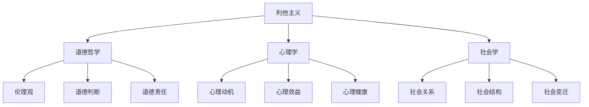

                 

# 《利他主义的力量：在奉献中找到人生价值》

## 关键词
利他主义，道德哲学，心理学，社会学，积极社会氛围，个人潜能，可持续发展，全球共同体，实践方法，案例分析。

## 摘要
本文旨在探讨利他主义在现代社会中的重要作用，通过历史背景、道德哲学、心理学、社会学等多个角度，详细阐述了利他主义的概念及其力量。文章分析了利他主义如何创造积极的社会氛围、激发个人潜能、促进企业和社会的可持续发展，以及构建全球共同体。最后，文章提出了实践中的利他主义方法与技巧，并通过案例分析展示了利他主义实践的成功经验。通过本文，我们希望读者能够深刻认识到利他主义的力量，并在日常生活中践行利他主义，从而实现个人价值和社会进步的双重提升。

## 目录

### 《利他主义的力量：在奉献中找到人生价值》

#### 第一部分：利他主义的基本概念

##### 1.1 利他主义的历史背景与发展

###### 1.1.1 利他主义的起源

##### 1.1.2 利他主义在不同文化中的体现

##### 1.1.3 利他主义在现代社会的重要性

###### 1.2 利他主义与道德哲学

##### 1.2.1 利他主义的伦理观

##### 1.2.2 利他主义与道德判断

##### 1.2.3 利他主义与道德责任

###### 1.3 利他主义与心理学

##### 1.3.1 利他主义的心理动机

##### 1.3.2 利他主义的心理效益

##### 1.3.3 利他主义与心理健康

###### 1.4 利他主义与社会学

##### 1.4.1 利他主义与社会关系

##### 1.4.2 利他主义与社会结构

##### 1.4.3 利他主义在社会变迁中的作用

#### 第二部分：利他主义的力量

##### 2.1 利他主义的力量之一：创造积极的社会氛围

###### 2.1.1 利他主义如何促进社会和谐

##### 2.1.2 利他主义如何减少社会冲突

##### 2.1.3 利他主义在公共事务中的应用

##### 2.2 利他主义的力量之二：激发个人潜能

###### 2.2.1 利他主义如何提升个人幸福感

##### 2.2.2 利他主义如何培养个人责任感

##### 2.2.3 利他主义在个人成长中的应用

##### 2.3 利他主义的力量之三：促进企业和社会的可持续发展

###### 2.3.1 利他主义与企业社会责任

##### 2.3.2 利他主义与企业的可持续发展

##### 2.3.3 利他主义在企业管理中的应用

##### 2.4 利他主义的力量之四：构建全球共同体

###### 2.4.1 利他主义与全球合作

##### 2.4.2 利他主义与国际援助

##### 2.4.3 利他主义与全球公民意识

#### 第三部分：实践中的利他主义

##### 3.1 利他主义实践的理论基础

###### 3.1.1 利他主义实践的心理学基础

##### 3.1.2 利他主义实践的社会学基础

##### 3.1.3 利他主义实践的哲学基础

##### 3.2 利他主义实践的方法与技巧

###### 3.2.1 利他主义实践的具体方法

##### 3.2.2 利他主义实践中的障碍与解决策略

##### 3.2.3 利他主义实践中的成功案例

##### 3.3 利他主义实践的案例分析

###### 3.3.1 慈善事业的利他主义实践

##### 3.3.2 志愿服务的利他主义实践

##### 3.3.3 企业社会责任的利他主义实践

##### 3.4 利他主义实践的未来展望

###### 3.4.1 利他主义实践的趋势

##### 3.4.2 利他主义实践面临的挑战

##### 3.4.3 利他主义实践的未来发展前景

#### 附录

##### 附录A：利他主义实践的工具与资源

###### A.1 利他主义实践的主要平台和机构

##### 附录B：利他主义实践的相关书籍推荐

###### B.1 利他主义理论著作

##### 附录C：利他主义的核心概念实体关系架构

###### C.1 利他主义的核心概念实体关系架构

##### 附录D：利他主义算法的Python实现

###### D.1 利他主义算法的Python实现

### Mermaid 流程图：利他主义的核心概念实体关系架构



### Python 源代码：详细阐述一个简单的利他主义算法

```python
def altruistic_algorithm(x):
    """
    一个简单的利他主义算法，用于模拟个体之间的利他行为。
    
    参数：
    x：个体的贡献值
    
    返回：
    利他行为的总价值
    """
    
    # 利他主义的基本原理：个体的贡献会放大
    altruism_value = x * 1.5
    
    # 考虑个体之间的相互影响，进一步放大利他行为的价值
    social_effect = 1 + (x / 10)
    
    # 利他行为的总价值
    total_altruism_value = altruism_value * social_effect
    
    return total_altruism_value
```

## 第一部分：利他主义的基本概念

### 1.1 利他主义的历史背景与发展

利他主义（Altruism）一词起源于拉丁语“altru”，意为“另一个”或“他人”。它是一种道德观念，强调个体在行动中考虑他人的利益，甚至愿意为了他人的利益而牺牲自己的利益。利他主义的历史可以追溯到古代哲学和宗教，其在不同文化和社会中有着不同的表现形式。

#### 1.1.1 利他主义的起源

利他主义的起源可以追溯到古代希腊哲学家亚里士多德，他在其著作《尼各马可伦理学》中提出了“友爱”（Philia）的概念，强调了个体之间基于相互尊重和关心的关系。此后，康德、斯宾诺莎等哲学家也在其伦理学体系中提出了利他主义的观点。

在中国文化中，利他主义有着深厚的传统。儒家思想强调“仁爱”和“忠恕”之道，即个体应该关爱他人，对待他人如同对待自己。佛教则强调“慈悲为怀”，主张以无私的心态对待世间万物。

#### 1.1.2 利他主义在不同文化中的体现

利他主义在不同文化中的体现形式有所不同。在西方文化中，利他主义通常与慈善行为、志愿者服务、社会公益活动等相关联。许多宗教组织和慈善机构都在积极推广利他主义价值观，鼓励信徒和会员为他人和社会做出贡献。

在中国文化中，利他主义体现在家庭和社会关系中。传统上，中国人强调“孝道”和“忠诚”，即子女应该照顾年迈的父母，而下属应该忠于上司。此外，许多社会公益活动，如捐款、捐血、扶贫等，也在弘扬利他主义精神。

#### 1.1.3 利他主义在现代社会的重要性

在现代社会，利他主义的重要性日益凸显。随着全球化进程的加快，人们的社会关系变得更加复杂，社会问题也日益增多。利他主义提供了一种解决这些问题的思路，即通过关注他人和社会的需要，共同创造一个更加和谐、公正的社会。

首先，利他主义有助于促进社会和谐。当个体关心他人、愿意为他人付出时，社会矛盾和冲突就会减少。利他主义精神可以激发人们的合作意识，促进社会合作，从而实现社会的稳定与发展。

其次，利他主义有助于培养个人的道德品质。通过关心他人，个体能够培养同情心、责任感和忠诚等美德。这些美德不仅有助于个体的成长，也有助于建立和谐的人际关系，提高个体的幸福感。

最后，利他主义在现代社会中具有重要的实践意义。随着社会问题的日益严重，许多国家和组织都在积极推广利他主义，开展各种公益活动，如扶贫、环保、教育等。这些活动不仅有助于解决社会问题，也有助于提高社会的整体幸福水平。

### 1.2 利他主义与道德哲学

#### 1.2.1 利他主义的伦理观

利他主义的伦理观认为，个体的行为应该以他人的利益为出发点。这种伦理观强调个体的道德责任，要求个体在行动中考虑他人的需求和利益。利他主义伦理观的核心是“无私”，即个体的行为不应受个人利益的影响，而是出于对他人和社会的责任感。

#### 1.2.2 利他主义与道德判断

利他主义与道德判断密切相关。在道德判断中，个体会评估他人的行为是否符合道德规范。利他主义强调个体应该做出有利于他人的行为，从而在道德判断中具有重要的指导作用。

然而，利他主义也引发了一些道德哲学上的争议。一些哲学家认为，利他主义可能导致个体忽视自身的利益，从而影响个体的自我实现。此外，如何衡量个体的利他行为的价值，也是一个值得探讨的问题。

#### 1.2.3 利他主义与道德责任

利他主义与道德责任密切相关。道德责任要求个体在行动中考虑他人的利益，从而对他人和社会负责。利他主义强调个体的道德责任，要求个体在行动中做出有利于他人的选择。

在现代社会，道德责任日益凸显。随着社会问题的增多，个体在社会中的角色和责任也发生了变化。利他主义提供了一种道德责任的理念，即个体应该关注他人和社会的需求，从而在道德上对他人和社会负责。

### 1.3 利他主义与心理学

#### 1.3.1 利他主义的心理动机

利他主义的心理动机源于个体的内心需求。心理学家认为，个体的行为受到多种心理动机的驱动，包括同情心、责任感、自尊心等。利他主义行为通常源于个体对他人痛苦的感知和对他人的关心。

研究表明，利他主义行为能够带来积极的情绪体验，如幸福感、满足感和成就感。这些积极的情绪体验进一步增强了个体进行利他行为的动力。

#### 1.3.2 利他主义的心理效益

利他主义不仅能够带来积极的情绪体验，还有助于个体的心理健康。研究发现，经常进行利他行为的个体通常拥有更好的心理状态，如较低的焦虑、抑郁水平，较高的自尊和幸福感。

此外，利他主义还有助于建立和谐的人际关系。通过关心他人，个体能够获得他人的尊重和信任，从而在社交中获得更多的支持。

#### 1.3.3 利他主义与心理健康

利他主义与心理健康之间存在密切关系。经常进行利他行为的个体通常拥有更好的心理状态，这主要表现在以下几个方面：

1. **较低的焦虑和抑郁水平**：研究表明，利他主义行为能够减轻个体的焦虑和抑郁情绪，使个体拥有更好的心理状态。

2. **较高的自尊和幸福感**：利他主义行为能够带来积极的情绪体验，如幸福感、满足感和成就感，从而提高个体的自尊和幸福感。

3. **更好的应对压力能力**：利他主义行为能够增强个体的心理韧性，使个体在面对压力和困难时能够更好地应对。

4. **促进社交支持**：通过关心他人，个体能够获得他人的尊重和信任，从而在社交中获得更多的支持，提高个体的心理健康水平。

### 1.4 利他主义与社会学

#### 1.4.1 利他主义与社会关系

利他主义在社会关系中发挥着重要作用。通过关心他人、愿意为他人付出，个体能够建立和谐的人际关系。这种人际关系不仅有助于个体的成长和发展，也有助于社会的稳定和发展。

首先，利他主义有助于建立信任和尊重。当个体关心他人、愿意为他人付出时，他人会感受到这种关爱和尊重，从而建立起信任关系。这种信任关系有助于社会的稳定和发展。

其次，利他主义有助于减少社会冲突。在社会中，个体之间的利益往往存在冲突。然而，通过利他主义行为，个体能够减少利益冲突，促进社会和谐。

#### 1.4.2 利他主义与社会结构

利他主义在社会结构中也发挥着重要作用。社会结构包括家庭、社区、国家和国际组织等。利他主义行为有助于这些社会结构的稳定和发展。

首先，利他主义有助于家庭关系的稳定。家庭是社会的基本单位，家庭关系的稳定对于社会的稳定和发展至关重要。利他主义行为能够增强家庭成员之间的关爱和尊重，从而促进家庭关系的稳定。

其次，利他主义有助于社区的发展和繁荣。社区是社会的重要组成部分，社区的发展和繁荣对于社会的稳定和发展至关重要。利他主义行为能够促进社区成员之间的合作和互助，从而推动社区的发展和繁荣。

最后，利他主义有助于国家和国际组织的稳定和发展。国家和国际组织是社会的高级形式，它们的稳定和发展对于社会的稳定和发展至关重要。利他主义行为能够促进国家之间的合作和互助，从而推动国家和国际组织的稳定和发展。

#### 1.4.3 利他主义在社会变迁中的作用

利他主义在社会变迁中发挥着重要作用。社会变迁是指社会结构、文化、价值观等方面的变化。在社会变迁中，利他主义有助于推动社会的进步和发展。

首先，利他主义有助于社会价值观的转变。在社会变迁中，社会价值观往往发生变化。利他主义作为一种道德观念，能够引导个体关注他人和社会的需求，促进社会价值观的转变。

其次，利他主义有助于社会制度的改革。社会变迁往往伴随着社会制度的改革。利他主义行为能够促进社会制度的改革，使社会更加公正、公平。

最后，利他主义有助于社会矛盾的缓解。在社会变迁中，社会矛盾往往加剧。利他主义行为能够缓解社会矛盾，促进社会的稳定和发展。

## 第二部分：利他主义的力量

### 2.1 利他主义的力量之一：创造积极的社会氛围

#### 2.1.1 利他主义如何促进社会和谐

利他主义通过个体的无私行为，有助于促进社会的和谐。在利他主义的影响下，个体愿意为他人和社会付出，这种精神能够消除社会矛盾，促进社会和谐。

首先，利他主义能够减少社会冲突。在社会中，个体之间的利益往往存在冲突。然而，通过利他主义行为，个体能够减少利益冲突，促进社会和谐。例如，在企业中，员工通过关心同事、帮助他人，能够减少内部矛盾，提高团队协作效率。

其次，利他主义能够增强社会凝聚力。利他主义行为能够激发个体对社会的归属感和责任感，从而增强社会的凝聚力。例如，在社区中，居民通过参与志愿活动、帮助邻居，能够增强社区成员之间的联系，提高社区的凝聚力。

#### 2.1.2 利他主义如何减少社会冲突

利他主义在减少社会冲突方面具有重要作用。通过关心他人、愿意为他人付出，个体能够减少社会矛盾，促进社会和谐。

首先，利他主义能够促进社会公平。在社会中，不公平现象往往引发社会冲突。通过利他主义行为，个体能够为弱势群体提供帮助，促进社会公平，减少社会冲突。例如，慈善机构通过捐款、捐物等行为，帮助贫困地区的人民，从而减少社会不公平现象。

其次，利他主义能够缓解社会紧张。在社会中，紧张情绪往往导致冲突。通过利他主义行为，个体能够缓解社会紧张，减少社会冲突。例如，在自然灾害发生后，志愿者积极参与救援工作，帮助受灾群众，从而缓解社会紧张情绪。

#### 2.1.3 利他主义在公共事务中的应用

利他主义在公共事务中的应用具有广泛性。通过关心他人和社会，个体能够积极参与公共事务，促进社会的发展和进步。

首先，利他主义在慈善事业中的应用。慈善机构通过筹集善款、捐物等行为，帮助贫困地区的人民、支持教育事业等，发挥了重要的社会作用。例如，红十字会通过全球范围内的慈善活动，帮助受灾群众，缓解社会矛盾。

其次，利他主义在志愿服务中的应用。志愿服务是一种无私奉献的行为，个体通过参与志愿服务，为他人和社会提供帮助。例如，在社区中，志愿者为老年人提供生活帮助、为儿童提供教育支持等，发挥了重要作用。

最后，利他主义在公共政策制定中的应用。在公共政策制定过程中，政府需要听取民意、关注民众需求。通过利他主义精神，政府能够更好地了解民众需求，制定出更加符合民众利益的政策。

### 2.2 利他主义的力量之二：激发个人潜能

#### 2.2.1 利他主义如何提升个人幸福感

利他主义能够提升个人幸福感。通过关心他人、愿意为他人付出，个体能够获得内心的满足和幸福感。

首先，利他主义能够激发个体的同情心。同情心是指个体对他人的痛苦和需求产生共鸣和关心的情感。通过关心他人，个体能够激发同情心，从而获得内心的满足。

其次，利他主义能够培养个体的责任感。责任感是指个体对自己的行为和他人利益负责的态度。通过关心他人，个体能够培养责任感，从而在行为中更加慎重和负责任。

最后，利他主义能够提高个体的自尊。自尊是指个体对自己的价值和能力的认同。通过关心他人，个体能够获得他人的尊重和认可，从而提高自尊。

#### 2.2.2 利他主义如何培养个人责任感

利他主义能够培养个人责任感。通过关心他人、愿意为他人付出，个体能够意识到自己的行为对他人的影响，从而培养责任感。

首先，利他主义能够激发个体的责任感。个体通过关心他人、愿意为他人付出，能够意识到自己的行为对他人的重要性，从而激发责任感。

其次，利他主义能够培养个体的责任感。个体在参与利他主义行为中，需要考虑他人的需求和利益，从而培养责任感。例如，在志愿服务中，志愿者需要为受助者提供帮助，这要求志愿者具有强烈的责任感。

最后，利他主义能够增强个体的责任感。通过关心他人、愿意为他人付出，个体能够感受到他人的需求，从而增强责任感。例如，在慈善活动中，个体通过捐款、捐物等行为，能够感受到受助者的需求，从而增强责任感。

#### 2.2.3 利他主义在个人成长中的应用

利他主义在个人成长中具有重要作用。通过关心他人、愿意为他人付出，个体能够实现个人成长和发展。

首先，利他主义能够培养个体的同理心。同理心是指个体对他人的情感和心理产生共鸣和理解的能力。通过关心他人，个体能够培养同理心，从而更好地理解和关心他人。

其次，利他主义能够培养个体的领导力。领导力是指个体在团队中发挥领导作用的能力。通过参与利他主义行为，个体能够锻炼领导力，从而在团队中更好地发挥领导作用。

最后，利他主义能够培养个体的沟通能力。沟通能力是指个体与他人交流和沟通的能力。通过关心他人、愿意为他人付出，个体能够提高沟通能力，从而更好地与他人交流和沟通。

### 2.3 利他主义的力量之三：促进企业和社会的可持续发展

#### 2.3.1 利他主义与企业社会责任

利他主义与企业社会责任（CSR）密切相关。企业社会责任是指企业在追求经济效益的同时，关注社会和环境问题，承担社会责任的行为。利他主义为企业社会责任提供了道德基础，鼓励企业在经营过程中关注他人和社会的需求。

首先，利他主义能够激励企业承担社会责任。企业在追求经济效益的同时，通过关注社会和环境问题，能够实现经济、社会和环境的可持续发展。

其次，利他主义能够提升企业的社会形象。企业通过积极参与社会公益活动、支持慈善事业等，能够树立良好的企业形象，增强社会认可度。

最后，利他主义能够促进企业的长期发展。企业通过承担社会责任，能够赢得消费者的信任和支持，从而实现长期发展。

#### 2.3.2 利他主义与企业的可持续发展

利他主义与企业的可持续发展密切相关。企业的可持续发展是指在满足当前需求的同时，不损害后代满足其需求的能力。利他主义为企业的可持续发展提供了道德指导，鼓励企业在经营过程中关注他人和社会的需求。

首先，利他主义能够激励企业关注环境保护。企业在经营过程中，通过采取环保措施、减少污染等，能够实现环境保护，为可持续发展奠定基础。

其次，利他主义能够激励企业关注社会问题。企业通过参与社会公益活动、支持慈善事业等，能够解决社会问题，为社会可持续发展作出贡献。

最后，利他主义能够提升企业的社会责任感。企业通过关注他人和社会的需求，能够增强社会责任感，从而实现可持续发展。

#### 2.3.3 利他主义在企业管理中的应用

利他主义在企业管理中具有重要作用。通过关心员工、关注社会和环境问题，企业能够实现员工满意、社会满意和利润最大化的目标。

首先，利他主义能够提高员工满意度。企业通过关心员工的需求，提供良好的工作环境和福利待遇，能够提高员工的工作积极性和满意度。

其次，利他主义能够增强员工的归属感。企业通过关注员工的生活和工作，能够增强员工的归属感，从而提高员工的忠诚度和稳定性。

最后，利他主义能够提升企业的社会形象。企业通过参与社会公益活动、支持慈善事业等，能够树立良好的企业形象，增强社会认可度。

### 2.4 利他主义的力量之四：构建全球共同体

#### 2.4.1 利他主义与全球合作

利他主义在全球合作中具有重要作用。随着全球化进程的加快，各国之间的联系日益紧密，全球合作成为解决全球问题的重要途径。利他主义精神鼓励各国之间开展合作，共同解决全球问题。

首先，利他主义能够促进国际间的相互理解和信任。通过关心他人、愿意为他人付出，各国能够增进相互理解和信任，为全球合作奠定基础。

其次，利他主义能够推动全球合作。各国通过合作，共同应对全球性问题，如气候变化、贫困问题等，能够实现全球共同繁荣。

最后，利他主义能够促进全球公民意识的培养。全球公民意识是指个体在全球化背景下，关心全球问题和全球公民的权利。通过利他主义行为，个体能够培养全球公民意识，为全球共同体建设作出贡献。

#### 2.4.2 利他主义与国际援助

利他主义在国际援助中发挥着重要作用。国际援助是指发达国家向发展中国家提供经济、技术、人道等方面的援助。利他主义精神鼓励各国之间开展国际援助，共同应对全球性问题。

首先，利他主义能够推动国际援助的开展。发达国家通过关心发展中国家的问题，提供经济援助和技术支持，能够促进全球贫困问题的解决。

其次，利他主义能够提高国际援助的效率。通过关心他人、愿意为他人付出，国际援助组织能够更好地了解受援国和受援者的需求，从而提高援助的效率和效果。

最后，利他主义能够培养国际援助的精神。国际援助不仅仅是物质和经济的援助，更是一种精神上的支持。通过利他主义行为，国际援助组织能够培养国际援助的精神，为全球共同体的建设作出贡献。

#### 2.4.3 利他主义与全球公民意识

利他主义与全球公民意识密切相关。全球公民意识是指个体在全球化背景下，关心全球问题和全球公民的权利。利他主义行为能够培养全球公民意识，促进全球共同体的建设。

首先，利他主义能够培养个体的全球公民意识。通过关心他人、愿意为他人付出，个体能够培养全球公民意识，关心全球问题和全球公民的权利。

其次，利他主义能够促进全球公民之间的相互理解。通过关心他人、愿意为他人付出，全球公民能够增进相互理解，为全球共同体的建设作出贡献。

最后，利他主义能够推动全球公民的共同行动。通过关心他人、愿意为他人付出，全球公民能够共同应对全球问题，实现全球共同繁荣。

## 第三部分：实践中的利他主义

### 3.1 利他主义实践的理论基础

#### 3.1.1 利他主义实践的心理学基础

利他主义实践的心理学基础主要涉及个体的心理动机、心理效益和心理健康等方面。研究表明，个体进行利他主义行为通常受到以下心理动机的驱动：

1. **同情心**：同情心是指个体对他人的痛苦和需求产生共鸣的情感。同情心是利他主义行为的重要心理基础，促使个体关注他人、愿意为他人付出。

2. **责任感**：责任感是指个体对自己的行为和他人利益负责的态度。利他主义行为能够培养个体的责任感，使个体在行动中更加慎重和负责任。

3. **自我实现**：自我实现是指个体追求个人成长和发展，实现个人潜能的过程。利他主义行为能够满足个体的自我实现需求，使个体在利他行为中实现自我价值。

4. **道德义务**：道德义务是指个体基于道德规范所承担的责任。利他主义行为源于个体的道德义务，使个体在道德上对他人和社会负责。

#### 3.1.2 利他主义实践的社会学基础

利他主义实践的社会学基础主要涉及社会关系、社会结构和社会变迁等方面。社会学研究表明，利他主义行为在社会中具有以下重要作用：

1. **社会关系**：利他主义行为能够增强个体之间的社会关系。通过关心他人、愿意为他人付出，个体能够建立信任、尊重和关爱，从而促进社会和谐。

2. **社会结构**：利他主义行为有助于社会结构的稳定和发展。在社会结构中，利他主义行为能够促进家庭、社区和社会的稳定，推动社会进步。

3. **社会变迁**：利他主义行为能够推动社会变迁。在社会变迁中，利他主义行为能够引导个体关注社会问题、参与社会改革，促进社会的公平、公正和进步。

#### 3.1.3 利他主义实践的哲学基础

利他主义实践的哲学基础主要涉及伦理观、道德哲学和哲学理念等方面。哲学研究表明，利他主义行为具有以下哲学意义：

1. **伦理观**：利他主义是一种伦理观，强调个体在行动中考虑他人的利益，甚至愿意为他人牺牲自己的利益。利他主义伦理观为个体的行为提供了道德指导，使个体在道德上对他人和社会负责。

2. **道德哲学**：利他主义道德哲学关注个体行为的道德价值和道德责任。利他主义行为源于个体的道德义务，使个体在道德上对他人和社会负责。

3. **哲学理念**：利他主义哲学理念强调个体的无私行为和道德责任。通过关心他人、愿意为他人付出，个体能够实现个人价值和社会进步的双重提升。

### 3.2 利他主义实践的方法与技巧

#### 3.2.1 利他主义实践的具体方法

利他主义实践的具体方法包括以下几个方面：

1. **志愿服务**：志愿服务是指个体自愿为他人和社会提供帮助的行为。志愿服务是一种典型的利他主义实践方式，个体通过志愿服务能够关心他人、愿意为他人付出。

2. **慈善捐赠**：慈善捐赠是指个体或组织为慈善事业提供资金、物资等支持的行为。慈善捐赠是一种重要的利他主义实践方式，个体通过慈善捐赠能够帮助弱势群体、支持社会公益事业。

3. **社会参与**：社会参与是指个体参与社会事务、关心社会问题、为社会进步作出贡献的行为。社会参与是一种广泛的利他主义实践方式，个体通过社会参与能够关注社会问题、参与社会改革。

4. **环境保护**：环境保护是指个体关注环境问题、采取环保措施的行为。环境保护是一种重要的利他主义实践方式，个体通过环境保护能够保护自然环境、为后代留下美好的家园。

5. **教育支持**：教育支持是指个体为教育事业提供帮助的行为。教育支持是一种典型的利他主义实践方式，个体通过教育支持能够帮助贫困地区的学生、支持教育事业的发展。

#### 3.2.2 利他主义实践中的障碍与解决策略

在利他主义实践中，个体可能会遇到一些障碍。以下是一些常见的障碍及其解决策略：

1. **时间和精力有限**：个体在利他主义实践中可能会感到时间和精力有限。解决策略：合理安排时间，设定优先级，确保在有限的时间内为他人和社会做出最大的贡献。

2. **资源不足**：个体在利他主义实践中可能会遇到资源不足的问题。解决策略：寻找合作伙伴，整合资源，通过合作实现资源共享，提高利他主义实践的效率。

3. **社会排斥**：个体在利他主义实践中可能会面临社会排斥。解决策略：加强沟通，建立信任，通过积极的沟通和合作消除社会排斥，促进社会包容。

4. **道德困境**：个体在利他主义实践中可能会遇到道德困境。解决策略：遵循道德原则，坚持道德信念，通过道德思考和道德实践解决道德困境。

5. **社会压力**：个体在利他主义实践中可能会面临社会压力。解决策略：坚持自我信念，关注内心需求，通过坚定的信念和积极的态度应对社会压力。

#### 3.2.3 利他主义实践中的成功案例

以下是一些利他主义实践的成功案例：

1. **慈善组织**：如“红

