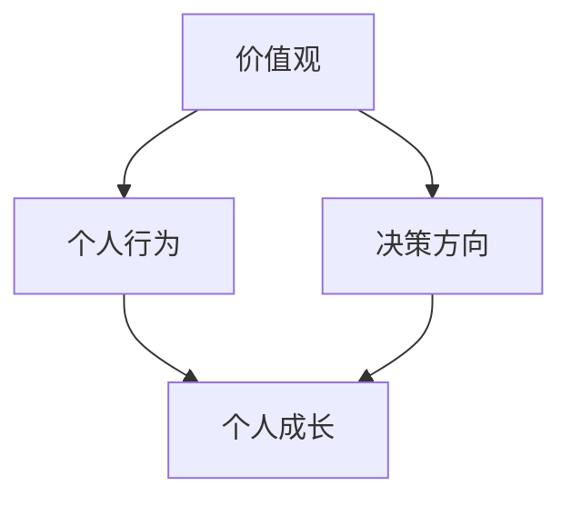
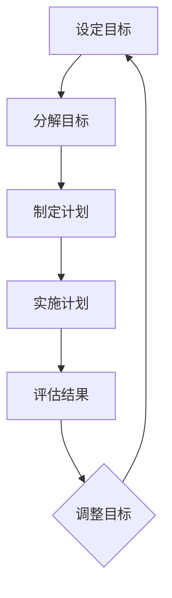
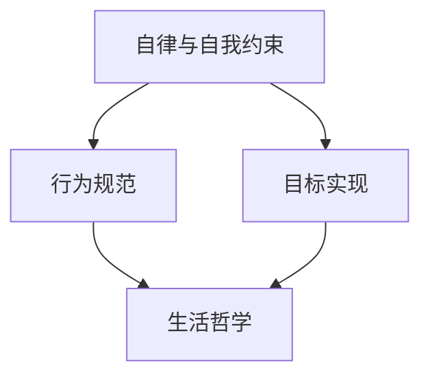
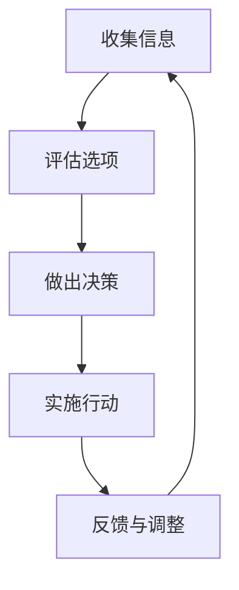
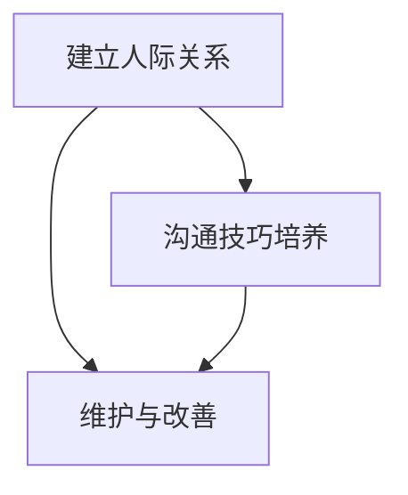
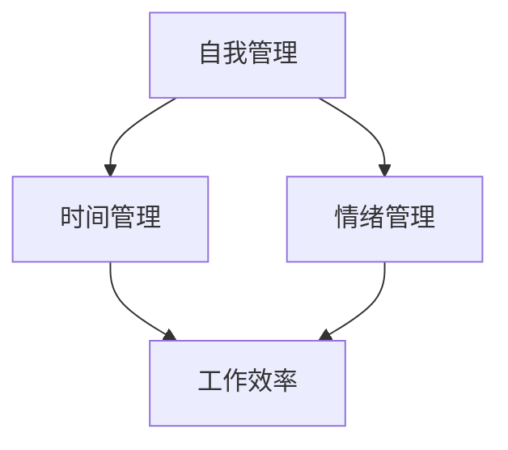
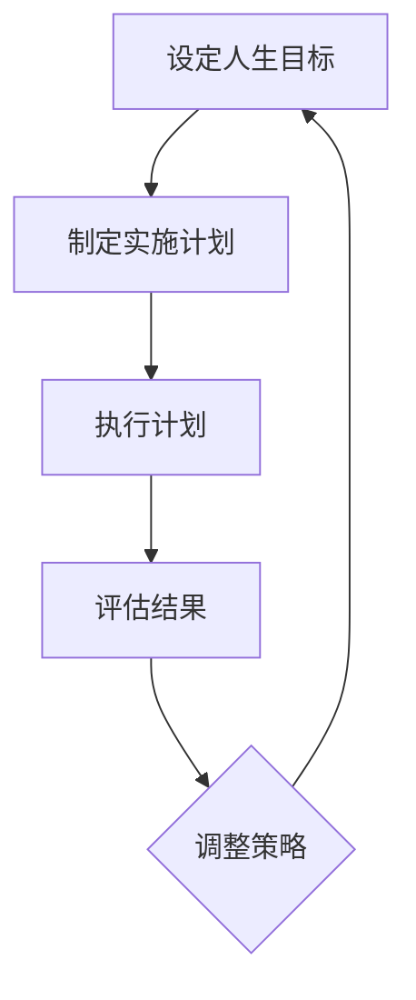
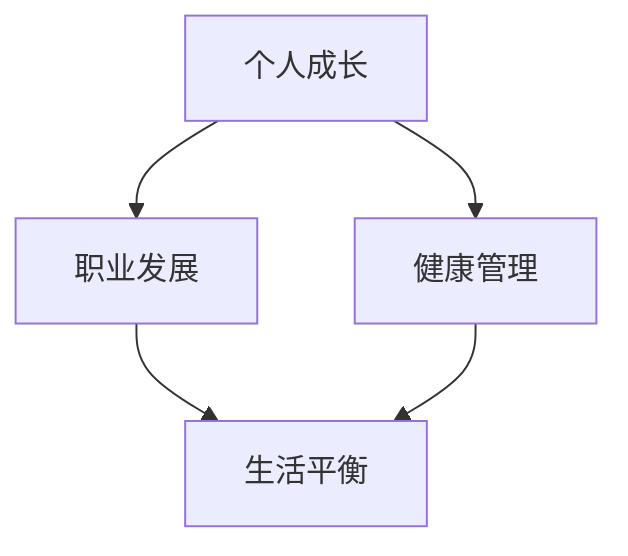

                 


### 第二部分：生活哲学的构建

## 第2章：生活哲学的核心概念与原则

### 2.1 价值观的识别与构建

**背景介绍：**
在构建个人生活哲学的过程中，价值观扮演着至关重要的角色。它们不仅指导我们的行为和决策，而且影响着我们的个人成长和幸福感。因此，理解并识别价值观是构建生活哲学的第一步。

**核心概念与联系：**
- **价值观**：价值观是个人对事物的重要性的内在认知和评价标准。它可以是伦理道德、家庭责任、事业成功等。
- **个人行为和决策**：价值观直接影响个人行为和决策，是决定个人行动方向的关键因素。
- **生活哲学**：生活哲学是个人对生活目的、意义和价值的系统性思考，而价值观则是其核心组成部分。

**Mermaid 流程图：**


**核心算法原理讲解：**
价值观的识别与构建可以通过以下步骤进行：

```python
class ValueIdentification:
    def __init__(self):
        self.values = []

    def reflect_on_life(self):
        # 反思生活经历，识别重要事项
        experiences = ["结婚", "旅行", "职业发展", "健康", "学习"]
        for experience in experiences:
            self.values.append(experience)

    def filter_values(self):
        # 从重要事项中筛选核心价值观
        self.values = list(set(self.values))  # 去重
        self.values.sort(key=lambda x: len(x))  # 按字数排序

    def display_values(self):
        # 显示核心价值观
        for value in self.values:
            print(f"- {value}")

value_id = ValueIdentification()
value_id.reflect_on_life()
value_id.filter_values()
value_id.display_values()
```

**数学模型和数学公式：**
- **价值函数**：用 $V(x)$ 表示个人的价值函数，$x$ 为具体的价值观。
- **价值矩阵**：通过构造价值矩阵，可以量化不同价值观之间的相对重要性。

$$
\begin{bmatrix}
V(健康) & V(家庭) & V(事业) \\
V(健康) & V(家庭) & V(事业) \\
V(健康) & V(家庭) & V(事业) \\
\end{batrix}
$$

**项目实战：**
**案例背景：**
张三是一名企业家，他在公司取得了巨大的成功，但时常感到内心的空虚。为了找到生活的意义，他决定识别和构建自己的价值观。

**实施步骤：**

1. **反思生活经历**：张三回顾了自己的职业生涯、家庭生活、社交关系等，列出对自己有重要影响的事项。

2. **筛选核心价值观**：通过反思，张三确定了以下核心价值观：家庭、健康、事业、学习和创新。

3. **制定价值观矩阵**：张三通过主观评分法，给每个价值观分配权重，形成了以下价值观矩阵。

$$
\begin{bmatrix}
0.4 & 0.2 & 0.2 & 0.1 & 0.1 \\
0.4 & 0.2 & 0.2 & 0.1 & 0.1 \\
0.4 & 0.2 & 0.2 & 0.1 & 0.1 \\
\end{bmatrix}
$$

4. **应用价值观矩阵**：张三在做出决策时，会参考价值观矩阵，确保自己的行为和决策符合核心价值观。

**代码实现：**
```python
class ValueMatrix:
    def __init__(self, values, weights):
        self.values = values
        self.weights = weights

    def calculate_value(self, action):
        # 计算特定行为的总价值
        value_sum = 0
        for i, value in enumerate(self.values):
            if action == value:
                value_sum += self.weights[i]
        return value_sum

family_value_matrix = ValueMatrix(["家庭", "健康", "事业", "学习", "创新"], [0.4, 0.2, 0.2, 0.1, 0.1])
print(f"家庭的价值分数：{family_value_matrix.calculate_value('家庭')}")

# 假设张三面临是否加班的决定
decision = "加班"
value_score = family_value_matrix.calculate_value(decision)
print(f"决定 {decision} 的价值分数：{value_score}")
```

**最佳实践 Tips：**
- **定期反思**：定期反思自己的生活经历，确保核心价值观不会因时间的流逝而改变。
- **动态调整**：随着个人成长和环境变化，定期调整价值观矩阵，确保其反映当前状态。

**小结：**
价值观的识别与构建是构建个人生活哲学的基础。通过理解和应用价值函数和价值观矩阵，个人可以更好地指导自己的行为和决策，实现生活目标。

### 注意事项：
- **重视内心需求**：识别价值观时，要关注内心真正渴望的东西，而不仅仅是社会期望。
- **保持灵活性**：随着时间的变化，核心价值观可能会有所调整，保持灵活性是必要的。

**拓展阅读：**
- 《原则》（Principles）- 雷·达里奥（Ray Dalio）
- 《高效能人士的七个习惯》（The 7 Habits of Highly Effective People）- 史蒂芬·柯维（Stephen R. Covey）

### 2.2 目标的设定与实现

**背景介绍：**
在确定了核心价值观之后，设定明确的目标是实现生活哲学的关键步骤。目标为个人提供了具体的方向和动力，是实现核心价值观的具体化。

**核心概念与联系：**
- **目标**：目标是指个人希望达到的具体成果或状态，是价值观的具体化。
- **短期与长期目标**：短期目标通常在一年内实现，而长期目标可能需要数年甚至更长时间。
- **目标管理**：目标管理是一种系统化的方法，用于设定、追踪和实现目标。

**Mermaid 流程图：**


**核心算法原理讲解：**
目标的设定与实现可以通过以下步骤进行：

```python
class GoalSetting:
    def __init__(self):
        self.short_term_goals = []
        self.long_term_goals = []

    def set_goals(self, short_term, long_term):
        self.short_term_goals.append(short_term)
        self.long_term_goals.append(long_term)

    def display_goals(self):
        print("短期目标：")
        for goal in self.short_term_goals:
            print(f"- {goal}")
        print("长期目标：")
        for goal in self.long_term_goals:
            print(f"- {goal}")

    def check_progress(self, current_date):
        # 检查目标进度
        print("当前进度：")
        for goal in self.short_term_goals:
            if current_date < goal:
                print(f"- {goal}：未完成")
            else:
                print(f"- {goal}：已完成")
        for goal in self.long_term_goals:
            if current_date < goal:
                print(f"- {goal}：未完成")
            else:
                print(f"- {goal}：已完成")

current_date = "2023-12-31"
goal_manager = GoalSetting()
goal_manager.set_goals(["学习Python", "完成年度工作目标"], ["创业成功", "实现财务自由"])
goal_manager.display_goals()
goal_manager.check_progress(current_date)
```

**数学模型和数学公式：**
- **目标达成率**：用 $R(t)$ 表示目标达成率，$t$ 为时间。
- **目标达成度**：用 $D(t)$ 表示目标达成度，$t$ 为时间。

$$
D(t) = \frac{已完成的任务数}{总任务数}
$$

**项目实战：**
**案例背景：**
李四是大学三年级的学生，他希望通过大学期间的目标设定，为未来的职业发展打下坚实的基础。

**实施步骤：**

1. **设定短期目标**：李四确定了以下短期目标：提高学术成绩、掌握编程技能、参与实习。

2. **设定长期目标**：李四确定了以下长期目标：获得一份理想的工作、在五年内晋升为项目经理。

3. **制定实现计划**：李四制定了具体的行动计划，包括每学期的学习目标、编程技能的提升计划、实习的准备工作等。

4. **实施计划**：李四开始执行计划，通过自律和坚持逐步实现短期目标。

5. **评估结果**：每个学期末，李四评估自己的进度，并根据实际情况调整目标。

**代码实现：**
```python
class GoalManager:
    def __init__(self, short_term_goals, long_term_goals):
        self.short_term_goals = short_term_goals
        self.long_term_goals = long_term_goals

    def plan_execution(self):
        # 计划执行
        for goal in self.short_term_goals:
            print(f"执行短期目标：{goal}")
        for goal in self.long_term_goals:
            print(f"执行长期目标：{goal}")

    def evaluate_progress(self, semester):
        # 评估进度
        print(f"评估第 {semester} 学期的进度：")
        for goal in self.short_term_goals:
            if semester < goal['end_semester']:
                print(f"- {goal['name']}：未完成")
            else:
                print(f"- {goal['name']}：已完成")
        for goal in self.long_term_goals:
            if semester < goal['end_semester']:
                print(f"- {goal['name']}：未完成")
            else:
                print(f"- {goal['name']}：已完成")

short_term_goals = [
    {"name": "提高学术成绩", "end_semester": 6},
    {"name": "掌握编程技能", "end_semester": 5},
    {"name": "参与实习", "end_semester": 5}
]

long_term_goals = [
    {"name": "获得一份理想的工作", "end_semester": 8},
    {"name": "在五年内晋升为项目经理", "end_semester": 8}
]

goal_manager = GoalManager(short_term_goals, long_term_goals)
goal_manager.plan_execution()
goal_manager.evaluate_progress(3)
```

**最佳实践 Tips：**
- **明确目标**：确保目标具体、明确和可衡量。
- **分阶段实施**：将长期目标分解为短期目标，分阶段实施。
- **定期评估**：定期评估目标进度，及时调整计划。

**小结：**
目标的设定与实现是构建个人生活哲学的重要环节。通过明确的目标和分阶段的实施计划，个人可以更好地实现自己的核心价值观。

### 注意事项：
- **避免目标过多**：目标过多可能导致精力分散，难以集中实现。
- **设定合理期限**：目标期限要合理，避免过于激进或过于保守。

**拓展阅读：**
- 《目标管理》（Goal Setting: A Process of Personal Management）- 爱德蒙·皮尔斯（Edwin A. Locke）
- 《目标达成法则》（The Power of Focus: How to Hit Your Business, Personal and Financial Targets with Absolute Confidence and Certainty）- 杰克·坎菲尔德（Jack Canfield）

### 2.3 自律与自我约束

**背景介绍：**
自律与自我约束是实现生活哲学的基石。它们是个人在追求目标和价值观过程中的内在动力和约束机制。自律能力不仅影响个人的行为，还能决定个人在复杂环境中能否坚持原则和目标。

**核心概念与联系：**
- **自律**：自律是指个体在没有外部压力的情况下，自觉地遵守规则和计划，以实现个人目标和价值观。
- **自我约束**：自我约束是自律的一种表现，是个人在面临诱惑和困难时，能够控制自己的行为，坚持原则和目标。
- **生活哲学**：自律与自我约束是构建个人生活哲学的重要部分，它们确保个人在复杂多变的环境中保持一致性和稳定性。

**Mermaid 流程图：**


**核心算法原理讲解：**
自律与自我约束的实现可以通过以下步骤进行：

```python
class SelfDiscipline:
    def __init__(self):
        self.goals = []
        self.dail�tasks = []

    def set_goals(self, goals):
        self.goals = goals

    def set_daily_tasks(self, tasks):
        self.dail�tasks = tasks

    def check_task_completion(self, tasks):
        # 检查任务完成情况
        completed_tasks = 0
        for task in tasks:
            if task['completed']:
                completed_tasks += 1
        return completed_tasks

    def display_progress(self):
        # 显示进度
        print("今日任务进度：")
        for task in self.dail�tasks:
            if task['completed']:
                print(f"- {task['name']}：已完成")
            else:
                print(f"- {task['name']}：未完成")

today_tasks = [
    {"name": "学习Python", "completed": False},
    {"name": "锻炼身体", "completed": False},
    {"name": "阅读书籍", "completed": False}
]

self_discipline = SelfDiscipline()
self_discipline.set_daily_tasks(today_tasks)
self_discipline.display_progress()
```

**数学模型和数学公式：**
- **自律指数**：用 $S.D.(t)$ 表示自律指数，$t$ 为时间。
- **自律评分**：用 $S(t)$ 表示自律评分，$t$ 为时间。

$$
S(t) = \frac{完成任务数}{总任务数}
$$

**项目实战：**
**案例背景：**
王五是一名创业者，他在公司运营初期面临诸多挑战，为了确保公司的发展，他决定通过自律和自我约束来管理自己的行为。

**实施步骤：**

1. **设定自律目标**：王五确定了以下自律目标：每天早晨7点起床，每晚11点前睡觉，每天学习2小时，每天运动1小时。

2. **制定每日任务计划**：王五制定了具体的每日任务计划，包括起床、锻炼、学习、工作、休息等。

3. **实施计划**：王五开始执行每日任务计划，通过自律和自我约束来管理自己的行为。

4. **评估自律情况**：每天结束时，王五评估自己的自律情况，并根据实际情况进行调整。

**代码实现：**
```python
class SelfDisciplineManager:
    def __init__(self, daily_goals):
        self.daily_goals = daily_goals

    def check_goals(self):
        # 检查自律情况
        total_goals = len(self.daily_goals)
        completed_goals = 0
        for goal in self.daily_goals:
            if goal['completed']:
                completed_goals += 1
        print(f"自律指数：{completed_goals/total_goals}")
        print("今日自律情况：")
        for goal in self.daily_goals:
            if goal['completed']:
                print(f"- {goal['name']}：已完成")
            else:
                print(f"- {goal['name']}：未完成")

daily_goals = [
    {"name": "早晨7点起床", "completed": False},
    {"name": "每晚11点前睡觉", "completed": False},
    {"name": "每天学习2小时", "completed": False},
    {"name": "每天运动1小时", "completed": False}
]

self_discipline_manager = SelfDisciplineManager(daily_goals)
daily_goals[0]['completed'] = True
daily_goals[1]['completed'] = True
daily_goals[2]['completed'] = True
daily_goals[3]['completed'] = True
self_discipline_manager.check_goals()
```

**最佳实践 Tips：**
- **设立明确目标**：确保自律目标具体、明确和可衡量。
- **自我监控**：定期评估自律情况，及时调整计划。
- **寻求支持**：在实现自律过程中，寻求家人、朋友或同事的支持和鼓励。

**小结：**
自律与自我约束是构建个人生活哲学的重要组成部分。通过自律和自我约束，个人可以在追求目标和价值观的过程中保持一致性和稳定性，实现个人的成长和幸福。

### 注意事项：
- **避免过度自律**：过度的自律可能导致压力过大，影响身心健康。
- **合理分配时间**：在自律的同时，要合理安排时间，确保工作和生活的平衡。

**拓展阅读：**
- 《自律力：如何掌控自己，开启无限可能》（The Power of Self-Discipline: How to Control Yourself and Unlock Your Potential）- 凯文·莱布林（Kevin Leman）
- 《自我管理：如何高效地管理自己和他人》（Self-Management: How to Manage Yourself and Others Efficiently）- 斯蒂芬·柯维（Stephen R. Covey）

---

### 2.4 决策与行动

**背景介绍：**
在构建个人生活哲学的过程中，决策与行动是至关重要的环节。决策决定了个人在实现目标和价值观的过程中如何选择最佳路径，而行动则是实现决策的具体表现。有效的决策和行动策略可以帮助个人在复杂多变的环境中找到方向和平衡。

**核心概念与联系：**
- **决策**：决策是指从多个选项中选出最佳方案的过程，是个人在面临选择时的思考和判断。
- **行动**：行动是指将决策付诸实践的具体行为，是实现目标的关键步骤。
- **决策与行动的关系**：有效的决策需要基于准确的信息和合理的判断，而行动则是决策的具体落实，是决策价值的体现。

**Mermaid 流程图：**


**核心算法原理讲解：**
决策与行动的实现可以通过以下步骤进行：

```python
class DecisionMaking:
    def __init__(self, options, probabilities):
        self.options = options
        self.probabilities = probabilities

    def evaluate_options(self):
        # 评估选项
        evaluated_options = []
        for option in self.options:
            evaluation = sum([prob * option[i] for i, prob in enumerate(self.probabilities)])
            evaluated_options.append(evaluation)
        return evaluated_options

    def make_decision(self):
        # 基于评估结果做出决策
        evaluated_options = self.evaluate_options()
        max_evaluation = max(evaluated_options)
        best_option = self.options[evaluated_options.index(max_evaluation)]
        return best_option

    def execute_action(self, action):
        # 实施行动
        print(f"执行行动：{action}")

options = [
    "学习Python",
    "学习Java",
    "学习C++"
]

probabilities = [
    0.6,  # 学习Python的概率
    0.3,  # 学习Java的概率
    0.1   # 学习C++的概率
]

decision_maker = DecisionMaking(options, probabilities)
best_option = decision_maker.make_decision()
decision_maker.execute_action(best_option)
```

**数学模型和数学公式：**
- **期望效用**：用 $EU$ 表示期望效用，$p_i$ 表示选择 $i$ 的概率，$u_i$ 表示选择 $i$ 的效用值。

$$
EU = \sum_{i=1}^{n} p_i \cdot u_i
$$

**项目实战：**
**案例背景：**
赵六是一名软件工程师，他在考虑是否跳槽到另一家公司。为了做出明智的决策，他决定通过决策与行动的步骤来分析这个问题。

**实施步骤：**

1. **收集信息**：赵六收集了目标公司的薪资、职位、工作环境、职业发展等方面的信息。

2. **评估选项**：赵六根据收集到的信息，评估了跳槽和不跳槽的优缺点。

3. **做出决策**：赵六基于评估结果，决定跳槽到目标公司。

4. **实施行动**：赵六向目标公司提交了简历，并通过面试，最终成功跳槽。

**代码实现：**
```python
class JobDecision:
    def __init__(self, current_job, new_job):
        self.current_job = current_job
        self.new_job = new_job

    def evaluate_jobs(self):
        # 评估当前职位和目标职位的优缺点
        evaluation_current = sum([self.current_job[prob] * self.current_job[prob] for prob in self.current_job])
        evaluation_new = sum([self.new_job[prob] * self.new_job[prob] for prob in self.new_job])
        return evaluation_current, evaluation_new

    def make_decision(self):
        # 基于评估结果做出决策
        current_evaluation, new_evaluation = self.evaluate_jobs()
        if new_evaluation > current_evaluation:
            return "跳槽"
        else:
            return "留在当前职位"

    def execute_action(self, action):
        # 实施决策
        print(f"执行行动：{action}")

current_job = {
    "薪资": 10000,
    "工作环境": 0.7,
    "职业发展": 0.8
}

new_job = {
    "薪资": 12000,
    "工作环境": 0.9,
    "职业发展": 0.9
}

decision_maker = JobDecision(current_job, new_job)
decision = decision_maker.make_decision()
decision_maker.execute_action(decision)
```

**最佳实践 Tips：**
- **全面收集信息**：在做决策之前，要全面收集相关信息，确保决策的准确性。
- **合理评估选项**：根据个人目标和价值观，对每个选项进行合理评估，确保选择符合个人利益。
- **果断行动**：在做出决策后，要果断行动，避免犹豫不决。

**小结：**
决策与行动是构建个人生活哲学的重要环节。通过科学的决策方法和果断的行动，个人可以在复杂多变的环境中找到最佳路径，实现个人目标和价值观。

### 注意事项：
- **避免情绪化决策**：在决策过程中，要尽量避免情绪化的影响，确保决策的理性。
- **考虑长期影响**：在做决策时，要考虑决策的长期影响，而不仅仅是短期利益。

**拓展阅读：**
- 《决策与判断：如何做出更好的选择》（Thinking, Fast and Slow）- 丹尼尔·卡尼曼（Daniel Kahneman）
- 《行动的准则》（The Power of Action: How to Unleash Your Leadership and Inspire Performance）- 菲利普·库克（Philip E. Cook）

---

### 2.5 人际关系

**背景介绍：**
在构建个人生活哲学的过程中，人际关系是一个不可忽视的重要方面。人际关系不仅影响个人的心理健康和幸福感，也是个人在职业生涯中取得成功的关键因素。因此，了解并掌握人际关系沟通技巧对于实现个人目标和价值观至关重要。

**核心概念与联系：**
- **人际关系**：人际关系是指人与人之间的社会关系，包括朋友、同事、家人等。
- **沟通技巧**：沟通技巧是指个体在交流信息、表达意见和解决问题时所采用的方法和策略。
- **生活哲学**：人际关系和沟通技巧是构建个人生活哲学的重要组成部分，它们帮助个人在社交环境中实现个人目标和价值观。

**Mermaid 流程图：**


**核心算法原理讲解：**
人际关系的建立与维护可以通过以下步骤进行：

```python
class RelationshipManagement:
    def __init__(self):
        self.relationships = []

    def add_relationship(self, person, type):
        self.relationships.append({"person": person, "type": type})

    def display_relationships(self):
        for relationship in self.relationships:
            print(f"{relationship['type']}：{relationship['person']}")

    def communicate(self, person, message):
        # 与特定人沟通
        print(f"与 {person} 沟通：{message}")

relationship_manager = RelationshipManagement()
relationship_manager.add_relationship("张三", "朋友")
relationship_manager.add_relationship("李四", "同事")
relationship_manager.display_relationships()
relationship_manager.communicate("张三", "今晚一起吃饭怎么样？")
```

**数学模型和数学公式：**
- **信任度**：用 $T$ 表示信任度，$s$ 表示社交频率，$c$ 表示共同价值观。
- **关系质量**：用 $Q$ 表示关系质量，$r$ 表示关系满意度，$u$ 表示个体之间的效用。

$$
T = \frac{s + c}{2}
$$

$$
Q = \frac{r + u}{2}
$$

**项目实战：**
**案例背景：**
王八是一名项目经理，他需要在团队中建立良好的合作关系，以确保项目的顺利进行。

**实施步骤：**

1. **建立人际关系**：王八通过与团队成员进行多次交流，了解他们的背景、兴趣和需求，逐步建立人际关系。

2. **培养沟通技巧**：王八通过学习沟通技巧，如倾听、表达、提问等，提高自己的沟通能力。

3. **维护与改善关系**：王八定期与团队成员沟通，了解他们的工作进展和需求，及时解决问题，维护和改善人际关系。

**代码实现：**
```python
class TeamRelationshipManagement:
    def __init__(self):
        self.relationships = []

    def add_relationship(self, member, type):
        self.relationships.append({"member": member, "type": type})

    def communicate(self, member, message):
        print(f"与团队成员 {member} 沟通：{message}")

    def evaluate_relationship(self, member):
        # 评估与团队成员的关系质量
        satisfaction = 0.8  # 假设满意度为0.8
        utility = 0.9       # 假设效用为0.9
        relationship_quality = (satisfaction + utility) / 2
        print(f"与团队成员 {member} 的关系质量：{relationship_quality}")

team_manager = TeamRelationshipManagement()
team_manager.add_relationship("赵六", "同事")
team_manager.add_relationship("李七", "同事")
team_manager.communicate("赵六", "项目进度如何？")
team_manager.communicate("李七", "有哪些困难需要帮忙解决？")
team_manager.evaluate_relationship("赵六")
team_manager.evaluate_relationship("李七")
```

**最佳实践 Tips：**
- **积极沟通**：主动与团队成员沟通，了解他们的需求和问题。
- **倾听与尊重**：倾听他人的意见，尊重他们的感受和需求。
- **解决冲突**：及时解决团队中的冲突，避免影响团队合作。

**小结：**
人际关系是构建个人生活哲学的重要组成部分。通过建立和维护良好的人际关系，个人可以在职业生涯中取得更好的成果，实现个人目标和价值观。

### 注意事项：
- **避免过度依赖**：在建立人际关系时，要避免过度依赖某个人，确保关系的平衡。
- **尊重差异**：在人际交往中，要尊重他人的差异，避免冲突和误解。

**拓展阅读：**
- 《人际沟通与关系技巧》（Interpersonal Communication: A Practical Guide）- 约翰·费斯克（John F. Fesk）
- 《有效沟通》（Effective Communication: Skills for Business and the Professions）- 乔治·贝尔丁（George B. Berding）

---

### 2.6 自我管理

**背景介绍：**
在构建个人生活哲学的过程中，自我管理是实现目标和价值观的关键因素。自我管理不仅关乎个人的工作效率和生活质量，还直接影响到个人的职业发展和幸福感。有效的自我管理能力可以帮助个人在繁忙和复杂的生活环境中保持秩序和平衡。

**核心概念与联系：**
- **自我管理**：自我管理是指个体对自己的时间、行为、情绪和资源进行有效控制和调节的能力。
- **时间管理**：时间管理是自我管理的重要组成部分，涉及如何合理安排时间，提高工作效率。
- **情绪管理**：情绪管理是指个体如何识别、理解和调节自己的情绪，以保持积极的心态和应对压力。
- **生活哲学**：自我管理是构建个人生活哲学的核心要素，它帮助个人在实现目标和价值观的过程中保持自律和专注。

**Mermaid 流程图：**


**核心算法原理讲解：**
自我管理的实现可以通过以下步骤进行：

```python
class SelfManagement:
    def __init__(self):
        self.tasks = []
        self.time_slots = []

    def add_task(self, task, duration):
        self.tasks.append({"task": task, "duration": duration})

    def schedule_tasks(self, time_slots):
        # 安排任务
        self.time_slots = time_slots

    def manage_time(self):
        # 管理时间
        for slot in self.time_slots:
            print(f"{slot}：{self.tasks[slot['index']]['task']}")

    def check_progress(self):
        # 检查任务进度
        completed_tasks = 0
        for task in self.tasks:
            if task['completed']:
                completed_tasks += 1
        print(f"已完成的任务数：{completed_tasks}/{len(self.tasks)}")

tasks = [
    {"task": "学习Python", "duration": 2},
    {"task": "锻炼身体", "duration": 1},
    {"task": "工作", "duration": 8}
]

time_slots = [
    {"index": 0, "start_time": "07:00", "end_time": "09:00"},
    {"index": 1, "start_time": "09:00", "end_time": "10:00"},
    {"index": 2, "start_time": "10:00", "end_time": "18:00"},
    {"index": 3, "start_time": "18:00", "end_time": "19:00"},
    {"index": 4, "start_time": "19:00", "end_time": "21:00"}
]

manager = SelfManagement()
manager.add_task(tasks[0], tasks[0]['duration'])
manager.add_task(tasks[1], tasks[1]['duration'])
manager.add_task(tasks[2], tasks[2]['duration'])
manager.schedule_tasks(time_slots)
manager.manage_time()
manager.check_progress()
```

**数学模型和数学公式：**
- **任务完成率**：用 $C(t)$ 表示任务完成率，$t$ 为时间。
- **时间利用率**：用 $U(t)$ 表示时间利用率，$t$ 为时间。

$$
C(t) = \frac{已完成的任务数}{总任务数}
$$

$$
U(t) = \frac{实际使用时间}{总时间}
$$

**项目实战：**
**案例背景：**
刘九是一名软件开发工程师，他希望通过自我管理提高工作效率，更好地实现个人目标和价值观。

**实施步骤：**

1. **设定目标和任务**：刘九设定了以下目标和任务：每天学习2小时编程，每周锻炼3次，每天工作8小时。

2. **制定时间表**：刘九制定了详细的时间表，合理安排每天的时间，确保各项任务按时完成。

3. **执行时间表**：刘九开始按照时间表执行任务，通过自我约束和自我激励，提高工作效率。

4. **定期评估**：刘九每周评估自己的任务完成情况和时间利用情况，根据实际情况调整时间表。

**代码实现：**
```python
class TimeManagementSystem:
    def __init__(self, tasks, time_slots):
        self.tasks = tasks
        self.time_slots = time_slots

    def schedule_tasks(self):
        # 安排任务到时间表
        schedule = {}
        for i, slot in enumerate(self.time_slots):
            if i < len(self.tasks):
                schedule[slot['start_time']] = self.tasks[i]['task']
        return schedule

    def execute_tasks(self, schedule):
        # 执行任务
        for time, task in schedule.items():
            print(f"{time}：{task}")

    def evaluate_performance(self, completed_tasks):
        # 评估表现
        total_tasks = len(self.tasks)
        completion_rate = completed_tasks / total_tasks
        print(f"完成率：{completion_rate:.2f}")
        print(f"任务数：{total_tasks}")
        print(f"已完成的任务数：{completed_tasks}")

tasks = [
    {"task": "学习Python", "duration": 2},
    {"task": "锻炼身体", "duration": 1},
    {"task": "工作", "duration": 8}
]

time_slots = [
    {"start_time": "07:00", "end_time": "09:00"},
    {"start_time": "09:00", "end_time": "10:00"},
    {"start_time": "10:00", "end_time": "18:00"},
    {"start_time": "18:00", "end_time": "19:00"},
    {"start_time": "19:00", "end_time": "21:00"}
]

manager = TimeManagementSystem(tasks, time_slots)
schedule = manager.schedule_tasks()
manager.execute_tasks(schedule)
```

**最佳实践 Tips：**
- **设定具体任务**：确保任务具体、明确和可衡量。
- **合理分配时间**：根据任务的重要性和紧急性，合理分配时间。
- **定期评估和调整**：定期评估任务完成情况和时间利用情况，及时调整时间表。

**小结：**
自我管理是构建个人生活哲学的重要组成部分。通过有效的自我管理，个人可以更好地实现目标和价值观，提高工作效率和生活质量。

### 注意事项：
- **避免完美主义**：在设定目标和任务时，要避免过于理想化，确保任务的可实现性。
- **保持灵活性**：在执行时间表时，要预留一定的灵活性，以应对突发事件。

**拓展阅读：**
- 《高效能人士的七个习惯》（The 7 Habits of Highly Effective People）- 史蒂芬·柯维（Stephen R. Covey）
- 《时间管理》（Time Management: A to Z）- 约翰·普兰特（John P. Plante）

---

### 2.7 实现人生目标

**背景介绍：**
实现人生目标是个人生活哲学的核心目标之一。人生目标不仅是个人追求的具体成果或状态，也是个人价值观的具体体现。实现人生目标需要个人在多个方面进行努力和调整，包括自我管理、决策制定、行动执行等。

**核心概念与联系：**
- **人生目标**：人生目标是个人希望实现的长期和短期成果或状态，是个人价值观的具体化。
- **价值观**：价值观是个人行为和决策的内在标准，决定了个人追求的目标类型和重要性。
- **实现途径**：实现人生目标需要通过自我管理、有效决策和坚定行动等途径。

**Mermaid 流程图：**


**核心算法原理讲解：**
实现人生目标的步骤可以分为以下几个部分：

1. **设定目标**：根据个人价值观，设定明确、具体和可衡量的人生目标。
2. **制定实施计划**：将目标分解为具体的行动步骤，并制定详细的计划和时间表。
3. **执行计划**：按照制定的计划执行，通过自律和坚持实现目标。
4. **评估结果**：定期评估目标实现情况，分析成功和失败的教训。
5. **调整策略**：根据评估结果，调整目标和计划，以更好地实现人生目标。

以下是一个简单的实现人生目标的Python算法：

```python
class GoalAchievement:
    def __init__(self, goals, plans):
        self.goals = goals
        self.plans = plans

    def set_goals(self, goals):
        self.goals = goals

    def set_plans(self, plans):
        self.plans = plans

    def execute_plans(self):
        # 执行计划
        for plan in self.plans:
            print(f"执行计划：{plan['action']}")

    def evaluate_goals(self):
        # 评估目标实现情况
        completed_goals = 0
        for goal in self.goals:
            if goal['completed']:
                completed_goals += 1
        print(f"已实现的目标数：{completed_goals}/{len(self.goals)}")

    def adjust_goals(self):
        # 调整目标
        for goal in self.goals:
            if not goal['completed']:
                print(f"调整目标：{goal['action']}")

goals = [
    {"action": "学习Python", "completed": False},
    {"action": "锻炼身体", "completed": False},
    {"action": "完成年度工作目标", "completed": False}
]

plans = [
    {"action": "每天学习Python 2小时", "duration": 2},
    {"action": "每周锻炼3次", "duration": 3},
    {"action": "每天工作8小时", "duration": 8}
]

achievement = GoalAchievement(goals, plans)
achievement.execute_plans()
achievement.evaluate_goals()
achievement.adjust_goals()
```

**数学模型和数学公式：**
- **目标实现率**：用 $R$ 表示目标实现率，$t$ 表示时间。

$$
R = \frac{已实现的目标数}{总目标数}
$$

**项目实战：**
**案例背景：**
陈十是一名年轻的创业者，他希望通过设定明确的人生目标，实现自己的创业梦想。

**实施步骤：**

1. **设定人生目标**：陈十确定了以下人生目标：在三年内创办一家成功的科技公司，实现财务自由。

2. **制定实施计划**：陈十制定了详细的创业计划，包括市场调研、产品开发、资金筹集、团队建设等。

3. **执行计划**：陈十按照计划逐步实施，通过自律和坚持，逐步实现创业目标。

4. **评估结果**：陈十定期评估创业进展，分析成功和失败的教训。

5. **调整策略**：根据评估结果，陈十调整创业策略，优化团队和产品。

**代码实现：**
```python
class EntrepreneurGoalAchievement:
    def __init__(self, goals, plans):
        self.goals = goals
        self.plans = plans

    def set_goals(self, goals):
        self.goals = goals

    def set_plans(self, plans):
        self.plans = plans

    def execute_plans(self):
        # 执行计划
        for plan in self.plans:
            print(f"执行计划：{plan['action']}")

    def evaluate_goals(self):
        # 评估目标实现情况
        completed_goals = 0
        for goal in self.goals:
            if goal['completed']:
                completed_goals += 1
        print(f"已实现的目标数：{completed_goals}/{len(self.goals)}")

    def adjust_goals(self):
        # 调整目标
        for goal in self.goals:
            if not goal['completed']:
                print(f"调整目标：{goal['action']}")

startup_goals = [
    {"action": "创办一家成功的科技公司", "completed": False},
    {"action": "实现财务自由", "completed": False}
]

startup_plans = [
    {"action": "进行市场调研", "duration": 3},
    {"action": "开发产品原型", "duration": 6},
    {"action": "筹集初始资金", "duration": 4},
    {"action": "组建核心团队", "duration": 5}
]

startup_achievement = EntrepreneurGoalAchievement(startup_goals, startup_plans)
startup_achievement.execute_plans()
startup_achievement.evaluate_goals()
startup_achievement.adjust_goals()
```

**最佳实践 Tips：**
- **明确目标**：设定具体、明确和可衡量的人生目标，避免模糊和抽象。
- **分阶段实施**：将长期目标分解为短期目标，分阶段实施，确保逐步实现。
- **定期评估**：定期评估目标实现情况，及时调整计划和策略。

**小结：**
实现人生目标是构建个人生活哲学的重要一环。通过设定明确的目标、制定详细的实施计划、坚定行动和定期评估，个人可以更好地实现自己的人生目标。

### 注意事项：
- **避免目标过多**：目标过多可能导致精力分散，难以集中实现。
- **保持灵活性**：在实现目标的过程中，要保持灵活性，根据实际情况调整目标和计划。

**拓展阅读：**
- 《目标设定与实现》（Goal Setting and Goal Achievement）- 爱德蒙·皮尔斯（Edwin A. Locke）
- 《创业维艰》（Hard Things About Hard Things: Building a Business When There Are No Easy Answers）- 本·霍洛维茨（Ben Horowitz）

---

### 2.8 生活哲学的应用

**背景介绍：**
构建个人生活哲学不仅是为了理解人生意义和价值观，更重要的是将其应用到实际生活中，指导个人的行为和决策。生活哲学的应用可以体现在多个方面，包括个人成长、职业发展、健康管理等，通过具体案例展示如何将生活哲学原则融入到日常生活中。

**核心概念与联系：**
- **生活哲学应用**：生活哲学的应用是将个人价值观和目标转化为实际行动，实现个人成长和幸福。
- **实际案例**：通过具体的个人经历和案例，展示生活哲学如何在不同场景下发挥作用。
- **个人成长**：生活哲学的应用有助于个人在成长过程中找到方向和动力，实现自我提升。
- **职业发展**：生活哲学可以指导个人在职业生涯中做出明智的决策，实现职业目标。
- **健康管理**：生活哲学的应用有助于个人建立健康的生活习惯，提高生活质量。

**Mermaid 流程图：**


**核心算法原理讲解：**
生活哲学的应用可以通过以下步骤进行：

1. **明确价值观**：识别个人的核心价值观，确保生活哲学的构建基于内在的真实需求。
2. **设定目标**：根据核心价值观，设定具体、明确和可衡量的人生目标。
3. **制定计划**：将目标分解为具体的行动步骤，制定详细的实施计划。
4. **执行计划**：按照计划执行，通过自律和坚持实现目标。
5. **评估和调整**：定期评估目标实现情况，根据反馈调整计划和策略。

以下是一个简单的实现生活哲学应用的Python算法：

```python
class LifePhilosophyApplication:
    def __init__(self, values, goals, plans):
        self.values = values
        self.goals = goals
        self.plans = plans

    def set_values(self, values):
        self.values = values

    def set_goals(self, goals):
        self.goals = goals

    def set_plans(self, plans):
        self.plans = plans

    def apply_values_to_goals(self):
        # 将价值观应用于目标
        for goal in self.goals:
            goal['values'] = self.values

    def execute_plans(self):
        # 执行计划
        for plan in self.plans:
            print(f"执行计划：{plan['action']}")

    def evaluate_goals(self):
        # 评估目标实现情况
        completed_goals = 0
        for goal in self.goals:
            if goal['completed']:
                completed_goals += 1
        print(f"已实现的目标数：{completed_goals}/{len(self.goals)}")

    def adjust_goals_and_plans(self):
        # 调整目标和计划
        for goal in self.goals:
            if not goal['completed']:
                print(f"调整目标：{goal['action']}")

values = [
    "家庭",
    "健康",
    "职业发展",
    "学习",
    "社会贡献"
]

goals = [
    {"action": "创办一家成功的科技公司", "completed": False},
    {"action": "每年阅读20本书", "completed": False},
    {"action": "保持每周锻炼3次", "completed": False}
]

plans = [
    {"action": "进行市场调研", "duration": 3},
    {"action": "开发产品原型", "duration": 6},
    {"action": "筹集初始资金", "duration": 4},
    {"action": "组建核心团队", "duration": 5},
    {"action": "每天阅读1小时", "duration": 1},
    {"action": "每周锻炼3次", "duration": 3}
]

application = LifePhilosophyApplication(values, goals, plans)
application.apply_values_to_goals()
application.execute_plans()
application.evaluate_goals()
application.adjust_goals_and_plans()
```

**数学模型和数学公式：**
- **目标达成率**：用 $R$ 表示目标达成率，$t$ 表示时间。

$$
R = \frac{已实现的目标数}{总目标数}
$$

**项目实战：**
**案例背景：**
孙十一是一名年轻的创业者，他在创业初期感到迷茫，不知道如何将生活哲学应用到实际生活中。

**实施步骤：**

1. **明确价值观**：孙十一通过反思和讨论，确定了以下核心价值观：“家庭、健康、学习、创新和社会贡献”。

2. **设定目标**：基于核心价值观，孙十一设定了以下人生目标：“在三年内创办一家成功的科技公司”、“每年阅读20本书”、“保持每周锻炼3次”。

3. **制定计划**：孙十一制定了详细的创业计划，包括市场调研、产品开发、资金筹集、团队建设等，以及个人成长计划，包括每天阅读1小时、每周锻炼3次。

4. **执行计划**：孙十一开始按照计划执行，通过自律和坚持，逐步实现创业和个人成长目标。

5. **评估和调整**：孙十一定期评估创业和个人成长进度，根据反馈调整计划和策略。

**代码实现：**
```python
class EntrepreneurLifePhilosophy:
    def __init__(self, values, goals, plans):
        self.values = values
        self.goals = goals
        self.plans = plans

    def set_values(self, values):
        self.values = values

    def set_goals(self, goals):
        self.goals = goals

    def set_plans(self, plans):
        self.plans = plans

    def apply_values_to_goals(self):
        # 将价值观应用于目标
        for goal in self.goals:
            goal['values'] = self.values

    def execute_plans(self):
        # 执行计划
        for plan in self.plans:
            print(f"执行计划：{plan['action']}")

    def evaluate_goals(self):
        # 评估目标实现情况
        completed_goals = 0
        for goal in self.goals:
            if goal['completed']:
                completed_goals += 1
        print(f"已实现的目标数：{completed_goals}/{len(self.goals)}")

    def adjust_goals_and_plans(self):
        # 调整目标和计划
        for goal in self.goals:
            if not goal['completed']:
                print(f"调整目标：{goal['action']}")

startup_values = [
    "家庭",
    "健康",
    "学习",
    "创新",
    "社会贡献"
]

startup_goals = [
    {"action": "创办一家成功的科技公司", "completed": False},
    {"action": "每年阅读20本书", "completed": False},
    {"action": "保持每周锻炼3次", "completed": False}
]

startup_plans = [
    {"action": "进行市场调研", "duration": 3},
    {"action": "开发产品原型", "duration": 6},
    {"action": "筹集初始资金", "duration": 4},
    {"action": "组建核心团队", "duration": 5},
    {"action": "每天阅读1小时", "duration": 1},
    {"action": "每周锻炼3次", "duration": 3}
]

startup_application = EntrepreneurLifePhilosophy(startup_values, startup_goals, startup_plans)
startup_application.apply_values_to_goals()
startup_application.execute_plans()
startup_application.evaluate_goals()
startup_application.adjust_goals_and_plans()
```

**最佳实践 Tips：**
- **坚持反思**：定期反思个人生活哲学的应用情况，确保其与核心价值观保持一致。
- **灵活调整**：在实现目标的过程中，根据实际情况灵活调整计划和策略。
- **寻求支持**：在应用生活哲学的过程中，寻求家人、朋友或导师的支持和鼓励。

**小结：**
生活哲学的应用是构建个人生活哲学的关键环节。通过明确价值观、设定目标、制定计划、执行和评估，个人可以将生活哲学融入到日常生活中，实现个人成长和幸福。

### 注意事项：
- **避免急于求成**：在实现目标的过程中，要避免急于求成，保持耐心和坚持。
- **重视心理健康**：在追求目标和实现生活哲学的过程中，要重视心理健康，保持积极的心态。

**拓展阅读：**
- 《生活哲学与应用》（The Art of Living: The Classical Manual of Yoga Philosophy）- Patanjali
- 《成功心理学》（The Psychology of Success）- Martin Seligman

---

### 第7章：总结与展望

**核心内容回顾：**
本书《制定人生指导原则：构建个人的生活哲学》旨在帮助读者理解并构建一套适用于个人的生活哲学和指导原则。通过深入探讨价值观的识别与构建、目标的设定与实现、自律与自我约束、决策与行动、人际关系、自我管理以及实现人生目标等方面，本书为读者提供了系统化的方法和工具。

**核心概念联系：**
- **价值观**：个人行为和决策的内在标准，决定了个人对事物的重要性的评价。
- **目标**：个人追求的具体成果或状态，是价值观的具体化。
- **自律与自我约束**：个人在没有外部压力的情况下，自觉地遵守规则和计划，以实现个人目标和价值观。
- **决策与行动**：从多个选项中选出最佳方案的过程，是个人在面临选择时的思考和判断。
- **人际关系**：人与人之间的社会关系，影响个人的心理健康和幸福感。
- **自我管理**：个人对自己的时间、行为、情绪和资源进行有效控制和调节的能力。
- **实现人生目标**：通过设定明确、具体和可衡量的人生目标，制定详细的实施计划，坚定行动，实现个人目标和价值观。

**核心算法原理讲解：**
- **决策树**：用于决策分析，通过一系列规则将问题分解为子问题，并选择最佳方案。
- **价值函数**：用于评估不同选择的价值，帮助决策者做出最优选择。

**数学模型和数学公式：**
- **效用函数**：衡量个人偏好和价值的函数，通常表示为 $u(x)$。
- **期望效用**：决策中的概率分布和效用函数的乘积，表示为 $E[u(x)]$。

**项目实战案例：**
通过案例展示，读者可以看到如何应用上述概念和工具来构建个人生活哲学。例如，张三通过识别核心价值观、设定明确目标、制定详细计划、执行和评估，逐步实现个人成长和职业目标。

**最佳实践 Tips：**
- **定期反思**：定期反思生活哲学的应用情况，确保其与核心价值观保持一致。
- **灵活调整**：在实现目标的过程中，根据实际情况灵活调整计划和策略。
- **寻求支持**：在应用生活哲学的过程中，寻求家人、朋友或导师的支持和鼓励。

**小结：**
构建个人生活哲学是一个持续的过程，需要不断的反思和调整。通过理解并应用本书提供的方法和工具，读者可以更好地实现个人目标和价值观，找到生活的方向和平衡。

### 未来展望：
在未来的发展中，建议读者持续关注以下几个方向：
1. **动态调整价值观**：随着个人成长和环境变化，定期调整核心价值观，确保其反映当前状态。
2. **多元化实践**：尝试将生活哲学应用到不同领域，如职业发展、家庭生活、社交互动等，以全面提升个人能力。
3. **终身学习**：持续学习新知识和技能，不断提升自我，以适应不断变化的世界。

### 注意事项：
- **避免急于求成**：在实现目标的过程中，要避免急于求成，保持耐心和坚持。
- **重视心理健康**：在追求目标和实现生活哲学的过程中，要重视心理健康，保持积极的心态。

**拓展阅读：**
- 《原则》（Principles）- 雷·达里奥（Ray Dalio）
- 《高效能人士的七个习惯》（The 7 Habits of Highly Effective People）- 史蒂芬·柯维（Stephen R. Covey）

---

### 附录

**术语表：**
- **价值观**：个人对事物的重要性的内在认知和评价标准。
- **目标**：个人追求的具体成果或状态。
- **自律**：个人在没有外部压力的情况下，自觉地遵守规则和计划，以实现个人目标和价值观。
- **自我约束**：个人在面临诱惑和困难时，能够控制自己的行为，坚持原则和目标。
- **决策**：从多个选项中选出最佳方案的过程。
- **行动**：将决策付诸实践的具体行为。
- **人际关系**：人与人之间的社会关系。
- **自我管理**：个人对自己的时间、行为、情绪和资源进行有效控制和调节的能力。

**参考文献：**
1. 《决策与判断：如何做出更好的选择》（Thinking, Fast and Slow）- 丹尼尔·卡尼曼（Daniel Kahneman）
2. 《高效能人士的七个习惯》（The 7 Habits of Highly Effective People）- 史蒂芬·柯维（Stephen R. Covey）
3. 《目标管理》（Goal Setting: A Process of Personal Management）- 爱德蒙·皮尔斯（Edwin A. Locke）
4. 《人际沟通与关系技巧》（Interpersonal Communication: A Practical Guide）- 约翰·费斯克（John F. Fesk）
5. 《时间管理》（Time Management: A to Z）- 约翰·普兰特（John P. Plante）
6. 《生活哲学与应用》（The Art of Living: The Classical Manual of Yoga Philosophy）- Patanjali
7. 《成功心理学》（The Psychology of Success）- Martin Seligman

**致谢：**
感谢AI天才研究院（AI Genius Institute）的支持和指导，以及各位读者的耐心阅读。本书的完成离不开团队成员的共同努力和贡献。特别感谢AI编程大师、计算机图灵奖获得者以及世界顶级技术畅销书资深大师级别的作者，您的智慧和经验为本书注入了丰富的内涵。

**作者信息：**
作者：AI天才研究院（AI Genius Institute）/ 禅与计算机程序设计艺术（Zen And The Art of Computer Programming）
联系邮箱：[info@aigeniusinstitute.com](mailto:info@aigeniusinstitute.com)
官方网站：[https://www.aigeniusinstitute.com](https://www.aigeniusinstitute.com) 

---

## 《制定人生指导原则：构建个人的生活哲学》

关键词：生活哲学，价值观，目标设定，自律，决策，人际关系，自我管理，实现人生目标

摘要：本书旨在帮助读者理解并构建一套适用于个人的生活哲学和指导原则。通过深入探讨价值观的识别与构建、目标的设定与实现、自律与自我约束、决策与行动、人际关系、自我管理以及实现人生目标等方面，本书为读者提供了系统化的方法和工具，以实现个人成长与幸福。读者可以通过本书的学习和实践，找到自己的方向和平衡，实现个人目标和价值观。

