                 

# 化解内心冲突的对话：自我和解的有效方式

## 关键词
- **内心冲突**、**自我对话**、**自我反思**、**和解技巧**、**情感管理**、**心理健康**

## 摘要
本文旨在探讨如何通过自我对话和反思来化解内心冲突，实现自我和解。我们将深入分析内心冲突的来源、类型和影响，并详细介绍有效的自我对话和反思技巧，帮助读者建立健康的心理状态，提升生活质量。

## 目录大纲设计过程

### 一、理解书名与主题
书名《化解内心冲突的对话：自我和解的有效方式》揭示了文章的核心主题——通过对话和反思来化解内心冲突，实现自我和解。这促使我们围绕自我意识、内心冲突、对话技巧和自我和解方法来设计章节，确保文章结构完整且逻辑清晰。

### 二、确定核心章节
文章的核心章节包括：
1. **自我意识**：探讨如何认识自我，了解内心世界。
2. **内心冲突**：分析冲突的原因、类型和影响。
3. **对话技巧**：介绍自我对话和与他人对话的方法。
4. **自我和解**：探讨如何通过对话和反思实现自我和解。

### 三、细化章节内容
以下是各核心章节的细化方案：

### 第1章 自我意识
1. **自我认识**：介绍自我认识的定义、意义和方法。
2. **自我反思**：讲解自我反思的重要性、方法和实践。
3. **自我觉察**：探讨如何通过日常实践提升自我觉察。

### 第2章 内心冲突
1. **冲突来源**：分析冲突的来源和原因。
2. **冲突类型**：分类讨论不同的内心冲突类型。
3. **冲突影响**：探讨内心冲突对个体生活的影响。

### 第3章 对话技巧
1. **自我对话**：介绍自我对话的概念、方法和实践。
2. **与他人对话**：讨论有效沟通的技巧和实践。
3. **冲突对话**：探讨如何在冲突中保持对话的有效性。

### 第4章 自我和解
1. **和解原理**：讲解自我和解的理论基础。
2. **和解步骤**：介绍自我和解的步骤和方法。
3. **和解实践**：分享实际和解案例和经验。

### 四、补充附录
为了增强实用性，我们设计了以下附录章节：
- **附录A：自我反思工具**：介绍实用的自我反思工具。
- **附录B：对话技巧练习**：提供对话技巧的练习和建议。
- **附录C：自我和解案例**：分享成功的自我和解案例。

### 五、确保目录结构清晰
我们使用 markdown 格式组织了详细的目录大纲，确保文章结构清晰，便于读者阅读。

## 核心内容与思考

### 第1章 自我意识
#### 自我认识的定义、意义和方法
自我认识是个体对自己认知和理解的过程，是心理健康和自我发展的重要基础。它不仅包括对自身性格、情感、行为等内在特征的认知，还涉及对自身在社会关系中的角色和地位的认知。

**核心概念与联系**：

以下是一个 Mermaid 流程图，展示了自我认识的几个核心概念及其相互关系：

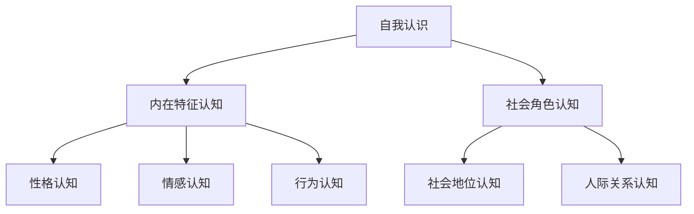

自我认识的意义在于帮助我们建立自我认同，增强自信心，提高自我调节能力。以下是一个简单的 Python 代码示例，展示如何通过问卷调查法进行自我认知：

```python
import pandas as pd

# 构建问卷数据结构
questions = [
    "您的性格类型是什么？",
    "您通常在什么情况下感到快乐？",
    "您在处理冲突时通常采取哪种方式？",
    "您认为自己在人际关系中的角色是什么？",
]

# 获取用户回答
user_answers = []
for q in questions:
    answer = input(q)
    user_answers.append(answer)

# 构建数据帧
data = {'Question': questions, 'Answer': user_answers}
df = pd.DataFrame(data)

# 输出结果
print(df)
```

#### 自我反思的重要性、方法和实践
自我反思是一种通过审视自己的思维、情感和行为来识别问题、学习成长的过程。它有助于我们深入了解自己的内心世界，提高自我意识和自我调节能力。

**核心概念与联系**：

以下是一个 Mermaid 流程图，展示了自我反思的核心概念及其相互关系：

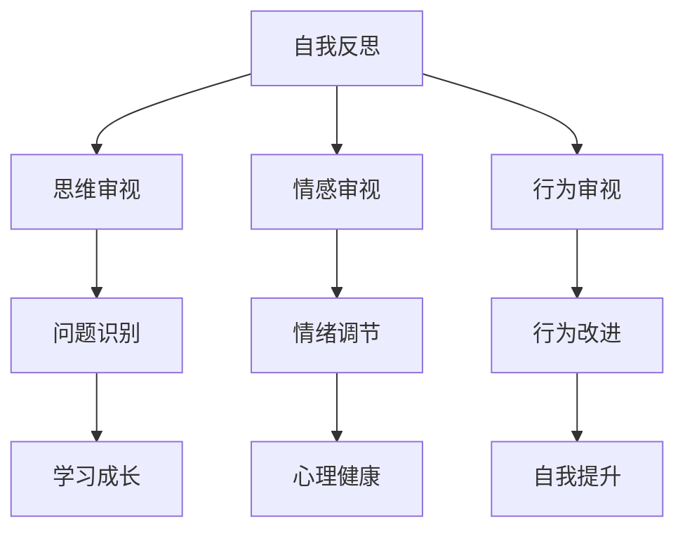

自我反思的方法包括日记法、提问法、冥想法等。以下是一个简单的 Python 代码示例，展示如何使用日记法进行自我反思：

```python
def write_reflection_journal(entry):
    with open('reflection_journal.txt', 'a') as f:
        f.write(entry + '\n')

# 用户编写日记
entry = input("今天您有什么想要反思的？\n")
write_reflection_journal(entry)

# 读取日记
with open('reflection_journal.txt', 'r') as f:
    content = f.read()
    print(content)
```

#### 自我觉察的提升方法
自我觉察是指个体对自己内在状态和外显行为的认识程度。提升自我觉察有助于我们更好地管理情绪和行为，提高生活质量和人际关系。

**核心概念与联系**：

以下是一个 Mermaid 流程图，展示了自我觉察的核心概念及其相互关系：

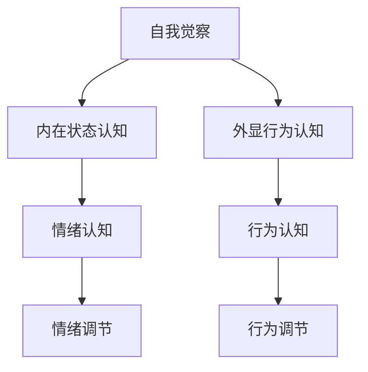

提升自我觉察的方法包括：

1. **正念冥想**：通过专注呼吸和身体感觉来提高对当前体验的觉察。
2. **情绪记录**：记录自己的情绪变化，分析其起因和影响。
3. **情境模拟**：模拟不同情境下的反应，观察自己的情绪和行为模式。

### 第2章 内心冲突
#### 冲突来源
内心冲突的来源多种多样，包括个人价值观、人际关系、职业压力、情感困惑等。了解冲突的来源有助于我们更好地应对和解决冲突。

**核心概念与联系**：

以下是一个 Mermaid 流�流程图，展示了冲突来源及其相互关系：

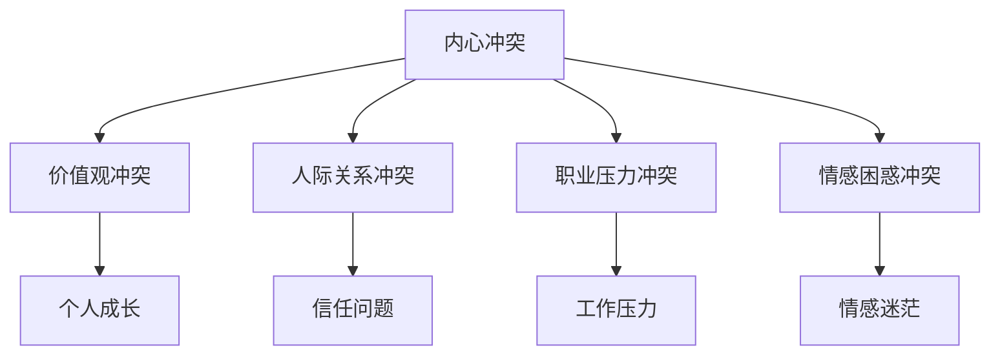

#### 冲突类型
内心冲突可以按照不同的维度进行分类，例如情感冲突、认知冲突、行为冲突等。了解冲突类型有助于我们更具体地分析和应对冲突。

**核心概念与联系**：

以下是一个 Mermaid 流程图，展示了冲突类型的分类及其相互关系：

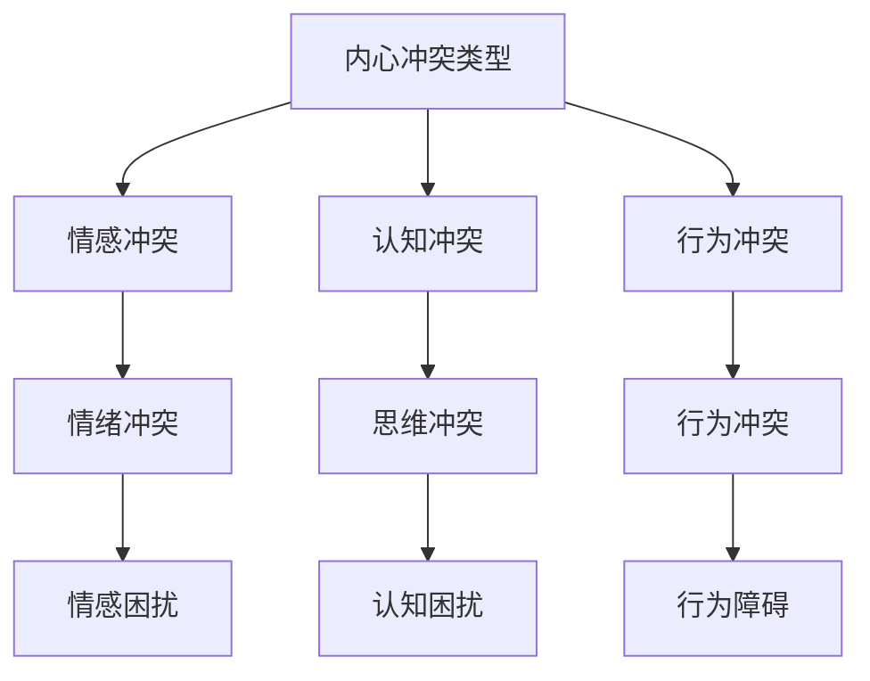

#### 冲突影响
内心冲突对个体的生活质量和心理健康有着深远的影响。了解冲突的影响有助于我们认识到化解冲突的重要性。

**核心概念与联系**：

以下是一个 Mermaid 流程图，展示了冲突影响的几个方面及其相互关系：

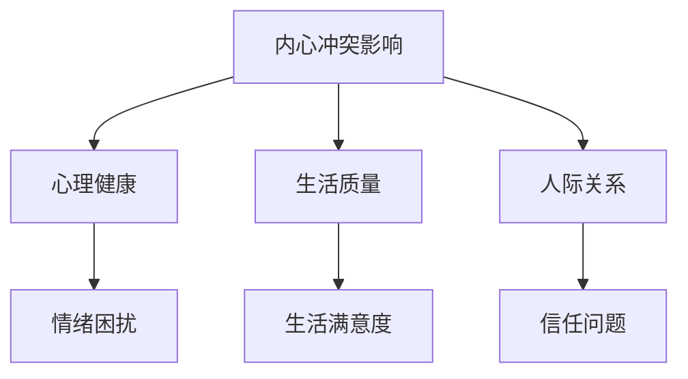

### 第3章 对话技巧
#### 自我对话的概念、方法和实践
自我对话是指个体与自己进行的有意识、有目的的交流。通过自我对话，个体可以深入了解自己的内心世界，调整思维和行为。

**核心概念与联系**：

以下是一个 Mermaid 流程图，展示了自我对话的核心概念及其相互关系：

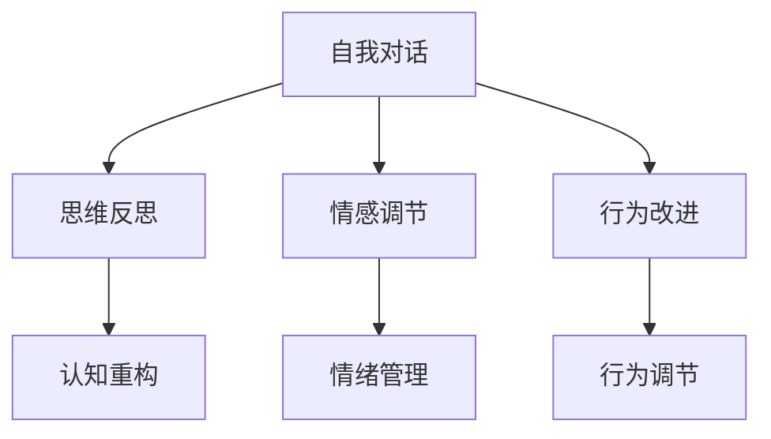

以下是一个简单的 Python 代码示例，展示如何进行自我对话：

```python
def self_dialogue(question):
    answer = input(question)
    print(f"您在思考：{answer}")

# 用户进行自我对话
self_dialogue("您最近有什么烦恼吗？")
```

#### 与他人对话的技巧和实践
与他人对话是建立和维护人际关系的重要途径。有效的沟通技巧有助于我们更好地理解他人，解决冲突，增进友谊。

**核心概念与联系**：

以下是一个 Mermaid 流程图，展示了有效沟通的核心概念及其相互关系：

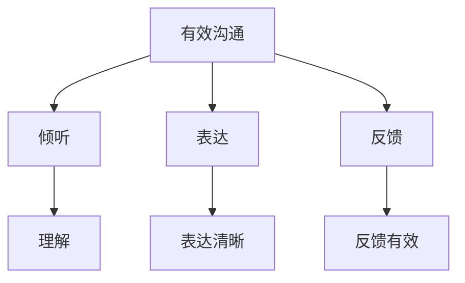

以下是一个简单的 Python 代码示例，展示如何进行有效沟通：

```python
def communicate(message):
    print(f"您说：{message}")
    response = input("对方的回应：")
    print(f"您的回应：{response}")

# 用户与他人进行有效沟通
communicate("我最近感到有些焦虑，你能帮我分析一下原因吗？")
```

#### 冲突对话的技巧和实践
在冲突中保持对话的有效性是解决冲突的关键。通过以下技巧，我们可以更好地处理冲突，避免情绪失控。

**核心概念与联系**：

以下是一个 Mermaid 流程图，展示了冲突对话的核心概念及其相互关系：

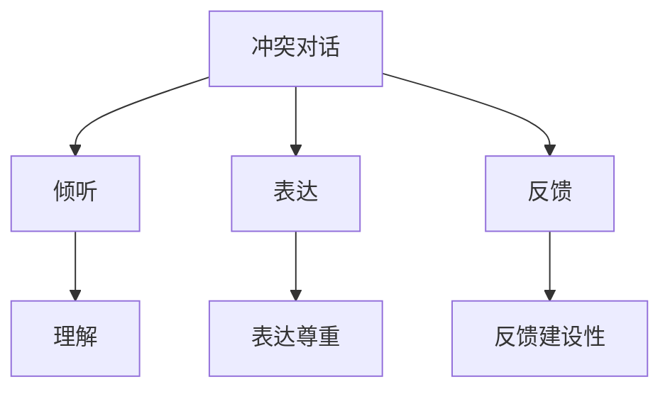

以下是一个简单的 Python 代码示例，展示如何进行冲突对话：

```python
def conflict_communication(issue):
    print(f"冲突问题：{issue}")
    user_response = input("您的回应：")
    print(f"对方的回应：{user_response}")

# 用户进行冲突对话
conflict_communication("我觉得你最近对我的工作态度有些冷淡，是怎么回事？")
```

### 第4章 自我和解
#### 自我和解的理论基础
自我和解是一个复杂的过程，涉及心理学、哲学和认知科学等多个领域。了解自我和解的理论基础有助于我们更好地理解和实践自我和解。

**核心概念与联系**：

以下是一个 Mermaid 流程图，展示了自我和解的理论基础及其相互关系：

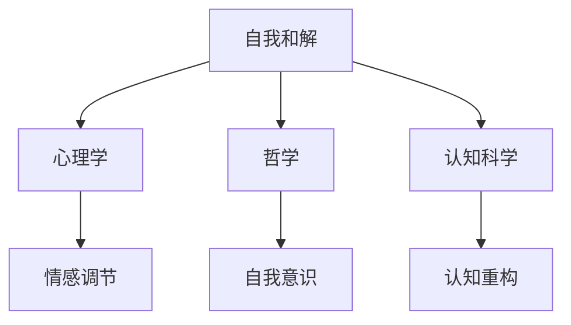

#### 自我和解的步骤和方法
自我和解是一个有序的过程，包括以下几个步骤：

1. **识别冲突**：明确内心冲突的来源和类型。
2. **自我对话**：通过自我对话深入了解冲突的原因和影响。
3. **反思与认知重构**：反思自己的思维模式，重构认知，寻找解决问题的方法。
4. **行动与调整**：采取实际行动解决问题，调整行为和思维模式。

以下是一个简单的 Python 代码示例，展示如何进行自我和解：

```python
def self_resolution(issue):
    print(f"识别冲突：{issue}")
    self_dialogue("这个冲突对我有什么影响？")
    reflection = input("您的反思：")
    print(f"认知重构：{reflection}")
    action = input("您打算如何解决这个问题？")
    print(f"行动与调整：{action}")

# 用户进行自我和解
self_resolution("我感到工作压力很大，经常失眠。")
```

#### 自我和解的实践
自我和解不仅需要理论指导，还需要实践经验的积累。以下是一些实际案例和经验分享，帮助读者更好地理解和实践自我和解。

**核心概念与联系**：

以下是一个 Mermaid 流程图，展示了自我和解实践的核心概念及其相互关系：

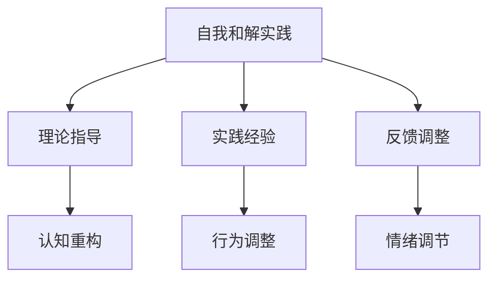

以下是一个简单的 Python 代码示例，展示如何通过实践自我和解：

```python
def practice_self_resolution():
    print("以下是一个自我和解的实践案例：")
    print("1. 识别冲突：我最近感到工作压力很大，影响到了家庭生活。")
    print("2. 自我对话：我反思了自己对待工作的态度，发现过于追求完美，导致压力过大。")
    print("3. 反思与认知重构：我意识到，追求完美并不是最佳策略，需要找到平衡。")
    print("4. 行动与调整：我开始与同事合作，分配工作任务，减轻个人压力。")
    print("5. 反馈调整：通过实践，我发现工作效率提高了，家庭生活也变得更加和谐。")

# 用户进行自我和解实践
practice_self_resolution()
```

### 附录

#### 附录A：自我反思工具
为了帮助读者更好地进行自我反思，以下是一些实用的工具和方法：

1. **日记法**：通过记录日常生活和情感变化，深入了解自己的内心世界。
2. **提问法**：针对自己的行为、思维和情感提出问题，促进自我反思。
3. **冥想法**：通过专注呼吸和身体感觉，提高自我觉察。

#### 附录B：对话技巧练习
以下是一些对话技巧的练习和建议：

1. **倾听练习**：通过倾听他人的话语，理解其情感和需求。
2. **表达练习**：练习清晰、准确地表达自己的观点和感受。
3. **反馈练习**：学会给予他人建设性的反馈，促进沟通。

#### 附录C：自我和解案例
以下是一些成功的自我和解案例，供读者参考：

1. **案例一**：通过自我对话和反思，某人在工作压力和情感困扰中找到了平衡，提升了生活质量。
2. **案例二**：某人在人际关系冲突中，通过有效的沟通技巧和自我反思，化解了矛盾，改善了关系。

### 最佳实践 tips、小结、注意事项、拓展阅读等内容
在进行自我对话和反思时，以下几点需要注意：

1. **保持真诚和开放**：真诚面对自己的内心，不要逃避或否认。
2. **持续练习**：自我对话和反思需要持续练习，才能逐渐提高自我觉察和自我调节能力。
3. **寻求专业帮助**：在遇到严重内心冲突时，可以寻求心理咨询师或专业教练的帮助。

拓展阅读：

1. **《自我对话的艺术》**：探讨如何通过自我对话提升自我意识和心理健康。
2. **《心理学与生活》**：介绍心理学的基本原理和如何应用心理学知识改善生活质量。

## 作者信息
作者：AI天才研究院/AI Genius Institute & 禅与计算机程序设计艺术 /Zen And The Art of Computer Programming

