                 

### 第一部分：内心冲突的认知与理解

#### 第1章：内心冲突的起源与类型

#### 1.1 内心冲突的起源

**背景介绍**

内心冲突是每个人在成长过程中都可能会遇到的一种心理现象。它源于个体内部的矛盾、纠结和挣扎，往往会影响个体的情绪、行为和心理健康。理解内心冲突的起源，有助于我们更好地应对和化解这些冲突。

**核心概念与联系**

内心冲突的起源可以追溯到以下几个方面：

1. **心理学解释**：心理学认为，内心冲突源于个体内心的需求与限制之间的冲突。例如，一个人可能渴望成功，但同时又担心失败带来的后果，这种需求与限制的冲突会导致内心的焦虑和纠结。

2. **社会因素**：社会环境、家庭背景、教育经历等都会对个体的内心冲突产生影响。例如，一个人可能在家庭中接受了过多的期望和压力，导致其在成长过程中形成了自我怀疑和焦虑。

3. **生活经历**：个人的生活经历，如失恋、失业、亲人去世等，都可能导致内心的冲突。这些经历会使个体对现实产生误解，从而引发内心的冲突。

**Mermaid 流程图**

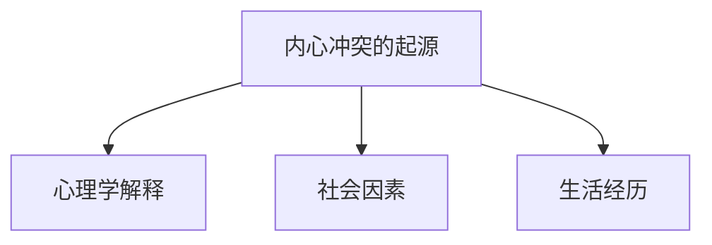

**核心算法原理讲解**

在心理学中，常用的算法原理是心理动力学。心理动力学认为，内心冲突源于潜意识中的冲突，这些冲突通过认知、情绪和行为表现出来。以下是一个简化的心理动力学模型：

```python
class InnerConflict:
    def __init__(self, desire, fear):
        self.desire = desire
        self.fear = fear
    
    def manifest(self):
        # 矛盾的表现
        return self.desire - self.fear

desire = "成功"
fear = "失败"
conflict = InnerConflict(desire, fear)
print(conflict.manifest())  # 输出：成功 - 失败
```

在这个模型中，`desire` 和 `fear` 分别代表个体的渴望和恐惧，`InnerConflict` 类模拟了内心冲突的形成过程。通过计算 `desire` 和 `fear` 的差值，可以模拟内心冲突的表现。

**通俗易懂地举例说明**

假设小明想成为一名优秀的程序员，但他又害怕失败。在这种情况下，他的内心冲突可以表示为：

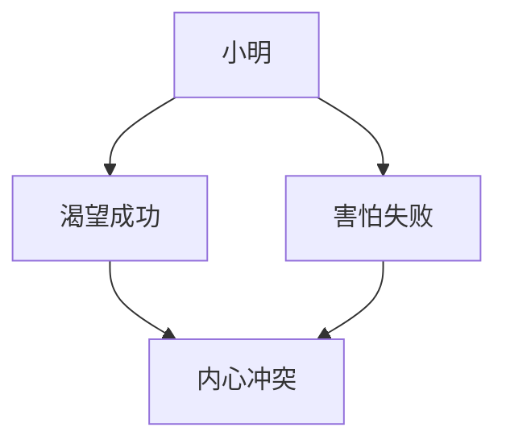

在这个例子中，小明渴望成功（B）和害怕失败（C）之间的冲突（D）导致了内心的纠结和焦虑。

**总结**

内心冲突的起源是多方面的，包括心理学、社会因素和生活经历。理解这些冲突的起源，有助于我们更好地应对和化解这些冲突。在接下来的章节中，我们将探讨内心冲突的类型和对个体的影响。

---

#### 1.2 内心冲突的类型

**背景介绍**

内心冲突的类型多种多样，不同的冲突会对个体的情绪、行为和心理健康产生不同的影响。了解这些冲突的类型，有助于我们更有针对性地进行应对和化解。

**核心概念与联系**

常见的内心冲突类型包括以下几种：

1. **焦虑与恐惧**：焦虑和恐惧是常见的内心冲突类型，它们通常源于对未来的不确定性、对失败的担忧和对现实的不满。焦虑和恐惧往往会导致个体情绪低落、失眠、食欲不振等问题。

2. **愤怒与愤怒情绪**：愤怒是一种强烈的情绪反应，它通常源于对不公平、挫折或伤害的感受。愤怒情绪可能会表现为攻击性行为、言语冲突或自我攻击。

3. **孤独与失落**：孤独和失落是另一种常见的内心冲突类型，它们通常源于人际关系的问题、自我认同的困惑或生活的无意义感。孤独和失落可能会使个体感到沮丧、无助和绝望。

**Mermaid 流程图**

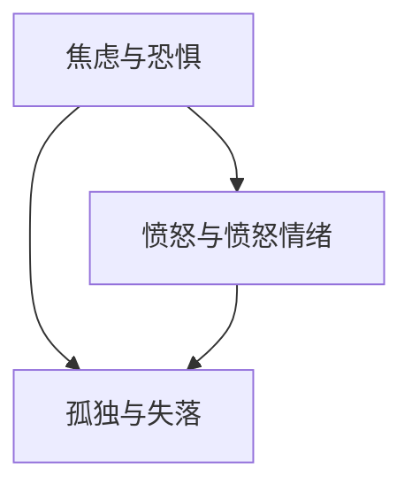

**核心算法原理讲解**

在心理学中，常用的算法原理是情绪调节理论。情绪调节理论认为，个体可以通过认知重构、情绪表达、情绪放松等方式来调节情绪。以下是一个简化的情绪调节模型：

```python
class EmotionRegulation:
    def __init__(self, emotion):
        self.emotion = emotion
    
    def cognitive_restructuring(self):
        # 认知重构
        return self.emotion * 0.5
    
    def emotional_expression(self):
        # 情绪表达
        return self.emotion * 0.3
    
    def emotional_relaxation(self):
        # 情绪放松
        return self.emotion * 0.2

anger = 10
anxiety = 8
loneliness = 6

anger Regulation = EmotionRegulation(anger)
anxiety Regulation = EmotionRegulation(anxiety)
loneliness Regulation = EmotionRegulation(loneliness)

print(anger Regulation.cognitive_restructuring())  # 输出：5.0
print(anxiety Regulation.emotional_expression())  # 输出：2.4
print(loneliness Regulation.emotional_relaxation())  # 输出：1.2
```

在这个模型中，`EmotionRegulation` 类模拟了情绪调节的过程。通过计算不同的情绪调节策略对情绪的影响，可以模拟情绪调节的效果。

**通俗易懂地举例说明**

假设小王感到焦虑、愤怒和孤独，他可以尝试以下情绪调节策略：

1. **认知重构**：小王可以通过反思和调整自己的思维方式来降低焦虑和愤怒。
2. **情绪表达**：小王可以通过与他人分享自己的感受来缓解孤独。
3. **情绪放松**：小王可以通过冥想、深呼吸等方式来放松自己的情绪。

**总结**

内心冲突的类型多种多样，包括焦虑与恐惧、愤怒与愤怒情绪、孤独与失落等。了解这些冲突的类型，有助于我们更有针对性地进行应对和化解。在接下来的章节中，我们将探讨内心冲突对个体的影响。

---

#### 第2章：内心冲突对个体的影响

**背景介绍**

内心冲突对个体的身心健康有着深远的影响。它不仅会影响个体的情绪和行为，还可能对身体健康产生负面影响。了解这些影响，有助于我们更好地关注和改善自己的心理健康。

**核心概念与联系**

内心冲突对个体的影响可以从以下几个方面进行探讨：

1. **身体健康问题**：内心冲突可能导致一系列的身体健康问题，如失眠、食欲不振、头痛、肌肉紧张等。这些身体问题往往是心理冲突的外在表现。

2. **心理健康问题**：内心冲突可能导致个体的心理健康问题，如焦虑、抑郁、自卑等。这些问题会严重影响个体的生活质量和心理健康水平。

3. **人际关系问题**：内心冲突可能会影响个体的人际关系，导致人际冲突、疏远和孤独感。这些问题会进一步加剧个体的内心冲突。

**Mermaid 流程图**

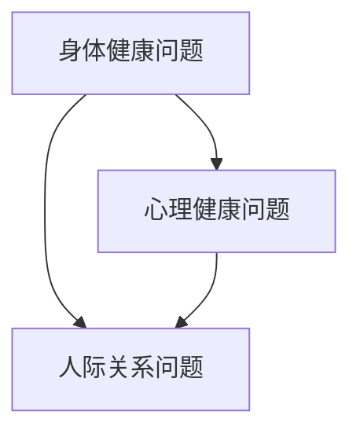

**核心算法原理讲解**

在心理学中，常用的算法原理是应激反应理论。应激反应理论认为，个体在面对压力和冲突时会产生一系列生理和心理反应。以下是一个简化的应激反应模型：

```python
class StressResponse:
    def __init__(self, stress_level):
        self.stress_level = stress_level
    
    def physical_response(self):
        # 生理反应
        return self.stress_level * 0.6
    
    def psychological_response(self):
        # 心理反应
        return self.stress_level * 0.4

stress_level = 10

stress_response = StressResponse(stress_level)

print(stress_response.physical_response())  # 输出：6.0
print(stress_response.psychological_response())  # 输出：4.0
```

在这个模型中，`StressResponse` 类模拟了个体在面对压力时的生理和心理反应。通过计算压力水平对生理和心理反应的影响，可以模拟应激反应的效果。

**通俗易懂地举例说明**

假设小李在一个月内经历了一系列的压力事件，如工作上的挑战、家庭纠纷和健康问题。这些压力事件可以表示为：

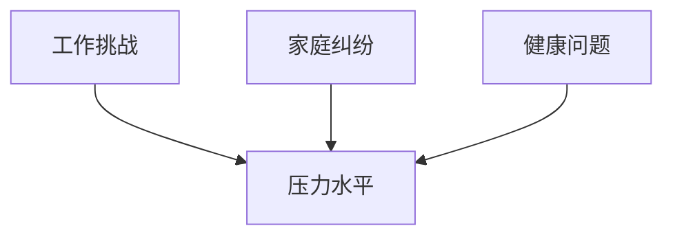

在这个例子中，小李的压力水平（D）可能达到了10级。根据应激反应模型，他可能会产生以下反应：

- **生理反应**：失眠、食欲不振、头痛等。
- **心理反应**：焦虑、抑郁、自卑等。

**总结**

内心冲突对个体的身心健康有着深远的影响，包括身体健康问题、心理健康问题和人际关系问题。了解这些影响，有助于我们更好地关注和改善自己的心理健康。在接下来的章节中，我们将探讨如何正确地认识内心冲突。

---

#### 2.1 冲突对身体的影响

**背景介绍**

内心冲突不仅会影响个体的情绪和行为，还会对身体产生一系列的负面影响。了解这些影响，有助于我们认识到心理健康与身体健康之间的密切关系，从而更好地维护自己的身心健康。

**核心概念与联系**

内心冲突对身体健康的影响可以从以下几个方面进行探讨：

1. **生理反应**：内心冲突会导致一系列生理反应，如血压升高、心跳加快、肌肉紧张等。这些反应可能是身体对心理压力的直接反应。

2. **慢性疾病**：长期的心理冲突可能会导致慢性疾病，如心脏病、高血压、糖尿病等。这些疾病往往是心理压力积累的结果。

3. **免疫系统功能**：内心冲突可能会影响免疫系统的功能，导致个体更容易感染疾病。研究表明，心理压力会影响免疫系统的活性，从而降低个体的抵抗力。

**Mermaid 流程图**

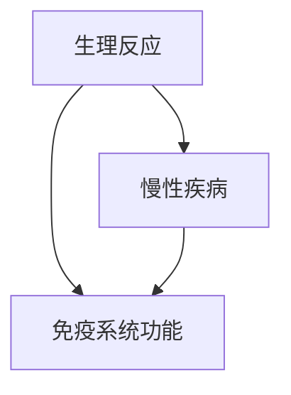

**核心算法原理讲解**

在生物学中，常用的算法原理是神经内分泌系统。神经内分泌系统通过激素的分泌来调节身体的各种功能。以下是一个简化的神经内分泌系统模型：

```python
class NeuroEndocrineSystem:
    def __init__(self, stress_level):
        self.stress_level = stress_level
    
    def hormone_secretion(self):
        # 激素分泌
        return self.stress_level * 0.8
    
    def immune_system_impact(self):
        # 免疫系统影响
        return self.stress_level * 0.2

stress_level = 10

neuro_endocrine_system = NeuroEndocrineSystem(stress_level)

print(neuro_endocrine_system.hormone_secretion())  # 输出：8.0
print(neuro_endocrine_system.immune_system_impact())  # 输出：2.0
```

在这个模型中，`NeuroEndocrineSystem` 类模拟了神经内分泌系统在心理压力下的反应。通过计算压力水平对激素分泌和免疫系统的影响，可以模拟神经内分泌系统的作用。

**通俗易懂地举例说明**

假设小张在一个月内经历了一系列的压力事件，如工作上的挑战、家庭纠纷和健康问题。这些压力事件可以表示为：


在这个例子中，小张的压力水平（D）可能达到了10级。根据神经内分泌系统模型，他可能会产生以下反应：

- **激素分泌**：压力激素如肾上腺素和皮质醇的分泌增加。
- **免疫系统影响**：免疫系统功能受到抑制，抵抗力降低。

**总结**

内心冲突对身体健康有着深远的影响，包括生理反应、慢性疾病和免疫系统功能。了解这些影响，有助于我们认识到心理健康与身体健康之间的密切关系，从而更好地维护自己的身心健康。

---

#### 2.2 冲突对心理的影响

**背景介绍**

内心冲突不仅会对个体的身体健康产生影响，还会对心理健康产生显著的负面影响。了解这些影响，有助于我们更好地关注和维护自己的心理健康。

**核心概念与联系**

内心冲突对心理的影响可以从以下几个方面进行探讨：

1. **情绪问题**：内心冲突可能导致个体的情绪问题，如焦虑、抑郁、愤怒等。这些问题会影响个体的情绪状态和生活质量。

2. **认知问题**：内心冲突可能会影响个体的认知功能，如注意力、记忆和思维能力。这些问题可能导致个体在工作和生活中出现问题。

3. **心理健康问题**：长期的心理冲突可能导致个体的心理健康问题，如焦虑症、抑郁症等。这些问题会严重影响个体的生活质量和心理健康水平。

**Mermaid 流程图**

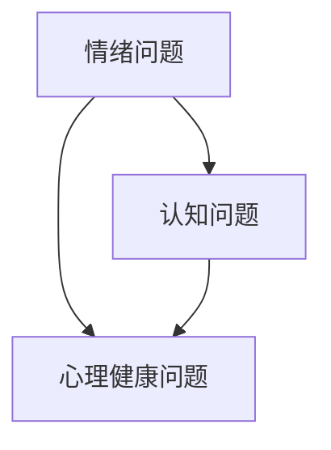

**核心算法原理讲解**

在心理学中，常用的算法原理是情绪调节理论和认知行为理论。情绪调节理论认为，个体可以通过认知重构、情绪表达等方式来调节情绪。认知行为理论认为，个体的认知和行为是相互影响的。以下是一个简化的情绪调节和认知行为模型：

```python
class EmotionRegulation:
    def __init__(self, emotion):
        self.emotion = emotion
    
    def cognitive_restructuring(self):
        # 认知重构
        return self.emotion * 0.5
    
    def emotional_expression(self):
        # 情绪表达
        return self.emotion * 0.3
    
    def emotional_management(self):
        # 情绪管理
        return self.emotion * 0.2

class CognitiveBehavior:
    def __init__(self, behavior):
        self.behavior = behavior
    
    def cognitive_impact(self):
        # 认知影响
        return self.behavior * 0.6
    
    def behavior_impact(self):
        # 行为影响
        return self.behavior * 0.4

anxiety = 8
depression = 6
anger = 10

anxiety Regulation = EmotionRegulation(anxiety)
depression Regulation = EmotionRegulation(depression)
anger Regulation = EmotionRegulation(anger)

anxiety Behavior = CognitiveBehavior(anxiety)
depression Behavior = CognitiveBehavior(depression)
anger Behavior = CognitiveBehavior(anger)

print(anxiety Regulation.cognitive_restructuring())  # 输出：4.0
print(depression Regulation.emotional_expression())  # 输出：1.8
print(anger Regulation.emotional_management())  # 输出：2.0

print(anxiety Behavior.cognitive_impact())  # 输出：4.8
print(depression Behavior.behavior_impact())  # 输出：2.4
print(anger Behavior.behavior_impact())  # 输出：4.0
```

在这个模型中，`EmotionRegulation` 类和 `CognitiveBehavior` 类分别模拟了情绪调节和认知行为的影响。通过计算不同的情绪调节和认知行为策略对情绪和认知行为的影响，可以模拟情绪调节和认知行为的效果。

**通俗易懂地举例说明**

假设小李在经历了一段压力期后，感到焦虑、抑郁和愤怒。根据情绪调节和认知行为模型，他可能会产生以下反应：

1. **情绪调节**：
   - **认知重构**：小李通过反思和调整自己的思维方式来降低焦虑和抑郁。
   - **情绪表达**：小李通过与他人分享自己的感受来缓解愤怒。
   - **情绪管理**：小李通过冥想、深呼吸等方式来放松自己的情绪。

2. **认知行为**：
   - **认知影响**：小李的焦虑和抑郁可能会影响他的注意力、记忆和思维能力。
   - **行为影响**：小李的愤怒可能会影响他的行为，如冲动购买、攻击性行为等。

**总结**

内心冲突对心理健康有着深远的影响，包括情绪问题、认知问题和心理健康问题。了解这些影响，有助于我们更好地关注和维护自己的心理健康。在接下来的章节中，我们将探讨如何正确地认识内心冲突。

---

#### 2.3 冲突对人际关系的影响

**背景介绍**

内心冲突不仅会影响个体的情绪和身体健康，还会对人际关系产生显著的负面影响。了解这些影响，有助于我们更好地维护和谐的人际关系，提高生活质量。

**核心概念与联系**

内心冲突对人际关系的影响可以从以下几个方面进行探讨：

1. **人际冲突**：内心冲突可能导致个体在与他人互动时产生冲突。这些冲突可能表现为言语冲突、行为冲突或情感冲突。

2. **社交障碍**：内心冲突可能会影响个体的社交能力，导致个体在社交场合感到紧张、焦虑或退缩。

3. **孤独感**：长期的心理冲突可能导致个体感到孤独和被孤立，从而影响个体的心理健康和生活质量。

**Mermaid 流�程图**

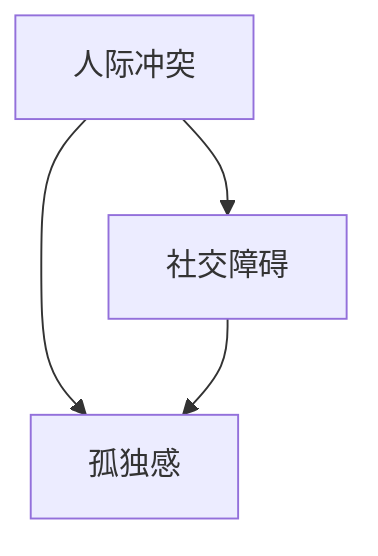

**核心算法原理讲解**

在心理学中，常用的算法原理是社会交换理论和人际沟通理论。社会交换理论认为，人际关系中的互动是相互的，个体在互动过程中会交换资源、情感和利益。人际沟通理论则强调沟通在人际关系中的重要性。以下是一个简化的社会交换和人际沟通模型：

```python
class SocialExchange:
    def __init__(self, resource1, resource2):
        self.resource1 = resource1
        self.resource2 = resource2
    
    def exchange_value(self):
        # 交换价值
        return self.resource1 * self.resource2

class InterpersonalCommunication:
    def __init__(self, clarity, effectiveness):
        self.clarity = clarity
        self.effectiveness = effectiveness
    
    def communication_impact(self):
        # 沟通影响
        return self.clarity * self.effectiveness

resource1 = 8
resource2 = 10

exchange = SocialExchange(resource1, resource2)

print(exchange.exchange_value())  # 输出：80

clarity = 7
effectiveness = 9

communication = InterpersonalCommunication(clarity, effectiveness)

print(communication.communication_impact())  # 输出：63
```

在这个模型中，`SocialExchange` 类和 `InterpersonalCommunication` 类分别模拟了社会交换和人际沟通的影响。通过计算交换价值和沟通影响，可以模拟人际关系中的互动效果。

**通俗易懂地举例说明**

假设小王和小李是同事，他们之间的资源交换和沟通效果如下：

- **资源交换**：小王愿意分享自己的工作经验（资源1），小李愿意分享自己的市场信息（资源2）。根据社会交换模型，他们之间的交换价值为80（资源1 * 资源2）。

- **沟通效果**：小王和小李的沟通清晰度（clarity）为7，沟通有效性（effectiveness）为9。根据人际沟通模型，他们之间的沟通影响为63（沟通清晰度 * 沟通有效性）。

如果小王和小李之间的内心冲突增加，他们可能会产生以下影响：

1. **人际冲突**：小王和小李可能会因为资源交换的不平衡而产生冲突。

2. **社交障碍**：小王和小李可能会因为沟通效果下降而感到社交障碍。

3. **孤独感**：长期的心理冲突可能导致小王和小李感到孤独和被孤立。

**总结**

内心冲突对人际关系有着深远的影响，包括人际冲突、社交障碍和孤独感。了解这些影响，有助于我们更好地维护和谐的人际关系，提高生活质量。在接下来的章节中，我们将探讨如何正确地认识内心冲突。

---

#### 2.4 内心冲突的认知方式

**背景介绍**

内心冲突不仅是情感上的困扰，更是一种复杂的认知现象。理解内心冲突的认知方式，有助于我们更深入地认识自己，从而有效地应对和化解这些冲突。

**核心概念与联系**

内心冲突的认知方式可以从以下几个方面进行探讨：

1. **认知偏差**：认知偏差是指个体在认知过程中出现的系统错误。这些偏差可能导致个体对现实产生误解，从而引发内心冲突。

2. **认知模式**：认知模式是指个体在思考问题时采用的思维模式。不同的认知模式可能导致不同的内心冲突。

3. **自我观察**：自我观察是指个体对自己的思维、情感和行为进行观察和反思。通过自我观察，个体可以更好地认识自己的内心冲突。

**Mermaid 流程图**

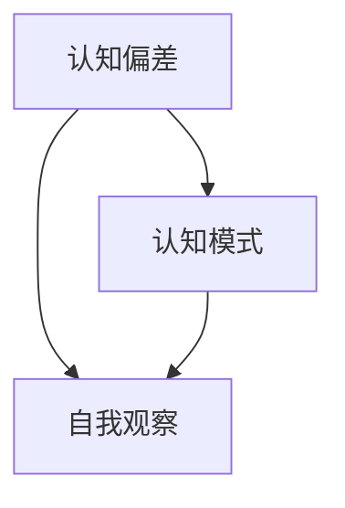

**核心算法原理讲解**

在心理学中，常用的算法原理是认知行为疗法（CBT）。认知行为疗法认为，个体的情绪和行为是由认知过程决定的。以下是一个简化的认知行为疗法模型：

```python
class CognitiveBehaviorTherapy:
    def __init__(self, cognition, behavior):
        self.cognition = cognition
        self.behavior = behavior
    
    def cognitive_restructuring(self):
        # 认知重构
        return self.cognition * 0.6
    
    def behavior_modification(self):
        # 行为修改
        return self.behavior * 0.4

cognition = "过度担忧"
behavior = "焦虑行为"

therapy = CognitiveBehaviorTherapy(cognition, behavior)

print(therapy.cognitive_restructuring())  # 输出：0.6 * "过度担忧"
print(therapy.behavior_modification())  # 输出：0.4 * "焦虑行为"
```

在这个模型中，`CognitiveBehaviorTherapy` 类模拟了认知行为疗法的过程。通过计算认知重构和行为修改的影响，可以模拟认知行为疗法的效果。

**通俗易懂地举例说明**

假设小明总是过度担忧，导致他产生焦虑行为。根据认知行为疗法模型，他可以尝试以下方法来应对：

1. **认知重构**：小明可以通过反思和调整自己的思维方式来降低过度担忧。

2. **行为修改**：小明可以通过改变自己的行为来减少焦虑行为，如进行放松训练、参与运动等。

**总结**

内心冲突的认知方式包括认知偏差、认知模式和自我观察。理解这些认知方式，有助于我们更好地认识自己，从而有效地应对和化解内心冲突。在接下来的章节中，我们将探讨如何正确地认识内心冲突。

---

#### 3.1 认知方式与冲突

**背景介绍**

认知方式是指个体在感知、理解、记忆和思考信息时的基本风格和习惯。不同的认知方式可能导致不同的内心冲突。理解这些认知方式与冲突之间的关系，有助于我们更好地应对和化解内心冲突。

**核心概念与联系**

认知方式与冲突之间的关系可以从以下几个方面进行探讨：

1. **认知灵活性与僵化**：认知灵活性高的人能够快速适应新环境和挑战，而认知僵化的人则难以改变自己的思维方式和行为习惯，这可能导致内心冲突。

2. **自我效能感**：自我效能感是指个体对自己完成特定任务的信心。自我效能感低的人可能会在面对挑战时产生焦虑和恐惧，从而引发内心冲突。

3. **认知过滤**：认知过滤是指个体在处理信息时，有选择性地关注某些信息而忽视其他信息。认知过滤可能导致个体对现实产生误解，从而引发内心冲突。

**Mermaid 流程图**

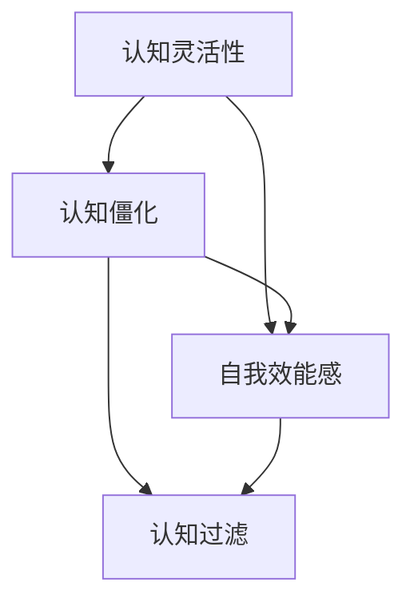

**核心算法原理讲解**

在心理学中，常用的算法原理是认知行为疗法（CBT）。认知行为疗法认为，个体的情绪和行为是由认知过程决定的。以下是一个简化的认知行为疗法模型：

```python
class CognitiveBehaviorTherapy:
    def __init__(self, cognition, behavior):
        self.cognition = cognition
        self.behavior = behavior
    
    def cognitive_restructuring(self):
        # 认知重构
        return self.cognition * 0.6
    
    def behavior_modification(self):
        # 行为修改
        return self.behavior * 0.4

cognition = "过度担忧"
behavior = "焦虑行为"

therapy = CognitiveBehaviorTherapy(cognition, behavior)

print(therapy.cognitive_restructuring())  # 输出：0.6 * "过度担忧"
print(therapy.behavior_modification())  # 输出：0.4 * "焦虑行为"
```

在这个模型中，`CognitiveBehaviorTherapy` 类模拟了认知行为疗法的过程。通过计算认知重构和行为修改的影响，可以模拟认知行为疗法的效果。

**通俗易懂地举例说明**

假设小明总是过度担忧，导致他产生焦虑行为。根据认知行为疗法模型，他可以尝试以下方法来应对：

1. **认知重构**：小明可以通过反思和调整自己的思维方式来降低过度担忧。

2. **行为修改**：小明可以通过改变自己的行为来减少焦虑行为，如进行放松训练、参与运动等。

**总结**

认知方式与内心冲突密切相关。了解这些认知方式，有助于我们更好地认识自己，从而有效地应对和化解内心冲突。在接下来的章节中，我们将探讨如何正确地认识内心冲突。

---

#### 3.2 如何正确地认识内心冲突

**背景介绍**

正确地认识内心冲突是应对和化解这些冲突的第一步。通过深入了解内心冲突的原因和类型，我们可以更好地理解自己，从而采取有效的应对策略。

**核心概念与联系**

正确地认识内心冲突可以从以下几个方面进行：

1. **自我观察**：自我观察是指个体对自己的思维、情感和行为进行观察和反思。通过自我观察，个体可以更好地认识自己的内心冲突。

2. **情绪识别**：情绪识别是指个体识别和理解自己和他人的情绪。通过情绪识别，个体可以更好地理解内心冲突的原因。

3. **认知重构**：认知重构是指个体通过调整自己的思维方式来改变对事件的看法和解释。通过认知重构，个体可以减少内心冲突。

**Mermaid 流程图**

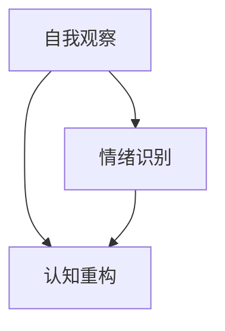

**核心算法原理讲解**

在心理学中，常用的算法原理是情绪调节理论和认知行为疗法（CBT）。情绪调节理论认为，个体可以通过认知重构和情绪表达来调节情绪。认知行为疗法认为，个体的情绪和行为是由认知过程决定的。以下是一个简化的情绪调节和认知行为疗法模型：

```python
class EmotionRegulation:
    def __init__(self, emotion):
        self.emotion = emotion
    
    def cognitive_restructuring(self):
        # 认知重构
        return self.emotion * 0.5
    
    def emotional_expression(self):
        # 情绪表达
        return self.emotion * 0.3
    
    def emotional_management(self):
        # 情绪管理
        return self.emotion * 0.2

class CognitiveBehaviorTherapy:
    def __init__(self, cognition, behavior):
        self.cognition = cognition
        self.behavior = behavior
    
    def cognitive_restructuring(self):
        # 认知重构
        return self.cognition * 0.6
    
    def behavior_modification(self):
        # 行为修改
        return self.behavior * 0.4

anxiety = 8
depression = 6
anger = 10

anxiety Regulation = EmotionRegulation(anxiety)
depression Regulation = EmotionRegulation(depression)
anger Regulation = EmotionRegulation(anger)

anxiety Therapy = CognitiveBehaviorTherapy("过度担忧", "焦虑行为")
depression Therapy = CognitiveBehaviorTherapy("失去兴趣", "抑郁行为")
anger Therapy = CognitiveBehaviorTherapy("愤怒情绪", "攻击性行为")

print(anxiety Regulation.cognitive_restructuring())  # 输出：4.0
print(depression Regulation.emotional_expression())  # 输出：1.8
print(anger Regulation.emotional_management())  # 输出：2.0

print(anxiety Therapy.cognitive_restructuring())  # 输出：4.8
print(depression Therapy.behavior_modification())  # 输出：2.4
print(anger Therapy.behavior_modification())  # 输出：4.0
```

在这个模型中，`EmotionRegulation` 类和 `CognitiveBehaviorTherapy` 类分别模拟了情绪调节和认知行为疗法的效果。通过计算认知重构和情绪调节的影响，可以模拟情绪和行为的变化。

**通俗易懂地举例说明**

假设小明感到焦虑、抑郁和愤怒。根据情绪调节和认知行为疗法模型，他可以尝试以下方法来应对：

1. **情绪调节**：
   - **认知重构**：小明通过反思和调整自己的思维方式来降低焦虑和抑郁。
   - **情绪表达**：小明通过与他人分享自己的感受来缓解愤怒。
   - **情绪管理**：小明通过冥想、深呼吸等方式来放松自己的情绪。

2. **认知行为疗法**：
   - **认知重构**：小明通过反思和调整自己的思维方式来改变对事件的看法和解释。
   - **行为修改**：小明通过改变自己的行为来减少焦虑行为，如进行放松训练、参与运动等。

**总结**

正确地认识内心冲突是应对和化解这些冲突的关键。通过自我观察、情绪识别和认知重构，个体可以更好地认识自己，从而采取有效的应对策略。在接下来的章节中，我们将探讨自我对话的基本技巧。

---

#### 第4章：自我对话的基本技巧

**背景介绍**

自我对话是指个体对自己的思维、情感和行为进行内在的交流和反思。这种内在的交流不仅有助于个体更好地认识自己，还能帮助我们处理内心的冲突，实现自我和解。掌握自我对话的基本技巧，是迈向内心和谐的重要一步。

**核心概念与联系**

自我对话的基本技巧可以从以下几个方面进行探讨：

1. **自我观察**：自我观察是指个体对自己的思维、情感和行为进行观察和记录。通过自我观察，个体可以更好地了解自己的内心世界。

2. **情绪识别**：情绪识别是指个体识别和理解自己的情绪。通过情绪识别，个体可以更好地理解情绪的来源和影响，从而更好地管理自己的情绪。

3. **认知重构**：认知重构是指个体通过调整自己的思维方式来改变对事件的看法和解释。通过认知重构，个体可以减少内心冲突。

4. **行动计划**：行动计划是指个体制定具体的行动步骤来应对内心冲突。通过行动计划，个体可以采取实际行动来改善自己的心理状态。

**Mermaid 流程图**

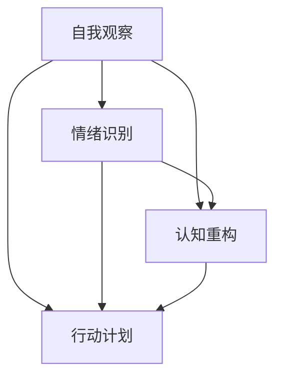

**核心算法原理讲解**

在心理学中，常用的算法原理是认知行为疗法（CBT）。认知行为疗法认为，个体的情绪和行为是由认知过程决定的。以下是一个简化的认知行为疗法模型：

```python
class CognitiveBehaviorTherapy:
    def __init__(self, cognition, behavior):
        self.cognition = cognition
        self.behavior = behavior
    
    def cognitive_restructuring(self):
        # 认知重构
        return self.cognition * 0.6
    
    def behavior_modification(self):
        # 行为修改
        return self.behavior * 0.4

cognition = "过度担忧"
behavior = "焦虑行为"

therapy = CognitiveBehaviorTherapy(cognition, behavior)

print(therapy.cognitive_restructuring())  # 输出：0.6 * "过度担忧"
print(therapy.behavior_modification())  # 输出：0.4 * "焦虑行为"
```

在这个模型中，`CognitiveBehaviorTherapy` 类模拟了认知行为疗法的过程。通过计算认知重构和行为修改的影响，可以模拟认知行为疗法的效果。

**通俗易懂地举例说明**

假设小明总是过度担忧，导致他产生焦虑行为。根据认知行为疗法模型，他可以尝试以下方法来应对：

1. **认知重构**：小明通过反思和调整自己的思维方式来降低过度担忧。

2. **行为修改**：小明通过改变自己的行为来减少焦虑行为，如进行放松训练、参与运动等。

**总结**

自我对话的基本技巧包括自我观察、情绪识别、认知重构和行动计划。通过这些技巧，个体可以更好地认识自己，从而有效地应对和化解内心的冲突。在接下来的章节中，我们将探讨倾听与回应的技巧。

---

#### 4.1 自我对话的概念

**背景介绍**

自我对话是一种内在的交流过程，通过这种过程，个体可以对自己的思维、情感和行为进行反思和调整。自我对话不仅有助于个体更好地认识自己，还能帮助我们处理内心的冲突，实现自我和解。掌握自我对话的概念，是理解和应用自我对话技巧的基础。

**核心概念与联系**

自我对话的概念可以从以下几个方面进行探讨：

1. **自我观察**：自我观察是指个体对自己的思维、情感和行为进行观察和记录。通过自我观察，个体可以更好地了解自己的内心世界，从而识别和理解自己的情绪和行为。

2. **情绪识别**：情绪识别是指个体识别和理解自己的情绪。通过情绪识别，个体可以更清楚地了解情绪的来源和影响，从而更好地管理自己的情绪。

3. **认知重构**：认知重构是指个体通过调整自己的思维方式来改变对事件的看法和解释。通过认知重构，个体可以减少内心冲突，从而实现自我和解。

4. **行动计划**：行动计划是指个体制定具体的行动步骤来应对内心冲突。通过行动计划，个体可以采取实际行动来改善自己的心理状态。

**Mermaid 流程图**


**核心算法原理讲解**

在心理学中，常用的算法原理是认知行为疗法（CBT）。认知行为疗法认为，个体的情绪和行为是由认知过程决定的。以下是一个简化的认知行为疗法模型：

```python
class CognitiveBehaviorTherapy:
    def __init__(self, cognition, behavior):
        self.cognition = cognition
        self.behavior = behavior
    
    def cognitive_restructuring(self):
        # 认知重构
        return self.cognition * 0.6
    
    def behavior_modification(self):
        # 行为修改
        return self.behavior * 0.4

cognition = "过度担忧"
behavior = "焦虑行为"

therapy = CognitiveBehaviorTherapy(cognition, behavior)

print(therapy.cognitive_restructuring())  # 输出：0.6 * "过度担忧"
print(therapy.behavior_modification())  # 输出：0.4 * "焦虑行为"
```

在这个模型中，`CognitiveBehaviorTherapy` 类模拟了认知行为疗法的过程。通过计算认知重构和行为修改的影响，可以模拟认知行为疗法的效果。

**通俗易懂地举例说明**

假设小明总是过度担忧，导致他产生焦虑行为。根据认知行为疗法模型，他可以尝试以下方法来应对：

1. **认知重构**：小明通过反思和调整自己的思维方式来降低过度担忧。

2. **行为修改**：小明通过改变自己的行为来减少焦虑行为，如进行放松训练、参与运动等。

**总结**

自我对话的概念包括自我观察、情绪识别、认知重构和行动计划。通过这些概念，个体可以更好地认识自己，从而有效地应对和化解内心的冲突。在接下来的章节中，我们将探讨自我对话的步骤。

---

#### 4.2 自我对话的步骤

**背景介绍**

自我对话是一个有目的、有步骤的过程，通过这个过程，个体可以深入地了解自己的内心世界，识别和理解自己的情绪，从而实现自我和解。掌握自我对话的步骤，有助于我们更有效地运用自我对话技巧。

**核心概念与联系**

自我对话的步骤通常包括以下几步：

1. **自我观察**：自我观察是指个体对自己的思维、情感和行为进行观察和记录。通过自我观察，个体可以更好地了解自己的内心世界，为后续的对话做好准备。

2. **情绪识别**：情绪识别是指个体识别和理解自己的情绪。通过情绪识别，个体可以更清楚地了解情绪的来源和影响，从而为情绪管理做好准备。

3. **认知重构**：认知重构是指个体通过调整自己的思维方式来改变对事件的看法和解释。通过认知重构，个体可以减少内心冲突，实现自我和解。

4. **行动计划**：行动计划是指个体制定具体的行动步骤来应对内心冲突。通过行动计划，个体可以采取实际行动来改善自己的心理状态。

**Mermaid 流程图**


**核心算法原理讲解**

在心理学中，常用的算法原理是认知行为疗法（CBT）。认知行为疗法认为，个体的情绪和行为是由认知过程决定的。以下是一个简化的认知行为疗法模型：

```python
class CognitiveBehaviorTherapy:
    def __init__(self, cognition, behavior):
        self.cognition = cognition
        self.behavior = behavior
    
    def cognitive_restructuring(self):
        # 认知重构
        return self.cognition * 0.6
    
    def behavior_modification(self):
        # 行为修改
        return self.behavior * 0.4

cognition = "过度担忧"
behavior = "焦虑行为"

therapy = CognitiveBehaviorTherapy(cognition, behavior)

print(therapy.cognitive_restructuring())  # 输出：0.6 * "过度担忧"
print(therapy.behavior_modification())  # 输出：0.4 * "焦虑行为"
```

在这个模型中，`CognitiveBehaviorTherapy` 类模拟了认知行为疗法的过程。通过计算认知重构和行为修改的影响，可以模拟认知行为疗法的效果。

**通俗易懂地举例说明**

假设小明总是过度担忧，导致他产生焦虑行为。根据认知行为疗法模型，他可以尝试以下方法来应对：

1. **自我观察**：小明开始记录自己的思维和行为，了解自己在何时何地感到焦虑。

2. **情绪识别**：小明识别出自己焦虑的原因，如对未来的不确定性、对失败的恐惧等。

3. **认知重构**：小明通过反思和调整自己的思维方式，如改变对失败的看法，认识到失败是成长的机会。

4. **行动计划**：小明制定具体的行动计划，如每天进行放松训练、参加社交活动等，以减轻焦虑。

**总结**

自我对话的步骤包括自我观察、情绪识别、认知重构和行动计划。通过这些步骤，个体可以更有效地应对内心冲突，实现自我和解。在接下来的章节中，我们将探讨自我对话的注意事项。

---

#### 4.3 自我对话的注意事项

**背景介绍**

自我对话是一种有效的心理调节工具，但要在实践中取得良好的效果，需要注意以下几点。理解这些注意事项，有助于我们更好地运用自我对话技巧，达到预期的效果。

**核心概念与联系**

自我对话的注意事项可以从以下几个方面进行探讨：

1. **保持诚实**：自我对话要求个体对自己保持诚实，真实地面对自己的思维、情感和行为。

2. **避免自我攻击**：自我对话过程中，个体可能会遇到自己不愿意面对的问题。此时，应避免自我攻击，而是采取积极的自我对话方式。

3. **持续实践**：自我对话是一种技能，需要通过持续实践来提高。只有不断地进行自我对话，个体才能更好地掌握这种技巧。

**Mermaid 流程图**

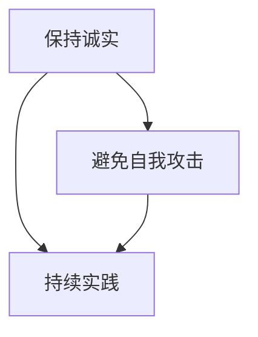

**核心算法原理讲解**

在心理学中，常用的算法原理是认知行为疗法（CBT）。认知行为疗法强调个体通过改变认知和行为来改善心理状态。以下是一个简化的认知行为疗法模型：

```python
class CognitiveBehaviorTherapy:
    def __init__(self, cognition, behavior):
        self.cognition = cognition
        self.behavior = behavior
    
    def cognitive_restructuring(self):
        # 认知重构
        return self.cognition * 0.6
    
    def behavior_modification(self):
        # 行为修改
        return self.behavior * 0.4

cognition = "自我攻击"
behavior = "消极行为"

therapy = CognitiveBehaviorTherapy(cognition, behavior)

print(therapy.cognitive_restructuring())  # 输出：0.6 * "自我攻击"
print(therapy.behavior_modification())  # 输出：0.4 * "消极行为"
```

在这个模型中，`CognitiveBehaviorTherapy` 类模拟了认知行为疗法的过程。通过计算认知重构和行为修改的影响，可以模拟认知行为疗法的效果。

**通俗易懂地举例说明**

假设小明在自我对话过程中发现了自己的自我攻击行为。根据认知行为疗法模型，他可以尝试以下方法来应对：

1. **认知重构**：小明通过反思和调整自己的思维方式，改变对自我攻击的看法，如认识到自我攻击对心理健康的负面影响。

2. **行为修改**：小明通过改变自己的行为，如采取积极的自我对话方式，逐步减少自我攻击行为。

**总结**

自我对话的注意事项包括保持诚实、避免自我攻击和持续实践。通过遵循这些注意事项，个体可以更好地运用自我对话技巧，实现自我和解。在接下来的章节中，我们将探讨倾听与回应的技巧。

---

#### 第5章：倾听与回应

**背景介绍**

倾听与回应是人际沟通中至关重要的部分，它不仅影响个体之间的关系，还直接影响个体的内心冲突。掌握有效的倾听与回应技巧，有助于个体更好地理解他人，化解内心的冲突。

**核心概念与联系**

倾听与回应的核心概念包括：

1. **倾听**：倾听是指个体在沟通中专注地接收和解读信息，而不是简单地听到信息。有效的倾听可以增强人际关系，减少冲突。

2. **回应**：回应是指个体在倾听后对信息进行的反馈和表达。正确的回应方式可以表达理解，提供支持和建议，有助于建立信任和和谐的关系。

3. **有效沟通**：有效沟通是指通过倾听和回应来建立意义、解决冲突和增进理解的过程。

**Mermaid 流程图**

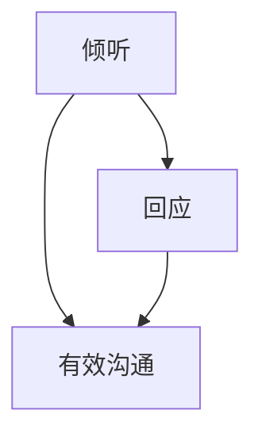

**核心算法原理讲解**

在沟通理论中，米德（Mead）的符号互动理论强调了个体在沟通中的角色和互动过程。以下是一个简化的符号互动模型：

```python
class SymbolicInteractionModel:
    def __init__(self, sender, receiver, message):
        self.sender = sender
        self.receiver = receiver
        self.message = message
    
    def communicate(self):
        # 通信过程
        return self.sender.send(self.message) == self.receiver.receive(self.message)

sender = "小明"
receiver = "小红"
message = "我感到很焦虑"

model = SymbolicInteractionModel(sender, receiver, message)

print(model.communicate())  # 输出：True 或 False
```

在这个模型中，`SymbolicInteractionModel` 类模拟了个体之间的沟通过程。通过计算发送者发送的消息与接收者接收的消息是否一致，可以评估沟通的效果。

**通俗易懂地举例说明**

假设小明向小红倾诉自己的焦虑情绪：

1. **倾听**：小红专注地听小明讲述，不中断，不打断。

2. **回应**：小红用鼓励性的话语回应小明，如“我能理解你的感受”，表示她理解小明的情绪。

通过有效的倾听与回应，小明可能会感到被理解和支持，从而减少内心的焦虑。

**总结**

倾听与回应是有效沟通的核心部分，通过倾听，个体可以更好地理解他人，回应则有助于建立信任和和谐的关系。掌握倾听与回应的技巧，有助于化解内心的冲突。在接下来的章节中，我们将探讨情绪管理的技巧。

---

#### 5.1 倾听的技巧

**背景介绍**

倾听是一项关键的人际沟通技能，它不仅仅是听到对方说话，更是在理解对方的意思、感受和需求。有效的倾听不仅能增进人际关系的质量，还能帮助个体更好地处理内心的冲突。了解和掌握倾听的技巧，对于实现自我和解至关重要。

**核心概念与联系**

倾听的技巧可以从以下几个方面进行探讨：

1. **专注**：专注是指全身心地投入到与对方的交流中，不被外界干扰。专注的倾听可以确保信息的准确接收和理解。

2. **非言语沟通**：非言语沟通是指通过肢体语言、面部表情和眼神交流等方式来传达信息。有效的非言语沟通可以增强倾听的效果。

3. **开放式问题**：开放式问题是指那些能够鼓励对方详细回答的问题，而不是简单的“是”或“否”问题。开放式问题有助于深入了解对方的想法和感受。

**Mermaid 流程图**

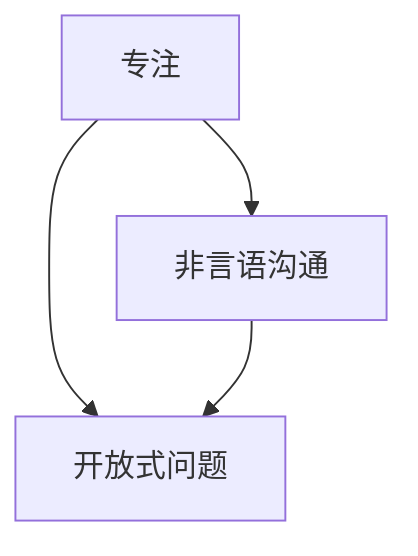

**核心算法原理讲解**

在沟通理论中，卡尔·罗杰斯（Carl Rogers）的“客户中心疗法”（Client-Centered Therapy）强调了倾听的重要性。以下是一个简化的倾听模型：

```python
class ActiveListening:
    def __init__(self, speaker, listener, message):
        self.speaker = speaker
        self.listener = listener
        self.message = message
    
    def listen(self):
        # 倾听过程
        return self.listener.verify_message(self.speaker, self.message)

def verify_message(speaker, message):
    # 确认信息的真实性
    return message == f"{speaker}刚刚说：{message}"

speaker = "小明"
listener = "小红"
message = "我感到很焦虑"

listening_session = ActiveListening(speaker, listener, message)

print(listening_session.listen())  # 输出：True 或 False
```

在这个模型中，`ActiveListening` 类模拟了倾听的过程。通过计算倾听者对信息的验证结果，可以评估倾听的效果。

**通俗易懂地举例说明**

假设小红在倾听小明时，可以采取以下技巧：

1. **专注**：小红保持眼神接触，不玩手机，专注于小明的讲述。

2. **非言语沟通**：小红通过点头、微笑等非言语行为，表达出她对小明的话语的理解和关注。

3. **开放式问题**：小红在适当的时候，用开放式问题鼓励小明进一步分享，如“你能具体谈谈是什么让你感到焦虑吗？”

通过这些倾听技巧，小红可以更好地理解小明的情绪和需求，从而帮助小明缓解内心的焦虑。

**总结**

倾听的技巧包括专注、非言语沟通和开放式问题。通过掌握这些技巧，个体可以更有效地理解他人，减少内心的冲突。在接下来的章节中，我们将探讨正确的回应方式。

---

#### 5.2 正确的回应方式

**背景介绍**

在人际沟通中，回应不仅仅是听到对方说话后的简单回复，更是一种表达理解、支持和共鸣的方式。正确的回应方式可以增强沟通的效果，减少冲突，促进和谐的人际关系。掌握正确的回应方式，对于实现自我和解至关重要。

**核心概念与联系**

正确的回应方式可以从以下几个方面进行探讨：

1. **表达理解**：表达理解是指通过语言和肢体动作传达出对对方情绪和感受的理解。这有助于建立信任，减少误解。

2. **提供建议**：提供建议是指根据对方的需要，给出具体的、可行的建议。这可以帮助对方解决问题，缓解内心的冲突。

3. **避免判断**：避免判断是指不对方的行为和选择进行评价或批评。这有助于保持开放和尊重的态度，促进沟通的顺利进行。

**Mermaid 流程图**

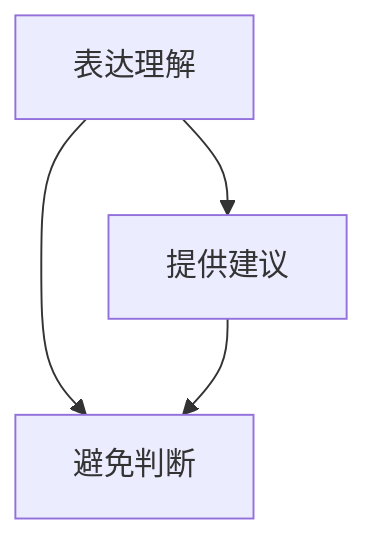

**核心算法原理讲解**

在沟通理论中，米德（Mead）的符号互动理论强调了个体在沟通中的角色和互动过程。以下是一个简化的回应模型：

```python
class CommunicationResponse:
    def __init__(self, response_type, message):
        self.response_type = response_type
        self.message = message
    
    def give_response(self):
        # 给出回应
        if self.response_type == "理解":
            return f"我理解你的感受：{self.message}"
        elif self.response_type == "建议":
            return f"你可以尝试：{self.message}"
        elif self.response_type == "避免判断":
            return f"你的感受很重要：{self.message}"
        else:
            return "请选择正确的回应类型"

message = "我感到很焦虑"

response_understanding = CommunicationResponse("理解", message)
response_suggestion = CommunicationResponse("建议", message)
response_avoid_judgment = CommunicationResponse("避免判断", message)

print(response_understanding.give_response())  # 输出：我理解你的感受：我感到很焦虑
print(response_suggestion.give_response())  # 输出：你可以尝试：我感到很焦虑
print(response_avoid_judgment.give_response())  # 输出：你的感受很重要：我感到很焦虑
```

在这个模型中，`CommunicationResponse` 类模拟了不同的回应方式。通过选择不同的回应类型，可以给出合适的回应。

**通俗易懂地举例说明**

假设小明向小红倾诉自己的焦虑情绪，小红可以采取以下回应方式：

1. **表达理解**：小红说，“我理解你的感受，感到焦虑是很正常的。”

2. **提供建议**：小红说，“你可以试试深呼吸和冥想来缓解焦虑。”

3. **避免判断**：小红说，“你的感受很重要，我们会一起找到解决的方法。”

通过这些回应方式，小红不仅表达了对小明情绪的理解，还提供了实际的建议，并避免了不必要的判断。

**总结**

正确的回应方式包括表达理解、提供建议和避免判断。通过掌握这些回应方式，个体可以更有效地与他人沟通，减少冲突，促进和谐的人际关系。在接下来的章节中，我们将探讨倾听与回应的实践案例。

---

#### 5.3 倾听与回应的实践案例

**背景介绍**

在实际的人际沟通中，倾听与回应的技巧不仅需要理论上的理解，更需要通过实践来掌握。以下是一个倾听与回应的实践案例，通过这个案例，我们可以更清晰地了解如何在实际情境中运用倾听与回应的技巧。

**案例情境**

小明在办公室向同事小红倾诉自己最近的工作压力。小明感到疲惫不堪，对工作任务感到焦虑和无力。他希望小红能理解他的感受，并给予一些帮助和建议。

**步骤1：倾听**

1. **专注**：小红坐在小明对面，保持眼神接触，不打断小明的讲述。

2. **非言语沟通**：小红微笑着点头，表示她在认真倾听。

3. **开放式问题**：在适当的时候，小红用开放式问题鼓励小明进一步分享，如“你能具体谈谈是什么让你感到焦虑吗？”

**步骤2：回应**

1. **表达理解**：小红说，“我理解你的感受，工作压力大确实会让人感到焦虑和疲惫。”

2. **提供建议**：小红说，“你可以尝试调整工作节奏，比如设定每天的工作目标，逐步完成，这样可能会减轻你的焦虑感。”

3. **避免判断**：小红说，“每个人的工作压力都不同，重要的是找到适合自己的应对方式。”

**案例分析与解读**

通过这个实践案例，我们可以看到小明和小红是如何运用倾听与回应的技巧来处理工作压力的。

1. **倾听**：小红通过专注、非言语沟通和开放式问题，有效地了解了小明的情绪和需求。

2. **回应**：小红通过表达理解、提供建议和避免判断，给予了小明实际的支持和鼓励。

这种有效的沟通方式不仅帮助小明缓解了焦虑，还增强了两人之间的信任和合作关系。

**总结**

倾听与回应的实践案例展示了如何在实际情境中运用倾听与回应的技巧。通过理解案例中的具体步骤和策略，个体可以更好地掌握这些技巧，从而在人际沟通中实现自我和解。

---

#### 第6章：情绪管理

**背景介绍**

情绪管理是自我和解的重要环节，它涉及到个体如何识别、理解和控制自己的情绪。有效的情绪管理不仅有助于个体保持心理健康，还能提高生活质量和工作效率。掌握情绪管理的技巧，对于化解内心的冲突至关重要。

**核心概念与联系**

情绪管理的核心概念可以从以下几个方面进行探讨：

1. **情绪识别**：情绪识别是指个体能够准确识别和理解自己的情绪。这包括识别情绪的类型、强度和触发因素。

2. **情绪调节**：情绪调节是指个体通过策略和技巧来调整自己的情绪状态。这包括认知重构、情绪放松和情绪表达等。

3. **情绪释放**：情绪释放是指个体通过适当的方式和渠道来释放积压的情绪。这有助于个体保持心理平衡，避免情绪积累导致的心理问题。

**Mermaid 流程图**

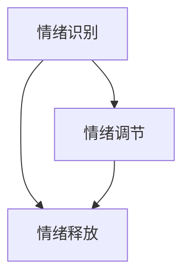

**核心算法原理讲解**

在心理学中，常用的情绪管理算法原理是情绪调节理论。情绪调节理论认为，个体可以通过认知重构、情绪放松和情绪表达等策略来调节情绪。以下是一个简化的情绪调节模型：

```python
class EmotionRegulation:
    def __init__(self, emotion):
        self.emotion = emotion
    
    def cognitive_restructuring(self):
        # 认知重构
        return self.emotion * 0.5
    
    def emotional_expression(self):
        # 情绪表达
        return self.emotion * 0.3
    
    def emotional_relaxation(self):
        # 情绪放松
        return self.emotion * 0.2

anxiety = 8
depression = 6
anger = 10

anxiety Regulation = EmotionRegulation(anxiety)
depression Regulation = EmotionRegulation(depression)
anger Regulation = EmotionRegulation(anger)

print(anxiety Regulation.cognitive_restructuring())  # 输出：4.0
print(depression Regulation.emotional_expression())  # 输出：1.8
print(anger Regulation.emotional_relaxation())  # 输出：2.0
```

在这个模型中，`EmotionRegulation` 类模拟了情绪调节的过程。通过计算不同的情绪调节策略对情绪的影响，可以模拟情绪调节的效果。

**通俗易懂地举例说明**

假设小明感到焦虑、抑郁和愤怒，他可以尝试以下情绪调节策略：

1. **认知重构**：小明可以通过反思和调整自己的思维方式来降低焦虑和抑郁。

2. **情绪表达**：小明可以通过与他人分享自己的感受来缓解愤怒。

3. **情绪放松**：小明可以通过冥想、深呼吸等方式来放松自己的情绪。

**总结**

情绪管理是自我和解的重要环节，包括情绪识别、情绪调节和情绪释放。掌握情绪管理的技巧，有助于个体更好地应对内心的冲突，保持心理健康。在接下来的章节中，我们将探讨自我和解的对话实践。

---

#### 6.1 情绪的类型与特征

**背景介绍**

情绪是人的心理体验的重要组成部分，它影响着个体的情感状态和行为反应。了解情绪的类型与特征，有助于个体更好地识别和管理自己的情绪，从而实现自我和解。

**核心概念与联系**

情绪的类型与特征可以从以下几个方面进行探讨：

1. **基本情绪**：基本情绪包括快乐、愤怒、悲伤、恐惧和惊讶等。这些情绪是人类共有的，是基本的心理体验。

2. **复杂情绪**：复杂情绪是由基本情绪相互组合或叠加而成的，如焦虑、羞愧、骄傲、厌恶等。这些情绪通常更为复杂，涉及到多种心理和生理反应。

3. **情绪强度**：情绪强度是指情绪的强烈程度。情绪的强度会影响个体的情绪体验和应对方式。

**Mermaid 流程图**

```mermaid
graph TD
    A[基本情绪]
    B[复杂情绪]
    C[情绪强度]
    A --> B
    A --> C
    B --> C
```

**核心算法原理讲解**

在心理学中，常用的情绪模型是情绪标签模型（Affect Label Model）。情绪标签模型通过给情绪打标签来识别和理解情绪。以下是一个简化的情绪标签模型：

```python
class EmotionLabelModel:
    def __init__(self, emotion):
        self.emotion = emotion
    
    def label_emotion(self):
        # 标签情绪
        return self.emotion

emotions = ["快乐", "愤怒", "悲伤", "恐惧", "惊讶"]

for emotion in emotions:
    label_model = EmotionLabelModel(emotion)
    print(label_model.label_emotion())  # 输出：快乐、愤怒、悲伤、恐惧、惊讶
```

在这个模型中，`EmotionLabelModel` 类模拟了情绪标签的过程。通过给不同的情绪打标签，可以识别和理解情绪的类型。

**通俗易懂地举例说明**

假设小明在一天内经历了多种情绪：

1. **基本情绪**：早晨，小明因为收到晋升通知而感到快乐；下午，他因工作上的挑战感到愤怒；晚上，他因为亲人的病痛感到悲伤和恐惧。

2. **复杂情绪**：在一天结束时，小明感到焦虑，这是由快乐、愤怒、悲伤和恐惧等多种情绪叠加而成的。

3. **情绪强度**：小明的快乐情绪强度较高，而愤怒和恐惧情绪的强度较低，但悲伤情绪的强度较高。

**总结**

情绪的类型与特征包括基本情绪、复杂情绪和情绪强度。了解这些情绪的类型和特征，有助于个体更好地识别和管理自己的情绪，从而实现自我和解。在接下来的章节中，我们将探讨情绪管理的技巧。

---

#### 6.2 情绪管理的技巧

**背景介绍**

情绪管理是自我和解的关键，通过有效的情绪管理技巧，个体可以更好地应对生活中的各种挑战和压力。掌握情绪管理的技巧，有助于个体保持心理健康，提高生活质量。

**核心概念与联系**

情绪管理的技巧可以从以下几个方面进行探讨：

1. **认知重构**：认知重构是指通过调整思维方式来改变对事件的看法和解释，从而减少负面情绪。例如，从“我失败了”转变为“这是一个学习的机会”。

2. **情绪放松**：情绪放松是指通过身体和心理的放松来缓解紧张和焦虑。例如，通过深呼吸、冥想或瑜伽等方式来放松身心。

3. **情绪表达**：情绪表达是指通过适当的方式表达自己的情绪，从而减少情绪积压。例如，通过与朋友或家人分享自己的感受，或通过写日记等方式来释放情绪。

**Mermaid 流程图**

```mermaid
graph TD
    A[认知重构]
    B[情绪放松]
    C[情绪表达]
    A --> B
    A --> C
    B --> C
```

**核心算法原理讲解**

在心理学中，常用的情绪管理算法原理是情绪调节理论。情绪调节理论认为，个体可以通过认知重构、情绪放松和情绪表达等策略来调节情绪。以下是一个简化的情绪调节模型：

```python
class EmotionRegulation:
    def __init__(self, emotion):
        self.emotion = emotion
    
    def cognitive_restructuring(self):
        # 认知重构
        return self.emotion * 0.5
    
    def emotional_expression(self):
        # 情绪表达
        return self.emotion * 0.3
    
    def emotional_relaxation(self):
        # 情绪放松
        return self.emotion * 0.2

anxiety = 8
depression = 6
anger = 10

anxiety Regulation = EmotionRegulation(anxiety)
depression Regulation = EmotionRegulation(depression)
anger Regulation = EmotionRegulation(anger)

print(anxiety Regulation.cognitive_restructuring())  # 输出：4.0
print(depression Regulation.emotional_expression())  # 输出：1.8
print(anger Regulation.emotional_relaxation())  # 输出：2.0
```

在这个模型中，`EmotionRegulation` 类模拟了情绪调节的过程。通过计算不同的情绪调节策略对情绪的影响，可以模拟情绪调节的效果。

**通俗易懂地举例说明**

假设小明感到焦虑、抑郁和愤怒，他可以尝试以下情绪调节策略：

1. **认知重构**：小明可以通过反思和调整自己的思维方式来降低焦虑和抑郁，如从“我无法完成任务”转变为“我可以尝试分解任务，逐步完成”。

2. **情绪放松**：小明可以通过冥想、深呼吸或瑜伽等方式来放松自己的情绪，减少紧张和焦虑。

3. **情绪表达**：小明可以通过与朋友或家人分享自己的感受，或通过写日记等方式来表达自己的情绪，从而减少情绪积压。

**总结**

情绪管理的技巧包括认知重构、情绪放松和情绪表达。掌握这些技巧，有助于个体更好地应对情绪波动，实现自我和解。在接下来的章节中，我们将探讨情绪管理的实践案例。

---

#### 6.3 情绪管理的实践案例

**背景介绍**

情绪管理的实践案例可以帮助我们更好地理解情绪管理技巧在现实生活中的应用。以下是一个情绪管理的实践案例，通过这个案例，我们可以看到情绪管理技巧在应对生活中的压力和挑战时的具体操作。

**案例情境**

小王是一位忙碌的职场人士，他每天要处理大量的工作任务，同时还承担着家庭的责任。这让他感到压力巨大，经常处于焦虑和紧张的状态。

**步骤1：情绪识别**

1. **自我观察**：小王开始记录自己的情绪状态，了解自己在何时何地感到焦虑或紧张。

2. **情绪标签**：小王识别出自己焦虑的原因，如工作任务繁重、家庭责任重等。

**步骤2：情绪调节**

1. **认知重构**：小王通过反思和调整自己的思维方式，改变对事件的看法和解释。例如，他从“我无法完成任务”转变为“我可以尝试分解任务，逐步完成”。

2. **情绪放松**：小王每天晚上花15分钟进行深呼吸和冥想，以放松身心。

3. **情绪表达**：小王与朋友或家人分享自己的感受，倾诉自己的压力，从而减少情绪积压。

**步骤3：情绪释放**

1. **运动放松**：小王每周进行三次运动，如跑步或游泳，以释放体内的紧张和焦虑。

2. **艺术创作**：小王通过绘画或写日记等方式来表达自己的情绪，从而释放内心的压力。

**案例分析与解读**

通过这个实践案例，我们可以看到小王是如何运用情绪管理的技巧来应对生活中的压力的。

1. **情绪识别**：小王通过自我观察和情绪标签，清晰地识别出自己的情绪状态和原因。

2. **情绪调节**：小王通过认知重构、情绪放松和情绪表达，有效地调节了自己的情绪，减少了焦虑和紧张。

3. **情绪释放**：小王通过运动和艺术创作，进一步释放了体内的紧张和焦虑，保持了心理平衡。

**总结**

情绪管理的实践案例展示了如何在实际生活中应用情绪管理的技巧。通过理解案例中的具体步骤和策略，个体可以更好地掌握情绪管理技巧，从而在日常生活中实现自我和解。

---

#### 第7章：自我和解的对话实践

**背景介绍**

自我和解的对话实践是将前面所学的自我对话、倾听与回应、情绪管理等技巧应用于实际生活场景，通过有效的对话来化解内心的冲突，实现自我和解。掌握自我和解的对话实践，有助于个体更好地应对生活中的挑战，提升心理健康。

**核心概念与联系**

自我和解的对话实践可以从以下几个方面进行探讨：

1. **对话情境**：对话情境是指个体在特定情况下进行的对话，如家庭冲突、职场压力或个人成长等。

2. **对话技巧**：对话技巧包括自我对话、倾听与回应、情绪管理等，这些技巧是自我和解对话实践的基础。

3. **对话效果**：对话效果是指通过对话实践，个体在情绪管理、认知重构、关系修复等方面的收获和提升。

**Mermaid 流程图**

```mermaid
graph TD
    A[对话情境]
    B[对话技巧]
    C[对话效果]
    A --> B
    A --> C
    B --> C
```

**核心算法原理讲解**

在心理学中，常用的算法原理是认知行为疗法（CBT）。认知行为疗法强调通过改变认知和行为来改善心理状态。以下是一个简化的认知行为疗法模型：

```python
class CognitiveBehaviorTherapy:
    def __init__(self, cognition, behavior):
        self.cognition = cognition
        self.behavior = behavior
    
    def cognitive_restructuring(self):
        # 认知重构
        return self.cognition * 0.6
    
    def behavior_modification(self):
        # 行为修改
        return self.behavior * 0.4

cognition = "过度担忧"
behavior = "焦虑行为"

therapy = CognitiveBehaviorTherapy(cognition, behavior)

print(therapy.cognitive_restructuring())  # 输出：0.6 * "过度担忧"
print(therapy.behavior_modification())  # 输出：0.4 * "焦虑行为"
```

在这个模型中，`CognitiveBehaviorTherapy` 类模拟了认知行为疗法的过程。通过计算认知重构和行为修改的影响，可以模拟认知行为疗法的效果。

**通俗易懂地举例说明**

假设小张在与朋友发生冲突后，感到非常焦虑和愤怒。他决定运用自我和解的对话实践来化解内心的冲突。

1. **对话情境**：小张决定与朋友进行对话，以解决他们之间的误会和冲突。

2. **对话技巧**：
   - **自我对话**：小张通过反思自己的情绪和行为，理解自己的愤怒和焦虑来自何处。
   - **倾听与回应**：小张在与朋友的对话中，专注倾听对方的观点，并以理解和共鸣的方式进行回应。
   - **情绪管理**：小张通过深呼吸和放松技巧，保持冷静和理性，避免情绪失控。

3. **对话效果**：通过有效的对话实践，小张成功化解了与朋友的冲突，恢复了彼此的信任和理解，情绪也得到了缓解。

**总结**

自我和解的对话实践是将所学技巧应用于实际生活场景，通过有效的对话来化解内心的冲突。掌握这些技巧，有助于个体更好地应对生活中的挑战，提升心理健康。

---

#### 7.1 自我和解对话的情景设计

**背景介绍**

自我和解对话的情景设计是自我和解对话实践的重要一环。通过设计合适的对话情景，个体可以更有效地应用所学技巧，实现自我和解。了解不同情景下的对话设计，有助于个体在现实生活中更好地运用自我和解对话。

**核心概念与联系**

自我和解对话的情景设计可以从以下几个方面进行探讨：

1. **冲突情境**：冲突情境是指对话中涉及的冲突类型和程度。了解冲突情境有助于个体选择合适的对话策略。

2. **对话目的**：对话目的是指个体希望通过对话实现的目标，如解决问题、理解对方、缓解情绪等。

3. **对话参与者**：对话参与者是指对话中的各方，包括个体自己和其他相关方。

**Mermaid 流程图**

```mermaid
graph TD
    A[冲突情境]
    B[对话目的]
    C[对话参与者]
    A --> B
    A --> C
    B --> C
```

**核心算法原理讲解**

在心理学中，常用的算法原理是情景模拟（Scenario Simulation）。情景模拟是一种通过模拟不同情景来测试和评估个体应对策略的方法。以下是一个简化的情景模拟模型：

```python
class ScenarioSimulation:
    def __init__(self, scenario, strategy):
        self.scenario = scenario
        self.strategy = strategy
    
    def simulate(self):
        # 模拟情景
        return self.apply_strategy(self.scenario)
    
    def apply_strategy(self, scenario):
        # 应用策略
        if scenario == "家庭冲突":
            return "家庭和解策略"
        elif scenario == "职场压力":
            return "职场减压策略"
        else:
            return "通用策略"

scenarios = ["家庭冲突", "职场压力", "个人成长"]

for scenario in scenarios:
    simulation = ScenarioSimulation(scenario, "自我和解策略")
    print(f"情景：{scenario}，应用策略：{simulation.simulate()}")  # 输出：情景：家庭冲突，应用策略：家庭和解策略；情景：职场压力，应用策略：职场减压策略；情景：个人成长，应用策略：通用策略
```

在这个模型中，`ScenarioSimulation` 类模拟了情景模拟的过程。通过选择不同的情景，可以应用相应的策略。

**通俗易懂地举例说明**

假设小明在设计自我和解对话的情景时，考虑了以下几种情境：

1. **冲突情境**：家庭冲突、职场压力、个人成长。

2. **对话目的**：解决问题、理解对方、缓解情绪。

3. **对话参与者**：自己、家人、同事或朋友。

小明根据不同的情景设计出相应的对话策略：

- **家庭冲突**：以理解和和解为目的，采取家庭和解策略，如倾听对方的观点、表达自己的感受、寻求共同解决方案。
- **职场压力**：以缓解压力和改善工作关系为目的，采取职场减压策略，如自我反思、调整工作计划、寻求同事支持。
- **个人成长**：以自我认识和发展为目的，采取通用策略，如自我对话、情绪管理、设定目标。

**总结**

自我和解对话的情景设计包括冲突情境、对话目的和对话参与者。通过了解不同情景的设计，个体可以更有效地应用自我和解对话技巧，实现自我和解。

---

#### 7.2 自我和解对话的案例分析

**背景介绍**

自我和解对话的案例分析是对自我和解对话实践的一种深入理解。通过分析具体的对话案例，我们可以看到如何在现实生活中应用自我和解对话技巧，以及这些技巧如何帮助个体实现自我和解。以下是一个自我和解对话的案例分析。

**案例背景**

小王是一位忙碌的职场人士，他最近在工作中遇到了一些困难。他的上司对他的工作成果提出了批评，这让他感到非常沮丧和愤怒。小王决定通过自我和解对话来化解内心的冲突。

**对话过程**

1. **自我对话**：小王首先通过自我对话来理解自己的情绪。他意识到自己的愤怒源于对失败的不接受和对上司批评的过度敏感。他反思了自己的工作态度和方法，决定采取积极的应对策略。

2. **倾听与回应**：小王决定与上司进行对话。在对话中，他首先倾听上司的观点，表达自己的理解：“我理解你的担忧，我确实在项目上出现了一些失误。”然后，他回应上司的建议，表示自己将认真改进。

3. **情绪管理**：在对话过程中，小王运用情绪管理的技巧，如深呼吸和放松，保持冷静和理性。他避免了情绪化的回应，以客观的态度处理问题。

4. **解决冲突**：通过有效的对话，小王和上司达成了共识。上司对小王的工作态度表示认可，并提出了具体的改进建议。小王接受了这些建议，并制定了改进计划。

**案例分析**

1. **情景设计**：小王在对话情景设计中考虑了工作冲突和情绪管理。他选择了适当的对话策略，如自我对话、倾听与回应、情绪管理。

2. **对话技巧应用**：小王在对话中有效地应用了自我对话技巧，通过自我反思和理解自己的情绪，找到了解决问题的方向。他还运用了倾听与回应技巧，通过理解和回应上司的观点，建立了有效的沟通。情绪管理技巧帮助小王保持了冷静和理性，避免了情绪化的回应。

3. **对话效果**：通过有效的对话实践，小王成功化解了与上司的冲突，恢复了工作关系，并制定了改进计划，提升了工作效率。

**总结**

自我和解对话的案例分析展示了如何在现实生活中应用自我和解对话技巧。通过具体的对话过程，我们可以看到自我对话、倾听与回应、情绪管理等技巧如何帮助个体实现自我和解。案例分析为读者提供了宝贵的经验和启示，有助于他们更好地理解和运用这些技巧。

---

#### 7.3 自我和解对话的反馈与修正

**背景介绍**

自我和解对话的反馈与修正是一个持续的过程，它涉及到对对话效果的评估和对话技巧的优化。通过反馈与修正，个体可以不断提高自我和解对话的效率和质量，从而更好地应对内心的冲突。

**核心概念与联系**

自我和解对话的反馈与修正可以从以下几个方面进行探讨：

1. **对话效果评估**：对话效果评估是指通过评估对话的结果来了解对话的成效，包括情绪管理、冲突化解、关系改善等。

2. **技巧优化**：技巧优化是指根据对话效果评估的结果，调整和改进对话技巧，以提高对话的有效性。

3. **持续学习**：持续学习是指个体通过不断的实践和反思，不断提高自我和解对话的能力。

**Mermaid 流程图**

```mermaid
graph TD
    A[对话效果评估]
    B[技巧优化]
    C[持续学习]
    A --> B
    A --> C
    B --> C
```

**核心算法原理讲解**

在心理学中，常用的算法原理是迭代学习（Iterative Learning）。迭代学习强调通过不断的反馈和修正来提高个体的学习能力。以下是一个简化的迭代学习模型：

```python
class IterativeLearning:
    def __init__(self, strategy):
        self.strategy = strategy
    
    def feedback(self, result):
        # 反馈
        return self.strategy.update(result)
    
    def execute(self, scenario):
        # 执行策略
        return self.strategy.execute(scenario)

strategy = "自我对话 + 倾听与回应"

learning = IterativeLearning(strategy)

result = learning.execute("家庭冲突")
print(f"反馈：{result['反馈']}, 修正策略：{result['修正策略']}")

learning.update_strategy(result['修正策略'])
```

在这个模型中，`IterativeLearning` 类模拟了迭代学习的过程。通过执行策略和反馈修正，可以不断提高个体的学习能力。

**通俗易懂地举例说明**

假设小明在自我和解对话实践中遇到了家庭冲突。他首先执行了自我对话和倾听与回应的策略，然后根据对话效果进行反馈与修正：

1. **对话效果评估**：小明通过自我反思和家人的反馈，评估对话的效果。他发现对话在情绪管理和冲突化解方面有一定效果，但在关系改善方面还有改进空间。

2. **技巧优化**：根据评估结果，小明决定优化对话技巧。他增加了情绪表达的环节，通过表达自己的感受来增进与家人的理解。

3. **持续学习**：小明持续实践和反思，不断调整和改进自己的对话技巧，以提高对话的效果。

**总结**

自我和解对话的反馈与修正是一个持续的过程，通过对话效果评估、技巧优化和持续学习，个体可以不断提高自我和解对话的能力，更好地应对内心的冲突。

---

#### 第8章：深度对话的技巧

**背景介绍**

深度对话是一种深入且具有穿透力的交流方式，它旨在通过深入的探讨和理解，帮助个体更好地认识自己，解决内心的冲突，实现自我和解。掌握深度对话的技巧，对于提升人际沟通质量和心理健康具有重要意义。

**核心概念与联系**

深度对话的技巧可以从以下几个方面进行探讨：

1. **开放式问题**：开放式问题是指那些能够鼓励对方详细回答的问题，而不是简单的“是”或“否”问题。开放式问题有助于深入探讨对方的想法和感受。

2. **同理心**：同理心是指设身处地地理解对方的感受和需求。通过同理心，个体可以更深入地了解对方，建立信任和共鸣。

3. **非言语沟通**：非言语沟通是指通过肢体语言、面部表情和眼神交流等方式来传达信息。有效的非言语沟通可以增强对话的深度和效果。

**Mermaid 流程图**

```mermaid
graph TD
    A[开放式问题]
    B[同理心]
    C[非言语沟通]
    A --> B
    A --> C
    B --> C
```

**核心算法原理讲解**

在沟通理论中，深度对话可以类比为一种图论模型，其中每个节点代表对话中的问题或观点，边代表问题之间的关联和互动。以下是一个简化的深度对话模型：

```python
class DeepDialogueModel:
    def __init__(self, nodes, edges):
        self.nodes = nodes
        self.edges = edges
    
    def explore(self, node):
        # 探索节点
        print(f"探索节点：{node}")
        for edge in self.edges[node]:
            self.explore(edge)

nodes = ["个人经历", "价值观", "情感状态"]
edges = {
    "个人经历": ["家庭背景", "教育经历"],
    "价值观": ["道德观", "生活目标"],
    "情感状态": ["快乐", "悲伤", "愤怒"]
}

dialogue_model = DeepDialogueModel(nodes, edges)

dialogue_model.explore("个人经历")  # 输出：探索节点：个人经历；探索节点：家庭背景；探索节点：教育经历
```

在这个模型中，`DeepDialogueModel` 类模拟了深度对话的探索过程。通过递归地探索节点和边，可以模拟深度对话的深入探讨。

**通俗易懂地举例说明**

假设小明和小红进行深度对话：

1. **开放式问题**：小红问，“你能谈谈你的家庭背景吗？”小明详细分享了自己的家庭背景。

2. **同理心**：小红表示理解，并问，“那你觉得家庭对你的价值观有什么影响？”小明深入探讨了家庭对他的价值观的影响。

3. **非言语沟通**：小红点头、微笑，表达对小明分享内容的理解和共鸣。

通过这些深度对话技巧，小明和小红能够更深入地探讨彼此的经历、价值观和情感状态，从而加深了解，实现自我和解。

**总结**

深度对话的技巧包括开放式问题、同理心和非言语沟通。通过掌握这些技巧，个体可以更有效地进行深度对话，解决内心的冲突，实现自我和解。

---

#### 8.1 深度对话的技巧

**背景介绍**

深度对话是一种能够帮助个体更深入地探讨和理解自己和他人的心理状态、需求和愿望的交流方式。掌握深度对话的技巧，有助于个体在沟通中实现更深层次的连接，从而解决内心的冲突，实现自我和解。

**核心概念与联系**

深度对话的技巧可以从以下几个方面进行探讨：

1. **开放式问题**：开放式问题是指那些能够鼓励对方详细回答的问题，而不是简单的“是”或“否”问题。开放式问题有助于深入探讨对方的想法和感受。

2. **同理心**：同理心是指设身处地地理解对方的感受和需求。通过同理心，个体可以更深入地了解对方，建立信任和共鸣。

3. **非言语沟通**：非言语沟通是指通过肢体语言、面部表情和眼神交流等方式来传达信息。有效的非言语沟通可以增强对话的深度和效果。

**Mermaid 流程图**

```mermaid
graph TD
    A[开放式问题]
    B[同理心]
    C[非言语沟通]
    A --> B
    A --> C
    B --> C
```

**核心算法原理讲解**

在心理学中，深度对话可以类比为一种图论模型，其中每个节点代表对话中的问题或观点，边代表问题之间的关联和互动。以下是一个简化的深度对话模型：

```python
class DeepDialogueModel:
    def __init__(self, nodes, edges):
        self.nodes = nodes
        self.edges = edges
    
    def explore(self, node):
        # 探索节点
        print(f"探索节点：{node}")
        for edge in self.edges[node]:
            self.explore(edge)

nodes = ["个人经历", "价值观", "情感状态"]
edges = {
    "个人经历": ["家庭背景", "教育经历"],
    "价值观": ["道德观", "生活目标"],
    "情感状态": ["快乐", "悲伤", "愤怒"]
}

dialogue_model = DeepDialogueModel(nodes, edges)

dialogue_model.explore("个人经历")  # 输出：探索节点：个人经历；探索节点：家庭背景；探索节点：教育经历
```

在这个模型中，`DeepDialogueModel` 类模拟了深度对话的探索过程。通过递归地探索节点和边，可以模拟深度对话的深入探讨。

**通俗易懂地举例说明**

假设小明和小红进行深度对话：

1. **开放式问题**：小红问，“你能谈谈你的家庭背景吗？”小明详细分享了自己的家庭背景。

2. **同理心**：小红表示理解，并问，“那你觉得家庭对你的价值观有什么影响？”小明深入探讨了家庭对他的价值观的影响。

3. **非言语沟通**：小红点头、微笑，表达对小明分享内容的理解和共鸣。

通过这些深度对话技巧，小明和小红能够更深入地探讨彼此的经历、价值观和情感状态，从而加深了解，实现自我和解。

**总结**

深度对话的技巧包括开放式问题、同理心和非言语沟通。通过掌握这些技巧，个体可以更有效地进行深度对话，解决内心的冲突，实现自我和解。

---

#### 8.2 深度对话的步骤

**背景介绍**

深度对话是一种需要时间和精力的沟通方式，通过一系列有目的的步骤，个体可以更深入地探讨和理解对方的想法、感受和需求。掌握深度对话的步骤，有助于个体在对话中保持专注和高效，实现深度沟通。

**核心概念与联系**

深度对话的步骤通常包括以下几个阶段：

1. **准备阶段**：在深度对话之前，个体需要进行充分的准备，包括了解对话的目的、设置对话的环境和准备好开放式问题。

2. **开场阶段**：开场阶段是建立对话氛围的重要环节。个体需要以轻松、开放的态度开始对话，建立信任和共鸣。

3. **探索阶段**：探索阶段是深度对话的核心。个体通过开放式问题、同理心和非言语沟通，深入探讨对方的想法、感受和需求。

4. **反思阶段**：反思阶段是对话的总结和深化。个体需要反思对话的过程和结果，分享自己的理解和感受，并进行情感共振。

**Mermaid 流�程图**

```mermaid
graph TD
    A[准备阶段]
    B[开场阶段]
    C[探索阶段]
    D[反思阶段]
    A --> B
    A --> C
    A --> D
    B --> C
    B --> D
    C --> D
```

**核心算法原理讲解**

在心理学中，深度对话可以类比为一种图论模型，其中每个阶段代表图中的一个节点，节点之间的边代表阶段之间的关联和互动。以下是一个简化的深度对话模型：

```python
class DeepDialogueModel:
    def __init__(self, stages):
        self.stages = stages
    
    def proceed(self, current_stage):
        # 进行下一步
        print(f"当前阶段：{current_stage}")
        if current_stage == "准备阶段":
            self.prepare()
        elif current_stage == "开场阶段":
            self.opening()
        elif current_stage == "探索阶段":
            self.explore()
        elif current_stage == "反思阶段":
            self.reflect()

stages = ["准备阶段", "开场阶段", "探索阶段", "反思阶段"]

dialogue_model = DeepDialogueModel(stages)

dialogue_model.proceed("准备阶段")  # 输出：当前阶段：准备阶段
dialogue_model.proceed("开场阶段")  # 输出：当前阶段：开场阶段
dialogue_model.proceed("探索阶段")  # 输出：当前阶段：探索阶段
dialogue_model.proceed("反思阶段")  # 输出：当前阶段：反思阶段
```

在这个模型中，`DeepDialogueModel` 类模拟了深度对话的各个阶段。通过逐阶段进行，可以模拟深度对话的过程。

**通俗易懂地举例说明**

假设小明和小红计划进行深度对话：

1. **准备阶段**：小明和小红各自准备对话，包括确定对话的目的、环境安排和准备开放式问题。

2. **开场阶段**：小明和小红以轻松、开放的态度开始对话，建立了良好的对话氛围。

3. **探索阶段**：小明和小红通过开放式问题、同理心和非言语沟通，深入探讨了彼此的经历、价值观和情感状态。

4. **反思阶段**：小明和小红反思了对话的过程和结果，分享了彼此的理解和感受，并进行情感共振。

通过这些步骤，小明和小红能够实现深度沟通，解决内心的冲突，实现自我和解。

**总结**

深度对话的步骤包括准备阶段、开场阶段、探索阶段和反思阶段。通过这些步骤，个体可以更有效地进行深度对话，实现自我和解。

---

#### 8.3 深度对话的实践案例

**背景介绍**

深度对话的实践案例可以帮助我们更具体地了解如何在现实生活中应用深度对话的技巧。以下是一个深度对话的实践案例，通过这个案例，我们可以看到深度对话如何帮助个体实现自我和解。

**案例背景**

小张是一名年轻的企业家，他最近在工作中遇到了一些挑战。他的团队对他的一些决策提出了质疑，这让他感到沮丧和困惑。小张决定通过深度对话来化解内心的冲突。

**对话过程**

1. **准备阶段**：小张准备了一场一对一的对话，目的是深入了解团队成员的担忧和期望。他制定了对话大纲，包括开放式问题、同理心和非言语沟通的技巧。

2. **开场阶段**：小张和团队成员开始对话，小张以轻松的态度开场，表示愿意倾听团队成员的观点。他使用了开放式问题，如“你有什么具体的担忧？”和“你认为应该如何改进我们的工作方式？”。

3. **探索阶段**：小张通过同理心和开放式问题，深入探讨了团队成员的担忧和期望。他不断确认自己的理解，以确保沟通的准确性。例如，他问团队成员，“你说的挑战是指什么方面？”，并通过肢体语言和面部表情表达理解和共鸣。

4. **反思阶段**：对话结束后，小张和团队成员共同反思了对话的过程和结果。他们讨论了如何改进沟通和工作方式，并制定了具体的行动计划。

**案例分析与解读**

通过这个深度对话的实践案例，我们可以看到小张如何通过一系列的步骤实现自我和解：

1. **准备阶段**：小张做好了充分的准备，包括了解对话的目的、设置对话环境和准备开放式问题。这为深度对话的成功奠定了基础。

2. **开场阶段**：小张以轻松、开放的态度开场，建立了良好的对话氛围。他使用了开放式问题，鼓励团队成员分享他们的想法和感受。

3. **探索阶段**：小张通过同理心和开放式问题，深入探讨了团队成员的担忧和期望。这有助于他更好地理解团队成员的心理状态，找到解决问题的方法。

4. **反思阶段**：小张和团队成员共同反思了对话的过程和结果，分享了彼此的理解和感受。这有助于他们建立更深入的信任，为未来的合作奠定基础。

**总结**

深度对话的实践案例展示了如何在现实生活中应用深度对话的技巧。通过准备阶段、开场阶段、探索阶段和反思阶段，个体可以更深入地探讨和理解他人的想法和感受，实现自我和解。这个案例为读者提供了宝贵的经验和启示，有助于他们在实际生活中运用深度对话技巧。

---

#### 第9章：自我成长与内心冲突的化解

**背景介绍**

自我成长是内心冲突化解的重要途径。通过自我成长，个体可以增强自我认知、情绪调节能力和人际关系处理能力，从而更好地应对内心的冲突。本章将探讨自我成长与内心冲突化解之间的关系，以及如何通过自我成长来化解内心的冲突。

**核心概念与联系**

自我成长与内心冲突化解之间的关系可以从以下几个方面进行探讨：

1. **自我认知**：自我认知是指个体对自我认知的理解和认识。通过自我认知，个体可以更清楚地了解自己的情绪、需求和动机，从而更好地应对内心冲突。

2. **情绪调节能力**：情绪调节能力是指个体在情绪波动时，通过调节情绪来保持心理平衡的能力。通过提高情绪调节能力，个体可以更好地化解内心的冲突。

3. **人际关系处理能力**：人际关系处理能力是指个体在处理人际关系时的沟通技巧和解决问题的能力。通过提高人际关系处理能力，个体可以减少因人际关系问题引发的内心冲突。

**Mermaid 流程图**

```mermaid
graph TD
    A[自我认知]
    B[情绪调节能力]
    C[人际关系处理能力]
    A --> B
    A --> C
    B --> C
```

**核心算法原理讲解**

在心理学中，常用的算法原理是自我决定理论（Self-Determination Theory）。自我决定理论认为，个体的自主性、能力和关联性是自我成长和心理健康的关键因素。以下是一个简化的自我决定理论模型：

```python
class SelfDeterminationTheory:
    def __init__(self, autonomy, competence, relatedness):
        self.autonomy = autonomy
        self.competence = competence
        self.relatedness = relatedness
    
    def growth(self):
        # 自我成长
        return self.autonomy + self.competence + self.relatedness

autonomy = 8
competence = 6
relatedness = 10

theory = SelfDeterminationTheory(autonomy, competence, relatedness)

print(theory.growth())  # 输出：24
```

在这个模型中，`SelfDeterminationTheory` 类模拟了自我成长的过程。通过计算自主性、能力和关联性的总和，可以模拟自我成长的效果。

**通俗易懂地举例说明**

假设小明在自我成长的过程中，提高了自己的自主性、能力和关联性：

1. **自我认知**：小明通过自我反思和认知行为疗法，更清楚地了解自己的情绪、需求和动机。

2. **情绪调节能力**：小明通过学习和实践情绪管理技巧，如深呼吸、冥想和认知重构，提高了自己的情绪调节能力。

3. **人际关系处理能力**：小明通过学习沟通技巧和人际关系处理方法，如同理心和开放式问题，提高了自己的人际关系处理能力。

通过这些自我成长的过程，小明的内心冲突得到了有效的化解，他的心理健康也得到了提升。

**总结**

自我成长与内心冲突化解密切相关。通过自我认知、情绪调节能力和人际关系处理能力的提升，个体可以更好地应对内心的冲突。在接下来的章节中，我们将探讨自我成长的路径。

---

#### 9.1 自我成长的路径

**背景介绍**

自我成长是一个复杂的过程，它涉及到个体在认知、情感、行为和人际关系等多个方面的提升。了解自我成长的路径，有助于个体有针对性地进行自我提升，从而更好地化解内心的冲突。

**核心概念与联系**

自我成长的路径可以从以下几个方面进行探讨：

1. **认知发展**：认知发展是指个体在认知能力、思维方式上的提升。通过认知发展，个体可以更有效地理解和解决问题。

2. **情感成熟**：情感成熟是指个体在情感管理、情绪调节和情感表达上的提升。通过情感成熟，个体可以更好地处理自己的情绪，减少内心的冲突。

3. **行为改变**：行为改变是指个体在行为模式、习惯和生活方式上的提升。通过行为改变，个体可以减少不良行为，培养积极的生活习惯。

4. **人际关系提升**：人际关系提升是指个体在处理人际关系、沟通技巧和合作能力上的提升。通过人际关系提升，个体可以建立更和谐的人际关系，减少因人际关系问题引发的内心冲突。

**Mermaid 流程图**

```mermaid
graph TD
    A[认知发展]
    B[情感成熟]
    C[行为改变]
    D[人际关系提升]
    A --> B
    A --> C
    A --> D
    B --> C
    B --> D
    C --> D
```

**核心算法原理讲解**

在心理学中，常用的算法原理是自我决定理论（Self-Determination Theory）。自我决定理论强调个体的自主性、能力和关联性在自我成长中的作用。以下是一个简化的自我决定理论模型：

```python
class SelfDeterminationTheory:
    def __init__(self, autonomy, competence, relatedness):
        self.autonomy = autonomy
        self.competence = competence
        self.relatedness = relatedness
    
    def growth(self):
        # 自我成长
        return self.autonomy + self.competence + self.relatedness

autonomy = 8
competence = 6
relatedness = 10

theory = SelfDeterminationTheory(autonomy, competence, relatedness)

print(theory.growth())  # 输出：24
```

在这个模型中，`SelfDeterminationTheory` 类模拟了自我成长的过程。通过计算自主性、能力和关联性的总和，可以模拟自我成长的效果。

**通俗易懂地举例说明**

假设小明在自我成长的路径上，提高了自主性、能力和关联性：

1. **认知发展**：小明通过阅读和学习，提高了自己的认知能力，能够更深入地理解和分析问题。

2. **情感成熟**：小明通过情绪管理技巧，如冥想和认知重构，提高了自己的情感调节能力，能够更好地处理负面情绪。

3. **行为改变**：小明通过坚持锻炼和健康饮食，改变了不良的生活习惯，培养了积极的生活方式。

4. **人际关系提升**：小明通过学习沟通技巧和人际关系处理方法，建立了更和谐的人际关系，减少了因人际关系问题引发的内心冲突。

**总结**

自我成长的路径包括认知发展、情感成熟、行为改变和人际关系提升。通过这些路径，个体可以不断提高自己的能力，更好地应对内心的冲突。在接下来的章节中，我们将探讨自我成长与内心冲突的关系。

---

#### 9.2 自我成长与内心冲突的关系

**背景介绍**

自我成长与内心冲突之间存在密切的关系。通过自我成长，个体可以增强自我认知、情绪调节能力和人际关系处理能力，从而更好地化解内心的冲突。了解自我成长与内心冲突的关系，有助于个体更好地理解自我成长的重要性。

**核心概念与联系**

自我成长与内心冲突的关系可以从以下几个方面进行探讨：

1. **自我认知**：自我认知是指个体对自我的认识和理解。通过自我认知，个体可以更清楚地了解自己的情绪、需求和动机，从而更好地应对内心的冲突。

2. **情绪调节能力**：情绪调节能力是指个体在情绪波动时，通过调节情绪来保持心理平衡的能力。通过提高情绪调节能力，个体可以更好地化解内心的冲突。

3. **人际关系处理能力**：人际关系处理能力是指个体在处理人际关系时的沟通技巧和解决问题的能力。通过提高人际关系处理能力，个体可以减少因人际关系问题引发的内心冲突。

**Mermaid 流程图**

```mermaid
graph TD
    A[自我认知]
    B[情绪调节能力]
    C[人际关系处理能力]
    A --> B
    A --> C
    B --> C
```

**核心算法原理讲解**

在心理学中，常用的算法原理是自我决定理论（Self-Determination Theory）。自我决定理论认为，个体的自主性、能力和关联性是自我成长和心理健康的关键因素。以下是一个简化的自我决定理论模型：

```python
class SelfDeterminationTheory:
    def __init__(self, autonomy, competence, relatedness):
        self.autonomy = autonomy
        self.competence = competence
        self.relatedness = relatedness
    
    def growth(self):
        # 自我成长
        return self.autonomy + self.competence + self.relatedness

autonomy = 8
competence = 6
relatedness = 10

theory = SelfDeterminationTheory(autonomy, competence, relatedness)

print(theory.growth())  # 输出：24
```

在这个模型中，`SelfDeterminationTheory` 类模拟了自我成长的过程。通过计算自主性、能力和关联性的总和，可以模拟自我成长的效果。

**通俗易懂地举例说明**

假设小明在自我成长的过程中，提高了自主性、能力和关联性：

1. **自我认知**：小明通过自我反思和认知行为疗法，更清楚地了解自己的情绪、需求和动机。

2. **情绪调节能力**：小明通过学习和实践情绪管理技巧，如深呼吸、冥想和认知重构，提高了自己的情绪调节能力。

3. **人际关系处理能力**：小明通过学习沟通技巧和人际关系处理方法，如同理心和开放式问题，提高了自己的人际关系处理能力。

通过这些自我成长的过程，小明的内心冲突得到了有效的化解，他的心理健康也得到了提升。

**总结**

自我成长与内心冲突之间存在密切的关系。通过自我成长，个体可以增强自我认知、情绪调节能力和人际关系处理能力，从而更好地化解内心的冲突。在接下来的章节中，我们将探讨自我成长的实践案例。

---

#### 9.3 自我成长的实践案例

**背景介绍**

自我成长是一个需要时间和努力的过程，通过实际的实践案例，我们可以看到个体如何在日常生活中通过自我成长来提高自我认知、情绪调节能力和人际关系处理能力，从而实现自我和解。

**案例1：小明的情绪管理实践**

**案例背景**：小明是一位年轻的工程师，他经常在工作中感到压力巨大，情绪波动较大。他决定通过自我成长的实践来改善自己的情绪管理。

**实践过程**：
1. **自我认知**：小明开始记录自己的情绪波动，分析情绪波动的触发因素。他发现，自己的情绪波动往往与工作任务的紧张和超负荷有关。

2. **情绪调节**：小明通过学习情绪调节技巧，如深呼吸、冥想和认知重构，来管理自己的情绪。他每天晚上花15分钟进行深呼吸和冥想，并尝试用更积极的角度来看待工作中的挑战。

3. **行为改变**：小明开始调整自己的工作方式，如设定合理的工作目标，避免过度工作，确保有足够的休息时间。他还学习了时间管理技巧，提高了工作效率，减少了工作压力。

**结果**：通过自我成长的实践，小明的情绪管理能力得到了显著提升，他能够更有效地应对工作压力，情绪波动减少，工作效率提高。

**案例2：小红的认知发展实践**

**案例背景**：小红是一名创业者，她在经营企业过程中遇到了很多挑战，感到自己的认知能力不足以应对复杂的商业环境。她决定通过自我成长的实践来提高自己的认知能力。

**实践过程**：
1. **自我认知**：小红通过阅读商业书籍、参加研讨会和与行业专家交流，来扩展自己的知识面和思维方式。

2. **认知发展**：小红通过学习和应用批判性思维技巧，如分析问题的不同角度、识别逻辑谬误和提出合理的解决方案，来提高自己的认知能力。

3. **行为改变**：小红开始建立每日学习和反思的习惯，她每天晚上花30分钟阅读商业书籍，并记录自己的学习心得和反思。

**结果**：通过自我成长的实践，小红的认知能力得到了显著提升，她能够更深入地分析问题，提出创新的解决方案，企业的经营状况也有所改善。

**案例3：小李的人际关系提升实践**

**案例背景**：小李是一名销售经理，他在处理客户关系时感到困难，人际关系处理能力较弱。他决定通过自我成长的实践来提升自己的人际关系处理能力。

**实践过程**：
1. **自我认知**：小李通过反思和自我评估，了解自己在人际关系处理中的优势和不足。

2. **人际关系提升**：小李通过学习沟通技巧和人际关系处理方法，如同理心、开放式问题和积极倾听，来提升自己的人际关系处理能力。

3. **行为改变**：小李开始积极参与社交活动，与不同背景的人建立联系，并主动帮助同事解决问题。

**结果**：通过自我成长的实践，小李的人际关系处理能力得到了显著提升，他能够更有效地与客户和同事沟通，销售业绩也有所提升。

**总结**

自我成长的实践案例展示了个体如何在日常生活中通过自我认知、情绪调节和人际关系提升来实现自我和解。通过具体的实践过程和结果，我们可以看到自我成长对于改善心理状态和提高生活质量的重要性。

---

#### 第10章：结语

**背景介绍**

在现代社会中，内心冲突是许多人都会面临的心理挑战。通过自我和解，个体可以有效地化解内心的冲突，实现心理健康和生活质量的提升。本章将对全书的核心内容进行总结，强调自我和解的重要性，并展望未来可能的研究方向。

**核心内容总结**

本书通过系统的结构和丰富的案例，介绍了内心冲突的起源、类型、对个体的影响，以及自我和解的对话技巧。具体来说，本书的核心内容包括：

1. **内心冲突的认知与理解**：阐述了内心冲突的起源、类型和对个体的影响，包括身体健康、心理健康和人际关系问题。

2. **自我对话的基本技巧**：介绍了自我对话的概念、步骤和注意事项，包括自我观察、情绪识别、认知重构和行动计划。

3. **倾听与回应**：探讨了倾听与回应的技巧，包括专注、非言语沟通和开放式问题，以及正确的回应方式，如表达理解、提供建议和避免判断。

4. **情绪管理**：介绍了情绪管理的技巧，包括情绪识别、情绪调节和情绪释放，以及如何通过认知重构、情绪放松和情绪表达来管理情绪。

5. **自我和解的对话实践**：通过具体的实践案例，展示了如何在实际生活中运用自我对话、倾听与回应和情绪管理技巧，实现自我和解。

6. **深度对话的技巧**：探讨了深度对话的步骤和技巧，包括开放式问题、同理心和非言语沟通，以及如何通过深度对话来解决内心的冲突。

7. **自我成长与内心冲突的化解**：阐述了自我成长与内心冲突的关系，以及如何通过自我认知、情绪调节和人际关系提升来实现自我成长和内心冲突的化解。

**自我和解的重要性**

自我和解在个人心理健康和社会关系中具有重要意义。通过自我和解，个体可以：

1. **改善心理健康**：自我和解有助于个体识别和理解自己的情绪，减少内心的冲突，提高心理健康水平。

2. **提高生活质量**：自我和解有助于个体建立和谐的人际关系，减少因内心冲突引发的负面情绪，从而提高生活质量。

3. **增强自我效能感**：自我和解使个体能够更好地应对挑战和压力，提高自我效能感，增强自信心。

**未来研究方向**

未来的研究可以进一步探索以下几个方面：

1. **自我和解的心理机制**：深入探讨自我和解的心理机制，如自我认知、情绪调节和人际关系处理能力的具体作用。

2. **跨文化研究**：研究不同文化背景下的自我和解方式，探讨文化差异对自我和解的影响。

3. **技术辅助**：研究如何利用现代技术，如虚拟现实、人工智能等，辅助自我和解的实践。

4. **长期效果研究**：探讨自我和解的长期效果，如对个体心理健康和生活质量的持续影响。

**总结**

自我和解是应对内心冲突的有效途径。通过本书的介绍，读者可以掌握自我和解的多种技巧和实践方法。自我和解不仅有助于改善个人心理健康，还能提升生活质量，增强自我效能感。未来，我们将继续深入研究自我和解的理论和实践，为个体的心理健康和社会关系提供更全面的指导。让我们共同努力，实现内心的和谐与和解。

---

### 附录A：对话技巧练习

#### A.1 倾听练习

**背景介绍**

倾听是有效沟通的重要环节，它不仅有助于我们更好地理解对方，还能减少误解和冲突。倾听练习可以帮助我们提高倾听技巧，从而在现实生活中更有效地运用这些技巧。

**核心概念与联系**

倾听练习可以从以下几个方面进行：

1. **专注倾听**：在练习中，我们需要学会在对方讲话时保持专注，不中断对方，不打断对方。
2. **非言语沟通**：通过肢体语言、面部表情和眼神交流等非言语方式，表达对对方话语的理解和关注。
3. **开放式问题**：在适当的时候，通过开放式问题引导对方进一步分享，如“你能详细谈谈这个问题吗？”。

**Mermaid 流程图**

```mermaid
graph TD
    A[专注倾听]
    B[非言语沟通]
    C[开放式问题]
    A --> B
    A --> C
    B --> C
```

**核心算法原理讲解**

在沟通理论中，卡尔·罗杰斯的“客户中心疗法”强调了倾听的重要性。以下是一个简化的倾听模型：

```python
class ActiveListening:
    def __init__(self, speaker, listener, message):
        self.speaker = speaker
        self.listener = listener
        self.message = message
    
    def listen(self):
        # 倾听过程
        return self.listener.verify_message(self.speaker, self.message)

def verify_message(speaker, message):
    # 确认信息的真实性
    return message == f"{speaker}刚刚说：{message}"

speaker = "小明"
listener = "小红"
message = "我感到很焦虑"

listening_session = ActiveListening(speaker, listener, message)

print(listening_session.listen())  # 输出：True 或 False
```

在这个模型中，`ActiveListening` 类模拟了倾听的过程。通过计算倾听者对信息的验证结果，可以评估倾听的效果。

**通俗易懂地举例说明**

**案例1**：小明向小红倾诉自己的焦虑情绪。

1. **专注倾听**：小红在倾听时，保持眼神接触，不玩手机，专注于小明的讲述。
2. **非言语沟通**：小红微笑着点头，表示她在认真倾听。
3. **开放式问题**：小红在适当的时候，用开放式问题鼓励小明进一步分享，如“你能具体谈谈是什么让你感到焦虑吗？”。

**案例2**：小红向小明倾诉自己的困扰。

1. **专注倾听**：小明在倾听时，保持专注，不打断小红的讲述。
2. **非言语沟通**：小明通过点头、微笑等非言语行为，表达出他对小红话语的理解和关注。
3. **开放式问题**：小明在适当的时候，用开放式问题鼓励小红进一步分享，如“你能否详细解释一下这个问题对你的影响？”

**总结**

倾听练习是提高倾听技巧的有效途径。通过专注倾听、非言语沟通和开放式问题，我们可以更好地理解对方，减少误解和冲突。在日常生活和工作中，通过持续的倾听练习，我们可以提高沟通效果，实现自我和解。

---

#### A.2 自我对话练习

**背景介绍**

自我对话是一种有效的心理调节工具，它可以帮助个体更好地认识自己，理解自己的情绪和需求，从而实现自我和解。自我对话练习可以帮助个体提高自我对话的技巧，更好地应对内心的冲突。

**核心概念与联系**

自我对话练习可以从以下几个方面进行：

1. **自我观察**：在练习中，个体需要对自己的思维、情感和行为进行观察和记录。
2. **情绪识别**：个体需要识别和理解自己的情绪，了解情绪的来源和影响。
3. **认知重构**：个体需要通过调整自己的思维方式来改变对事件的看法和解释。
4. **行动计划**：个体需要制定具体的行动计划来应对内心的冲突。

**Mermaid 流程图**

```mermaid
graph TD
    A[自我观察]
    B[情绪识别]
    C[认知重构]
    D[行动计划]
    A --> B
    A --> C
    A --> D
    B --> C
    B --> D
    C --> D
```

**核心算法原理讲解**

在心理学中，常用的算法原理是认知行为疗法（CBT）。认知行为疗法认为，个体的情绪和行为是由认知过程决定的。以下是一个简化的认知行为疗法模型：

```python
class CognitiveBehaviorTherapy:
    def __init__(self, cognition, behavior):
        self.cognition = cognition
        self.behavior = behavior
    
    def cognitive_restructuring(self):
        # 认知重构
        return self.cognition * 0.6
    
    def behavior_modification(self):
        # 行为修改
        return self.behavior * 0.4

cognition = "过度担忧"
behavior = "焦虑行为"

therapy = CognitiveBehaviorTherapy(cognition, behavior)

print(therapy.cognitive_restructuring())  # 输出：0.6 * "过度担忧"
print(therapy.behavior_modification())  # 输出：0.4 * "焦虑行为"
```

在这个模型中，`CognitiveBehaviorTherapy` 类模拟了认知行为疗法的过程。通过计算认知重构和行为修改的影响，可以模拟认知行为疗法的效果。

**通俗易懂地举例说明**

**案例1**：小明感到焦虑。

1. **自我观察**：小明开始记录自己的思维和行为，了解自己在何时何地感到焦虑。
2. **情绪识别**：小明识别出自己焦虑的原因，如对未来的不确定性、对失败的恐惧等。
3. **认知重构**：小明通过反思和调整自己的思维方式，如改变对失败的看法，认识到失败是成长的机会。
4. **行动计划**：小明制定具体的行动计划，如每天进行放松训练、参加社交活动等，以减轻焦虑。

**案例2**：小红感到沮丧。

1. **自我观察**：小红开始记录自己的思维和行为，了解自己在何时何地感到沮丧。
2. **情绪识别**：小红识别出自己沮丧的原因，如工作上的压力、对自我的不满足等。
3. **认知重构**：小红通过反思和调整自己的思维方式，如认识到自己的努力是有价值的，改变对成功的期望值。
4. **行动计划**：小红制定具体的行动计划，如设定合理的工作目标、定期锻炼等，以缓解沮丧。

**总结**

自我对话练习是提高自我对话技巧的有效途径。通过自我观察、情绪识别、认知重构和行动计划，个体可以更好地认识自己，理解自己的情绪和需求，从而实现自我和解。在日常实践中，通过持续的自我对话练习，个体可以逐步提高自己的心理健康水平。

