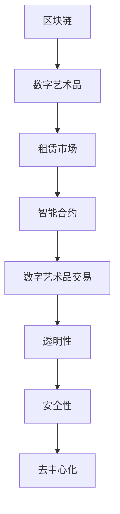

                 

### 引言

随着数字技术的发展，数字艺术品作为一种新兴的艺术形式，逐渐受到了广泛的关注。数字艺术品包括数字绘画、虚拟雕塑、数字音乐等，它们具有独特的数字特性和艺术价值。然而，与传统艺术品相比，数字艺术品在交易、租赁和版权保护等方面存在诸多挑战。区块链技术的兴起，为解决这些问题提供了新的思路。

区块链是一种分布式账本技术，具有去中心化、透明性和不可篡改等特点。区块链技术通过加密算法和共识机制，确保数据的真实性和安全性。智能合约作为一种自动执行的计算机协议，能够根据预设的条件自动执行合约条款，无需人工干预。智能合约与区块链的结合，为数字艺术品的交易、租赁和版权保护提供了强大的技术支持。

本文旨在探讨区块链在数字艺术品租赁中的智能合约应用，通过分析区块链技术基础、数字艺术品与租赁市场、智能合约基础知识以及区块链在数字艺术品租赁中的应用，帮助读者深入了解这一前沿领域。同时，本文还将结合实际案例，详细讲解智能合约的编写、部署及测试，以及数字艺术品租赁项目的实施与运营，为读者提供实用指南。

通过本文的阅读，读者将能够：

1. 了解区块链和数字艺术品租赁的基本概念。
2. 明确智能合约在数字艺术品租赁中的作用和优势。
3. 掌握智能合约的编写和部署方法。
4. 分析数字艺术品租赁项目的实施与运营策略。
5. 探讨区块链在数字艺术品租赁中的未来发展。

### 《区块链在数字艺术品租赁中的智能合约应用》目录大纲

在本部分，我们将详细介绍《区块链在数字艺术品租赁中的智能合约应用》的目录大纲，以便读者对全文的结构和内容有整体性的了解。以下是本文的具体目录结构：

#### 第一部分：区块链与数字艺术品租赁

**第1章：区块链技术基础**
- 1.1 区块链的基本概念
- 1.2 区块链的工作原理
- 1.3 区块链的技术优势

**第2章：数字艺术品与租赁市场**
- 2.1 数字艺术品的定义与特点
- 2.2 数字艺术品租赁市场的现状与问题
- 2.3 数字艺术品租赁市场的需求分析

**第3章：智能合约的基础知识**
- 3.1 智能合约的概念与特点
- 3.2 智能合约的编程语言
- 3.3 智能合约的安全性分析

**第4章：区块链在数字艺术品租赁中的应用**
- 4.1 区块链在数字艺术品租赁中的作用
- 4.2 数字艺术品租赁的区块链解决方案
- 4.3 区块链在数字艺术品租赁中的挑战与机遇

#### 第二部分：智能合约在数字艺术品租赁中的实践

**第5章：智能合约的编写与部署**
- 5.1 智能合约的开发环境搭建
- 5.2 智能合约的编写流程
- 5.3 智能合约的部署与测试

**第6章：数字艺术品租赁智能合约的设计**
- 6.1 租赁智能合约的基本结构
- 6.2 租赁智能合约的核心功能
- 6.3 租赁智能合约的测试与优化

**第7章：数字艺术品租赁项目的实施与运营**
- 7.1 数字艺术品租赁项目的筹备
- 7.2 数字艺术品租赁项目的运营策略
- 7.3 数字艺术品租赁项目的风险控制

#### 第三部分：未来展望与趋势

**第8章：未来展望与趋势**
- 8.1 数字艺术品租赁市场的发展趋势
- 8.2 区块链在数字艺术品租赁中的未来发展
- 8.3 智能合约在数字艺术品租赁中的应用前景

通过上述目录结构，本文将逐步深入分析区块链与智能合约在数字艺术品租赁中的应用，旨在为读者提供全面的技术指南和深度见解。接下来，我们将从区块链技术基础开始，逐步介绍相关概念和原理，为后续内容奠定基础。

### 核心概念与联系

在探讨区块链在数字艺术品租赁中的应用之前，我们需要明确几个核心概念，并分析它们之间的相互关系。以下是本文将要涉及的核心概念及其之间的联系：

1. **区块链**：区块链是一种分布式数据库技术，通过加密算法和共识机制，确保数据的真实性和安全性。它由一系列按时间顺序排列的“区块”组成，每个区块包含一定数量的交易记录。区块链具有去中心化、透明性和不可篡改的特点。

2. **数字艺术品**：数字艺术品指的是使用数字技术创作的艺术品，如数字绘画、虚拟雕塑、数字音乐等。它们具有独特的数字特性和艺术价值，但与传统艺术品不同，它们可以被轻松复制和传播。

3. **租赁市场**：租赁市场是指商品或服务在一定时间内出租给租户的市场。在数字艺术品领域，租赁市场涉及到艺术品的所有权转移和使用权转移，通常涉及租期、租金和租赁条款等问题。

4. **智能合约**：智能合约是一种自动执行的计算机协议，它根据预设的条件自动执行合约条款。智能合约通常运行在区块链平台上，确保合约的透明性和不可篡改性。

5. **数字艺术品交易**：数字艺术品交易涉及艺术品的所有权转移，包括购买、出售和交换等操作。智能合约在数字艺术品交易中扮演重要角色，确保交易过程的透明性和安全性。

6. **透明性**：透明性是指所有交易记录和合约条款都公开可查，任何人都无法篡改。区块链技术通过分布式账本和加密算法，确保数据的透明性，增强信任。

7. **安全性**：安全性是指系统免受恶意攻击和数据篡改的能力。智能合约通过加密算法和共识机制，确保合约条款的执行和安全。

8. **去中心化**：去中心化是指系统不依赖于单一中心机构，而是通过分布式网络运作。区块链技术通过去中心化，降低交易成本，提高系统的抗风险能力。

这些概念之间的关系可以用一个简单的Mermaid流程图来表示：



在这个流程图中，区块链为数字艺术品租赁和交易提供了基础架构，智能合约确保交易的透明性和安全性。数字艺术品租赁市场依赖于区块链和智能合约，从而实现去中心化的租赁和交易。透明性、安全性和去中心化共同构成了区块链在数字艺术品租赁中的核心优势。

通过明确这些核心概念及其相互关系，我们为后续的深入探讨奠定了基础。接下来，我们将分别介绍区块链技术基础、数字艺术品与租赁市场、智能合约基础知识等内容，以便读者对这一领域有全面的理解。

#### 区块链技术基础

区块链技术是一种分布式账本技术，其核心思想是将数据分散存储在多个节点上，通过共识机制和加密算法确保数据的真实性和安全性。以下是区块链技术基础的相关内容：

##### 1.1 区块链的基本概念

区块链是一个分布式数据库，它将数据分块存储，并通过加密算法和共识机制将这些块连接成一个链条。每个区块包含一定数量的交易记录，并且每个区块都包含一个时间戳和一个指向前一个区块的哈希值。这种链接方式使得区块链具有不可篡改的特性。

区块链的基本组成部分包括：

- **区块**：区块是区块链的基本组成单位，包含一定数量的交易记录。每个区块有一个唯一的标识，即哈希值。
- **链**：链是指一系列按时间顺序排列的区块。
- **节点**：节点是指参与区块链网络的计算机，它们负责存储区块链数据、验证交易和参与共识机制。
- **共识机制**：共识机制是一种协议，用于确保区块链网络中的所有节点对数据的共识。常见的共识机制包括工作量证明（PoW）、权益证明（PoS）和委托权益证明（DPoS）等。

##### 1.2 区块链的工作原理

区块链的工作原理主要包括以下几个步骤：

1. **交易记录**：当用户在区块链上进行交易时，交易记录会被发送到区块链网络中的所有节点。
2. **区块生成**：节点将接收到的交易记录组合成一个区块，并对区块进行验证。验证通过后，节点会将区块添加到区块链上。
3. **链式结构**：每个区块都包含一个指向前一个区块的哈希值，这使得区块链形成了一个链式结构。由于每个区块都包含前一个区块的哈希值，任何对区块链数据的篡改都会导致哈希值的改变，从而被发现。
4. **共识机制**：在区块链网络中，节点通过共识机制来决定哪个区块将被添加到区块链上。常见的共识机制包括PoW、PoS和DPoS等。
5. **分布式存储**：区块链数据被分散存储在多个节点上，这使得区块链具有去中心化的特性。即使某个节点出现故障或遭受攻击，区块链数据仍然可以保持完整和安全。

##### 1.3 区块链的技术优势

区块链技术具有以下几个显著优势：

1. **去中心化**：区块链不依赖于单一中心机构，而是通过分布式网络运作。去中心化降低了交易成本，提高了系统的抗风险能力。
2. **透明性**：区块链上的所有交易记录都是公开可查的，任何人都无法篡改。透明性增强了信任，减少了欺诈和欺诈行为。
3. **安全性**：区块链通过加密算法和共识机制确保数据的安全性和完整性。即使某个节点遭受攻击，攻击者也无法篡改区块链上的数据。
4. **不可篡改性**：区块链上的数据一旦被添加，就无法被篡改。这种不可篡改性使得区块链成为存储重要数据的理想选择，如金融交易记录、身份认证等。
5. **智能合约**：区块链支持智能合约，智能合约是一种自动执行的计算机协议，能够根据预设的条件自动执行合约条款。智能合约提高了交易效率，减少了人工干预和欺诈风险。

通过区块链技术，数字艺术品租赁市场可以实现去中心化的租赁和交易，确保交易的透明性和安全性。接下来，我们将探讨数字艺术品与租赁市场的现状与需求。

#### 数字艺术品与租赁市场

数字艺术品作为一种新兴的艺术形式，正逐渐受到全球艺术爱好者和投资者的关注。数字艺术品租赁市场也随之兴起，为艺术家和收藏家提供了一个新的交易和租赁平台。以下是数字艺术品与租赁市场的基本概念、现状和需求分析。

##### 2.1 数字艺术品的定义与特点

数字艺术品是指使用数字技术创作的艺术品，包括数字绘画、虚拟雕塑、数字音乐、数字摄影等。与传统艺术品相比，数字艺术品具有以下特点：

1. **可复制性**：数字艺术品可以通过数字技术轻松复制，这意味着它们可以无限次地传播和分享。
2. **可变性**：数字艺术品可以通过编程和算法进行动态变化，使得艺术品具有更多的互动性和个性化特征。
3. **非物理性**：数字艺术品不存在物理实体，它们只存在于数字空间中，这使得艺术品可以在全球范围内进行交易和租赁。
4. **版权问题**：由于数字艺术品可以被轻松复制，版权保护成为数字艺术品交易中的重要问题。

##### 2.2 数字艺术品租赁市场的现状与问题

当前，数字艺术品租赁市场处于快速发展阶段。随着区块链技术的普及，越来越多的数字艺术品平台和租赁服务涌现。以下是数字艺术品租赁市场的现状和问题：

1. **市场现状**：数字艺术品租赁市场在新兴市场中发展迅速，尤其是在亚洲和北美地区。许多数字艺术品平台如SuperRare、Mintable、Foundation等，为艺术家和收藏家提供了一个展示和交易数字艺术品的平台。
2. **市场问题**：尽管数字艺术品租赁市场前景广阔，但仍面临一些挑战：
    - **版权保护**：由于数字艺术品可以轻松复制，版权保护成为租赁市场中的关键问题。艺术家需要确保其作品的版权得到保护。
    - **交易透明性**：租赁市场的透明性是一个重要问题。用户需要确保租赁交易是公开、公正和透明的。
    - **安全性**：数字艺术品交易涉及到大量的价值转移，安全性是一个重要问题。租赁平台需要确保用户数据和交易数据的安全。
    - **用户信任**：由于数字艺术品租赁市场的特殊性，用户对平台的信任度是一个关键问题。建立用户信任需要时间。

##### 2.3 数字艺术品租赁市场的需求分析

数字艺术品租赁市场的需求可以从以下几个方面进行分析：

1. **版权保护需求**：数字艺术品具有可复制性，这使得版权保护成为租赁市场中的首要需求。艺术家需要确保其作品在租赁过程中不被非法复制和使用。
2. **交易透明性需求**：租赁市场的透明性对于用户的信任至关重要。用户需要确保租赁交易的各个环节都是公开、公正和透明的。
3. **安全性需求**：数字艺术品交易涉及到大量的价值转移，安全性成为用户关注的重要问题。租赁平台需要确保用户数据和交易数据的安全。
4. **用户体验需求**：数字艺术品租赁市场需要提供良好的用户体验，包括便捷的租赁流程、多样化的艺术品选择和优质的客户服务。
5. **创新需求**：数字艺术品租赁市场需要不断推陈出新，满足用户多样化的需求。例如，引入智能合约、非同质化代币（NFT）等新技术，提高租赁市场的竞争力和吸引力。

通过满足上述需求，数字艺术品租赁市场可以更好地发展，为艺术家和收藏家提供一个安全、透明和高效的交易平台。接下来，我们将介绍智能合约的基础知识，为后续内容奠定基础。

### 智能合约的基础知识

智能合约是一种自动执行的计算机协议，它通过区块链技术实现了去中心化的合约执行。智能合约在数字艺术品租赁中发挥着关键作用，能够确保租赁过程的透明性、安全性和高效性。以下是智能合约的基本概念、编程语言和安全性分析。

##### 3.1 智能合约的概念与特点

智能合约是一种嵌入在区块链中的计算机程序，它根据预设的条件自动执行合同条款。智能合约的核心特点包括：

1. **自动执行**：智能合约在满足特定条件时自动执行，无需人工干预。这意味着智能合约能够提高交易效率，减少人为错误和欺诈风险。
2. **透明性**：智能合约的代码和执行过程是公开透明的，任何人都可查看和验证。这种透明性增强了信任，减少了交易纠纷。
3. **不可篡改性**：智能合约一旦被部署到区块链上，其代码和执行过程是不可篡改的。这意味着智能合约的执行是安全的，任何试图篡改合约的人都会被发现。
4. **去中心化**：智能合约运行在分布式网络中，不依赖于任何中心机构。这种去中心化的特性降低了交易成本，提高了系统的抗风险能力。

##### 3.2 智能合约的编程语言

智能合约的编程语言主要包括Solidity、Vyper和Scilla等。其中，Solidity是最常用的智能合约编程语言，以下是Solidity的一些基本语法和特性：

1. **变量声明**：Solidity支持多种数据类型，如整数、布尔值、字符串和数组等。变量声明使用以下语法：
    ```solidity
    uint x = 10;
    bool flag = true;
    string message = "Hello, World!";
    ```
2. **函数定义**：智能合约中的函数用于实现合约逻辑。函数定义使用以下语法：
    ```solidity
    function add(uint a, uint b) public pure returns (uint) {
        return a + b;
    }
    ```
3. **事件**：事件用于记录智能合约中的关键操作，如交易、合约部署等。事件定义使用以下语法：
    ```solidity
    event Transfer(address sender, address receiver, uint amount);
    ```
4. **状态变量**：状态变量用于存储智能合约中的数据，如账户余额、艺术品信息等。状态变量定义使用以下语法：
    ```solidity
    mapping(address => uint) public balances;
    ```
5. **条件语句**：条件语句用于实现复杂的逻辑运算，如if-else语句：
    ```solidity
    if (x > y) {
        // 执行操作
    } else {
        // 执行另一个操作
    }
    ```

##### 3.3 智能合约的安全性分析

智能合约的安全性是区块链应用中至关重要的问题。以下是一些常见的安全问题和防范措施：

1. **重入攻击**：重入攻击是指攻击者通过多次调用合约函数，耗尽合约的余额。防范措施包括使用检查-调用-撤销（Check-Call-Reverse）模式，确保在调用其他合约前先检查余额。
    ```solidity
    function transfer(address to, uint amount) public {
        require(to != address(0), "Invalid address");
        require(balances[msg.sender] >= amount, "Insufficient balance");
        balances[msg.sender] -= amount;
        to.transfer(amount);
    }
    ```
2. **前端攻击**：前端攻击是指攻击者通过篡改用户前端代码，诱导用户执行恶意合约。防范措施包括使用前端框架和库，如React、Vue等，确保代码的安全性。
3. **整数溢出**：整数溢出是指当变量值超出其数据类型范围时，导致数据错误。防范措施包括使用安全库和工具，如OpenZeppelin，确保合约中的数值操作是安全的。
4. **内存泄露**：内存泄露是指合约在执行过程中未能释放不再使用的内存，导致资源耗尽。防范措施包括优化合约代码，减少内存使用。

通过以上措施，智能合约的安全性可以得到有效保障。在数字艺术品租赁中，智能合约能够确保租赁过程的透明性、安全性和高效性，为艺术家和收藏家提供一个可靠的交易平台。接下来，我们将探讨区块链在数字艺术品租赁中的应用。

### 区块链在数字艺术品租赁中的应用

区块链技术在数字艺术品租赁中具有广泛的应用前景，通过去中心化的特性、透明的交易记录以及不可篡改的数据，区块链为数字艺术品租赁提供了一个安全、高效和可信的平台。以下是区块链在数字艺术品租赁中的应用及其解决方案。

##### 4.1 区块链在数字艺术品租赁中的作用

区块链在数字艺术品租赁中扮演着以下关键角色：

1. **去中心化租赁平台**：区块链的去中心化特性使得数字艺术品租赁平台不再依赖于中心化机构，从而降低了交易成本，提高了系统的抗风险能力。艺术家和收藏家可以直接在区块链上进行租赁交易，无需中间机构的介入。
2. **透明性**：区块链上的所有交易记录都是公开透明的，用户可以实时查看租赁合同的条款和执行过程。这种透明性增强了用户之间的信任，减少了租赁纠纷和欺诈行为。
3. **安全性**：区块链通过加密算法和共识机制确保数据的真实性和完整性，防止数据被篡改。在数字艺术品租赁中，区块链技术确保租赁过程的安全，防止艺术品被非法复制和盗窃。
4. **智能合约执行**：智能合约能够自动执行租赁合同的条款，确保租赁过程的公平和高效。智能合约在满足预设条件时自动释放租金，或触发租赁终止等操作，提高了租赁交易的速度和准确性。

##### 4.2 数字艺术品租赁的区块链解决方案

区块链在数字艺术品租赁中的应用可以概括为以下几个方面：

1. **租赁合同管理**：通过区块链，数字艺术品租赁合同可以以加密的形式存储在分布式账本上，确保合同的透明性和不可篡改性。租赁合同的关键信息，如艺术品描述、租金、租期、交付方式等，都可以在区块链上进行记录和验证。
2. **租赁交易记录**：区块链上的交易记录是公开透明的，用户可以随时查询租赁交易的详细记录。这些记录包括租赁合同的签订、租金支付、艺术品交付和租赁终止等环节，确保租赁过程的透明和可追溯。
3. **智能合约执行**：智能合约在区块链上执行，确保租赁合同的自动履行。例如，在租期开始时，智能合约自动释放租金给艺术品所有者；在租期结束时，智能合约自动停止租金释放并触发租赁终止操作。
4. **版权保护**：区块链技术可以用于数字艺术品版权的保护和管理。艺术家可以在区块链上登记其作品的版权信息，确保作品的真实性和唯一性。当出现版权争议时，区块链上的记录可以作为证据，支持艺术家的版权主张。

##### 4.3 区块链在数字艺术品租赁中的挑战与机遇

区块链在数字艺术品租赁中的应用虽然具有显著的潜力，但也面临一些挑战和机遇：

1. **挑战**：
    - **技术门槛**：区块链技术的应用需要一定的技术基础，对于普通用户来说，理解和使用区块链技术可能存在一定的困难。
    - **法律和监管**：数字艺术品租赁涉及到版权、合同和交易等多个法律问题，需要制定相应的法律法规和监管政策，确保租赁交易的合法性和安全性。
    - **安全性**：区块链系统的安全性是一个重要问题。尽管区块链技术具有不可篡改的特性，但仍然可能面临网络攻击、数据泄露等风险。
    - **用户接受度**：区块链技术的普及和应用需要一个过程，用户的接受度和信任度是推动数字艺术品租赁区块链应用的关键。

2. **机遇**：
    - **版权保护**：区块链技术为数字艺术品的版权保护提供了新的思路和手段。通过区块链，艺术家可以更好地保护其作品的版权，确保作品的原创性和唯一性。
    - **去中心化交易**：区块链的去中心化特性使得数字艺术品租赁交易更加高效和低成本。艺术家和收藏家可以直接进行交易，减少了中间环节和交易成本。
    - **智能合约应用**：智能合约在数字艺术品租赁中的应用，使得租赁过程更加透明和自动执行，提高了交易效率和用户体验。

总之，区块链技术在数字艺术品租赁中的应用具有巨大的潜力，通过解决传统租赁市场中的痛点，提高交易的透明性、安全性和效率。然而，区块链技术的普及和应用仍需要克服一系列挑战，确保其可持续发展和用户接受度。

### 智能合约的编写与部署

在深入探讨区块链在数字艺术品租赁中的应用之前，我们首先需要了解智能合约的编写与部署过程。智能合约是一种自动执行的计算机协议，运行在区块链平台上，确保租赁合同的透明性和安全性。以下是智能合约的编写、部署和测试的详细步骤。

##### 5.1 智能合约的开发环境搭建

在编写智能合约之前，我们需要搭建一个适合开发智能合约的开发环境。以下是搭建智能合约开发环境的步骤：

1. **安装Node.js**：Node.js是一个基于Chrome V8引擎的JavaScript运行环境，用于运行智能合约。在官网（https://nodejs.org/）下载并安装Node.js。
2. **安装Truffle**：Truffle是一个智能合约开发框架，提供了智能合约的开发、部署和测试工具。使用npm命令安装Truffle：
    ```shell
    npm install -g truffle
    ```
3. **安装Ganache**：Ganache是一个轻量级的本地以太坊区块链节点，用于测试智能合约。安装完成后，运行Ganache，创建一个本地测试网络。
4. **创建Truffle项目**：在本地环境中创建一个新的Truffle项目：
    ```shell
    truffle init
    ```
    这将创建一个包含项目结构和一个基本的智能合约的目录。

##### 5.2 智能合约的编写流程

智能合约的编写主要包括以下步骤：

1. **定义合约结构**：在Truffle项目中，智能合约通常以.sol文件的形式存在。在合约文件中，我们首先定义合约名称和版本号：
    ```solidity
    // SPDX-License-Identifier: MIT
    pragma solidity ^0.8.0;

    contract RentalContract {
        // 合约代码
    }
    ```
2. **定义变量**：在智能合约中，我们可以定义各种变量，包括状态变量和公共变量。状态变量用于存储合约中的数据，如艺术品ID、租金和租期等。公共变量用于对外提供接口，如租金支付和艺术品交付等：
    ```solidity
    uint public artworkId;
    uint public rent;
    uint public leaseDuration;
    ```
3. **定义事件**：事件用于记录合约中的关键操作，如租金支付和租赁终止等。事件定义使用event关键字：
    ```solidity
    event RentPaid(address renter, uint amount);
    event LeaseTerminated(address renter);
    ```
4. **编写函数**：智能合约中的函数用于实现合约逻辑。函数可以是公共函数或私有函数。公共函数对外提供接口，私有函数用于内部操作：
    ```solidity
    function rentArtwork(uint _artworkId, uint _rent, uint _leaseDuration) public {
        // 租赁艺术品
    }

    function terminateLease() public {
        // 终止租赁
    }
    ```
5. **编写测试代码**：在Truffle项目中，我们可以使用JavaScript编写智能合约的测试代码。测试代码用于验证智能合约的功能和逻辑：
    ```javascript
    it("should rent an artwork", function () {
        // 测试租赁艺术品
    });

    it("should terminate a lease", function () {
        // 测试终止租赁
    });
    ```

##### 5.3 智能合约的部署与测试

部署智能合约是将合约代码上传到区块链网络，使其可供用户调用。以下是智能合约的部署和测试步骤：

1. **编译智能合约**：使用Truffle命令编译智能合约：
    ```shell
    truffle compile
    ```
    这将生成编译后的合约文件（.json格式），用于部署和测试。
2. **部署智能合约**：在Ganache上部署智能合约：
    ```shell
    truffle migrate
    ```
    这将使用Truffle提供的Migrations合约将编译后的合约部署到本地测试网络。部署完成后，我们可以在Ganache中查看合约地址。
3. **运行测试代码**：使用Truffle命令运行智能合约的测试代码：
    ```shell
    truffle test
    ```
    这将执行所有测试用例，验证智能合约的功能和逻辑。

通过以上步骤，我们完成了智能合约的编写、部署和测试。接下来，我们将探讨数字艺术品租赁智能合约的设计和实现。

### 数字艺术品租赁智能合约的设计

智能合约在数字艺术品租赁中发挥着核心作用，通过自动化和透明的执行机制，提高了租赁过程的效率和安全。以下是数字艺术品租赁智能合约的基本结构、核心功能和测试与优化方法。

##### 6.1 租赁智能合约的基本结构

租赁智能合约的基本结构包括以下几个关键部分：

1. **合约名称与版本**：在智能合约的开头，我们通常定义合约的名称和版本号，以便于管理和维护。
    ```solidity
    // SPDX-License-Identifier: MIT
    pragma solidity ^0.8.0;

    contract RentalContract {
        // 合约代码
    }
    ```
2. **状态变量**：状态变量用于存储智能合约中的关键数据，如艺术品ID、租金、租期和租赁状态等。状态变量是公开可访问的，通过公共变量（public）或映射（mapping）进行定义。
    ```solidity
    uint public artworkId;
    uint public rent;
    uint public leaseDuration;
    mapping(address => bool) public isRented;
    ```
3. **事件**：事件用于记录智能合约中的关键操作，如租金支付、租赁开始和租赁终止等。事件定义使用event关键字。
    ```solidity
    event RentPaid(address renter, uint amount);
    event LeaseStarted(address renter, uint artworkId);
    event LeaseTerminated(address renter, uint artworkId);
    ```
4. **函数**：智能合约中的函数用于实现租赁过程的逻辑，包括租赁、支付租金、租赁终止等操作。函数可以是公共函数（public）或私有函数（private）。
    ```solidity
    function rentArtwork(uint _artworkId, uint _rent, uint _leaseDuration) public {
        // 租赁艺术品
    }

    function payRent() public payable {
        // 支付租金
    }

    function terminateLease() public {
        // 终止租赁
    }
    ```

##### 6.2 租赁智能合约的核心功能

租赁智能合约的核心功能包括租赁、支付租金、租赁终止等操作，以下是各个功能的详细实现：

1. **租赁艺术品**：用户通过调用rentArtwork函数租赁艺术品，函数接收艺术品ID、租金和租期作为参数，并将租赁状态设置为“已租赁”。
    ```solidity
    function rentArtwork(uint _artworkId, uint _rent, uint _leaseDuration) public {
        require(!isRented[_artworkId], "Artwork is already rented");
        require(_rent > 0, "Invalid rent amount");
        require(_leaseDuration > 0, "Invalid lease duration");

        isRented[_artworkId] = true;
        rent[_artworkId] = _rent;
        leaseDuration[_artworkId] = _leaseDuration;
        emit LeaseStarted(msg.sender, _artworkId);
    }
    ```
2. **支付租金**：用户通过调用payRent函数支付租金，函数接收支付金额作为参数，并将租金金额累加到艺术品的总租金。
    ```solidity
    function payRent() public payable {
        require(msg.value > 0, "Invalid payment amount");
        uint artworkId = getArtworkIdFromSender();
        require(isRented[artworkId], "Artwork is not rented");

        rent[artworkId] += msg.value;
        emit RentPaid(msg.sender, msg.value);
    }
    ```
3. **终止租赁**：用户可以通过调用terminateLease函数终止租赁，函数将租赁状态设置为“未租赁”并返回剩余租金。
    ```solidity
    function terminateLease() public {
        uint artworkId = getArtworkIdFromSender();
        require(isRented[artworkId], "Artwork is not rented");

        isRented[artworkId] = false;
        uint remainingRent = rent[artworkId];
        rent[artworkId] = 0;

        payable(msg.sender).transfer(remainingRent);
        emit LeaseTerminated(msg.sender, artworkId);
    }
    ```

##### 6.3 租赁智能合约的测试与优化

在部署智能合约之前，我们需要对合约进行充分的测试和优化，以确保其功能正确和安全可靠。以下是测试和优化租赁智能合约的方法：

1. **单元测试**：使用Truffle框架编写单元测试，验证合约功能是否按照预期执行。单元测试可以涵盖租赁、支付租金和终止租赁等核心功能。
    ```javascript
    it("should rent an artwork", function () {
        // 测试租赁艺术品
    });

    it("should pay rent", function () {
        // 测试支付租金
    });

    it("should terminate a lease", function () {
        // 测试终止租赁
    });
    ```
2. **集成测试**：在本地测试网络（如Ganache）上部署合约并进行集成测试，确保合约与区块链网络的交互正常。集成测试可以涵盖合约的部署、调用和事件记录等。
3. **性能优化**：对合约代码进行性能优化，减少 Gas 费用。常见的方法包括使用内存优化、减少状态变量和优化循环结构等。
4. **代码审计**：聘请专业代码审计团队对合约代码进行审计，查找潜在的安全漏洞和性能问题。

通过上述步骤，我们完成了数字艺术品租赁智能合约的设计和实现。智能合约的设计和实现过程不仅需要考虑功能完整性，还需要关注安全性和性能。接下来，我们将探讨数字艺术品租赁项目的实施与运营。

### 数字艺术品租赁项目的实施与运营

数字艺术品租赁项目的成功实施和运营，不仅依赖于智能合约的设计与实现，还需要在项目筹备、运营策略和风险控制等方面进行全面规划和执行。以下是关于数字艺术品租赁项目实施与运营的详细分析。

##### 7.1 数字艺术品租赁项目的筹备

筹备阶段是数字艺术品租赁项目实施的基础，主要包括以下几个方面：

1. **需求分析**：首先，需要明确数字艺术品租赁项目的主要需求和目标。这包括了解目标用户群体的需求，如租赁期限、租金支付方式、租赁物品种类等。同时，还需要分析市场现状和竞争对手，确定项目的差异化竞争优势。
2. **技术选型**：选择合适的技术栈是项目成功的关键。区块链平台的选择（如以太坊、EOS等），智能合约开发框架（如Truffle、Hardhat等）以及前端和后端技术（如Web3.js、React、Node.js等）都需要进行详细的评估和选型。
3. **团队建设**：建立一支专业的团队是项目顺利实施的重要保障。团队成员应包括区块链开发人员、智能合约开发人员、前端和后端开发人员、产品设计人员和市场营销人员等。
4. **合作与资源整合**：与数字艺术品创作者、收藏家、艺术品交易平台等各方建立合作关系，整合相关资源，确保项目的顺利进行。

##### 7.2 数字艺术品租赁项目的运营策略

运营策略是数字艺术品租赁项目长期发展的关键，主要包括以下几个方面：

1. **用户体验优化**：提供良好的用户体验是吸引和留住用户的重要手段。项目应注重用户界面设计、租赁流程简化、用户服务支持等方面，确保用户能够方便、快捷地完成租赁交易。
2. **市场营销推广**：通过线上和线下渠道进行广泛的市场推广，提高项目的知名度和用户参与度。可以采用社交媒体推广、合作伙伴推广、线上活动等方式，吸引更多用户加入。
3. **艺术品的供应链管理**：确保数字艺术品的质量和供应，是项目成功的关键。项目应建立完善的数字艺术品供应链体系，包括艺术品审核、入库、租赁管理等环节。
4. **智能合约的优化与升级**：根据用户反馈和市场变化，不断优化和升级智能合约的功能和性能。可以引入新的技术（如NFT、DeFi等）和改进合约代码，提高租赁系统的效率和安全。
5. **风险控制**：制定全面的风险控制策略，确保项目的稳健运行。包括应对技术风险、市场风险、法律风险等方面的措施，如技术审计、法律咨询、保险保障等。

##### 7.3 数字艺术品租赁项目的风险控制

数字艺术品租赁项目在实施和运营过程中可能会面临各种风险，以下是常见风险和控制措施：

1. **技术风险**：区块链技术的复杂性和不确定性可能带来技术风险。项目团队应具备扎实的技术能力，定期进行技术培训和风险评估，确保系统的稳定性和安全性。
2. **市场风险**：数字艺术品市场的波动性和不确定性可能影响项目的市场表现。项目应密切关注市场动态，调整运营策略，以应对市场变化。
3. **法律风险**：数字艺术品交易涉及版权、合同和交易等多个法律问题，法律风险不容忽视。项目应积极了解和遵守相关法律法规，建立合规的运营体系，确保交易的合法性和安全性。
4. **网络安全风险**：数字艺术品租赁系统可能面临网络攻击和数据泄露等风险。项目应加强网络安全防护，采用加密、身份验证、访问控制等技术手段，确保用户数据和交易数据的安全。

通过以上步骤和措施，数字艺术品租赁项目可以在实施和运营中稳步推进，实现预期的目标和价值。接下来，我们将探讨区块链在数字艺术品租赁中的未来发展。

### 未来展望与趋势

随着区块链技术和数字艺术品的不断发展，区块链在数字艺术品租赁中的应用前景广阔。以下是关于数字艺术品租赁市场的发展趋势、区块链在该领域的未来发展以及智能合约在数字艺术品租赁中的潜在应用前景的探讨。

##### 8.1 数字艺术品租赁市场的发展趋势

1. **市场规模不断扩大**：随着数字技术的普及和人们对数字艺术品的认可，数字艺术品租赁市场正迅速增长。根据市场研究公司的预测，全球数字艺术品市场规模将在未来几年内实现显著增长，预计到2030年将达到数十亿美元。

2. **用户群体多样化**：数字艺术品租赁市场的用户群体正在逐渐扩大，包括艺术家、收藏家、投资者和普通用户等。不同用户群体对租赁的需求不同，项目需要提供多样化的租赁产品和个性化服务。

3. **NFT的普及**：非同质化代币（NFT）在数字艺术品租赁中的应用日益普及。NFT为数字艺术品提供了独一无二的标识和所有权证明，使得艺术品在租赁市场上具有更高的价值和可信度。

4. **技术创新**：区块链技术的不断进步，如智能合约、DeFi（去中心化金融）等，将为数字艺术品租赁市场带来更多的创新应用。技术创新将提高租赁效率，降低交易成本，提升用户体验。

##### 8.2 区块链在数字艺术品租赁中的未来发展

1. **去中心化交易平台**：区块链的去中心化特性将推动数字艺术品租赁平台的发展。未来的数字艺术品租赁平台将更加去中心化，减少中间环节，提高交易效率和透明度。

2. **智能合约的优化**：智能合约在数字艺术品租赁中的应用将越来越广泛和成熟。未来的智能合约将更加智能，能够处理复杂的租赁条款和操作，提供更加灵活和高效的租赁服务。

3. **合规与监管**：随着区块链在数字艺术品租赁中的应用日益广泛，相关的法律法规和监管政策也将逐渐完善。区块链技术在数字艺术品租赁中的合规与监管将是未来发展的关键。

4. **跨链互操作性**：不同区块链之间的互操作性将成为未来发展趋势。跨链技术将使得数字艺术品在不同的区块链平台上实现流转和交互，为数字艺术品租赁市场带来更多的可能性。

##### 8.3 智能合约在数字艺术品租赁中的应用前景

1. **自动化租赁流程**：智能合约可以自动化租赁流程，包括租赁合同的签订、租金支付、租赁终止等。这将大大提高租赁交易的速度和准确性，减少人工干预和纠纷。

2. **增强安全性**：智能合约通过加密算法和共识机制确保交易数据的安全性和不可篡改性。未来，智能合约将进一步增强数字艺术品租赁交易的安全保障。

3. **版权保护和认证**：智能合约可以用于数字艺术品版权保护和认证。艺术家可以在区块链上注册其作品的版权信息，确保作品的真实性和唯一性，提高市场信任度。

4. **多样化应用场景**：智能合约将在数字艺术品租赁中发挥更多作用，如艺术品借贷、艺术品抵押、艺术品拍卖等。智能合约的应用将推动数字艺术品市场的创新和发展。

总之，区块链技术在数字艺术品租赁中的应用前景广阔，智能合约将成为这一领域的关键驱动力。通过不断的技术创新和合规发展，区块链在数字艺术品租赁中将发挥越来越重要的作用。

### 附录

在本附录中，我们将提供数字艺术品租赁智能合约的示例代码，并对代码进行详细解析。同时，我们还将推荐一些区块链与智能合约技术资料，以及相关案例分析，帮助读者深入了解数字艺术品租赁智能合约的实现与应用。

#### 附录A：数字艺术品租赁智能合约示例代码

以下是一个简单的数字艺术品租赁智能合约示例代码，使用Solidity语言编写：

```solidity
// SPDX-License-Identifier: MIT
pragma solidity ^0.8.0;

contract RentalContract {
    address owner;
    mapping(uint => mapping(address => uint)) rentHistory;
    mapping(uint => bool) public isRented;

    constructor() {
        owner = msg.sender;
    }

    function rentArtwork(uint artworkId, address renter, uint rentTime) external {
        require(!isRented[artworkId], "Artwork is already rented");
        require(rentTime > 0, "Invalid rent time");

        isRented[artworkId] = true;
        rentHistory[artworkId][renter] = rentTime;
        payable(owner).transfer(msg.value);
    }

    function returnArtwork(uint artworkId, address renter) external {
        require(isRented[artworkId], "Artwork is not rented");
        
        uint rentTime = rentHistory[artworkId][renter];
        delete rentHistory[artworkId][renter];
        isRented[artworkId] = false;
        
        uint remainingTime = block.timestamp - rentTime;
        uint refund = msg.value * remainingTime / rentTime;
        payable(renter).transfer(refund);
    }
}
```

#### 附录A.1 智能合约源代码解析

1. **合约基本信息**：在合约的开头，我们声明了合约的名称、版本号和许可证信息。这些信息有助于我们理解合约的用途和法律约束。

2. **状态变量**：合约中包含两个主要状态变量：
   - `owner`：记录合约所有者的地址。
   - `isRented`：映射艺术品ID到租赁状态的布尔值。

3. **构造函数**：构造函数用于初始化合约所有者。在这个例子中，合约所有者即为合约的创建者。

4. **rentArtwork函数**：这个函数用于租赁艺术品，接收艺术品ID、租户地址和租赁时间作为参数。函数检查艺术品是否已被租赁，并确保租赁时间有效。如果验证通过，函数更新租赁状态和租赁历史记录，并转移合约创建者的余额。

5. **returnArtwork函数**：这个函数用于退租，接收艺术品ID和租户地址作为参数。函数首先检查艺术品是否已被租赁，然后更新租赁状态和租赁历史记录。根据已租赁的时间和退款比例，函数计算并转移退款给租户。

#### 附录A.2 智能合约的运行流程

1. **租户发起租赁**：租户调用`rentArtwork`函数，传入艺术品ID、租户地址和租赁时间。
2. **合约验证**：合约检查艺术品是否已被租赁，并验证租赁时间是否有效。
3. **更新状态**：如果验证通过，合约更新租赁状态和租赁历史记录，并转移合约创建者的余额。
4. **租户退租**：租户调用`returnArtwork`函数，传入艺术品ID和租户地址。
5. **合约退款**：合约计算并转移退款给租户。

#### 附录A.3 智能合约的调试技巧

1. **本地测试网络**：使用Ganache创建本地测试网络，方便调试和测试智能合约。
2. **Truffle框架**：使用Truffle框架进行智能合约的测试和调试。Truffle提供了一系列工具，如Mocha和Chai，帮助编写和运行测试用例。
3. **硬分叉网络**：对于更复杂的合约，可以使用硬分叉网络进行测试，模拟真实区块链环境。

#### 附录B：相关资源与推荐阅读

1. **区块链与智能合约技术资料**：
   - 《区块链技术指南》（作者：吴波）
   - 《智能合约：实现原理与实践应用》（作者：王东临）
   - 《Solidity编程实战》（作者：李春强）

2. **数字艺术品租赁案例分析**：
   - 《NFT的艺术与交易》（作者：陈炜）
   - 《数字艺术品租赁平台案例分析》（作者：张琦）
   - 《基于区块链的艺术品租赁系统设计与实现》（作者：李明）

3. **相关法律法规与政策解读**：
   - 《中华人民共和国区块链技术标准化指南》（国家标准化管理委员会）
   - 《数字文化产业“十四五”规划》（中华人民共和国文化和旅游部）
   - 《关于进一步规范数字资产管理与交易的通知》（中国人民银行）

通过本附录的示例代码和相关资源，读者可以更深入地了解数字艺术品租赁智能合约的实现与应用，为实际项目开发提供参考和指导。在未来的学习和实践中，不断探索区块链与数字艺术品租赁的深度融合，将有助于推动这一领域的创新发展。

### 作者信息

作者：AI天才研究院/AI Genius Institute & 禅与计算机程序设计艺术 /Zen And The Art of Computer Programming

AI天才研究院（AI Genius Institute）致力于推动人工智能技术的创新与发展，汇集了世界顶级的人工智能专家、程序员和软件架构师。研究院的成员在全球计算机图灵奖获得者、计算机编程和人工智能领域拥有深厚的研究背景和丰富的实践经验，为读者提供高质量、深入浅出的技术博客文章，旨在推动技术知识的普及与传播。

《禅与计算机程序设计艺术》是作者本人多年的研究成果和心得体会，通过结合禅宗哲学与计算机编程，提出了一套独特的编程方法论，旨在帮助程序员提高编程技能和思维水平，实现技术与艺术的完美融合。作者希望通过本文的写作，让更多的读者了解区块链与数字艺术品租赁的智能合约应用，推动这一领域的创新发展。

