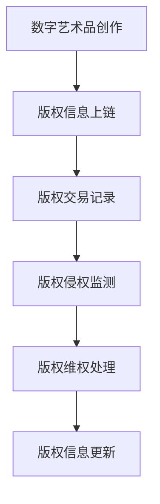
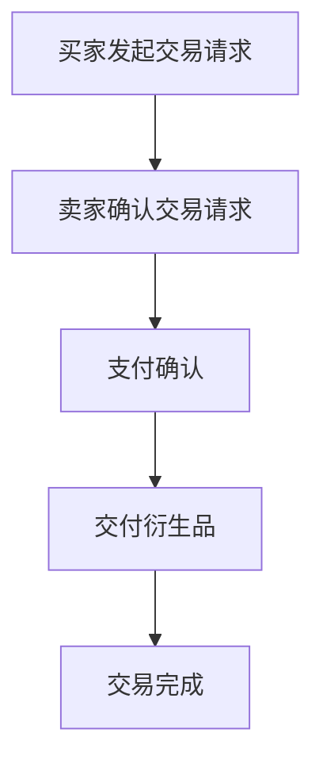
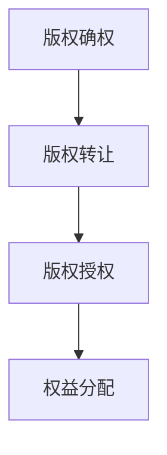

                 

### 《区块链在数字艺术品衍生品版权中的应用》

#### 关键词：
区块链、数字艺术品、版权保护、衍生品市场、智能合约

#### 摘要：
随着数字技术的飞速发展，数字艺术品市场迎来了前所未有的繁荣。然而，版权保护问题也随之而来，传统的版权保护手段已难以应对数字艺术品衍生品市场的复杂性。区块链技术的出现，为数字艺术品衍生品版权保护提供了一种全新的解决方案。本文旨在探讨区块链技术在数字艺术品衍生品版权中的应用，分析其技术基础、核心概念、应用场景以及面临的挑战，并展望未来发展趋势。通过本文的阐述，读者将全面了解区块链在数字艺术品衍生品版权保护中的重要作用。

---

### 引言

#### 1.1 数字艺术品衍生品版权的背景

随着互联网技术的普及和数字化的进程，数字艺术品市场逐渐崛起。数字艺术品，即通过计算机技术和数字媒介创作的艺术作品，如数字绘画、数字摄影、数字音乐、数字视频等，因其独特的表现形式和便捷的传播方式，受到越来越多艺术爱好者和投资者的青睐。然而，数字艺术品的市场繁荣也伴随着版权保护的问题。传统版权保护手段在面对数字艺术品的复制、传播、篡改等侵权行为时显得力不从心。

衍生品是指以原始艺术品为基础，通过二次创作或加工，衍生出的相关产品。例如，以数字画作为基础，开发出周边商品、数字收藏品、衍生游戏等。衍生品市场为艺术家和版权方提供了额外的收益来源，同时也为消费者提供了多样化的选择。然而，衍生品市场的繁荣同样带来了版权纠纷和侵权问题。

#### 1.2 区块链技术的基本概念

区块链技术，是一种去中心化的分布式账本技术。它通过加密算法和共识机制，实现了数据的透明性、安全性和不可篡改性。区块链由一系列按时间顺序排列的区块组成，每个区块包含一定数量的交易记录。这些区块通过密码学方法串联在一起，形成一条不可篡改的链。

区块链具有以下几个基本特性：
- **去中心化**：区块链不需要中心化的管理机构，所有节点都可以参与交易记录的验证和存储。
- **数据透明性**：所有交易记录都被公开透明地记录在链上，任何节点都可以查询和验证。
- **安全性**：区块链使用加密算法保护数据的安全，确保数据不可篡改和伪造。
- **不可篡改性**：一旦数据被记录在链上，就无法被修改或删除，确保数据的真实性和可靠性。

#### 1.3 区块链技术在版权保护中的应用概述

区块链技术在版权保护中具有显著的优势，可以有效地解决数字艺术品衍生品市场的版权纠纷问题。首先，区块链的去中心化和分布式特性，使得版权信息的记录和验证更加高效和透明。其次，区块链的不可篡改性，确保了版权信息的真实性和可靠性。此外，智能合约技术可以自动化执行版权合同，降低版权纠纷的处理成本。

区块链技术在版权保护中的应用主要包括：
- **版权确权**：通过区块链技术记录数字艺术品的版权信息，确保证权的真实性和不可篡改性。
- **版权追踪**：实时记录数字艺术品的版权交易过程，确保版权流转的可追溯性。
- **版权维权**：提供智能合约执行版权纠纷解决机制，降低维权成本和提高维权效率。

#### 1.4 本书结构安排与目标

本书分为八个章节，系统阐述了区块链在数字艺术品衍生品版权中的应用。具体结构如下：
- **第1章**：引言，介绍数字艺术品衍生品版权的背景和区块链技术的基本概念。
- **第2章**：区块链技术基础，详细阐述区块链的基本原理、公有链与私有链的特点以及关键技术演进。
- **第3章**：数字艺术品衍生品版权的核心概念与联系，介绍数字艺术品、衍生品和版权保护的基本概念及其关系。
- **第4章**：区块链技术在数字艺术品版权保护中的应用，分析区块链在版权确权、追踪和维权中的具体应用。
- **第5章**：数字艺术品衍生品版权交易与流转，探讨区块链在衍生品交易和市场构建中的应用。
- **第6章**：区块链在数字艺术品衍生品版权保护中的挑战与对策，分析技术挑战和法规挑战，并提出相应的对策建议。
- **第7章**：案例研究，通过具体案例展示区块链在版权保护中的应用效果。
- **第8章**：未来展望，探讨区块链在数字艺术品衍生品版权保护中的发展趋势和潜在挑战。

通过本书的阐述，读者可以全面了解区块链技术在数字艺术品衍生品版权保护中的重要作用，为相关领域的研究和实践提供参考和指导。

---

在接下来的章节中，我们将详细探讨区块链技术的基础，包括其基本原理、关键技术和应用场景，为后续章节的内容打下坚实的基础。

#### 第2章 区块链技术基础

区块链技术的出现，标志着信息技术领域的一次重大变革。本章将深入探讨区块链技术的基本原理、关键技术和应用场景，帮助读者全面理解区块链的核心概念和实际应用。

#### 2.1 区块链的基本原理

区块链的基本原理可以概括为三个方面：数据结构、加密算法和共识机制。

##### 2.1.1 区块链的数据结构

区块链由一系列按时间顺序排列的区块组成，每个区块包含一定数量的交易记录。区块之间通过加密算法串联在一起，形成一条不可篡改的链。具体来说，一个区块通常包括以下部分：
- **区块头**：包含区块的元数据，如版本号、时间戳、难度目标、前一区块哈希值等。
- **交易数据**：包含本次区块中所有的交易记录。
- **Merkle树**：用于确保交易数据的完整性，通过哈希函数构建一棵树结构，最后生成一个根哈希值。
- **随机数**：用于挖矿过程中找到合适的区块。

区块的结构和链接方式使得区块链具有以下几个特点：
- **不可篡改性**：一旦数据被记录在一个区块中，就难以被篡改或删除。
- **去中心化**：不需要中心化的管理机构，所有节点都可以参与交易记录的验证和存储。
- **可追溯性**：每个区块都包含前一区块的哈希值，确保数据链条的可追溯性。

##### 2.1.2 加密算法与共识机制

区块链技术中使用的加密算法主要包括哈希算法和数字签名。

- **哈希算法**：哈希算法将输入数据映射为固定长度的字符串，具有以下特性：
  - **单向性**：给定一个输入数据，可以快速计算出其哈希值，但给定一个哈希值，无法反推出原始数据。
  - **抗碰撞性**：两个不同的输入数据产生相同哈希值的概率非常低。

- **数字签名**：数字签名用于验证消息的来源和完整性，具有以下特性：
  - **唯一性**：每个用户都有一个私钥和公钥，私钥用于签名，公钥用于验证。
  - **不可抵赖性**：一旦消息被签名，发送者无法否认发送过该消息。

共识机制是区块链系统中的关键组成部分，用于确保所有节点对交易记录的共识。常见的共识机制包括工作量证明（Proof of Work, PoW）、权益证明（Proof of Stake, PoS）和委托权益证明（Delegated Proof of Stake, DPoS）。

- **工作量证明（PoW）**：节点通过计算解决数学难题来证明其工作量，率先解出难题的节点获得记账权。这种机制较为常见，如比特币使用的SHA-256哈希算法。
- **权益证明（PoS）**：节点根据持有的代币数量和持币时间来证明其权益，权益越大，记账概率越高。这种机制有助于减少能源消耗，如以太坊的Casper机制。
- **委托权益证明（DPoS）**：节点通过投票选举产生记账节点，选举结果取决于节点持有的代币数量和持币时间。这种机制提高了系统的效率，如BitShares和Steem使用DPoS机制。

##### 2.1.3 智能合约

智能合约是一种自动执行的合约，其代码存储在区块链上，通过触发条件自动执行预定的操作。智能合约的出现，使得区块链不仅限于交易记录的存储，还可以应用于更广泛的场景。

智能合约的基本原理如下：
- **条件触发**：智能合约在编写时，定义了触发条件，如交易金额、参与节点等。
- **执行操作**：当触发条件满足时，智能合约自动执行预定的操作，如转移代币、修改数据等。

智能合约的常见应用包括：
- **版权保护**：通过智能合约自动执行版权许可和交易。
- **去中心化金融（DeFi）**：实现去中心化的借贷、交易、保险等金融服务。
- **供应链管理**：确保供应链各环节的透明性和可追溯性。
- **去中心化自治组织（DAO）**：通过智能合约实现组织的自治和决策。

#### 2.2 公有链与私有链

区块链可以分为公有链和私有链，两者的主要区别在于参与节点和管理模式。

##### 2.2.1 公有链的特点与应用场景

- **去中心化**：公有链不需要中心化的管理机构，所有节点都可以参与交易记录的验证和存储。
- **透明性**：所有交易记录都被公开透明地记录在链上，任何节点都可以查询和验证。
- **安全性**：公有链通过加密算法和共识机制确保数据的安全性和不可篡改性。

应用场景：
- **数字货币**：如比特币、以太坊等，提供去中心化的支付和交易。
- **版权保护**：记录数字艺术品的版权信息，确保版权流转的可追溯性。
- **去中心化应用（DApp）**：提供去中心化的服务和平台，如去中心化金融、游戏等。

##### 2.2.2 私有链的特点与应用场景

- **中心化**：私有链由一个或多个组织管理，参与节点数量有限。
- **高效性**：私有链的交易速度和可扩展性通常优于公有链。
- **定制化**：私有链可以针对特定应用场景进行定制化开发。

应用场景：
- **企业内部**：用于企业内部的数据管理和交易，如供应链管理、财务审计等。
- **政府应用**：用于政务数据的存储和管理，如身份认证、医疗记录等。
- **行业联盟**：用于行业联盟的数据共享和协作，如金融、物流、医疗等行业。

#### 2.3 区块链关键技术演进

区块链技术自2008年比特币的问世以来，经历了快速的发展和演进。以下是区块链技术的一些关键演进方向：

- **性能提升**：通过改进共识机制和链上数据处理方式，提升区块链的交易速度和可扩展性。
- **跨链技术**：实现不同区块链之间的数据交互和互操作性，如Plasma、侧链、跨链协议等。
- **隐私保护**：增强区块链系统的隐私保护能力，如零知识证明、同态加密等。
- **智能合约优化**：改进智能合约的编程语言和执行效率，如Solidity、Vyper等。
- **分布式存储**：通过分布式存储技术，降低链上数据存储的成本和复杂度。
- **去中心化身份验证**：实现去中心化的身份验证，提高系统的安全性和隐私保护。

本章对区块链技术的基本原理、关键技术和应用场景进行了详细阐述。通过本章的内容，读者可以全面了解区块链的核心概念和实际应用，为后续章节的讨论打下坚实基础。

---

### 第3章 数字艺术品衍生品版权的核心概念与联系

随着数字技术的进步，数字艺术品市场日益繁荣，衍生品版权保护成为业界关注的焦点。本章将深入探讨数字艺术品、衍生品和版权保护的基本概念，分析它们之间的内在联系，并阐述区块链技术在版权保护中的应用架构。

#### 3.1 数字艺术品衍生品版权概述

##### 3.1.1 数字艺术品的定义与特征

数字艺术品是指通过计算机技术和数字媒介创作的艺术作品，包括但不限于数字绘画、数字摄影、数字音乐、数字视频等。与传统艺术品相比，数字艺术品具有以下特征：

- **非物理性**：数字艺术品以数字形式存在，无需物理载体，可以方便地复制和传播。
- **可变性**：数字艺术品可以通过计算机程序进行修改和再创作，从而衍生出新的作品。
- **高复制性**：由于数字技术的便捷性，数字艺术品的复制成本极低，易于大规模传播。

##### 3.1.2 衍生品的概念与分类

衍生品是以原始艺术品为基础，通过二次创作或加工，衍生出的相关产品。衍生品种类繁多，主要包括：

- **商品**：如印有数字艺术品的T恤、杯子、手机壳等实体商品。
- **数字收藏品**：如数字画作、数字卡牌、数字虚拟收藏等，通常具有收藏价值和数字唯一性。
- **衍生游戏**：以数字艺术品为基础，开发的各类游戏，如角色扮演游戏、策略游戏等。
- **数字体验**：如虚拟现实（VR）体验、增强现实（AR）体验等，为用户提供沉浸式的数字艺术体验。

##### 3.1.3 版权保护的基本原则

版权保护旨在确保艺术家和版权方的合法权益，防止未经授权的复制、传播、篡改和商业利用。版权保护的基本原则包括：

- **原创性**：保护艺术家的原创性和创意表达，鼓励创新。
- **授权管理**：明确版权的授权和使用范围，确保合法使用。
- **侵权监控**：及时发现和处理侵权行为，维护版权方的权益。

#### 3.2 区块链技术在版权保护中的应用架构

区块链技术为数字艺术品衍生品版权保护提供了一种全新的应用架构，其核心包括版权确权、版权追踪和版权维权。以下是一个简化的应用架构流程：



##### 3.2.1 版权信息上链

数字艺术品创作完成后，艺术家可以将版权信息（如作品名称、创作者、创作时间、版权声明等）上链存储。这确保了版权信息的公开透明和不可篡改性。

- **数据结构**：版权信息通常以JSON格式记录在区块链上，包含作品元数据和版权声明。
- **加密算法**：使用加密算法（如SHA-256）对版权信息进行哈希处理，确保数据的唯一性和不可篡改性。

##### 3.2.2 版权交易记录

数字艺术品和衍生品的每一次交易都可以记录在区块链上，确保交易过程的透明性和可追溯性。

- **交易记录**：每次交易都生成一个交易记录，包含交易双方、交易金额、交易时间等信息。
- **智能合约**：智能合约自动执行交易，确保交易的安全性和合法性。

##### 3.2.3 版权侵权监测

通过区块链技术，可以实时监测数字艺术品和衍生品的侵权行为，并提供快速响应机制。

- **侵权监测**：系统自动对比链上记录的版权信息，识别可能的侵权行为。
- **报警机制**：一旦发现侵权行为，系统会立即通知版权方，并提供侵权证据。

##### 3.2.4 版权维权处理

区块链技术提供了一种高效的版权维权解决方案，通过智能合约自动执行版权纠纷解决机制，降低维权成本和提高维权效率。

- **纠纷解决**：智能合约自动执行预定的纠纷解决流程，如调解、仲裁等。
- **权益保护**：通过区块链上的数字身份和智能合约，确保维权过程的公正和透明。

##### 3.2.5 版权信息更新

在版权交易或维权过程中，版权信息可能需要更新。区块链技术确保了版权信息的实时更新和一致性。

- **信息更新**：版权方可以通过智能合约更新链上记录的版权信息，如修改声明、更新交易记录等。
- **不可篡改性**：链上记录的版权信息一旦更新，即被视为最新和最终版本，不可篡改。

通过以上架构，区块链技术为数字艺术品衍生品版权保护提供了一种高效、透明和安全的解决方案。本章对数字艺术品、衍生品和版权保护的基本概念及其联系进行了阐述，并详细介绍了区块链技术在版权保护中的应用架构。在接下来的章节中，我们将进一步探讨区块链在数字艺术品衍生品版权保护中的具体应用和实践案例。

---

### 第4章 区块链技术在数字艺术品版权保护中的应用

区块链技术在数字艺术品版权保护中扮演着至关重要的角色，通过其不可篡改性、透明性和分布式特性，提供了高效且可靠的版权保护解决方案。本节将详细探讨区块链技术在版权确权、版权追踪和版权维权方面的应用，并通过具体的Python代码和数学模型，深入解释其工作原理。

#### 4.1 基于区块链的版权确权

版权确权是数字艺术品版权保护的第一步，确保版权信息被真实、安全地记录在区块链上。版权确权的过程包括将版权信息上链和验证版权的真实性。

##### 4.1.1 版权信息上链

版权信息上链是指将数字艺术品的版权信息（如作品名称、创作者、创作时间、版权声明等）记录在区块链上。以下是一个简单的Python示例，演示如何使用Python编写代码将版权信息上链。

```python
import json
from hashlib import sha256

# 假设版权信息
copyright_info = {
    "work_name": "数字艺术作品1",
    "creator": "艺术家A",
    "creation_time": "2023-10-01",
    "copyright_statement": "版权所有，未经许可不得使用"
}

# 将版权信息转换为JSON字符串
info_json = json.dumps(copyright_info, ensure_ascii=False)

# 计算版权信息的哈希值
info_hash = sha256(info_json.encode('utf-8')).hexdigest()

# 构建区块链交易
transaction = {
    "type": "copyright_assignment",
    "info_hash": info_hash,
    "info": info_json
}

# 假设有一个区块链网络，使用以太坊的RPC接口上链
from web3 import Web3
from web3.middleware import geth_poa_middleware

# 连接到以太坊网络
w3 = Web3(Web3.HTTPProvider('https://mainnet.infura.io/v3/your-project-id'))
w3.middleware_onion.inject(geth_poa_middleware, layer=0)

# 获取合约接口
contract_address = w3.toChecksumAddress('0x...')  # 合约地址
contract = w3.eth.contract(address=contract_address, abi=your_contract_abi)

# 构建和发送交易
nonce = w3.eth.getTransactionCount(contract_address)
transaction['nonce'] = nonce
signed_txn = w3.eth.account.sign_transaction(transaction, private_key='your_private_key')
w3.eth.send_raw_transaction(signed_txn.rawTransaction)
```

上述代码首先将版权信息转换为JSON字符串，然后计算其哈希值。接下来，构建区块链交易，并使用以太坊的RPC接口将交易发送到区块链上。

##### 4.1.2 智能合约在版权确权中的应用

智能合约在版权确权中起着关键作用，可以自动化版权的登记、授权和转让过程。以下是一个简单的智能合约示例，用于注册版权信息。

```solidity
// SPDX-License-Identifier: MIT
pragma solidity ^0.8.0;

contract CopyrightRegistry {
    mapping(bytes32 => string) public copyrightRecords;

    function registerCopyright(string memory infoJson) public {
        bytes32 infoHash = sha256(abi.encodePacked(infoJson));
        require(copyrightRecords[infoHash] == "", "Copyright already registered");
        copyrightRecords[infoHash] = infoJson;
    }
}
```

上述智能合约定义了一个名为`CopyrightRegistry`的合约，其中包含一个`registerCopyright`函数，用于注册版权信息。合约使用一个映射（mapping）数据结构，以版权信息的哈希值为键，存储版权信息的JSON字符串。

#### 4.2 基于区块链的版权追踪

版权追踪是指记录和监控数字艺术品的版权流转过程，确保版权交易的可追溯性。通过区块链，可以实时记录每一次版权交易，并确保交易的透明性和不可篡改性。

##### 4.2.1 版权交易记录的记录与查询

版权交易记录是指在区块链上记录的数字艺术品每一次版权转让的信息，包括交易双方、交易时间、交易金额等。以下是一个简单的Python示例，用于记录版权交易并查询交易记录。

```python
# 记录版权交易
transaction = {
    "type": "copyright_transfer",
    "from": "艺术家A",
    "to": "买家B",
    "time": "2023-10-02",
    "amount": "1000 ETH"
}

# 计算交易记录的哈希值
tx_hash = sha256(json.dumps(transaction, ensure_ascii=False).encode('utf-8')).hexdigest()

# 假设有一个版权追踪合约
contract = w3.eth.contract(address=contract_address, abi=your_tracing_contract_abi)
tracing_txn = contract.functions.recordTransaction(tx_hash, json.dumps(transaction, ensure_ascii=False)).buildTransaction({
    'chainId': 1,
    'gas': 2000000,
    'gasPrice': w3.toWei('50', 'gwei'),
    'nonce': w3.eth.getTransactionCount(contract_address)
})
signed_txn = w3.eth.account.sign_transaction(tracing_txn, private_key='your_private_key')
w3.eth.send_raw_transaction(signed_txn.rawTransaction)

# 查询版权交易记录
traced_txn = contract.functions.getTransaction(tx_hash).call()
print(json.loads(traced_txn, strict=False))
```

上述代码首先构建版权交易记录，然后将其发送到版权追踪合约中记录。接下来，通过合约的`getTransaction`函数查询特定的交易记录。

##### 4.2.2 版权侵权监测与处理

版权侵权监测是指通过区块链技术监控数字艺术品和衍生品的侵权行为，并采取措施处理侵权。以下是一个简单的侵权监测示例。

```python
# 侵权监测
infringing_txn = {
    "type": "infringement_detected",
    "work_name": "数字艺术作品1",
    "infringer": "买家C",
    "time": "2023-10-03"
}

# 计算侵权记录的哈希值
infringement_hash = sha256(json.dumps(infringing_txn, ensure_ascii=False).encode('utf-8')).hexdigest()

# 假设有一个侵权处理合约
contract = w3.eth.contract(address=contract_address, abi=your_infringement_contract_abi)
infringement_txn = contract.functions.recordInfringement(infringement_hash, json.dumps(infringing_txn, ensure_ascii=False)).buildTransaction({
    'chainId': 1,
    'gas': 2000000,
    'gasPrice': w3.toWei('50', 'gwei'),
    'nonce': w3.eth.getTransactionCount(contract_address)
})
signed_txn = w3.eth.account.sign_transaction(infringement_txn, private_key='your_private_key')
w3.eth.send_raw_transaction(signed_txn.rawTransaction)

# 处理侵权
contract = w3.eth.contract(address=contract_address, abi=your_infringement_contract_abi)
contract.functions.handleInfringement(infringement_hash).call()
```

上述代码首先记录侵权行为，然后通过侵权处理合约采取措施处理侵权，如通知版权方、采取法律行动等。

#### 4.3 基于区块链的版权维权

版权维权是指当版权方的权益受到侵害时，通过法律手段或其他方式维护自身权益。区块链技术可以提供高效、透明的维权流程。

##### 4.3.1 版权纠纷解决机制

版权纠纷解决机制是指通过区块链技术自动化版权纠纷的解决过程。以下是一个简单的纠纷解决示例。

```python
# 记录版权纠纷
dispute_txn = {
    "type": "copyright_dispute",
    "work_name": "数字艺术作品1",
    "party1": "艺术家A",
    "party2": "买家B",
    "time": "2023-10-04"
}

# 计算纠纷记录的哈希值
dispute_hash = sha256(json.dumps(dispute_txn, ensure_ascii=False).encode('utf-8')).hexdigest()

# 假设有一个纠纷解决合约
contract = w3.eth.contract(address=contract_address, abi=your_dispute_contract_abi)
dispute_txn = contract.functions.recordDispute(dispute_hash, json.dumps(dispute_txn, ensure_ascii=False)).buildTransaction({
    'chainId': 1,
    'gas': 2000000,
    'gasPrice': w3.toWei('50', 'gwei'),
    'nonce': w3.eth.getTransactionCount(contract_address)
})
signed_txn = w3.eth.account.sign_transaction(dispute_txn, private_key='your_private_key')
w3.eth.send_raw_transaction(signed_txn.rawTransaction)

# 解决版权纠纷
contract = w3.eth.contract(address=contract_address, abi=your_dispute_contract_abi)
result = contract.functions.resolveDispute(dispute_hash).call()
print(result)
```

上述代码首先记录版权纠纷，然后通过纠纷解决合约解决纠纷。

##### 4.3.2 维权流程与案例分析

版权维权的流程通常包括以下几个步骤：

1. **版权纠纷登记**：版权方或第三方发现侵权行为后，将纠纷信息登记在区块链上。
2. **争议双方提供证据**：双方提供相关证据，如版权证明、侵权证据等。
3. **纠纷解决**：通过智能合约自动执行预定的纠纷解决流程，如调解、仲裁等。
4. **权益保护**：一旦纠纷解决，智能合约会自动执行相应的权益保护措施，如转移代币、赔偿损失等。

以下是一个简单的维权案例：

- **版权方A**发现自己的数字艺术品被买家B未经授权使用，遂在区块链上登记纠纷。
- **买家B**提供使用证明，称其是在授权范围内使用，版权方A提供侵权证据，如网上发布的侵权作品。
- **智能合约**执行调解流程，双方提供证据后，智能合约自动判定侵权事实。
- **赔偿措施**：如果买家B被判定侵权，智能合约会自动执行赔偿措施，如转移代币至版权方A的账户。

通过以上示例和案例分析，可以看出区块链技术为数字艺术品版权保护提供了高效、透明和安全的解决方案。在接下来的章节中，我们将进一步探讨区块链在数字艺术品衍生品版权交易与流转中的应用。

---

### 第5章 数字艺术品衍生品版权交易与流转

数字艺术品衍生品市场的繁荣，离不开高效、透明和安全的交易与流转机制。区块链技术为这一市场提供了强大的支持，通过其分布式账本、智能合约和加密算法，确保了交易过程的透明性、安全性和不可篡改性。本章将探讨区块链技术在数字艺术品衍生品交易中的应用，分析衍生品市场的需求与构建，并详细介绍衍生品版权流转机制的设计与实施。

#### 5.1 区块链在衍生品版权交易中的应用

区块链技术在衍生品版权交易中的应用，主要体现在交易流程的优化、交易记录的透明性和交易安全性保障。

##### 5.1.1 交易流程与安全性保障

数字艺术品衍生品交易通常包括以下几个步骤：

1. **交易准备**：买家和卖家在交易平台上进行交易准备，包括确认交易品种、价格、数量等。
2. **交易发起**：买家发起交易请求，将交易信息（如购买数量、支付金额等）发送到区块链网络。
3. **交易确认**：卖家接收交易请求后，进行确认，并在区块链上记录交易信息。
4. **支付确认**：买家支付交易款项，并将支付凭证上传到区块链。
5. **交易完成**：卖家确认支付凭证后，将衍生品交付买家，交易完成。

以下是一个简化的交易流程示例：



区块链技术通过智能合约自动执行上述交易流程，确保交易的安全性和可靠性。以下是一个简单的Python示例，展示如何使用智能合约实现交易流程。

```python
# 假设有一个衍生品交易合约
contract = w3.eth.contract(address=contract_address, abi=your衍生品交易合约_abi)

# 买家发起交易请求
buyer_address = w3.toChecksumAddress('0x...')
buy_txn = contract.functions.buyDerivative("数字艺术品1", 10, w3.toWei('1', 'ether')).buildTransaction({
    'chainId': 1,
    'gas': 2000000,
    'gasPrice': w3.toWei('50', 'gwei'),
    'nonce': w3.eth.getTransactionCount(buyer_address)
})
signed_buy_txn = w3.eth.account.sign_transaction(buy_txn, private_key='buyer_private_key')
w3.eth.send_raw_transaction(signed_buy_txn.rawTransaction)

# 卖家确认交易请求
seller_address = w3.toChecksumAddress('0x...')
contract.functions.confirmSale("数字艺术品1", 10).buildTransaction({
    'chainId': 1,
    'gas': 2000000,
    'gasPrice': w3.toWei('50', 'gwei'),
    'nonce': w3.eth.getTransactionCount(seller_address)
})
signed_confirm_txn = w3.eth.account.sign_transaction(confirm_txn, private_key='seller_private_key')
w3.eth.send_raw_transaction(signed_confirm_txn.rawTransaction)

# 买家支付交易款项
payment_txn = contract.functions.payForSale("数字艺术品1", 10, w3.toWei('1', 'ether')).buildTransaction({
    'chainId': 1,
    'gas': 2000000,
    'gasPrice': w3.toWei('50', 'gwei'),
    'nonce': w3.eth.getTransactionCount(buyer_address)
})
signed_payment_txn = w3.eth.account.sign_transaction(payment_txn, private_key='buyer_private_key')
w3.eth.send_raw_transaction(signed_payment_txn.rawTransaction)

# 卖家交付衍生品
delivery_txn = contract.functions.deliverDerivative("数字艺术品1", 10).buildTransaction({
    'chainId': 1,
    'gas': 2000000,
    'gasPrice': w3.toWei('50', 'gwei'),
    'nonce': w3.eth.getTransactionCount(seller_address)
})
signed_delivery_txn = w3.eth.account.sign_transaction(delivery_txn, private_key='seller_private_key')
w3.eth.send_raw_transaction(signed_delivery_txn.rawTransaction)

# 交易完成
contract.functions.markAsCompleted("数字艺术品1", 10).call()
```

上述代码展示了如何通过智能合约实现数字艺术品衍生品的购买、支付、交付和交易完成。智能合约确保了交易流程的自动化和安全性，降低了交易成本和纠纷风险。

##### 5.1.2 交易记录的透明性与可追溯性

区块链技术的一个重要特性是交易记录的透明性和可追溯性。所有交易记录都被公开透明地记录在区块链上，任何节点都可以查询和验证。这为数字艺术品衍生品交易提供了强有力的保障。

- **透明性**：所有交易记录都被公开记录在链上，用户可以随时查询交易详情，确保交易的公开透明。
- **可追溯性**：区块链上的交易记录具有不可篡改性，一旦交易被记录在链上，就无法被修改或删除，确保交易的可追溯性。

#### 5.2 衍生品市场的分析与构建

数字艺术品衍生品市场的构建，需要考虑市场需求、平台设计、交易机制等多个方面。

##### 5.2.1 衍生品市场的需求分析

衍生品市场的需求主要包括以下几个方面：

- **艺术家需求**：艺术家希望通过衍生品销售获得额外的收益，同时提升作品的影响力和知名度。
- **版权方需求**：版权方希望通过衍生品市场推广数字艺术品，扩大版权保护的覆盖范围。
- **消费者需求**：消费者希望通过购买衍生品，获得独特的数字艺术品体验和收藏价值。

##### 5.2.2 衍生品市场构建的关键因素

衍生品市场构建的关键因素包括：

- **交易平台设计**：交易平台需要提供便捷的用户体验、丰富的衍生品品种、安全可靠的支付方式和高效的交易机制。
- **版权保护机制**：通过区块链技术，确保衍生品交易的透明性、可追溯性和安全性。
- **智能合约执行**：智能合约自动化执行衍生品交易流程，确保交易的安全性和效率。
- **法律合规性**：确保衍生品市场运营符合相关法律法规，保障交易双方的合法权益。

#### 5.3 衍生品版权流转机制的设计与实施

衍生品版权流转机制是数字艺术品衍生品市场的重要组成部分，它确保了衍生品版权的合法流转和权益保护。

##### 5.3.1 流转机制的基本原理

衍生品版权流转机制的基本原理包括以下几个方面：

- **版权确权**：将衍生品版权信息记录在区块链上，确保证权的真实性和不可篡改性。
- **流转记录**：每次衍生品版权的流转（如转让、授权等）都在区块链上记录，确保流转过程的透明性和可追溯性。
- **智能合约执行**：智能合约自动化执行版权流转过程，确保流转的合法性和效率。

##### 5.3.2 流转流程与权益分配

衍生品版权流转流程通常包括以下几个步骤：

1. **版权确权**：艺术家将衍生品版权信息上链，确保证权的真实性和不可篡改性。
2. **版权转让**：版权方将衍生品版权转让给买家，通过智能合约记录转让信息，确保转让的合法性和透明性。
3. **版权授权**：版权方将衍生品版权授权给第三方使用，通过智能合约记录授权信息，确保授权的合法性和透明性。
4. **权益分配**：根据版权流转情况，对艺术家、版权方和其他参与者进行权益分配，确保各方利益的公平和合理。

以下是一个简单的流转流程示例：



##### 5.3.3 流转流程的Python代码实现

以下是一个简单的Python示例，展示如何通过智能合约实现衍生品版权的流转。

```python
# 假设有一个衍生品版权流转合约
contract = w3.eth.contract(address=contract_address, abi=your版权流转合约_abi)

# 版权确权
copyright_info = {
    "work_name": "数字艺术作品1",
    "creator": "艺术家A",
    "copyright_holder": "版权方B",
    "creation_time": "2023-10-01"
}
info_json = json.dumps(copyright_info, ensure_ascii=False)
info_hash = sha256(info_json.encode('utf-8')).hexdigest()
contract.functions.registerCopyright(info_hash, info_json).call()

# 版权转让
buyer_address = w3.toChecksumAddress('0x...')
transfer_txn = contract.functions.transferCopyright(info_hash, buyer_address).buildTransaction({
    'chainId': 1,
    'gas': 2000000,
    'gasPrice': w3.toWei('50', 'gwei'),
    'nonce': w3.eth.getTransactionCount(buyer_address)
})
signed_transfer_txn = w3.eth.account.sign_transaction(transfer_txn, private_key='buyer_private_key')
w3.eth.send_raw_transaction(signed_transfer_txn.rawTransaction)

# 版权授权
licensee_address = w3.toChecksumAddress('0x...')
license_txn = contract.functions.authorizeUsage(info_hash, licensee_address).buildTransaction({
    'chainId': 1,
    'gas': 2000000,
    'gasPrice': w3.toWei('50', 'gwei'),
    'nonce': w3.eth.getTransactionCount(licensee_address)
})
signed_license_txn = w3.eth.account.sign_transaction(license_txn, private_key='licensee_private_key')
w3.eth.send_raw_transaction(signed_license_txn.rawTransaction)

# 权益分配
# 根据合同约定，自动分配权益
contract.functions.allocateRights(info_hash).call()
```

上述代码展示了如何通过智能合约实现衍生品版权的注册、转让、授权和权益分配。智能合约确保了版权流转的合法性和透明性，提高了交易效率。

通过本章的讨论，我们可以看到区块链技术在数字艺术品衍生品交易与流转中的应用，为衍生品市场提供了高效、透明和安全的解决方案。在接下来的章节中，我们将进一步探讨区块链在数字艺术品衍生品版权保护中面临的挑战与对策。

---

### 第6章 区块链在数字艺术品衍生品版权保护中的挑战与对策

尽管区块链技术在数字艺术品衍生品版权保护中展现了巨大的潜力，但其应用过程中仍面临一系列挑战。这些挑战主要集中在技术层面和法律法规层面。本章将深入分析这些挑战，并提出相应的对策建议。

#### 6.1 技术挑战

##### 6.1.1 数据存储与隐私保护

区块链的分布式特性使得数据存储和隐私保护成为一项重要挑战。由于区块链上的所有数据都是公开透明的，这对艺术家的隐私保护提出了挑战。此外，随着数据量的增加，区块链的存储成本和交易效率也会受到限制。

**对策建议**：
1. **分层存储技术**：通过将数据分层存储，将非敏感数据存储在链下，敏感数据存储在链上，从而降低存储成本和提升交易效率。
2. **零知识证明（Zero-Knowledge Proof）**：零知识证明技术可以在不泄露原始数据内容的情况下验证数据真实性，提高隐私保护水平。
3. **隐私增强技术**：如环签名（Ring Signature）和环加密（Ring Encryption），可以有效保护交易参与者的隐私。

##### 6.1.2 智能合约的安全性

智能合约作为区块链系统的重要组成部分，其安全性直接影响整个系统的稳定性。智能合约中的漏洞和错误可能导致严重的安全问题，如资金被盗、数据泄露等。

**对策建议**：
1. **严格审查与测试**：在智能合约发布前，进行严格的代码审查和安全测试，确保合约的正确性和安全性。
2. **形式化验证**：使用形式化验证方法，如模型检查和定理证明，验证智能合约的正确性。
3. **安全的编程语言**：选择具有安全特性的编程语言，如Solidity，编写安全的智能合约。

##### 6.1.3 跨链与互操作性问题

随着区块链生态的不断发展，不同区块链之间的互操作性和跨链通信成为一大挑战。不同区块链之间的数据交换和协作，需要解决共识机制、数据格式和接口标准等问题。

**对策建议**：
1. **跨链协议**：开发跨链协议，如Binance Chain、Polkadot等，实现不同区块链之间的数据交换和协作。
2. **标准化接口**：制定统一的数据交换接口和协议标准，简化跨链通信的复杂性。
3. **多链协同**：通过多链协同机制，实现不同区块链之间的资源共享和任务分工，提升整个区块链生态的效率。

#### 6.2 法规挑战

区块链技术在数字艺术品衍生品版权保护中的应用，不仅面临技术挑战，还受到法律法规的制约。不同国家和地区对区块链技术的监管政策存在差异，这对全球范围内的区块链应用提出了挑战。

##### 6.2.1 区块链版权保护的法律法规现状

目前，全球范围内的区块链版权保护法律法规尚不完善，主要表现在以下几个方面：

1. **版权保护法律的滞后性**：传统版权保护法律体系难以适应区块链技术的快速发展，导致法律规范滞后。
2. **监管政策的差异**：不同国家和地区对区块链技术的监管政策存在较大差异，影响了区块链应用的全球统一性。
3. **法律责任的界定**：区块链技术下的版权侵权行为责任认定尚不明确，需要完善相关法律条款。

##### 6.2.2 法律法规对区块链版权保护的影响

法律法规对区块链版权保护的影响主要体现在以下几个方面：

1. **合规性要求**：区块链应用需要遵循相关法律法规，确保版权保护的合法性和合规性。
2. **法律风险的防范**：区块链应用需要建立健全的风险防范机制，降低法律风险。
3. **纠纷解决机制**：建立完善的纠纷解决机制，提高版权纠纷的处理效率和公正性。

##### 6.2.3 法律法规的完善与对策建议

为促进区块链技术在数字艺术品衍生品版权保护中的应用，完善法律法规是至关重要的一步。以下是一些对策建议：

1. **立法完善**：加快制定和完善与区块链技术相关的法律法规，为区块链应用提供法律保障。
2. **国际合作**：加强国际间的法律合作，推动全球范围内的法律法规统一和协调。
3. **行业协会**：成立行业协会，推动区块链行业的自律和发展，提高行业规范水平。
4. **教育普及**：加强对区块链技术的教育普及，提高社会公众对区块链技术的认知和理解。

通过上述对策建议，可以逐步解决区块链在数字艺术品衍生品版权保护中面临的技术和法律法规挑战，推动区块链技术在版权保护领域的广泛应用。

---

### 第7章 案例研究

在本章中，我们将通过两个具体的案例研究，展示区块链技术在数字艺术品衍生品版权保护中的实际应用效果。这两个案例分别是基于区块链的数字艺术品版权保护平台和数字艺术品衍生品市场构建与运营。

#### 7.1 案例一：基于区块链的数字艺术品版权保护平台

该平台旨在提供一个去中心化的数字艺术品版权保护解决方案，以帮助艺术家和版权方有效管理其数字艺术品的版权信息。以下是该平台的架构与功能模块、运作流程与权益分配，以及实际应用效果与评价。

##### 7.1.1 平台架构与功能模块

该平台采用去中心化架构，主要包括以下功能模块：

1. **版权信息管理系统**：用于登记、管理和查询数字艺术品的版权信息。
2. **智能合约执行模块**：用于自动化执行版权许可、版权交易和版权维权等操作。
3. **侵权监测与报警系统**：用于实时监测链上交易记录，发现可能的侵权行为并报警。
4. **用户身份认证系统**：确保用户身份的真实性和合法性。
5. **用户交互界面**：提供用户友好的操作界面，方便用户进行版权登记、查询和交易。

##### 7.1.2 平台运作流程与权益分配

平台运作流程如下：

1. **版权登记**：艺术家将数字艺术品的版权信息上链登记，并生成版权证书。
2. **版权查询**：用户可以通过平台查询特定数字艺术品的版权信息，确保信息的真实性。
3. **版权交易**：版权方可以通过智能合约实现版权的转让和授权，交易过程透明且安全。
4. **侵权监测**：系统自动监测链上交易记录，发现侵权行为后报警并通知版权方。
5. **维权处理**：版权方可以通过智能合约执行维权操作，如暂停侵权方的使用权、要求赔偿等。

权益分配机制如下：

1. **艺术家权益**：艺术家拥有其作品的版权，可享有版权转让和授权的收益。
2. **版权方权益**：版权方通过管理版权信息、收取版权费用等方式获得收益。
3. **平台权益**：平台通过收取交易手续费和提供增值服务获得收益。
4. **用户权益**：用户可以通过购买版权许可、参与侵权监测等方式获得权益。

##### 7.1.3 平台的实际应用效果与评价

该平台在实际应用中取得了显著的效果：

1. **提高版权保护效率**：通过区块链技术，确保版权信息的真实性和不可篡改性，有效提高了版权保护效率。
2. **降低维权成本**：智能合约自动化执行维权操作，减少了版权纠纷的处理成本和时间。
3. **增强市场透明度**：平台上的交易记录公开透明，增强了市场的透明度和公信力。
4. **提高用户信任度**：用户可以通过平台方便地查询和验证版权信息，增强了用户对平台的信任度。

评价方面，该平台获得了用户和业界的高度评价：

1. **用户评价**：用户普遍认为平台操作简单、功能强大，有效解决了版权保护难题。
2. **业界评价**：业界专家认为该平台具有创新性和实用性，为数字艺术品衍生品市场提供了新的解决方案。

#### 7.2 案例二：数字艺术品衍生品市场构建与运营

该案例探讨了一个数字艺术品衍生品市场的构建与运营，以实现数字艺术品和衍生品的交易与流转。以下是该市场构建策略、运营模式与盈利模式，以及市场发展前景与挑战。

##### 7.2.1 衍生品市场构建策略

衍生品市场构建策略主要包括以下几个方面：

1. **市场定位**：明确市场目标用户群体，如艺术家、版权方、消费者等。
2. **平台设计**：设计一个功能齐全、用户体验友好的交易平台，包括版权登记、交易、支付、交付等功能。
3. **版权保护机制**：采用区块链技术，确保交易记录的透明性、可追溯性和安全性。
4. **法律合规性**：确保市场运营符合相关法律法规，保障交易双方的合法权益。
5. **市场推广**：通过线上线下渠道，积极推广市场，吸引更多的用户和艺术家参与。

##### 7.2.2 市场运营模式与盈利模式

市场运营模式与盈利模式如下：

1. **交易模式**：市场提供数字艺术品和衍生品的在线交易服务，包括版权转让、授权和衍生品购买。
2. **支付方式**：市场支持多种支付方式，如加密货币、法币等，提高用户的交易便捷性。
3. **智能合约执行**：智能合约自动化执行交易流程，确保交易的安全性和效率。
4. **佣金收入**：市场通过收取交易佣金（如交易金额的一定比例）获得收益。
5. **增值服务**：提供增值服务，如版权评估、交易咨询、市场推广等，提高用户粘性和平台价值。

##### 7.2.3 市场发展前景与挑战

市场发展前景方面：

1. **市场需求**：随着数字艺术品市场的不断扩大，衍生品市场的需求也在不断增加，为市场发展提供了广阔的空间。
2. **技术创新**：区块链技术的不断进步，为衍生品市场的交易和安全提供了更好的保障。
3. **政策支持**：各国政府对区块链技术的重视，为市场的发展创造了有利条件。

市场发展面临的主要挑战：

1. **技术风险**：区块链技术的不完善和智能合约的安全性问题，可能对市场造成潜在风险。
2. **法律法规**：法律法规的不完善和监管政策的差异，可能对市场的发展产生制约。
3. **市场教育**：提高社会公众对区块链技术和衍生品市场的认知和接受度，是市场发展的重要任务。

通过这两个案例的研究，我们可以看到区块链技术在数字艺术品衍生品版权保护中的实际应用效果和市场潜力。在接下来的章节中，我们将对区块链在数字艺术品衍生品版权保护中的未来发展趋势进行展望。

---

### 第8章 未来展望

区块链技术在数字艺术品衍生品版权保护中的发展前景广阔，但同时也面临着诸多挑战。本章将探讨区块链在该领域的发展趋势、技术创新与法律完善对版权保护的影响，以及未来的发展方向与潜在挑战。

#### 8.1 区块链在数字艺术品衍生品版权中的应用趋势

随着区块链技术的不断成熟，其在数字艺术品衍生品版权保护中的应用趋势将呈现以下特点：

1. **技术融合**：区块链技术将与人工智能、大数据、物联网等前沿技术相结合，提高版权保护的智能化和自动化水平。
2. **跨链协作**：不同区块链之间的跨链协作将得到进一步加强，实现不同区块链之间的数据共享和互操作性，为全球范围内的版权保护提供支持。
3. **标准化**：随着区块链技术的广泛应用，相关标准和规范将逐步建立，为数字艺术品衍生品市场的健康发展提供保障。
4. **去中心化治理**：区块链技术的去中心化特性将推动版权保护体系的去中心化治理，提高版权保护的公正性和透明性。

#### 8.2 技术创新与法律完善对版权保护的影响

技术创新和法律完善对版权保护的影响主要体现在以下几个方面：

1. **技术创新**：区块链技术、智能合约、加密算法等技术的不断进步，将提高版权保护的效率和安全性，降低侵权行为的发生概率。
2. **法律完善**：法律法规的不断完善和执法力度的加强，将提高版权保护的法治化水平，为版权方的合法权益提供更加有力的保障。

#### 8.3 未来发展方向与潜在挑战

未来，区块链在数字艺术品衍生品版权保护中的发展方向和潜在挑战主要包括：

1. **发展方向**：
   - **版权保护体系的完善**：通过技术创新和法律完善，建立更加高效、透明和安全的版权保护体系。
   - **全球市场的整合**：通过跨链协作和标准化，实现全球范围内数字艺术品衍生品市场的整合和繁荣。
   - **用户体验的提升**：通过技术优化和用户体验设计，提高用户对区块链版权保护系统的接受度和使用便捷性。

2. **潜在挑战**：
   - **技术风险**：区块链技术的不断演进可能会带来新的风险，如智能合约漏洞、数据隐私保护等问题。
   - **法律法规的制约**：各国法律法规的差异和滞后性可能对区块链版权保护的应用和推广造成制约。
   - **市场教育**：提高社会公众对区块链技术和数字艺术品衍生品市场的认知和理解，是市场发展的重要任务。

通过本章的讨论，我们可以看到区块链技术在数字艺术品衍生品版权保护中的重要地位和广阔前景。在未来的发展中，区块链技术将继续推动版权保护体系的变革，为数字艺术品市场的健康发展提供强有力的支持。

---

### 附录

#### 附录A：区块链技术常用工具与资源

1. **区块链开发框架**：
   - **Truffle**：用于以太坊智能合约的开发、测试和部署。
   - **Hardhat**：提供本地以太坊节点、智能合约编译和部署工具。
   - **Web3.js**：用于与以太坊区块链交互的JavaScript库。

2. **区块链浏览器**：
   - **Etherscan**：以太坊区块链浏览器，提供交易记录和合约代码的查询。
   - **Blockchair**：多链区块链浏览器，支持多种区块链网络。

3. **区块链文档与教程**：
   - **Ethereum Official Docs**：以太坊官方文档，包含智能合约开发、部署和测试的详细教程。
   - **Web3 Foundation**：Web3基金会文档，介绍区块链技术和去中心化应用。

4. **加密算法库**：
   - **PyCryptodome**：Python加密算法库，支持SHA-256、RSA等加密算法。
   - **Crypto.js**：JavaScript加密算法库，支持AES、RSA等加密算法。

#### 附录B：数字艺术品衍生品版权保护相关法规与政策

1. **国内法规**：
   - **《中华人民共和国著作权法》**：规定著作权的基本权利、保护期限和保护范围。
   - **《国家知识产权战略纲要》**：提出加强知识产权保护，推动创新发展的政策措施。

2. **国际法规**：
   - **《伯尔尼公约》**：国际著作权保护的基本原则和规定。
   - **《世界知识产权组织（WIPO）》**：提供全球知识产权保护的政策和指南。

3. **行业规范**：
   - **数字版权保护联盟**：制定数字版权保护行业规范，推动行业健康发展。
   - **区块链行业联盟**：推动区块链技术在版权保护中的应用和标准化。

通过附录提供的工具与资源和法规政策，读者可以进一步了解区块链技术在数字艺术品衍生品版权保护中的应用，并为相关实践提供参考。

---

### 作者信息

作者：AI天才研究院/AI Genius Institute & 禅与计算机程序设计艺术 /Zen And The Art of Computer Programming

AI天才研究院致力于推动人工智能技术的创新与应用，为全球提供高质量的技术研究成果和解决方案。同时，研究院还专注于计算机科学和编程领域的深入研究，致力于推动计算机科学的发展与进步。《禅与计算机程序设计艺术》作为经典编程哲学著作，为程序员提供了深刻的技术洞察和思考方法，深受业界推崇。两位作者以其丰富的专业知识和深厚的技术功底，为广大读者带来了这篇全面、深入的区块链技术文章。

