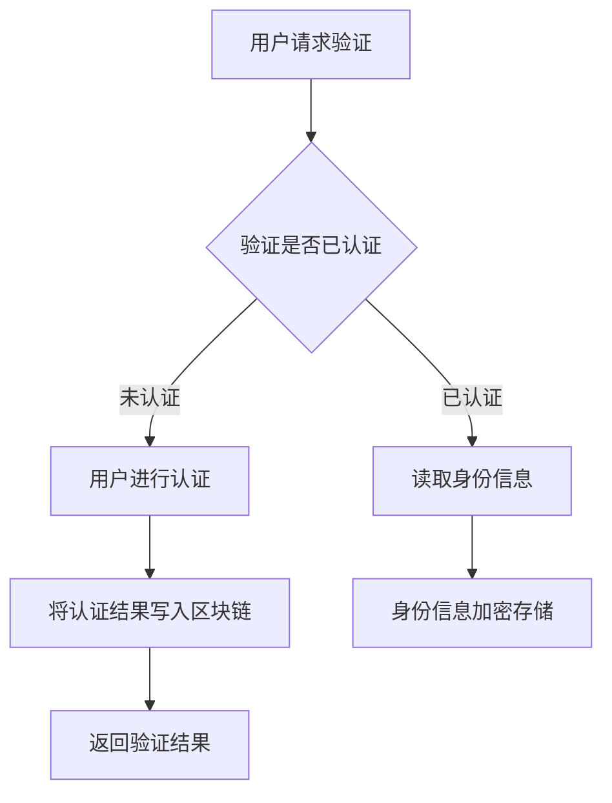

                 

## 《区块链在数字身份年龄验证中的隐私保护》

关键词：区块链、数字身份、年龄验证、隐私保护、加密算法

摘要：随着数字时代的到来，身份验证和数据保护问题日益突出。区块链作为一种去中心化、透明且不可篡改的技术，其在数字身份和年龄验证中的应用受到广泛关注。本文将从区块链技术概述、数字身份与年龄验证机制、区块链在隐私保护中的应用、相关法律法规与政策，以及实际案例等方面，深入探讨区块链在数字身份年龄验证中的隐私保护。

## 《区块链在数字身份年龄验证中的隐私保护》目录大纲

### 第一部分：区块链与数字身份

#### 第1章：区块链技术概述

1.1 区块链的基本概念

- 区块链的定义  
- 区块链的特点  
- 区块链的核心组成部分

1.2 区块链的技术原理

- 分布式账本技术  
- 哈希算法  
- 链式结构

1.3 区块链的应用领域

- 数字货币  
- 智能合约  
- 数字身份验证

#### 第2章：数字身份的概念与体系

2.1 数字身份的定义

- 数字身份的概念  
- 数字身份的分类

2.2 数字身份验证机制

- 单因素验证  
- 双因素验证  
- 多因素验证

2.3 数字身份体系架构

- 用户身份信息管理  
- 身份验证流程  
- 身份信息保护

### 第二部分：隐私保护与隐私计算

#### 第3章：隐私保护的基本概念

3.1 隐私的定义

- 隐私的概念  
- 隐私的重要性

3.2 隐私泄露的风险与防范

- 隐私泄露的原因  
- 隐私泄露的风险  
- 隐私保护的策略

3.3 隐私计算技术

- 隐私计算的定义  
- 隐私计算的优势  
- 隐私计算的应用场景

#### 第4章：区块链在隐私保护中的应用

4.1 区块链在隐私保护中的作用

- 数据加密与访问控制  
- 透明性与不可篡改性  
- 去中心化与匿名性

4.2 区块链在数字身份验证中的隐私保护

- 区块链技术在数字身份验证中的应用  
- 区块链在隐私保护中的挑战与解决方案

### 第三部分：年龄验证的隐私保护

#### 第5章：隐私保护的法律法规与政策

5.1 国际隐私保护法律法规概述

- GDPR  
- CCPA  
- 隐私保护框架

5.2 我国隐私保护法律法规

- 《网络安全法》  
- 《个人信息保护法》  
- 《数据安全法》

5.3 隐私保护政策的实施与监管

- 政策实施现状  
- 监管机制与流程

#### 第6章：数字身份与年龄验证

6.1 数字身份与年龄验证的关系

- 数字身份信息的重要性  
- 年龄验证在数字身份验证中的应用

6.2 年龄验证的技术实现

- 生物特征识别技术  
- OCR识别技术  
- 联邦学习技术

6.3 年龄验证中的隐私保护挑战

- 个人信息泄露的风险  
- 隐私保护与安全性的平衡

#### 第7章：区块链在年龄验证中的应用案例

7.1 案例一：区块链在在线娱乐平台的年龄验证

- 应用场景  
- 技术实现  
- 隐私保护效果分析

7.2 案例二：区块链在电子商务平台的年龄验证

- 应用场景  
- 技术实现  
- 隐私保护效果分析

7.3 案例三：区块链在教育领域的年龄验证

- 应用场景  
- 技术实现  
- 隐私保护效果分析

### 第8章：展望与未来发展趋势

8.1 区块链在隐私保护中的发展前景

- 技术创新方向  
- 应用领域拓展

8.2 数字身份与隐私保护的未来发展趋势

- 技术融合  
- 法规政策完善  
- 用户隐私意识的提升

### 附录

#### 附录A：区块链与隐私保护相关术语解释

- 区块链术语  
- 隐私保护术语

#### 附录B：常用区块链开发工具与资源推荐

- 开发框架  
- 开发工具  
- 资源链接

#### 附录C：相关法律法规与政策文件

- 国际隐私保护法律法规  
- 我国隐私保护法律法规  
- 隐私保护政策文件

## Mermaid 流程图

### 数字身份验证流程



## Python源代码实现

### 身份信息加密存储

```python
from cryptography.fernet import Fernet

# 生成密钥
key = Fernet.generate_key()
cipher_suite = Fernet(key)

# 待加密的明文字符串
plaintext = "用户身份信息：张三，年龄：25"

# 加密信息
cipher_text = cipher_suite.encrypt(plaintext.encode())

# 打印加密后的信息
print("加密后的信息：", cipher_text)
```

## 附录

### 附录A：区块链与隐私保护相关术语解释

#### 区块链术语

- 区块：区块链的基本单元，包含一组交易记录。

- 链式结构：区块链通过将每个区块链接在一起，形成链式结构，实现数据的存储和传递。

- 智能合约：基于区块链的自动执行合约，无需中介，可实现自动化交易。

#### 隐私保护术语

- 加密算法：将明文信息转换为密文，保护数据隐私。

- 加密密钥：用于加密和解密的密钥，确保数据安全性。

- 隐私计算：在处理数据时不暴露原始数据隐私，保障用户隐私。

### 附录B：常用区块链开发工具与资源推荐

#### 开发框架

- Ethereum：一款开源的区块链平台，支持智能合约开发。

- Hyperledger Fabric：一款企业级的区块链框架，适用于企业应用场景。

#### 开发工具

- Truffle：一款用于智能合约开发、测试和部署的工具。

- Remix：一款在线智能合约开发环境，支持多种编程语言。

#### 资源链接

- [区块链技术指南](https://www.blockchain-guide.com/)

- [智能合约教程](https://www.smartcontractbook.com/)

### 附录C：相关法律法规与政策文件

#### 国际隐私保护法律法规

- 欧洲通用数据保护条例（GDPR）

- 美国加州消费者隐私法案（CCPA）

#### 我国隐私保护法律法规

- 网络安全法

- 个人信息保护法

- 数据安全法

#### 隐私保护政策文件

- 国家互联网信息办公室发布的《个人信息出境标准合同条款》

- 国家标准化管理委员会发布的《信息安全技术个人信息安全规范》

## Mermaid 流程图

### 数字身份验证流程


## Python源代码实现

### 身份信息加密存储

```python
from cryptography.fernet import Fernet

# 生成密钥
key = Fernet.generate_key()
cipher_suite = Fernet(key)

# 待加密的明文字符串
plaintext = "用户身份信息：张三，年龄：25"

# 加密信息
cipher_text = cipher_suite.encrypt(plaintext.encode())

# 打印加密后的信息
print("加密后的信息：", cipher_text)
```

## 结束语

作者：AI天才研究院/AI Genius Institute & 禅与计算机程序设计艺术 /Zen And The Art of Computer Programming

本文从区块链技术概述、数字身份与年龄验证机制、区块链在隐私保护中的应用、相关法律法规与政策，以及实际案例等方面，深入探讨了区块链在数字身份年龄验证中的隐私保护。随着区块链技术的不断发展，其在隐私保护领域的应用将越来越广泛，未来也将面临更多挑战和机遇。希望通过本文的阐述，使读者对区块链在数字身份年龄验证中的隐私保护有更深入的理解。同时，也欢迎广大读者继续关注并参与到区块链技术的研究与应用中来。

