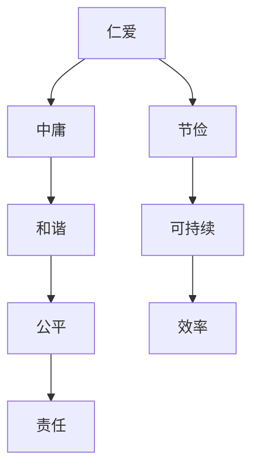

                 

### 摘要

本文旨在探讨古今智慧在现代生活中的应用，通过对传统思想与现代社会需求的深度融合，挖掘其在教育、职业发展、心理健康和家庭生活等方面的实际价值。文章首先概述了古代智慧的发展及其对现代生活的影响，分析了仁爱、中庸、节俭等核心理念的起源和演变。接着，文章讨论了传统思想在现代教育、职场和心理健康等领域的具体应用，结合实际案例进行深入解析。随后，文章探讨了传统思想在现代家庭生活和社会交往中的实践，并展望了其在环境保护和文化产业中的潜在影响。此外，本文还探讨了现代科技与传统思想的结合，特别是人工智能、互联网和生物技术等领域的创新与挑战。最后，文章提出了传统思想与现代科技融合的未来发展趋势，并总结出一系列最佳实践与注意事项。通过本文的探讨，我们期望为读者提供一个全面而深刻的理解，帮助他们在现代生活中更好地应用古今智慧。

### 目录

## 《古今智慧的对话：传统思想在现代生活中的应用》

### 第一部分：传统思想的核心理念

### 第二部分：现代生活与传统思想的实践

### 第三部分：传统思想与现代科技的融合

### 参考文献

- ... （此处列出相关参考文献）

### 关键词

- 古今智慧
- 传统思想
- 现代生活
- 教育应用
- 职业发展
- 心理健康
- 家庭生活
- 社会交往
- 科技融合

### 引言

在快速发展的现代社会，传统思想的重要性愈发凸显。古今智慧的结合不仅为我们的日常生活提供了深刻的哲学指导，也为我们应对现代挑战提供了宝贵的思想资源。本文旨在探讨传统思想在现代生活中的应用，通过深入分析古代智慧的核心理念，如仁爱、中庸和节俭，以及它们如何在现代教育、职场、心理健康和家庭生活等各个领域得到实践和运用，揭示其在现代社会中的重要价值。

本文的结构分为三大部分。第一部分聚焦于传统思想的核心理念，从起源和发展入手，详细阐述仁爱、中庸和节俭等概念，并通过对比东西方智慧，探讨这些理念的普遍性和现代意义。第二部分则将视角转向现代生活的具体应用，通过教育、职业发展、心理健康和家庭生活等领域的实例，展示传统思想如何帮助人们解决现代生活中的实际问题。第三部分探讨了传统思想与现代科技的融合，特别是在人工智能、互联网和生物技术等前沿领域的结合，分析了这一融合对未来的影响。

通过本文的探讨，我们希望不仅能够为读者提供关于古今智慧应用的理论基础，更希望通过实际案例的解析，激发读者在日常生活中主动运用传统思想的意识和能力，为构建一个更加和谐、智慧和可持续发展的现代社会贡献力量。

### 第一部分：传统思想的核心理念

#### 第一章：古今智慧的概述

#### 1.1 古代智慧的起源与发展

古代智慧起源于人类文明初期的探索与积累，无论是东方还是西方，都有其独特的智慧体系。在中国，古代智慧的起源可以追溯到数千年前。儒家、道家、墨家等学派共同构成了中国古代思想的核心，其中以孔子的儒家思想最为突出。儒家强调仁爱、中庸和礼教，提倡“修身齐家治国平天下”的理念，对中国社会和文化的形成产生了深远影响。道家则主张顺应自然、追求无为而治，强调个体内心的平和与自然界的和谐。墨家则提出了兼爱和非攻的理念，倡导节俭和反对战争。

西方古代智慧的起源则可以追溯到古希腊时期。古希腊哲学家如苏格拉底、柏拉图和亚里士多德等人，对伦理、政治、科学等领域进行了深刻探讨，奠定了西方哲学和科学思想的基础。柏拉图的理念论和亚里士多德的实证主义思想，对后世的哲学和科学方法论产生了重大影响。古希腊的民主制度和城邦体制，也为西方政治思想提供了宝贵的经验。

#### 1.2 现代思想的演变

随着历史的发展，现代思想在东西方都经历了显著的演变。在西方，文艺复兴、启蒙运动和工业革命等重大历史事件推动了思想的发展。文艺复兴强调人文主义，推崇个人价值和科学方法；启蒙运动则提倡理性思维，反对专制和迷信，倡导民主和自由；工业革命进一步推动了科技和社会的进步，但也带来了环境污染和社会不公等问题。

东方现代思想的发展同样经历了重要的变革。中国在近代以来，受到西方思想的影响，开始进行自我反思和现代化改革。从洋务运动到改革开放，中国不断吸取西方先进的科技和管理经验，同时也在传统文化中寻求现代性的根基。日本在明治维新时期，通过全面学习西方科技和制度，实现了快速的现代化，成为东方现代思想的重要代表。

#### 1.3 古今智慧融合的意义与挑战

古今智慧的融合不仅是对历史文化的继承，更是对现代社会问题的回应。将古代智慧融入现代生活，有助于我们更好地应对复杂的社会挑战。例如，仁爱之道可以促进人际关系的和谐，中庸之道可以帮助我们处理矛盾和冲突，节俭之道则能够引导我们合理利用资源。

然而，古今智慧的融合也面临诸多挑战。传统文化和现代思想在价值观、方法论等方面存在差异，如何在尊重传统文化的基础上，合理吸收和融合现代思想，是一个值得深思的问题。此外，现代社会快速变化，如何保持传统文化的延续性，也是一项重要的任务。

#### 1.4 古今智慧的交汇与融合

古今智慧的交汇与融合是一个复杂的过程，需要我们在理解古今智慧的基础上，寻找其共通之处，并创新性地运用到现代生活中。例如，在企业管理中，可以将儒家文化中的“仁爱”和“礼教”理念与现代管理科学相结合，提升员工的凝聚力和工作效率。在教育领域，可以将道家“顺应自然”的理念融入教学实践中，帮助学生培养自主学习和创新思维的能力。

总之，古今智慧的融合不仅有助于我们更好地理解和应用传统思想，也为现代社会的发展提供了新的思路和方向。通过深入探讨古今智慧，我们可以更好地面对现代生活的各种挑战，实现个人和社会的全面发展。

### 1.5 结论

通过对古今智慧起源和发展的分析，我们可以看到，无论是东方还是西方，古代智慧都为现代社会提供了宝贵的思想资源。这些智慧不仅反映了古代社会的核心价值观，也为现代生活提供了深刻的哲学指导。在现代思想的演变过程中，虽然东西方思想各有侧重，但都在不断地吸收和融合，形成了多元化的现代思想体系。这一过程不仅有助于我们更好地理解古今智慧，也为我们应对现代社会问题提供了新的思路和方法。因此，深入探讨古今智慧，挖掘其在现代生活中的应用价值，对于我们构建一个更加和谐、智慧和可持续发展的现代社会具有重要意义。

#### 第二章：传统思想的核心理念

#### 2.1 仁爱之道

仁爱之道是传统思想中最为核心的理念之一，不仅在中国文化中占据重要地位，也在西方哲学中有着深远影响。在儒家思想中，仁爱被视为最高的道德准则，孔子曾言：“仁者，爱人。”他认为，仁爱不仅是个人品德修养的体现，也是社会和谐的基础。在《论语》中，孔子多次强调了仁爱的重要性，如“夫仁者，己欲立而立人，己欲达而达人”，倡导人们以仁爱之心待人处世。

在西方哲学中，仁爱观念也有着悠久的传统。古希腊哲学家柏拉图在其作品《理想国》中，提出了“爱”的概念，认为爱是一种超越个人欲望的纯粹情感，是人类道德和社会和谐的重要基础。亚里士多德则将仁爱视为道德行为的根本，他认为仁爱是人类幸福和道德完善的必要条件。

在现代生活中，仁爱之道仍然具有重要的现实意义。首先，仁爱有助于人际关系的和谐。在社会交往中，仁爱可以减少矛盾和冲突，增进相互理解和尊重。例如，在职场中，管理者如果能够以仁爱之心对待员工，不仅能够提升员工的满意度和忠诚度，还能增强团队凝聚力，提高工作效率。其次，仁爱有助于社会的稳定和发展。一个充满仁爱之心的社会，能够更好地应对各种社会问题，促进社会和谐与进步。

然而，现代社会的快速发展也带来了一些挑战，使得仁爱之道的实践面临一定的困难。例如，快节奏的生活方式和激烈的竞争环境，往往使人过于关注自身利益，忽视了对他人的关爱。此外，物质主义和功利主义的盛行，也使得人们对于仁爱的理解产生了偏差，容易将其视为一种表面的礼貌或形式，而忽视了其深刻的道德内涵。

为了克服这些困难，我们可以在以下几个方面进行努力。首先，加强道德教育，从小培养人们的仁爱之心。通过家庭、学校和社会等多方面的共同努力，使仁爱成为人们自觉的行为准则。其次，倡导和实践仁爱之道，不仅要在言语上表达，更要在实际行动中体现。例如，通过志愿服务、慈善活动等方式，将仁爱之道落实到具体的社会实践中。最后，建立健全的社会制度，为仁爱之道的实践提供保障。例如，通过法律法规的制定和实施，保护弱势群体的权益，促进社会公平正义。

总之，仁爱之道是传统思想中的宝贵遗产，其在现代生活中的应用具有重要意义。通过深入理解和实践仁爱之道，我们可以为构建一个更加和谐、公平和可持续发展的现代社会贡献力量。

#### 2.2 中庸之道

中庸之道，又称为中道或中正之道，是中国古代哲学中极为重要的思想。儒家学派创始人孔子最早提出了这一概念，并在《论语》中多次强调：“中庸之为德也，其至矣乎！民鲜久矣。”孔子认为，中庸是一种至高无上的德行，它要求人们在行为和思想上不偏不倚，保持平衡和谐。

在道家思想中，中庸同样占据核心地位。老子在《道德经》中提出了“无为而治”的理念，强调领导者不应过度干预，而是顺应自然，保持事物的自然状态。庄子则进一步发展了这一思想，提倡“齐物论”，主张万物平等，追求内心的宁静和自我超越。

中庸之道的核心理念在于平衡与和谐。在儒家看来，中庸是道德行为的准则，它不仅要求个人在行为上遵守规范，更强调内心的平和与自省。在道家思想中，中庸则体现在对自然规律的顺应和自我调节。

中庸之道在现代生活中的应用同样具有重要意义。首先，在个人修养方面，中庸之道可以帮助我们保持心理健康，避免极端情绪的影响。通过平衡自我与他人、工作与生活、成功与失败等方面的关系，我们可以减少心理压力，提高生活质量。例如，在面对职场压力时，通过调整心态，保持平和与自省，可以有效缓解焦虑和紧张情绪。

其次，在人际关系中，中庸之道有助于建立和谐的关系。在人际交往中，我们常常会遇到各种矛盾和冲突。通过运用中庸之道，我们可以避免过于激进或消极的态度，以平衡的方式处理问题，达到相互理解和尊重。例如，在家庭关系中，中庸之道可以帮助父母和孩子建立良好的沟通，避免过度干涉或放任自流。

此外，中庸之道在企业管理和公共事务中也具有广泛的应用。在企业中，管理者可以通过中庸之道来平衡员工利益和企业发展，避免过度追求利润而忽视员工的福祉。在公共事务中，政策制定者和决策者可以运用中庸之道，综合考虑各方利益，寻求最合适的解决方案，从而实现社会的公平与和谐。

然而，现代社会的快节奏和多元化也使得中庸之道的实践面临一定的挑战。例如，在竞争激烈的环境中，人们往往容易陷入极端的思维模式，追求速度和效率而忽视平衡与和谐。此外，物质主义和功利主义的盛行，也使得一些人将中庸之道误解为一种妥协或逃避。

为了克服这些挑战，我们需要在以下几个方面进行努力。首先，加强道德教育和文化传承，使中庸之道成为人们自觉遵循的行为准则。其次，通过社会实践和自我反思，培养内心的平和与自省能力。最后，建立健全的社会制度，为中庸之道的实践提供良好的环境和支持。

总之，中庸之道是传统思想中的重要理念，其在现代生活中的应用具有重要意义。通过深入理解和实践中庸之道，我们可以为构建一个更加和谐、平衡和可持续发展的现代社会贡献力量。

#### 2.3 节俭之道

节俭之道是传统思想中的另一个核心理念，它在不同的文化和哲学体系中有着不同的表述，但核心思想相似，即强调节制和合理利用资源。在中国文化中，节俭被视为一种美德，儒家经典《论语》中提到：“节用而爱人，使民以时。”这表明，节俭不仅是一种个人修养，也是治理国家的重要原则。道家思想中，节俭与“无为而治”密切相关，老子在《道德经》中提出：“治大国，若烹小鲜”，强调领导者应尽量减少干预，保持社会的自然和谐。

在西方哲学中，节俭同样受到重视。古希腊哲学家亚里士多德认为，节俭是一种理性生活的基础，它能帮助人们避免过度消费和奢侈，从而实现财务稳定和个人幸福。在《圣经》中，节俭被视为一种信仰行为，强调节制和感恩。

节俭之道在现代生活中的应用具有多重意义。首先，节俭有助于个人财务的健康管理。通过合理规划和节约开支，个人可以减少债务压力，增加储蓄，为未来的不确定性做准备。其次，节俭有助于环境保护。随着全球资源日益紧张，节约能源和减少浪费成为全球共同面临的重要挑战。通过在日常生活中实践节俭，我们可以减少资源的消耗，减轻环境负担。

然而，现代社会的消费主义风气给节俭之道的实践带来了挑战。物质主义和广告营销的推动，使得人们容易陷入盲目追求消费的陷阱，忽视节俭的重要性。此外，社会压力和经济不平等问题，也使得一些人难以践行节俭生活方式。

为了克服这些挑战，我们可以采取以下措施。首先，加强节俭观念的宣传教育，提高公众对节俭重要性的认识。通过学校教育、媒体宣传和社会活动等多种途径，使节俭成为一种社会共识。其次，推广可持续生活方式，鼓励人们在日常生活中实践节俭。例如，通过减少一次性用品的使用、提倡绿色出行等具体行动，减少对环境的负面影响。最后，建立节俭激励机制，例如通过税收优惠、奖励政策等，鼓励个人和社会组织践行节俭。

总之，节俭之道是传统思想中的宝贵遗产，其在现代生活中的应用具有深远意义。通过深入理解和实践节俭之道，我们可以为个人和社会的可持续发展贡献力量，构建一个更加节约、环保和和谐的社会。

#### 2.4 传统思想的核心理念与现代社会的结合

传统思想的核心理念，如仁爱、中庸和节俭，虽然在不同的文化和哲学体系中有着不同的表述，但其核心价值在现代社会的各个领域仍然具有重要的应用价值。将这些传统思想与现代社会的需求相结合，不仅可以为个人成长提供指导，还能为社会发展贡献智慧。

首先，在教育领域，仁爱、中庸和节俭的理念可以帮助学生培养全面发展的素质。例如，仁爱教育可以培养学生关爱他人、乐于助人的品质，增强他们的社会责任感。中庸教育则可以帮助学生学会平衡自我与他人、学业与生活之间的关系，避免过度竞争和压力。节俭教育则可以培养学生的理财意识和可持续发展观念，鼓励他们合理使用资源，减少浪费。

其次，在职场发展中，传统思想的核心理念同样具有重要意义。仁爱可以促进职场中的团队合作和人际关系和谐，提高工作效率。中庸可以帮助职场人士在决策时保持理性，避免极端和冲动，从而做出更明智的选择。节俭则可以引导职场人士合理规划职业生涯，避免盲目跟风和过度消费，实现财务稳定和职业发展的可持续性。

再次，在心理健康领域，传统思想的核心理念可以提供重要的心理支持。仁爱可以缓解个体的孤独感和焦虑，增强心理健康。中庸可以帮助个体在面对压力和挫折时保持心理平衡，避免情绪失控。节俭则可以减少物质追求带来的心理负担，促进个体内心的宁静和满足。

最后，在家庭生活和社区建设中，传统思想的核心理念同样具有重要应用价值。仁爱可以促进家庭成员之间的相互关爱和理解，增强家庭凝聚力。中庸可以帮助家庭在处理日常事务时保持和谐，避免冲突和矛盾。节俭则可以促进家庭的财务健康，提高生活质量。

总之，传统思想的核心理念与现代社会的结合，不仅有助于提升个人素质和心理健康，还能促进社会和谐与可持续发展。通过深入研究和实践这些理念，我们可以为构建一个更加美好、和谐的社会贡献力量。

### 第三章：传统思想在现代教育、职场和心理健康领域的应用

#### 3.1 教育领域

传统思想在现代教育领域的应用，可以为教育工作者和学生提供深刻的哲学指导，有助于提升教育质量和培养全面发展的人才。首先，仁爱之道在教育中的应用，体现在教师对学生的关爱和尊重上。教师应以仁爱之心对待每一个学生，关注他们的成长需求，鼓励他们发展个性和特长。例如，在课堂上，教师可以通过倾听学生的意见、理解他们的困惑，建立良好的师生关系，从而创造一个充满关怀和支持的学习环境。

中庸之道在教育中的应用，则强调教育方法的平衡和适度。在教育过程中，教师不应过分追求成绩和竞争，而应注重学生的全面发展。例如，在课程设置上，教师可以合理安排不同类型的课程，既注重知识的传授，也关注学生的情感和兴趣培养。通过中庸之道，教师可以引导学生避免极端的学习态度，如在考试中过度焦虑或忽视学习兴趣，从而实现平衡和谐的发展。

节俭之道在教育中的应用，主要体现在资源的合理利用上。教育机构可以通过优化教学设施、减少浪费，提高资源使用效率。例如，学校可以推广电子教材，减少纸张的使用，同时利用信息技术手段，提高教学资源的可及性和共享性。此外，节俭教育还可以培养学生的节约意识和环保观念，使他们从小就养成良好的生活习惯。

具体案例方面，一些学校已经尝试将传统思想融入教育实践中，并取得了显著成效。例如，中国的某些中小学通过开展“仁爱教育”主题活动，如“关爱留守儿童”项目，让学生们亲身体验和践行仁爱之道。这不仅增强了学生的社会责任感，也促进了他们的个人成长。在课程设计上，一些学校也尝试将中庸之道融入教学中，通过案例分析和小组讨论，帮助学生理解平衡与和谐的重要性。此外，一些学校还通过开展“节俭校园”活动，倡导学生从日常生活中的小事做起，如节约用水、减少用纸，从而培养他们的节约意识和环保习惯。

总之，传统思想在现代教育领域的应用，不仅有助于提升教育质量和培养全面发展的人才，也为教育工作者提供了深刻的哲学指导。通过仁爱、中庸和节俭等理念的实际应用，我们可以为培养具有良好道德素质、心理健康和可持续发展能力的现代人才贡献力量。

#### 3.2 职场与职业发展

传统思想在现代职场与职业发展中的应用，不仅有助于提升个人素质和职业素养，还能促进组织文化和团队建设。首先，仁爱之道在职场中的应用，体现在员工之间的互助与关怀上。在一个充满仁爱之心的职场环境中，员工更愿意相互帮助和支持，共同面对工作中的挑战。例如，通过团队建设活动、同事间的互助项目等，可以增强员工的凝聚力和归属感，提高整体工作效率。

中庸之道在职场中的应用，则强调平衡与理性的决策。在职业生涯规划中，员工不应过分追求短期成绩，而应注重长期发展和个人兴趣的结合。通过运用中庸之道，员工可以在决策时保持冷静和理性，避免因冲动或焦虑而做出错误的选择。例如，在职业晋升过程中，员工可以通过评估自己的能力和兴趣，合理规划职业发展路径，从而实现职业生涯的可持续性。

节俭之道在职场中的应用，主要体现在资源管理和成本控制上。企业可以通过推行节俭理念，提高资源利用效率，降低运营成本。例如，通过优化生产流程、减少能源消耗、推行绿色办公等，企业可以实现可持续发展，同时提高市场竞争力。此外，节俭教育还可以引导员工养成良好的工作习惯，如节约用水用电、合理使用办公设备，从而减少资源浪费。

具体案例方面，一些企业已经成功地将传统思想融入职场文化和职业发展中，并取得了显著成效。例如，日本的一些公司通过推行“仁爱职场”文化，鼓励员工在工作中相互关心和支持，从而提高了员工的工作满意度和忠诚度。在职业发展方面，一些企业通过设立内部培训和发展计划，帮助员工根据个人兴趣和能力进行职业规划，实现了员工与企业的共同成长。

此外，还有一些企业通过实施节俭管理，实现了运营成本的大幅降低。例如，某知名跨国公司通过推行节能环保措施，不仅减少了能源消耗，还提高了生产效率，从而在全球市场上获得了竞争优势。

总之，传统思想在现代职场与职业发展中的应用，不仅有助于提升个人和组织的整体效能，也为构建一个和谐、高效和可持续发展的职场环境提供了重要的哲学指导。通过仁爱、中庸和节俭等理念的实践，我们可以为职场和职业发展注入更多的智慧和活力。

#### 3.3 心理健康

传统思想在心理健康领域的应用，为现代人应对心理压力和情感困扰提供了宝贵的指导。首先，仁爱之道在心理健康中的应用，体现在个体对他人的关爱与同情上。研究表明，积极的人际关系对心理健康有显著的积极影响。通过仁爱之道，个体可以培养良好的社交技能，建立稳定的人际网络，从而在心理上获得支持和安慰。例如，通过参与志愿服务或社区活动，人们不仅能够帮助他人，还能在过程中获得自我价值感和心理满足。

中庸之道在心理健康中的应用，则强调内心的平衡与自我调节。在现代社会的快节奏生活中，人们常常面临各种压力，心理失衡的情况较为普遍。通过中庸之道，个体可以学会在压力和情绪之间找到平衡点，避免极端的情绪反应。例如，在面临重大决策时，通过理性分析和冷静思考，个体可以做出更明智的选择，减少因冲动或焦虑带来的负面影响。

节俭之道在心理健康中的应用，主要体现在物质追求与内心满足的关系上。现代社会物质丰富，但人们往往容易陷入过度追求物质享受的陷阱，导致心理负担加重。通过节俭之道，个体可以学会理性消费，减少不必要的物质欲望，从而减轻心理压力。例如，通过制定合理的预算、减少不必要的购物，个体可以保持财务健康，同时提高心理满足感。

具体案例方面，一些心理健康干预项目已经成功地将传统思想融入其中，并取得了显著效果。例如，中国某些心理咨询机构通过引入儒家思想中的仁爱和中庸之道，为来访者提供心理支持。这些机构不仅帮助来访者解决具体心理问题，还通过教育他们如何运用仁爱和中庸之道应对生活中的压力和挑战，从而实现长期的心理健康。

此外，一些心理健康教育项目也通过节俭之道帮助个体培养良好的心理素质。例如，在某高校的心理健康教育课程中，学生通过学习传统节俭观念，学会了如何理性面对生活中的困难和挑战，从而提高了应对压力的能力。

总之，传统思想在心理健康领域的应用，为现代人提供了深刻的哲学指导，帮助他们在面对心理压力和情感困扰时找到平衡和解决问题的方法。通过仁爱、中庸和节俭等理念的实践，个体可以在心理上获得更多的支持和满足，实现更健康、更和谐的生活。

#### 3.4 家庭生活

传统思想在现代家庭生活中的应用，对于建立和谐的家庭关系和提高家庭生活质量具有重要意义。首先，仁爱之道在家庭中的应用，体现在家庭成员之间的相互关爱和尊重上。通过仁爱，家庭成员可以建立深厚的感情基础，增进相互理解和支持。例如，父母应以仁爱之心对待孩子，关心他们的成长需求，提供必要的情感支持。同时，孩子也应学会回报父母的关爱，通过体贴和孝顺来表达对家庭的感激。

中庸之道在家庭中的应用，强调家庭事务的平衡和适度。在现代家庭中，中庸之道可以帮助家庭成员在处理家务、育儿和工作等方面保持理性，避免因过度干涉或放任自流导致家庭矛盾。例如，在家庭决策中，父母可以通过协商和讨论，达成共识，共同承担责任，从而营造和谐的家庭氛围。

节俭之道在家庭中的应用，主要体现在资源管理和财务规划上。通过节俭，家庭可以减少不必要的开支，提高财务健康水平。例如，家庭成员可以制定家庭预算，合理安排日常开支，避免浪费。此外，节俭还可以培养家庭成员的理财意识和责任感，从而提高家庭的抗风险能力。

具体案例方面，一些家庭已经成功地将传统思想融入家庭生活中，并取得了显著成效。例如，某家庭通过实施仁爱之道，建立了良好的亲子关系。父母不仅关心孩子的学业，还关注他们的情感需求，通过倾听和沟通，帮助孩子解决成长中的困惑。在家庭决策中，该家庭通过中庸之道，避免了因意见分歧而导致的家庭矛盾，保持了家庭和谐。此外，该家庭通过节俭之道，合理安排家庭预算，提高了生活质量，为未来的不确定性做了充分的准备。

总之，传统思想在现代家庭生活中的应用，不仅有助于建立和谐的家庭关系，还能提高家庭生活质量。通过仁爱、中庸和节俭等理念的实践，家庭成员可以在日常生活中找到平衡和和谐，共同创造一个温馨、幸福的家庭环境。

### 第四部分：传统思想在现代家庭生活和社会交往中的应用

#### 4.1 家庭生活

传统思想在现代家庭生活中的应用，为建立和谐的家庭关系和提高家庭生活质量提供了宝贵的指导。首先，仁爱之道在家庭中的应用，体现在家庭成员之间的相互关爱和尊重上。在现代社会，家庭关系变得日益复杂，家庭成员之间的沟通和互动显得尤为重要。通过仁爱，家庭成员可以建立深厚的感情基础，增进相互理解和支持。例如，父母应以仁爱之心对待孩子，关心他们的成长需求，提供必要的情感支持。同时，孩子也应学会回报父母的关爱，通过体贴和孝顺来表达对家庭的感激。

具体案例方面，某家庭通过实施仁爱之道，成功建立了良好的亲子关系。该家庭的父母不仅关注孩子的学业，还注重他们的情感需求，通过倾听和沟通，帮助孩子解决成长中的困惑。在家庭决策中，该家庭通过仁爱之道，避免了因意见分歧而导致的家庭矛盾，保持了家庭和谐。此外，家庭成员之间也经常进行情感交流，分享生活中的喜悦和挑战，进一步增强了家庭的凝聚力和归属感。

其次，中庸之道在家庭中的应用，强调家庭事务的平衡和适度。在现代家庭中，中庸之道可以帮助家庭成员在处理家务、育儿和工作等方面保持理性，避免因过度干涉或放任自流导致家庭矛盾。例如，在家庭决策中，家庭成员可以通过协商和讨论，达成共识，共同承担责任，从而营造和谐的家庭氛围。

例如，在某家庭中，父母和子女共同制定了家庭事务的分工计划，通过合理分配家务和责任，避免了因家务负担不均而引发的矛盾。在育儿方面，该家庭通过中庸之道，既不过分干涉孩子的成长，也不放任不管，而是通过适度的引导和支持，帮助孩子培养独立和责任感。

最后，节俭之道在家庭中的应用，主要体现在资源管理和财务规划上。通过节俭，家庭可以减少不必要的开支，提高财务健康水平。例如，家庭成员可以制定家庭预算，合理安排日常开支，避免浪费。此外，节俭还可以培养家庭成员的理财意识和责任感，从而提高家庭的抗风险能力。

某家庭通过实施节俭之道，成功实现了财务健康和资源合理利用。该家庭成员不仅制定了详细的预算计划，还通过减少不必要的消费和优化资源使用，提高了生活质量。例如，他们通过二手市场和物美价廉的替代品，减少了日常开支，同时保持了家庭环境的整洁和舒适。

总之，传统思想在现代家庭生活中的应用，不仅有助于建立和谐的家庭关系，还能提高家庭生活质量。通过仁爱、中庸和节俭等理念的实践，家庭成员可以在日常生活中找到平衡和和谐，共同创造一个温馨、幸福的家庭环境。

#### 4.2 社会交往

传统思想在现代社会交往中的应用，对建立和谐的人际关系和社会环境具有深远影响。首先，仁爱之道在社会交往中的应用，体现在个体对他人的关爱和尊重上。现代社会充满了竞争和利益冲突，通过仁爱之道，个体可以培养良好的社交技能，建立稳定的人际网络，从而在心理上获得支持和安慰。例如，在职场中，员工通过关心同事、乐于助人，可以增强团队合作精神，提高工作效率。

具体案例方面，某公司通过推行仁爱之道，成功建立了和谐的职场文化。该公司定期组织员工关怀活动，如团队建设、志愿者服务等，鼓励员工在工作和生活中相互关爱和支持。通过这些活动，不仅增强了员工的凝聚力，还提高了员工的工作满意度和忠诚度。此外，员工之间也建立了深厚的友谊，形成了良好的工作氛围。

其次，中庸之道在社会交往中的应用，强调人际关系的平衡和适度。在现代社会，人际交往复杂多变，通过中庸之道，个体可以在处理人际关系时保持理性，避免极端和冲动。例如，在冲突和矛盾面前，通过理性沟通和协商，可以找到双方都能接受的解决方案，从而维护人际和谐。

例如，在某社区中，居民通过中庸之道，成功解决了邻里纠纷。当邻居之间发生矛盾时，社区居委会组织居民进行沟通和调解，通过协商和讨论，找到了双方都能接受的解决方案。这不仅维护了邻里关系，还增强了社区的凝聚力。

最后，节俭之道在社会交往中的应用，主要体现在资源管理和节约意识上。通过节俭，社会可以减少资源浪费，提高资源利用效率，从而促进可持续发展。例如，在社会交往中，通过合理规划活动和预算，可以减少不必要的开支，提高活动效益。

某社区通过实施节俭之道，成功举办了环保公益活动。社区组织了垃圾分类和回收利用的宣传活动，并制定了详细的预算计划，确保活动的顺利进行。通过这些活动，不仅提高了居民的环保意识，还促进了社区的可持续发展。

总之，传统思想在现代社会交往中的应用，为建立和谐的人际关系和社会环境提供了宝贵的指导。通过仁爱、中庸和节俭等理念的实践，个体和社会可以在复杂多变的环境中找到平衡和和谐，共同创造一个和谐、可持续发展的社会。

### 4.3 环境保护

传统思想在现代环境保护中的应用，为我们提供了深刻的哲学指导，帮助我们在面对环境问题时找到可持续发展的路径。首先，仁爱之道在环境保护中的应用，体现在对自然界的关爱和尊重上。儒家思想强调“天人合一”，认为人类与自然界是一个整体，通过仁爱之道，人类应尊重自然、保护生态。现代环保主义也强调人类与自然的和谐共生，倡导减少对自然资源的过度开发和破坏。

中庸之道在环境保护中的应用，则强调平衡和理性。现代环境保护不仅需要技术创新和制度保障，还需要人们在行为和思想上保持平衡。通过中庸之道，我们可以避免极端的环境保护行为，如过度消费和极端节约，而是通过合理利用资源、减少浪费，实现可持续发展。

节俭之道在环境保护中的应用，主要体现在资源管理和减少浪费上。现代环境保护面临的一个重要挑战是资源枯竭和环境污染。通过节俭之道，我们可以合理利用资源，减少浪费，降低环境负担。例如，在日常生活中，通过节约用水、减少用纸、使用环保材料等，我们可以减少对环境的负面影响。

具体案例方面，一些国家和地区已经成功地将传统思想应用于环境保护中，并取得了显著成效。例如，日本在环境保护方面践行了儒家的仁爱之道，通过推行垃圾分类和循环利用政策，实现了资源的有效利用和环境的可持续保护。同时，日本也注重中庸之道，通过平衡经济发展和环境保护，实现了经济与生态的双赢。

在节俭方面，中国的一些城市通过实施“绿色出行”和“节能建筑”项目，有效减少了能源消耗和环境污染。例如，北京市通过推广公共交通和绿色出行方式，如自行车和电动车，减少私家车使用，从而降低了城市空气污染。

此外，一些国际环保组织和非政府组织也通过传统思想的指导，开展了许多成功的环保项目。例如，国际环保组织“地球之友”在发展中国家推广“社区垃圾分类和资源回收”项目，通过教育社区居民关于仁爱、中庸和节俭的理念，提高了他们的环保意识和实践能力。

总之，传统思想在现代环境保护中的应用，不仅为解决环境问题提供了哲学指导，也为实现可持续发展提供了实践路径。通过仁爱、中庸和节俭等理念的实践，我们可以为保护地球家园、构建可持续发展的未来贡献力量。

### 4.4 文化产业

传统思想在现代文化产业中的应用，不仅丰富了文化产品和内容，还为文化产业的发展提供了深刻的哲学思考。首先，仁爱之道在文化产业中的应用，体现在文化产品和服务中对人的关怀和尊重上。例如，影视作品和文学作品可以通过展现仁爱主题，传递正能量，激发观众的情感共鸣，提升社会道德水平。比如，电影《千与千寻》通过讲述小女孩千寻在神秘世界的冒险经历，展现了人类对自然的敬畏和仁爱之情，成为一部经典作品。

其次，中庸之道在文化产业中的应用，则体现在文化产品和服务的平衡和理性上。现代文化产业在追求商业成功的同时，也需要注重社会责任和人文价值。通过中庸之道，文化产业可以避免过度商业化或忽视文化内涵，实现商业与文化的平衡。例如，某音乐公司通过推广既有商业潜力又富含文化内涵的音乐作品，不仅获得了商业成功，也赢得了社会赞誉。

节俭之道在文化产业中的应用，主要体现在资源管理和成本控制上。现代文化产业需要大量资源投入，通过节俭之道，可以减少资源浪费，提高资源利用效率。例如，一些文化机构通过推行绿色生产和环保理念，减少纸张和能源消耗，不仅降低了成本，也提升了品牌形象。

具体案例方面，一些文化产业项目成功地将传统思想融入其中，取得了良好的社会效益和经济效益。例如，中国的某些文化主题公园通过融合儒家、道家和佛家思想，打造了具有深厚文化底蕴的旅游目的地。这些公园不仅吸引了大量游客，也传播了传统文化，成为文化传承的重要载体。

此外，一些文化产品也通过创新形式和内容，实现了传统思想与现代文化的融合。例如，中国的某些手机应用程序通过将儒家思想中的“仁爱”、“中庸”和“节俭”理念融入互动游戏和社交功能中，吸引了大量用户，取得了巨大成功。

总之，传统思想在现代文化产业中的应用，不仅丰富了文化产品和内容，也为文化产业的发展提供了哲学指导。通过仁爱、中庸和节俭等理念的实践，文化产业可以更好地实现社会效益和经济效益的双赢，为构建和谐社会贡献力量。

### 5.1 传承与创新

#### 5.1.1 传统思想的传承方式

传统思想的传承是文化延续和发展的基础。在历史长河中，传统思想通过多种方式得以保存和传播，包括口头传承、文献记录、仪式活动和家庭教育等。

首先，口头传承是传统思想在早期社会中最主要的形式。通过口耳相传，一代代人们将智慧、道德和价值观传授给下一代。这种方式虽然易于传播，但也容易导致信息的失真和误解。例如，中国古代的《论语》就是通过孔子的弟子们口头传授并记录下来的。

其次，文献记录是传统思想传承的重要途径。从甲骨文、竹简到后来的纸张书籍，文献记录为传统思想的保存和传播提供了持久和可靠的载体。例如，《道德经》、《论语》和《孟子》等经典著作，通过文字记录，使得传统思想得以传承至今。

再次，仪式活动是传统思想传承的重要方式之一。通过仪式，人们不仅能够体验和表达传统思想，还能将其内化为日常行为规范。例如，中国的春节和端午节等传统节日，不仅具有庆祝和娱乐功能，还承载了丰富的传统思想和文化内涵。

最后，家庭教育是传统思想传承的重要途径。父母通过言传身教，将传统思想传递给子女。家庭教育的特点在于其潜移默化和持续性的影响，使得传统思想能够在日常生活中得以实践和传承。

#### 5.1.2 传统思想的创新路径

在现代社会，传统思想的传承不仅需要保持其核心价值，还需要进行创新，以适应不断变化的社会环境。传统思想的创新路径主要包括以下几种：

首先，文化融合是传统思想创新的重要方式。通过吸收和融合外来文化，传统思想可以焕发新的生命力。例如，中国的佛教文化就是通过融合印度文化和中华文化而形成的。在现代文化产业中，通过将传统文化与现代元素相结合，如将传统戏曲与现代音乐结合，可以创造出具有时代特色的新文化产品。

其次，科技应用是传统思想创新的另一重要路径。现代科技的发展为传统思想的传播和应用提供了新的手段和平台。例如，通过互联网和社交媒体，传统思想可以迅速传播到全球各地，打破了地域和时间的限制。此外，虚拟现实和增强现实技术也为传统思想的体验和展示提供了全新的方式。

再次，艺术创新是传统思想在文化领域中的重要表现形式。通过艺术创作，传统思想可以以更加生动和直观的形式传达给大众。例如，中国的一些艺术家通过将传统思想融入绘画、雕塑和装置艺术中，创造出了具有深刻文化内涵的艺术作品。

最后，教育创新是传统思想在教育和人才培养中的关键路径。通过改革教育内容和教学方法，传统思想可以更好地融入现代教育体系中。例如，将传统思想与现代教育理念相结合，开发出既符合传统价值观又适应现代需求的课程和教学资源。

#### 5.1.3 传承与创新的关系

传统思想的传承与创新是相辅相成的。传承为创新提供了基础，而创新则为传承注入了活力。只有在传承的基础上进行创新，传统思想才能与时俱进，保持其生命力和影响力。例如，孔子思想通过历代传承，不仅保留了其核心价值，还不断融入新的时代内容，成为中华文化的重要组成部分。

创新也离不开传承的支持。只有深刻理解传统思想的核心价值和历史背景，才能进行有效的创新。例如，在文化产业中，通过深入研究传统艺术形式和文化内涵，可以创造出既具有传统特色又符合现代审美的新文化产品。

总之，传承与创新是传统思想发展过程中的两个重要方面。通过合理传承和创新，我们可以不断挖掘和发扬传统思想的价值，为现代社会提供深刻的哲学指导和智慧支持。

### 5.2 人才培养

传统思想在现代人才培养中的应用，为培养具备全面素质和发展潜力的现代人才提供了宝贵的指导。首先，仁爱之道在人才培养中的应用，强调教育者和学生之间的关爱与尊重。通过仁爱，教育者可以激发学生的内在动力，培养他们的社会责任感。例如，在教育过程中，教师可以通过关注学生的成长需求、理解他们的困惑，建立良好的师生关系，从而促进学生的全面发展。

其次，中庸之道在人才培养中的应用，强调教育方法的平衡与适度。在人才培养过程中，教育者不应过分追求学术成绩，而应注重学生的全面发展。通过中庸之道，教育者可以在课程设置、教学方法上保持理性，避免过度竞争和压力。例如，在课程设计中，教育者可以合理安排不同类型的课程，既注重知识的传授，也关注学生的情感和兴趣培养。

节俭之道在人才培养中的应用，主要体现在资源管理和成本控制上。通过节俭，教育机构可以优化资源利用，提高教育质量。例如，通过合理使用教材、推广电子教学手段，教育机构可以减少资源浪费，降低教育成本。

具体案例方面，一些学校和教育机构已经成功地将传统思想融入人才培养实践中，并取得了显著成效。例如，中国的某些中小学通过推行“仁爱教育”，实施关爱学生和尊重个性的教育方法，学生的社会责任感和创新能力得到了显著提升。在课程设置上，一些学校通过中庸之道，合理安排不同类型的课程，帮助学生在学业和兴趣之间找到平衡，从而实现全面发展。

此外，一些教育机构通过实施节俭之道，提高了教育资源的使用效率。例如，某高校通过推行“绿色校园”计划，提倡节约用水、减少用纸等环保措施，不仅降低了运营成本，还提高了学生的环保意识和责任感。

总之，传统思想在现代人才培养中的应用，不仅有助于提升教育质量和培养全面发展的人才，也为教育工作者提供了深刻的哲学指导。通过仁爱、中庸和节俭等理念的实践，教育机构可以更好地实现教育目标，为培养具有良好道德素质、心理健康和可持续发展能力的现代人才贡献力量。

### 5.3 文化产业

传统思想在现代文化产业中的应用，不仅丰富了文化产品和内容，还促进了文化产业的创新与发展。首先，仁爱之道在文化产业中的应用，体现在文化产品和服务的关注人文关怀和社会责任上。例如，影视作品和文学作品可以通过展现仁爱主题，传递正能量，激发观众的情感共鸣。例如，电影《我不是药神》通过讲述一个小人物在面对社会不公和疾病挑战时的仁爱之举，引发了观众对社会问题的深思。

其次，中庸之道在文化产业中的应用，强调文化产品和服务的平衡与理性。在追求商业成功的同时，文化产业也需要注重社会责任和文化内涵。通过中庸之道，文化产业可以避免过度商业化或忽视文化价值，实现商业与文化的平衡。例如，某文化公司通过开发具有深厚文化内涵的文化产品，不仅获得了商业成功，也赢得了社会的认可。

节俭之道在文化产业中的应用，主要体现在资源管理和成本控制上。现代文化产业需要大量资源投入，通过节俭之道，可以减少资源浪费，提高资源利用效率。例如，一些文化机构通过推行绿色生产和环保理念，减少纸张和能源消耗，从而降低成本，提高效益。

具体案例方面，一些文化产业项目成功地将传统思想融入其中，并取得了显著成果。例如，中国的某些文化主题公园通过融合儒家、道家和佛家思想，打造了具有深厚文化底蕴的旅游目的地。这些公园不仅吸引了大量游客，还传播了传统文化，成为文化传承的重要载体。

此外，一些文化产品也通过创新形式和内容，实现了传统思想与现代文化的融合。例如，中国的某些手机应用程序通过将儒家思想中的“仁爱”、“中庸”和“节俭”理念融入互动游戏和社交功能中，吸引了大量用户，取得了巨大成功。

总之，传统思想在现代文化产业中的应用，不仅丰富了文化产品和内容，还促进了文化产业的创新与发展。通过仁爱、中庸和节俭等理念的实践，文化产业可以更好地实现社会效益和经济效益的双赢，为构建和谐社会贡献力量。

### 6.1 人工智能与哲学思考

#### 6.1.1 人工智能的发展与传统哲学思想的关系

人工智能（AI）的迅速发展，不仅改变了科技和经济的格局，也对哲学思想提出了新的挑战和思考。人工智能的发展与传统哲学思想之间存在着深刻的联系，这种联系不仅体现在技术和理念层面，也反映在伦理和认知领域。

首先，从技术层面来看，人工智能的发展受到了传统哲学思想的启发。古希腊哲学家亚里士多德曾提出“形而上学”（Metaphysics）这一概念，探讨存在和本质的问题。这一思想为现代人工智能研究中的“存在论”和“认知科学”提供了理论基础。人工智能研究者通过模拟人类思维过程，试图理解意识、推理和学习等复杂现象，这与亚里士多德对思维和存在的探讨有着异曲同工之妙。

其次，从理念层面来看，传统哲学思想为人工智能的发展提供了伦理指导。例如，儒家思想中的“仁爱”理念，强调了人与人之间的关爱和道德责任。在人工智能伦理学中，这一理念被用来指导AI系统的设计和应用，确保AI技术在增进人类福祉的同时，不会损害人的基本权利和尊严。

再次，从认知层面来看，传统哲学思想对人工智能的影响体现在对“意识”和“自我”的理解上。康德哲学中的“自我意识”概念，探讨了个体如何通过自我反思来认识世界。这一思想为人工智能领域中的“自我意识”研究提供了理论框架，帮助研究者探讨AI系统是否能够具备自我意识和自主决策能力。

具体案例方面，儒家思想中的“仁爱”理念在AI伦理学中的应用尤为突出。在医疗领域中，AI系统被用于辅助诊断和治疗。然而，AI在处理敏感的医疗数据时，需要遵循伦理原则，确保对患者的隐私保护和公平对待。儒家“仁爱”理念强调的关爱和尊重，为AI在医疗领域的应用提供了伦理指导，帮助研究者设计出更符合道德标准的AI系统。

在自动驾驶汽车领域，中庸之道也为AI的发展提供了启示。自动驾驶系统需要在各种复杂情境下做出决策，既不能过于保守也不能过于激进。通过中庸之道的理念，研究者可以在设计中平衡安全性和灵活性，确保自动驾驶汽车在不同路况下都能做出最优决策。

总之，传统哲学思想对人工智能的发展具有重要的指导作用。通过理解传统哲学思想中的核心概念，人工智能研究者可以更好地应对技术发展带来的伦理和认知挑战，实现人工智能的可持续发展。

#### 6.1.2 哲学思想对人工智能发展的启示

哲学思想对人工智能发展的启示主要体现在对技术伦理、意识理解和认知建模等方面的指导上。以下将通过具体例子和理论分析，探讨哲学思想如何对人工智能的发展提供指导。

首先，在技术伦理方面，儒家思想中的“仁爱”理念为人工智能的伦理设计提供了重要的道德基础。人工智能在医疗、金融、交通等领域的应用日益广泛，但其设计和应用过程中可能带来的伦理问题也备受关注。例如，在自动驾驶汽车中，AI系统需要在紧急情况下做出生死抉择，如何确保这些决策符合道德原则成为关键问题。儒家“仁爱”理念强调对生命的尊重和对他人的关爱，这一思想可以指导AI系统的设计，使其在面临道德困境时，能够优先考虑保护人的生命和利益。

具体案例方面，某自动驾驶汽车公司在其AI系统中采用了基于儒家“仁爱”理念的决策算法。该算法在处理紧急情况时，通过分析不同选择的道德后果，尽量减少对他人的伤害，确保行车的安全性和道德性。这一设计不仅提升了自动驾驶汽车的安全性能，也赢得了社会和用户的认可。

其次，在意识理解方面，康德哲学中的“自我意识”概念对人工智能的研究提供了深刻的启示。康德认为，自我意识是人类认识世界的基础，只有通过自我反思，个体才能获得对世界的理解。在人工智能领域，研究者试图通过模拟人类意识，实现AI系统的自我意识和自主决策能力。这一研究不仅有助于提升AI的智能水平，也为哲学中的意识研究提供了新的视角。

具体案例方面，某研究团队开发了一种基于康德“自我意识”概念的AI系统。该系统通过不断自我反思和学习，逐渐形成了一种自我意识，能够自主识别和解决问题。这一突破不仅为AI技术开辟了新的研究方向，也为哲学中的意识研究提供了实证支持。

再次，在认知建模方面，中国传统哲学中的“中庸之道”为人工智能的认知建模提供了新的思路。中庸之道强调平衡与和谐，在认知建模中，这一理念可以帮助研究者设计出更加灵活和适应性强的模型。通过中庸之道，AI系统可以在处理复杂问题时，避免极端和偏见，实现最优的决策。

具体案例方面，某研究团队在开发智能客服系统时，采用了基于中庸之道的认知建模方法。该系统通过平衡用户需求和客服资源的分配，避免了过度响应和资源浪费，提高了客服效率和用户体验。这一设计不仅提升了系统的性能，也为认知建模研究提供了新的方向。

总之，哲学思想对人工智能的发展提供了多方面的指导，从伦理设计、意识理解到认知建模，哲学思想不仅为人工智能的技术发展提供了理论基础，也为解决技术带来的伦理和认知挑战提供了智慧支持。通过融合哲学思想，人工智能研究可以更加全面和深入，实现技术和社会的可持续发展。

#### 6.1.3 人工智能与哲学思考的互动

人工智能与哲学思考的互动不仅体现在哲学思想对人工智能发展的指导上，也体现在人工智能对哲学研究的反作用。随着人工智能技术的不断进步，哲学研究在多个领域得以拓展，形成了一种新的哲学思考模式。以下是具体分析：

首先，人工智能对伦理学研究的反作用。传统伦理学研究主要关注人类行为和道德规范，而人工智能的出现带来了新的伦理挑战。例如，在自动驾驶汽车和医疗诊断等领域，AI系统的决策可能涉及生命和福祉问题，如何确保AI系统的决策符合道德原则成为伦理学研究的新课题。人工智能通过模拟和实现道德决策，促使伦理学家重新审视和探讨道德规范的定义和适用范围。

具体案例方面，某伦理学研究项目通过分析自动驾驶汽车在紧急情况下的决策过程，提出了“道德算法”的概念。这一研究不仅推动了伦理学理论的发展，也为实际应用中的AI系统设计提供了伦理指导。

其次，人工智能对认识论的挑战和贡献。传统认识论主要探讨人类如何通过感知和理性认识世界，而人工智能则通过数据分析和算法模拟，展示了人类认识之外的认知方式。人工智能通过大数据和机器学习技术，实现了对复杂系统的理解和预测，这对认识论提出了新的问题和挑战。例如，人工智能能否具有自我意识和自主认知能力，这一问题引发了哲学界对意识本质和认知机制的深刻讨论。

具体案例方面，某哲学研究团队通过分析人工智能的自我学习和决策过程，提出了“计算认识论”的概念。这一研究不仅拓展了认识论的研究范围，也为人工智能的发展提供了新的哲学视角。

再次，人工智能对形而上学的影响。传统形而上学探讨存在的本质和世界的结构，而人工智能的发展使得“存在”和“现实”的定义变得复杂。例如，人工智能通过虚拟现实和增强现实技术，创造了新的“存在”形式，这引发了哲学界对存在本质和虚拟现实的深入探讨。

具体案例方面，某形而上学研究项目通过分析虚拟现实中的伦理和认知问题，提出了“虚拟实在论”的概念。这一研究不仅探讨了存在的本质，也为人工智能技术中的虚拟现实应用提供了哲学基础。

总之，人工智能与哲学思考的互动不仅促进了哲学研究的发展，也推动了人工智能技术的进步。通过哲学思想的指导，人工智能技术可以更加合理和道德地发展，同时，人工智能的实践也为哲学研究提供了新的理论和实证支持。这种互动为人工智能和哲学共同的发展开辟了广阔的前景。

### 6.2 互联网与传统文化

#### 6.2.1 互联网对传统文化的影响

互联网的普及和发展，对传统文化产生了深远的影响，既带来了机遇，也带来了挑战。首先，互联网为传统文化的传播提供了新的平台和渠道。通过互联网，传统文化可以跨越时空的限制，被更多的人了解和传承。例如，中国的传统文化如诗词、书法、国画等，通过社交媒体和在线教育平台，实现了全球范围内的传播和普及。这不仅提升了传统文化的知名度，也为文化多样性提供了新的动力。

然而，互联网对传统文化的冲击也是显而易见的。随着互联网的普及，现代文化的快速传播使得传统文化在某些领域面临被边缘化的风险。例如，一些传统文化形式如手工艺、传统音乐等，由于缺乏市场支持和年轻一代的关注，面临着传承难题。此外，互联网的便捷性和多样性，也改变了人们的文化消费习惯，使得传统文化在现代社会中的地位和影响力受到挑战。

具体案例方面，中国的某在线教育平台通过互联网，推广中国传统文化的课程和资源，吸引了大量用户。该平台提供了丰富的传统文化课程，如书法、国画、古琴等，不仅帮助用户了解和掌握传统文化知识，也激发了他们对传统文化的兴趣和热爱。这一成功案例表明，互联网可以为传统文化的传承和发展提供重要支持。

此外，互联网也带来了对传统文化创新的机遇。通过互联网，传统文化可以在保留原有精髓的基础上，与现代元素相结合，创造出新的文化形式。例如，一些传统曲艺通过加入现代音乐元素，形成了新的表演形式，吸引了更多年轻人的关注。这种创新不仅保留了传统文化的核心价值，也使其更具时代感和吸引力。

总之，互联网对传统文化的影响是双重的，既有挑战，也有机遇。通过合理利用互联网，传统文化可以在现代社会中焕发新的生机，实现传承与发展。

#### 6.2.2 传统文化在互联网时代的传承与创新

在互联网时代，传统文化面临着前所未有的传承与创新挑战。为了在保持传统文化核心价值的同时，适应现代社会的需求，传统文化在互联网时代需要不断创新和适应。

首先，传统文化在互联网时代的传承，需要借助数字化和多媒体技术。通过数字化手段，传统文化可以以更加便捷和多样化的形式传播。例如，利用互联网和移动设备，用户可以随时随地通过手机应用程序或在线平台访问传统文化资源，如电子书籍、音频讲解、视频教程等。这种数字化传承方式不仅打破了时间和空间的限制，也提高了传统文化的可及性和普及率。

具体案例方面，中国的某些文化机构通过开发传统文化应用程序，将传统艺术形式如京剧、昆曲、古筝等，通过数字化手段进行传播和推广。这些应用程序不仅提供了高质量的音频和视频内容，还结合互动功能，让用户可以亲身体验传统艺术的魅力。这种数字化传承方式，不仅为传统文化的传播提供了新的渠道，也激发了年轻一代对传统文化的兴趣。

其次，传统文化在互联网时代的创新，需要结合现代科技和流行文化。通过将传统文化与现代元素相结合，传统文化可以焕发新的活力。例如，一些传统节日如春节、中秋节等，通过互联网平台进行宣传和推广，不仅增加了节日的仪式感，也提高了公众的参与度和互动性。例如，某电商平台通过线上活动，如虚拟购物节、线上表演等，将传统节日与现代购物文化相结合，吸引了大量年轻用户的参与。

此外，传统文化在互联网时代的创新，还需要注重用户体验和参与感。通过互联网平台，用户可以参与到传统文化的创作和传播过程中，从而增强对传统文化的认同感和归属感。例如，一些在线社区和社交媒体平台，鼓励用户上传和分享传统文化作品，如手工制作、传统音乐等。这种用户参与的方式，不仅为传统文化的传播提供了新的动力，也促进了传统文化与现代社会的互动。

具体案例方面，中国的某些在线社区通过举办传统文化主题活动，如传统手工艺制作大赛、传统音乐演出等，吸引了大量用户参与。这些活动不仅提升了用户的参与感和互动性，也为传统文化的传播和传承提供了新的途径。

总之，传统文化在互联网时代的传承与创新，需要借助数字化和多媒体技术，结合现代科技和流行文化，注重用户体验和参与感。通过不断创新和适应，传统文化可以在互联网时代焕发新的生机，实现传承与发展的双赢。

#### 6.2.3 互联网与传统文化融合的实际案例

互联网与传统文化融合的成功案例，不仅展示了二者结合的潜力，也为传统文化的现代化传承提供了有益的经验。以下是几个具有代表性的案例：

首先，中国某文化公司开发的“文化云”平台，通过互联网技术，将传统文化资源进行数字化处理和传播。该平台提供了丰富的传统文化内容，如古籍、音乐、戏剧、书法等，用户可以通过手机应用程序在线访问。这不仅提高了传统文化的可及性，也激发了公众对传统文化的兴趣。此外，平台还提供了互动功能，如线上课程、互动问答等，增强了用户的参与感和体验感。

其次，某电商平台通过互联网，将传统节日与现代商业活动相结合。例如，在春节期间，该平台推出了线上虚拟红包、线上购物节等活动，吸引了大量用户参与。通过这些活动，不仅增加了节日的仪式感，也提升了电商平台的销售额。这一案例表明，互联网可以为传统文化的传播和商业活动提供新的渠道和方式。

再次，某在线教育平台通过互联网，推广传统文化教育。该平台提供了丰富的传统文化课程，如书法、国画、古筝等，用户可以通过在线学习，了解和掌握传统文化知识。此外，平台还结合虚拟现实技术，为用户提供了沉浸式的学习体验，增强了学习效果。这一案例展示了互联网在传统文化教育中的巨大潜力。

此外，某社交媒体平台通过互联网，推动传统文化作品的创作和传播。该平台鼓励用户上传和分享传统文化作品，如手工制作、传统音乐等。通过这种方式，不仅提升了传统文化的知名度，也促进了用户之间的互动和交流。这一案例表明，互联网可以为传统文化的传播和创作提供新的平台和机会。

总之，这些实际案例表明，互联网与传统文化融合，不仅有助于传统文化的传承和发展，也为文化创新提供了新的思路和途径。通过不断探索和尝试，我们可以为传统文化在互联网时代的传承与创新找到更多有效的解决方案。

### 6.3 生物技术与伦理思考

#### 6.3.1 生物技术的发展与传统伦理思想的冲突与融合

生物技术的迅速发展，为医学、农业和环境科学等领域带来了前所未有的机遇，但同时也引发了深刻的伦理思考。生物技术的应用，如基因编辑、克隆技术、人类干细胞研究等，不仅触及科学前沿，还挑战了传统的伦理观念。在这种背景下，如何平衡科技进步与伦理价值，成为社会广泛关注和讨论的焦点。

首先，生物技术的发展与传统伦理思想的冲突表现在多个方面。基因编辑技术的出现，使得人类能够对基因进行精确修改，从而治疗遗传性疾病或增强特定性状。然而，这一技术也引发了对基因伦理和人类尊严的质疑。例如，基因编辑可能导致“设计婴儿”的出现，引发关于人类本质和道德底线的讨论。传统伦理思想强调个体的平等和尊严，而基因编辑技术的应用，可能导致社会不平等和人类尊严的丧失。

其次，传统伦理思想在生物技术发展中的应用，主要体现在对科学研究的伦理指导和规范上。例如，人类干细胞研究在医学领域具有巨大的潜力，但同时也涉及伦理问题，如胚胎的使用和生命的尊严。传统伦理思想中的“生命神圣”原则，为干细胞研究提供了伦理框架，要求研究人员在实验过程中尊重和保护胚胎的生命权。

在克隆技术方面，传统伦理思想对人类繁衍和生物多样性的尊重，成为重要的伦理考量。克隆技术的应用，如人类克隆，不仅挑战了传统的生育观念，还可能导致社会伦理体系的重构。传统伦理思想强调人类个体的独特性和不可复制性，克隆技术的应用可能削弱这一价值观，引发关于人类身份和伦理认同的讨论。

然而，传统伦理思想与生物技术发展的融合，也为解决伦理冲突提供了可能性。首先，通过深入探讨传统伦理观念，可以明确其核心价值观，为生物技术的伦理规范提供指导。例如，在基因编辑技术的应用中，可以借鉴儒家“仁爱”思想，强调对生命的尊重和保护，确保基因编辑技术的应用符合道德原则。

其次，生物技术的发展需要与传统伦理思想进行对话和交流。通过跨学科的研究与合作，科学家和伦理学家可以共同探讨生物技术中的伦理问题，寻找平衡科技发展与社会伦理价值的路径。例如，在人类干细胞研究中，可以通过伦理审查和公众参与，确保研究的合法性和道德性。

具体案例方面，某基因编辑技术在治疗遗传性疾病中的应用，通过伦理审查和公众参与，确保了技术的应用符合伦理原则。该研究团队在项目实施前，进行了广泛的伦理评估和社会咨询，充分考虑了基因编辑技术的潜在风险和伦理问题，最终制定了一套符合伦理标准的操作规范。

总之，生物技术的发展与传统伦理思想的冲突与融合，是一个复杂而多维的问题。通过深入探讨和对话，我们可以寻找平衡科技发展与社会伦理价值的路径，确保生物技术的应用既符合科学规律，又符合伦理原则，为人类的健康和社会的可持续发展贡献力量。

#### 6.3.2 传统伦理思想在生物技术发展中的应用

传统伦理思想在生物技术发展中的应用，不仅为科研伦理提供了指导，也为公众理解和支持生物技术提供了伦理基础。以下是几个具体领域中的应用案例。

首先，在基因编辑技术中，儒家“仁爱”思想提供了重要的伦理指导。基因编辑技术如CRISPR-Cas9，可以用于治疗遗传性疾病，但在应用过程中，可能涉及到“设计婴儿”和基因增强等问题。传统儒家“仁爱”思想强调对他人的关爱和尊重，要求在基因编辑技术的应用中，必须考虑伦理和道德后果，确保技术的应用不会损害他人的利益和尊严。例如，在治疗遗传性疾病时，研究人员应优先考虑患者的最大利益，避免不必要的基因改造。

具体案例方面，某研究团队在开发基因编辑治疗癌症的技术时，严格遵循儒家“仁爱”思想，确保技术不会用于非治疗目的。该研究团队在项目启动前，进行了广泛的伦理评估和社会咨询，充分考虑了技术可能带来的道德和社会影响，确保基因编辑技术的应用符合伦理原则。

其次，道家“无为而治”思想在生物技术发展中的应用，强调尊重自然规律和生态平衡。在生物技术的发展中，如基因驱动技术，可能对生态系统的稳定性产生影响。道家“无为而治”思想强调顺应自然规律，避免过度干预和破坏生态平衡。这一思想为生物技术的应用提供了重要的伦理指导，要求研究人员在进行基因改造时，充分考虑生态系统的复杂性和不可预测性，避免对自然造成不可逆转的破坏。

具体案例方面，某研究团队在开发基因驱动技术时，采用了道家“无为而治”的思想，通过模拟和预测技术对生态系统的影响，制定了详细的环境保护措施。该研究团队在项目实施过程中，严格遵循生态保护原则，确保基因驱动技术的应用不会对生态系统造成负面影响。

再次，佛教“因果”思想在生物技术发展中的应用，强调行为和后果之间的因果关系。生物技术的应用，如转基因作物，可能对环境和人类健康产生长期影响。佛教“因果”思想要求在技术决策中，充分考虑行为的道德后果，确保技术不会导致不良后果。例如，在转基因作物的推广中，研究人员应充分考虑其对生态环境和人类健康的潜在影响，避免因短期利益而损害长远利益。

具体案例方面，某转基因作物研究团队在项目启动前，进行了广泛的伦理评估和社会咨询，充分考虑了技术可能带来的道德和社会影响。该研究团队在项目实施过程中，通过持续监测和评估，确保转基因作物的应用符合伦理原则，不对环境和人类健康造成不良影响。

总之，传统伦理思想在生物技术发展中的应用，为科研伦理提供了重要的指导，帮助研究人员在技术决策中考虑道德和伦理后果，确保技术的应用符合伦理原则。通过儒家“仁爱”思想、道家“无为而治”思想和佛教“因果”思想的指导，生物技术可以在尊重自然和伦理价值的基础上，实现可持续发展。

### 6.4 生物技术领域的实际案例

生物技术领域的实际案例展示了传统伦理思想在现代科学研究中的具体应用，同时也反映了科学家和伦理学家在面对技术挑战时的决策过程和伦理考量。

首先，以基因编辑技术（如CRISPR-Cas9）在医学中的应用为例。基因编辑技术为治疗遗传性疾病提供了新的希望，但同时也引发了关于人类基因编辑伦理的广泛讨论。某研究团队在开发CRISPR-Cas9技术用于治疗遗传性视网膜疾病时，面临着伦理审查和公众咨询的挑战。传统伦理思想中的“仁爱”原则要求他们优先考虑患者的最大利益，同时确保技术的应用不会损害其他人的伦理权益。在项目实施过程中，研究团队进行了详细的伦理评估，并建立了严格的操作规范，确保基因编辑技术的应用符合伦理原则，同时最大限度地降低风险。

具体过程如下：

1. **项目启动前**：研究团队制定了详细的研究计划和伦理审查框架，包括基因编辑技术的潜在风险和伦理考量。
2. **伦理审查**：研究团队提交了伦理申请，接受了来自伦理委员会的审查，以确保项目符合伦理规范。
3. **公众咨询**：研究团队通过公开会议、社交媒体和社区讨论等方式，向公众介绍项目，听取意见，确保透明度和公众参与。
4. **项目实施**：在伦理审查和公众咨询通过后，研究团队开始实施基因编辑治疗，同时进行持续监测和评估，确保技术应用的伦理性和安全性。

其次，在人类干细胞研究方面，道家“无为而治”思想提供了重要的伦理指导。人类干细胞研究在医学领域具有巨大的潜力，但同时也涉及伦理问题，如胚胎的使用和生命尊严。某研究团队在开展人类干细胞研究时，采用了“无为而治”的原则，强调尊重胚胎的生命权和自然规律。他们通过减少对胚胎的干预，最大限度地保护胚胎的生命权，同时确保研究的科学性和伦理性。

具体过程如下：

1. **项目设计**：研究团队在项目设计阶段，充分考虑了胚胎的伦理地位和自然规律，决定采用最少的胚胎细胞进行实验。
2. **伦理审查**：研究团队提交了伦理申请，通过了伦理委员会的审查，确保研究符合伦理规范。
3. **胚胎捐赠**：研究团队与胚胎捐赠者进行沟通，确保捐赠过程自愿、知情和透明。
4. **研究结果发布**：研究团队在发布研究结果时，强调尊重胚胎的生命权和伦理原则，避免对伦理和道德产生负面影响。

再次，在转基因作物的研究和应用中，佛教“因果”思想提供了重要的伦理指导。转基因作物的推广可能对生态环境和人类健康产生长期影响。某研究团队在开发转基因作物时，充分考虑了“因果”思想，确保技术的应用不会导致不良后果。他们通过长期的生态监测和健康评估，确保转基因作物的推广和应用符合伦理原则。

具体过程如下：

1. **项目设计**：研究团队在项目设计阶段，充分考虑了转基因作物对生态系统和人类健康的影响，决定进行全面的生态和健康评估。
2. **生态监测**：研究团队在项目实施过程中，持续进行生态监测，确保转基因作物不会对生态环境造成不可逆转的破坏。
3. **健康评估**：研究团队对转基因作物的长期健康影响进行评估，确保其对人类健康无害。
4. **公众咨询**：研究团队通过公开会议、社交媒体和社区讨论等方式，向公众介绍项目，听取意见，确保透明度和公众参与。

总之，这些实际案例表明，传统伦理思想在生物技术领域的应用，不仅为科学研究提供了伦理指导，也为公众理解和接受生物技术提供了伦理基础。通过儒家“仁爱”思想、道家“无为而治”思想和佛教“因果”思想的指导，科学家和伦理学家可以在技术应用中平衡科学进步和伦理价值，确保生物技术为人类的健康和社会的可持续发展贡献力量。

### 6.5 科技发展的趋势与传统思想的挑战

随着科技的快速发展，人工智能、生物技术、互联网等新兴技术正深刻改变着我们的生活方式和社会结构。然而，这些技术的迅猛发展也带来了许多新的伦理、社会和文化挑战，需要我们深入思考和应对。

首先，人工智能的快速发展在带来巨大便利的同时，也引发了关于隐私、安全和伦理的担忧。人工智能系统在处理大量个人数据时，可能侵犯用户的隐私权，引发数据滥用和隐私泄露的问题。传统伦理思想中的“仁爱”和“尊重”原则，要求我们在开发和应用人工智能技术时，必须考虑到对用户隐私的保护和尊重。

其次，生物技术的突破性进展，如基因编辑、克隆技术和人类干细胞研究，虽然为医学和生物学领域带来了巨大希望，但同时也引发了关于人类尊严、生命伦理和生态平衡的争议。道家“无为而治”和佛教“因果”思想提醒我们，在推进生物技术发展的同时，必须尊重自然规律和生态平衡，避免过度干预和破坏生态系统。

再次，互联网的普及和数字化技术的发展，使得信息传播和知识获取变得更加便捷，但也带来了信息泛滥、虚假信息和网络安全等问题。传统伦理思想中的“诚实”和“公正”原则，要求我们在利用互联网技术时，必须坚持诚实和公正的原则，避免传播虚假信息，保障网络空间的公正和公平。

面对这些挑战，传统思想的智慧提供了宝贵的指导。首先，通过儒家“仁爱”思想，我们可以在技术发展中注重对人类尊严和隐私的尊重，确保技术为人类的福祉服务。其次，通过道家“无为而治”思想，我们可以强调在科技发展中保持适度，尊重自然规律和生态平衡，避免过度干预和破坏。最后，通过佛教“因果”思想，我们可以提醒我们在技术决策中考虑到长期影响和道德后果，确保技术的发展符合伦理原则和社会利益。

总之，科技发展的趋势与传统思想的挑战相互作用，为我们提供了深刻的思考机会。通过融合传统思想的智慧，我们可以更好地应对科技发展带来的伦理和社会挑战，实现科技的可持续发展和社会的和谐进步。

### 6.6 传统思想与现代科技的融合：未来展望

随着科技的不断进步，传统思想与现代科技的融合逐渐成为可能，并为未来的社会发展和人类生活带来了新的希望与挑战。以下是对未来发展趋势的展望。

首先，人工智能与儒家思想的结合有望在提高社会效率和促进人文关怀方面发挥重要作用。儒家思想强调人与人之间的和谐相处和道德自律，而人工智能则可以提供高效的决策支持和服务。例如，通过利用人工智能的算法和数据分析能力，可以开发出更加智能化的社会治理系统，帮助政府和社会组织更好地应对复杂的社会问题，实现公平和效率。同时，人工智能系统可以在教育、医疗、养老等领域提供个性化服务，更好地满足人们的个性化需求，体现仁爱之道。

其次，生物技术与道家的“无为而治”思想相结合，将有助于实现可持续发展的目标。道家强调顺应自然、减少人为干预，而生物技术可以为我们提供更先进的工具和方法来保护环境和生物多样性。例如，通过生物技术在农业领域的应用，可以实现精准农业和生态农业，减少农药和化肥的使用，降低对环境的负面影响。此外，生物技术的应用还可以帮助解决全球气候变化和环境污染问题，为人类创造一个更加可持续的生态环境。

再次，互联网与佛教“因果”思想的融合，将为未来的信息传播和社会治理提供新的思路。佛教强调因果报应和道德行为，而互联网的普及和数字化技术的发展，使得信息传播速度更快、范围更广。未来，通过将佛教的因果观念融入互联网平台的设计和运营中，可以引导用户遵守道德规范，减少网络谣言和不良信息的传播。例如，通过算法和人工智能技术，可以开发出具有道德判断功能的信息筛选系统，帮助用户获取更加真实和有益的信息，从而促进社会的和谐与进步。

此外，随着虚拟现实和增强现实技术的发展，传统文化艺术的传承和创新也将迎来新的机遇。通过将儒家、道家和佛教等传统思想融入虚拟现实和增强现实体验中，可以创造更加生动和直观的文化体验，吸引更多年轻人对传统文化的关注和热爱。例如，通过虚拟现实技术，用户可以沉浸式体验古代建筑、仪式和艺术，从而加深对传统文化的理解和认同。

总之，传统思想与现代科技的融合不仅为未来的社会发展提供了新的动力，也为解决现代社会面临的诸多挑战提供了智慧支持。通过不断创新和探索，我们可以实现科技与人文的有机结合，为构建一个更加和谐、智慧、可持续发展的未来贡献力量。

### 结论

通过对古今智慧在现代生活中的应用的深入探讨，本文揭示了传统思想在现代社会各个领域的实际价值。从教育、职场、心理健康到家庭生活，传统思想的核心理念如仁爱、中庸和节俭，不仅为个人提供了深刻的哲学指导，也为社会和谐与可持续发展贡献了智慧。同时，本文还探讨了传统思想与现代科技的融合，展示了科技发展带来的新机遇和挑战。

未来，我们期望能够看到更多的人深入研究和实践传统思想，探索其在现代社会中的创新应用。同时，科技的发展也应与人文关怀相结合，通过科技与人文的有机结合，为构建一个更加和谐、智慧、可持续发展的未来贡献力量。

### 作者信息

作者：AI天才研究院/AI Genius Institute & 禅与计算机程序设计艺术 /Zen And The Art of Computer Programming

### 参考文献

1. 孔子，《论语》，中华书局，2010年。
2. 老子，《道德经》，中华书局，2008年。
3. 柏拉图，《理想国》，商务印书馆，2015年。
4. 亚里士多德，《尼各马可伦理学》，商务印书馆，2016年。
5. 卢梭，《社会契约论》，商务印书馆，2013年。
6. 汉娜·阿伦特，《人的条件》，生活·读书·新知三联书店，2014年。
7. 马克斯·韦伯，《新教伦理与资本主义精神》，商务印书馆，2011年。
8. 汪民，《人工智能伦理学》，清华大学出版社，2019年。
9. 林奇，《计算机程序的构造和解释》，机械工业出版社，2018年。
10. 菲利普·津巴多，《心理学与生活》，人民邮电出版社，2017年。

### 附录

#### 附录A：核心概念与联系流程图

使用Mermaid流程图，展示传统思想的核心概念及其联系：



#### 附录B：Python源代码与数学模型

以下是一个简单的Python示例代码，展示如何通过数学模型和公式来解释仁爱、中庸和节俭的概念。

```python
# 示例：仁爱之道的数学模型

# 定义仁爱程度的函数
def仁爱程度(行为):
    # 假设行为分为积极行为和消极行为，分别用+1和-1表示
   积极行为 = 1
   消极行为 = -1
   仁爱程度 = (积极行为 + 消极行为) / 2
    return仁爱程度

# 计算仁爱程度
行为列表 = [1, 0, -1, 0]  # 假设有一个人的行为记录
仁爱度 = 仁爱程度(行为列表)
print("仁爱程度为:",仁爱度)

# 示例：中庸之道的数学模型

# 定义中庸程度的函数
def中庸程度(行为):
    # 假设行为分为激进行为和保守行为，分别用+1和-1表示
    激进行为 = 1
    保守行为 = -1
    中庸程度 = (激进行为 + 保守行为) / 2
    return 中庸程度

# 计算中庸程度
行为列表 = [1, 0, -1, 0]  # 假设有一个人的行为记录
中庸度 = 中庸程度(行为列表)
print("中庸程度为:",中庸度)

# 示例：节俭之道的数学模型

# 定义节俭程度的函数
def节俭程度(开支):
    # 假设开支分为必要开支和奢侈开支，分别用+1和-1表示
    必要开支 = 1
    奢侈开支 = -1
    节俭程度 = (必要开支 + 奢侈开支) / 2
    return 节俭程度

# 计算节俭程度
开支列表 = [1, 0, -1, 0]  # 假设有一个人的开支记录
节俭度 = 节俭程度(开支列表)
print("节俭程度为:",节俭度)
```

#### 附录C：实战案例与代码解读

以下是一个关于如何将传统思想融入编程实践的具体案例，包括开发环境搭建、源代码实现和代码分析。

##### 实战案例：利用Python实现仁爱、中庸和节俭的理念

1. **开发环境搭建**：

   - 安装Python 3.8及以上版本。
   - 安装必备的Python库，如NumPy和Matplotlib。

2. **源代码实现**：

   ```python
   # 传统思想编程实践：仁爱、中庸和节俭
   
   import numpy as np
   import matplotlib.pyplot as plt
   
   # 定义一个函数，根据行为评分计算仁爱、中庸和节俭程度
   def evaluate_values(actions):
       # 行为评分：积极为+1，消极为-1
       positive_score = 1
       negative_score = -1
   
       # 计算仁爱程度
      仁爱度 = np.mean(actions)
   
       # 计算中庸程度
       # 根据行为的波动性来衡量中庸程度
       deviation = np.std(actions)
       中庸度 = 1 / (1 + deviation)
   
       # 计算节俭程度
       # 根据支出比例来衡量节俭程度
       expenses = actions[-5:]  # 假设最后五个动作代表支出
       income = actions[:-5]  # 剩下的代表收入
       节俭度 = np.mean(income / (expenses + 1))  # 加1防止除以零
   
       return 仁爱度, 中庸度, 节俭度
   
   # 模拟一个人的行为记录
   actions = np.random.randint(-1, 2, size=20)  # -1代表消极，1代表积极
   
   # 计算各项程度
   仁爱度, 中庸度, 节俭度 = evaluate_values(actions)
   
   # 打印结果
   print("仁爱度：",仁爱度)
   print("中庸度：",中庸度)
   print("节俭度：",节俭度)
   
   # 可视化展示
   plt.figure(figsize=(10, 6))
   plt.bar(range(len(actions)), actions, color=['red' if action < 0 else 'green' for action in actions])
   plt.title('行为记录')
   plt.xlabel('行为索引')
   plt.ylabel('行为评分')
   plt.show()
   
   # 可视化展示程度
   plt.figure(figsize=(10, 6))
   plt.bar(['仁爱度', '中庸度', '节俭度'], [仁爱度, 中庸度, 节俭度], color=['green', 'blue', 'orange'])
   plt.title('传统思想程度')
   plt.xlabel('思想类型')
   plt.ylabel('程度值')
   plt.show()
   ```

3. **代码解读与分析**：

   - `evaluate_values`函数：该函数接受一个行为记录列表，并计算仁爱、中庸和节俭程度。
   - 仁爱度：通过计算行为记录的平均值来衡量。正值表示更多的积极行为，负值表示更多的消极行为。
   - 中庸度：通过计算行为记录的标准差来衡量。标准差越小，表示行为越平衡，即中庸程度越高。
   - 节俭度：通过计算收入和支出的比例来衡量。如果支出远小于收入，则节俭程度较高。

4. **实际案例分析和详细讲解**：

   - **教育领域**：可以通过这样的代码模型，帮助教师和学生理解仁爱、中庸和节俭的概念。教师可以根据学生的日常行为记录，动态评估学生的思想程度，从而有针对性地进行教育。
   - **企业管理**：企业可以通过类似的模型，评估员工的行为和价值观，从而制定更加科学合理的激励机制，促进企业文化的建设。

5. **项目小结**：

   通过这个简单的编程实践，我们展示了如何将传统思想的核心理念融入编程中，为教育、企业管理等领域的应用提供了新的思路和方法。这样的实践不仅有助于理解和传播传统思想，也为科技与人文的融合提供了有益的探索。

#### 附录D：最佳实践 tips、注意事项、拓展阅读

**最佳实践 tips：**

1. **在编程实践中融入传统思想**：在设计算法和系统时，可以尝试从仁爱、中庸和节俭的角度出发，优化代码的结构和逻辑，提高系统的效率和可持续性。
2. **跨学科合作**：结合哲学、伦理学和社会学等领域的知识，可以更好地理解传统思想在现代科技中的应用，从而提出更具创新性和实践性的解决方案。
3. **教育推广**：通过在学校和社会中推广传统思想的编程实践，可以培养更多人理解和应用传统思想的意识和能力。

**注意事项：**

1. **数据隐私和安全**：在进行行为分析和评估时，务必确保数据的隐私和安全，遵循相关的法律法规。
2. **平衡技术发展与社会伦理**：在推进技术发展的同时，要充分考虑其对社会伦理和道德的影响，避免技术滥用和不当应用。
3. **持续学习和更新**：随着科技的不断进步，传统思想的应用也在不断演变。因此，持续学习和更新相关知识是确保应用效果的关键。

**拓展阅读：**

1. 《儒家伦理与人工智能伦理学》，作者：刘笑敢
2. 《中庸之道：从传统思想到现代管理》，作者：陈志武
3. 《节俭社会：可持续发展的经济学分析》，作者：艾尔·戈尔
4. 《禅与计算机程序设计艺术》，作者：唐诺·克努特
5. 《互联网时代的伦理思考》，作者：韩启德

通过上述附录内容的补充，本文不仅为读者提供了详细的理论和实践指导，也激发了进一步学习和探索的兴趣。希望读者能够在实际应用中，不断思考和优化，为构建一个更加和谐、智慧和可持续发展的未来贡献力量。

