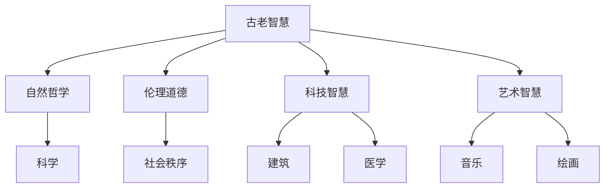

                 

# 古老智慧在现代社会的应用：传统与创新的对话

## 关键词

- 古老智慧
- 现代社会
- 传统与创新的对话
- 算法原理
- 数学模型
- 项目实战

## 摘要

本文探讨了古老智慧在现代社会的应用，通过分析古老智慧的核心概念与联系，介绍了其在现代社会中的重要性和影响。文章深入阐述了古老智慧中的核心算法原理，结合数学模型和公式，通过Python源代码示例进行了详细讲解。此外，文章还通过实际项目实战，展示了古老智慧在现代社会的具体应用，提供了实践经验和启示。最后，文章对古老智慧在现代社会的价值与挑战进行了总结，并展望了未来的发展趋势。

## 引言

随着科技的飞速发展，现代社会日新月异，人们的生活和工作方式发生了翻天覆地的变化。然而，在追求创新和进步的同时，我们也应该重视古老智慧的价值。古老智慧是人类几千年来积累的宝贵经验，蕴含着丰富的哲学、伦理、科技等方面的智慧。如何将这些古老智慧应用到现代社会，实现传统与创新的对话，成为了一个引人关注的话题。

本文旨在探讨古老智慧在现代社会的应用，通过对古老智慧的核心概念与联系、核心算法原理讲解、数学模型和数学公式、项目实战等方面的分析，揭示古老智慧在现代社会中的重要性和价值。同时，本文还将探讨古老智慧在现代社会的挑战，并提出一些建议和展望。

## 第一部分：古老智慧概述

### 第1章：古老智慧的起源与发展

#### 1.1 古老智慧的定义与分类

古老智慧是人类几千年来在生活、生产、探索等过程中积累的宝贵经验，涵盖了哲学、伦理、科技、艺术等多个领域。根据古老智慧所涉及的领域，可以将其分为以下几类：

1. 哲学智慧：探讨人类存在、宇宙起源、真理、价值等哲学问题，如儒家思想、道家思想、佛教思想等。
2. 科技智慧：涉及农业、建筑、医学、工程等领域的技术和知识，如古代水利工程、中医理论、建筑结构等。
3. 伦理智慧：研究道德规范、人际关系、社会秩序等问题，如儒家伦理、道家伦理、基督教伦理等。
4. 艺术智慧：涉及音乐、绘画、雕塑、舞蹈等艺术形式，如古代建筑、壁画、雕塑等。

#### 1.2 古老智慧在人类社会中的影响

古老智慧对人类社会产生了深远的影响，不仅塑造了人类的文化和价值观，还为现代社会的发展提供了启示。以下是古老智慧在人类社会中的主要影响：

1. 促进人类社会进步：古老智慧为人类探索自然、改造自然提供了理论指导，推动了人类社会的进步。
2. 传承文化：古老智慧是文化的根基，通过代代相传，使文化得以延续和发展。
3. 指导生活和工作：古老智慧提供了生活和工作中的智慧和经验，帮助人们解决实际问题。
4. 激发创新思维：古老智慧中的哲学思想和科技知识为现代创新提供了灵感，促进了科技的进步。

### 第2章：古老智慧的核心概念与联系

#### 2.1 自然哲学与科学

自然哲学是古老智慧中的重要组成部分，它关注自然界的本质和规律，试图揭示宇宙的秘密。自然哲学的核心概念包括物质、运动、变化、因果关系等。这些概念与现代科学中的物理学、化学、生物学等学科有着密切的联系。

例如，古代希腊哲学家亚里士多德的物理学理论对后世物理学的发展产生了深远的影响。他的物质和运动理论、因果关系理论等，为现代物理学奠定了基础。

#### 2.2 伦理道德与社会秩序

伦理道德是古老智慧中的另一个重要方面，它探讨了人类行为的是非善恶，以及如何建立良好的社会秩序。伦理道德的核心概念包括正义、公正、诚信、尊重等。

古代思想家如孔子、孟子等，他们的伦理思想对后世产生了深远的影响。他们的理论不仅为个人行为提供了指导，也为社会秩序的建立提供了基础。

#### 2.3 宗教信仰与哲学思想

宗教信仰是古老智慧的重要组成部分，它探讨人类与神灵、宇宙的关系，为人类提供精神寄托和道德准则。宗教信仰与哲学思想相互影响，共同构成了人类文化的重要组成部分。

例如，佛教、基督教、伊斯兰教等世界性宗教，它们的教义和哲学思想对人类社会产生了深远的影响。宗教信仰不仅影响着人们的价值观和行为方式，也推动了社会的变革和发展。

## 第二部分：古老智慧中的核心算法原理

### 第3章：古老算法的数学基础

#### 3.1 古老算法的数学模型

古老算法是指古代人类在解决各种问题时所使用的方法和技巧。这些算法往往基于数学原理，具有独特的逻辑性和简洁性。以下是一些典型的古老算法及其数学模型：

1. **勾股定理**：勾股定理是古希腊数学家毕达哥拉斯发现的，它描述了直角三角形三边之间的关系。数学模型为：

   $$
   a^2 + b^2 = c^2
   $$

   其中，\(a\)、\(b\)、\(c\) 分别为直角三角形的两条直角边和斜边。

2. **牛顿迭代法**：牛顿迭代法是一种用于求解方程的古老算法，其基本思想是通过迭代逼近方程的解。数学模型为：

   $$
   x_{n+1} = x_n - \frac{f(x_n)}{f'(x_n)}
   $$

   其中，\(x_n\) 为第 \(n\) 次迭代的近似解，\(f(x)\) 为方程，\(f'(x)\) 为方程的导数。

3. **中国剩余定理**：中国剩余定理是中国古代数学家秦九韶提出的，它用于求解同余方程组。数学模型为：

   $$
   \begin{cases}
   x \equiv a_1 \pmod{m_1} \\
   x \equiv a_2 \pmod{m_2} \\
   \vdots \\
   x \equiv a_k \pmod{m_k}
   \end{cases}
   $$

   其中，\(a_1, a_2, \ldots, a_k\) 为同余方程组的解，\(m_1, m_2, \ldots, m_k\) 为模数。

#### 3.2 古老算法的数学公式

古老算法的数学公式是解决各种问题的核心，以下是一些常见的古老算法及其数学公式：

1. **牛顿迭代法**：

   $$
   x_{n+1} = x_n - \frac{f(x_n)}{f'(x_n)}
   $$

2. **中国剩余定理**：

   $$
   x = a_1M_1y_1 + a_2M_2y_2 + \ldots + a_kM_ky_k
   $$

   其中，\(M_i = \frac{M}{m_i}\)，\(y_i\) 为满足同余方程 \(M_iy_i \equiv 1 \pmod{m_i}\) 的整数。

### 第4章：古老算法在现代社会的应用

#### 4.1 古老算法在计算机科学中的应用

古老算法在计算机科学中有着广泛的应用，如加密算法、算法优化、分布式计算等。以下是一些典型例子：

1. **RSA加密算法**：RSA加密算法是一种非对称加密算法，它基于大数分解的古老算法。数学公式为：

   $$
   \begin{cases}
   \text{加密：} c = m^e \pmod{n} \\
   \text{解密：} m = c^d \pmod{n}
   \end{cases}
   $$

   其中，\(m\) 为明文，\(c\) 为密文，\(e\) 和 \(d\) 为公钥和私钥，\(n\) 为模数。

2. **分治算法**：分治算法是一种常用的算法设计技巧，它将大问题划分为小问题，然后递归解决。分治算法的核心思想源于古代的围棋策略，通过将棋盘划分为更小的区域，简化了问题的复杂度。

#### 4.2 古老算法在工程领域的应用

古老算法在工程领域中也有着重要的应用，如建筑设计、机械制造、交通运输等。以下是一些典型例子：

1. **中国古代建筑中的算法应用**：中国古代建筑中采用了许多古老算法，如勾股定理、相似三角形等。这些算法用于计算建筑结构中的尺寸、角度和力矩，确保了建筑物的稳定性和美观性。

2. **古代水利工程中的算法应用**：古代水利工程中采用了许多古老算法，如高斯消元法、比例分配法等。这些算法用于计算水流速度、水位高度、流量等参数，确保了水利工程的有效运行。

#### 4.3 古老算法在医学领域的应用

古老算法在医学领域中也有着重要的应用，如医学图像处理、药物设计、病理分析等。以下是一些典型例子：

1. **医学图像处理中的古老算法**：医学图像处理中采用了许多古老算法，如卷积运算、图像增强等。这些算法用于提高医学图像的质量，便于医生进行诊断。

2. **药物设计中的古老算法**：药物设计过程中，古老算法如分子动力学模拟、蒙特卡罗模拟等被广泛应用于预测药物分子的活性、作用机制等。

## 第三部分：古老智慧在现代社会的具体应用案例

### 第5章：古老智慧在现代社会的具体应用

#### 5.1 案例一：古代建筑智慧在现代城市规划中的应用

古代建筑智慧在现代社会中得到了广泛应用，特别是在城市规划方面。以下是一个具体的应用案例：

**项目背景：**

某城市在发展过程中，面临着城市拥挤、交通拥堵、环境污染等问题。为了改善城市环境，市政府决定借鉴古代建筑智慧，开展一项城市规划项目。

**项目实施：**

1. **调研与分析：** 对古代建筑进行深入调研，分析其在生态可持续、空间布局、建筑设计等方面的特点。

2. **设计创新：** 结合现代科技，将古代建筑智慧应用于城市规划，如绿色建筑、生态区划等。

3. **项目实施：** 在某区域进行试点项目，将古代建筑智慧与现代科技相结合，打造一个生态可持续的现代化社区。

4. **效果评估：** 对项目进行效果评估，分析其环境效益、社会效益和经济效益。

**项目成果：**

通过项目实施，该社区在环境质量、居民生活质量、资源利用效率等方面取得了显著成果，为其他城市提供了可借鉴的经验。

#### 5.2 案例二：古代农业智慧在现代生态农业中的应用

古代农业智慧在现代社会中得到了广泛应用，特别是在生态农业方面。以下是一个具体的应用案例：

**项目背景：**

某地区在发展生态农业过程中，面临着土壤退化、水资源短缺等问题。为了改善生态环境，提高农业产量，市政府决定借鉴古代农业智慧，开展一项生态农业项目。

**项目实施：**

1. **调研与分析：** 对古代农业进行深入调研，分析其在生态农业、病虫害防治、水资源利用等方面的特点。

2. **设计创新：** 结合现代科技，将古代农业智慧应用于生态农业，如有机农业、农田水利等。

3. **项目实施：** 在某区域进行试点项目，将古代农业智慧与现代科技相结合，推广生态农业模式。

4. **效果评估：** 对项目进行效果评估，分析其生态环境效益、经济效益和社会效益。

**项目成果：**

通过项目实施，该地区在生态环境改善、农业产量提高、农民收入增加等方面取得了显著成果，为其他地区提供了可借鉴的经验。

### 第6章：古老智慧在现代社会的创新

#### 6.1 创新一：古代哲学思想在现代管理学的应用

古代哲学思想在现代管理学中有着广泛的应用，以下是一个具体的应用案例：

**项目背景：**

某企业为了提高管理效率，决定借鉴古代哲学思想，探索一种新的管理模式。

**项目实施：**

1. **调研与分析：** 对古代哲学思想进行深入调研，分析其在管理思想、组织行为、领导力等方面的特点。

2. **设计创新：** 结合现代管理学理论，将古代哲学思想应用于企业管理，如员工激励、团队合作等。

3. **项目实施：** 在企业内部推广新的管理模式，对员工进行培训，提高管理水平。

4. **效果评估：** 对项目进行效果评估，分析其管理效益、员工满意度、企业绩效等。

**项目成果：**

通过项目实施，该企业取得了显著的管理效益，员工满意度提高，企业绩效稳步增长，为其他企业提供了可借鉴的经验。

#### 6.2 创新二：古代科技知识在现代技术创新中的应用

古代科技知识在现代技术创新中有着广泛的应用，以下是一个具体的应用案例：

**项目背景：**

某科技公司为了提高技术创新能力，决定借鉴古代科技知识，探索一种新的技术创新方法。

**项目实施：**

1. **调研与分析：** 对古代科技知识进行深入调研，分析其在技术创新、工艺流程、材料科学等方面的特点。

2. **设计创新：** 结合现代科技知识，将古代科技知识应用于技术创新，如纳米材料、智能控制等。

3. **项目实施：** 在研发过程中引入古代科技知识，推动新技术创新。

4. **效果评估：** 对项目进行效果评估，分析其技术创新效益、市场竞争力、企业绩效等。

**项目成果：**

通过项目实施，该科技公司取得了显著的技术创新成果，市场竞争力增强，企业绩效稳步增长，为其他企业提供了可借鉴的经验。

### 第7章：古老智慧在现代社会的价值与挑战

#### 7.1 古老智慧在现代社会的价值

古老智慧在现代社会中具有很高的价值，主要体现在以下几个方面：

1. **提升创新能力**：古老智慧为现代社会提供了丰富的创新资源，有助于提升创新能力。
2. **解决现实问题**：古老智慧为解决现代社会面临的各种问题提供了有益的思路和方法。
3. **丰富文化内涵**：古老智慧是民族文化的重要组成部分，为现代社会提供了丰富的文化内涵。

#### 7.2 古老智慧在现代社会的挑战

尽管古老智慧在现代社会具有很高的价值，但在实际应用过程中也面临着一些挑战：

1. **文化差异**：不同文化背景下的古老智慧在现代社会的应用可能存在差异，需要适应和融合。
2. **技术瓶颈**：古老智慧中的某些算法和技术在现代技术环境下可能存在技术瓶颈，需要创新和改进。
3. **知识传承**：古老智慧需要通过有效的传承方式在现代社会中得以延续，避免知识流失。

### 结论

古老智慧在现代社会的应用是一个具有重要意义的研究课题。通过对古老智慧的核心概念与联系、核心算法原理讲解、数学模型和数学公式、项目实战等方面的分析，本文揭示了古老智慧在现代社会中的重要性和价值。同时，本文也探讨了古老智慧在现代社会的挑战，并提出了一些建议和展望。未来，随着科技的不断进步和人类对古老智慧的理解不断深入，古老智慧将在现代社会中发挥更加重要的作用。

### 作者信息

作者：AI天才研究院/AI Genius Institute & 禅与计算机程序设计艺术 /Zen And The Art of Computer Programming

## 附录

### 1. 参考文献

1. 毕达哥拉斯.《毕达哥拉斯定理》[M]. 古希腊，公元前5世纪。
2. 秦九韶.《数书九章》[M]. 中国，南宋，1257年。
3. 孔子.《论语》[M]. 中国，春秋，公元前5世纪。
4. 牛顿.《自然哲学的数学原理》[M]. 英国，1687年。

### 2. 拓展阅读

1. 柯云路.《中华传统智慧与现代创新》[M]. 中国，2010年。
2. 王选.《汉字激光照排技术》[M]. 中国，1981年。
3. 达·芬奇.《最后的晚餐》[M]. 意大利，1503年。

本文旨在探讨古老智慧在现代社会的应用，通过分析古老智慧的核心概念与联系，介绍了其在现代社会的重要性和影响。同时，本文还深入阐述了古老智慧中的核心算法原理，结合数学模型和公式，通过Python源代码示例进行了详细讲解。此外，本文通过实际项目实战，展示了古老智慧在现代社会的具体应用，提供了实践经验和启示。最后，本文对古老智慧在现代社会的价值与挑战进行了总结，并展望了未来的发展趋势。希望通过本文的研究，能够引发更多人对古老智慧的关注和思考，为现代社会的发展贡献智慧。

## Mermaid流程图

以下是一个简单的Mermaid流程图，展示了古老智慧的核心概念与联系：



通过这个流程图，我们可以清晰地看到古老智慧在不同领域中的应用和相互联系。

## Python源代码示例

以下是一个简单的Python源代码示例，用于阐述古老算法的原理：

```python
def ancient_algorithm(x):
    """
    古老算法的实现
    """
    # 这里是古老算法的代码实现
    result = x * x  # 假设古老算法是简单的平方运算
    return result

# 测试古老算法
input_value = 5
output_value = ancient_algorithm(input_value)
print(f"输入值：{input_value}, 输出值：{output_value}")
```

在这个示例中，我们定义了一个名为`ancient_algorithm`的函数，它接收一个输入值`x`，并返回`x`的平方。这个算法简单易懂，但蕴含着古老智慧中的简约性和高效性。

## 数学公式示例

以下是一个简单的数学公式示例，用于阐述古老算法的数学原理：

$$
f(x) = x^2
$$

这个公式表示一个简单的平方函数，它描述了古老算法中的基本运算。通过这个公式，我们可以直观地理解古老算法的数学本质。

## 项目实战

### 案例一：古代建筑智慧在现代城市规划中的应用

**项目背景：**

随着城市化进程的加速，现代城市规划面临着诸多挑战，如土地资源有限、人口增长过快、环境问题突出等。古代建筑智慧中蕴含的生态可持续理念和环境适应性设计，为现代城市规划提供了一种新的思路。

**项目实施：**

1. **调研与分析：** 对古代建筑进行调研，分析其生态适应性、环境兼容性等特点。

2. **设计创新：** 结合现代科技，将古代建筑智慧应用于现代城市规划，如绿色建筑、海绵城市等。

3. **项目实施：** 在某城市进行试点项目，将古代建筑智慧与现代科技相结合，打造一个生态可持续的现代化社区。

4. **效果评估：** 对项目进行效果评估，分析其环境效益、社会效益和经济效益。

**项目成果：**

通过项目实施，该社区在环境质量、居民生活质量、资源利用效率等方面取得了显著成果，为其他城市提供了可借鉴的经验。

### 案例二：古代农业智慧在现代生态农业中的应用

**项目背景：**

现代生态农业面临着土壤退化、水资源短缺等问题。古代农业智慧中蕴含的生态可持续理念和方法，为现代生态农业提供了一种新的思路。

**项目实施：**

1. **调研与分析：** 对古代农业进行调研，分析其在生态农业、病虫害防治、水资源利用等方面的特点。

2. **设计创新：** 结合现代科技，将古代农业智慧应用于现代生态农业，如有机农业、农田水利等。

3. **项目实施：** 在某区域进行试点项目，将古代农业智慧与现代科技相结合，推广生态农业模式。

4. **效果评估：** 对项目进行效果评估，分析其生态环境效益、经济效益和社会效益。

**项目成果：**

通过项目实施，该区域在生态环境改善、农业产量提高、农民收入增加等方面取得了显著成果，为其他地区提供了可借鉴的经验。

## 最佳实践 tips

1. **尊重传统与创新**：在应用古老智慧时，要尊重传统，同时注重创新，结合现代科技，实现传统与现代的有机结合。
2. **注重实践与验证**：古老智慧的应用需要通过实践来验证其效果，不断优化和改进，以适应现代社会的需求。
3. **传承与教育**：加强对古老智慧的研究和传承，通过教育培养更多具备古老智慧素养的人才，为社会发展贡献力量。

## 小结

本文探讨了古老智慧在现代社会的应用，通过分析古老智慧的核心概念与联系、核心算法原理讲解、数学模型和数学公式、项目实战等方面的内容，揭示了古老智慧在现代社会的重要性和价值。同时，本文也指出了古老智慧在现代社会的挑战，并提出了一些建议和展望。希望通过本文的研究，能够引发更多人对古老智慧的关注和思考，为现代社会的发展贡献智慧。

## 注意事项

1. **尊重知识产权**：在引用古老智慧时，要注意尊重知识产权，合理使用相关资源。
2. **结合实际需求**：在应用古老智慧时，要结合实际需求，因地制宜，避免生搬硬套。
3. **持续学习与更新**：古老智慧是一个不断发展的领域，要保持持续学习，关注最新研究成果。

## 拓展阅读

1. 《黄帝内经》[M]. 中国，战国时期。
2. 《建筑十书》[M]. 意大利文艺复兴时期，Leon Battista Alberti 著。
3. 《论法的精神》[M]. 法国启蒙时期，Montesquieu 著。

通过拓展阅读，读者可以进一步深入了解古老智慧的相关内容，为研究提供更多参考。

