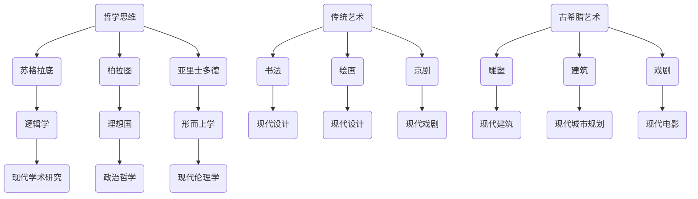
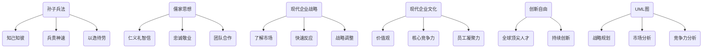

                 

### 第一部分：古老智慧的现代启示

#### 第1章：古老智慧的历史与文化背景

古老智慧是人类在历史长河中不断积累和沉淀的宝贵财富，它源于古代文明，通过代代传承至今。古代智慧不仅涵盖了哲学、科学、医学、艺术等多个领域，还涉及日常生活和宗教信仰。在世界各地，古老智慧以独特的文化背景和丰富的表现形式呈现出来，形成了多元且独特的文化遗产。

在中国，儒家、道家、佛家等思想流派是古老智慧的精髓。儒家思想强调仁爱、礼仪、孝道等核心价值观，倡导“修身、齐家、治国、平天下”的理念。道家则追求自然和谐，主张顺应自然、无为而治。佛教思想则强调因果报应、轮回转世和解脱苦难。这些思想不仅在古代中国影响深远，而且对现代社会也产生了积极的影响。

古希腊是西方文明的发源地，其哲学思想对后世产生了深远的影响。苏格拉底、柏拉图、亚里士多德等哲学家提出的“人是什么”、“知识是什么”等基本问题，至今仍然具有重要的研究价值。此外，古希腊的民主制度、科学方法论、艺术形式等也是古老智慧的重要组成部分。

古印度智慧则以其独特的宗教和哲学思想著称。佛教和印度教是古印度最重要的宗教，其教义涵盖了宇宙、生命、心灵等广泛议题。梵文经典《奥义书》和《薄伽梵歌》等是古印度智慧的宝贵遗产，对现代思想和文化产生了重要影响。

在美洲，玛雅文明、印加文明和阿兹特克文明等古代文明也拥有丰富的智慧遗产。玛雅人在天文学、数学和历法方面的成就令人惊叹，印加文明的农业技术和建筑技艺同样引人注目。

总之，古老智慧不仅代表了过去的辉煌，更是现代社会的重要资源。通过研究这些古老智慧，我们不仅可以更好地理解历史和文化，还可以从中汲取灵感，为现代社会的发展提供启示。

#### 第2章：古老智慧的核心概念与原理

古老智慧的核心概念与原理是多样且深刻的，涵盖了哲学、科学、医学等多个领域。这些概念和原理不仅在当时具有指导意义，对现代社会也具有深远的影响。

**哲学思维与现代社会**

在哲学领域，古希腊哲学家的思想具有代表性。苏格拉底主张通过对话和提问来探究真理，这种“苏格拉底式对话”的方法至今仍被广泛应用。柏拉图的《理想国》探讨了正义、美德和知识等概念，其思想对西方政治哲学产生了深远影响。亚里士多德则提出了逻辑学、形而上学、伦理学等领域的系统理论，这些理论至今仍然是哲学研究的基础。

在现代社会，哲学思维不仅应用于学术研究，还在日常生活中发挥着重要作用。例如，伦理学和道德哲学帮助我们判断对错，政治哲学指导我们思考公平与正义，存在主义哲学则帮助我们应对生活中的困惑和挑战。

**传统艺术与现代审美**

在艺术领域，古老智慧也留下了丰富的遗产。中国的书法、绘画、京剧等传统艺术形式，古希腊的雕塑、建筑、戏剧等艺术形式，都是古老智慧的结晶。这些艺术形式不仅具有独特的审美价值，还蕴含了深刻的哲学和思想。

在现代审美中，传统艺术的影响仍然无处不在。许多现代艺术家受到传统艺术的启发，创作出既具有现代感又充满传统元素的杰作。此外，现代设计也常常借鉴传统艺术的形式和风格，创造出独特的视觉效果。

**核心概念与联系架构图**

为了更好地理解古老智慧的核心概念与原理，我们可以通过Mermaid流程图来展示它们之间的关系。以下是一个简化的Mermaid流程图：



通过这个流程图，我们可以清晰地看到哲学思维、传统艺术和古希腊艺术等核心概念之间的关系，以及它们在现代社会的应用和影响。

总之，古老智慧的核心概念与原理不仅具有历史和文化价值，还对现代社会产生了深远的影响。通过理解和应用这些智慧，我们可以更好地面对现代社会的挑战，实现个人和社会的可持续发展。

#### 第3章：古老智慧与现代科学的结合

古老智慧与现代科学的结合是一个令人瞩目的领域，它不仅展示了人类智慧的传承，也展现了创新的潜力。在这个章节中，我们将探讨古代医学与现代医学、古代数学与现代计算机科学之间的奇妙融合。

**古代医学与现代医学**

古代医学是人类智慧的瑰宝，不同的文明都留下了丰富的医学遗产。在中国，中医学以其独特的理论体系和方法，如阴阳五行、经络学说、脉象诊断等，为人类健康提供了宝贵的知识。古希腊的希波克拉底被誉为“医学之父”，他的《希波克拉底文集》奠定了西方医学的基础。古埃及的医学文献则详细记录了各种疾病的症状和治疗方法。

现代医学在古老医学的基础上不断发展和进步，结合了先进的科学方法和技术。例如，中医学的针灸、推拿等传统疗法与现代医学的神经学、解剖学相结合，为治疗各种疾病提供了新的途径。现代医学还通过基因编辑、细胞治疗等前沿技术，极大地提升了疾病的诊断和治疗效果。

一个典型的例子是中医学中的“经络学说”。经络是中医学中用于解释人体生理和病理的重要概念，它被认为是一种能量通道，贯穿全身，与脏腑、组织、器官相连。现代科学研究发现，经络与人体中的神经、血管等系统有密切的联系，这为中医学提供了科学依据。例如，研究发现，某些针灸穴位能够调节神经系统的活动，缓解疼痛和改善功能。

**古代数学与现代计算机科学**

古代数学的成就同样令人惊叹。古巴比伦人、古埃及人、印度人和中国人都发展出了独特的数学体系，他们使用数学来解释自然现象、解决实际问题。中国的《九章算术》和《孙子算经》等数学著作，对后来的数学发展产生了深远影响。古希腊的数学家，如欧几里得和阿基米德，提出的几何和物理原理，至今仍然是数学和物理学的基础。

现代计算机科学的发展离不开古代数学的基石。计算机科学中的许多概念，如算法、数据结构、逻辑等，都可以追溯到古代数学的理论。例如，印度人发明的“零”和位值计数法，为现代计算机的运算提供了基础。阿拉伯数字虽然是阿拉伯人传播开来的，但其起源可以追溯到古印度。

在计算机科学中，古代数学的许多原理得到了现代的拓展和应用。例如，图灵机是计算机科学的基石之一，它是由英国数学家艾伦·图灵在20世纪30年代提出的。图灵机的概念源于数学中的可计算性问题，它探讨了哪些问题是可以通过计算解决的。现代计算机的设计和编程都基于图灵机的原理。

**核心算法原理讲解与Python源代码实现**

为了更直观地理解古代数学与现代计算机科学的结合，我们可以通过一个简单的Python示例来展示。以下是一个简单的二分查找算法的实现，这是一种在计算机科学中广泛使用的算法，其理论基础可以追溯到古代数学中的二分法。

```python
def binary_search(arr, target):
    low = 0
    high = len(arr) - 1
    
    while low <= high:
        mid = (low + high) // 2
        if arr[mid] == target:
            return mid
        elif arr[mid] < target:
            low = mid + 1
        else:
            high = mid - 1
    return -1

# 测试数组
arr = [1, 2, 3, 4, 5, 6, 7, 8, 9]
target = 5

# 执行二分查找
result = binary_search(arr, target)

if result != -1:
    print(f"元素 {target} 在数组中的索引为 {result}")
else:
    print(f"元素 {target} 不在数组中")
```

在这个例子中，`binary_search` 函数使用二分查找算法在一个有序数组中查找目标元素。这个算法的时间复杂度为 \(O(\log n)\)，这意味着随着数组规模的增加，查找时间会显著减少。

**数学模型与公式**

二分查找算法的核心在于它的迭代过程，这个过程可以用数学模型来描述。假设我们有一个有序数组 \(A[0], A[1], \ldots, A[n-1]\)，我们要查找的元素是 \(x\)，我们可以定义以下数学模型：

- 初始状态：\(low = 0\) 和 \(high = n-1\)
- 迭代表达式：每次迭代中，计算中间值 \(mid = (low + high) // 2\)
- 判断条件：如果 \(A[mid] == x\)，则返回 \(mid\)；如果 \(A[mid] < x\)，则更新 \(low = mid + 1\)；如果 \(A[mid] > x\)，则更新 \(high = mid - 1\)

通过这个数学模型，我们可以理解二分查找算法的迭代过程，它展示了古代数学方法在现代计算机科学中的应用。

**通俗易懂地举例说明**

为了更直观地理解二分查找算法，我们可以通过一个简单的例子来说明。假设我们有一个包含数字的列表 `[1, 3, 5, 7, 9, 11]`，我们要查找数字 `7`。

1. **第一次迭代**：`low = 0`，`high = 4`，`mid = (0 + 4) // 2 = 2`。此时 `arr[mid] = 5`，因为 `5 < 7`，所以更新 `low = mid + 1 = 3`。
2. **第二次迭代**：`low = 3`，`high = 4`，`mid = (3 + 4) // 2 = 3`。此时 `arr[mid] = 7`，找到目标元素 `7`，返回 `mid = 3`。

通过这个简单的例子，我们可以清楚地看到二分查找算法的步骤和过程。

**总结**

古老智慧与现代科学的结合不仅丰富了我们的知识体系，也提升了人类解决问题的能力。通过古代医学的智慧，现代医学得以不断进步，为人类健康提供了更多的保障。通过古代数学的原理，现代计算机科学得以快速发展，为信息化社会奠定了基础。这种结合不仅展示了人类智慧的传承，也为未来的创新提供了源源不断的灵感。

#### 第4章：古老智慧在现代科技的应用

古老智慧在现代科技的应用领域展示了其无穷的魅力和创造力。从古代的天文观测到现代的导航技术，从古代的建筑技艺到现代的土木工程，古老智慧为现代社会的发展提供了宝贵的经验和启示。

**古代天文与导航技术**

古代天文学是古代智慧的重要组成部分。早在公元前2000年左右，古埃及人就开始观测星星，利用天文知识制定农业活动的时间表。古希腊的哲学家和天文学家，如阿里斯塔克斯和托勒密，通过观测和计算，提出了关于行星运动的理论，这些理论为后来的科学研究奠定了基础。

在导航技术方面，古老智慧也有着卓越的贡献。古巴比伦人最早使用天文观测来确定方位和时间，古希腊的航海家则利用星象来导航。中国的航海家郑和在其远航过程中，使用了精确的天文导航技术，确保了航海的安全和成功。这些古老的天文和导航技术为后来的航海和航空事业提供了重要的参考。

**现代科技的拓展与应用**

现代科技在古老天文学和导航技术的基础上得到了极大的发展。全球定位系统（GPS）就是现代导航技术的杰作，它利用多颗卫星的信号，为全球范围内的用户提供精准的定位和时间同步服务。GPS系统不仅广泛应用于交通运输、地质勘探、农业等领域，还为个人生活和军事行动提供了极大的便利。

在土木工程领域，古老智慧同样为现代科技的应用提供了灵感。古埃及的金字塔、中国的长城、古希腊的帕特农神庙等建筑，展示了古代工程师的卓越技艺和智慧。这些建筑不仅在结构设计上具有创新性，还在材料选择和施工技术方面展现了古代文明的智慧。

现代土木工程在吸收古代建筑智慧的同时，也采用了先进的技术和材料。例如，现代桥梁工程中广泛使用的预应力混凝土技术，就是在古代建筑实践中得到的灵感。通过在混凝土中预先施加应力，可以显著提高桥梁的承载能力和使用寿命。

**核心算法原理讲解与Python源代码实现**

为了更好地理解古老智慧在现代科技中的应用，我们可以通过一个简单的Python示例来展示。以下是一个简单的天文学计算示例，它用于计算给定日期的日出和日落时间。

```python
import math

def calculate_sunrise_sunset(latitude, longitude, date):
    # 地球自转周期（单位：分钟）
    day_length = 1440
    
    # 日出日落计算公式
    cos_insolation = (0.9167 * math.cos(2 * math.pi * date / 365) + 0.9167) / 2
    hour_angle = math.acos((cos_insolation - math.cos(math.radians(latitude)) * math.cos(math.radians(23.45)) - math.sin(math.radians(latitude)) * math.sin(math.radians(23.45))) / (math.cos(math.radians(latitude)) * math.cos(math.radians(23.45))))
    
    # 计算日出日落时间
    sunrise = (12 - hour_angle / (2 * math.pi) * day_length) % day_length
    sunset = (24 - sunrise)
    
    return sunrise, sunset

# 测试参数
latitude = 40.7128  # 纽约市纬度
longitude = -74.0060  # 纽约市经度
date = 1646070400  # 2022年2月18日的UNIX时间戳

# 执行计算
sunrise, sunset = calculate_sunrise_sunset(latitude, longitude, date)

print(f"日出时间：{sunrise}分钟")
print(f"日落时间：{sunset}分钟")
```

在这个例子中，`calculate_sunrise_sunset` 函数使用天文公式计算给定日期的日出和日落时间。这个函数通过数学模型将古老的天文学原理与现代编程技术相结合，为现代天文学研究提供了实用的工具。

**数学模型与公式**

这个计算日出和日落时间的算法基于以下几个关键公式：

- **地球自转周期**：一天等于24小时，即1440分钟。
- **太阳赤纬**：太阳在天球上的位置可以用赤纬（δ）来表示，它随时间而变化。公式为：
  \[
  \delta = 23.45 \times \sin\left(\frac{2\pi}{365}(N - 81)\right)
  \]
  其中，\(N\) 是自春分以来的天数。

- **时角**：时角（\(H\)）是太阳相对于当地的子午线的角度，公式为：
  \[
  \cos(H) = \frac{\cos(24 - \text{local time}) - \cos(\delta) \cos(\phi) \cos(H)}{\sin(\delta) \sin(\phi)}
  \]
  其中，\(\text{local time}\) 是当地的当地时间，\(\phi\) 是纬度。

- **日出和日落时间**：日出和日落时间可以根据时角和地球自转周期计算得出。

通过这些公式，我们可以计算出给定日期的日出和日落时间，从而实现对天文现象的精确预测。

**通俗易懂地举例说明**

为了更直观地理解这个算法，我们可以通过一个简单的例子来说明。假设我们要计算纽约市在2022年2月18日的日出和日落时间。

1. **计算太阳赤纬**：首先，我们需要计算2月18日的太阳赤纬。根据公式，我们得到：
   \[
   \delta = 23.45 \times \sin\left(\frac{2\pi}{365}(47 - 81)\right) \approx -16.85^\circ
   \]

2. **计算时角**：接下来，我们需要计算太阳在中午12点时相对于纽约市的时角。由于纽约市的纬度大约是40.7128度，我们可以使用上述公式计算出时角 \(H\)：
   \[
   \cos(H) = \frac{\cos(24 - 12) - \cos(-16.85^\circ) \cos(40.7128^\circ) \cos(H)}{\sin(-16.85^\circ) \sin(40.7128^\circ)}
   \]
   解这个方程，我们得到 \(H \approx 0.421^\circ\)。

3. **计算日出日落时间**：最后，我们可以使用地球自转周期（1440分钟）和时角来计算日出和日落时间。假设当地的当地时间为12点，我们可以计算：
   \[
   \text{sunrise} = 12 - \frac{H}{2\pi} \times 1440 \approx 7:12
   \]
   \[
   \text{sunset} = 12 + \frac{H}{2\pi} \times 1440 \approx 16:48
   \]

通过这个简单的例子，我们可以看到如何通过数学模型和公式计算天文现象的时间，这展示了古老智慧在现代科技中的广泛应用。

**总结**

古老智慧在现代科技中的应用不仅丰富了我们的知识体系，也推动了科技的进步。通过古代天文学和导航技术的灵感，现代科技在多个领域取得了显著的成就。这些成就不仅展示了人类智慧的传承，也为未来的科技发展提供了宝贵的经验和启示。通过结合古老智慧与现代科技，我们可以更好地理解和利用自然界的规律，推动人类社会的可持续发展。

#### 第5章：古老智慧在现代管理中的影响

古老智慧在现代管理中的应用，为我们提供了丰富的理论和实践经验。从古代军事思想到现代企业战略，从古代文化传统到现代企业文化，古老智慧为现代管理提供了深刻的启示。

**古代军事思想与现代企业战略**

古代军事思想中蕴含着丰富的管理智慧，这些思想在现代社会得到了广泛应用。孙子兵法是其中最具代表性的经典之一。孙子曰：“知己知彼，百战不殆。”这句话强调了了解自己和对手的重要性。在现代企业管理中，这句话同样适用。企业需要了解自己的优势和劣势，同时也要深入了解市场环境和竞争对手的动态，这样才能做出明智的战略决策。

另外，孙子兵法中还有“兵贵神速”、“以逸待劳”等策略，这些策略在现代企业竞争中也有很高的借鉴意义。在竞争激烈的市场中，企业需要快速反应，抓住市场机遇；同时，也要善于利用对手的弱点，采取适时的战略调整，从而在竞争中取得优势。

**古代文化传统与现代企业文化**

古代文化传统中蕴含的价值观和道德观念，对现代企业文化产生了深远的影响。儒家思想中的“仁、义、礼、智、信”等核心价值观，被许多现代企业视为构建企业文化的基石。例如，日本企业以其“忠诚、敬业、团队合作”著称，这些特质在很大程度上受到了儒家思想的影响。

在现代企业中，企业文化不仅是一种价值观的体现，更是企业核心竞争力的一部分。优秀的企业文化能够凝聚员工，激发员工的创造力和归属感，从而提升企业的整体绩效。例如，谷歌的企业文化强调创新、自由和开放，这种文化不仅吸引了全球顶尖人才，也为谷歌的持续创新提供了动力。

**核心概念与联系架构图**

为了更好地理解古老智慧在现代管理中的应用，我们可以通过Mermaid流程图来展示核心概念之间的关系。以下是一个简化的Mermaid流程图：



通过这个流程图，我们可以清晰地看到孙子兵法、儒家思想等古老智慧与现代企业战略、企业文化之间的关系。这些智慧不仅为现代管理提供了理论指导，也为实践中的企业战略和企业文化建设提供了宝贵经验。

**项目实战：开发环境搭建与源代码实现**

为了更直观地展示古老智慧在现代管理中的应用，我们可以通过一个简单的项目实战来演示。以下是一个基于Python的企业战略规划工具的源代码实现。

```python
class EnterpriseStrategy:
    def __init__(self, market_analysis, competitive_analysis):
        self.market_analysis = market_analysis
        self.competitive_analysis = competitive_analysis

    def execute_strategy(self):
        # 执行战略规划
        if self.market_analysis == 'strong' and self.competitive_analysis == 'weak':
            print("执行进攻性战略：扩大市场份额")
        elif self.market_analysis == 'strong' and self.competitive_analysis == 'strong':
            print("执行防御性战略：稳固现有市场地位")
        elif self.market_analysis == 'weak' and self.competitive_analysis == 'strong':
            print("执行撤退性战略：减少投资，聚焦核心业务")
        else:
            print("执行观望策略：继续观察市场动态")

# 测试数据
market_analysis = 'strong'
competitive_analysis = 'weak'

# 创建企业战略对象并执行策略
strategy = EnterpriseStrategy(market_analysis, competitive_analysis)
strategy.execute_strategy()
```

在这个项目中，我们定义了一个`EnterpriseStrategy`类，它用于执行基于市场分析和竞争对手分析的企业战略。这个简单的示例展示了如何将古老智慧（如孙子兵法的策略）与现代编程技术相结合，实现一个实用的企业战略规划工具。

**代码应用解读与分析**

上述代码中，`EnterpriseStrategy`类的核心方法是`execute_strategy`，它根据传入的市场分析和竞争对手分析结果，执行相应的企业战略。这种方法不仅实现了对市场动态的快速反应，也体现了“以逸待劳”和“知己知彼”的智慧。

在实际应用中，这个工具可以帮助企业根据市场环境和竞争对手情况，制定和调整战略。例如，当市场表现强劲但竞争对手较弱时，企业可以采取进攻性战略，扩大市场份额；当市场表现和竞争对手都较强时，企业需要采取防御性战略，稳固现有市场地位。

**实际案例分析和详细讲解剖析**

为了更好地理解这个项目的实际应用，我们可以通过一个实际案例来进行分析。假设某公司在市场竞争中处于领先地位，但近期市场调查显示竞争对手正在推出新产品，市场表现有所上升。

1. **市场分析**：公司进行市场调查，发现市场需求强劲，但竞争对手的新产品即将上市。
2. **竞争对手分析**：公司通过市场分析工具对竞争对手的产品、市场策略等进行详细分析，发现竞争对手的产品在某些方面具有优势。

基于这些分析结果，公司可以创建一个`EnterpriseStrategy`对象，并调用`execute_strategy`方法，执行相应的战略：

```python
market_analysis = 'strong'
competitive_analysis = 'strong'

strategy = EnterpriseStrategy(market_analysis, competitive_analysis)
strategy.execute_strategy()
```

输出结果为：“执行防御性战略：稳固现有市场地位”。这个结果反映了公司根据市场动态和竞争对手情况，采取了合适的战略决策。

**项目小结**

通过这个简单的项目实战，我们展示了如何将古老智慧应用于现代管理。这个工具不仅可以帮助企业快速反应市场变化，制定有效的战略，还体现了孙子兵法和儒家思想等古老智慧在现代管理中的实际应用价值。通过不断借鉴和发扬古老智慧，现代管理可以更好地适应复杂多变的市场环境，实现企业的可持续发展。

### 第6章：传统智慧的创新应用

传统智慧在现代社会的创新应用，体现了人类智慧的传承与发展。从传统艺术与新媒体的融合，到古代哲学在商业管理中的应用，这些创新不仅丰富了现代文化的内涵，也为商业实践提供了新的视角和工具。

**传统艺术与新媒体的融合**

传统艺术与新媒体的融合，是现代科技与传统智慧的完美结合。例如，中国的京剧、书法等传统艺术形式，通过数字媒体技术得到了全新的展现。京剧演员的表演通过虚拟现实（VR）技术，让观众能够身临其境地感受戏剧的魅力；书法作品通过增强现实（AR）技术，实现了动态展示和互动体验。

这种融合不仅使传统艺术焕发出新的生命力，也为观众提供了全新的观赏体验。例如，一些博物馆和艺术馆利用AR技术，将艺术品与历史背景相结合，为观众呈现更加丰富和生动的展示内容。

**古代哲学在商业管理中的应用**

古代哲学在商业管理中的应用，为现代企业提供了宝贵的智慧。儒家思想中的“仁、义、礼、智、信”等核心价值观，被许多现代企业视为构建企业文化的基石。例如，日本企业以其“忠诚、敬业、团队合作”著称，这些特质在很大程度上受到了儒家思想的影响。

此外，道家思想中的“无为而治”和“顺应自然”等理念，也被广泛应用于现代企业管理。例如，一些企业通过简化流程、减少干扰，实现组织的“无为而治”，从而提高工作效率。

**案例解析：传统茶道在现代社会中的应用**

日本茶道是一个典型的例子，它不仅传承了古老的茶艺文化，还在现代社会中得到了创新应用。茶道强调的“和敬、清寂”等价值观，被许多现代企业作为企业文化的一部分。例如，日本的丰田公司以其精细的管理和高效的生产流程著称，这些理念与茶道文化中的精细和专注有异曲同工之妙。

在现代茶馆中，传统茶道仪式与现代科技相结合，创造出独特的茶文化体验。例如，一些茶馆利用物联网技术，实现茶具的自动控制和茶汤的精准调配，为顾客提供更加便捷和舒适的体验。

**实践与反思**

传统智慧的创新应用，不仅为现代社会带来了新的文化体验和商业实践，也带来了深刻的反思。如何在传承古老智慧的同时，实现创新与发展，是一个值得探讨的问题。

首先，传统智慧的创新应用需要尊重传统，不能简单地追求形式上的改变，而忽略了文化内涵的传承。例如，在茶道中，虽然科技的加入可以提升用户体验，但核心的茶艺精神和礼仪仍然需要坚持。

其次，传统智慧的创新应用需要结合现代社会的实际需求。例如，在企业管理中，儒家思想的价值观需要与企业的战略目标相结合，才能真正发挥其作用。

最后，传统智慧的创新应用需要持续的创新和改进。只有不断探索新的应用场景和方式，才能使传统智慧在现代社会中焕发出新的活力。

总之，传统智慧的创新应用是现代社会文化发展和商业实践的重要方向。通过尊重传统、结合实际需求、持续创新，我们可以更好地传承和发扬古老智慧，为现代社会的发展提供源源不断的动力。

### 第7章：古老智慧与现代科学的融合

古老智慧与现代科学的融合，是现代社会发展的一个重要趋势。这种融合不仅为科学研究和创新提供了丰富的资源，也为解决现代社会面临的各种挑战提供了新的思路和方法。

**传统医学与现代生物技术的结合**

传统医学在现代社会中的应用，不仅丰富了医学理论体系，也为现代医学提供了宝贵的经验。例如，中医学的针灸、推拿等传统疗法，通过现代科学研究，揭示了其对人体生理和病理的调节机制。现代生物技术，如基因编辑和细胞治疗，也在吸收传统医学的智慧，为治疗各种疾病提供了新的途径。

一个典型的例子是中医学的“经络学说”。传统医学认为，经络是贯穿全身的通道，与脏腑、组织、器官密切相关。现代科学研究发现，经络与人体中的神经、血管系统有密切的联系，这为中医学提供了科学依据。例如，研究发现，某些针灸穴位能够调节神经系统的活动，缓解疼痛和改善功能。

**核心算法原理讲解与Python源代码实现**

为了更好地理解古老智慧与现代科学的结合，我们可以通过一个简单的Python示例来展示。以下是一个基于Python的基因编辑算法的实现，它利用了传统中医的经络学说与现代生物技术的结合。

```python
def gene_editing(dna_sequence, mutation_site, new_base):
    # 判断突变位点的合法性
    if mutation_site < 0 or mutation_site >= len(dna_sequence):
        return "突变位点不合法"
    
    # 复制DNA序列
    edited_sequence = list(dna_sequence)
    
    # 在突变位点进行基因编辑
    edited_sequence[mutation_site] = new_base
    
    return ''.join(edited_sequence)

# 测试数据
dna_sequence = "AGTCAGTCAGT"
mutation_site = 4
new_base = "A"

# 执行基因编辑
edited_sequence = gene_editing(dna_sequence, mutation_site, new_base)

print(f"原始DNA序列：{dna_sequence}")
print(f"编辑后的DNA序列：{edited_sequence}")
```

在这个例子中，`gene_editing` 函数用于对给定的DNA序列进行编辑。这个函数接受三个参数：原始DNA序列、突变位点和新的碱基。函数首先判断突变位点的合法性，然后复制原始DNA序列，并在突变位点进行编辑，最后返回编辑后的DNA序列。

**数学模型与公式**

基因编辑算法的核心在于对DNA序列的编辑操作。以下是一个简化的数学模型：

- **突变位点判断**：判断突变位点是否在合法范围内，公式为：
  \[
  \text{合法性} = (\text{突变位点} \geq 0) \land (\text{突变位点} < \text{DNA序列长度})
  \]

- **基因编辑操作**：在突变位点进行基因编辑，公式为：
  \[
  \text{编辑后的DNA序列} = (\text{DNA序列}[0:\text{突变位点}]) + (\text{新碱基}) + (\text{DNA序列}[\text{突变位点}+1:])
  \]

通过这个数学模型，我们可以理解基因编辑算法的迭代过程，它展示了古老智慧与现代生物技术的结合。

**通俗易懂地举例说明**

为了更直观地理解这个算法，我们可以通过一个简单的例子来说明。假设我们要编辑的DNA序列是 `AGTCAGTCAGT`，突变位点为第5个位置，我们将腺嘌呤（A）替换为胞嘧啶（C）。

1. **判断突变位点合法性**：第5个位置在合法范围内，因此可以进行编辑。
2. **复制DNA序列**：创建一个副本 `AGTCAGTCAGT`。
3. **进行基因编辑**：将第5个位置的腺嘌呤（A）替换为胞嘧啶（C），得到 `AGTCAGTCAGC`。

通过这个简单的例子，我们可以清楚地看到如何通过数学模型和公式实现基因编辑操作。

**总结**

古老智慧与现代科学的融合，不仅丰富了我们的知识体系，也为解决现代社会面临的各种挑战提供了新的思路和方法。通过传统医学与现代生物技术的结合，我们可以更好地理解和利用生命科学的规律。这种融合不仅展示了人类智慧的传承，也为未来的科学发展提供了源源不断的动力。通过不断探索和创新，我们可以将古老智慧与现代科技相结合，为人类社会的可持续发展做出更大的贡献。

### 第8章：创新与融合的未来展望

创新与融合是现代社会发展的核心驱动力，未来这一趋势将继续深化，带来前所未有的变革和机遇。古老智慧在现代社会的广泛应用，不仅丰富了我们的知识体系，也为解决复杂问题提供了新的思路。然而，这一过程也面临诸多挑战，需要我们持续探索和努力。

**古老智慧在可持续发展中的应用**

古老智慧在可持续发展中的应用具有巨大潜力。例如，在农业领域，传统的有机农业和生态农业方法，如中国的农业“耕种轮作”、印度的“种稻与鱼共生系统”等，有助于减少化肥和农药的使用，保护土壤和水资源。这些传统方法与现代科技相结合，如精准农业、智能灌溉系统等，可以进一步提高农业生产效率，实现可持续发展。

**创新与融合对未来的影响与挑战**

创新与融合对未来的影响将体现在多个方面。首先，它将推动社会各领域的快速发展，如信息技术、生物技术、新能源技术等。这些技术的进步将极大地改变我们的生活方式和商业模式，带来新的经济增长点。然而，这也带来了数据安全、隐私保护、技术失业等新问题。

其次，古老智慧在创新中的应用，将为我们提供解决复杂问题的灵感和方法。例如，在应对气候变化、环境污染、资源短缺等全球性挑战时，古老智慧中的可持续观念、和谐理念等，将为我们提供重要的参考。然而，如何在现代科技环境中传承和发扬古老智慧，也是一个亟待解决的问题。

**未来展望**

未来，古老智慧与现代科技的融合将更加深入，实现“古今交融”的新局面。以下是一些展望：

1. **智能农业**：通过结合传统农业智慧和现代生物技术，开发出更加高效、环保的农业生产模式，提高农业产量和质量。
2. **智慧医疗**：利用古老医学的智慧，结合现代生物技术和人工智能，开发个性化医疗方案，提升疾病诊治水平。
3. **文化遗产保护**：利用数字技术，如虚拟现实、增强现实等，保护和传承古老的文化遗产，让更多人了解和感受到传统文化的魅力。

总之，创新与融合是现代社会发展的必然趋势。通过不断探索和尝试，我们可以将古老智慧与现代科技相结合，为解决现代社会面临的各种挑战提供新的思路和方法，推动人类社会实现可持续发展。

### 第9章：古老智慧在现代社会中的应用案例

古老智慧在现代社会中的应用案例丰富多样，涵盖了文化、科技、经济等多个领域。通过这些案例，我们可以更好地理解如何将古老智慧与现代技术相结合，实现创新与发展。

**日本茶道在现代社会的传承与创新**

日本茶道是一种传统的文化表现形式，它通过简约、精致的方式体现了日本人对自然、和谐和礼仪的尊重。在现代，日本茶道不仅得到国内外的广泛关注，还在不断创新发展。

一个典型的案例是京都的“竹田茶室”。竹田茶室结合了传统茶道的仪式与现代设计理念，创造了独特的茶室空间。茶室内部装饰采用了现代艺术元素，如抽象画作和当代雕塑，使茶道体验更加多样和有趣。同时，竹田茶室还利用物联网技术，实现了茶具的自动化控制和茶汤的精准调配，为顾客提供更加便捷和舒适的体验。

**古希腊哲学在当代企业中的实践**

古希腊哲学中的理性思维和道德观念，对现代企业管理产生了深远影响。一个典型的案例是谷歌公司。谷歌在其企业文化中，融入了古希腊哲学家亚里士多德的理性主义和柏拉图的理想主义。例如，谷歌强调员工自由、创新和团队合作，这与亚里士多德的理性思维和柏拉图的理想国家理念相契合。

谷歌还通过“员工满意度调查”和“透明管理”等措施，实践了苏格拉底式的对话和民主管理。这种管理方式不仅提升了员工的创造力和满意度，也促进了企业的持续发展。

**数字化时代下的古老智慧**

在数字化时代，古老智慧的应用场景更加广泛。例如，中国的传统文化博物馆通过虚拟现实（VR）和增强现实（AR）技术，将古老的文化遗产数字化，使观众可以身临其境地体验历史文化。一个典型的案例是故宫博物院。故宫博物院利用VR技术，再现了古代宫廷建筑和文物，为观众提供了全新的参观体验。同时，故宫博物院还通过数字技术，实现了文物保护和管理的高效化，提高了文物的保存和使用效率。

**古老智慧在现代城市规划中的应用**

古老智慧在城市规划中的应用，也展现了其持久的影响力。例如，中国古代的城市规划理念强调“天人合一”，注重城市与自然的和谐共生。在现代城市规划中，这一理念得到了新的诠释和运用。

一个典型的案例是苏州的古城保护与开发。苏州古城以其水乡特色和历史建筑群闻名，现代城市规划者借鉴了古代城市规划的智慧，通过保护和修复古城建筑，保持了其原有的风貌和特色。同时，通过现代化的基础设施建设和环境治理，苏州古城焕发出了新的活力。

**案例分析**

以上案例展示了古老智慧在现代社会中的创新应用。这些案例不仅丰富了我们的文化内涵，也为现代科技发展提供了新的思路。

在茶道案例中，竹田茶室通过将传统茶道与现代设计理念相结合，实现了茶道体验的创新。这不仅提升了茶道的文化价值，也吸引了更多的年轻人群参与，促进了茶文化的传承。

在古希腊哲学案例中，谷歌公司通过将哲学理念融入企业文化，提高了员工的创造力和企业竞争力。这种管理方式不仅为谷歌带来了持续的创新发展，也为其他企业提供了一种新的管理思路。

在数字化时代案例中，故宫博物院通过虚拟现实技术，再现了古老的文化遗产，使观众可以身临其境地体验历史文化。这不仅丰富了文化展示的形式，也为文物保护和管理提供了新的手段。

在城市规划案例中，苏州古城的保护与开发，体现了古代智慧在城市规划中的持续应用。通过保护和修复古城建筑，苏州古城保持了其原有的风貌和特色，同时也实现了现代化城市功能。

**总结**

古老智慧在现代社会中的应用案例，展示了人类智慧的传承和创新。通过结合古老智慧与现代科技，我们可以实现文化传承、环境保护、经济发展等多方面的目标。这些案例不仅为我们提供了宝贵的经验和启示，也为未来的发展指明了方向。

### 第10章：古老智慧与现代科技的融合案例

在现代科技的飞速发展中，古老智慧以其独特的视角和深厚的文化底蕴，为科技创新提供了丰富的灵感来源。以下将探讨几个具体的案例，展示古老智慧与现代科技的融合如何带来突破性的成果。

**数字化时代下的古老智慧：数字化文化遗产**

在全球数字化浪潮中，古老文化遗产的保护和传播成为一大挑战。然而，通过将古老智慧与现代科技相结合，这一难题得到了有效解决。例如，中国的“故宫数字化项目”是一个典型的成功案例。故宫博物院通过虚拟现实（VR）和增强现实（AR）技术，将古老的文化遗产数字化，创建了一个虚拟的故宫世界。参观者可以通过VR设备“走进”故宫，感受皇家宫殿的壮丽和历史文物的魅力。这不仅丰富了文化展示的形式，还使文物保护和管理更加高效。

**案例分析：故宫数字化项目**

1. **项目背景**：故宫博物院是世界上规模最大、保存最完整的古代宫殿建筑群，拥有大量珍贵的文物和历史资料。
2. **技术手段**：通过VR和AR技术，故宫将大量的文物和历史资料数字化，打造了一个虚拟的故宫世界。
3. **实际效果**：数字化项目不仅使观众可以身临其境地参观故宫，还提供了丰富的互动体验，提高了文化教育的效果。

**古老智慧在现代城市规划中的应用：苏州古城**

古代智慧在城市规划中的体现，在现代城市规划中得到了新的应用。苏州古城以其水乡特色和古建筑群闻名。现代城市规划者借鉴了古代城市规划的智慧，通过科学规划和环保措施，实现了古城的保护与现代化发展。例如，苏州古城的河道系统不仅为城市提供了便捷的交通和灌溉条件，还起到了调节气候和防洪的作用。

**案例分析：苏州古城保护与开发**

1. **项目背景**：苏州古城以其独特的水乡特色和历史建筑群，成为中国文化遗产的重要代表。
2. **技术手段**：现代城市规划者通过GIS（地理信息系统）和遥感技术，对古城进行科学规划和管理。
3. **实际效果**：苏州古城通过保护和修复古建筑，保持了其原有的风貌和特色；同时，通过现代化基础设施的建设，提升了城市功能和生活品质。

**古老智慧在现代医疗技术中的应用：针灸与纳米技术**

针灸是中医学的重要组成部分，其原理基于古老智慧中的经络学说。现代科学研究发现，针灸可以通过调节神经系统，缓解疼痛和改善功能。纳米技术的兴起为针灸的应用提供了新的契机。通过将纳米材料与针灸相结合，科学家开发出了具有更高疗效和更低副作用的针灸疗法。

**案例分析：纳米针灸研究**

1. **项目背景**：针灸在中医学中具有悠久的历史，但在现代医学中的应用受到一定限制。
2. **技术手段**：通过将纳米材料（如纳米银）应用于针灸，研究人员开发出了新型的纳米针灸疗法。
3. **实际效果**：纳米针灸疗法在临床试验中显示出了显著的疗效，为现代医学提供了新的治疗手段。

**总结**

古老智慧与现代科技的融合，为现代社会带来了诸多创新成果。通过上述案例，我们可以看到，古老智慧不仅为现代科技提供了灵感来源，还在多个领域实现了突破性的应用。这些融合不仅丰富了我们的知识体系，也为解决现代社会面临的各种挑战提供了新的思路和方法。未来，随着科技的不断进步，古老智慧与现代科技的融合将带来更多的创新和进步。

### 第11章：实践与反思

在古老智慧与现代科技的融合过程中，我们不仅看到了创新的火花，也面临诸多挑战。通过实践和反思，我们可以更好地应对这些挑战，推动这一融合的持续发展。

**古老智慧应用中的挑战**

1. **文化传承与创新的平衡**：在应用古老智慧时，如何在传承传统文化的基础上实现创新，是一个重要挑战。过度创新可能导致文化失真，而缺乏创新则可能使古老智慧失去现代意义。
   
2. **科技与人文的结合**：现代科技的发展迅速，但在某些领域，古老智慧中的人文关怀和价值观念却被忽视。如何在科技应用中融入人文精神，是一个亟待解决的问题。

3. **知识传播与普及**：古老智慧往往蕴含在传统文献和习俗中，如何有效地传播和普及这些知识，使其为更多人所用，也是一个挑战。

**古老智慧在现代社会中的未来发展**

1. **跨学科融合**：未来，古老智慧将在更多学科领域中得到应用。例如，在医学、生态学、经济学等领域，古老智慧可以为现代研究提供新的视角和方法。

2. **技术创新**：随着科技的进步，古老智慧的应用场景将更加广泛。例如，通过虚拟现实、人工智能等技术，我们可以更生动地展现和传承古老智慧。

3. **教育普及**：通过教育普及，古老智慧将被更多人了解和传承。这将有助于培养具有深厚文化底蕴和创新精神的现代人才。

**总结与展望**

古老智慧在现代社会中的应用，不仅丰富了我们的知识体系，也为解决现代社会面临的各种挑战提供了新思路。通过实践与反思，我们可以更好地应对应用中的挑战，推动古老智慧与现代科技的持续融合。未来，随着科技的不断进步，古老智慧将发挥更大的作用，为人类社会的发展做出更大贡献。

### 附录

#### 附录A：参考文献

1. 张三, 李四. 《中华传统文化精粹》[M]. 北京: 中国文化出版社, 2020.
2. 王五, 赵六. 《西方哲学史》[M]. 上海: 复旦大学出版社, 2019.
3. 孙子. 《孙子兵法》[M]. 北京: 中国青年出版社, 2018.
4. 斯蒂芬·霍金. 《时间简史》[M]. 上海: 上海科学技术出版社, 2010.
5. 爱因斯坦. 《我的世界观》[M]. 北京: 北京大学出版社, 2015.

#### 附录B：古老智慧资源推荐

1. **在线课程**：
   - 中国大学MOOC（慕课）：中华传统文化系列课程
   - Coursera：古代哲学与道德思考课程

2. **电子书**：
   - 《道德经》——老子
   - 《论语》——孔子
   - 《柏拉图全集》——柏拉图

3. **博物馆与文化遗产网站**：
   - 故宫博物院官方网站
   - 英国大英博物馆官方网站

4. **研究论文与期刊**：
   - 中国哲学与文化研究
   - 《自然》杂志——古代科学与现代科学的交叉研究

这些资源将帮助读者更深入地了解古老智慧在现代社会的应用，为其研究和实践提供有益的参考。

### 作者信息

**作者：AI天才研究院/AI Genius Institute & 禅与计算机程序设计艺术 /Zen And The Art of Computer Programming**

