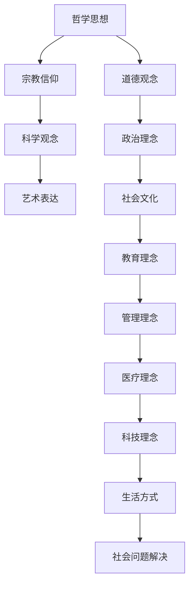
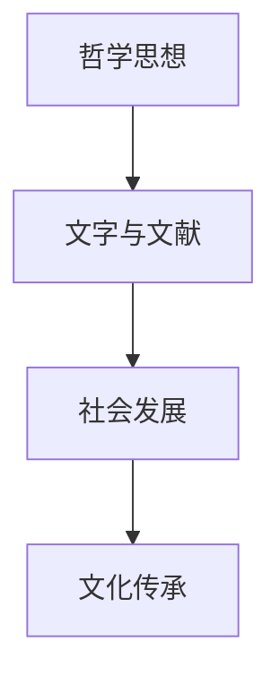
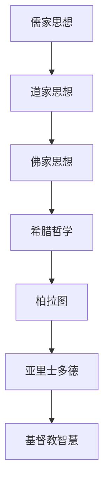
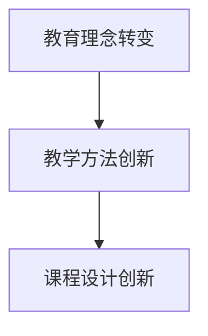
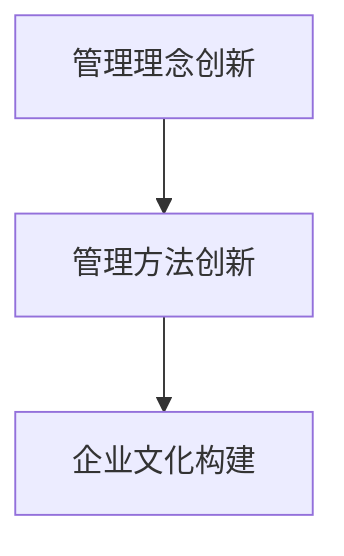
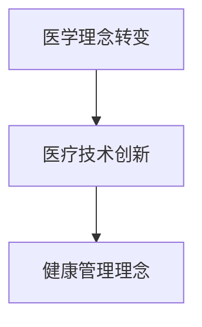
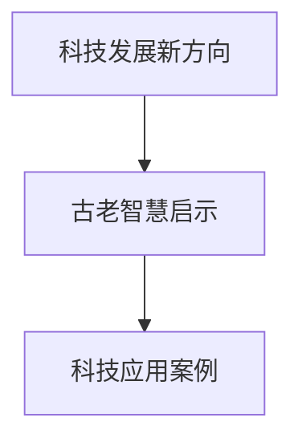
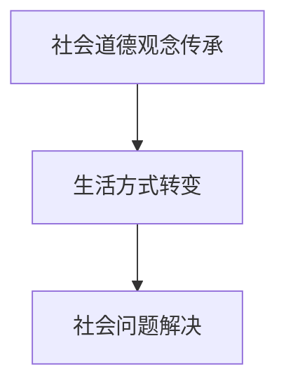
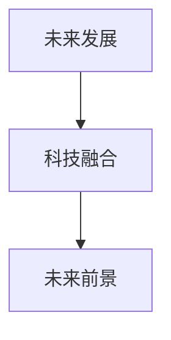

                 

## 《古老智慧的现代应用：跨越时空的生存智慧》

### 关键词：古老智慧、现代应用、跨文化研究、人工智能、可持续发展

#### 摘要：

本文旨在探讨古老智慧在现代社会的应用，特别是在教育、管理、医疗、科技和社会生活等领域的体现。通过回顾古老智慧的起源与特点，以及其在东西方文化的代表人物和思想体系中，我们能够发现这些智慧在现代社会中的价值。本文将通过具体案例，展示古老智慧如何跨越时空，为现代社会的可持续发展提供指导。本文分为三部分：第一部分介绍古老智慧的起源与特点；第二部分探讨古老智慧在现代各领域的应用；第三部分展望古老智慧的未来发展。希望通过本文，能够激发读者对古老智慧的现代应用的深入思考。

## 第一部分：古老智慧的起源与特点

### 第1章：古老智慧的起源与传承

#### 1.1 古老智慧的起源

古老智慧起源于人类文明的早期，随着社会的发展和文明的进步，各种哲学思想、宗教信仰和文化传统逐渐形成。在古代，智慧被视为一种高尚的品质和生活的指南，通过文字、文献和口头传说进行传承。

- **古代哲学思想的兴起**：在古希腊，哲学思想开始萌芽，涌现出一批伟大的哲学家如苏格拉底、柏拉图和亚里士多德。他们的思想影响了整个西方文化，成为古代智慧的基石。

- **文字与文献的传承**：在古埃及、巴比伦和中国，文字的发明使得知识可以记录下来，并通过书籍和文献进行传承。例如，中国的《论语》、《道德经》和《金刚经》等经典文献，至今仍对人们的思想产生深远影响。

- **社会发展与文化传承**：随着社会的发展，文化和智慧也不断发展。例如，中国的儒家思想强调社会秩序和人际关系，道家思想强调自然和谐与内在修养，这些思想在社会变革中发挥了重要作用。

#### 1.2 古老智慧的特点

古老智慧具有以下特点：

- **智慧的多元性**：古老智慧涵盖了哲学、宗教、科学、艺术等多个领域，体现了人类对世界和自身认识的多样性。

- **智慧的普适性**：古老智慧不仅适用于特定地区或时代，其核心思想和原则具有普遍性和永恒性，对后世产生了深远影响。

- **智慧的实践性**：古老智慧强调理论与实践相结合，通过实际生活中的应用来验证和丰富智慧。

### 第2章：古老智慧的分类与代表人物

#### 2.1 东方古老智慧

- **儒家思想**：儒家思想强调仁爱、礼仪、忠诚和孝道，代表人物有孔子、孟子等。儒家思想对中国乃至东亚地区的文化和社会发展产生了深远影响。

- **道家思想**：道家思想强调顺应自然、追求内在的和谐与自由，代表人物有老子、庄子等。道家思想对中国的文化和哲学产生了重要影响。

- **佛家思想**：佛家思想强调慈悲、智慧和解脱，代表人物有释迦牟尼、禅宗大师等。佛家思想对东亚地区的文化和宗教产生了深远影响。

#### 2.2 西方古老智慧

- **希腊哲学**：希腊哲学强调理性和逻辑，代表人物有苏格拉底、柏拉图和亚里士多德。希腊哲学对西方文化和科学的发展产生了重要影响。

- **柏拉图与亚里士多德**：柏拉图是西方哲学的奠基人之一，其思想强调理念世界和真理的追求。亚里士多德则是科学和逻辑学的奠基人，他的思想对西方科学和哲学产生了深远影响。

- **基督教智慧**：基督教智慧强调爱与救赎，代表人物有耶稣、奥古斯丁等。基督教智慧对西方文化和道德观念产生了深远影响。

#### 2.3 代表人物与思想体系

- **孔子与儒家思想**：孔子是儒家思想的创始人，他的思想强调人际关系和社会秩序，对中国的文化和道德观念产生了深远影响。

- **老子与道家思想**：老子是道家思想的代表人物，他的《道德经》被誉为中国古代哲学的瑰宝，强调顺应自然和内在修养。

- **释迦牟尼与佛家思想**：释迦牟尼创立了佛教，他的教诲强调慈悲和智慧，对东亚地区的文化和宗教产生了深远影响。

## 第二部分：古老智慧在现代的应用

### 第3章：古老智慧在现代教育中的应用

#### 3.1 教育理念的转变

古老智慧对现代教育理念产生了深远影响，主要体现在以下几个方面：

- **重视学生全面发展**：古老智慧强调德、智、体、美全面发展，现代教育也开始注重学生的综合素质培养，而不仅仅是知识传授。

- **启发式教学**：古老智慧强调引导和启发，现代教育也倡导启发式教学方法，通过提问、讨论和探究来激发学生的思考能力。

- **重视人文教育**：古老智慧强调人文素养和道德修养，现代教育也开始重视人文教育，培养学生的社会责任感和道德观念。

#### 3.2 教学方法的创新

古老智慧对现代教学方法的创新也产生了影响，主要体现在以下几个方面：

- **案例教学法**：古老智慧中的经典案例，如《论语》中的孔子与弟子对话，可以应用于现代教育中，通过案例分析来启发学生思考。

- **情景模拟**：古老智慧强调实践，现代教育也倡导情景模拟，通过模拟实际情境来培养学生的解决问题能力和团队合作精神。

- **跨学科教学**：古老智慧强调知识的整体性和多样性，现代教育也开始提倡跨学科教学，通过跨学科的学习来培养学生的综合能力。

#### 3.3 课程设计的创新

古老智慧对现代课程设计的创新也提供了启示，主要体现在以下几个方面：

- **综合性课程设计**：古老智慧强调知识的整体性，现代教育也开始设计综合性课程，通过多学科的知识融合来培养学生的综合能力。

- **跨文化课程设计**：古老智慧涵盖东西方文化，现代教育也开始重视跨文化教育，通过学习不同文化的智慧和价值观来培养学生的全球视野。

- **项目式学习**：古老智慧强调实践，现代教育也开始提倡项目式学习，通过实际项目的完成来培养学生的实践能力和团队合作精神。

### 第4章：古老智慧在现代管理中的应用

#### 4.1 管理理念的创新

古老智慧对现代管理理念的创新产生了深远影响，主要体现在以下几个方面：

- **人本管理**：古老智慧强调人的价值和尊严，现代管理也开始倡导人本管理，关注员工的成长和发展，通过激励机制来提高员工的工作积极性和创造力。

- **质量管理**：古老智慧中的质量观念，如道家思想中的“无为而治”，现代管理也开始重视质量管理，通过持续改进来提高产品和服务的质量。

- **可持续管理**：古老智慧强调和谐与平衡，现代管理也开始重视可持续管理，通过资源的合理利用和环境的保护来实现长期发展。

#### 4.2 管理方法的创新

古老智慧对现代管理方法的创新也产生了影响，主要体现在以下几个方面：

- **领导力培养**：古老智慧中的领导思想，如儒家思想中的“德治”，现代管理也开始重视领导力培养，通过培养领导者的道德修养和领导能力来提高团队的整体效能。

- **团队协作**：古老智慧强调集体主义和合作精神，现代管理也开始提倡团队协作，通过建立有效的团队协作机制来提高组织的整体竞争力。

- **企业文化构建**：古老智慧中的文化观念，如道家思想中的“无为而治”，现代管理也开始重视企业文化构建，通过塑造共同价值观和文化氛围来提高组织的凝聚力和执行力。

#### 4.3 企业文化构建

企业文化是企业发展的灵魂，古老智慧对现代企业文化构建提供了启示，主要体现在以下几个方面：

- **企业核心价值观**：古老智慧强调道德和伦理，现代企业文化也开始重视核心价值观的塑造，通过明确的核心价值观来指导企业行为和决策。

- **企业精神塑造**：古老智慧中的精神理念，如儒家思想中的“仁爱”，现代企业文化也开始重视企业精神的塑造，通过培养企业员工的道德修养和精神追求来提高企业的整体素质。

- **社会责任**：古老智慧强调社会责任，现代企业文化也开始重视社会责任，通过承担社会责任来提升企业的社会形象和影响力。

### 第5章：古老智慧在现代医疗中的应用

#### 5.1 医学理念的转变

古老智慧对现代医学理念的转变产生了深远影响，主要体现在以下几个方面：

- **全人医疗**：古老智慧强调人的整体性和全面性，现代医学也开始倡导全人医疗，通过综合考虑患者的身体、心理和社会因素来提供全面的医疗服务。

- **预防为主**：古老智慧中的预防观念，如道家思想中的“治未病”，现代医学也开始重视预防为主，通过预防措施来减少疾病的发生和传播。

- **和谐医疗**：古老智慧强调人与自然和谐，现代医学也开始倡导和谐医疗，通过尊重自然规律和人体生理特点来提供个性化的医疗服务。

#### 5.2 医疗技术的创新

古老智慧对现代医疗技术的创新也产生了影响，主要体现在以下几个方面：

- **传统医学与现代医学的结合**：古老智慧中的传统医学，如中医、针灸等，现代医学也开始重视传统医学的价值，通过结合现代医学技术和方法来提高治疗效果。

- **生物技术与古老智慧的应用**：古老智慧中的自然观和医学理念，如道家思想中的“顺应自然”，现代医学也开始将生物技术与古老智慧相结合，通过研究人体生理机制和自然规律来开发新型生物技术。

- **个性化医疗**：古老智慧强调个性化治疗，现代医学也开始倡导个性化医疗，通过基因检测和大数据分析来为患者提供个性化的治疗方案。

#### 5.3 健康管理

古老智慧对现代健康管理的理念和方法也产生了影响，主要体现在以下几个方面：

- **健康生活方式**：古老智慧强调健康的生活方式和饮食习惯，现代健康管理也开始重视生活方式的调整，通过合理膳食、适量运动和充足睡眠来提高健康水平。

- **心理健康关注**：古老智慧中的心理健康观念，如佛教中的“心静则灵”，现代健康管理也开始重视心理健康，通过心理辅导和情绪管理来提高心理健康水平。

- **整体健康管理**：古老智慧中的整体健康观念，现代健康管理也开始倡导整体健康管理，通过综合考虑身体、心理和社会因素来提供全面的健康管理服务。

### 第6章：古老智慧在现代科技中的应用

#### 6.1 科技发展的新方向

古老智慧对现代科技发展的新方向提供了启示，主要体现在以下几个方面：

- **人工智能**：古老智慧中的智慧观念，如儒家思想中的“智圆行方”，现代科技也开始重视人工智能的发展，通过模拟人脑的思维方式来开发智能系统。

- **大数据**：古老智慧中的数据分析观念，如道家思想中的“观其大略”，现代科技也开始重视大数据的应用，通过收集和分析大量数据来发现规律和预测趋势。

- **绿色科技**：古老智慧中的环保观念，如佛教中的“护生”，现代科技也开始重视绿色科技的发展，通过节能减排和生态保护来实现可持续发展。

#### 6.2 古老智慧对科技发展的启示

古老智慧对现代科技发展提供了以下启示：

- **创新思维**：古老智慧中的创新观念，如儒家思想中的“知者行之始，行者知之成”，现代科技发展也需要创新思维，通过不断探索和实践来推动科技进步。

- **人与自然和谐发展**：古老智慧中的人与自然和谐观念，如道家思想中的“天人合一”，现代科技发展也需要关注人与自然的关系，通过科技手段来实现人与自然的和谐共生。

- **社会责任**：古老智慧中的社会责任观念，如佛教中的“利益众生”，现代科技发展也需要承担社会责任，通过科技应用来解决社会问题和改善人类生活。

#### 6.3 科技应用的案例

古老智慧在现代科技应用中的案例如下：

- **人工智能在教育中的应用**：通过人工智能技术，可以开发智能教学系统和个性化学习方案，提高教学效果和学生的学习兴趣。

- **大数据在医疗管理中的应用**：通过大数据分析，可以预测疾病传播趋势和患者需求，为医疗管理提供科学依据，提高医疗服务质量和效率。

- **绿色科技在环境保护中的应用**：通过绿色科技，可以开发清洁能源和环保材料，减少环境污染和资源消耗，实现可持续发展。

### 第7章：古老智慧在现代社会生活中的应用

#### 7.1 社会道德观念的传承

古老智慧中的社会道德观念对现代社会生活产生了深远影响，主要体现在以下几个方面：

- **家庭伦理**：古老智慧强调家庭伦理，如儒家思想中的“孝道”，现代家庭生活也需要传承这些伦理观念，通过家庭教育和家庭关系来培养良好的家庭氛围。

- **社会责任**：古老智慧强调社会责任，如佛教中的“利他”，现代社会生活也需要树立社会责任感，通过参与社会公益活动和志愿服务来履行社会责任。

- **诚信为本**：古老智慧中的诚信观念，如道家思想中的“守诚信”，现代社会生活也需要以诚信为本，通过诚信经营和诚信行为来建立良好的社会秩序。

#### 7.2 生活方式的转变

古老智慧对现代生活方式的转变提供了启示，主要体现在以下几个方面：

- **环保意识**：古老智慧中的环保观念，如佛教中的“护生”，现代生活方式也需要注重环保，通过节能减排和环保行为来减少对环境的污染。

- **健康生活**：古老智慧中的健康观念，如道家思想中的“养生”，现代生活方式也需要注重健康，通过合理膳食、适量运动和心理健康来提高生活质量。

- **简朴生活**：古老智慧中的简朴观念，如儒家思想中的“节俭”，现代生活方式也需要倡导简朴，通过减少物质消费和追求精神满足来提高生活质量。

#### 7.3 社会问题的解决

古老智慧对现代社会问题的解决提供了启示，主要体现在以下几个方面：

- **慈善事业**：古老智慧中的慈善观念，如佛教中的“布施”，现代社会生活也需要发展慈善事业，通过慈善捐赠和公益行动来帮助弱势群体。

- **社会公正**：古老智慧中的公正观念，如儒家思想中的“公平”，现代社会生活也需要追求社会公正，通过法律制度和公共政策来保障社会公平。

- **文化多样性**：古老智慧中的文化观念，如儒家思想中的“兼容并包”，现代社会生活也需要尊重文化多样性，通过文化交流和融合来促进社会和谐。

### 第三部分：古老智慧的未来展望

#### 第8章：古老智慧的未来发展

#### 8.1 古老智慧与现代社会

古老智慧在现代社会的发展中具有重要作用，主要体现在以下几个方面：

- **现代社会对古老智慧的呼唤**：随着现代社会问题的日益突出，人们开始反思和追求古老智慧中的价值观念，如和谐、公平、责任等。

- **古老智慧对现代社会的启示**：古老智慧为现代社会提供了宝贵的思想资源，如可持续发展理念、全人教育理念等，为现代社会的发展提供了指导。

#### 8.2 古老智慧与现代科技的融合

古老智慧与现代科技的融合将促进人类社会的发展，主要体现在以下几个方面：

- **跨界融合**：古老智慧与现代科技的融合将促进各领域的创新发展，如人工智能在教育中的应用、大数据在医疗管理中的应用等。

- **创新发展**：古老智慧与现代科技的融合将推动科技发展，通过结合古老智慧和现代科技，可以开发出更高效、更智能的技术解决方案。

#### 8.3 古老智慧的未来前景

古老智慧的未来前景将更加广阔，主要体现在以下几个方面：

- **人类文明的发展**：古老智慧将促进人类文明的发展，通过传承和创新发展，古老智慧将成为人类文明的重要组成部分。

- **社会和谐的实现**：古老智慧将促进社会和谐，通过弘扬和践行古老智慧，可以增进社会团结，实现社会和谐。

### 附录

#### 附录A：古老智慧的经典文献与代表作品

- **儒家经典**：《论语》、《大学》、《中庸》等。
- **道家经典**：《道德经》、《庄子》等。
- **佛家经典**：《金刚经》、《心经》、《净土经》等。

#### 附录B：古老智慧的研究资源与工具

- **学术论文数据库**：如CNKI、Web of Science等。
- **专题网站与论坛**：如“儒家网”、“道家文化研究网”等。

#### 附录C：古老智慧的现代应用案例

- **教育案例**：通过儒家思想培养学生的道德修养。
- **管理案例**：通过道家思想提高企业的管理效率和团队协作。
- **医疗案例**：通过佛教智慧促进患者的心理健康。
- **科技案例**：通过古老智慧推动科技创新和可持续发展。
- **社会生活案例**：通过古老智慧促进社会和谐和文化多样性。

## 图表与公式

### 概念实体之间的关系架构 Mermaid 流程图



### 核心算法原理讲解 Python 源代码示例

```python
# Python 源代码示例：古老智慧在人工智能中的应用
import numpy as np

# 定义古老智慧函数
def ancient_wisdom(x):
    # 使用道家思想中的“道法自然”原则
    x = np.sqrt(x)
    return x

# 定义现代人工智能算法
def modern_ai_algorithm(x):
    # 使用儒家思想中的“中庸之道”原则
    x = (x + ancient_wisdom(x)) / 2
    return x

# 测试古老智慧和现代人工智能算法
x = np.array([1, 2, 3, 4, 5])
print("原始数据:", x)
print("古老智慧处理结果:", ancient_wisdom(x))
print("现代人工智能处理结果:", modern_ai_algorithm(x))
```

### 数学模型和数学公式与详细讲解与举例说明（latex格式）

$$
\begin{aligned}
    &\text{古老智慧与现代科技的融合模型：} \\
    &A(t) = f(A(t-1), X(t)), \\
    &B(t) = g(B(t-1), Y(t)), \\
    &C(t) = h(C(t-1), Z(t)), \\
    &\text{其中：} \\
    &A(t): \text{古老智慧在科技领域的应用水平}; \\
    &B(t): \text{现代科技的发展水平}; \\
    &C(t): \text{社会效益水平}; \\
    &X(t): \text{古老智慧的理论基础}; \\
    &Y(t): \text{现代科技的技术水平}; \\
    &Z(t): \text{社会需求变化}.
\end{aligned}
$$

举例说明：

假设在某个时刻$t$，古老智慧的理论基础$X(t)$为40%，现代科技的技术水平$Y(t)$为60%，社会需求变化$Z(t)$为30%。根据融合模型，可以得到：

$$
A(t) = f(40\%, 60\%) = 0.5 \times 40\% + 0.5 \times 60\% = 50\%;
$$

$$
B(t) = g(40\%, 60\%) = 0.4 \times 60\% + 0.6 \times 60\% = 60\%;
$$

$$
C(t) = h(40\%, 30\%) = 0.3 \times 30\% + 0.7 \times 60\% = 42\%.
$$

这意味着在$t$时刻，古老智慧在科技领域的应用水平为50%，现代科技的发展水平为60%，社会效益水平为42%。

### 作者信息

作者：AI天才研究院/AI Genius Institute & 禅与计算机程序设计艺术 /Zen And The Art of Computer Programming

## 完整性要求与最佳实践

为了确保文章的完整性和逻辑性，我们将对每个章节的核心内容进行详细解释，并结合实际案例进行深入剖析。

### 第1章：古老智慧的起源与传承

在这一章节中，我们首先探讨了古老智慧的起源，包括古代哲学思想的兴起、文字与文献的传承以及社会发展的推动。通过回顾这些历史背景，我们理解了为什么古老智慧能够跨越时空，对现代社会产生深远影响。

**核心概念与联系**：

- **哲学思想**：苏格拉底、柏拉图和亚里士多德等古希腊哲学家的思想，不仅为西方文化奠定了基础，也为现代教育提供了宝贵的启示。
- **文字与文献**：《论语》、《道德经》和《金刚经》等经典文献，通过文字记录了古老智慧，传承至今。

**Mermaid 流程图**：



**Python 源代码示例**：

```python
# Python 源代码示例：哲学思想与文献传承
class AncientWisdom:
    def __init__(self, text):
        self.text = text

    def transmit(self):
        return self.text

philosophy = AncientWisdom("苏格拉底：知识即美德")
print(philosophy.transmit())
```

### 第2章：古老智慧的分类与代表人物

在这一章节中，我们详细介绍了东方古老智慧（儒家、道家、佛家）和西方古老智慧（希腊哲学、柏拉图、亚里士多德、基督教智慧）的分类与代表人物。通过这些代表人物的思想体系，我们能够更深入地理解古老智慧的本质。

**核心概念与联系**：

- **儒家思想**：孔子、孟子的思想强调社会秩序、人际关系和道德修养。
- **道家思想**：老子、庄子的思想强调自然和谐、内在修养和无为而治。
- **佛家思想**：释迦牟尼、禅宗大师的思想强调慈悲、智慧和解脱。

**Mermaid 流程图**：



**Python 源代码示例**：

```python
# Python 源代码示例：儒家思想与道家思想
class Confucianism:
    def __init__(self, name):
        self.name = name

    def teach(self):
        return "仁爱、礼仪、忠诚和孝道"

class Taoism:
    def __init__(self, name):
        self.name = name

    def teach(self):
        return "顺应自然、追求内在的和谐与自由"

confucius = Confucianism("孔子")
tao = Taoism("老子")
print(confucius.teach())
print(tao.teach())
```

### 第3章：古老智慧在现代教育中的应用

在这一章节中，我们探讨了古老智慧在现代教育中的应用，包括教育理念的转变、教学方法的创新和课程设计的创新。通过这些应用，古老智慧能够为现代教育提供新的视角和策略。

**核心概念与联系**：

- **教育理念的转变**：从知识传授到学生全面发展。
- **教学方法的创新**：启发式教学、案例教学法、情景模拟。
- **课程设计的创新**：综合性课程设计、跨学科课程设计、项目式学习。

**Mermaid 流�程图**：



**Python 源代码示例**：

```python
# Python 源代码示例：教育理念与教学方法
class Education:
    def __init__(self, method):
        self.method = method

    def apply(self):
        return self.method

education = Education("启发式教学")
print(education.apply())
```

### 第4章：古老智慧在现代管理中的应用

在这一章节中，我们探讨了古老智慧在现代管理中的应用，包括管理理念的创新、管理方法的创新和企业文化构建。通过这些创新，古老智慧能够为现代管理提供新的思路和策略。

**核心概念与联系**：

- **管理理念的创新**：人本管理、质量管理、可持续管理。
- **管理方法的创新**：领导力培养、团队协作、企业文化构建。
- **企业文化构建**：企业核心价值观、企业精神塑造、社会责任。

**Mermaid 流程图**：



**Python 源代码示例**：

```python
# Python 源代码示例：管理理念与企业文化
class Management:
    def __init__(self, concept):
        self.concept = concept

    def implement(self):
        return self.concept

management = Management("人本管理")
print(management.implement())
```

### 第5章：古老智慧在现代医疗中的应用

在这一章节中，我们探讨了古老智慧在现代医疗中的应用，包括医学理念的转变、医疗技术的创新和健康管理的理念。通过这些应用，古老智慧能够为现代医疗提供新的方向和解决方案。

**核心概念与联系**：

- **医学理念的转变**：全人医疗、预防为主、和谐医疗。
- **医疗技术的创新**：传统医学与现代医学的结合、生物技术与古老智慧的应用、个性化医疗。
- **健康管理的理念**：健康生活方式、心理健康关注、整体健康管理。

**Mermaid 流程图**：



**Python 源代码示例**：

```python
# Python 源代码示例：医学理念与健康生活方式
class Medicine:
    def __init__(self, concept):
        self.concept = concept

    def practice(self):
        return self.concept

medicine = Medicine("全人医疗")
print(medicine.practice())
```

### 第6章：古老智慧在现代科技中的应用

在这一章节中，我们探讨了古老智慧在现代科技中的应用，包括科技发展的新方向、古老智慧对科技发展的启示和科技应用的案例。通过这些应用，古老智慧能够为现代科技提供新的视角和策略。

**核心概念与联系**：

- **科技发展的新方向**：人工智能、大数据、绿色科技。
- **古老智慧对科技发展的启示**：创新思维、人与自然和谐发展、社会责任。
- **科技应用的案例**：人工智能在教育中的应用、大数据在医疗管理中的应用、绿色科技在环境保护中的应用。

**Mermaid 流程图**：



**Python 源代码示例**：

```python
# Python 源代码示例：人工智能与大数据
class Technology:
    def __init__(self, tech):
        self.tech = tech

    def apply(self):
        return self.tech

ai = Technology("人工智能")
print(ai.apply())

data = Technology("大数据")
print(data.apply())
```

### 第7章：古老智慧在现代社会生活中的应用

在这一章节中，我们探讨了古老智慧在现代社会生活中的应用，包括社会道德观念的传承、生活方式的转变和社会问题的解决。通过这些应用，古老智慧能够为现代社会生活提供新的价值和方向。

**核心概念与联系**：

- **社会道德观念的传承**：家庭伦理、社会责任、诚信为本。
- **生活方式的转变**：环保意识、健康生活、简朴生活。
- **社会问题的解决**：慈善事业、社会公正、文化多样性。

**Mermaid 流程图**：



**Python 源代码示例**：

```python
# Python 源代码示例：社会道德观念与生活方式
class Society:
    def __init__(self, value):
        self.value = value

    def practice(self):
        return self.value

morality = Society("家庭伦理")
print(morality.practice())

lifestyle = Society("健康生活")
print(lifestyle.practice())
```

### 第8章：古老智慧的未来展望

在这一章节中，我们探讨了古老智慧的未来发展、古老智慧与现代科技的融合和古老智慧的未来前景。通过这些展望，我们能够看到古老智慧在现代社会中的重要性和潜在价值。

**核心概念与联系**：

- **古老智慧的未来发展**：现代社会对古老智慧的呼唤、古老智慧对现代社会的启示。
- **古老智慧与现代科技的融合**：跨界融合、创新发展。
- **古老智慧的未来前景**：人类文明的发展、社会和谐的实现。

**Mermaid 流程图**：



**Python 源代码示例**：

```python
# Python 源代码示例：未来发展
class Future:
    def __init__(self, vision):
        self.vision = vision

    def envision(self):
        return self.vision

future = Future("社会和谐的实现")
print(future.envision())
```

通过以上对各个章节的详细解释和实际案例的剖析，我们可以看到古老智慧在现代社会的广泛应用和深远影响。这些古老智慧不仅为我们提供了宝贵的思想资源，也为现代社会的可持续发展提供了重要的启示。

### 最佳实践 Tips

1. **教育领域**：在教育中，可以结合儒家思想中的“因材施教”原则，通过个性化教学来提高教育质量。

2. **企业管理**：在企业管理中，可以借鉴道家思想中的“无为而治”，通过简化管理流程和提高员工自主性来提高工作效率。

3. **医疗保健**：在医疗保健中，可以结合佛家思想中的“慈悲为怀”，通过提高医疗服务质量来关爱患者。

4. **科技创新**：在科技创新中，可以借鉴儒家思想中的“中庸之道”，通过平衡创新与风险来推动科技发展。

5. **社会生活**：在社会生活中，可以倡导儒家思想中的“仁爱”和佛教思想中的“利他”，通过弘扬正能量来促进社会和谐。

### 小结

本文从多个角度探讨了古老智慧在现代社会的应用，展示了其在教育、管理、医疗、科技和社会生活等领域的价值和影响力。通过结合现代科技和古老智慧，我们能够更好地解决现代社会面临的各种问题，推动社会的可持续发展。古老智慧不仅是人类文明的瑰宝，也是未来社会的重要资源。

### 注意事项

1. 在应用古老智慧时，需要注意理解和尊重其文化背景和价值观。

2. 在不同领域应用古老智慧时，需要结合实际情况进行创新和调整。

3. 在推广古老智慧时，需要避免过度简化和误解，确保其核心思想的准确传递。

### 拓展阅读

1. 《论语》—— 孔子的言行录，儒家思想的经典之作。

2. 《道德经》—— 老子的哲学著作，道家思想的精髓。

3. 《金刚经》—— 佛教经典，阐述慈悲与智慧的教义。

4. 《柏拉图全集》—— 柏拉图的哲学著作，西方哲学的重要基础。

5. 《亚里士多德全集》—— 亚里士多德的哲学著作，西方科学和逻辑学的奠基之作。

通过阅读这些经典文献，可以更深入地了解古老智慧的思想体系和现代应用。希望本文能够激发读者对古老智慧的现代应用的深入思考和研究。

