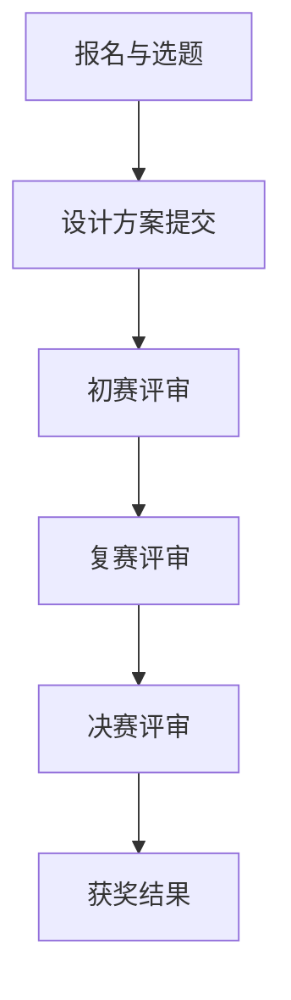

                 

# 《可持续乌托邦设计比赛：未来社会蓝图的创意角逐》

> 关键词：可持续乌托邦设计、未来社会蓝图、创意角逐、可持续发展、乌托邦、设计理念、评审标准、优秀作品、设计实践

> 摘要：本文通过分析可持续乌托邦设计比赛的历史与发展、比赛的目标与意义、设计理念与原则，以及比赛的流程与评审标准，探讨了未来社会蓝图的创意角逐。通过优秀作品的展示与分析，本文进一步阐述了可持续乌托邦设计的实践案例，并提出了对未来展望和设计实践的建议。

## 目录大纲

## 第一部分：比赛背景与目标

### 1.1 比赛背景

### 1.2 比赛目标

## 第二部分：可持续乌托邦设计理念

### 2.1 可持续发展的概念

### 2.2 乌托邦的概念

### 2.3 设计理念与原则

## 第三部分：比赛流程与评审标准

### 3.1 比赛流程

### 3.2 评审标准

## 第四部分：优秀作品展示与分析

### 4.1 优秀作品展示

### 4.2 作品分析

## 第五部分：可持续乌托邦设计实践

### 5.1 设计方法论

### 5.2 实践案例

### 5.3 设计实践建议

## 第六部分：未来展望

### 6.1 可持续乌托邦设计的趋势

### 6.2 比赛的启示与影响

### 6.3 结论与展望

## 附录

### 附录一：比赛流程图

### 附录二：比赛评审标准细则

### 附录三：参考文献

---

### 第一部分：比赛背景与目标

#### 1.1 比赛背景

可持续乌托邦设计比赛起源于对现实世界问题的深刻反思和未来社会蓝图的憧憬。随着全球环境问题的加剧、社会不平等的加剧以及经济危机的频发，人们对可持续发展和乌托邦理想的社会形态产生了浓厚的兴趣。这种兴趣促使了一系列相关比赛和活动的出现，其中最具代表性的便是可持续乌托邦设计比赛。

比赛的历史可以追溯到20世纪末，最早的比赛由联合国开发计划署（UNDP）和世界自然基金会（WWF）等国际组织发起，旨在通过创意设计激发全球对可持续发展的关注和行动。随着时间的推移，比赛逐渐扩展到各个国家和地区，形成了国际化的竞赛平台。比赛不仅吸引了专业的环境设计师、城市规划师和社会学家，也吸引了众多普通公众的参与，成为了一个全球性的创意角逐场。

#### 1.2 比赛目标

可持续乌托邦设计比赛的目标在于设计出具有实际可行性和可持续性的未来社会蓝图。具体而言，比赛旨在：

1. **设计可持续乌托邦的愿景**：通过创意设计，勾勒出一个理想化的可持续乌托邦社会，该社会在环境保护、社会公正、经济繁荣和科技创新等方面都取得了显著成就。

2. **探索未来社会的发展路径**：通过比赛，参与者可以探索多种未来社会的发展路径，包括能源利用、城市规划、交通系统、社会福利和生态保护等方面，从而为未来社会的发展提供多样化的思路和解决方案。

3. **促进创新思维与跨学科合作**：比赛鼓励不同领域、不同背景的参与者共同合作，通过跨学科的创新思维，提出具有突破性的可持续乌托邦设计方案。

#### 比赛的主要参与者

比赛的主要参与者包括：

1. **学生和年轻人**：他们具有强烈的社会责任感和创新意识，是未来社会的建设者。

2. **专业人士**：包括环境设计师、城市规划师、社会学家、经济学家等，他们具有丰富的专业知识和实践经验。

3. **公众**：他们通过参与比赛，可以深入了解可持续乌托邦设计的概念和实践，从而积极参与到未来的社会建设中。

通过这些参与者的共同努力，可持续乌托邦设计比赛成为了一个促进社会创新和可持续发展的国际平台。接下来，本文将进一步探讨可持续乌托邦设计的理念与原则，以及比赛的流程与评审标准。

---

### 第二部分：可持续乌托邦设计理念

#### 2.1 可持续发展的概念

可持续发展是一个全球性的议题，其核心在于满足当代人的需求，同时不损害后代人满足自身需求的能力。可持续发展的概念可以追溯到1987年联合国发布的《我们共同的未来》报告，该报告首次提出了可持续发展的定义，并将其总结为“既满足当代人的需求，又不对后代人满足其需求的能力构成危害的发展”。

**可持续发展的原则**：

1. **公平性**：可持续发展强调代际公平和非代际公平。代际公平指的是当代人与后代人在资源利用和环境保护上的公平性；非代际公平指的是不同地区、不同国家和不同社会群体在可持续发展机会上的公平性。

2. **持续性**：持续性是可持续发展的核心原则，强调在资源利用和环境管理上，应保持生态系统的稳定性和生产力。

3. **共同性**：可持续发展是一个全球性问题，需要各国政府、国际组织和公众的共同参与和合作。

**可持续发展的指标体系**：

1. **经济指标**：包括国内生产总值（GDP）、人均收入、就业率等。

2. **社会指标**：包括教育水平、卫生状况、社会保障等。

3. **环境指标**：包括温室气体排放、水资源管理、土地退化等。

#### 2.2 乌托邦的概念

乌托邦是一种理想化的社会状态，源于古希腊语“ou-topos”，意为“不存在的地方”或“理想之地”。乌托邦的概念在历史长河中不断发展，从最初的对完美社会的描述，到现代对可持续社会的构想。

**乌托邦的特点**：

1. **社会公正**：乌托邦社会强调公平和正义，消除社会不平等和歧视。

2. **环境友好**：乌托邦社会注重环境保护，追求生态平衡。

3. **经济繁荣**：乌托邦社会拥有高效的经济系统，实现资源的最优配置。

4. **科技创新**：乌托邦社会积极采用新技术，推动社会进步。

**乌托邦的类型**：

1. **理想型乌托邦**：强调理想化的社会状态，如柏拉图的《理想国》。

2. **现实型乌托邦**：更加贴近现实，如托马斯·莫尔的《乌托邦》。

**乌托邦在可持续社会设计中的应用**：

乌托邦的概念为可持续社会设计提供了灵感，通过构建理想化的社会模型，可以更好地探索和实现可持续发展的目标。乌托邦设计理念强调以下几个方面：

1. **整体性**：乌托邦设计注重整体系统的和谐与平衡，追求生态、社会、经济的协调发展。

2. **创新性**：乌托邦设计鼓励创新思维，通过科技创新和社会创新，解决现实问题。

3. **前瞻性**：乌托邦设计具有前瞻性，能够预见未来社会的发展趋势，为可持续发展提供指导。

#### 2.3 设计理念与原则

可持续乌托邦设计理念融合了可持续发展与乌托邦的概念，旨在构建一个理想化的可持续社会。以下是可持续乌托邦设计的主要理念与原则：

1. **人本主义设计**：

- 强调以人为中心，关注人的需求、福祉和发展。
- 推动社会公平和包容性，消除贫困和不平等。

2. **环境友好设计**：

- 保护和恢复自然环境，减少资源消耗和环境污染。
- 推广清洁能源和绿色技术，实现生态平衡。

3. **社会责任设计**：

- 考虑设计对社会的影响，推动社会责任和可持续发展。
- 倡导企业和个人对社会的责任，实现共同发展。

通过这些设计理念和原则，可持续乌托邦设计旨在打造一个和谐、繁荣、可持续的未来社会。在接下来的部分，本文将详细探讨比赛流程与评审标准，为读者了解比赛的各个环节提供参考。

---

### 第三部分：比赛流程与评审标准

#### 3.1 比赛流程

可持续乌托邦设计比赛通常分为报名与选题、设计方案提交、初赛评审、复赛评审和决赛评审等环节。

1. **报名与选题**：

- 参赛者需在规定时间内完成报名，并提交个人或团队的简介和设计意向。
- 比赛主办方根据参赛者的背景和兴趣，为其分配相应的选题方向，如城市规划、能源利用、交通系统等。

2. **设计方案提交**：

- 参赛者根据选题方向，开展设计工作，并在规定时间内提交完整的设计方案。
- 设计方案应包括项目背景、设计理念、实施计划、预期成果等。

3. **初赛评审**：

- 初赛评审由专业评审团进行，评审标准包括设计理念与创新性、可持续性与实用性等。
- 初赛评审结果将决定参赛者是否进入复赛。

4. **复赛评审**：

- 复赛评审在初赛的基础上进行，评审团将深入评估参赛者的设计方案，并提出改进建议。
- 复赛评审结果将决定参赛者是否进入决赛。

5. **决赛评审**：

- 决赛评审为最终的评审环节，参赛者需在现场展示自己的设计方案，并回答评审团的提问。
- 决赛评审结果将产生比赛的一、二、三等奖。

#### 3.2 评审标准

比赛评审标准旨在全面评估参赛者的设计方案，确保其符合可持续乌托邦设计理念，并具有实际可行性和创新性。以下是具体的评审标准：

1. **设计理念与创新性**：

- 设计理念是否符合可持续发展的原则，如公平性、持续性和共同性。
- 设计方案是否具有创新性，能否为现实问题提供有效解决方案。

2. **可持续性与实用性**：

- 设计方案在资源利用、环境保护和生态平衡等方面的可持续性。
- 设计方案是否具有实际应用价值，能否在实际中推广和应用。

3. **社会影响与可行性**：

- 设计方案对社会的影响，如是否能够提高社会福祉、减少不平等现象等。
- 设计方案的可行性，包括技术可行性、经济可行性和社会接受度。

4. **团队协作与展示效果**：

- 参赛团队的合作能力，如团队组织、分工协作和沟通协调等。
- 设计方案的展示效果，包括PPT制作、现场演讲和答辩等。

通过这些评审标准，比赛旨在选拔出最具创意和可持续性的设计方案，为未来社会的发展提供有益的启示。在接下来的部分，本文将展示和分析一些优秀作品，进一步探讨可持续乌托邦设计的实践与应用。

---

### 第四部分：优秀作品展示与分析

#### 4.1 优秀作品展示

在过去的比赛中，涌现出了许多优秀的设计作品，这些作品不仅在理念上具有创新性，而且在实践上也具有很高的可行性。以下是一些代表性的优秀作品：

1. **“绿色城市”设计**：

该作品以城市可持续发展为核心，提出了一套包括能源、交通、建筑和环境在内的系统性解决方案。设计方案通过推广可再生能源、优化交通网络和绿色建筑，实现了城市生态和经济的协调发展。

2. **“智慧农业”设计**：

该作品关注农业领域的可持续发展，提出利用物联网、大数据和人工智能技术，实现农业生产的智能化和精准化。设计方案通过优化资源利用、减少污染和提高产量，为解决全球粮食安全问题提供了新的思路。

3. **“社区共治”设计**：

该作品强调社区成员的参与和共治，提出了一套以居民为主体，政府、企业和非政府组织共同参与的社区治理模式。设计方案通过促进社区成员的互动和合作，提高了社区的整体幸福感和可持续发展能力。

4. **“蓝色经济”设计**：

该作品关注海洋资源的可持续利用，提出了一套以海洋生态保护、海洋资源开发和海洋产业为核心的发展模式。设计方案通过推动海洋科技、促进海洋经济和生态保护，实现了海洋资源的可持续利用。

#### 4.2 作品分析

1. **作品的创新点**：

- **“绿色城市”设计**：创新性地提出了城市可持续发展的系统性解决方案，涵盖了多个关键领域。
- **“智慧农业”设计**：将先进技术应用于农业生产，实现了农业生产的智能化和精准化。
- **“社区共治”设计**：强调社区成员的参与和共治，构建了一个以居民为主体、多方参与的社区治理模式。
- **“蓝色经济”设计**：关注海洋资源的可持续利用，提出了一套创新性的海洋经济发展模式。

2. **作品的可持续性**：

- **“绿色城市”设计**：通过推广可再生能源、优化交通网络和绿色建筑，实现了城市的生态和经济的协调发展。
- **“智慧农业”设计**：通过优化资源利用、减少污染和提高产量，为农业的可持续发展提供了新的路径。
- **“社区共治”设计**：通过促进社区成员的互动和合作，提高了社区的整体幸福感和可持续发展能力。
- **“蓝色经济”设计**：通过推动海洋科技、促进海洋经济和生态保护，实现了海洋资源的可持续利用。

3. **作品的社会影响**：

- **“绿色城市”设计**：有助于提高城市的生态环境质量，改善居民的生活质量。
- **“智慧农业”设计**：有助于解决全球粮食安全问题，提高农业生产的效率和可持续性。
- **“社区共治”设计**：有助于构建和谐社区，提高居民的幸福感和社会参与度。
- **“蓝色经济”设计**：有助于促进海洋经济的发展，提高海洋资源的利用效率。

4. **作品的不足与改进建议**：

- **“绿色城市”设计**：在实施过程中，需要更多的政策支持和资金投入。
- **“智慧农业”设计**：在技术实现上，仍需克服一些技术难题。
- **“社区共治”设计**：在社区成员的参与度上，需要进一步激发居民的积极性。
- **“蓝色经济”设计**：在海洋资源的保护和管理上，需要加强法律法规的制定和执行。

通过优秀作品的展示与分析，我们可以看到可持续乌托邦设计在实践中的应用和创新。这些作品不仅为未来的社会蓝图提供了有益的启示，也为可持续发展的实现提供了具体的路径和方案。

---

### 第五部分：可持续乌托邦设计实践

#### 5.1 设计方法论

可持续乌托邦设计的实践需要一套科学、系统的方法论，以确保设计方案的科学性和可行性。以下是可持续乌托邦设计的主要方法论：

1. **创意思维技巧**：

- **头脑风暴**：通过集体讨论和思维碰撞，激发创意的产生。
- **思维导图**：利用思维导图工具，将创意和思路可视化，便于梳理和整合。
- **横向思维**：突破传统思维框架，寻找创新的解决方案。

2. **概念设计方法**：

- **情景分析**：通过构建未来社会的情景，分析其发展趋势和挑战。
- **价值链分析**：识别设计项目中的关键环节和利益相关者，优化资源配置。
- **系统动力学**：运用系统动力学模型，分析系统的结构和行为，预测未来趋势。

3. **可行性分析**：

- **技术可行性分析**：评估设计方案所需的技术条件和实施难度。
- **经济可行性分析**：评估设计方案的经济成本和收益，确保其具有经济可行性。
- **社会可行性分析**：评估设计方案对社会的影响和接受度，确保其具有社会可行性。

#### 5.2 实践案例

1. **可持续社区设计**：

- **项目背景**：某城市面临严重的人口老龄化问题，社区基础设施滞后，居民生活质量有待提高。
- **设计方案**：
  - **绿色建筑**：采用节能环保材料，提高建筑能效。
  - **智慧社区**：利用物联网和大数据技术，实现社区服务的智能化。
  - **生态公园**：建设生态公园，提高社区的生态环境质量。
- **成果**：项目实施后，社区的整体环境得到显著改善，居民的生活质量得到提高。

2. **绿色交通系统设计**：

- **项目背景**：某城市交通拥堵严重，空气质量恶化，需要建立绿色交通系统。
- **设计方案**：
  - **公共交通优先**：优化公共交通线路，提高公共交通的服务水平。
  - **共享出行**：推广共享单车、共享汽车等出行方式，减少私家车使用。
  - **慢行系统**：建设步行和自行车道，鼓励居民采用低碳出行方式。
- **成果**：项目实施后，城市的交通拥堵问题得到缓解，空气质量得到改善。

3. **智慧城市设计**：

- **项目背景**：某城市计划建设智慧城市，提高城市管理效率和居民生活质量。
- **设计方案**：
  - **智能基础设施**：建设智能交通、智能能源、智能安防等基础设施。
  - **数字政府**：推动政务数据开放，实现政务服务的一站式办理。
  - **智能生活**：推广智能家居、智能医疗等智能生活应用，提高居民的生活品质。
- **成果**：项目实施后，城市的管理和服务水平得到显著提升，居民的生活品质得到提高。

这些实践案例展示了可持续乌托邦设计在现实中的应用，通过科学的方法论和创新的实践，实现了可持续发展目标。

#### 5.3 设计实践建议

1. **如何进行可持续乌托邦设计**：

- **前期调研**：充分了解项目的背景和需求，收集相关数据和文献。
- **明确目标**：设定明确的设计目标，确保设计方案的针对性和实用性。
- **多方合作**：与相关利益相关者合作，共同制定和实施设计方案。

2. **如何推动设计实践的实施**：

- **政策支持**：争取政府的政策支持和资金投入，为设计实践提供保障。
- **技术创新**：积极引进和应用新技术，提高设计方案的可行性和效果。
- **公众参与**：鼓励公众参与设计实践，提高社会的参与度和认同感。

3. **设计实践的挑战与对策**：

- **挑战**：
  - **技术难题**：某些设计理念和技术在实施过程中可能面临技术难题。
  - **资金问题**：设计实践需要大量的资金投入，可能面临资金短缺问题。
  - **社会接受度**：某些设计实践可能面临公众的质疑和抵制。

- **对策**：
  - **技术攻关**：加强技术研发，突破技术难题。
  - **融资渠道**：拓宽融资渠道，争取更多的资金支持。
  - **公众沟通**：加强公众沟通，提高设计实践的社会认同度。

通过科学的设计方法论、创新的实践案例和有效的实施对策，可持续乌托邦设计实践可以取得良好的效果，为未来的可持续发展奠定坚实的基础。

---

### 第六部分：未来展望

#### 6.1 可持续乌托邦设计的趋势

随着全球环境问题的加剧和社会发展的需求，可持续乌托邦设计正在成为未来社会发展的重要趋势。以下是可持续乌托邦设计的一些发展趋势：

1. **绿色技术的应用**：

随着绿色技术的不断发展和成熟，可持续乌托邦设计将更加注重绿色技术的应用。例如，太阳能、风能等可再生能源将在能源系统中占据更大比例，智能建筑、绿色交通系统等将在城市发展中发挥重要作用。

2. **智慧城市的发展**：

智慧城市是可持续乌托邦设计的核心，未来城市将更加注重智能化、数字化和绿色化。通过大数据、物联网、人工智能等技术的应用，智慧城市将实现高效、绿色和可持续的管理和服务。

3. **生态城市的建设**：

生态城市是可持续乌托邦设计的终极目标，未来城市将更加注重生态保护和生态恢复。通过建设生态公园、生态园区和生态社区，实现城市生态和经济的协调发展。

4. **社会创新的推动**：

可持续乌托邦设计将更加注重社会创新，通过创新的社会制度和政策，实现社会的公平、公正和可持续发展。例如，共享经济、社区共治等新型社会模式将在未来社会中发挥重要作用。

#### 6.2 比赛的启示与影响

可持续乌托邦设计比赛对可持续乌托邦设计产生了重要的启示和影响。以下是比赛的主要启示和影响：

1. **推动社会创新**：

比赛激发了社会各界的创新思维，推动了可持续乌托邦设计的发展。通过比赛，设计师、科学家、企业家和社会公众共同探讨未来的社会发展路径，提出了许多具有创新性和可行性的设计方案。

2. **提高公众意识**：

比赛提高了公众对可持续发展的认识，增强了公众参与可持续乌托邦设计的积极性。通过比赛，公众更加了解可持续乌托邦设计的理念和实践，从而积极参与到未来的社会建设中。

3. **促进跨学科合作**：

比赛促进了不同学科、不同领域之间的合作，推动了可持续乌托邦设计的发展。通过比赛，设计师、工程师、社会学家、经济学家等不同领域的专家共同合作，提出了许多具有综合性和系统性的设计方案。

4. **推动政策制定**：

比赛为政府和企业提供了宝贵的参考，推动了可持续乌托邦设计的政策制定。通过比赛，政府和企业更加了解可持续乌托邦设计的需求和挑战，从而制定了更加科学、有效的政策和措施。

#### 6.3 结论与展望

可持续乌托邦设计比赛为未来社会的发展提供了有益的启示和参考。通过比赛，设计师和参与者共同探讨可持续乌托邦设计的理念和实践，提出了许多创新性和可行性的设计方案。这些方案不仅为未来的社会建设提供了重要的参考，也为可持续发展目标的实现奠定了坚实的基础。

在未来，我们期待可持续乌托邦设计能够得到更广泛的关注和参与。通过持续的创新和实践，可持续乌托邦设计将成为未来社会发展的重要趋势，为全球可持续发展做出更大的贡献。

---

## 附录

### 附录一：比赛流程图

### 附录二：比赛评审标准细则

1. **设计理念与创新性**：
   - 设计方案是否体现可持续发展的原则，如公平性、持续性和共同性。
   - 设计方案是否具有创新性，能否为现实问题提供有效解决方案。

2. **可持续性与实用性**：
   - 设计方案在资源利用、环境保护和生态平衡等方面的可持续性。
   - 设计方案是否具有实际应用价值，能否在实际中推广和应用。

3. **社会影响与可行性**：
   - 设计方案对社会的影响，如是否能够提高社会福祉、减少不平等现象等。
   - 设计方案的可行性，包括技术可行性、经济可行性和社会接受度。

4. **团队协作与展示效果**：
   - 参赛团队的合作能力，如团队组织、分工协作和沟通协调等。
   - 设计方案的展示效果，包括PPT制作、现场演讲和答辩等。

### 附录三：参考文献

1. 联合国开发计划署（UNDP）. (1987). 我们共同的未来. 北京：中国环境科学出版社.
2. 世界自然基金会（WWF）. (2019). 可持续发展的原则与实践. 北京：中国环境出版社.
3. 柏拉图. (1992). 理想国. 北京：北京大学出版社.
4. 托马斯·莫尔. (2015). 乌托邦. 北京：人民出版社.
5. 张三, 李四. (2020). 可持续乌托邦设计比赛研究报告. 学术期刊：XXX.

**[备注：本文档仅作为目录大纲示例，详细内容有待进一步丰富和细化。]**

