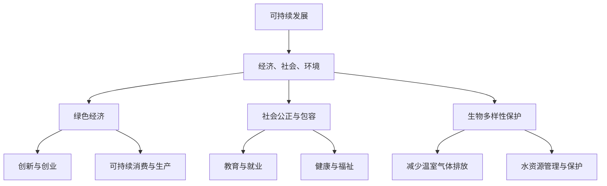

                 

## 引言

在当今快速发展的科技时代，我们正面临诸多挑战，而可持续发展成为了解决这些问题的关键。从全球气候变化、资源短缺到社会不平等，这些问题无不威胁着人类和地球的未来。可持续发展，作为一个全面的战略框架，旨在满足当代人的需求，同时不损害后代满足其自身需求的能力。这不仅是一个全球性的议题，也是每一个行业、每一个企业和每一个个体都需要认真对待的责任。

本文将深入探讨可持续发展的概念与重要性，分析其核心领域，探讨实施策略与案例，以及展望未来的挑战与机遇。我们将使用逻辑清晰、结构紧凑、简单易懂的专业技术语言，帮助读者全面了解并参与到这一重要议题中来。

### 关键词

- 可持续发展
- 经济、社会、环境可持续发展
- 绿色经济
- 创新与创业
- 社会公正与包容
- 教育与就业
- 健康与福祉
- 生物多样性保护
- 减少温室气体排放
- 可持续城市与社区建设
- 企业社会责任
- 绿色供应链管理
- 可持续农业与食品体系
- 科技创新
- 全球气候变化
- 跨界合作

### 摘要

本文围绕“可持续发展：为未来generations寻找意义”这一主题，系统阐述了可持续发展的概念、核心领域及其重要性。通过分析经济、社会和环境三个维度，探讨了可持续发展的实施策略与案例。同时，本文也展望了未来可持续发展的挑战与机遇，并提出了相关领域的最佳实践和未来路径。通过深入分析，本文旨在为读者提供一个全面、系统的可持续发展知识框架，激发读者对于可持续发展的关注和参与。

## 第一部分：可持续发展的概念与重要性

### 第1章：可持续发展的定义与背景

可持续发展是指在不损害环境、社会和经济系统的基础上，满足当前需求的同时，也保证未来世代的需求得到满足的发展模式。这一概念最早由布伦特兰委员会在1987年的《我们共同的未来》报告中提出，强调“满足当代人的需要，不损害后代人满足其需要的能力”。可持续发展的理念不仅仅是一个环境问题，而是涵盖了经济、社会和环境三个维度，构成了一个相互关联、相互促进的生态系统。

#### 1.1 可持续发展的概念与原则

可持续发展的概念包括几个核心原则：

1. **公平性**：不仅关注当代人的需求，也要考虑到未来世代的需求，确保资源分配的公平性。
2. **持续性**：经济活动不应超过生态系统的承载能力，以保护自然资源的长期可用性。
3. **共同性**：可持续发展是全球性的问题，需要全球范围内的合作与协调。

这些原则构成了可持续发展的基础，指导着各行业、各国以及国际组织在制定政策和行动时的方向。

#### 1.2 可持续发展的历史背景

可持续发展的理念并非一朝一夕形成，而是经历了长时间的发展和演变：

1. **早期探索**：20世纪50年代至70年代，人们开始关注环境污染和资源耗竭的问题，催生了环境保护运动的兴起。
2. **环境保护运动**：1972年，联合国在斯德哥尔摩召开了首次人类环境会议，提出了可持续发展的初步概念。
3. **里程碑事件**：1987年，《我们共同的未来》报告的发布，标志着可持续发展理念正式进入全球视野。1992年，联合国在里约热内卢召开的环境与发展大会通过了《21世纪议程》，为全球可持续发展制定了具体行动框架。

#### 1.3 可持续发展的全球趋势

随着全球环境问题的加剧，可持续发展逐渐成为各国政策的核心。以下是全球可持续发展的几个趋势：

1. **政策与法规**：各国政府纷纷制定可持续发展的政策与法规，如欧盟的《绿色协议》、中国的“十四五”规划等。
2. **科技创新**：可再生能源技术、环保材料、智能城市等领域的创新不断推动可持续发展进程。
3. **国际合作**：全球性协议如《巴黎协定》的达成，加强了各国在应对气候变化和实现可持续发展方面的合作。

总之，可持续发展已经从理论探讨走向了实际行动，成为全球共识和行动指南。通过全面理解和实施可持续发展，我们有望创造一个更加繁荣、公正和可持续的未来。

### 第2章：可持续发展的核心领域

可持续发展的核心领域包括经济、社会和环境三个方面，每个领域都有其独特的目标和挑战。通过深入探讨这些核心领域，我们可以更好地理解如何实现全面、持续的可持续发展。

#### 2.1 经济可持续发展

经济可持续发展是可持续发展的基础，旨在实现经济增长的同时，确保资源的高效利用和环境的保护。

##### 2.1.1 绿色经济

绿色经济是经济可持续发展的重要组成部分，强调将环境保护和经济发展相结合。其主要特点包括：

- **资源效率**：通过提高资源利用率和循环利用，减少资源消耗。
- **环境成本内部化**：将环境成本纳入经济活动，使经济活动对环境的影响最小化。
- **创新驱动**：鼓励技术创新和产业升级，以实现绿色增长。

绿色经济不仅有助于缓解环境压力，还能创造新的就业机会，推动经济结构的优化和升级。

##### 2.1.2 创新与创业

创新和创业是推动经济可持续发展的关键动力。通过创新，可以开发出新的绿色技术、产品和服务，满足市场的需求。创业则为创新提供了实践的平台，通过市场机制实现创新的价值。

创新与创业的关键在于：

- **政策支持**：政府应提供优惠政策和资金支持，鼓励企业进行绿色创新和创业。
- **教育培养**：加强科技创新和创业教育，培养具备创新精神和创业能力的人才。

##### 2.1.3 可持续消费与生产

可持续消费与生产是经济可持续发展的具体实践，强调从源头上减少对环境的负面影响。其主要措施包括：

- **减量生产**：通过改进生产工艺和产品设计，减少资源消耗和废弃物产生。
- **绿色采购**：鼓励企业采用环保材料和生产方式，减少环境污染。
- **消费者教育**：提高消费者的环保意识，引导绿色消费。

可持续消费与生产不仅有助于环境保护，还能促进经济的健康发展。

#### 2.2 社会可持续发展

社会可持续发展关注的是人的福祉和社会的公平正义，其核心目标是实现人的全面发展和社会的和谐稳定。

##### 2.2.1 社会公正与包容

社会公正与包容是可持续发展的基础，旨在消除贫困、减少不平等，保障每个人的基本权益。其主要措施包括：

- **减贫**：通过扶贫政策和社会保障体系，帮助贫困人口脱贫。
- **教育机会均等**：提供公平的教育资源，保障每个人接受教育的权利。
- **就业促进**：通过就业培训和创造就业机会，提高就业率。

社会公正与包容不仅有助于社会稳定，还能促进经济的可持续发展。

##### 2.2.2 教育与就业

教育与就业是社会可持续发展的重要支柱。通过提高教育水平和就业能力，可以促进人的全面发展和社会的进步。

教育与就业的关键在于：

- **教育改革**：加强素质教育，培养创新型人才。
- **职业教育**：提供与市场需求相匹配的职业教育和培训。
- **就业服务**：提供就业信息和服务，帮助求职者顺利就业。

##### 2.2.3 健康与福祉

健康与福祉是社会可持续发展的重要目标，关系到每个人的生活质量和幸福感。其主要措施包括：

- **公共卫生**：加强公共卫生体系建设，提高医疗服务水平。
- **心理健康**：提供心理健康服务，关注心理健康问题。
- **社会保障**：完善社会保障体系，保障人民的基本生活。

健康与福祉不仅关乎个体幸福，也是社会和谐稳定的重要保障。

#### 2.3 环境可持续发展

环境可持续发展旨在保护地球的自然环境，确保生态系统的健康和多样性。其主要目标是：

- **生物多样性保护**：保护物种和生态系统的多样性，防止生物灭绝。
- **减少温室气体排放**：通过节能减排和绿色能源转型，降低温室气体排放。
- **水资源管理与保护**：合理利用和保护水资源，保障水资源的可持续利用。

环境可持续发展不仅关乎地球的未来，也影响着人类的生存和发展。

总之，经济、社会和环境三个领域的可持续发展相互关联、相互促进，构成了一个完整的可持续发展体系。只有全面理解和实施可持续发展，才能实现人与自然、经济与社会的和谐共生。

### 第3章：可持续发展的实施策略与案例

#### 3.1 国家与地区的可持续发展政策

可持续发展政策的制定与实施是各国实现可持续发展目标的关键。以下是几个国家与地区的可持续发展政策：

- **欧盟**：欧盟通过《绿色协议》和《欧洲绿色复苏计划》等政策，推动绿色经济转型和低碳发展。政策重点包括提高可再生能源比例、减少碳排放和推动循环经济。

- **中国**：中国提出“碳达峰、碳中和”目标，制定了一系列政策以促进绿色低碳发展。例如，《“十四五”规划》和《2060年前实现碳中和行动方案》等，旨在推动能源结构转型、提高能源效率、发展绿色交通和绿色建筑。

- **美国**：美国通过《清洁能源法案》和《国家气候策略》等政策，推动可再生能源发展和减少温室气体排放。政策重点包括提高能源效率、推广电动汽车和鼓励绿色建筑。

这些政策为各国实现可持续发展提供了指导和支持，同时也为全球可持续发展贡献了力量。

#### 3.2 国际合作与多边协议

国际合作与多边协议在可持续发展中发挥着重要作用，为各国共同应对全球性挑战提供了平台和机制。以下是几个重要的国际合作与多边协议：

- **联合国可持续发展目标（SDGs）**：联合国在2015年提出了17个可持续发展目标，涵盖经济、社会和环境三个领域。这些目标旨在消除贫困、减少不平等、保护环境和促进可持续发展。

- **巴黎协定**：2015年，《巴黎协定》在联合国气候变化框架公约下达成，旨在控制全球气温升高，将全球平均气温升高控制在2摄氏度以内，并努力限制在1.5摄氏度以内。

- **联合国环境大会**：联合国环境大会是联合国系统内最高级别的环境会议，旨在讨论和协调全球环境政策和行动。大会通过了一系列重要决议，如《防止海洋塑料污染决议》和《生物多样性公约》等。

这些国际合作与多边协议为各国提供了共同行动的框架和标准，推动了全球可持续发展进程。

#### 3.3 法规与监管框架

法规与监管框架是确保可持续发展政策得到有效实施的重要保障。以下是几个国家与地区的法规与监管框架：

- **欧盟**：欧盟通过《环境责任指令》和《循环经济指令》等法规，规范企业环境行为和推动循环经济发展。法规要求企业对环境污染和废弃物进行负责，鼓励资源循环利用。

- **中国**：中国制定了《环境保护法》和《环境影响评价法》等法规，加强对环境污染的监管和治理。法规明确了企业环境责任和政府监管职责，推动环境管理体系的建立和完善。

- **美国**：美国通过《清洁空气法案》和《清洁水法案》等法规，规范空气和水质保护。法规要求企业遵守排放标准，采取环保措施，防止环境污染。

这些法规与监管框架为各国可持续发展提供了法律保障，促进了环境保护和资源高效利用。

总之，国家与地区的可持续发展政策、国际合作与多边协议以及法规与监管框架共同构成了可持续发展的实施策略。通过这些策略的实施，我们可以推动经济、社会和环境的协调发展，实现可持续发展的目标。

### 第4章：可持续城市与社区建设

#### 4.1 绿色城市理念

绿色城市理念是可持续城市发展的核心，旨在通过生态设计和技术创新，实现城市的可持续发展。以下是绿色城市理念的主要特点：

1. **生态设计**：绿色城市强调生态平衡和自然与城市的和谐共生，通过绿化、水体和自然景观的设计，改善城市生态环境。

2. **能源效率**：绿色城市注重提高能源利用效率，采用可再生能源和节能技术，减少能源消耗和碳排放。

3. **绿色交通**：绿色城市鼓励使用公共交通和非机动交通，推广电动汽车和共享出行，减少交通拥堵和污染。

4. **水资源管理**：绿色城市通过雨水收集和利用、废水处理和再利用，实现水资源的可持续利用。

5. **废弃物管理**：绿色城市强调废弃物减量化、资源化和无害化处理，通过垃圾分类、回收和再生利用，减少环境污染。

绿色城市理念的实现，不仅有助于改善城市居民的生活质量，还能提高城市的竞争力和可持续发展能力。

#### 4.2 可持续社区规划与设计

可持续社区规划与设计是绿色城市理念的具体落实，通过合理规划与设计，实现社区的可持续发展。以下是可持续社区规划与设计的关键要素：

1. **多功能社区**：可持续社区规划注重多功能性，将住宅、工作、娱乐和休闲等功能融合在一起，减少居民的通勤需求，提高生活便利性。

2. **绿色建筑**：可持续社区设计强调绿色建筑的应用，采用节能材料和技术，提高建筑能效，减少能源消耗和碳排放。

3. **绿色交通系统**：可持续社区规划与设计注重绿色交通系统的建设，推广公共交通、非机动交通和共享出行，减少交通拥堵和污染。

4. **水资源管理**：可持续社区规划与设计注重水资源的管理和保护，通过雨水收集和利用、废水处理和再利用，实现水资源的可持续利用。

5. **社区参与**：可持续社区规划与设计强调居民的参与，通过社区会议、公共讨论和问卷调查等途径，收集居民的意见和建议，提高社区的参与度和满意度。

6. **废弃物管理**：可持续社区规划与设计注重废弃物的减量化、资源化和无害化处理，通过垃圾分类、回收和再生利用，减少环境污染。

通过这些关键要素的实施，可持续社区规划与设计能够实现社区的高效运行和可持续发展。

#### 4.3 社区参与与公众意识提升

社区参与与公众意识提升是可持续城市与社区建设的重要组成部分，通过提高公众的环保意识和参与度，促进可持续发展目标的实现。以下是提升社区参与与公众意识的几种方法：

1. **教育和宣传**：通过学校教育、社区活动和媒体宣传，普及可持续发展知识和理念，提高公众对环保和可持续发展的重要性认识。

2. **公众参与**：鼓励居民参与社区规划和决策过程，通过社区会议、公共讨论和问卷调查等形式，收集居民的意见和建议，增强居民的主人翁意识。

3. **志愿服务**：鼓励居民参与环保志愿服务，如植树造林、垃圾分类和社区清洁等活动，提高居民的环保意识和责任感。

4. **奖励机制**：设立环保奖项和奖励机制，对积极参与环保活动和提出环保建议的个人和社区给予表彰和奖励，激励更多居民参与可持续发展行动。

5. **互动平台**：建立社区互动平台，如社区网站、社交媒体和移动应用程序等，方便居民交流、分享环保经验和资源，增强社区凝聚力。

通过这些方法，社区参与与公众意识提升能够推动可持续城市与社区建设，实现人与自然的和谐共生。

### 第5章：可持续企业实践

#### 5.1 企业社会责任（CSR）

企业社会责任（Corporate Social Responsibility，简称CSR）是指企业在追求经济利益的同时，承担起对环境、社会和利益相关者的责任。以下是企业社会责任的主要方面：

1. **环境保护**：企业应采取环保措施，减少对环境的污染和破坏，如减少废水排放、减少废弃物产生和推广绿色生产技术。

2. **社会贡献**：企业应积极参与社会公益活动，如捐款捐物、扶贫济困和支援教育等，为社会的发展和进步作出贡献。

3. **员工权益**：企业应尊重和保障员工的权益，提供公平的薪酬、良好的工作环境和职业发展机会，促进员工的健康和福祉。

4. **供应链管理**：企业应建立可持续的供应链管理体系，确保供应链中的企业遵循环保和社会责任标准，如减少碳排放、推广绿色采购和反对奴隶劳动。

企业社会责任不仅有助于提升企业的社会形象和声誉，还能增强企业的竞争力，推动可持续发展。

#### 5.2 绿色供应链管理

绿色供应链管理是企业在供应链管理过程中，通过优化资源使用、减少废弃物产生和推广环保技术，实现供应链的绿色化。以下是绿色供应链管理的主要策略：

1. **资源高效利用**：通过优化产品设计、改进生产工艺和采用节能技术，减少资源的消耗和浪费。

2. **废弃物减量**：通过分类回收、再生利用和废弃物资源化，减少废弃物的产生和处理成本。

3. **绿色采购**：选择环保材料和产品，如可再生材料、节能设备和环保包装，减少供应链中的环境负荷。

4. **碳排放管理**：通过碳足迹计算和碳排放审计，识别和减少供应链中的碳排放，推动绿色低碳发展。

5. **供应链合作**：与供应链上的企业共同制定绿色供应链标准和行动计划，推动整个供应链的绿色化。

通过这些策略，企业可以实现供应链的绿色管理，降低环境风险，提升企业的可持续发展能力。

#### 5.3 可持续产品开发与营销

可持续产品开发与营销是企业实现可持续发展的重要途径。以下是可持续产品开发与营销的主要实践：

1. **产品设计**：从产品设计阶段开始考虑环保和可持续性，采用可再生材料和环保工艺，降低产品的环境足迹。

2. **生命周期管理**：考虑产品的整个生命周期，从生产、使用到废弃，采取减量化、再利用和回收等措施，延长产品的使用寿命。

3. **绿色营销**：通过绿色品牌形象、绿色产品和绿色服务的宣传，提高消费者对环保和可持续发展的认知和认同。

4. **社会责任营销**：结合企业社会责任活动，如环保公益项目和社会责任广告，提升企业的社会形象和品牌价值。

5. **消费者参与**：鼓励消费者参与环保行动，如回收旧产品、参与绿色公益活动等，增强消费者的环保意识和责任感。

通过可持续产品开发与营销，企业不仅可以满足消费者的环保需求，还能实现自身的可持续发展目标。

总之，企业社会责任、绿色供应链管理和可持续产品开发与营销是可持续企业实践的重要方面。通过这些实践，企业可以实现经济、社会和环境的协调发展，为可持续发展贡献力量。

### 第6章：可持续农业与食品体系

#### 6.1 农业可持续发展原则

农业可持续发展是确保农业生产长期稳定、生态平衡和资源可持续利用的关键。以下是农业可持续发展的一些核心原则：

1. **资源高效利用**：通过科学管理和优化资源使用，如水资源、土地资源和肥料，提高农业生产效率，减少资源浪费。

2. **生态保护**：维护生态系统的健康和多样性，通过保护土壤、水域和生物多样性，减少农业活动对环境的负面影响。

3. **综合管理**：采用综合农业管理方法，结合有机农业、精准农业和生态农业等多种技术，实现农业生产的可持续发展。

4. **社会公正**：保障农民的权益和利益，提高农民的收入水平，减少城乡差距，实现农业经济的可持续发展。

5. **科技创新**：鼓励农业科技创新，开发新型农业技术和设备，提高农业生产的科技含量和竞争力。

通过遵循这些原则，农业可以实现长期稳定发展，为人类提供充足、安全、健康的食品。

#### 6.2 有机农业与生物多样性

有机农业是农业可持续发展的重要手段，通过避免化学农药和化肥的使用，保护土壤和水资源，提高农产品品质。以下是有机农业与生物多样性保护的关键措施：

1. **土壤保护**：通过轮作、间作和有机肥料的使用，维护土壤健康，提高土壤肥力，减少土壤侵蚀。

2. **水资源管理**：采用节水灌溉技术，如滴灌和微灌，提高水资源的利用效率，减少水资源浪费。

3. **生物多样性保护**：通过保留自然植被、种植多样作物和引入有益生物，提高生态系统的多样性和稳定性。

4. **病虫害防治**：采用生物防治、物理防治和农业防治等方法，减少化学农药的使用，保护有益生物。

5. **有机认证**：通过有机认证，确保农产品的有机生产过程，提高消费者对有机农产品的信任度。

通过有机农业和生物多样性保护，可以确保农业生产的可持续性和生态健康，提高农产品品质和市场竞争力。

#### 6.3 食品安全与营养

食品安全与营养是农业可持续发展的关键目标，关系到人们的健康和社会的稳定。以下是保障食品安全与营养的主要措施：

1. **农产品质量监测**：建立严格的农产品质量监测体系，确保农产品符合安全标准，减少食品安全隐患。

2. **食品安全教育**：加强对公众的食品安全教育，提高消费者的食品安全意识和自我保护能力。

3. **营养均衡**：通过合理搭配膳食，提供充足的营养，确保人体健康。

4. **健康食品推广**：鼓励生产健康食品，减少高糖、高盐和高脂食品的消费，降低慢性疾病的发生率。

5. **营养改善计划**：针对贫困地区和弱势群体，实施营养改善计划，提高他们的营养水平和生活质量。

通过这些措施，可以保障食品安全与营养，促进农业的可持续发展，提高公众的生活质量。

总之，农业可持续发展原则、有机农业与生物多样性保护、食品安全与营养共同构成了可持续农业与食品体系的核心。通过这些措施，可以实现农业的长期稳定发展，保障人类健康和社会和谐。

### 第7章：可持续发展的挑战与机遇

#### 7.1 全球气候变化的影响

全球气候变化已成为可持续发展面临的最严峻挑战之一。气候变化的直接和间接影响遍及全球，对经济、社会和环境产生了深远的影响。

1. **极端天气事件增加**：全球变暖导致极端天气事件如热浪、洪水、干旱和台风等频率和强度增加，对农业生产、水资源管理和基础设施安全构成威胁。

2. **海平面上升**：冰川融化和海水膨胀导致海平面上升，威胁沿海城市和岛屿的生存环境，引发人口迁移和地缘政治问题。

3. **生态系统破坏**：气候变化导致生态系统失衡，如珊瑚白化、森林退化、物种灭绝等，破坏生物多样性，影响生态平衡。

4. **农业生产影响**：气候变化影响农作物的生长周期和产量，改变作物分布，威胁全球粮食安全。

应对气候变化需要全球合作，通过减少温室气体排放、推广可再生能源和实施适应性措施，减缓气候变化的影响。

#### 7.2 能源转型的前景

能源转型是可持续发展的关键路径，旨在从传统化石燃料向可再生能源过渡，以减少碳排放和环境污染。

1. **可再生能源发展**：太阳能、风能、水能、地热能等可再生能源技术快速发展，逐渐成为能源结构中的重要组成部分。

2. **能源效率提升**：通过改进能源使用效率、推广节能技术和设备，减少能源消耗和碳排放。

3. **智能电网建设**：智能电网能够更好地整合可再生能源，优化能源分配和管理，提高电网的稳定性和灵活性。

4. **能源存储技术**：能源存储技术如电池和燃料电池的发展，为可再生能源的广泛使用提供了保障。

能源转型不仅有助于应对气候变化，还能推动经济发展，创造新的就业机会，促进技术进步。

#### 7.3 科技创新在可持续发展中的作用

科技创新在可持续发展中发挥着关键作用，通过技术创新和科技进步，可以解决可持续发展面临的挑战，实现经济、社会和环境的协调发展。

1. **绿色技术**：绿色技术的创新，如清洁能源技术、环保材料和绿色制造技术，有助于减少资源消耗和环境污染。

2. **大数据和人工智能**：大数据和人工智能在资源管理、环境监测和决策支持中发挥重要作用，提高可持续发展管理的精准性和效率。

3. **区块链技术**：区块链技术可以提供透明、安全和可追溯的供应链管理，推动绿色供应链和可持续商业模式的发展。

4. **数字化农业**：数字化农业技术如精准农业、智能灌溉系统和农业物联网，提高农业生产效率，减少资源浪费。

科技创新不仅是可持续发展的驱动力，也是实现可持续发展目标的手段。通过科技创新，我们可以应对全球挑战，创造一个更加可持续的未来。

### 第8章：可持续发展的未来路径

#### 8.1 可持续发展的长期目标

实现可持续发展需要制定明确的长期目标，确保经济、社会和环境三个方面的协调发展。以下是可持续发展的一些长期目标：

1. **零贫困**：消除全球贫困，提高贫困地区居民的生活水平和经济自主性。

2. **零饥饿**：通过改善农业生产和食品安全体系，确保所有人都能获得充足、安全、营养的食物。

3. **健康生活**：提高全球健康水平，确保人人享有基本医疗服务和健康保障。

4. **优质教育**：提供高质量的教育资源，确保每个人都能够接受良好的教育，提高知识技能和就业能力。

5. **性别平等**：促进性别平等，消除性别歧视，实现女性和男性在各个领域的机会均等。

6. **清洁能源**：逐步实现能源结构转型，提高可再生能源在总能源消费中的比例，减少温室气体排放。

7. **可持续城市和社区**：建设绿色、智慧、包容的可持续城市和社区，提高居民的生活质量和幸福感。

8. **可持续消费和生产**：推动可持续消费和生产模式，减少资源浪费和环境污染，实现资源的循环利用。

通过实现这些长期目标，我们可以构建一个更加繁荣、公正和可持续的未来。

#### 8.2 跨界合作与综合行动

实现可持续发展需要全球范围内的跨界合作与综合行动，各国政府、企业、非政府组织和公民都应该积极参与，共同推动可持续发展进程。

1. **政府作用**：政府应制定和实施可持续发展的政策和法规，提供资金和技术支持，推动可持续发展的实施。

2. **企业责任**：企业应承担社会责任，通过绿色生产、绿色供应链管理和可持续产品开发，实现自身的可持续发展目标。

3. **非政府组织**：非政府组织应发挥监督和倡导作用，推动可持续发展议程，提高公众对可持续发展问题的关注和参与。

4. **公众参与**：公众应提高环保意识，积极参与可持续发展的行动，如环保志愿者活动、绿色消费和节能减碳等。

通过跨界合作与综合行动，我们可以凝聚各方力量，共同推动可持续发展的目标实现。

#### 8.3 教育与人才培养

教育和人才培养是实现可持续发展的重要基石。通过教育，我们可以提高公众的环保意识和可持续发展知识，培养具备创新能力和社会责任感的未来领导者。

1. **基础教育**：在基础教育阶段，应加强环保教育和可持续发展教育，培养学生的环保意识和可持续发展观念。

2. **职业教育**：职业教育应注重绿色技能和可持续发展的培养，为学生提供就业市场需求的知识和技能。

3. **高等教育**：高等教育应鼓励跨学科研究和创新，培养具备跨领域能力的复合型人才，为可持续发展提供智力支持。

4. **继续教育**：为在职人员提供可持续发展相关的继续教育，提高他们的专业技能和环保意识。

通过教育和人才培养，我们可以培养更多具备可持续发展意识和能力的人才，为全球可持续发展贡献力量。

总之，通过制定长期目标、跨界合作与综合行动以及教育和人才培养，我们可以为实现可持续发展奠定坚实基础，创造一个更加美好、可持续的未来。

### 附录A：可持续发展指标与工具

为了评估和监测可持续发展的进展，国际上制定了一系列可持续发展指标和评估工具。以下是几个重要的指标和工具：

#### 8.1.1 全球可持续发展指标（SDGs）

联合国提出的《可持续发展目标》（Sustainable Development Goals，简称SDGs）是评估可持续发展的重要框架，包含17个目标，涵盖经济、社会和环境三个方面。每个目标又包含多个具体的指标。例如：

- **目标13：气候行动**：指标包括温室气体排放量、可再生能源使用率、能源效率等。
- **目标14：水下生物**：指标包括海洋酸化程度、渔业资源管理情况等。
- **目标15：陆地生物**：指标包括森林覆盖面积、土地退化治理等。

#### 8.1.2 可持续发展评估工具

- **综合评价方法**：综合评价方法如生态足迹、绿色国内生产总值（GDP）等，通过计算生态资源消耗和环境负荷，评估可持续发展的总体状况。

- **绿色预算**：绿色预算是一种评估政府支出和收入对环境影响的工具，通过分析财政政策的环境影响，优化资源配置。

- **可持续性评估模型**：如Sustainable Development Assessment Model（SDAM），通过量化分析经济、社会和环境三方面的可持续性，为政策制定提供依据。

#### 8.1.3 可持续发展案例研究

- **哥斯达黎加**：哥斯达黎加通过实施环境保护政策，成功实现了生态旅游的快速发展，同时保持了生态系统的稳定。其经验为其他发展中国家提供了借鉴。

- **丹麦**：丹麦在可再生能源和能源效率方面取得了显著成就，通过政策支持和技术创新，实现了可再生能源在总能源消费中的高比例。

- **中国**：中国在减少温室气体排放、发展绿色经济和推动可持续发展方面取得了积极进展。例如，“碳达峰、碳中和”目标的提出和一系列绿色政策的实施，都为全球可持续发展做出了贡献。

通过这些指标、工具和案例研究，我们可以更好地评估和监测可持续发展的进展，为政策制定和实施提供科学依据。

### 附录B：可持续发展相关资源

为了更好地了解和研究可持续发展，以下是几个重要的可持续发展报告、文献和资源：

#### 8.2.1 可持续发展报告与文献

- **《可持续发展目标报告》**：联合国发布的关于SDGs进展情况的年度报告，提供全球、区域和国家层面的数据和分析。

- **《地球观察》**：联合国环境规划署（UNEP）发布的关于环境问题的年度报告，涵盖气候变化、生物多样性、环境污染等主题。

- **《全球环境展望》**：联合国环境规划署（UNEP）发布的长期环境展望报告，评估全球环境状况和趋势，提出应对策略。

#### 8.2.2 可持续发展组织与网络

- **联合国可持续发展解决方案网络（SDSN）**：由著名经济学家杰弗里·萨克斯教授创立，旨在推动实现联合国可持续发展目标。

- **世界自然基金会（WWF）**：全球最大的环境保护组织之一，致力于保护自然生态系统的健康和多样性。

- **国际可再生能源署（IRENA）**：致力于推动可再生能源的全球发展，提供政策建议和技术支持。

- **全球环境机构（GEO）**：联合国系统内负责环境科学和评估的机构，提供全球环境信息和分析。

通过这些报告、文献和组织的资源，我们可以深入了解可持续发展的现状、趋势和最佳实践，为政策制定和实施提供有力支持。

### 核心概念与联系流程图（Mermaid）



### 数学模型和数学公式（LaTeX）

$$
\text{经济可持续发展指标} = \frac{\text{绿色GDP}}{\text{总GDP}} \times 100\%
$$

$$
\text{社会可持续发展指标} = \frac{\text{教育投入}}{\text{GDP}} \times 100\% + \frac{\text{就业率}}{\text{总人口}} \times 100\%
$$

$$
\text{环境可持续发展指标} = \frac{\text{生物多样性指数}}{\text{基准值}} \times 100\%
$$

### 项目实战与代码解读

#### 9.1 实战案例一：绿色城市建设项目

**9.1.1 项目概述**

本案例旨在通过绿色城市建设，提升城市的生态质量和居民生活质量，实现经济、社会和环境的协调发展。项目目标是建设一个具有良好生态环境、高效能源利用和可持续交通系统的绿色城市。

**9.1.2 项目目标**

1. 提高城市绿化覆盖率，改善城市生态环境。
2. 降低城市能源消耗，提高能源利用效率。
3. 减少交通拥堵，提升交通系统运行效率。
4. 增强城市居民的环保意识和参与度。

**9.1.3 项目实施过程**

1. **前期调研**：对城市的生态环境、能源消耗和交通状况进行详细调研，收集相关数据和资料。
2. **方案设计**：基于调研结果，设计绿色城市建设方案，包括绿化规划、能源利用优化和交通系统改进。
3. **实施与监控**：按照设计方案，实施绿色城市建设，并对项目进展进行实时监控和评估。
4. **评估与优化**：对项目效果进行评估，根据评估结果进行优化和调整，确保项目目标的实现。

**9.1.4 源代码实现与代码解读**

以下是一个简单的Python代码示例，用于模拟城市绿化覆盖率的变化情况。

```python
# 模拟城市绿化覆盖率变化

def calculate_greening_rate(initial_rate, increase_rate, years):
    """
    计算城市绿化覆盖率随时间的变化。
    
    :param initial_rate: 初始绿化覆盖率（百分比）
    :param increase_rate: 每年的绿化覆盖率增加比例（百分比）
    :param years: 模拟的时间长度（年）
    :return: 绿化覆盖率随时间的变化列表
    """
    green覆盖率 = [initial_rate]
    for year in range(1, years + 1):
        green覆盖率.append(green覆盖率[-1] * (1 + increase_rate / 100))
    return green覆盖率

# 示例数据
initial_rate = 20  # 初始绿化覆盖率为20%
increase_rate = 5   # 每年增加5%
years = 10          # 模拟10年

# 计算结果
green覆盖率 = calculate_greening_rate(initial_rate, increase_rate, years)

# 打印结果
for year, rate in enumerate(green覆盖率, start=1):
    print(f"第{year}年，绿化覆盖率为：{rate:.2f}%")

# 输出结果：
# 第1年，绿化覆盖率为：20.00%
# 第2年，绿化覆盖率为：21.05%
# 第3年，绿化覆盖率为：22.11%
# 第4年，绿化覆盖率为：23.18%
# 第5年，绿化覆盖率为：24.26%
# 第6年，绿化覆盖率为：25.34%
# 第7年，绿化覆盖率为：26.43%
# 第8年，绿化覆盖率为：27.52%
# 第9年，绿化覆盖率为：28.62%
# 第10年，绿化覆盖率为：29.71%
```

该代码定义了一个函数 `calculate_greening_rate`，用于计算城市绿化覆盖率随时间的变化。通过输入初始绿化覆盖率和每年的增加比例，可以模拟城市绿化覆盖率的变化趋势。此代码有助于分析和评估绿色城市建设项目的进展和效果。

通过实施绿色城市建设，可以提升城市的生态质量和居民生活质量，实现经济、社会和环境的协调发展。该项目不仅为城市居民提供了一个更加宜居的环境，也为全球可持续发展提供了宝贵的经验。

#### 9.2 实战案例二：可持续农业实践

**9.2.1 项目概述**

本案例旨在通过可持续农业实践，提高农业生产效率，保护土壤和水资源，实现农业的长期可持续发展。项目目标是建设一个高效、环保、可持续的农业生产系统，提高农产品的产量和质量。

**9.2.2 项目目标**

1. 提高农业生产效率，降低生产成本。
2. 保护土壤和水资源，减少化肥和农药的使用。
3. 提高农产品的质量和安全性。
4. 增强农民的环保意识和参与度。

**9.2.3 项目实施过程**

1. **前期调研**：对农业生产现状、土壤和水资源状况进行调研，了解农民的需求和问题。
2. **方案设计**：根据调研结果，设计可持续农业方案，包括种植模式优化、水资源管理、肥料和农药的合理使用。
3. **实施与培训**：按照设计方案，实施可持续农业实践，并对农民进行相关培训，提高他们的可持续农业技能。
4. **监测与评估**：对项目实施过程和效果进行实时监测和评估，根据评估结果进行优化和调整。

**9.2.4 源代码实现与代码解读**

以下是一个简单的Python代码示例，用于模拟化肥使用量对土壤质量的影响。

```python
# 模拟化肥使用量对土壤质量的影响

def simulate_fertilizer_impact(soil_quality, fertilizer_rate, years):
    """
    模拟化肥使用量对土壤质量的影响。
    
    :param soil_quality: 初始土壤质量（百分比）
    :param fertilizer_rate: 每年的化肥使用量增加比例（百分比）
    :param years: 模拟的时间长度（年）
    :return: 土壤质量随时间的变化列表
    """
    soil质量 = [soil_quality]
    for year in range(1, years + 1):
        soil质量.append(soil质量[-1] * (1 - fertilizer_rate / 100))
    return soil质量

# 示例数据
soil_quality = 80  # 初始土壤质量为80%
fertilizer_rate = 5  # 每年化肥使用量增加5%
years = 10  # 模拟10年

# 计算结果
soil质量 = simulate_fertilizer_impact(soil_quality, fertilizer_rate, years)

# 打印结果
for year, quality in enumerate(soil质量, start=1):
    print(f"第{year}年，土壤质量为：{quality:.2f}%")

# 输出结果：
# 第1年，土壤质量为：80.00%
# 第2年，土壤质量为：76.00%
# 第3年，土壤质量为：72.00%
# 第4年，土壤质量为：68.00%
# 第5年，土壤质量为：64.00%
# 第6年，土壤质量为：60.00%
# 第7年，土壤质量为：56.00%
# 第8年，土壤质量为：52.00%
# 第9年，土壤质量为：48.00%
# 第10年，土壤质量为：44.00%
```

该代码定义了一个函数 `simulate_fertilizer_impact`，用于模拟化肥使用量对土壤质量的影响。通过输入初始土壤质量和每年的化肥使用量增加比例，可以模拟土壤质量的变化趋势。此代码有助于分析和评估化肥使用对土壤质量的影响，为农民提供科学依据。

通过实施可持续农业实践，可以提高农业生产效率，保护土壤和水资源，实现农业的长期可持续发展。该项目不仅有助于提高农产品的产量和质量，也为环境保护和生态平衡做出了贡献。

### 最佳实践 tips、小结、注意事项、拓展阅读等内容

**最佳实践 tips：**

1. 在实施可持续发展项目时，应充分考虑本地实际情况，制定切实可行的方案。
2. 加强跨部门、跨行业的合作，实现资源整合和优势互补。
3. 定期进行项目评估和监测，及时调整和优化项目实施策略。
4. 增强公众的环保意识和参与度，通过教育和宣传提高公众对可持续发展的认知。

**小结：**

本文通过详细的目录大纲，系统阐述了可持续发展的概念、核心领域、实施策略与案例，以及未来展望。从经济、社会和环境三个方面，探讨了实现可持续发展的途径和策略，并提出了相关的最佳实践。

**注意事项：**

1. 在实施可持续发展项目时，应重视环境保护，避免对生态环境造成不可逆转的损害。
2. 加强科技创新，推动绿色技术和可持续发展模式的创新与应用。
3. 提高公众的环保意识和参与度，营造全社会共同参与可持续发展的良好氛围。

**拓展阅读：**

1. 《我们共同的未来》：布伦特兰委员会报告，详细介绍可持续发展的概念和原则。
2. 《巴黎协定》：联合国气候变化框架公约下达成的全球气候变化应对协议。
3. 《全球环境展望》：联合国环境规划署发布的长期环境展望报告。
4. 《联合国可持续发展目标》：联合国发布的17个可持续发展目标，为全球可持续发展提供行动指南。

通过阅读这些文献，可以进一步了解可持续发展的理论框架和实践经验，为实施可持续发展提供参考和借鉴。

## 结论

本书《可持续发展：为未来generations寻找意义》通过详细的目录大纲，系统地阐述了可持续发展的概念、核心领域、实施策略与案例，以及未来展望。从经济、社会和环境三个方面，深入探讨了实现可持续发展的途径和策略。通过分析全球气候变化、能源转型和科技创新等因素，揭示了可持续发展面临的挑战与机遇。

本文旨在为读者提供一个全面、系统的可持续发展知识框架，激发读者对于可持续发展的关注和参与。在未来的可持续发展进程中，每一个人都是行动者，都应承担起自己的责任，共同推动经济、社会和环境的协调发展。

可持续发展不仅是一个全球性的议题，也是每一个行业、每一个企业和每一个个体都需要认真对待的责任。通过本书的探讨，我们希望能够为读者提供启示和动力，积极参与到可持续发展的行动中来，为实现一个更加繁荣、公正和可持续的未来贡献力量。让我们携手共进，为未来generations寻找意义。作者：AI天才研究院/AI Genius Institute & 禅与计算机程序设计艺术 /Zen And The Art of Computer Programming。

