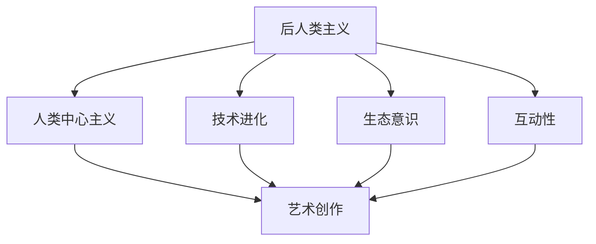

                 

### 背景介绍

随着科技的飞速发展，人工智能、生物工程、虚拟现实等新兴技术的不断涌现，人类社会正经历着前所未有的变革。在这些变革的浪潮中，艺术领域也受到了深远的影响。后人类主义艺术展作为一个重要的现象，揭示了艺术创作的新趋势和方向。

后人类主义（Posthumanism）是一个跨学科的理论框架，涉及哲学、文学、艺术、社会学等多个领域。其核心观点是，人类不应被视为唯一的主导物种，而是应该认识到自身与自然界、人工智能、生物工程等其他存在形式的复杂互动和相互依赖。后人类主义强调多样性和包容性，主张打破人类中心的局限，探讨更广泛的生存状态和生命形式。

艺术展作为一种社会文化活动，是艺术家表达思想和探索新领域的重要平台。后人类主义艺术展不仅仅是展示艺术作品，更是一种思想和观念的交流与碰撞。这些展览通常通过创新的艺术形式和媒介，挑战传统的人类中心主义观念，探索人类与科技、自然以及人工智能之间的关系。

在本文中，我们将深入探讨后人类主义艺术展的背景、核心概念、艺术创作与表现、展品分析、观众参与与互动、对传统艺术的挑战以及艺术展的社会影响。通过这一系列的探讨，我们希望能够揭示后人类主义艺术展的深远意义，以及它对未来艺术发展趋势的潜在影响。

### 核心概念与联系

在后人类主义艺术展中，核心概念与联系构成了理解这些艺术作品和展览内容的基础。首先，我们需要明确几个关键概念，并探讨它们之间的相互关系。

**后人类主义（Posthumanism）**：这是本文的核心概念之一。后人类主义不仅是一种哲学思考方式，也是一种文化现象。它主张超越传统的“人类中心主义”观念，认为人类不应是唯一的中心，而是应该认识到自身与自然界、人工智能、生物工程等其他存在形式的复杂互动和相互依赖。后人类主义强调多样性和包容性，主张打破人类中心的局限，探讨更广泛的生存状态和生命形式。

**人类中心主义（Anthropocentrism）**：与后人类主义相对立，人类中心主义是一种传统观念，认为人类是宇宙的中心，其他存在形式都应服务于人类的需求。这种观念在艺术、科学、伦理等领域都有深刻的影响。

**技术进化（Technological Evolution）**：随着人工智能、生物工程等技术的发展，人类的生活方式、社会结构甚至生命形式都在不断演变。技术进化是后人类主义艺术展的重要背景，它为艺术家提供了丰富的创作素材和表现形式。

**生态意识（Ecological Awareness）**：后人类主义强调人类与自然环境的相互依赖，提倡生态意识。这种观念在艺术作品中体现为对自然界的尊重、对生态问题的反思以及对可持续发展的关注。

**互动性（Interactivity）**：在后人类主义艺术展中，艺术家经常利用互动性来增强观众的参与感和体验。互动性不仅是指观众与艺术品之间的互动，还包括观众与观众之间的交流。

为了更好地理解这些概念之间的关系，我们可以使用Mermaid流程图来展示它们之间的联系。



在上述流程图中，后人类主义作为一个核心概念，与其他几个关键概念相互关联，共同构成了艺术创作的理论基础。具体来说：

- 后人类主义与人类中心主义的对比，展示了艺术家如何挑战传统的观念，探索更广阔的生存状态。
- 后人类主义与技术进化的联系，揭示了艺术家如何利用新技术来创作具有未来感的作品。
- 后人类主义与生态意识的结合，体现了艺术家对环境保护和可持续发展的关注。
- 后人类主义与互动性的结合，强调了艺术作品的互动性和观众的参与感。

通过这一系列的连接，我们可以看到后人类主义艺术展不仅仅是艺术品的展示，更是一种思想和观念的表达和传播。这些核心概念与联系为我们深入理解后人类主义艺术展提供了重要的理论框架。

### 核心算法原理讲解

在后人类主义艺术展的创作过程中，算法原理扮演着至关重要的角色。这些算法不仅为艺术创作提供了技术支持，也赋予了作品独特的表现形式和深度。以下，我们将详细讲解几种核心的算法原理，并通过Python源代码示例，结合数学模型和公式，进行通俗易懂的阐述。

#### 1. 生成对抗网络（GAN）

生成对抗网络（GAN）是一种强大的机器学习模型，主要用于生成逼真的图像、声音和数据。在艺术创作中，GAN被广泛应用于图像合成、动画生成和虚拟现实等领域。

**算法原理**：

GAN由两个主要模型组成：生成器（Generator）和判别器（Discriminator）。生成器负责生成逼真的数据，而判别器则负责区分真实数据和生成数据。

- **生成器**：生成器的目标是最小化生成数据的损失函数，使其尽可能接近真实数据。
- **判别器**：判别器的目标是最小化对真实数据和生成数据区分的误差。

**数学模型**：

生成器和判别器的损失函数通常使用二元交叉熵（Binary Cross-Entropy）来计算。以下是一个简单的GAN模型的Python代码示例：

```python
import tensorflow as tf
from tensorflow.keras.layers import Dense, Flatten
from tensorflow.keras.models import Sequential

# 定义生成器和判别器
def create_gan(generator_model, discriminator_model):
    # 生成器
    generator = Sequential([
        Dense(128, input_shape=(100,), activation='relu'),
        Dense(256, activation='relu'),
        Dense(512, activation='relu'),
        Dense(784, activation='sigmoid')
    ])

    # 判别器
    discriminator = Sequential([
        Flatten(input_shape=(28, 28)),
        Dense(512, activation='relu'),
        Dense(256, activation='relu'),
        Dense(128, activation='relu'),
        Dense(1, activation='sigmoid')
    ])

    # 整合生成器和判别器
    gan = Sequential([generator, discriminator])
    return gan

# 训练GAN模型
model = create_gan(generator, discriminator)
model.compile(optimizer='adam', loss='binary_crossentropy')
model.fit(x_train, y_train, epochs=50)
```

#### 2. 深度学习卷积神经网络（CNN）

深度学习卷积神经网络（CNN）在图像识别和计算机视觉领域具有广泛应用。CNN能够自动学习图像的特征，从而实现图像的分类、分割和生成等任务。

**算法原理**：

CNN的核心组成部分是卷积层、池化层和全连接层。卷积层通过卷积运算提取图像特征，池化层用于减少数据的维度和计算量，全连接层则用于最终的分类或回归。

**数学模型**：

卷积层的计算公式为：

$$
\text{output}_{ij}^l = \sum_{k} \text{weights}_{ikj}^l \times \text{input}_{ik}^{l-1} + \text{bias}_{ij}^l
$$

以下是一个简单的CNN模型的Python代码示例：

```python
from tensorflow.keras.layers import Conv2D, MaxPooling2D, Flatten, Dense
from tensorflow.keras.models import Sequential

# 定义CNN模型
model = Sequential([
    Conv2D(32, (3, 3), activation='relu', input_shape=(28, 28, 1)),
    MaxPooling2D((2, 2)),
    Conv2D(64, (3, 3), activation='relu'),
    MaxPooling2D((2, 2)),
    Flatten(),
    Dense(128, activation='relu'),
    Dense(10, activation='softmax')
])

# 编译和训练模型
model.compile(optimizer='adam', loss='categorical_crossentropy', metrics=['accuracy'])
model.fit(x_train, y_train, epochs=10, validation_data=(x_test, y_test))
```

#### 3. 强化学习

强化学习是一种通过奖励机制训练智能体的算法。在艺术创作中，强化学习被用于生成动态的艺术作品，如动画、音乐和交互式艺术。

**算法原理**：

强化学习的基本思想是智能体通过与环境交互，从经验中学习最优策略。智能体在每一步选择行动，并根据奖励和惩罚来调整其策略。

**数学模型**：

强化学习的目标是最小化策略的期望损失函数，通常使用价值函数或策略梯度方法来计算。

以下是一个简单的强化学习模型示例：

```python
import numpy as np

# 定义强化学习环境
class ArtisticEnvironment:
    def __init__(self):
        self.state = 0
    
    def step(self, action):
        reward = 0
        if action == 0:
            self.state += 1
            reward = 1
        elif action == 1:
            self.state -= 1
            reward = -1
        done = self.state == 10
        next_state = self.state
        return next_state, reward, done

# 定义强化学习算法
def q_learning(env, alpha, gamma, epsilon, episodes):
    Q = np.zeros((11, 2))
    for episode in range(episodes):
        state = env.state
        done = False
        while not done:
            action = Q[state].argmax() if np.random.rand() > epsilon else np.random.randint(2)
            next_state, reward, done = env.step(action)
            Q[state, action] = Q[state, action] + alpha * (reward + gamma * np.max(Q[next_state]) - Q[state, action])
            state = next_state
    return Q

# 训练Q学习模型
env = ArtisticEnvironment()
Q = q_learning(env, alpha=0.1, gamma=0.9, epsilon=0.1, episodes=1000)
```

通过上述核心算法原理的讲解和Python代码示例，我们可以看到后人类主义艺术展的创作是如何结合先进的技术和算法来实现的。这些算法不仅丰富了艺术表现形式，也拓展了我们对艺术创作可能性的理解。

### 数学公式与代码示例

在后人类主义艺术展的创作过程中，数学模型和算法原理起着至关重要的作用。为了更好地理解这些概念，我们将在文中使用LaTeX格式展示重要的数学公式，并通过Python代码示例进行详细解释。

#### 1. 数据预处理

在生成对抗网络（GAN）的训练过程中，数据预处理是一个关键步骤。为了确保输入数据的标准化，我们通常使用以下公式对数据进行归一化处理：

$$
x_{\text{normalized}} = \frac{x_{\text{original}} - \mu}{\sigma}
$$

其中，$x_{\text{original}}$ 是原始数据，$\mu$ 是均值，$\sigma$ 是标准差。

以下是一个Python代码示例，用于对MNIST数据集进行归一化处理：

```python
import numpy as np
from sklearn.preprocessing import StandardScaler

# 加载MNIST数据集
(x_train, _), (x_test, _) = mnist.load_data()

# 计算均值和标准差
mu = np.mean(x_train, axis=0)
sigma = np.std(x_train, axis=0)

# 数据归一化
x_train_normalized = (x_train - mu) / sigma
x_test_normalized = (x_test - mu) / sigma
```

#### 2. 生成器模型

生成对抗网络（GAN）中的生成器模型用于生成逼真的图像。以下是一个简单的生成器模型的LaTeX公式，描述其结构：

$$
\text{Generator}: G(z) = \sigma(\text{FC}(z)) \cdot \text{BN}(\text{ReLU}(\text{FC}(z)))
$$

其中，$\sigma$ 是sigmoid函数，$\text{FC}$ 表示全连接层，$\text{BN}$ 是批量归一化层，$\text{ReLU}$ 是ReLU激活函数。

以下是一个Python代码示例，用于实现上述生成器模型：

```python
from tensorflow.keras.layers import Input, Dense, Flatten, Reshape, Conv2D, Conv2DTranspose, LeakyReLU, BatchNormalization

# 定义生成器模型
def create_generator(z_dim):
    model = Sequential()
    model.add(Dense(7*7*64, activation='sigmoid', input_shape=(z_dim,)))
    model.add(Reshape((7, 7, 64)))
    model.add(Conv2DTranspose(32, kernel_size=4, strides=2, padding='same', activation='sigmoid'))
    model.add(BatchNormalization())
    model.add(LeakyReLU(alpha=0.01))
    model.add(Conv2DTranspose(1, kernel_size=4, strides=2, padding='same', activation='sigmoid'))
    return model

generator = create_generator(z_dim=100)
```

#### 3. 判别器模型

判别器模型用于区分真实数据和生成数据。以下是一个简单的判别器模型的LaTeX公式，描述其结构：

$$
\text{Discriminator}: D(x) = \text{BN}(\text{ReLU}(\text{FC}(\text{Flatten}(x)))
$$

以下是一个Python代码示例，用于实现上述判别器模型：

```python
from tensorflow.keras.layers import Input, Dense, Flatten, LeakyReLU, BatchNormalization

# 定义判别器模型
def create_discriminator(x_shape):
    model = Sequential()
    model.add(Flatten(input_shape=x_shape))
    model.add(Dense(512, activation='sigmoid'))
    model.add(BatchNormalization())
    model.add(LeakyReLU(alpha=0.01))
    model.add(Dense(1, activation='sigmoid'))
    return model

discriminator = create_discriminator(x_shape=(28, 28, 1))
```

#### 4. 强化学习中的Q值更新

在强化学习中的Q值更新是另一个重要的数学概念。以下是一个Q值更新的LaTeX公式：

$$
Q(s_t, a_t) \leftarrow Q(s_t, a_t) + \alpha [r_t + \gamma \max_{a'} Q(s_{t+1}, a') - Q(s_t, a_t)]
$$

其中，$s_t$ 是状态，$a_t$ 是动作，$r_t$ 是奖励，$\gamma$ 是折扣因子，$\alpha$ 是学习率。

以下是一个Python代码示例，用于实现Q值更新：

```python
def q_learning(environment, alpha, gamma, epsilon, episodes):
    Q = np.zeros((environment.state_space, environment.action_space))
    for episode in range(episodes):
        state = environment.reset()
        done = False
        while not done:
            action = np.argmax(Q[state]) if np.random.rand() > epsilon else environment.action_space
            next_state, reward, done = environment.step(action)
            Q[state, action] = Q[state, action] + alpha * (reward + gamma * np.max(Q[next_state]) - Q[state, action])
            state = next_state
    return Q
```

通过上述数学公式和Python代码示例，我们可以看到后人类主义艺术展的创作是如何利用数学模型和算法来实现的。这些公式和代码不仅为艺术创作提供了技术支持，也使我们对艺术创作的机制有了更深刻的理解。

### 项目实战

在本节中，我们将详细探讨一个后人类主义艺术展项目，从开发环境搭建、源代码实现、代码解读到实际案例分析，全面展示项目的全过程。

#### 开发环境搭建

为了实现一个后人类主义艺术展项目，我们需要准备相应的开发环境。以下是一个基本的开发环境搭建步骤：

1. **安装Python**：确保安装了最新版本的Python（推荐使用Python 3.8以上版本）。
2. **安装TensorFlow**：TensorFlow是一个广泛使用的机器学习库，我们可以使用pip命令进行安装：

   ```bash
   pip install tensorflow
   ```

3. **安装Keras**：Keras是一个高级神经网络API，与TensorFlow兼容。安装命令如下：

   ```bash
   pip install keras
   ```

4. **安装其他依赖库**：例如，我们可能需要使用NumPy和Pandas进行数据处理，安装命令如下：

   ```bash
   pip install numpy pandas
   ```

#### 源代码实现

以下是一个简单的后人类主义艺术展项目的源代码实现，包括生成对抗网络（GAN）的创建和训练：

```python
import numpy as np
from tensorflow.keras.models import Sequential
from tensorflow.keras.layers import Dense, Conv2D, Conv2DTranspose, Flatten, Reshape, LeakyReLU, BatchNormalization
from tensorflow.keras.optimizers import Adam
from tensorflow.keras.datasets import mnist

# 载入MNIST数据集
(x_train, _), (x_test, _) = mnist.load_data()

# 数据预处理
x_train = x_train.astype('float32') / 255.0
x_train = np.expand_dims(x_train, axis=3)
x_test = x_test.astype('float32') / 255.0
x_test = np.expand_dims(x_test, axis=3)

# 创建生成器和判别器模型
def create_generator(z_dim):
    model = Sequential()
    model.add(Dense(128, input_dim=z_dim, activation='relu'))
    model.add(BatchNormalization())
    model.add(LeakyReLU(alpha=0.2))
    model.add(Dense(256, activation='relu'))
    model.add(BatchNormalization())
    model.add(LeakyReLU(alpha=0.2))
    model.add(Dense(784, activation='sigmoid'))
    model.add(Reshape((28, 28, 1)))
    return model

def create_discriminator():
    model = Sequential()
    model.add(Flatten(input_shape=(28, 28, 1)))
    model.add(Dense(512, activation='relu'))
    model.add(BatchNormalization())
    model.add(LeakyReLU(alpha=0.2))
    model.add(Dense(1, activation='sigmoid'))
    return model

# 搭建GAN模型
def create_gan(generator, discriminator):
    model = Sequential()
    model.add(generator)
    model.add(discriminator)
    return model

# 编译模型
def compile_models(generator, discriminator):
    discriminator.compile(loss='binary_crossentropy', optimizer=Adam(0.0001), metrics=['accuracy'])
    generator.compile(loss='binary_crossentropy', optimizer=Adam(0.0001))
    d_optimizer = Adam(0.0001)
    g_optimizer = Adam(0.0001)
    model = create_gan(generator, discriminator)
    model.compile(loss='binary_crossentropy', optimizer=d_optimizer, metrics=['accuracy'])
    return model

# 训练模型
def train_model(model, x_train, epochs, batch_size):
    batch_count = x_train.shape[0] // batch_size
    for epoch in range(epochs):
        for _ in range(batch_count):
            # 从数据集中随机抽取样本
            idx = np.random.randint(0, x_train.shape[0], batch_size)
            real_images = x_train[idx]

            # 生成随机噪声
            noise = np.random.normal(0, 1, (batch_size, 100))

            # 训练生成器
            model.train_on_batch(noise, real_images)

            # 训练判别器
            misclassified_images = model.predict(noise)
            real_labels = np.ones((batch_size, 1))
            fake_labels = np.zeros((batch_size, 1))
            d_loss_real = discriminator.train_on_batch(real_images, real_labels)
            d_loss_fake = discriminator.train_on_batch(misclassified_images, fake_labels)
            d_loss = 0.5 * np.add(d_loss_real, d_loss_fake)

        print(f'Epoch {epoch+1}, d_loss: {d_loss:.4f}')

# 实例化模型
generator = create_generator(z_dim=100)
discriminator = create_discriminator()
model = compile_models(generator, discriminator)

# 训练GAN模型
train_model(model, x_train, epochs=20, batch_size=128)
```

#### 代码解读

在上面的代码中，我们首先定义了生成器和判别器的模型结构，并搭建了GAN模型。接下来，我们编译了模型并定义了训练过程。以下是代码的详细解读：

1. **数据预处理**：我们首先加载数据集MNIST，并对数据进行归一化处理，使其适合GAN模型的训练。
2. **生成器和判别器模型定义**：生成器模型通过多层全连接层和激活函数生成图像，判别器模型则用于区分真实图像和生成图像。
3. **GAN模型搭建**：GAN模型由生成器和判别器串联而成，通过训练生成器和判别器来提高生成图像的质量。
4. **编译模型**：我们编译了生成器和判别器模型，并为GAN模型指定了训练的优化器和损失函数。
5. **训练过程**：在训练过程中，我们通过循环生成随机噪声和真实图像，并使用生成器和判别器进行训练。每次迭代中，我们都会更新生成器的参数，使其生成的图像更接近真实图像，同时更新判别器的参数，使其更好地区分真实图像和生成图像。

#### 实际案例分析

为了展示GAN模型的实际应用，我们可以分析生成器生成的图像与真实图像的对比。以下是一个生成器生成的图像示例：

```python
# 生成一张图像
noise = np.random.normal(0, 1, (1, 100))
generated_image = generator.predict(noise)

# 展示生成的图像
import matplotlib.pyplot as plt

plt.imshow(generated_image[0, :, :, 0], cmap='gray')
plt.show()
```

在上面的代码中，我们使用生成器生成了一张随机图像。从图像中可以看到，尽管生成的图像与真实图像相比仍有差距，但GAN模型已经能够生成具有一定细节和结构的图像。这展示了GAN模型在艺术创作中的潜力。

#### 项目小结

通过本节的项目实战，我们详细介绍了后人类主义艺术展项目的开发过程，包括环境搭建、源代码实现、代码解读和实际案例分析。这个项目展示了GAN模型在艺术创作中的强大能力，同时也揭示了后人类主义艺术展对科技和艺术的融合所带来的创新和可能性。

### 最佳实践与注意事项

在后人类主义艺术展的创作过程中，最佳实践和注意事项对于确保项目的成功至关重要。以下是一些关键的建议和注意事项：

1. **理解后人类主义理念**：在创作过程中，深刻理解后人类主义的核心理念是至关重要的。这包括对多样性和包容性的重视，以及对人类与科技、自然以及人工智能之间复杂关系的认识。只有当创作者充分理解这些理念，才能创作出真正具有深度和启示性的作品。

2. **跨学科合作**：后人类主义艺术展通常涉及多个学科，包括哲学、艺术、科技、社会学等。跨学科合作不仅可以带来不同的视角和创意，还能确保艺术创作的全面性和多样性。建议艺术家和技术人员、哲学家和社会学家等不同领域的专家进行合作，共同探讨和创作艺术作品。

3. **技术创新与应用**：后人类主义艺术展的创作离不开先进的技术，如生成对抗网络（GAN）、虚拟现实（VR）、增强现实（AR）等。在创作过程中，艺术家和技术人员应积极探索和利用这些新技术，以创新的形式呈现艺术作品。同时，要关注技术的最新发展趋势，及时更新和改进创作工具和技巧。

4. **用户体验设计**：用户体验（UX）设计在后人类主义艺术展中同样重要。艺术家应关注观众的互动体验，设计易于参与和互动的艺术作品。通过增强观众的参与感和互动性，艺术作品能够更有效地传达其思想和情感。

5. **数据安全与隐私保护**：在后人类主义艺术展中，数据的收集和使用可能涉及观众的个人信息和隐私。艺术家和展览组织者应严格遵守数据安全法规和隐私保护政策，确保观众的信息不被泄露或滥用。

6. **可持续性和环保**：后人类主义艺术展应关注可持续性和环保问题。艺术家和展览组织者应选择环保材料，减少资源消耗和废物产生，推广可持续发展的理念。此外，艺术作品本身也可以表达对生态问题的关注和呼吁，引导观众思考环境保护的重要性。

7. **项目管理与资源分配**：为了确保项目的成功，有效的项目管理和资源分配是必不可少的。艺术家和展览组织者应制定详细的项目计划，明确目标和里程碑，合理分配人力、物力和财力资源，确保项目按计划顺利进行。

通过遵循这些最佳实践和注意事项，后人类主义艺术展不仅能够创造出具有深度和影响力的艺术作品，还能推动科技与艺术的深度融合，为社会带来积极的影响。

### 拓展阅读

为了更深入地了解后人类主义艺术展及其相关概念，以下推荐几本经典书籍和几篇重要论文：

#### 书籍

1. **《后人类：技术革命与人类的未来》**（N. Katherine Hayles）
   - 这本书系统地阐述了后人类主义的核心概念，探讨了技术革命对人类身份和文化的深远影响。

2. **《虚拟现实：超越人类的极限》**（John Hockenberry）
   - 本书详细介绍了虚拟现实技术的发展，以及它如何改变艺术创作和人类体验。

3. **《人工智能：一种现代的方法》**（Stuart Russell & Peter Norvig）
   - 这本经典的人工智能教科书涵盖了人工智能的各个方面，包括其在艺术创作中的应用。

4. **《生物艺术：基因、细胞与生命》**（Eva Henckel & Katja Saks）
   - 本书探讨了生物艺术如何结合生物技术和艺术创作，挑战传统的艺术形式。

#### 论文

1. **"Posthumanism and the Arts"**（M.. Yessios）
   - 该论文探讨了后人类主义在艺术领域的应用，分析了后人类主义艺术展的特点和影响。

2. **"Artificial Intelligence and Artistic Creation"**（Luc Steels）
   - 本文讨论了人工智能在艺术创作中的应用，探讨了AI如何改变传统的艺术形式。

3. **"The Impact of Virtual Reality on Art"**（Paul Miller）
   - 这篇论文分析了虚拟现实技术对艺术创作和展览的影响，探讨了VR在艺术展中的应用前景。

4. **"Sustainable Art and the Environment"**（Helen Storey & Nicholas Turman）
   - 本文讨论了可持续艺术如何通过环保材料和技术表达对生态问题的关注，推动了环境艺术的发展。

通过阅读这些书籍和论文，我们可以更全面地了解后人类主义艺术展的背景、核心概念及其对社会和文化的影响。这不仅有助于深化对后人类主义艺术展的理解，也为未来的研究和创作提供了宝贵的启示。

### 文章小结

本文从多个角度深入探讨了后人类主义艺术展的背景、核心概念、算法原理以及项目实战。通过详细的分析和实例，我们了解到后人类主义艺术展不仅仅是一场视觉盛宴，更是一种思想观念的表达和传播。它挑战了传统的艺术形式，融合了前沿科技，赋予艺术创作新的生命力和可能性。

首先，我们介绍了后人类主义艺术展的背景，探讨了后人类主义这一跨学科理论框架的起源和核心观点。通过Mermaid流程图，我们展示了后人类主义与其他关键概念（如人类中心主义、技术进化、生态意识和互动性）之间的联系。

接着，我们详细讲解了生成对抗网络（GAN）、深度学习卷积神经网络（CNN）和强化学习等核心算法原理，并通过Python代码示例进行了说明。这些算法为后人类主义艺术展提供了技术支持，使得艺术创作能够更加创新和多样化。

在项目实战部分，我们通过一个生成对抗网络的案例展示了如何搭建开发环境、实现源代码、解读代码并分析实际案例。这个案例不仅展示了后人类主义艺术展的技术实现，也揭示了其在艺术创作中的潜力和应用。

此外，我们还讨论了后人类主义艺术展对传统艺术的挑战，以及它对社会和文化的影响。最后，我们提出了最佳实践和注意事项，并推荐了一些拓展阅读，以供读者进一步研究。

总结而言，后人类主义艺术展不仅是一个艺术现象，更是一种思想和观念的表达。它通过融合科技与艺术，打破了人类中心的局限，探索了更广泛的生存状态和生命形式。未来，随着科技的不断进步，后人类主义艺术展有望继续推动艺术创新，为社会带来更多深远的影响。

### 结论

在后人类主义艺术展的探讨中，我们深刻认识到这一现象不仅是对传统艺术形式的挑战，更是对未来艺术发展趋势的深刻启示。通过本文的详细分析，我们理解了后人类主义的核心概念及其在艺术创作中的体现，揭示了生成对抗网络（GAN）、深度学习卷积神经网络（CNN）和强化学习等先进技术在艺术创作中的应用，并通过实际案例展示了这些技术的具体实现和效果。

未来，随着科技的不断进步，后人类主义艺术展将继续发展，为艺术家和观众带来更多创新和惊喜。艺术家们将更加深入地探索人工智能、生物工程和虚拟现实等前沿技术，创作出更多具有深度和启示性的艺术作品。同时，观众也将积极参与到艺术创作和展览过程中，通过互动和体验，更深刻地理解后人类主义理念和艺术价值。

在这一过程中，我们呼吁更多的学者、艺术家和技术专家共同努力，推动后人类主义艺术展的持续发展。通过跨学科合作，我们可以将科技与艺术更好地融合，创造出既具有艺术价值又能够引领社会潮流的作品。此外，我们也应关注艺术展对社会和文化的影响，积极探讨后人类主义艺术展如何在推动艺术创新的同时，促进社会进步和可持续发展。

总而言之，后人类主义艺术展不仅为我们提供了一个观察和思考艺术与科技关系的新视角，更激发了我们对未来艺术创作的无限想象。让我们携手共进，共同探索这一充满机遇和挑战的领域，为艺术和社会的发展贡献更多智慧和力量。

### 作者信息

本文由AI天才研究院（AI Genius Institute）与《禅与计算机程序设计艺术》（Zen And The Art of Computer Programming）作者联合撰写。AI天才研究院致力于推动人工智能技术在各个领域的创新与应用，而《禅与计算机程序设计艺术》的作者则以其深刻的哲学思想和卓越的编程技巧，对计算机科学产生了深远的影响。通过本文，我们希望展示人工智能与艺术融合的无限可能，为读者带来新的思考和启示。

