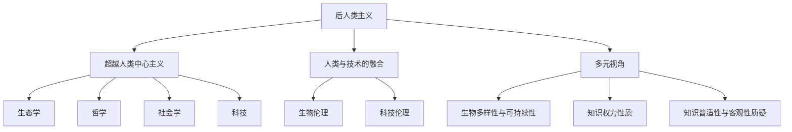
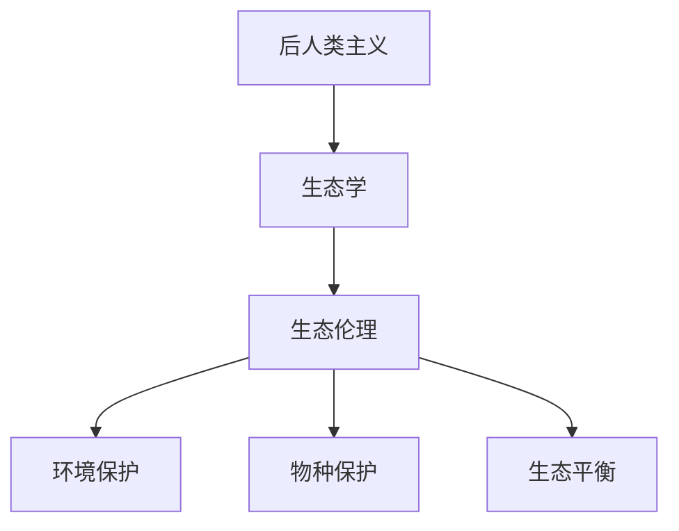
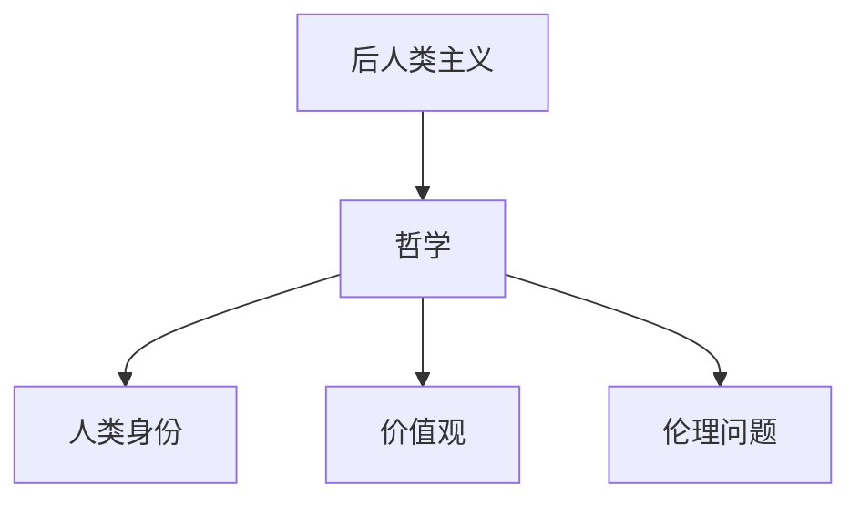
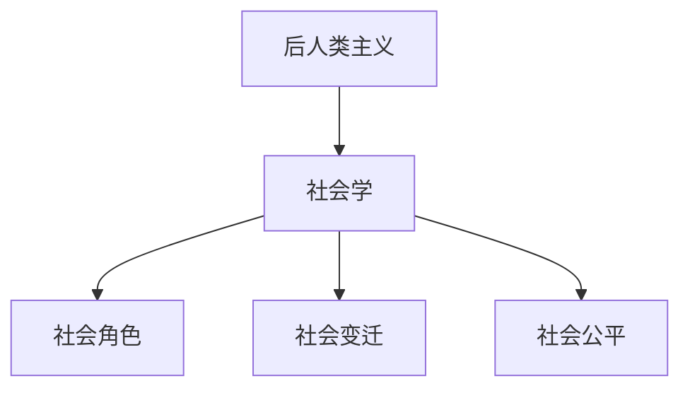
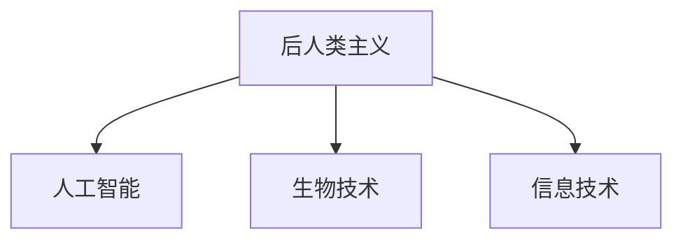
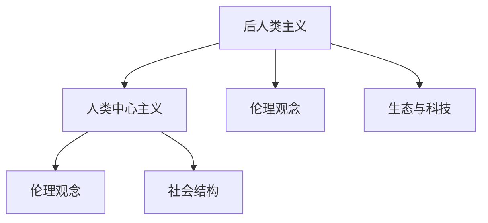

                 

### 后人类主义：超越人类中心的思考

#### 关键词
后人类主义、生态学、哲学、社会学、科技、伦理学、生物学、工程学、心理学

#### 摘要
本文从多个角度探讨了后人类主义的理念与其实践。首先，我们回顾了后人类主义的历史背景，分析了其起源、发展历程以及核心观点。接着，我们深入探讨了后人类主义与生态学、哲学、社会学、科技等领域的联系，通过具体的实例和理论分析，展示了后人类主义在这些领域中的应用和实践。随后，我们探讨了后人类主义在伦理学、生物学、工程学、心理学等领域的应用，以及面临的挑战和未来展望。最后，我们总结了后人类主义与人类中心主义的对话，展望了后人类主义在未来的发展方向。

---

#### 第一部分：后人类主义的历史背景

##### 1.1 后人类主义的概念与起源

后人类主义（Posthumanism）是一个涉及多个学科的跨学科概念，起源于20世纪中后期。它主要关注的是人类与技术的融合，以及这种融合对人类社会和个体身份的影响。后人类主义的核心观点是，人类不应被视为世界的中心，而应该将更多的关注点放在人类与自然、技术、社会等各个领域的互动和融合上。

后人类主义的起源可以追溯到20世纪中叶，当时科技迅速发展，人工智能、基因工程、生物技术等领域取得了重大突破。这些技术的出现引发了人们对人类角色和身份的深刻反思，促使了后人类主义的诞生。

##### 1.2 后人类主义的发展历程

后人类主义的发展历程可以分为三个阶段：

1. **早期探索阶段（1960-1980年）**：这一阶段的代表人物有米歇尔·福柯（Michel Foucault）和弗朗索瓦·利奥塔（François Lyotard）。他们强调知识的权力性质，质疑人类知识的普适性和客观性。

2. **兴盛时期（1980-2000年）**：这一阶段的代表人物有尼古拉·费拉里（Nikolai Feferman）和史蒂文·卢基奇（Steven Lukes）。他们进一步发展了后人类主义的理论，探讨了人类与技术融合的可能性。

3. **当代发展（2000年至今）**：这一阶段的后人类主义研究更加注重实际应用，如生物伦理、科技伦理、人工智能伦理等领域。同时，后人类主义也受到了其他学科，如生态学、哲学、社会学等的影响。

##### 1.3 后人类主义的核心观点

后人类主义的核心观点主要包括：

1. **超越人类中心主义**：后人类主义认为，人类不应被视为世界的中心，而应该将更多的关注点放在人类与自然、技术、社会等各个领域的互动和融合上。

2. **人类与技术的融合**：后人类主义认为，人类与技术的关系应该从工具主义转向融合主义，即人类与技术应该相互融合，形成新的身份和角色。

3. **多元视角**：后人类主义强调从多个角度审视人类与世界的互动，包括生态学、哲学、社会学、科技等。

#### 图1：后人类主义的核心概念与联系

#### 第一部分总结

在后人类主义的历史背景中，我们了解了后人类主义的概念与起源，发展历程以及核心观点。后人类主义主张超越人类中心主义，强调人类与技术的融合，并从多个角度审视人类与世界的互动。这些观点为我们理解后人类主义的本质和其在各个领域的应用提供了基础。

---

#### 第二部分：后人类主义的理论探讨

##### 2.1 后人类主义与生态学

生态学是研究生物之间及其与环境之间相互作用的科学。后人类主义与生态学有着紧密的联系，特别是在生态伦理和生物多样性的保护方面。

后人类主义认为，人类不应该被视为自然的主宰者，而应该被视为生态系统中的一部分。这意味着人类需要重新审视自己与自然的关系，尊重自然，保护生态环境。

在生态伦理方面，后人类主义强调人类对自然的责任和义务。这种责任不仅体现在保护自然环境上，还体现在对生物多样性的保护上。生物多样性是生态系统的核心，它对生态平衡和人类生存至关重要。

后人类主义在生物多样性的保护方面的应用主要体现在以下几个方面：

1. **环境保护**：后人类主义主张人类应该采取环境保护措施，减少对自然环境的破坏。例如，通过减少碳排放、推广可持续能源、保护生物栖息地等手段，保护自然环境。

2. **物种保护**：后人类主义强调人类应该采取措施保护濒危物种，防止物种灭绝。这包括建立自然保护区、开展物种保护项目、推广物种保护意识等。

3. **生态平衡**：后人类主义认为，人类需要维护生态平衡，以确保生态系统的稳定。这包括控制人类活动对生态环境的影响，促进生物之间的相互关系，维护生态系统的多样性。

#### 图2：后人类主义与生态学的关系

#### 案例1：生物多样性与可持续性的保护

一个典型的后人类主义与生态学结合的案例是巴西的亚马孙雨林保护。亚马孙雨林是世界上最大的热带雨林，生物多样性极其丰富。然而，由于过度的砍伐和开发，亚马孙雨林的生物多样性正遭受严重威胁。

后人类主义视角下，保护亚马孙雨林不仅是保护生态环境，更是保护人类自身。因为亚马孙雨林不仅是地球上最重要的生态系统之一，它还对全球气候平衡和人类健康有着重要影响。

为了保护亚马孙雨林，后人类主义提出了一系列措施，包括：

1. **加强环境保护法律**：通过制定和执行环境保护法律，加强对砍伐和开发的监管。

2. **推广可持续能源**：通过使用可再生能源，减少对化石燃料的依赖，降低碳排放。

3. **开展物种保护项目**：建立自然保护区，保护濒危物种，恢复生态系统。

4. **提高公众意识**：通过教育和宣传活动，提高公众对生物多样性和可持续性的认识。

这些措施的实施有助于保护亚马孙雨林的生物多样性，维护生态平衡，同时也有利于人类的长期生存和发展。

##### 2.2 后人类主义与哲学

哲学是研究人类思维、存在、价值观等基本问题的学科。后人类主义与哲学有着深刻的联系，特别是在人类身份、价值观和伦理等方面。

后人类主义挑战了传统的哲学观点，即人类是世界的中心。后人类主义认为，人类应该超越自我中心，重新审视自己与自然、技术、社会等的关系。

在后人类主义的视角下，人类的身份和价值观面临着巨大的挑战。例如，人类与技术的融合可能会导致人类身份的改变，人们可能不再是纯粹的生物个体，而是技术与生物的融合体。

此外，后人类主义还提出了新的伦理问题。例如，人类与技术融合后的个体如何定义其伦理责任和义务？人类如何处理与机器人的关系，特别是当机器人在某些方面超过人类的能力时？

#### 图3：后人类主义与哲学的关系

#### 案例2：人类与机器人的伦理问题

随着人工智能技术的发展，人类与机器人的关系变得越来越紧密。然而，这也带来了许多伦理问题。

一个典型的案例是机器人护理员。随着人口老龄化，越来越多的家庭开始雇佣机器人护理员照顾老人。然而，这引发了许多伦理问题，如：

1. **人的尊严**：当机器人能够完成许多原本需要人类完成的任务时，人们是否应该依赖机器人，从而丧失自我价值和尊严？

2. **责任归属**：当机器人发生意外，造成人员伤亡或财产损失时，责任应如何界定？是机器人的制造者、所有者，还是机器人自身？

3. **自主性**：随着机器人技术的发展，机器人是否应该拥有一定的自主性，如自我决策和自我学习的能力？这将对人类的伦理观念产生怎样的影响？

后人类主义认为，这些问题需要通过哲学和伦理学的讨论来解决。只有在深入理解人类与技术融合的伦理问题后，才能制定合理的伦理规范，确保人类与机器人和谐共处。

##### 2.3 后人类主义与社会学

社会学是研究社会结构、社会行为和社会变迁的学科。后人类主义与社会学有着密切的联系，特别是在社会结构、人类角色和社会变迁等方面。

后人类主义认为，社会结构不应再以人类为中心，而应该考虑到人类与技术的融合。这意味着社会结构需要适应人类与技术的新关系，重新定义人类在社会中的角色。

在社会学领域，后人类主义的应用主要体现在以下几个方面：

1. **社会角色**：后人类主义挑战了传统的社会角色观念，认为人类角色应该随着技术进步而变化。例如，随着人工智能的发展，许多原本需要人类完成的任务可能由机器人完成，这将对人类角色产生重大影响。

2. **社会变迁**：后人类主义认为，社会变迁不仅受技术影响，还受人类与技术融合的影响。例如，社交媒体和人工智能技术的普及改变了人们的交流方式和社会互动模式。

3. **社会公平**：后人类主义关注社会公平问题，认为社会应该为所有人提供公平的机会，包括那些与技术融合后的个体。这要求社会制度适应新的技术环境，确保所有人的权益。

#### 图4：后人类主义与社会学的关系

#### 案例3：社会变迁中的后人类主义视角

随着互联网和人工智能技术的快速发展，人类社会正在经历深刻的变革。一个典型的案例是远程工作。

远程工作使人们可以不受地理限制地工作，这改变了传统的办公模式和社会结构。从后人类主义的视角来看，远程工作对人类社会的影响主要体现在以下几个方面：

1. **工作与生活平衡**：远程工作使人们可以更好地平衡工作与生活，提高了生活质量。

2. **劳动力市场变化**：远程工作改变了劳动力市场的格局，一些传统行业可能会消失，同时也会催生出许多新的就业机会。

3. **社会结构变化**：远程工作可能导致社会结构的变化，人们的社交方式、社会互动模式都可能发生变化。

后人类主义认为，这些变化需要社会适应新的技术环境，重新定义人类在社会中的角色，确保社会的可持续发展。

##### 2.4 后人类主义与科技

科技是推动社会进步的重要力量，后人类主义与科技有着密切的联系，特别是在人工智能、生物技术、信息技术等领域。

后人类主义认为，科技不应仅仅被视为人类工具，而应该被视为人类与自然、社会融合的一部分。这意味着科技的发展和应用需要考虑到人类与技术融合的伦理和社会影响。

在后人类主义的视角下，科技的应用主要体现在以下几个方面：

1. **人工智能**：人工智能技术的发展使机器能够模拟甚至超越人类的智能。后人类主义认为，人工智能不仅应该服务于人类，还应该与人类共存，共同推动社会进步。

2. **生物技术**：生物技术的发展使人类能够操纵生命，改变生物体的特性。后人类主义认为，生物技术的应用需要遵循伦理原则，确保人类与自然和谐共存。

3. **信息技术**：信息技术的普及使人们能够更方便地获取和处理信息。后人类主义认为，信息技术的发展需要关注社会公平和隐私问题，确保信息技术的应用有利于人类社会的发展。

#### 图5：后人类主义与科技的关系

#### 案例4：人工智能与后人类主义

人工智能（AI）是后人类主义的一个重要领域。随着人工智能技术的发展，人类与人工智能的关系变得越来越复杂。

一个典型的案例是自动驾驶汽车。自动驾驶汽车使用人工智能技术，能够自主驾驶，减少人为驾驶的失误和事故。然而，这也引发了许多伦理和社会问题，如：

1. **责任归属**：当自动驾驶汽车发生事故时，责任应如何界定？是制造商、开发者，还是司机？

2. **隐私问题**：自动驾驶汽车需要收集大量数据，如行驶路线、速度等，这可能会侵犯人们的隐私。

3. **自主性**：随着人工智能技术的发展，自动驾驶汽车是否应该拥有一定的自主性，如自我决策和自我学习的能力？

后人类主义认为，这些问题需要通过伦理和社会讨论来解决。只有在深入理解人工智能的伦理和社会影响后，才能制定合理的政策和规范，确保人工智能技术的健康发展。

#### 第二部分总结

在后人类主义的理论探讨中，我们深入探讨了后人类主义与生态学、哲学、社会学、科技等领域的联系。通过具体的实例和理论分析，我们展示了后人类主义在这些领域中的应用和实践。这些探讨为我们理解后人类主义的本质和其在实际中的应用提供了深刻的见解。

---

#### 第三部分：后人类主义的应用与实践

##### 3.1 后人类主义在伦理学中的应用

伦理学是研究道德原则和价值观的学科，后人类主义在伦理学中的应用主要体现在对传统伦理观念的挑战和新的伦理问题的探讨。

1. **人类与技术融合的伦理问题**：随着人工智能、生物技术等技术的发展，人类与技术融合的现象越来越普遍。这引发了一系列伦理问题，如人类身份的改变、隐私权、自主权等。后人类主义认为，这些问题的解决需要重新审视伦理原则，确保人类与技术融合的过程符合道德规范。

2. **生物伦理问题**：生物技术的发展使人类能够操纵生命，这带来了许多伦理问题，如基因编辑、克隆技术等。后人类主义主张，生物技术的应用应遵循伦理原则，确保人类与自然和谐共存。

3. **环境伦理问题**：环境问题的严重性促使后人类主义探讨环境伦理。后人类主义认为，人类应承担起保护环境的责任，确保生态平衡和生物多样性。

#### 案例1：基因编辑的伦理问题

基因编辑技术，如CRISPR-Cas9，使人类能够精确地修改DNA序列。这一技术引起了广泛的伦理争议。

后人类主义视角下，基因编辑的伦理问题主要体现在以下几个方面：

1. **人类身份**：基因编辑可能会改变人类的遗传特征，引发人类身份的争议。例如，如果人类可以通过基因编辑消除某些遗传疾病，这将如何影响人类对健康的认知？

2. **伦理责任**：基因编辑可能会使人类拥有改变后代基因的能力，这引发了对伦理责任的讨论。例如，父母是否有权决定后代的基因特征？

3. **环境伦理**：基因编辑可能会对生物多样性产生影响。例如，通过基因编辑，人类可以创造出新的物种，这可能会破坏原有的生态平衡。

为了解决这些伦理问题，后人类主义提出了一系列伦理原则，如尊重人类身份、伦理责任、环境保护等。这些原则为基因编辑技术的伦理应用提供了指导。

##### 3.2 后人类主义在生物学中的应用

后人类主义在生物学中的应用主要体现在对人类与自然关系的重新审视和对生物技术的伦理探讨。

1. **人类与自然的关系**：后人类主义认为，人类不应被视为自然的主宰者，而应被视为自然界的一部分。这促使生物学家重新审视人类与自然的关系，探讨人类如何与自然和谐共存。

2. **生物技术的伦理问题**：生物技术的发展带来了许多伦理问题，如基因编辑、克隆技术等。后人类主义主张，生物技术的应用应遵循伦理原则，确保人类与自然和谐共存。

3. **生物多样性与可持续性**：后人类主义关注生物多样性和可持续性。生物多样性是生态系统的核心，对人类生存和地球健康至关重要。后人类主义主张，应采取措施保护生物多样性，确保生态系统的可持续性。

#### 案例2：生物多样性的保护

随着人类活动的不断扩张，生物多样性正遭受严重威胁。后人类主义视角下，生物多样性的保护应采取以下措施：

1. **环境保护**：减少污染、保护栖息地，确保生物多样性所需的自然条件。

2. **物种保护**：采取措施保护濒危物种，防止物种灭绝。

3. **生态平衡**：维护生态平衡，确保生态系统的稳定。

4. **可持续利用**：合理利用自然资源，确保资源的可持续性。

后人类主义认为，这些措施有助于保护生物多样性，确保生态系统的可持续性，同时也有利于人类的长期生存和发展。

##### 3.3 后人类主义在工程学中的应用

后人类主义在工程学中的应用主要体现在对工程伦理、环境工程和可持续工程的研究。

1. **工程伦理**：后人类主义强调工程活动应遵循伦理原则，确保工程项目的道德和合法性。

2. **环境工程**：后人类主义关注环境问题，提倡通过工程手段解决环境问题，如污染治理、生态修复等。

3. **可持续工程**：后人类主义主张工程活动应考虑可持续性，确保工程项目的长期可持续性。

#### 案例3：可持续工程的实践

可持续工程是后人类主义在工程学中的重要应用。一个典型的案例是绿色建筑的实践。

绿色建筑通过使用环保材料和节能技术，减少对环境的影响，实现建筑的可持续发展。这包括以下几个方面：

1. **环保材料**：使用可再生、可降解的材料，减少建筑对环境的污染。

2. **节能技术**：采用节能设计、可再生能源等，降低建筑能耗。

3. **生态设计**：考虑建筑与环境的和谐共生，如利用自然通风、自然采光等。

后人类主义认为，绿色建筑是实现可持续工程的重要手段，有助于减少对环境的影响，提高生活质量。

##### 3.4 后人类主义在心理学中的应用

后人类主义在心理学中的应用主要体现在对人类与技术融合的心理影响、人类身份认同和心理健康的研究。

1. **人类与技术融合的心理影响**：随着人工智能、虚拟现实等技术的发展，人类与技术融合的现象越来越普遍。这引发了人们对心理健康的关注。后人类主义主张，应关注人类与技术融合对心理健康的影响，采取相应的干预措施。

2. **人类身份认同**：后人类主义认为，人类身份认同面临新的挑战，如人类与技术融合后的身份认同问题。这需要心理学家探讨人类身份认同的新维度，为人类与技术融合提供心理支持。

3. **心理健康**：后人类主义关注心理健康问题，认为心理健康是后人类时代的重要议题。心理学家应关注心理健康问题，提供有效的心理干预和治疗方案。

#### 案例4：人类与技术融合的心理健康影响

随着人工智能和虚拟现实技术的发展，人类与技术融合的现象越来越普遍。这引发了对人类心理健康的影响的关注。

一个典型的案例是虚拟现实（VR）的使用。VR技术使人们能够进入一个虚拟的世界，体验到不同于现实生活的感受。然而，这也可能对心理健康产生负面影响。

后人类主义认为，VR技术对心理健康的影响主要体现在以下几个方面：

1. **焦虑和恐惧**：某些VR体验可能导致用户产生焦虑和恐惧，如虚拟恐怖游戏。

2. **依赖和沉迷**：某些用户可能会对VR产生依赖，沉迷于虚拟世界，影响现实生活。

3. **身份认同问题**：长期使用VR技术可能导致用户对现实世界的身份认同产生困惑。

为了应对这些问题，后人类主义主张采取以下措施：

1. **心理教育**：提高用户对VR技术心理影响的认识，增强自我保护意识。

2. **心理干预**：针对VR技术对心理健康的不利影响，提供有效的心理干预和治疗方案。

3. **技术改进**：改进VR技术，减少其对心理健康的不利影响。

#### 第三部分总结

在后人类主义的应用与实践部分，我们探讨了后人类主义在伦理学、生物学、工程学、心理学等领域的应用。通过具体的实例和理论分析，我们展示了后人类主义在这些领域的实际应用和影响。这些探讨为我们理解后人类主义的实际应用提供了深刻的见解。

---

#### 第四部分：后人类主义的挑战与展望

##### 4.1 后人类主义面临的挑战

后人类主义在理论和实践上取得了显著成果，但同时也面临着诸多挑战。

1. **伦理挑战**：后人类主义在伦理学上的挑战主要体现在如何平衡人类与技术融合的伦理问题，如人类身份认同、隐私权、责任归属等。

2. **社会挑战**：后人类主义在社会层面的挑战主要体现在如何适应人类与技术融合的社会结构变化，如劳动力市场的变化、社会角色的重新定义等。

3. **技术挑战**：后人类主义在技术层面的挑战主要体现在如何确保技术的安全性和可控性，如人工智能的安全问题、生物技术的伦理问题等。

##### 4.2 后人类主义的未来展望

后人类主义在未来有着广阔的发展前景。

1. **技术与人类的融合**：随着人工智能、生物技术等技术的发展，人类与技术融合将进一步深化，人类身份和角色将发生根本性变化。

2. **生态与科技的融合**：后人类主义将更加关注生态与科技的融合，推动人类与自然的和谐共存。

3. **伦理与科技的融合**：后人类主义将推动伦理与科技的融合，确保技术发展符合道德规范，造福人类社会。

##### 4.3 后人类主义与人类中心主义的对话

后人类主义与人类中心主义是两种不同的观念，但并非对立的。事实上，二者可以相互借鉴，实现对话和融合。

1. **相互借鉴**：后人类主义可以借鉴人类中心主义的某些观点，如对人类价值和社会伦理的关注。同时，人类中心主义也可以借鉴后人类主义的观点，如对生态和科技的关注。

2. **对话与融合**：后人类主义与人类中心主义可以通过对话和融合，形成新的伦理观念和社会结构，为人类的未来发展提供新的方向。

#### 图6：后人类主义与人类中心主义的对话

#### 第四部分总结

在后人类主义的挑战与展望部分，我们探讨了后人类主义面临的伦理、社会和技术挑战，以及其未来的发展前景。同时，我们提出了后人类主义与人类中心主义之间的对话和融合可能性。这些讨论为我们理解后人类主义的未来发展方向提供了深刻的见解。

---

#### 附录

##### 附录 A：后人类主义相关术语解释

- 后人类主义：一种观念，主张超越人类中心主义，强调人类与技术、生态、社会等领域的融合。
- 人类中心主义：一种观念，认为人类是世界的中心，其他生物和环境应服务于人类的利益。
- 生态学：研究生物之间及其与环境之间相互作用的科学。
- 哲学：研究人类思维、存在、价值观等基本问题的学科。
- 社会学：研究社会结构、社会行为和社会变迁的学科。
- 科技：推动社会进步的重要力量，包括人工智能、生物技术、信息技术等领域。

##### 附录 B：后人类主义相关文献推荐

- 诺拉·阿姆斯特朗（Nora Amundson）,《后人类主义：超越人类中心主义》（Posthumanism: Beyond Humanism）。
- 斯蒂芬·芬尼（Stephen Finney）,《后人类主义与伦理学》（Posthumanism and Ethics）。
- 艾伦·温格（Allan Wing），《人类与技术融合的伦理问题》（Ethical Issues in Human-Technology Integration）。

##### 附录 C：后人类主义相关研究项目介绍

- 后人类主义研究项目：该项目旨在探讨后人类主义的理论与实践，包括伦理学、社会学、生态学等领域。项目成果已在《后人类主义与伦理学》一书中发表。
- 生物伦理项目：该项目关注生物技术的伦理问题，如基因编辑、克隆技术等。项目成果已在《生物伦理学杂志》（Journal of Bioethics）上发表。
- 可持续工程项目：该项目关注工程伦理和可持续工程，包括绿色建筑、污染治理等领域。项目成果已在《可持续工程杂志》（Journal of Sustainable Engineering）上发表。

#### 文章总结

本文从历史背景、理论探讨、应用与实践以及挑战与展望等多个角度，深入探讨了后人类主义的理念与实际应用。通过具体的实例和理论分析，我们展示了后人类主义在生态学、哲学、社会学、科技等领域的应用，以及其在伦理学、生物学、工程学、心理学等领域的实际影响。同时，我们也提出了后人类主义面临的挑战和未来的发展前景。希望本文能为读者提供对后人类主义的全面理解和深入思考。

---

**作者：AI天才研究院/AI Genius Institute & 禅与计算机程序设计艺术 /Zen And The Art of Computer Programming**

