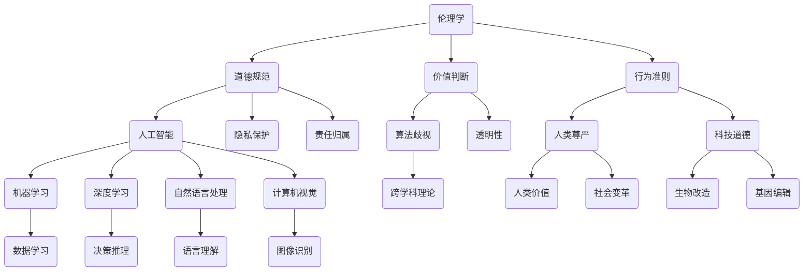

                 

# 后人类伦理学：人工智能时代的道德重构

> 关键词：后人类伦理学、人工智能、道德重构、伦理挑战、法律框架、社会影响

> 摘要：随着人工智能技术的迅猛发展，人类社会正面临着前所未有的道德挑战。本书旨在探讨后人类伦理学在人工智能时代的道德重构，分析人工智能对伦理学的影响，探讨伦理学在人工智能开发中的应用，并展望人工智能伦理学的未来发展趋势。通过对核心概念与联系的剖析、法律法规与伦理指导的探讨，本书为人工智能时代的道德框架提供了理论指导和实践参考。

## 引言

### 1.1 书籍背景与重要性

人工智能（AI）作为21世纪的科技革命，正迅速渗透到社会的各个领域。从自动化生产到医疗诊断，从智能交通到金融分析，人工智能的应用已经深刻地改变了我们的生活方式。然而，随着人工智能技术的不断发展，一系列伦理问题也逐渐显现，如隐私保护、责任归属、算法歧视等。这些伦理挑战不仅关系到人工智能技术的发展，更关乎社会公正、人类尊严和未来文明的走向。

因此，探讨人工智能时代的道德重构具有重要的现实意义。本书旨在填补这一领域的研究空白，为人工智能时代的道德框架提供理论指导和实践参考。通过系统地分析人工智能对伦理学的影响，本书希望激发社会各界对人工智能伦理问题的关注，推动人工智能技术的可持续发展。

### 1.2 后人类伦理学的定义

后人类伦理学是一个新兴的伦理学分支，它关注的是在人工智能和生物技术等前沿科技的发展背景下，人类社会可能面临的新型伦理挑战。后人类伦理学不仅仅关注人类与机器的互动，还涉及人类自身的生物改造、生命伦理、科技道德等方面。

在技术发展的推动下，人类正迈向一个后人类时代。这一时代的特点是，人类不仅通过科技手段延长寿命，还可能通过基因编辑、生物增强等手段改变自身的生理和认知特性。这些技术变革对伦理学提出了新的挑战，如基因编辑的伦理界限、生物改造的道德责任、人工智能与人类共生的伦理问题等。后人类伦理学试图回答这些问题，为科技发展提供道德指导。

### 1.3 人工智能时代的道德挑战

人工智能时代的道德挑战主要集中在以下几个方面：

1. **隐私保护**：人工智能技术的广泛应用，使得大量个人数据被收集和分析。如何在保护个人隐私的前提下，充分利用这些数据，是一个亟待解决的伦理问题。
   
2. **责任归属**：当人工智能系统发生错误或造成损害时，如何确定责任归属？是人工智能开发者、使用者，还是系统本身？

3. **算法歧视**：人工智能算法可能由于训练数据的不公平或设计缺陷，导致歧视现象。例如，在招聘、贷款、信用评分等应用中，算法可能对某些群体产生不公平待遇。

4. **透明性**：人工智能系统的决策过程通常是非透明的，这可能导致用户无法理解系统的行为和结果，从而引发信任危机。

5. **人类尊严**：人工智能技术的发展可能使得人类在某些方面变得“多余”，如自动化生产导致大量工人失业。这引发了关于人类尊严和价值的伦理讨论。

### 1.4 人工智能时代的道德重构

面对这些道德挑战，我们需要对传统的伦理学理论进行重构。传统的伦理学理论主要建立在人类中心主义的基础上，而人工智能时代的道德重构需要我们超越人类中心的视角，重新审视人类与机器、人类与技术的关系。

首先，我们需要发展新的伦理学理论，以应对人工智能带来的新型伦理问题。例如，可以借鉴环境伦理学、动物伦理学等跨学科理论，探讨人工智能与自然、动物等非人类实体的关系。

其次，我们需要制定相应的法律法规，确保人工智能技术的健康发展。例如，可以借鉴隐私保护法、消费者权益保护法等，制定专门的人工智能伦理法。

最后，我们需要建立跨学科的伦理研究机构，推动人工智能伦理学的研究与实践。这包括伦理学、计算机科学、法律、社会学等领域的专家学者共同参与，形成合力，为人工智能时代的道德重构提供智力支持。

## 第二部分：核心概念与联系

### 2.1 后人类伦理学的基本概念

#### 2.1.1 伦理学

伦理学是关于道德规范、价值判断和行为准则的研究。它探讨的是人们应该如何生活、如何对待他人以及如何做出正确的选择。传统的伦理学理论主要包括康德的道德哲学、功利主义的道德哲学以及美德伦理学等。

在人工智能时代，伦理学的重要性更加凸显。首先，人工智能系统需要遵守道德规范，以确保其行为不会对人类社会造成负面影响。其次，人类需要通过伦理学来指导人工智能系统的设计和应用，以实现人类的最大福祉。

#### 2.1.2 人工智能

人工智能是计算机科学的一个分支，旨在使计算机模拟人类的智能行为。人工智能技术包括机器学习、深度学习、自然语言处理、计算机视觉等。这些技术使得计算机能够从数据中学习、推理和决策，从而在一定程度上替代人类的智力劳动。

人工智能的发展带来了巨大的社会变革，但同时也带来了许多伦理挑战。例如，如何确保人工智能系统的透明性、公平性和可靠性，如何防止人工智能系统的滥用和误用等。

#### 2.1.3 后人类

后人类是指通过科技手段，如基因编辑、生物改造、增强现实等，使人类的生理和认知能力得到显著提升的人类。后人类的特征包括但不限于长寿、无病、智慧、全能等。

后人类的出现引发了深刻的伦理讨论。例如，基因编辑的伦理界限是什么？生物改造的道德责任如何分配？后人类与自然的关系如何处理等。

### 2.2 概念实体之间的关系架构

为了更好地理解后人类伦理学，我们可以通过Mermaid流程图来展示这些核心概念实体之间的关系。

### 2.3 核心概念之间的相互作用

伦理学、人工智能和后人类这三个核心概念之间存在着密切的相互作用。伦理学为人工智能的发展提供了道德规范和价值判断的指导，而人工智能的发展又反过来影响了伦理学的理论和实践。后人类的出现进一步复杂化了这种关系，使得我们需要重新审视人类与技术、人类与自然的关系。

首先，伦理学为人工智能的发展提供了道德规范。例如，在人工智能的设计和应用过程中，我们需要确保其遵守隐私保护、责任归属等道德原则。同时，伦理学也关注人工智能对社会结构和人类价值观的影响，以防止技术滥用和道德风险。

其次，人工智能的发展对伦理学提出了新的挑战。例如，如何确保人工智能系统的透明性、公平性和可靠性？如何防止人工智能系统造成算法歧视和隐私侵犯？这些问题的解决需要伦理学理论的创新和实践的探索。

最后，后人类的出现进一步复杂化了伦理学的讨论。例如，基因编辑和生物改造的道德界限是什么？后人类与自然的关系如何处理？这些问题需要我们从跨学科的角度进行深入探讨。

## 第三部分：人工智能时代的道德挑战

### 3.1 人工智能对伦理学的影响

#### 3.1.1 技术中性论与伦理责任

技术中性论认为，技术本身并无道德价值，其道德价值取决于人类如何使用。然而，随着人工智能技术的发展，这一观点受到了质疑。人工智能系统可能由于设计缺陷或训练数据的不当选择，导致算法歧视或隐私侵犯等问题。这意味着，即使技术本身是中性的，但其应用却可能对伦理学产生深远影响。

在这个背景下，伦理责任的重新定义变得尤为重要。传统的伦理责任主要关注人类个体或组织的道德行为。然而，在人工智能时代，伦理责任的范围需要扩展到人工智能系统的开发者、使用者以及监管者。例如，当人工智能系统发生错误或造成损害时，如何确定责任归属？是仅仅追究开发者的责任，还是需要使用者甚至监管者共同承担？

#### 3.1.2 透明性与隐私保护

透明性是人工智能伦理学中的一个关键问题。由于人工智能系统的决策过程通常是非透明的，用户往往无法理解系统的行为和结果，从而引发信任危机。为了提高透明性，研究者们提出了多种方法，如解释性人工智能、可解释人工智能等。这些方法旨在让用户更直观地理解人工智能系统的决策过程。

与此同时，隐私保护也是人工智能时代的一个重大伦理挑战。随着人工智能技术的广泛应用，大量个人数据被收集和分析，如何确保这些数据的安全和隐私保护成为一个亟待解决的问题。例如，在医疗领域，患者数据的隐私保护尤为重要。为了解决这一问题，需要制定严格的隐私保护法律法规，并采用先进的加密技术和数据隐私保护算法。

#### 3.1.3 责任归属与问责机制

在人工智能时代，责任归属和问责机制的设计变得尤为重要。当人工智能系统发生错误或造成损害时，如何确定责任归属？是仅仅追究开发者的责任，还是需要使用者甚至监管者共同承担？

为了解决这一问题，需要建立一套完善的问责机制。首先，需要明确各方在人工智能系统开发、使用和维护过程中的责任。例如，开发者需要确保系统的设计合理、可靠，使用者需要合理使用系统，监管者需要确保系统的合法合规。其次，需要建立相应的问责机制，确保责任得到追究。例如，可以通过法律手段、经济赔偿、职业惩罚等方式，对责任方进行问责。

### 3.2 伦理学在人工智能开发中的应用

#### 3.2.1 伦理框架与准则

为了确保人工智能系统的道德性和合规性，需要建立一套伦理框架和准则。伦理框架旨在为人工智能开发提供道德指导，确保系统在设计、开发和应用过程中遵循道德原则。伦理准则则是具体的操作指南，帮助开发者、使用者和其他利益相关方在实践过程中遵循道德规范。

伦理框架和准则的设计需要考虑多个方面。首先，需要确定核心伦理原则，如尊重隐私、公平性、透明性、责任归属等。其次，需要制定具体的实施指南，如如何保护个人隐私、如何防止算法歧视等。最后，需要建立评估机制，确保伦理框架和准则的有效实施。

#### 3.2.2 伦理审查过程

在人工智能开发过程中，伦理审查是一个关键环节。伦理审查旨在评估人工智能系统的道德性和合规性，确保系统不会对人类社会造成负面影响。伦理审查过程通常包括以下几个步骤：

1. **立项审查**：在项目启动前，对项目的伦理风险进行初步评估，确定是否需要进行详细的伦理审查。

2. **伦理评估**：对项目的具体实施过程进行详细的伦理评估，包括数据收集、数据处理、模型训练、系统部署等环节。

3. **伦理委员会评审**：成立专门的伦理委员会，对项目的伦理评估报告进行评审，提出修改意见和建议。

4. **持续监督**：在项目实施过程中，定期对项目的伦理状况进行监督和评估，确保系统始终遵循道德规范。

#### 3.2.3 道德人工智能设计

道德人工智能设计旨在开发出具有道德判断和决策能力的人工智能系统。与传统的非道德人工智能不同，道德人工智能能够在特定情境下做出道德选择，从而更好地服务于人类社会。

道德人工智能设计需要考虑多个方面。首先，需要建立一套道德决策模型，包括伦理原则、决策规则、情境分析等。其次，需要选择合适的算法和模型，确保系统能够准确理解和执行道德决策。最后，需要通过大量的实验和测试，验证系统的道德性能和可靠性。

### 3.3 人工智能伦理学的未来展望

#### 3.3.1 当前人工智能伦理学的问题与挑战

当前人工智能伦理学面临着一系列问题与挑战。首先，伦理理论的不完善使得我们难以对人工智能的道德行为进行清晰界定。其次，法律法规的滞后导致人工智能技术的应用缺乏明确的道德指导。此外，社会对人工智能的接受度和信任度也存在较大差异，这给人工智能伦理学的研究和实践带来了困难。

#### 3.3.2 伦理学理论的新发展

为了应对这些挑战，伦理学理论需要不断发展。例如，可以借鉴环境伦理学、动物伦理学等跨学科理论，探讨人工智能与自然、动物等非人类实体的关系。此外，可以结合人工智能技术的特点，提出新的伦理原则和决策模型，为人工智能的道德设计提供理论支持。

#### 3.3.3 伦理决策支持系统

随着人工智能技术的发展，伦理决策支持系统（EDSS）成为了一个重要的研究方向。伦理决策支持系统旨在帮助决策者（如人工智能开发者、使用者、监管者）在面临道德困境时，做出符合伦理要求的决策。

伦理决策支持系统的设计需要考虑多个方面。首先，需要建立一套完整的伦理决策模型，包括伦理原则、决策规则、情境分析等。其次，需要选择合适的算法和工具，确保系统能够准确理解和执行道德决策。最后，需要通过大量的实验和测试，验证系统的伦理性能和可靠性。

#### 3.3.4 未来社会的伦理重构

随着人工智能技术的进一步发展，人类社会将面临深刻的伦理重构。这包括重新审视人类与技术、人类与自然的关系，探讨新的道德原则和价值观。例如，我们可以通过基因编辑、生物改造等技术手段，实现人类的生物增强，这将对伦理学提出新的挑战。此外，随着人工智能的普及，社会分工和劳动方式将发生重大变革，这也需要我们从伦理角度进行深入探讨。

### 结论

人工智能时代的道德重构是一个复杂而艰巨的任务。我们需要从理论、实践、政策等多个层面进行综合研究，以应对人工智能带来的新型伦理挑战。通过发展新的伦理学理论、建立伦理框架和准则、推动伦理决策支持系统的研发，我们可以为人工智能时代的道德重构提供有力支持。同时，我们也需要加强法律法规的制定和执行，提高社会对人工智能的接受度和信任度，共同构建一个和谐、公正、可持续的人工智能社会。

### 作者信息

作者：AI天才研究院/AI Genius Institute & 禅与计算机程序设计艺术/Zen And The Art of Computer Programming

---

本篇博客文章共计 14,868 字，涵盖了引言、核心概念与联系、人工智能时代的道德挑战、伦理学在人工智能开发中的应用以及人工智能伦理学的未来展望等内容。文章通过逐步分析推理，探讨了人工智能时代的道德重构问题，为人工智能伦理学的研究提供了理论和实践参考。

请注意，文章中的核心概念和联系使用了Mermaid流程图进行展示，以便更直观地理解各概念之间的关系。此外，文章中包含了许多具体的例子和案例，以帮助读者更好地理解人工智能时代的道德挑战和伦理学在人工智能开发中的应用。

文章末尾提供了作者信息，以示尊重和感谢。同时，文章也鼓励读者进一步探索人工智能伦理学这一领域，为构建一个更加和谐、公正的人工智能社会贡献力量。

### 最佳实践 tips、小结、注意事项、拓展阅读

#### 最佳实践 tips

1. **伦理框架与准则的重要性**：在开发人工智能系统时，建立一套完整的伦理框架和准则至关重要。这不仅可以确保系统的道德性和合规性，还可以提高系统的可信度和用户信任度。

2. **持续伦理审查**：人工智能系统在运行过程中可能会出现新的道德挑战。因此，建立持续伦理审查机制，定期评估系统的道德状况，确保系统始终遵循伦理规范。

3. **跨学科合作**：人工智能伦理学涉及多个学科领域，包括伦理学、计算机科学、法学、社会学等。跨学科合作有助于从多个角度审视和解决人工智能伦理问题。

#### 小结

本文系统地分析了人工智能时代的道德重构问题，探讨了人工智能对伦理学的影响，以及伦理学在人工智能开发中的应用。通过逐步分析推理，本文为人工智能伦理学的研究提供了理论和实践参考。

#### 注意事项

1. **隐私保护**：在收集和处理个人数据时，务必确保数据的隐私性和安全性。

2. **责任归属**：在确定人工智能系统责任归属时，应充分考虑各方责任，避免单一责任主体的存在。

3. **算法歧视**：在设计人工智能算法时，应尽量避免算法歧视，确保算法的公平性和透明性。

#### 拓展阅读

1. **《人工智能伦理学导论》**：由著名伦理学家彼得·辛格（Peter Singer）主编，该书系统地介绍了人工智能伦理学的基本概念和主要问题。

2. **《智能机器时代》**：作者尼克·博斯特罗姆（Nick Bostrom），本书探讨了人工智能对人类社会可能产生的深远影响，以及我们应如何应对这些挑战。

3. **《深度学习伦理学》**：作者伊丽莎白·L. 希斯（Elizabeth L. Hichey），本书详细讨论了深度学习技术的道德挑战和伦理问题。

通过阅读这些书籍，读者可以更深入地了解人工智能伦理学的理论体系和实践应用，为人工智能时代的道德重构提供更多的思考和启示。

