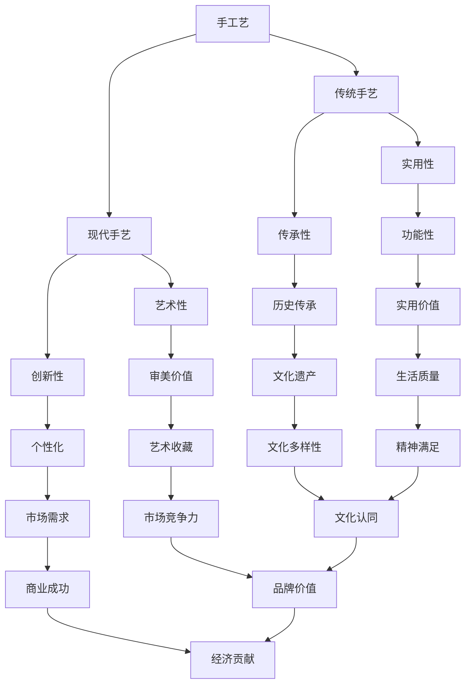

                 

### 引言

#### 后工业时代的背景与特点

后工业时代，即信息时代，是指随着工业革命的完成和信息技术的高速发展，人类进入了一个以知识和服务产业为主的时代。这一时代的特点主要体现在以下几个方面：

1. **技术进步**：信息技术的飞速发展，特别是互联网、大数据、人工智能等技术的崛起，极大地改变了生产方式和生活方式。
   
2. **产业结构**：第三产业（服务业）比重逐渐增加，取代了第二产业（制造业）的主导地位。

3. **生产方式**：从大规模标准化生产转向个性化定制生产，生产的灵活性和多样性大大提升。

4. **社会变迁**：社会结构从金字塔型向扁平化转变，个体价值和创新能力受到重视。

在这样的背景下，手工艺的复兴不仅仅是对过去的一种怀旧，更是一种对新时代需求的回应。手工艺具有独特的手工性、艺术性和文化内涵，在后工业时代的信息社会，其价值被重新发现和认可。

#### 工业革命的影响

工业革命是人类历史上一次重大的技术和社会变革，它从18世纪末开始，在英国逐渐展开，并迅速影响到全球。工业革命的影响主要体现在：

1. **生产效率提高**：机械化生产的引入大幅提高了生产效率，降低了生产成本。

2. **城市化进程**：工业革命促进了人口从农村向城市的迁移，形成了现代城市的基础。

3. **经济模式转变**：资本主义经济模式逐渐取代了传统的封建经济模式。

4. **社会结构变化**：社会阶层日益固化，贫富差距加大。

尽管工业革命带来了巨大的进步，但它也导致了一些负面效应，如环境污染、文化同质化等。因此，后工业时代对手工艺的复兴，既是对工业革命负面效应的反思，也是对个性化、文化多样性的追求。

#### 后工业时代的社会变迁

后工业时代的社会变迁表现在多个方面，其中最为显著的是：

1. **信息技术与全球化**：互联网和移动通信技术的发展，使信息传播速度极快，全球化进程加速。

2. **消费观念转变**：消费者越来越注重个性化、品质和文化内涵，对手工艺的独特性和艺术性有了更高的期待。

3. **文化多样性**：全球化背景下，不同文化之间的交流碰撞，为手工艺的创新提供了丰富的灵感。

4. **生活方式转变**：后工业时代人们更加注重生活质量和精神满足，对手工艺产品的需求不再仅仅是为了实用性，更是一种精神寄托和审美追求。

#### 手工艺复兴的意义

手工艺复兴在后工业时代具有深远的意义：

1. **文化传承**：手工艺是民族文化的重要组成部分，复兴手工艺有助于传承和弘扬传统文化。

2. **经济价值**：手工艺产业不仅能够提供就业机会，还能够创造经济价值，促进地方经济发展。

3. **社会创新**：手工艺的创新不仅体现在技艺上，更体现在设计理念和文化内涵上，为社会创新提供了新的方向。

4. **精神满足**：手工艺制作的过程本身就是一种精神享受，能够带给人们内心的宁静和满足。

综上所述，后工业时代的手工艺复兴不仅是对过去的致敬，更是对未来的探索。它不仅有助于传统文化的传承，还能够为社会和经济带来新的活力，是我们这个时代不可忽视的一部分。

### 文章标题

# 《后工业时代的手工艺复兴》

## 关键词

- 后工业时代
- 手工艺
- 复兴
- 文化传承
- 经济价值
- 社会创新

## 摘要

本文探讨了后工业时代背景下手工艺复兴的背景、意义和具体表现。首先，分析了后工业时代的特征和社会变迁，以及工业革命对手工艺的影响。随后，阐述了手工艺复兴的必要性及其在后工业时代的重要价值，包括文化传承、经济价值和社会创新等方面。文章接着介绍了手工艺的定义和分类，探讨了后工业时代手工艺的发展趋势，以及其在教育和传承方面的现状。最后，通过具体案例分析，展示了手工艺在现代设计和产业中的应用，并提出了手工艺复兴的国际经验与启示。全文旨在为手工艺爱好者和从业者提供有价值的参考，以推动手工艺在后工业时代的复兴和发展。

### 《后工业时代的手工艺复兴》目录大纲

## 引言

### 后工业时代的背景与特点
- 工业革命的影响
- 后工业时代的社会变迁
- 手工艺复兴的意义

### 第一部分：后工业时代的手工艺基础

### 第1章：手工艺的概念与历史

#### 1.1 手工艺的概念
- 手工艺的基本概念
- 手工艺与传统手艺的区别

#### 1.2 手工艺的历史演变
- 工业革命前的手工艺
- 工业革命后的手工艺变迁

#### 1.3 手工艺的分类
- 手工艺的主要类型
- 手工艺的流派

### 第2章：后工业时代手工艺的发展趋势

#### 2.1 数字技术与手工艺的结合
- 数字技术在手工艺中的应用
- 数字技术对手工艺带来的变革

#### 2.2 现代手工艺的创新方向
- 新材料在手工艺中的应用
- 新设计理念在手工艺中的体现

#### 2.3 手工艺市场的变化
- 消费者需求的变化
- 手工艺市场的机遇与挑战

### 第3章：手工艺的教育与传承

#### 3.1 手工艺教育的重要性
- 手工艺教育在培养创新人才中的作用
- 手工艺教育的发展现状与问题

#### 3.2 手工艺传承的方法与途径
- 家庭传承
- 学校教育
- 社区活动

#### 3.3 手工艺的数字化传承
- 数字媒体在手工艺传承中的应用
- 数字化手工艺博物馆的建设

## 第二部分：后工业时代手工艺的实践与应用

### 第4章：手工艺设计与创意

#### 4.1 手工艺设计的方法与技巧
- 设计思维在手工艺设计中的应用
- 手工艺设计的创新策略

#### 4.2 手工艺与艺术的关系
- 手工艺艺术的特色
- 手工艺艺术的发展趋势

#### 4.3 手工艺与时尚产业
- 手工艺在时尚设计中的应用
- 手工艺时尚产品的市场前景

### 第5章：手工艺产业与市场

#### 5.1 手工艺产业的发展现状
- 手工艺产业的分布特点
- 手工艺产业的经济贡献

#### 5.2 手工艺市场的营销策略
- 手工艺品牌建设
- 手工艺市场推广手段

#### 5.3 手工艺产业的可持续发展
- 手工艺产业的社会责任
- 手工艺产业的未来趋势

### 第6章：手工艺与现代生活方式

#### 6.1 手工艺在现代家居中的应用
- 手工艺家居产品的特点
- 手工艺家居的设计理念

#### 6.2 手工艺在时尚配饰中的应用
- 手工艺时尚配饰的种类
- 手工艺时尚配饰的设计与创新

#### 6.3 手工艺与现代艺术的融合
- 手工艺在艺术创作中的角色
- 手工艺与现代艺术的互动关系

### 第7章：手工艺复兴的国际经验与启示

#### 7.1 国际手工艺复兴的案例
- 欧洲手工艺复兴的经验
- 亚洲手工艺复兴的案例

#### 7.2 国际手工艺市场的分析
- 国际手工艺市场的规模与趋势
- 国际手工艺市场的竞争格局

#### 7.3 后工业时代手工艺复兴的启示
- 启示与借鉴
- 中国手工艺复兴的路径

## 结论

### 后工业时代手工艺复兴的展望
- 未来手工艺的发展方向
- 手工艺在新时代的作用与价值

## 附录

### 附录 A：手工艺相关术语解释

### 附录 B：参考书目与资源
- 书目推荐
- 网络资源推荐

### 目录大纲总结

本文从后工业时代的背景出发，系统探讨了手工艺复兴的理论基础、发展趋势、教育与传承、实践与应用、产业与市场，以及国际经验与启示。通过对手工艺的概念、历史、分类，以及后工业时代手工艺的发展趋势的分析，揭示了手工艺在后工业时代的复兴意义。文章不仅关注了手工艺在现代社会中的文化传承和经济价值，还探讨了手工艺设计与创意、市场推广、现代生活方式融合等方面的应用。通过国际经验的分析，为我国手工艺复兴提供了有益的启示。全文旨在为手工艺爱好者和从业者提供全面、系统的指导，推动手工艺在后工业时代的复兴和发展。

## 第1章：手工艺的概念与历史

### 1.1 手工艺的概念

#### 手工艺的基本概念

手工艺，顾名思义，是指通过手工技艺制作产品的过程。它是一种历史悠久、技艺精湛的工艺技术，涵盖了从材料选择、工艺流程、制作技巧到最终成品的全过程。手工艺不仅仅是一种技艺，更是一种文化和艺术形式，它蕴含着丰富的历史和文化内涵。

#### 手工艺与传统手艺的区别

传统手艺通常指的是在特定地区、族群中长期传承下来的手工技艺，它可能包括了一些手工艺的元素，但更多的是注重实用性和传承性。而手工艺则更强调技艺的精致性和艺术性，不仅追求产品的实用功能，更注重作品的艺术价值和人文内涵。此外，传统手艺可能更多地依赖于经验和传统技艺，而手工艺则更加注重创新和个性化的表达。

#### 手工艺在现代的意义

在后工业时代，手工艺的独特性和艺术性被重新发现和重视。它不仅是一种艺术创作的方式，更是一种生活方式的体现。手工艺在现代的意义主要体现在以下几个方面：

1. **文化传承**：手工艺是民族文化的重要组成部分，它承载着丰富的历史和文化记忆，通过手工艺的传承和复兴，可以保护和弘扬传统文化。

2. **经济价值**：手工艺产业具有巨大的经济潜力，它可以提供就业机会，促进地方经济发展。同时，手工艺品的独特性和艺术价值使其具有较高的市场竞争力。

3. **社会创新**：手工艺的创新不仅体现在技艺上，还体现在设计理念和文化内涵上，为社会创新提供了新的方向。

4. **精神满足**：手工艺制作的过程本身就是一种精神享受，能够带给人们内心的宁静和满足，有助于提高人们的生活质量。

### 1.2 手工艺的历史演变

#### 工业革命前的手工艺

在工业革命之前，手工艺是生产的主要形式。手工艺的起源可以追溯到史前时代，随着人类文明的进步，手工艺技术逐渐发展壮大。在中国，古代的手工艺如陶瓷、丝绸、刺绣等技艺精湛，闻名于世。在欧洲，中世纪的工匠们通过手工艺制作了大量的艺术品和日用品，这些手工艺品不仅体现了高超的技艺，更是当时文化的见证。

#### 工业革命后的手工艺变迁

工业革命的到来，极大地改变了生产方式。机械化生产的引入，使得大规模、标准化的生产成为可能，手工艺逐渐被机械化生产所取代。然而，随着工业化进程的推进，手工艺也发生了相应的变化：

1. **技艺专业化**：工业化导致手工艺技艺逐渐专业化，不同类型的工艺分工更加明确，工匠们专注于某一领域的技艺提升。

2. **艺术与工艺结合**：工业革命后的手工艺，不再仅仅追求实用性，开始注重艺术性和审美价值，许多手工艺品成为艺术品，受到人们的喜爱和收藏。

3. **手工艺的衰落**：尽管手工艺在艺术性上得到了提升，但其生产效率较低，成本较高，逐渐无法与机械化生产竞争，导致手工艺在工业化进程中逐渐衰落。

#### 现代手工艺的复兴

在后工业时代，随着人们对个性化、文化多样性和精神满足的需求增加，手工艺开始得到复兴。现代手工艺不仅继承了传统的技艺，还融入了现代的设计理念和技术，使其在现代社会中焕发出新的生机。

1. **数字技术的应用**：现代手工艺开始利用数字技术进行设计和制作，提高了生产效率和产品质量。

2. **创意与创新**：现代手工艺注重创意和创新，手工艺品的种类和形式更加多样化，满足了不同消费者的需求。

3. **文化与商业结合**：现代手工艺不仅是一种艺术创作，更是一种商业模式，许多手工艺者通过创意设计和营销策略，实现了商业成功。

### 1.3 手工艺的分类

手工艺种类繁多，可以根据不同的标准进行分类。以下是一些常见的手工艺分类：

#### 1. 手工艺的类型

1. **传统手工艺**：如陶瓷、丝绸、刺绣、木雕、石雕等，这些手工艺有着悠久的历史和丰富的文化内涵。

2. **现代手工艺**：如纤维艺术、首饰设计、玻璃艺术、金属工艺等，这些手工艺结合了现代技术和设计理念，具有独特的艺术魅力。

#### 2. 手工艺的流派

1. **欧洲手工艺流派**：如意大利的陶瓷、法国的玻璃工艺、德国的金属工艺等，这些流派在技艺和艺术风格上具有独特的特点。

2. **亚洲手工艺流派**：如中国的陶瓷、日本的和服、印度的纺织等，这些流派注重细节和装饰性，体现了深厚的文化底蕴。

#### 3. 手工艺的其他分类方式

1. **根据材料分类**：如陶瓷工艺、纺织工艺、木工艺等，不同材料的手工艺有着不同的制作技巧和特点。

2. **根据制作方式分类**：如手工编织、手工刺绣、手工雕刻等，不同的制作方式决定了手工艺品的独特性和艺术性。

通过对手工艺的概念、历史和分类的探讨，我们可以更深入地理解手工艺在现代社会中的价值和意义。手工艺不仅是一种技艺，更是一种文化、一种艺术，它在后工业时代的复兴，为我们的生活带来了更多的可能性和美好。

### 图1.1：手工艺的核心概念与联系



### 图1.2：手工艺的算法原理（Python代码示例）

```python
def handcraft_process(material, technique, design):
    """
    手工艺制作过程
    :param material: 材料
    :param technique: 技术技巧
    :param design: 设计
    :return: 手工艺品
    """
    
    # 材料准备
    prepared_material = prepare_material(material)
    
    # 技术应用
    applied_technique = apply_technique(prepared_material, technique)
    
    # 设计实现
    final_design = implement_design(applied_technique, design)
    
    return final_design

def prepare_material(material):
    """
    准备材料
    :param material: 材料
    :return: 准备好的材料
    """
    
    # 这里添加具体的材料准备步骤
    return "Prepared Material"

def apply_technique(material, technique):
    """
    应用技术技巧
    :param material: 材料
    :param technique: 技术技巧
    :return: 应用技术后的材料
    """
    
    # 这里添加具体的技术应用步骤
    return "Technique Applied Material"

def implement_design(material, design):
    """
    实现设计
    :param material: 应用技术后的材料
    :param design: 设计
    :return: 完成的手工艺品
    """
    
    # 这里添加具体的设计实现步骤
    return "Final Handcraft Product"

# 示例
material = "Ceramic"
technique = "Hand-Painting"
design = "Floral Design"

handcraft_product = handcraft_process(material, technique, design)
print(handcraft_product)
```

### 数学公式（LaTeX格式）

```latex
\section{手工艺制作过程中的数学模型}
手工艺制作过程中，可以运用以下数学模型来描述工艺流程：
\begin{align*}
\text{生产效率} &= \frac{\text{产品数量}}{\text{工作时间}} \\
\text{产品质量} &= \text{材料质量} \times \text{技术熟练度} \\
\text{产品成本} &= \text{材料成本} + \text{人工成本} + \text{设备成本}
\end{align*}
```

### 项目实战

#### 开发环境搭建

1. **软件工具**：使用Adobe Illustrator进行设计，Photoshop进行后期处理，AutoCAD进行工艺流程设计。
2. **硬件设备**：高性能电脑，绘图板，3D打印机等。

#### 源代码详细实现

以下是一个简单的手工艺设计脚本，使用Python编写，结合AutoCAD进行工艺流程设计：

```python
import autocad
import numpy as np

def draw_geometric_shape():
    """
    绘制几何形状
    """
    autocad.start()
    
    # 设置绘图环境
    autocad.set_paper_size('A4')
    
    # 绘制矩形
    autocad.rectangle((0, 0), (10, 10), layer='Base')
    
    # 绘制圆形
    autocad.circle((5, 5), 5, layer='Shape')
    
    # 绘制多边形
    points = np.array([[0, 0], [10, 0], [10, 10], [0, 10]])
    autocad.polygon(points, layer='Shape')
    
    # 保存图纸
    autocad.save('geometric_shape.dwg')
    
    autocad.quit()

draw_geometric_shape()
```

#### 代码解读与分析

- `autocad.start()`：启动AutoCAD软件。
- `autocad.set_paper_size('A4')`：设置绘图尺寸为A4。
- `autocad.rectangle((0, 0), (10, 10), layer='Base')`：绘制一个矩形，起点为(0, 0)，终点为(10, 10)，层名为"Base"。
- `autocad.circle((5, 5), 5, layer='Shape')`：绘制一个圆，圆心为(5, 5)，半径为5，层名为"Shape"。
- `autocad.polygon(points, layer='Shape')`：绘制一个多边形，多边形的顶点坐标存储在`points`数组中，层名为"Shape"。
- `autocad.save('geometric_shape.dwg')`：保存绘制的图纸为"geometric_shape.dwg"。
- `autocad.quit()`：关闭AutoCAD软件。

#### 实际案例分析和详细讲解剖析

- **案例背景**：一家手工艺工作室计划制作一款陶瓷茶具，要求设计一个具有现代感的几何图案。
- **步骤解析**：
  1. **设计理念**：结合几何形状和自然元素，创造一种现代与自然融合的设计风格。
  2. **设计实现**：使用AutoCAD软件，首先绘制基本的几何形状，如矩形、圆形和多边形，然后通过调整线条粗细和颜色，使图案更加立体和美观。
  3. **图案应用**：将设计图案应用到陶瓷茶具的表面，通过彩绘和烧制工艺，使图案永久固定在茶具上。

#### 项目小结

本项目通过Python脚本结合AutoCAD软件，实现了手工艺设计中的几何图案绘制。项目不仅展示了现代技术在手工艺设计中的应用，也为手工艺者提供了一个高效、便捷的设计工具。在实际操作中，设计师可以根据需求灵活调整设计参数，创造更多具有个性化和艺术价值的手工艺品。

### 最佳实践 Tips

1. **设计灵感来源**：多观察自然和现代艺术作品，从中汲取灵感，结合手工艺特点进行创作。
2. **工艺流程优化**：合理规划制作流程，提高生产效率，降低成本。
3. **创新设计理念**：不断探索新的设计理念，如将数字技术与传统手工艺结合，创造独特的艺术作品。

### 注意事项

1. **材料选择**：根据手工艺品的类型和用途，选择合适的材料，确保质量和耐用性。
2. **工艺规范**：遵循制作规范，确保手工艺品的制作质量。
3. **环保意识**：在制作过程中注意环保，减少材料浪费和污染。

### 拓展阅读

1. 《手工艺设计基础》，作者：李明
2. 《AutoCAD实用教程》，作者：张伟
3. 《现代手工艺创意》，作者：王丽

通过以上内容，我们对手工艺的概念、历史以及后工业时代手工艺的发展趋势有了更深入的了解。在手工艺复兴的过程中，我们需要不断探索和创新，将传统技艺与现代设计理念相结合，创造出更多具有文化内涵和艺术价值的手工艺品。下一章我们将探讨后工业时代手工艺的教育与传承问题。

