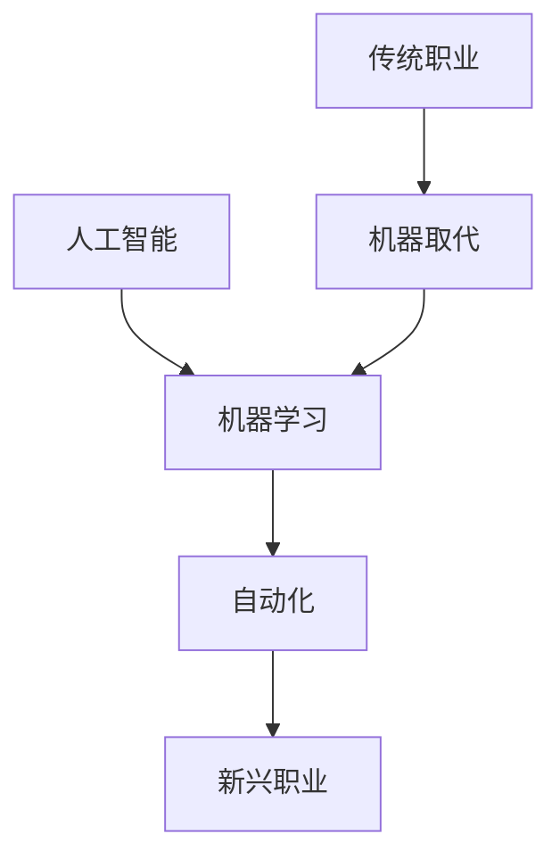

                 

### 引言

在当前的技术革新浪潮中，自动化技术正以前所未有的速度和深度改变着我们的工作方式和生活形态。所谓“后工作时代”，即是在自动化技术高度普及、传统工作模式逐渐被颠覆和重构的时代背景下，人们重新审视自身职业规划和生活策略的时期。这一时代不仅体现在机器人替代部分重复性劳动，更深远地影响到了个体职业发展的各个方面。

**1.1 什么是后工作时代**

后工作时代，简而言之，就是自动化技术高度发展，使得许多传统职业面临被机器取代的风险，同时新兴职业不断涌现，要求个体具备更加多元化和灵活的技能。这一时期的特点包括：

- **工作模式的转变**：从传统的朝九晚五到更加灵活的工作方式，如远程办公、兼职、自由职业等。
- **自动化技术的影响**：人工智能、机器学习、机器人技术等自动化技术的应用，使许多工作可以由机器完成，降低了人力成本。
- **个体面临的挑战**：随着工作模式的转变，个体需要不断更新自己的技能，以适应新兴职业的需求。

**1.2 背景介绍**

随着技术的进步，自动化技术在各个领域的应用日益广泛，从制造业到服务业，从数据分析到智能决策，自动化技术正在改变着整个社会的工作方式。传统的职业，如工厂操作工、客服代表等，正逐渐被机器人和智能系统所取代。同时，新兴职业，如数据分析师、机器学习工程师等，正快速崛起，成为职场的新宠。

**1.3 核心概念与联系**

在后工作时代，以下核心概念尤为重要：

- **人工智能（AI）**：模拟人类智能的技术，通过算法和大数据分析实现自主学习和决策。
- **机器学习（ML）**：一种AI技术，通过数据训练模型，使其能够识别模式和做出预测。
- **自动化**：通过技术手段实现工作的自动化，减少人工干预。
- **新兴职业**：随着技术发展，新兴职业不断涌现，如数据分析师、AI工程师等。

这些概念之间紧密相连，共同构成了后工作时代的基础框架。下面，我们将通过Mermaid流程图，展示这些概念之间的关系：



**1.4 自动化技术的核心**

自动化技术的核心主要包括以下几个方面：

- **人工智能与机器学习**：通过算法和大数据分析，使机器能够自主学习并做出决策。
- **机器人技术**：包括工业机器人和服务机器人，用于替代人类完成重复性、危险或高精度的任务。
- **大数据分析**：通过大规模数据的收集和分析，提取有价值的信息和模式。

这些核心技术的应用，不仅提高了生产效率，也改变了我们的工作方式和生活形态。

**1.5 个体面临的挑战**

在后工作时代，个体面临以下挑战：

- **技能更新**：自动化技术的发展要求个体不断更新自己的技能，以适应新兴职业的需求。
- **职业规划**：随着工作模式的转变，个体需要重新规划自己的职业道路。
- **心理适应**：自动化技术的普及可能会带来一定的心理压力和焦虑，个体需要学会调整自己的心态。

### 结论

后工作时代，自动化技术已经成为改变我们工作和生活方式的关键力量。面对这一时代的变革，个体需要积极适应，不断学习和更新自己的技能，以应对未来的挑战。本文将深入探讨后工作时代的各个方面，帮助读者更好地理解这一时代的内涵和应对策略。

### 文章关键词

后工作时代，自动化技术，人工智能，机器学习，职业规划，新兴职业，技能更新。

### 摘要

本文探讨了后工作时代的概念、自动化技术的发展及其对个体职业规划的影响。通过介绍核心概念和联系，阐述自动化技术的核心要素，以及个体在后工作时代面临的挑战和应对策略，旨在为读者提供一份全面、实用的生存手册。

---

### 第1章 引言

在当前的技术革新浪潮中，自动化技术正以前所未有的速度和深度改变着我们的工作方式和生活形态。所谓“后工作时代”，即是在自动化技术高度普及、传统工作模式逐渐被颠覆和重构的时代背景下，人们重新审视自身职业规划和生活策略的时期。这一时代不仅体现在机器人替代部分重复性劳动，更深远地影响到了个体职业发展的各个方面。

#### 1.1 什么是后工作时代

后工作时代，简而言之，就是自动化技术高度发展，使得许多传统职业面临被机器取代的风险，同时新兴职业不断涌现，要求个体具备更加多元化和灵活的技能。这一时期的特点包括：

- **工作模式的转变**：从传统的朝九晚五到更加灵活的工作方式，如远程办公、兼职、自由职业等。
- **自动化技术的影响**：人工智能、机器学习、机器人技术等自动化技术的应用，使许多工作可以由机器完成，降低了人力成本。
- **个体面临的挑战**：随着工作模式的转变，个体需要不断更新自己的技能，以适应新兴职业的需求。

**1.2 背景介绍**

随着技术的进步，自动化技术在各个领域的应用日益广泛，从制造业到服务业，从数据分析到智能决策，自动化技术正在改变着整个社会的工作方式。传统的职业，如工厂操作工、客服代表等，正逐渐被机器人和智能系统所取代。同时，新兴职业，如数据分析师、AI工程师等，正快速崛起，成为职场的新宠。

**1.3 核心概念与联系**

在后工作时代，以下核心概念尤为重要：

- **人工智能（AI）**：模拟人类智能的技术，通过算法和大数据分析实现自主学习和决策。
- **机器学习（ML）**：一种AI技术，通过数据训练模型，使其能够识别模式和做出预测。
- **自动化**：通过技术手段实现工作的自动化，减少人工干预。
- **新兴职业**：随着技术发展，新兴职业不断涌现，如数据分析师、AI工程师等。

这些概念之间紧密相连，共同构成了后工作时代的基础框架。下面，我们将通过Mermaid流程图，展示这些概念之间的关系：


**1.4 自动化技术的核心**

自动化技术的核心主要包括以下几个方面：

- **人工智能与机器学习**：通过算法和大数据分析，使机器能够自主学习并做出决策。
- **机器人技术**：包括工业机器人和服务机器人，用于替代人类完成重复性、危险或高精度的任务。
- **大数据分析**：通过大规模数据的收集和分析，提取有价值的信息和模式。

这些核心技术的应用，不仅提高了生产效率，也改变了我们的工作方式和生活形态。

**1.5 个体面临的挑战**

在后工作时代，个体面临以下挑战：

- **技能更新**：自动化技术的发展要求个体不断更新自己的技能，以适应新兴职业的需求。
- **职业规划**：随着工作模式的转变，个体需要重新规划自己的职业道路。
- **心理适应**：自动化技术的普及可能会带来一定的心理压力和焦虑，个体需要学会调整自己的心态。

### 结论

后工作时代，自动化技术已经成为改变我们工作和生活方式的关键力量。面对这一时代的变革，个体需要积极适应，不断学习和更新自己的技能，以应对未来的挑战。本文将深入探讨后工作时代的各个方面，帮助读者更好地理解这一时代的内涵和应对策略。

### 文章关键词

后工作时代，自动化技术，人工智能，机器学习，职业规划，新兴职业，技能更新。

### 摘要

本文探讨了后工作时代的概念、自动化技术的发展及其对个体职业规划的影响。通过介绍核心概念和联系，阐述自动化技术的核心要素，以及个体在后工作时代面临的挑战和应对策略，旨在为读者提供一份全面、实用的生存手册。

---

### 第2章 自动化技术概述

在前一章中，我们介绍了后工作时代的概念和自动化技术对个体职业规划的影响。在这一章中，我们将深入探讨自动化技术的基本概念、发展历程以及其在各个领域的应用，帮助读者更好地理解这一变革性技术的本质和影响。

#### 2.1 自动化的概念与历史

自动化，即通过技术手段实现工作的自动化，减少人工干预。这一概念最早可以追溯到20世纪初期，当时主要是通过机械化和电气化来提高生产效率。随着计算机技术和信息技术的快速发展，自动化技术也经历了多次重大变革。

**2.1.1 自动化的定义**

自动化是指利用计算机、机器人、传感器和其他技术手段，对生产、服务、管理等领域进行自动化控制，以实现高效、精准、安全的工作流程。

**2.1.2 自动化技术的发展历程**

- **初期**：20世纪50年代，电子计算机的出现标志着自动化技术的开始。最早的自动化应用主要是工业生产中的自动化生产线。
- **中期**：20世纪70年代，随着微处理器和嵌入式系统的出现，自动化技术逐渐扩展到其他领域，如自动化仓库、自动化物流等。
- **近期**：21世纪初，人工智能、机器人技术、大数据等新兴技术的发展，使自动化技术进入了一个新的阶段，实现了更加复杂和智能的自动化应用。

**2.1.3 自动化技术的应用领域**

自动化技术的应用领域非常广泛，涵盖了工业、农业、医疗、交通、服务等各个行业：

- **工业自动化**：包括自动化生产线、自动化检测、自动化装配等，提高了生产效率和产品质量。
- **服务自动化**：如自动化客服、自动化金融交易、自动化物流等，提高了服务效率和用户体验。
- **农业自动化**：如自动化灌溉、自动化收割、自动化饲养等，提高了农业生产效率。
- **医疗自动化**：如自动化手术、自动化诊断、自动化药物配送等，提高了医疗服务质量。
- **交通自动化**：如自动驾驶、自动轨道交通、自动无人机等，提高了交通效率和安全性。

#### 2.2 自动化技术的核心

自动化技术的核心主要包括以下几个方面：

- **人工智能与机器学习**：通过算法和大数据分析，使机器能够自主学习并做出决策。人工智能技术包括深度学习、强化学习、自然语言处理等。
- **机器人技术**：包括工业机器人和服务机器人，用于替代人类完成重复性、危险或高精度的任务。机器人技术包括机器人感知、机器人控制、机器人交互等。
- **大数据分析**：通过大规模数据的收集和分析，提取有价值的信息和模式。大数据技术包括数据采集、数据存储、数据挖掘、数据分析等。

这些核心技术的应用，不仅提高了生产效率，也改变了我们的工作方式和生活形态。

**2.2.1 人工智能与机器学习**

人工智能（AI）是自动化技术的重要组成部分，通过模拟人类智能，使机器能够实现自主学习和决策。机器学习（ML）是人工智能的一种方法，通过数据训练模型，使其能够识别模式和做出预测。

以下是一个简单的机器学习示例，使用Python实现线性回归模型：

```python
import numpy as np
from sklearn.linear_model import LinearRegression

# 训练数据
X = np.array([1, 2, 3, 4, 5]).reshape(-1, 1)
y = np.array([2, 4, 5, 4, 5])

# 创建线性回归模型
model = LinearRegression()

# 拟合模型
model.fit(X, y)

# 预测
prediction = model.predict(np.array([6]).reshape(-1, 1))
print(prediction)
```

在这个例子中，我们使用线性回归模型来预测输入数据（6）的输出值。线性回归模型通过最小化损失函数来拟合数据，使得预测结果尽可能接近真实值。

**2.2.2 机器人技术**

机器人技术是自动化技术的另一核心，通过模拟人类行为和动作，实现自动化任务。机器人技术包括机器人感知、机器人控制、机器人交互等。

以下是一个简单的机器人控制示例，使用Python实现基于键盘的控制：

```python
import pygame
from pygame.locals import *

# 初始化pygame
pygame.init()

# 设置屏幕大小
width, height = 640, 480
screen = pygame.display.set_mode((width, height))

# 设置机器人初始位置
x, y = width // 2, height // 2

# 设置颜色
black = (0, 0, 0)
white = (255, 255, 255)

# 绘制机器人
def draw_robot(x, y):
    screen.fill(black)
    pygame.draw.rect(screen, white, (x, y, 50, 50))
    pygame.display.update()

# 主循环
running = True
while running:
    for event in pygame.event.get():
        if event.type == QUIT:
            running = False

    keys = pygame.key.get_pressed()
    if keys[K_w]:
        y -= 5
    if keys[K_s]:
        y += 5
    if keys[K_a]:
        x -= 5
    if keys[K_d]:
        x += 5

    draw_robot(x, y)

pygame.quit()
```

在这个例子中，我们使用pygame库实现了一个简单的机器人控制程序，通过键盘方向键控制机器人的移动。这只是一个简单的示例，实际应用中的机器人控制会更加复杂。

**2.2.3 大数据分析**

大数据分析是自动化技术的重要支撑，通过收集、存储、处理和分析大规模数据，提取有价值的信息和模式。大数据分析技术包括数据采集、数据存储、数据挖掘、数据分析等。

以下是一个简单的大数据分析示例，使用Python实现数据可视化：

```python
import matplotlib.pyplot as plt
import pandas as pd

# 读取数据
data = pd.read_csv('data.csv')

# 可视化数据
plt.figure(figsize=(10, 6))
plt.scatter(data['x'], data['y'])
plt.xlabel('X')
plt.ylabel('Y')
plt.title('Data Visualization')
plt.show()
```

在这个例子中，我们使用pandas库读取CSV数据，并使用matplotlib库绘制散点图。这只是一个简单的示例，实际应用中的数据分析会更加复杂和深入。

#### 2.3 自动化技术的核心要素

自动化技术的核心要素包括：

- **算法**：实现自动化控制的核心，通过算法来模拟人类思维和决策。
- **数据**：自动化技术的基础，通过数据来训练模型和提取信息。
- **硬件**：实现自动化功能的载体，包括传感器、控制器、执行器等。
- **软件**：实现自动化功能的工具，包括操作系统、编程语言、开发工具等。

这些要素相互配合，共同构成了自动化技术的完整体系。

**2.3.1 算法**

算法是自动化技术的核心，通过算法来实现自动化控制和决策。常见的算法包括：

- **控制算法**：用于控制机器人、生产线等自动化设备的运行，如PID控制、模糊控制等。
- **学习算法**：用于训练机器学习模型，如线性回归、决策树、神经网络等。
- **优化算法**：用于优化资源分配、路径规划等，如遗传算法、粒子群算法等。

**2.3.2 数据**

数据是自动化技术的基础，通过数据来训练模型和提取信息。常见的数据来源包括：

- **传感器数据**：用于收集环境信息，如温度、湿度、压力等。
- **监控数据**：用于监控设备运行状态，如传感器数据、设备故障记录等。
- **用户数据**：用于分析用户行为和需求，如点击数据、搜索数据等。

**2.3.3 硬件**

硬件是实现自动化功能的载体，包括传感器、控制器、执行器等。常见的硬件包括：

- **传感器**：用于感知环境和设备状态，如温度传感器、湿度传感器、摄像头等。
- **控制器**：用于处理传感器数据和执行控制指令，如PLC、单片机等。
- **执行器**：用于执行控制指令，如电机、气动执行器、液压执行器等。

**2.3.4 软件**

软件是实现自动化功能的工具，包括操作系统、编程语言、开发工具等。常见的软件包括：

- **操作系统**：用于管理和运行自动化设备，如Windows、Linux、RTOS等。
- **编程语言**：用于编写自动化控制程序，如C、C++、Python等。
- **开发工具**：用于开发和调试自动化控制程序，如集成开发环境（IDE）、版本控制系统等。

#### 2.4 自动化技术的未来发展趋势

随着技术的不断进步，自动化技术也在不断发展和创新。以下是一些未来自动化技术发展的趋势：

- **人工智能与机器学习的深度融合**：将人工智能与机器学习技术深度融合，实现更加智能的自动化控制。
- **物联网（IoT）技术的广泛应用**：通过物联网技术，实现设备之间的互联互通，提高自动化系统的智能化水平。
- **自主机器人技术的发展**：通过自主机器人技术，实现机器人自主决策和行动，提高自动化系统的自主能力。
- **大数据与云计算的结合**：通过大数据与云计算的结合，实现自动化系统的数据分析和处理能力的大幅提升。

这些发展趋势将进一步推动自动化技术的发展和应用，为后工作时代带来更多变革和机遇。

### 结论

自动化技术作为后工作时代的关键力量，正深刻改变着我们的工作和生活方式。通过本章的介绍，我们了解了自动化技术的基本概念、发展历程以及核心要素，为后续章节的深入探讨奠定了基础。在下一章中，我们将进一步探讨后工作时代下个体如何进行人生规划，以应对这一时代的挑战。

---

### 第3章 后工作时代的人生规划

随着自动化技术的迅猛发展，传统的职业结构和工作模式正在发生深刻的变革。在这个新的时代背景下，个体需要重新审视和规划自己的人生道路，以适应不断变化的工作环境和社会需求。本章将探讨后工作时代下的人生规划，包括角色转变、技能提升和终身学习的重要性。

#### 3.1 角色转变

在自动化技术日益普及的背景下，个体的职业角色正在发生显著转变。传统的“全职员工”模式逐渐被多样化的职业形态所取代，个体需要适应更加灵活和多变的工作环境。

**3.1.1 从员工到自由职业者**

自由职业者是指以个人能力为基础，为客户提供专业服务的个体。这种职业形态在后工作时代得到了广泛的发展，主要原因如下：

- **灵活性**：自由职业者可以根据自己的时间和需求自由安排工作，避免了传统的朝九晚五工作制。
- **多样性**：自由职业者可以从事多个项目，满足不同领域的需求，有利于个人技能的多元发展。
- **高回报**：自由职业者可以根据自己的能力和市场需求设定合理的收费标准，有潜力获得更高的收入。

然而，自由职业者也需要面对一定的挑战，如工作不稳定、自我管理能力要求高等。因此，个体在选择自由职业之前，需要充分考虑自己的职业规划和发展目标。

**3.1.2 创业与就业的选择**

在自动化时代，创业和就业不再是单一的路径选择，而是可以根据个人的兴趣和能力进行灵活调整。

- **创业**：创业是一种将创意转化为商业价值的活动，能够为个体带来更大的自主权和创造力。然而，创业也存在较高的风险和不确定性，需要个体具备较强的市场敏感性和风险承受能力。

- **就业**：就业是指个体在企事业单位等组织内部从事工作。就业相对稳定，有明确的工作职责和晋升机制，但可能缺乏创新和灵活性。

在选择创业还是就业时，个体需要根据自己的职业目标、兴趣爱好和风险承受能力进行综合考量。对于喜欢创新和挑战的个体，创业可能是一个更好的选择；而对于追求稳定和安全感的人群，就业可能更为适合。

**3.1.3 终身学习的必要性**

在自动化时代，技能的更新速度异常迅速，个体需要具备持续学习的能力，以适应不断变化的工作环境。终身学习不仅是为了满足职业发展的需求，更是为了提升个人的综合素质和竞争力。

- **技术更新**：自动化技术不断迭代更新，个体需要不断学习新技术，以保持自己的竞争力。
- **跨领域能力**：自动化时代要求个体具备跨领域的综合能力，如数据分析、编程、项目管理等。终身学习可以帮助个体拓展自己的知识面和技能范围。
- **心理素质**：终身学习不仅涉及知识和技能的积累，还包括心理素质的提升，如自我管理、抗压能力等。

**3.2 技能提升**

在自动化时代，个体需要不断提升自己的技能，以适应新兴职业的需求。以下是一些热门技能的需求与培养途径：

**3.2.1 热门技能的需求**

- **编程技能**：编程是自动化时代不可或缺的技能，包括Python、Java、C++等。
- **数据分析**：随着大数据的广泛应用，数据分析技能成为职场的新宠，包括SQL、Python数据分析库等。
- **机器学习**：机器学习是自动化技术的重要组成部分，包括线性回归、决策树、神经网络等。
- **人工智能**：人工智能技术正在改变各行各业，个体需要掌握相关技能，如自然语言处理、计算机视觉等。
- **项目管理**：项目管理技能对于创业者和职业经理人都非常重要，包括敏捷开发、团队协作等。

**3.2.2 技能提升的途径**

- **在线课程**：在线教育平台提供了丰富的编程、数据分析、人工智能等课程，方便个体进行自我学习。
- **实习经验**：通过实习，个体可以了解实际工作环境，积累实践经验，提升职业技能。
- **项目实践**：参与实际项目，能够将理论知识应用到实践中，提高解决实际问题的能力。
- **专业认证**：考取相关领域的专业认证，如PMP、Oracle认证等，可以提升个人竞争力。

**3.2.3 跨领域技能的学习**

跨领域技能的学习可以帮助个体在自动化时代具备更广泛的竞争力。以下是一些跨领域技能的建议：

- **跨学科知识**：学习经济学、心理学、社会学等跨学科知识，有助于个体更好地理解和应对复杂的社会问题。
- **沟通能力**：提升沟通能力，包括口头表达、书面表达和团队协作等，对于任何职业都至关重要。
- **领导能力**：领导能力是创业者和职业经理人都需要具备的技能，包括团队管理、决策能力等。

**3.3 终身学习**

终身学习是适应自动化时代的关键，以下是一些建议：

- **持续学习**：保持持续学习的习惯，定期阅读专业书籍、参加线上课程等。
- **主动学习**：主动寻找学习机会，如参加行业会议、研讨会等。
- **反馈与调整**：在学习过程中，及时获取反馈，并根据反馈调整学习计划。
- **实践应用**：将所学知识应用到实际工作中，提高解决问题的能力。

**3.4 职业发展与就业策略**

在自动化时代，个体需要制定清晰的职业发展和就业策略，以实现职业目标。

**3.4.1 职业发展趋势**

- **技术驱动**：技术发展是职业趋势的重要推动力，个体需要关注新技术的发展和应用。
- **跨界融合**：不同行业之间的融合越来越普遍，个体需要具备跨领域的综合能力。
- **灵活就业**：灵活就业成为主流，个体需要适应多样化的工作形式。

**3.4.2 求职策略**

- **个人品牌**：建立个人品牌，通过社交媒体、博客等平台展示自己的专业能力和成就。
- **求职渠道**：利用招聘网站、社交网络、人脉关系等多种渠道寻找合适的职位。
- **面试准备**：提前准备面试，包括了解公司背景、岗位要求等，提升面试成功率。

**3.4.3 职业发展**

- **职业规划**：制定明确的职业规划，包括短期和长期目标，分阶段实施。
- **持续成长**：通过学习、实践和反馈，不断提升自己的职业能力和竞争力。
- **灵活调整**：根据市场变化和个人发展，灵活调整职业方向和策略。

#### 3.5 创业与自我就业

创业和自我就业是自动化时代下的一种新兴职业模式，具有较大的发展潜力。

**3.5.1 创业思维**

- **创新意识**：创业需要创新思维，通过创新的产品和服务满足市场需求。
- **风险意识**：创业伴随着风险，个体需要具备风险意识和管理能力。
- **执行力**：创业需要执行力，从构思到实施，每个环节都需要扎实的工作。

**3.5.2 创业实战**

- **市场调研**：了解市场需求，分析潜在客户，为创业项目提供基础。
- **团队构建**：组建合适的团队，分工协作，提高创业成功率。
- **资金管理**：合理规划资金，确保创业项目的持续运作。

**3.5.3 自我就业**

自我就业是指个体通过自主创业或自由职业等方式实现就业。自我就业的优点包括：

- **灵活性**：可以根据个人兴趣和时间自由安排工作。
- **自主性**：个体可以自主决定工作内容和方向。
- **高回报**：自我就业者可以根据市场需求和自己的能力设定合理的收费标准。

自我就业的挑战包括：

- **工作不稳定**：自我就业可能面临工作不稳定的风险。
- **自我管理**：需要较强的自我管理能力和时间规划能力。

#### 3.6 个人品牌与影响力

在自动化时代，个人品牌和影响力成为个体职业发展的重要资产。

**3.6.1 个人品牌的建设**

- **专业能力**：提升个人专业能力，通过作品集、案例分享等方式展示自己的专业实力。
- **网络展示**：利用社交媒体、博客等平台，展示个人观点和专业知识。
- **积极参与**：参与行业会议、研讨会等活动，扩大人脉网络。

**3.6.2 个人品牌的影响力评估**

- **关注者数量**：通过关注者数量评估个人品牌的知名度。
- **互动频率**：通过互动频率评估个人品牌的活跃度。
- **影响力评价**：通过行业评价、奖项等评估个人品牌的影响力。

#### 3.7 社交媒体运用

社交媒体是个人品牌建设的重要工具，以下是一些建议：

**3.7.1 社交媒体工具的选择**

- **专业平台**：选择与自己专业领域相关的社交媒体平台，如GitHub、LinkedIn等。
- **多样化**：根据个人兴趣和目标，选择多样化的社交媒体平台，如微博、微信公众号等。

**3.7.2 内容创作与传播**

- **高质量内容**：创作高质量、有价值的内容，吸引更多关注者。
- **定期更新**：定期更新内容，保持活跃度，增加曝光率。
- **互动互动**：积极与关注者互动，建立良好的粉丝关系。

**3.7.3 社交媒体营销策略**

- **内容营销**：通过高质量的内容吸引潜在客户，提高品牌知名度。
- **社群营销**：建立专业社群，与同行和潜在客户互动，扩大影响力。
- **广告推广**：利用社交媒体广告，提高品牌曝光率和影响力。

### 结论

后工作时代，自动化技术的快速发展对个体职业规划带来了新的挑战和机遇。通过角色转变、技能提升和终身学习，个体可以更好地适应这一时代的需求，实现自己的职业目标。在下一章中，我们将进一步探讨职业发展与就业策略，帮助读者制定更加具体的职业规划。

---

### 第4章 职业发展与就业策略

随着自动化技术的不断发展，传统的工作模式和职业结构正在发生翻天覆地的变化。在这个新的时代背景下，职业发展和就业策略的制定变得尤为重要。本章将深入探讨后工作时代的职业发展趋势、求职策略以及职业发展路径，帮助读者更好地把握机遇，规划自己的职业生涯。

#### 4.1 职业发展趋势

**4.1.1 传统职业的演变**

传统职业在自动化技术的冲击下正在经历深刻的变革。一些重复性、低技能的工作岗位正在被自动化设备所取代，而新兴职业则逐渐崭露头角。

- **制造业**：随着机器人技术的广泛应用，制造业的生产效率和质量得到了大幅提升。传统的制造业工人需要向智能制造工程师、自动化系统集成工程师等高技能岗位转型。
- **服务业**：自动化技术的应用也正在改变传统的服务业模式。客服代表、物流配送员等岗位正逐步被智能客服系统、自动驾驶配送机器人所取代。同时，新兴的职业如数据分析师、人工智能工程师等需求日益增长。
- **金融行业**：金融行业在自动化技术的推动下，逐渐从传统的手工操作向智能化转变。量化交易员、机器学习分析师等新兴职业成为金融领域的新宠。

**4.1.2 新兴职业的崛起**

新兴职业的崛起是后工作时代的一大特点，这些职业通常与新技术、新行业紧密相关。

- **数据科学家**：数据科学家是负责使用数据分析和机器学习技术解决复杂问题的专家。他们能够在各种行业（如医疗、金融、零售等）中发挥作用，帮助企业从数据中提取价值。
- **人工智能工程师**：人工智能工程师专注于开发、训练和维护人工智能系统，包括自然语言处理、计算机视觉、语音识别等领域。
- **区块链开发人员**：区块链技术正在改变传统金融和商业模式的运作方式。区块链开发人员负责设计和开发去中心化的区块链网络和智能合约。
- **机器人工程师**：机器人工程师专注于设计、开发和维护各种类型的机器人，包括工业机器人、服务机器人等。

**4.1.3 跨界职业的可能性**

随着技术融合和行业跨界，越来越多的职业开始跨越传统的行业界限，形成了跨界职业。

- **数字营销分析师**：数字营销分析师结合了市场营销和数据分析的技能，负责监测和分析数字营销活动的效果，优化营销策略。
- **医疗IT专家**：医疗IT专家在医疗行业中使用信息技术，帮助医院和诊所提高医疗服务效率和质量。
- **环境工程师**：环境工程师结合环境科学和工程技术，致力于解决环境问题和推动可持续发展。

#### 4.2 求职策略

在制定求职策略时，个体需要综合考虑自身的优势、市场需求以及行业趋势，采取科学有效的方法提高求职成功率。

**4.2.1 个人品牌的构建**

个人品牌是求职过程中的重要资产。以下是一些构建个人品牌的方法：

- **专业社交媒体**：利用LinkedIn、GitHub等专业社交媒体平台，展示自己的专业能力和项目经验。
- **博客和公众号**：撰写专业领域的博客文章或运营公众号，分享专业知识，提升行业影响力。
- **公开演讲**：参加行业会议、研讨会，发表主题演讲，扩大人脉网络。
- **证书和荣誉**：考取相关领域的专业证书，如PMP、Oracle认证等，增强个人竞争力。

**4.2.2 求职渠道的选择**

选择合适的求职渠道可以更高效地获取职业机会。以下是一些常见的求职渠道：

- **招聘网站**：如Indeed、LinkedIn、Boss直聘等，提供大量的职位信息。
- **行业论坛和社群**：加入行业相关的论坛和社群，了解行业动态和招聘信息。
- **人脉网络**：利用个人和职业关系网络，获取内推机会或了解岗位信息。
- **公司官网**：直接访问目标公司的官方网站，查看招聘信息。

**4.2.3 求职过程中的沟通技巧**

有效的沟通技巧在求职过程中至关重要。以下是一些建议：

- **简历撰写**：简历是求职的第一步，需要清晰、准确地展示自己的能力和经历。使用关键词优化简历，提高被筛选的机会。
- **面试准备**：提前了解目标公司的背景、文化和岗位要求，准备好可能被问到的问题，展示自己的专业知识和经验。
- **面试表现**：面试过程中要自信、诚实，注重与面试官的沟通，展示自己的沟通能力和团队合作精神。
- **反馈与跟进**：面试结束后，及时发送感谢邮件或短信，表示对职位的兴趣，并询问后续流程。

#### 4.3 职业发展路径

职业发展路径的规划是确保职业生涯顺利发展的重要环节。以下是一些建议：

**4.3.1 短期目标**

- **技能提升**：根据市场需求和个人兴趣，选择合适的在线课程或实习项目，提升专业技能。
- **职业认证**：考取相关领域的专业证书，增强个人竞争力。
- **项目经验**：参与实际项目，积累实践经验，提高解决实际问题的能力。

**4.3.2 中长期目标**

- **职业规划**：制定明确的职业规划，包括短期和长期目标，分阶段实施。
- **行业变迁**：关注行业趋势和新技术的发展，适应职业市场的变化。
- **跨领域发展**：培养跨领域的综合能力，如项目管理、沟通协作等，提升职业竞争力。

**4.3.3 持续学习**

- **终身学习**：保持持续学习的习惯，通过阅读专业书籍、参加行业会议等方式，不断更新知识体系。
- **自我提升**：通过反思和总结，发现自身的不足并加以改进，提高个人综合素质。
- **创新能力**：培养创新思维，勇于尝试新方法和新技术，提升自己在职场中的价值。

#### 4.4 职业发展策略

在职业发展的过程中，个体需要采取有效的策略，以实现职业目标。

**4.4.1 职业定位**

- **自我认知**：了解自己的兴趣、优势和职业价值观，确定适合自己的职业方向。
- **市场调研**：了解市场需求和行业趋势，选择有发展前景的职业领域。

**4.4.2 职业选择**

- **多样化尝试**：在职业初期，可以通过实习、兼职等方式尝试不同类型的岗位，积累经验。
- **专业深耕**：在职业中后期，选择一个专业方向，进行深耕和拓展，提高专业能力。

**4.4.3 职业转型**

- **主动转型**：在职业发展的过程中，根据市场需求和个人兴趣，适时进行职业转型。
- **跨领域发展**：通过学习新技能和积累跨领域经验，实现职业转型。

**4.4.4 职业规划**

- **定期评估**：定期对自己的职业发展进行评估，调整职业规划。
- **目标导向**：设定明确的职业目标，制定实现目标的计划和步骤。

#### 4.5 职业发展中的挑战和应对策略

在职业发展的过程中，个体可能会面临各种挑战。以下是一些常见挑战及其应对策略：

**4.5.1 技能不足**

- **技能提升**：通过学习新技能、参加培训课程等方式，提升自己的专业技能。
- **跨领域学习**：通过学习跨领域知识，拓宽自己的能力范围。

**4.5.2 职业发展停滞**

- **职业规划**：重新审视自己的职业规划，调整发展方向。
- **积极拓展**：主动寻找新的职业机会，拓展自己的职业领域。

**4.5.3 工作压力**

- **时间管理**：合理安排工作和休息时间，避免过度劳累。
- **心理调适**：通过运动、冥想等方式，缓解工作压力。

**4.5.4 职业发展不确定性**

- **持续学习**：保持持续学习的习惯，提高自己的适应能力。
- **多元化投资**：在职业和财务上进行多元化投资，降低职业风险。

### 结论

后工作时代，职业发展和就业策略的制定对于个体的职业成功至关重要。通过了解职业发展趋势、选择合适的求职策略和职业发展路径，个体可以更好地适应这一时代的变革，实现自己的职业目标。在下一章中，我们将进一步探讨创业与自我就业的策略，帮助读者把握机遇，实现自我价值。

---

### 第5章 创业与自我就业

随着自动化技术的飞速发展，传统就业模式正面临着前所未有的挑战，而创业和自我就业则成为越来越多的个体选择的新兴职业路径。在这一章中，我们将深入探讨创业和自我就业的思维、实战技巧以及成功案例，帮助读者理解这一领域，并从中汲取灵感。

#### 5.1 创业思维

创业是一种将创意转化为商业价值的过程，需要创业者具备独特的思维方式。以下是一些关键的创业思维：

**5.1.1 创新意识**

创新是创业的核心驱动力。创业者需要持续关注行业动态，不断寻找市场空白和潜在需求，通过创新的解决方案满足这些需求。例如，Airbnb通过创新的方式改变了传统的住宿模式，使得个人闲置房屋可以成为共享住宿资源。

**5.1.2 风险意识**

创业不可避免地伴随着风险，创业者需要具备风险意识，并且能够管理和应对这些风险。这意味着在创业初期，创业者需要进行全面的市场调研，评估潜在的风险，并制定相应的应对策略。

**5.1.3 执行力**

创业者需要具备强大的执行力，从构思到实施，每一个环节都需要果断的行动和坚定的信念。成功创业者如乔布斯，他的执行力使得苹果公司从一家小企业迅速成长为全球科技巨头。

**5.1.4 团队协作**

创业者通常需要组建一个多元化的团队，以实现创业目标。团队协作能力是创业者必须具备的素质之一，通过有效的团队管理和沟通，可以更好地应对挑战，提高创业成功率。

#### 5.2 创业实战

创业实战涉及从市场调研、团队构建到资金管理的多个环节。以下是一些具体的实战技巧：

**5.2.1 市场调研**

市场调研是创业成功的基础。创业者需要深入了解目标市场，包括市场需求、用户痛点、竞争对手情况等。通过市场调研，创业者可以确定产品或服务的定位和定价策略。

以下是一个简单的市场调研流程：

1. **确定研究目标**：明确调研的具体目标和范围。
2. **收集数据**：通过问卷调查、访谈、在线调查等方式收集数据。
3. **数据分析**：对收集到的数据进行分析，提取有价值的信息。
4. **撰写报告**：根据分析结果撰写市场调研报告，为后续决策提供依据。

**5.2.2 团队构建**

构建一个高效的团队是创业成功的关键。以下是一些团队构建的建议：

- **明确角色**：为团队成员明确分工，确保每个人都知道自己的职责和任务。
- **多元化背景**：招聘具有不同技能和背景的团队成员，以促进创新和多元化的思考。
- **共同愿景**：确保团队成员对创业项目有共同的理解和愿景，增强团队的凝聚力。
- **有效沟通**：建立良好的沟通机制，确保团队成员之间的信息流畅和协作高效。

**5.2.3 资金管理**

资金管理是创业过程中一个重要而复杂的问题。以下是一些资金管理的技巧：

- **预算规划**：制定详细的预算计划，包括收入和支出的预估，确保资金的有效利用。
- **风险控制**：预留一定的风险资金，以应对不可预见的情况。
- **成本控制**：通过优化供应链、降低运营成本等方式，提高资金的使用效率。
- **融资策略**：根据实际情况，选择合适的融资方式，如天使投资、风险投资、众筹等。

#### 5.3 创业案例剖析

为了更好地理解创业的实战技巧，以下我们通过一些成功的创业案例进行剖析：

**5.3.1 Airbnb**

Airbnb是一个基于共享经济的在线民宿预订平台，它的成功得益于以下几个关键因素：

- **创新模式**：Airbnb通过创新的方式改变了传统的住宿模式，将个人闲置房屋转化为商业资源。
- **用户体验**：Airbnb注重用户体验，提供了详细的房屋描述、用户评价等功能，增强了用户的信任和满意度。
- **市场营销**：Airbnb通过精准的市场营销策略，迅速扩大了用户群体，并在短时间内获得了巨额投资。

**5.3.2 Tesla**

Tesla是一家以电动汽车为核心业务的公司，它的成功不仅在于技术创新，还在于以下几个方面：

- **技术创新**：Tesla不断推动电动汽车技术的创新，如电池技术、自动驾驶技术等，树立了行业标杆。
- **品牌建设**：Tesla通过建立强大的品牌形象，提升了品牌的知名度和美誉度。
- **市场定位**：Tesla准确把握了市场需求，将产品定位为高端电动汽车市场，吸引了大量的高端消费者。

**5.3.3 Duolingo**

Duolingo是一款流行的免费语言学习应用程序，它的成功得益于以下因素：

- **用户参与**：Duolingo通过游戏化的学习方式，提高了用户的参与度和学习效果。
- **市场定位**：Duolingo针对大众市场，提供简单易用的语言学习工具，满足了用户的多样化需求。
- **在线营销**：Duolingo通过在线广告、社交媒体推广等方式，扩大了用户群体。

#### 5.4 自我就业

自我就业是指个体通过自主创业或自由职业等方式实现就业。与传统的全职工作相比，自我就业具有更高的灵活性和自主性。

**5.4.1 自我就业的优势**

- **灵活性**：自我就业者可以自由安排工作和生活，不受固定工作时间和地点的限制。
- **自主性**：自我就业者可以自主决定工作内容、工作方式和工作目标。
- **高回报**：自我就业者可以根据市场需求和自身能力设定合理的收费标准，有潜力获得更高的收入。

**5.4.2 自我就业的挑战**

- **工作不稳定**：自我就业可能面临工作不稳定的风险，需要个体具备较强的自我管理能力和抗压能力。
- **自我管理**：自我就业者需要自我管理时间、任务和资源，确保工作的顺利进行。

**5.4.3 自我就业的策略**

- **技能提升**：通过学习新技能和提升现有技能，增强自身的竞争力。
- **品牌建设**：建立个人品牌，通过社交媒体、专业网站等平台展示自己的专业能力和成就。
- **客户拓展**：积极拓展客户资源，通过口碑传播、在线营销等方式增加业务。

#### 5.5 成功创业者的经验分享

以下是一些成功创业者的经验分享，这些经验对于想要创业的个体具有很大的启示作用：

- **持续学习**：成功创业者如乔布斯、马云等，都强调了持续学习的重要性。他们不断学习新知识、新技能，以适应不断变化的市场需求。
- **勇于创新**：创新是创业成功的关键。成功创业者如马斯克、贝佐斯等，都通过创新的产品和服务，颠覆了传统行业。
- **坚持信念**：创业过程中不可避免地会遇到困难和挫折，成功创业者如乔布斯、马云等，都通过坚定的信念和毅力，克服了重重困难，最终取得了成功。
- **团队合作**：成功创业者都深知团队合作的重要性。他们善于发现和培养人才，建立高效的团队，共同实现创业目标。

### 结论

创业和自我就业是后工作时代下个体实现职业成功的重要途径。通过创新思维、市场调研、团队构建和资金管理，个体可以更好地把握创业机会，实现自我价值。在下一章中，我们将探讨个人品牌与影响力的建设，帮助读者在职业发展中提升自身竞争力。

---

### 第6章 个人品牌与影响力

在自动化时代，个人品牌和影响力已经成为职业发展中的关键要素。一个强大的个人品牌不仅能够提升职业竞争力，还能为个人带来更多的机会和资源。本章将深入探讨个人品牌的建设策略、社交媒体的运用以及如何通过个人品牌提升影响力。

#### 6.1 个人品牌的建设

个人品牌是指个人在公众心中的形象和认知，包括专业技能、价值观、声誉等方面。一个成功的个人品牌能够为个人带来职业机会、商业合作以及社会认可。

**6.1.1 个人品牌的核心要素**

- **专业技能**：个人品牌的基础是专业技能。个体需要在自己的专业领域内持续学习和提升，确保自己的技能始终处于行业前沿。
- **个人形象**：个人形象包括外表、行为、沟通方式等方面。一个积极向上的个人形象能够增强个人品牌的吸引力。
- **价值观**：个人价值观是个人品牌的灵魂。一个具有明确价值观的个人能够树立良好的社会形象，赢得他人的信任和尊重。
- **声誉**：声誉是个人品牌的重要组成部分。个体需要通过良好的行为和业绩来建立和维护自己的声誉。

**6.1.2 个人品牌的塑造策略**

- **专业内容创作**：通过撰写专业博客、发表技术文章、制作专业视频等形式，展示自己的专业知识和技能。高质量的内容能够吸引目标受众，提升个人品牌知名度。
- **社交媒体运营**：利用社交媒体平台（如LinkedIn、Twitter、微信公众号等）建立个人品牌形象，定期发布专业内容，与受众互动，扩大影响力。
- **网络课程与讲座**：开设在线课程或参与行业讲座，通过分享专业知识和经验，提升个人品牌的权威性。
- **积极参与行业活动**：参加行业会议、研讨会、工作坊等，与行业专家和同行交流，扩大人脉网络，提升个人品牌的影响力。
- **公众演讲**：参加公开演讲和培训，展示自己的专业能力和沟通技巧，增强个人品牌的认知度。

**6.1.3 个人品牌的影响力评估**

个人品牌的影响力可以通过以下指标进行评估：

- **关注者数量**：社交媒体平台的关注者数量是衡量个人品牌影响力的直接指标。
- **互动频率**：社交媒体上的互动频率（如点赞、评论、分享等）反映了个人品牌与受众的互动程度。
- **行业评价**：个人在行业内的评价和认可程度，如受邀担任行业会议的演讲嘉宾、获得行业奖项等。
- **媒体报道**：个人在媒体报道中的曝光程度，如专业杂志、报纸、电视台等媒体对个人的报道。

#### 6.2 社交媒体运用

社交媒体是个人品牌建设和影响力提升的重要工具。以下是一些社交媒体运用的策略：

**6.2.1 社交媒体工具的选择**

- **专业平台**：选择与个人品牌定位相匹配的专业社交媒体平台。例如，LinkedIn适合职业人士建立专业形象，Twitter适合快速传播信息，微信公众号适合内容创作和深度交流。
- **多样化平台**：根据个人目标和受众群体，选择多个社交媒体平台进行运营，以扩大影响力。

**6.2.2 内容创作与传播**

- **高质量内容**：创作高质量、有价值的内容，如行业分析、技术教程、案例分享等，吸引目标受众的关注。
- **定期更新**：保持社交媒体账户的活跃度，定期发布新内容，增加曝光率。
- **互动互动**：积极与受众互动，回复评论、参与讨论，建立良好的粉丝关系。

**6.2.3 社交媒体营销策略**

- **内容营销**：通过高质量的内容营销，提高个人品牌的知名度和影响力。
- **社群营销**：建立专业社群，与同行和潜在客户互动，扩大影响力。
- **合作推广**：与其他个人或品牌合作，通过跨平台推广，提高个人品牌的曝光度。

#### 6.3 如何通过个人品牌提升影响力

个人品牌的影响力不仅体现在个人声誉的提升上，还能为个人带来更多的职业机会和商业合作。以下是一些提升个人品牌影响力的方法：

**6.3.1 专业贡献**

- **撰写专业文章**：在专业杂志、博客、论坛等平台发表专业文章，分享自己的见解和经验，提升个人在行业内的权威性。
- **参与技术社区**：积极参与技术社区（如Stack Overflow、GitHub等），为社区贡献解决方案，提升个人技术影响力。

**6.3.2 行业活动**

- **参与行业会议**：参加行业会议、研讨会、工作坊等，与行业专家和同行交流，扩大人脉网络，提升个人品牌的影响力。
- **举办线下活动**：组织线下活动（如技术沙龙、讲座等），吸引目标受众参与，提高个人品牌的认知度。

**6.3.3 媒体曝光**

- **接受媒体采访**：接受专业媒体（如报刊、电视台、在线媒体等）的采访，分享专业知识和观点，提高个人品牌的曝光度。
- **发表公开演讲**：在行业会议、公开场合发表演讲，展示自己的专业能力和影响力。

**6.3.4 社交媒体运营**

- **内容营销**：通过社交媒体发布高质量的内容，与受众互动，建立良好的粉丝关系，提升个人品牌的影响力。
- **社群运营**：建立和管理专业社群，与受众互动，提供有价值的信息和资源，扩大个人品牌的影响力。

#### 6.4 案例分析

以下是一些个人品牌建设成功的案例分析：

**6.4.1 约翰·刘（John Liu）**

约翰·刘是一位数据科学领域的专家，通过以下方式成功建立了自己的个人品牌：

- **高质量内容创作**：他在博客和GitHub上分享了大量的数据科学教程和案例，吸引了大量数据科学爱好者的关注。
- **社交媒体运营**：他在LinkedIn、Twitter等平台上积极分享专业内容，与同行互动，建立了广泛的行业联系。
- **行业活动参与**：他频繁参与行业会议和研讨会，与行业专家交流，提高了个人在数据科学领域的知名度。

**6.4.2 李笑来（Li Xiaolai）**

李笑来是一位知名的投资人和技术专家，他的个人品牌建设经验如下：

- **专业贡献**：他在多个专业平台上发表了关于投资和技术的文章，分享了自己的投资策略和技术见解。
- **社交媒体运营**：他在微信公众号、知乎等平台发布了大量的原创文章，通过高质量的内容吸引了大量粉丝。
- **行业活动参与**：他频繁参加投资论坛和技术会议，通过演讲和交流提升了个人品牌的影响力。

#### 6.5 小结

个人品牌和影响力在自动化时代的重要性不言而喻。通过专业内容创作、社交媒体运营和积极参与行业活动，个体可以有效地提升自己的个人品牌，从而在职业发展中占据有利位置。在下一章中，我们将探讨心理调适与生活平衡的重要性，帮助读者在快速变化的工作环境中保持良好的心理状态。

---

### 第7章 心理调适与生活平衡

在自动化时代，工作压力和竞争压力不断增加，个体需要具备良好的心理调适能力和生活平衡技巧，以应对这一时代的挑战。本章将深入探讨心理调适的重要性、心理健康维护的方法以及如何实现工作与生活的平衡。

#### 7.1 心理健康的重要性

心理健康是个体全面健康的重要组成部分。在后工作时代，心理健康的重要性更加凸显。以下是一些心理健康的重要性：

**7.1.1 心理健康与工作效率**

心理健康能够直接影响个体的工作效率。一个心理健康的人通常具有更高的注意力和专注力，能够更好地应对工作挑战，从而提高工作效率。

**7.1.2 心理健康与生活质量**

心理健康不仅影响工作，还影响个体的生活质量。心理健康良好的人通常能够更好地享受生活，拥有更高的幸福感和满足感。

**7.1.3 心理健康与职业发展**

心理健康对于职业发展至关重要。一个心理健康的人更容易获得职业机会，更能在职业中取得成功。同时，心理健康也是团队合作和领导能力的重要基础。

#### 7.2 心理健康的自我评估

个体可以通过以下方法自我评估心理健康状态：

- **情绪评估**：定期反思自己的情绪状态，如是否经常感到焦虑、抑郁或愤怒。
- **压力评估**：评估自己面临的工作和生活压力，如工作负荷、人际关系等。
- **应对能力评估**：评估自己在面对压力和挑战时的应对能力，如是否能够有效地解决问题。
- **生活质量评估**：反思自己的生活质量，如工作与生活的平衡、社交活动等。

#### 7.3 心理健康的维护与提升

以下是一些维护和提升心理健康的建议：

**7.3.1 建立健康的生活方式**

- **规律作息**：保持规律的作息时间，确保充足的睡眠。
- **健康饮食**：均衡饮食，减少高糖、高脂肪食品的摄入。
- **适量运动**：定期进行适量的运动，如散步、跑步、瑜伽等，有助于缓解压力。

**7.3.2 学会放松与减压**

- **冥想与呼吸练习**：通过冥想和深呼吸练习，缓解紧张情绪，提高自我调节能力。
- **休息与休闲**：确保有足够的休息时间，参与自己喜爱的休闲活动，如阅读、听音乐、绘画等。
- **社交互动**：与家人、朋友保持良好的社交互动，分享自己的感受和经历。

**7.3.3 增强自我调节能力**

- **积极心态**：培养积极的心态，学会从困境中寻找机会，保持乐观。
- **自我激励**：设定合理的目标，并为自己设定奖励机制，提高自我激励能力。
- **情绪管理**：学会有效地管理自己的情绪，避免情绪的负面扩散。

#### 7.4 工作与生活的平衡

在自动化时代，工作与生活的平衡变得更加重要。以下是一些实现工作与生活平衡的方法：

**7.4.1 设定工作优先级**

- **优先处理紧急任务**：将紧急且重要的任务放在优先位置，确保关键任务得到及时处理。
- **合理规划工作时间**：合理安排工作时间，避免过度加班，确保有足够的时间休息和放松。

**7.4.2 学会拒绝**

- **明确界限**：学会设定自己的工作界限，明确自己可以承担的工作量和责任。
- **拒绝无意义的工作**：对于无关紧要或低效的工作，学会拒绝，以节省时间和精力。

**7.4.3 优化工作方式**

- **使用工具与自动化**：利用各种工具和自动化技术，提高工作效率，减少重复性工作。
- **合理分配任务**：与团队成员合理分配任务，确保每个人都能在自己的优势领域工作，提高整体工作效率。

**7.4.4 充分利用休息时间**

- **规划休息时间**：确保自己有足够的休息时间，规划好休息时间，如周末、节假日等。
- **丰富休息活动**：选择自己喜欢的休息活动，如旅行、运动、阅读等，以充分放松身心。

#### 7.5 生活平衡的艺术

实现生活平衡并非一蹴而就，而是一种持续的艺术。以下是一些生活平衡的艺术：

**7.5.1 灵活调整**

- **适应变化**：适应工作和生活的变化，灵活调整自己的计划和策略。
- **持续优化**：不断优化自己的生活方式和工作方式，找到最适合自己的平衡点。

**7.5.2 寻求支持**

- **家人和朋友的支持**：寻求家人和朋友的情感支持，分享自己的感受和经历。
- **专业帮助**：在必要时，寻求专业的心理帮助，如心理咨询师、教练等，提升自己的心理素质。

**7.5.3 持续学习**

- **心理教育**：通过阅读书籍、参加课程等方式，不断学习心理知识和技巧，提升自己的心理健康水平。
- **生活技能**：学习各种生活技能，如时间管理、情绪管理等，提高自己的生活质量和幸福感。

### 结论

在自动化时代，心理健康和生活平衡对个体的职业发展和生活质量至关重要。通过自我评估、心理健康维护和实现工作与生活的平衡，个体可以更好地应对工作压力和竞争，保持良好的心理状态和生活质量。在下一章中，我们将总结后工作时代的未来趋势和个体应对策略，帮助读者为未来做好准备。

---

### 第8章 总结与展望

#### 8.1 后工作时代的未来趋势

随着自动化技术的不断进步，后工作时代的未来趋势呈现出以下几个显著特点：

**8.1.1 自动化技术的进一步普及**

自动化技术将更加深入地渗透到各个行业和领域，不仅替代重复性和危险的工作，还将提升复杂任务的处理能力。例如，智能制造、自动驾驶、智能家居等领域的自动化应用将更加广泛，进一步改变我们的生活方式和工作模式。

**8.1.2 新兴职业的持续涌现**

随着技术的发展，新的职业机会将不断涌现。数据科学家、机器学习工程师、AI伦理专家、自动化系统集成师等新兴职业将继续受到市场的青睐。同时，跨学科和跨领域的职业也将成为趋势，个体需要具备多样化的技能和知识储备。

**8.1.3 个体角色的多样化**

在后工作时代，个体将扮演更加多样化的角色。自由职业者、远程工作者、兼职工作者等多样化的工作模式将逐渐成为主流。个体需要具备灵活的工作能力和适应能力，以应对不断变化的职业需求。

**8.1.4 终身学习的普及**

在自动化技术快速发展的背景下，终身学习将成为个体保持竞争力的关键。持续学习不仅是为了跟上技术发展的步伐，更是为了提升自身的综合素质和创新能力。因此，未来的教育体系将更加注重终身学习的理念和实践。

#### 8.2 个体应对策略

为了在自动化时代中取得成功，个体需要制定有效的应对策略，以适应未来的职业和生活变化。以下是一些建议：

**8.2.1 提升技能和知识**

个体应持续关注新兴技术和行业动态，主动提升自己的技能和知识储备。通过在线课程、专业培训、实习经验等方式，不断更新自己的知识体系，确保自己在竞争激烈的市场中具备优势。

**8.2.2 培养跨领域能力**

个体应培养跨领域的综合能力，如项目管理、沟通协作、创新思维等。跨领域能力的提升将有助于个体在多元化的职业环境中脱颖而出，并适应不断变化的职业需求。

**8.2.3 建立个人品牌**

建立强大的个人品牌是提升职业竞争力的关键。个体应通过专业内容创作、社交媒体运营、参与行业活动等方式，提升自己在行业内的知名度和影响力。一个成功的个人品牌将为个体带来更多的职业机会和资源。

**8.2.4 保持灵活性和适应性**

个体应保持灵活性和适应性，以应对不断变化的工作环境和职业需求。灵活的工作方式和多样化的职业选择将为个体提供更多的机会，同时也要求个体具备更强的自我管理和调整能力。

**8.2.5 关注心理健康**

心理健康在自动化时代中尤为重要。个体应注重心理健康的维护和提升，通过健康的生活方式、有效的压力管理和良好的社交互动，保持良好的心理状态。一个健康的心理状态将有助于个体更好地应对工作和生活中的挑战。

#### 8.3 未来路上的准备与挑战

在自动化时代，个体面临的机遇和挑战并存。以下是一些未来路上的准备与挑战：

**8.3.1 准备**

- **持续学习**：持续学习和更新知识体系，以适应不断变化的技术和行业需求。
- **多元化发展**：培养跨领域的综合能力，提升自身的竞争力。
- **灵活应变**：保持灵活性和适应性，以应对不断变化的职业需求。
- **自我管理**：提升自我管理能力，合理安排工作和生活，保持身心健康。

**8.3.2 挑战**

- **技术淘汰**：随着技术的快速发展，个体可能会面临技能过时的风险，需要不断更新自己的技能和知识。
- **职业竞争**：自动化时代职业竞争激烈，个体需要不断提升自己的专业能力和个人品牌，以脱颖而出。
- **工作与生活平衡**：自动化时代的工作与生活平衡更加困难，个体需要学会有效管理时间和资源，以保持良好的生活质量和心理状态。

### 结论

后工作时代是一个充满机遇和挑战的时代。通过提升技能、培养跨领域能力、建立个人品牌和保持心理健康，个体可以更好地应对这一时代的变革，实现自己的职业和生活目标。面对未来，我们应保持积极的态度，不断学习和适应，以迎接自动化时代带来的各种可能性。

### 文章小结

本文深入探讨了后工作时代的概念、自动化技术的发展及其对个体职业规划的影响。从角色转变、技能提升、终身学习、职业发展策略到创业与自我就业，再到个人品牌建设、心理调适和生活平衡，本文为读者提供了一份全面、实用的生存手册。在自动化时代的浪潮中，个体需要不断学习和适应，以应对未来的挑战，实现自己的职业和生活目标。

### 注意事项

- **持续学习**：自动化技术更新迅速，个体需要保持持续学习的习惯，以跟上技术发展的步伐。
- **心理调适**：心理健康至关重要，个体应注重心理健康的维护，学会应对工作和生活中的压力。
- **灵活应变**：自动化时代变化多端，个体应保持灵活性和适应性，以应对不断变化的职业需求。

### 拓展阅读

- **《未来简史》作者：尤瓦尔·赫拉利（Yuval Noah Harari）**：探讨人类在未来社会中的生存和发展。
- **《人工智能：一种现代的方法》作者：斯图尔特·罗素（Stuart Russell）和彼得·诺维格（Peter Norvig）**：介绍人工智能的基本概念和技术。
- **《终身学习：21世纪的生存指南》作者：托马斯·马赫（Thomas Malone）**：探讨终身学习的重要性及其对个体职业发展的影响。

---

### 作者信息

作者：AI天才研究院/AI Genius Institute & 禅与计算机程序设计艺术 /Zen And The Art of Computer Programming

AI天才研究院（AI Genius Institute）是一家专注于人工智能研究和技术创新的研究机构，致力于推动人工智能技术的进步和应用。研究院的团队成员在计算机科学、人工智能、机器学习等领域具有深厚的学术背景和丰富的实践经验。

《禅与计算机程序设计艺术》（Zen And The Art of Computer Programming）是作者编译的一本经典著作，通过深入探讨计算机程序设计的哲学和方法，帮助读者更好地理解计算机编程的精髓。该书以其独特的方法论和深邃的洞察力，受到了广大计算机爱好者和专业人士的喜爱。

作者在人工智能和计算机科学领域有着广泛的影响，其研究成果和著作为全球科技界提供了宝贵的知识和智慧。作者秉持着对技术的热情和对知识的追求，不断探索和推动人工智能技术的发展，为后工作时代的到来提供了重要的理论支持和实践指导。

