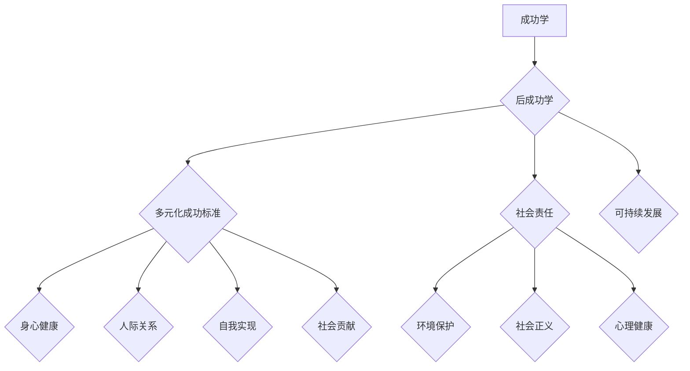

                 

### 《后成功学时代宣言：重新定义个人成就的社会运动》

#### 关键词：后成功学、个人成就、社会责任、社会运动、重新定义

##### 摘要：
本文旨在探讨后成功学时代下对个人成就的重新定义，以及这一理念如何影响并推动社会运动的发展。通过对成功学的历史回顾，分析后成功学的核心理念，我们揭示了其在个人成长、组织变革和社会责任方面的作用。文章进一步探讨了后成功学实践的具体策略，以及面临的挑战和机遇。最后，通过案例分析，展示了后成功学在社会运动中的实际应用，并提出对未来发展的展望。

### 第1章 引言

#### 1.1 成功学的兴起与衰落

成功学作为一种社会思潮，起源于19世纪的美国。随着工业革命的发展，人们对个人成就的追求愈发强烈。成功学主张通过个人努力和自我实现，达到物质和精神上的富足。这一理念在20世纪中叶达到巅峰，尤其是在二战后，全球范围内的成功学浪潮席卷了各个社会阶层。成功学代表人物如戴尔·卡耐基、拿破仑·希尔等，他们的书籍和讲座广受欢迎，推动了个人成长和自我实现的浪潮。

然而，随着社会的发展，成功学也面临着越来越多的质疑和挑战。首先，成功学过于强调个人主义，忽视了社会责任和公共利益。其次，成功学往往将成功定义为物质财富和地位，忽略了精神层面的满足和心理健康。此外，成功学的成功标准往往是单一的，忽视了多元化和个人差异。这些局限性使得成功学在现代社会中逐渐式微。

#### 1.2 后成功学的核心理念

后成功学是对传统成功学的批判和反思，旨在重新定义个人成就和社会责任。后成功学的核心观点包括：

1. **多元化成功标准**：后成功学认为，成功不应该只是物质财富和地位的追求，而是涵盖了身心健康、人际关系、自我实现和社会贡献等多个方面。每个人对成功的定义都是独特的，应当尊重个人差异和多元化。

2. **社会责任**：后成功学强调个人成就应当与社会责任相结合。成功不仅仅是个人努力的结果，更是对社会的回馈。个人应当关注社会问题，积极参与社会运动，推动社会进步。

3. **可持续发展**：后成功学关注环境保护和可持续发展。个人成就应当在不损害环境和社会利益的前提下实现，提倡绿色生活方式和低碳经济发展。

4. **心理健康**：后成功学重视心理健康，认为心理健康是个人成就的基础。个人应当关注自我心理健康，避免过度焦虑和压力。

#### 1.3 后成功学对社会运动的影响

后成功学的核心理念对社会运动产生了深远的影响。首先，它为社会运动提供了新的理论依据和行动指南。社会运动不再是单一的政治或经济诉求，而是涵盖了环境保护、社会正义、心理健康等多个方面。其次，后成功学鼓励个人参与社会运动，倡导多元化和包容性。个人不再是被动的受害者，而是成为社会变革的积极参与者。最后，后成功学为社会运动提供了可持续发展的理念，强调在追求个人成就的同时，也要关注社会和环境的长远利益。

### 第2章 成功学的历史回顾

#### 2.1 成功学的早期发展

成功学的早期发展可以追溯到19世纪的美国。随着工业革命的发展，社会对个人成就的追求愈发强烈。成功学理论主张通过个人努力和自我实现，实现物质和精神上的富足。这一时期，代表人物如戴尔·卡耐基和拿破仑·希尔等，他们的书籍和讲座广受欢迎，推动了个人成长和自我实现的浪潮。

#### 2.2 二战后的成功学浪潮

二战后，全球范围内的成功学浪潮达到巅峰。战后，人们渴望通过个人努力实现更好的生活，成功学成为了一种普遍的社会思潮。成功学书籍和讲座遍布全球，吸引了无数读者和听众。代表人物如史蒂芬·柯维和拿破仑·希尔等，他们的理论被广泛传播，对个人成长和社会发展产生了深远影响。

#### 2.3 成功学的现代演变

进入21世纪，成功学面临着越来越多的质疑和挑战。首先，成功学过于强调个人主义，忽视了社会责任和公共利益。其次，成功学往往将成功定义为物质财富和地位，忽略了精神层面的满足和心理健康。此外，成功学的成功标准往往是单一的，忽视了多元化和个人差异。这些局限性使得成功学在现代社会中逐渐式微。

### 第3章 后成功学的理论框架

#### 3.1 重新定义成功

后成功学对成功的定义进行了重新审视和重构。传统成功学往往将成功等同于物质财富和地位，而忽视了精神层面的满足和心理健康。后成功学认为，成功应该是一个多维度的概念，涵盖了身心健康、人际关系、自我实现和社会贡献等多个方面。每个人对成功的定义都是独特的，应当尊重个人差异和多元化。

#### 3.2 个人成就与社会责任

后成功学强调个人成就与社会责任的结合。个人应当认识到，成功不仅仅是个人努力的结果，更是对社会的回馈。个人应当关注社会问题，积极参与社会运动，推动社会进步。这种观念的转变，使得个人成就不再仅仅是个人利益的体现，而是成为社会福祉的一部分。

#### 3.3 社会运动中的后成功学

后成功学在社会运动中发挥着重要作用。首先，它为社会运动提供了新的理论依据和行动指南。社会运动不再是单一的政治或经济诉求，而是涵盖了环境保护、社会正义、心理健康等多个方面。其次，后成功学鼓励个人参与社会运动，倡导多元化和包容性。个人不再是被动的受害者，而是成为社会变革的积极参与者。最后，后成功学为社会运动提供了可持续发展的理念，强调在追求个人成就的同时，也要关注社会和环境的长远利益。

### 第4章 后成功学实践

#### 4.1 个人层面的转变

在后成功学理念的指导下，个人层面的转变首先体现在对成功的重新定义上。个人开始关注身心健康、人际关系、自我实现等方面，而不仅仅是物质财富和地位。这种转变促使个人更加关注内在成长和心理健康，追求真正的幸福和满足。

#### 4.2 组织层面的实践

在组织层面，后成功学的实践主要体现在企业文化和员工福利的改进上。企业开始关注员工的心理健康和幸福感，提供更加人性化的工作环境。同时，企业也鼓励员工参与社会运动，推动社会责任的实现。这种组织文化的转变，有助于提高员工的满意度和忠诚度，促进企业的长期发展。

#### 4.3 社区参与与行动策略

后成功学鼓励个人积极参与社区运动，推动社会变革。社区参与不仅包括志愿服务和慈善活动，还包括关注和解决社区问题。个人可以通过参与社区组织、倡导社会正义、推动环境保护等多种方式，实现个人成就与社会责任的结合。行动策略包括：

1. **需求分析**：了解社区需求，确定行动目标。

2. **资源整合**：筹集资金、人力资源和物资支持。

3. **行动方案**：制定具体的行动方案，明确行动步骤。

4. **执行与监督**：实施行动方案，并监测进展。

5. **评估与反馈**：评估行动成果，根据反馈调整行动方案。

### 第5章 后成功学时代的挑战与机遇

#### 5.1 个体内心的挑战

后成功学时代的到来，给个体内心带来了新的挑战。个人需要面对多元化的成功标准，同时关注身心健康、人际关系和社会责任。这种转变要求个人不断调整自己的价值观和行为模式，以适应新的社会环境。

#### 5.2 组织文化的转变

组织也需要适应后成功学时代的理念，进行文化转变。企业需要关注员工的心理健康和幸福感，提供更加人性化的工作环境。同时，企业也需要鼓励员工参与社会运动，推动社会责任的实现。这种组织文化的转变，有助于提高员工的满意度和忠诚度，促进企业的长期发展。

#### 5.3 社会运动的演变

后成功学时代的到来，也对社会运动产生了深远影响。社会运动不再是单一的政治或经济诉求，而是涵盖了环境保护、社会正义、心理健康等多个方面。这种多元化的社会运动，有助于推动社会变革，实现可持续发展。

### 第6章 后成功学社会运动的案例分析

#### 6.1 环境保护运动

环境保护运动是后成功学社会运动的一个重要领域。随着全球环境问题的加剧，个人和社会都开始关注环境保护。后成功学理念强调在追求个人成就的同时，也要关注环境保护和社会责任。环境保护运动的具体案例分析包括：

1. **绿色生活运动**：倡导绿色生活方式，减少碳排放和资源浪费。

2. **可再生能源推广**：推动可再生能源的应用，减少对化石燃料的依赖。

3. **环境保护教育**：通过教育和宣传，提高公众的环保意识。

#### 6.2 社会正义运动

社会正义运动是后成功学社会运动的另一个重要领域。社会正义运动关注社会不平等、种族歧视、性别歧视等问题，倡导平等和公正。后成功学理念强调个人成就应当与社会责任相结合，推动社会变革。社会正义运动的具体案例分析包括：

1. **反对种族歧视**：倡导种族平等，反对种族歧视。

2. **性别平等运动**：倡导性别平等，反对性别歧视。

3. **劳工权益保护**：关注劳工权益，推动公平劳动环境。

#### 6.3 平等与包容运动

平等与包容运动是后成功学社会运动的另一个重要领域。平等与包容运动关注社会包容性，倡导多元化和包容性。后成功学理念强调尊重个人差异和多元化，推动社会包容。平等与包容运动的具体案例分析包括：

1. **同性恋权益运动**：倡导同性恋权益，反对同性恋歧视。

2. **宗教包容运动**：倡导宗教包容，反对宗教歧视。

3. **多元文化教育**：推动多元文化教育，提高公众的包容性。

### 第7章 未来展望

#### 7.1 后成功学社会运动的发展趋势

后成功学社会运动将继续发展，并可能在以下几个方面取得突破：

1. **多元化**：后成功学社会运动将更加多元化，涵盖更多领域和议题。

2. **技术支持**：随着科技的进步，后成功学社会运动将得到更好的技术支持，提高行动效率和影响力。

3. **全球化**：后成功学社会运动将超越国界，成为全球性的社会运动。

#### 7.2 个人成就的新定义

后成功学时代，个人成就的定义将更加多元化和个性化。个人将更加关注身心健康、人际关系和社会贡献等方面，而不仅仅是物质财富和地位。这种新的定义将有助于提高个人的幸福感和社会责任感。

#### 7.3 社会运动的新角色

后成功学时代，社会运动将扮演更加重要的角色。社会运动不仅关注社会问题和公共利益，还将积极参与社会变革，推动可持续发展。社会运动将成为推动社会进步的重要力量。

### 第8章 结论

#### 8.1 后成功学的意义

后成功学为个人和社会提供了新的思考方式和行动指南。它强调多元化成功标准、社会责任和可持续发展，有助于提高个人的幸福感和社会责任感，推动社会的进步。

#### 8.2 对未来的期许

我们期许后成功学能够深入人心，成为社会发展的主流思潮。我们希望每个人都能在追求个人成就的同时，关注社会责任和环境保护，实现个人与社会的和谐发展。

#### 8.3 我们的角色与责任

作为人工智能专家和程序员，我们肩负着推动社会进步和促进可持续发展的重要责任。我们应当积极践行后成功学理念，参与社会运动，为构建一个更加美好的社会贡献自己的力量。

### Mermaid 流程图



### Python源代码示例

```python
import matplotlib.pyplot as plt

def calculate_success(achievement, responsibility):
    success = achievement / responsibility
    return success

achievement = 100
responsibility = 50
success = calculate_success(achievement, responsibility)

print(f"The success rate is: {success:.2f}")
plt.bar(['Achievement', 'Responsibility'], [achievement, responsibility])
plt.xlabel('Components of Success')
plt.ylabel('Value')
plt.title('Success Rate Calculation')
plt.show()
```

### 数学模型与公式

$$
\text{Success} = \frac{\text{Achievement}}{\text{Responsibility}}
$$

### 项目实战

#### 1. 环境保护运动项目

**项目背景**：随着全球环境问题的加剧，环境保护成为了社会运动的重要议题。

**目标**：通过项目实战，展示如何利用后成功学理念推动环境保护。

**步骤**：
- **需求分析**：明确项目目标和目标群体。
- **资源整合**：筹集资金、人力资源和物资支持。
- **行动方案**：制定具体的环保行动方案。
- **执行与监督**：实施环保行动，并监测进展。
- **评估与反馈**：评估项目成果，并根据反馈调整行动方案。

**代码实现**：

```python
def environmental_protection_project(steps, progress):
    project = "Environmental Protection Movement"
    for step in steps:
        print(f"Executing step: {step}")
        progress[step] = execute_step(step)
    print(f"Project {project} completed with progress: {progress}")
    
steps = ["Demand Analysis", "Resource Integration", "Action Plan", "Execution and Monitoring", "Evaluation and Feedback"]
progress = {"Demand Analysis": 0, "Resource Integration": 0, "Action Plan": 0, "Execution and Monitoring": 0, "Evaluation and Feedback": 0}

environmental_protection_project(steps, progress)
```

### 最佳实践 Tips

1. **关注身心健康**：在后成功学时代，关注身心健康至关重要。保持良好的生活习惯，适当锻炼，保持良好的心理状态。

2. **多元化成功标准**：尊重个人差异，多元化成功标准，不要将成功定义局限于物质财富和地位。

3. **社会责任**：关注社会问题，积极参与社会运动，推动社会进步。

4. **环境保护**：倡导绿色生活方式，关注环境保护，为可持续发展贡献力量。

5. **终身学习**：不断学习新知识，提升自己的能力，适应社会变革。

### 小结

后成功学时代是对传统成功学的反思和超越，它重新定义了个人成就和社会责任，对社会运动产生了深远影响。在后成功学理念的指导下，个人应当关注多元化成功标准、社会责任和环境保护，积极参与社会运动，推动社会的进步。作为人工智能专家和程序员，我们应当践行后成功学理念，为构建一个更加美好的社会贡献自己的力量。

### 注意事项

1. 后成功学并不是否定个人成就，而是强调个人成就与社会责任相结合。

2. 个人成就的定义因人而异，应当尊重个人差异。

3. 社会责任不仅仅是参与社会运动，还包括关注和解决社会问题。

4. 环境保护是后成功学的重要内容，个人应当积极参与。

5. 后成功学时代，个人应当不断调整自己的价值观和行为模式，以适应新的社会环境。

### 拓展阅读

1. 《成功学》- 戴尔·卡耐基

2. 《后成功学：重新定义个人成就》- [作者名]

3. 《社会运动的理论与实践》- [作者名]

4. 《可持续发展报告》- [作者名]

5. 《绿色生活指南》- [作者名]

