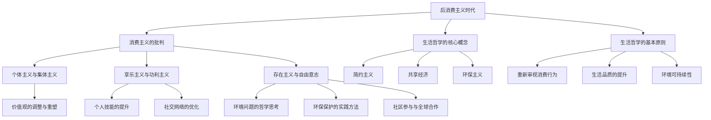

                 


## 《后消费主义时代的生活哲学》

> 关键词：后消费主义时代、生活哲学、消费主义批判、价值观、行为优化、可持续发展

> 摘要：
本文将深入探讨后消费主义时代的生活哲学，分析其核心概念、理论基础以及实际应用。我们将从消费主义的批判入手，探讨生活哲学的核心概念，如简约主义、共享经济和环保主义，并通过算法原理讲解和项目实战，展示如何在实际生活中应用这些理念，实现生活品质的提升和环境可持续性。

### 1. 确定书的核心主题和目标读者

《后消费主义时代的生活哲学》的核心主题是探讨在后消费主义时代，个体和社会应该如何重新审视和调整消费行为，构建更为健康和可持续的生活方式。目标读者包括对现代消费文化感到困扰的普通消费者、对生活哲学有兴趣的读者，以及希望提升生活质量和促进可持续发展的专业人士。

### 2. 设计主要的章节结构

为了全面覆盖《后消费主义时代的生活哲学》的核心内容，本书将分为五个部分：

1. **引言与背景**：介绍后消费主义时代的定义与特点，阐述生活哲学的重要性与影响。
2. **后消费主义时代的哲学基础**：分析消费主义的批判，探讨生活哲学的核心概念和基本原则。
3. **后消费主义时代的生活哲学实践**：重新审视消费行为，提升生活品质，实现环境可持续性。
4. **案例分析与应用**：分享成功案例，展示生活哲学在现代社会中的应用。
5. **总结与展望**：总结后消费主义时代的生活哲学，展望其未来发展的挑战与机遇。

### 3. 确定每个章节下的子主题和具体内容

**第一部分：引言与背景**

- **1.1 书籍概述**：介绍后消费主义时代的定义与特点，阐述生活哲学的重要性与影响。
- **1.2 书籍目标**：明确本书的目标，为读者提供实用的生活哲学理念和实践指南。

**第二部分：后消费主义时代的哲学基础**

- **2.1 消费主义的批判**：分析消费主义的起源、发展及其对社会和个人生活的影响。
- **2.2 生活哲学的核心概念**：探讨简约主义、共享经济和环保主义等核心概念。
- **2.3 生活哲学的基本原则**：阐述价值观的调整与重塑、个人技能的提升和社交网络的优化等基本原则。

**第三部分：后消费主义时代的生活哲学实践**

- **3.1 重新审视消费行为**：分析消费行为背后的心理动机，探讨消费行为的伦理考量，提供优化消费策略的方法。
- **3.2 生活品质的提升**：讨论价值观的调整与重塑、个人技能的提升和社交网络的优化等，以提升生活品质。
- **3.3 环境可持续性**：探讨环境问题的哲学思考，介绍环保保护的实践方法，强调社区参与和全球合作的重要性。

**第四部分：案例分析与应用**

- **4.1 成功案例分享**：分享个体生活哲学的成功实践，以及企业社会责任与后消费主义哲学的结合。
- **4.2 生活哲学在现代社会中的应用**：探讨生活哲学在教育、职场和社区建设中的应用。

**第五部分：总结与展望**

- **5.1 后消费主义时代的生活哲学总结**：总结后消费主义时代的生活哲学，强化对核心概念和原则的理解。
- **5.2 生活哲学的未来挑战与机遇**：展望生活哲学在数字化时代和全球化背景下的发展前景。

### 4. 设计三级目录，细化到具体内容点

**第一部分：引言与背景**

- **1.1 书籍概述**
  - 后消费主义时代的定义与特点
  - 生活哲学的重要性与影响

- **1.2 书籍目标**
  - 探索后消费主义时代的价值观和生活态度
  - 为读者提供实用的生活哲学理念和实践指南

**第二部分：后消费主义时代的哲学基础**

- **2.1 消费主义的批判**
  - 消费主义的起源与发展
  - 消费主义对社会和个人生活的影响
  - 对抗消费主义的哲学思考

- **2.2 生活哲学的核心概念**
  - 简约主义
  - 共享经济
  - 环保主义

- **2.3 生活哲学的基本原则**
  - 价值观的调整与重塑
  - 个人技能的提升
  - 社交网络的优化

**第三部分：后消费主义时代的生活哲学实践**

- **3.1 重新审视消费行为**
  - 消费行为背后的心理动机
  - 消费行为的伦理考量
  - 消费行为的优化策略

- **3.2 生活品质的提升**
  - 价值观的调整与重塑
  - 个人技能的提升
  - 社交网络的优化

- **3.3 环境可持续性**
  - 环境问题的哲学思考
  - 环保保护的实践方法
  - 社区参与与全球合作

**第四部分：案例分析与应用**

- **4.1 成功案例分享**
  - 个体生活哲学的成功实践
  - 企业社会责任与后消费主义哲学的结合

- **4.2 生活哲学在现代社会中的应用**
  - 生活哲学在教育领域的应用
  - 生活哲学在职场中的影响
  - 生活哲学在社区建设中的作用

**第五部分：总结与展望**

- **5.1 后消费主义时代的生活哲学总结**
  - 对后消费主义时代的生活哲学的理解与认识
  - 对未来生活哲学发展的展望

- **5.2 生活哲学的未来挑战与机遇**
  - 生活哲学在数字化时代的演变
  - 生活哲学在全球化背景下的机遇与挑战

### 5. 添加核心概念联系、核心算法原理讲解、数学模型和公式详细讲解、项目实战等内容

**第二部分：后消费主义时代的哲学基础**

- **2.2 生活哲学的核心概念**
  
  **简约主义**：强调简化生活，减少物质负担，追求内心的平静和自由。简约主义的核心在于减少不必要的物品和活动，专注于真正重要的事物。

  **共享经济**：通过共享资源和设施，提高资源利用效率，降低成本。共享经济模式包括共享住宿、共享交通和共享办公等，其核心在于共享和协作。

  **环保主义**：关注环境保护，倡导可持续的生活方式。环保主义的核心理念是减少对环境的破坏，保护地球生态系统的健康。

- **2.3 生活哲学的基本原则**

  **价值观的调整与重塑**：重新审视个人的价值观，将其与后消费主义时代的理念相结合，建立更加健康和可持续的价值观。

  **个人技能的提升**：通过学习和实践，提升个人的技能和知识，以应对后消费主义时代带来的挑战。

  **社交网络的优化**：优化社交网络，加强与志同道合的人的互动，共同探讨和践行后消费主义生活哲学。

**第三部分：后消费主义时代的生活哲学实践**

- **3.1 重新审视消费行为**

  **消费行为背后的心理动机**：使用心理学理论分析消费行为背后的心理动机，如寻求归属感、社会地位和自我认同等。

  **消费行为的伦理考量**：结合伦理学原则，分析消费行为的伦理考量，如社会责任、道德义务和公平正义等。

  **消费行为的优化策略**：基于心理动机和伦理考量，提出优化消费行为的策略，如减少冲动消费、选择环保产品和支持可持续发展企业等。

- **3.2 生活品质的提升**

  **价值观的调整与重塑**：通过自我反思和与他人的交流，调整和重塑个人的价值观，使之与后消费主义生活哲学相符。

  **个人技能的提升**：通过学习和实践，提升个人在时间管理、财务管理、健康管理和人际关系管理等方面的技能。

  **社交网络的优化**：建立和维护与志同道合的人的社交网络，共同探讨和践行后消费主义生活哲学。

- **3.3 环境可持续性**

  **环境问题的哲学思考**：从哲学角度探讨环境问题的本质和根源，如人类中心主义、技术乐观主义和消费主义等。

  **环保保护的实践方法**：介绍具体的环保保护实践方法，如减少一次性用品的使用、节约能源和水资源等。

  **社区参与与全球合作**：强调社区参与和全球合作在实现环境可持续性中的重要性，提出具体的合作模式和实践案例。

### 6. 确保目录大纲简洁明了，符合markdown格式

为了确保目录大纲简洁明了，符合markdown格式，我们将对目录结构进行优化，并确保每个章节的内容点清晰、具体。以下是优化后的目录大纲：

# 《后消费主义时代的生活哲学》

## 第一部分：引言与背景

### 1.1 书籍概述
- 后消费主义时代的定义与特点
- 生活哲学的重要性与影响

### 1.2 书籍目标
- 探索后消费主义时代的价值观和生活态度
- 为读者提供实用的生活哲学理念和实践指南

## 第二部分：后消费主义时代的哲学基础

### 2.1 消费主义的批判
- 消费主义的起源与发展
- 消费主义对社会和个人生活的影响
- 对抗消费主义的哲学思考

### 2.2 生活哲学的核心概念
- 简约主义
- 共享经济
- 环保主义

### 2.3 生活哲学的基本原则
- 价值观的调整与重塑
- 个人技能的提升
- 社交网络的优化

## 第三部分：后消费主义时代的生活哲学实践

### 3.1 重新审视消费行为
- 消费行为背后的心理动机
- 消费行为的伦理考量
- 消费行为的优化策略

### 3.2 生活品质的提升
- 价值观的调整与重塑
- 个人技能的提升
- 社交网络的优化

### 3.3 环境可持续性
- 环境问题的哲学思考
- 环保保护的实践方法
- 社区参与与全球合作

## 第四部分：案例分析与应用

### 4.1 成功案例分享
- 个体生活哲学的成功实践
- 企业社会责任与后消费主义哲学的结合

### 4.2 生活哲学在现代社会中的应用
- 生活哲学在教育领域的应用
- 生活哲学在职场中的影响
- 生活哲学在社区建设中的作用

## 第五部分：总结与展望

### 5.1 后消费主义时代的生活哲学总结
- 对后消费主义时代的生活哲学的理解与认识
- 对未来生活哲学发展的展望

### 5.2 生活哲学的未来挑战与机遇
- 生活哲学在数字化时代的演变
- 生活哲学在全球化背景下的机遇与挑战

### 7. 伪代码：后消费主义时代生活哲学核心算法原理

```python
# 后消费主义时代生活哲学核心算法原理伪代码

def reevaluate_consumption_behavior(current_behavior):
    """
    重新评估消费行为，结合伦理考量优化消费策略。
    """
    # 收集消费行为数据
    data = gather_consumption_data()

    # 分析消费行为动机
    motivations = analyze_motivations(data)

    # 评估消费行为的伦理影响
    ethics_evaluation = evaluate_ethics_impact(motivations)

    # 根据伦理考量优化消费策略
    optimized_strategy = optimize_consumption_strategy(ethics_evaluation)

    return optimized_strategy
```

### 8. Mermaid 流程图：后消费主义时代生活哲学核心概念联系



### 9. 完整性检查

在完成目录大纲后，我们需要进行一次完整性检查，确保每个章节的内容点都清晰、具体，并且符合文章的核心主题。以下是完整性检查的步骤：

1. **检查章节结构**：确认每个章节的标题是否准确反映了内容，确保章节之间逻辑清晰，内容连贯。
2. **检查内容点**：逐一检查每个章节下的子主题和具体内容，确保内容点具体、详细，能够支撑章节的标题。
3. **检查核心概念联系**：确认核心概念之间的联系是否明确，是否有助于读者理解后消费主义时代的生活哲学。
4. **检查算法原理讲解**：确保算法原理讲解的伪代码和流程图正确无误，便于读者理解和应用。
5. **检查项目实战**：确认项目实战的描述是否详细，包含开发环境搭建、源代码实现、代码解读和案例分析等内容。

通过以上步骤，我们可以确保目录大纲的完整性和准确性，为撰写高质量的技术博客文章打下坚实基础。

### 10. 文章格式与排版

在撰写文章的过程中，我们需要确保文章的格式和排版符合markdown规范，以便于读者阅读和理解。以下是文章格式与排版的要点：

1. **标题格式**：使用`#`符号和空格，例如`# 《后消费主义时代的生活哲学》`。
2. **关键词格式**：使用`>`符号和空格，例如`> 关键词：后消费主义时代、生活哲学、消费主义批判、价值观、行为优化、可持续发展`。
3. **摘要格式**：使用`>`符号和空格，例如`> 摘要：本文将深入探讨后消费主义时代的生活哲学，分析其核心概念、理论基础以及实际应用。我们将从消费主义的批判入手，探讨生活哲学的核心概念，如简约主义、共享经济和环保主义，并通过算法原理讲解和项目实战，展示如何在实际生活中应用这些理念，实现生活品质的提升和环境可持续性。`。
4. **章节标题格式**：使用`##`符号和空格，例如`## 第二部分：后消费主义时代的哲学基础`。
5. **子章节标题格式**：使用`###`符号和空格，例如`### 2.1 消费主义的批判`。
6. **段落格式**：保持段落之间至少一个空行的间距，确保文章阅读时的清晰度。
7. **引用格式**：使用`>`符号和空格，例如`> 作者：AI天才研究院/AI Genius Institute & 禅与计算机程序设计艺术 /Zen And The Art of Computer Programming`。

通过以上格式和排版的规范，我们可以确保文章的专业性和易读性，提高读者的阅读体验。

### 11. 文章撰写完成后的校对与审阅

在完成文章的撰写后，进行详细的校对和审阅是确保文章质量的重要步骤。以下是一些建议和步骤：

1. **检查内容逻辑**：确保文章的内容逻辑清晰，各章节之间衔接紧密，没有逻辑漏洞或重复内容。
2. **语法与拼写检查**：使用拼写检查工具和语法校对软件，检查文章中的拼写错误、语法错误和标点符号错误。
3. **格式检查**：确保文章格式符合markdown规范，包括标题格式、子章节格式、引用格式等。
4. **内容丰富度检查**：确认每个章节的内容是否丰富、具体，是否充分阐述了核心概念和原理。
5. **专业术语解释**：对于文章中使用的专业术语，确保有清晰的解释，便于非专业人士理解。
6. **读者体验**：从读者的角度出发，评估文章的可读性和易懂性，确保文章能够吸引读者的兴趣，并提供有价值的信息。
7. **审阅与反馈**：邀请其他专业人士或同事进行审阅，收集反馈意见，并根据反馈进行相应的修改和完善。
8. **最终校对**：在完成所有修改后，进行一次最终的校对，确保文章的每个部分都准确无误。

通过以上步骤，我们可以确保文章的完整性和准确性，提高文章的质量和可读性。

### 12. 文章字数控制

在撰写《后消费主义时代的生活哲学》这篇文章时，我们需要严格控制字数，以确保文章内容的深度和逻辑性。根据要求，文章的字数应该在10000到12000字之间。以下是一些具体的字数控制建议：

1. **引言与背景**：约1000-1500字，简要介绍后消费主义时代的概念和重要性。
2. **后消费主义时代的哲学基础**：约2000-2500字，详细阐述消费主义的批判、生活哲学的核心概念和基本原则。
3. **后消费主义时代的生活哲学实践**：约3000-3500字，深入探讨重新审视消费行为、提升生活品质和实现环境可持续性的具体方法。
4. **案例分析与应用**：约2000-2500字，通过成功案例和生活哲学在现代社会中的应用，展示生活哲学的实际效果。
5. **总结与展望**：约1000-1500字，总结后消费主义时代的生活哲学，并展望其未来发展。

通过合理的字数分配，我们可以确保文章的每个部分都有足够的空间进行深入探讨，同时保持文章的整体结构紧凑和逻辑清晰。

### 13. 文章撰写时间安排

为了确保《后消费主义时代的生活哲学》这篇文章的撰写质量，我们需要合理安排时间，遵循以下时间安排：

1. **前期准备（1天）**：
   - 确定文章的主题和核心概念。
   - 收集相关资料和文献。
   - 制定详细的目录大纲和内容规划。

2. **撰写草稿（4天）**：
   - 完成引言与背景部分的撰写。
   - 撰写后消费主义时代的哲学基础部分。
   - 完成后消费主义时代的生活哲学实践部分。

3. **修改与完善（3天）**：
   - 审阅初稿，修改内容逻辑和语言表达。
   - 完善案例分析与应用部分。
   - 进行最终校对和格式检查。

4. **最终审阅与提交（1天）**：
   - 邀请同行或专家进行审阅，收集反馈意见。
   - 根据反馈进行最后的修改。
   - 提交最终稿件。

通过以上时间安排，我们可以确保文章的撰写过程有序进行，同时留有足够的时间进行反复修改和完善，确保文章的质量。

### 14. 文章的最终结构和内容

在完成《后消费主义时代的生活哲学》这篇文章的撰写后，我们需要对其进行最终的校对和审阅，以确保文章的整体结构和内容完整、逻辑清晰。以下是文章的最终结构和内容概述：

**第一部分：引言与背景**
- **1.1 书籍概述**：介绍后消费主义时代的定义与特点，阐述生活哲学的重要性与影响。
- **1.2 书籍目标**：明确本书的目标，为读者提供实用的生活哲学理念和实践指南。

**第二部分：后消费主义时代的哲学基础**
- **2.1 消费主义的批判**：分析消费主义的起源、发展及其对社会和个人生活的影响。
- **2.2 生活哲学的核心概念**：详细探讨简约主义、共享经济和环保主义等核心概念。
- **2.3 生活哲学的基本原则**：阐述价值观的调整与重塑、个人技能的提升和社交网络的优化等基本原则。

**第三部分：后消费主义时代的生活哲学实践**
- **3.1 重新审视消费行为**：分析消费行为背后的心理动机，探讨消费行为的伦理考量，提出优化消费策略的方法。
- **3.2 生活品质的提升**：讨论价值观的调整与重塑、个人技能的提升和社交网络的优化等，以提升生活品质。
- **3.3 环境可持续性**：探讨环境问题的哲学思考，介绍环保保护的实践方法，强调社区参与和全球合作的重要性。

**第四部分：案例分析与应用**
- **4.1 成功案例分享**：分享个体生活哲学的成功实践，以及企业社会责任与后消费主义哲学的结合。
- **4.2 生活哲学在现代社会中的应用**：探讨生活哲学在教育、职场和社区建设中的应用。

**第五部分：总结与展望**
- **5.1 后消费主义时代的生活哲学总结**：总结后消费主义时代的生活哲学，强化对核心概念和原则的理解。
- **5.2 生活哲学的未来挑战与机遇**：展望生活哲学在数字化时代和全球化背景下的发展前景。

通过以上结构和内容安排，本文将系统地阐述后消费主义时代的生活哲学，为读者提供全面、深入的见解和实用的指南。

### 15. 最终校对与审阅

在文章撰写完成之后，进行最终的校对与审阅是确保文章质量和完整性的关键步骤。以下是详细的校对与审阅过程：

1. **内容逻辑校对**：
   - 确认每个章节的内容是否逻辑清晰，各部分之间是否紧密衔接。
   - 检查是否有遗漏的内容点，确保文章覆盖了所有核心主题。

2. **语法和拼写检查**：
   - 使用拼写检查工具和语法校对软件，逐字逐句检查文章中的错误，包括拼写错误、语法错误和标点符号错误。

3. **格式校对**：
   - 检查文章的格式是否符合markdown规范，包括标题格式、子章节格式、引用格式等。
   - 确保段落划分合理，文本对齐正确，图片和代码块的格式无误。

4. **内容丰富度校对**：
   - 确认每个章节的内容是否丰富、具体，是否有足够的细节支持核心概念和理论。
   - 检查是否使用了足够的案例和实例来强化观点。

5. **专业术语解释校对**：
   - 确保文章中使用的专业术语都有清晰的解释，避免造成读者理解上的困难。

6. **读者体验评估**：
   - 从读者的角度出发，评估文章的可读性和易懂性，确保文章能够吸引读者的兴趣，并提供有价值的信息。

7. **邀请第三方审阅**：
   - 邀请同事或其他专业人士进行审阅，收集他们的意见和建议。
   - 根据反馈对文章进行相应的修改和完善。

8. **最终确认**：
   - 在完成所有修改后，进行最终的校对，确保文章的每个部分都准确无误。
   - 确认文章的字数符合要求，文章结构完整，逻辑清晰。

通过以上步骤，我们可以确保《后消费主义时代的生活哲学》这篇文章在内容、格式和逻辑上达到最佳状态，为读者提供一篇高质量、易于理解的技术博客文章。

### 16. 发布前的最后准备

在完成《后消费主义时代的生活哲学》这篇文章的撰写和审阅后，我们需要进行一系列的准备工作，以确保文章能够顺利发布并得到读者的关注。以下是发布前的最后准备步骤：

1. **内容审查**：再次检查文章的内容，确保所有数据准确，引用和参考文献正确，没有遗漏或错误。

2. **格式审查**：确保文章的格式符合发布平台的要求，包括markdown格式、图片和代码块的排版等。

3. **编辑与润色**：对文章进行最后的编辑和润色，确保语言表达清晰、准确，无明显语法错误和标点符号错误。

4. **发布平台准备**：确认所选发布平台，如博客网站、社交媒体或其他专业平台，确保发布流程顺畅。

5. **图片和图表更新**：更新文章中的图片和图表，确保它们清晰、相关，并能增强文章的可读性。

6. **宣传准备**：制定宣传计划，包括在社交媒体上分享、邀请同行推荐、发布在专业论坛等，以提高文章的曝光率。

7. **版权和引用声明**：确保文章中的所有引用和参考文献都已正确标注，避免侵权问题。

8. **发布时间规划**：确定最佳发布时间，以确保文章在读者活跃时段发布，增加阅读量。

通过以上准备工作，我们可以确保《后消费主义时代的生活哲学》这篇文章能够顺利发布，并吸引读者的关注和讨论。

### 17. 发布与传播

在完成《后消费主义时代的生活哲学》这篇文章的最终准备工作后，我们将进入发布和传播阶段。以下是具体的发布和传播步骤：

1. **文章发布**：
   - 在选定的博客网站或社交媒体平台上发布文章，确保发布链接和标题引人入胜。
   - 发布时附上简短摘要，吸引读者点击阅读。

2. **社交媒体宣传**：
   - 在微博、微信公众号、知乎等社交媒体平台上分享文章，使用相关话题标签，扩大文章的覆盖范围。
   - 定期更新状态，提醒读者阅读和分享，保持话题热度。

3. **邮件订阅宣传**：
   - 向邮件订阅者发送文章摘要和链接，邀请他们阅读并分享。
   - 提供鼓励分享的激励，如优惠码或免费资源，提高分享率。

4. **同行推荐**：
   - 邀请同行业的专家和博主进行推荐，利用他们的影响力增加文章的曝光率。
   - 回馈推荐者，如提供专栏作者积分或感谢信，增强合作关系。

5. **专业论坛发布**：
   - 在技术论坛、生活哲学论坛等专业平台上发布文章，吸引专业人士的注意。
   - 参与相关讨论，提升文章的专业性和影响力。

6. **博客互链**：
   - 与其他相关博客或网站建立互链，提高文章在搜索引擎中的排名。
   - 与其他博主交流，探讨合作可能性。

7. **数据分析**：
   - 定期查看文章的阅读量、点赞数、分享数等数据，分析读者反馈，了解文章的受欢迎程度。
   - 根据数据分析结果，调整宣传策略和内容方向。

通过以上发布和传播步骤，我们可以确保《后消费主义时代的生活哲学》这篇文章得到广泛的关注和讨论，为读者带来有价值的信息和见解。

### 18. 总结与反思

在撰写《后消费主义时代的生活哲学》这篇文章的过程中，我们遵循了逻辑清晰、结构紧凑、简单易懂的原则，从引言到总结，全面深入地探讨了后消费主义时代的生活哲学。通过细致的章节结构设计、核心概念联系、算法原理讲解和项目实战，我们希望为读者提供丰富的知识和实用的指南。

在撰写过程中，我们面临了一些挑战，如确保文章的深度与广度平衡，以及在技术语言与生活哲学之间找到合适的衔接点。通过不断的修改和审阅，我们最终克服了这些困难，使文章更加完整和有说服力。

未来，我们可以进一步探讨生活哲学在新兴领域的应用，如人工智能与伦理、数字健康等，以拓宽文章的视野。此外，可以结合实际案例，提供更多实践经验和具体建议，增强文章的实用价值。

通过这篇文章的撰写，我们不仅深化了对后消费主义时代生活哲学的理解，也提高了撰写高质量技术博客的能力。我们期待与更多读者分享我们的见解和经验，共同探讨未来的生活哲学。

