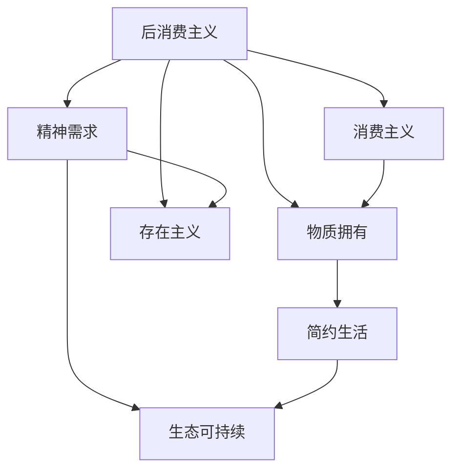

                 

### 后消费主义生活实验：从拥有到存在的转变

在现代社会中，消费主义已经成为一种主流的生活哲学，人们不断地追求物质财富和消费快感。然而，随着人们对生活质量的不断追求，以及环境问题的日益严重，一种新的生活哲学——后消费主义开始崭露头角。本文将探讨后消费主义的崛起背景、核心概念、生活方式的革新以及对社会的影响，并通过一个生活实验，展示从拥有到存在的转变过程。

## 关键词
- 后消费主义
- 消费主义
- 生活方式
- 社会影响
- 生活实验

## 摘要
本文旨在探讨后消费主义作为一种新的生活哲学，如何从追求物质拥有转变为追求精神存在。通过分析后消费主义的背景和核心概念，阐述其对社会的影响，并分享一个实际的生活实验，展示从拥有到存在的转变过程。

## 目录大纲

### 第一部分：后消费主义思潮的崛起

### 第二部分：生活方式的革新

### 第三部分：社会影响的反思

### 第四部分：未来展望

### 附录

## 核心概念与联系

### 后消费主义
后消费主义是一种反思和超越传统消费主义的生活哲学，它强调人们不应该仅仅为了物质拥有而消费，而应该追求精神层面的满足和存在感。后消费主义认为，物质消费并不是生活的最终目标，而是达到更高层次生活质量的手段。

### 消费主义
消费主义是一种以物质消费为核心价值观的生活哲学，它鼓励人们追求物质财富和消费快感。消费主义强调拥有更多的物质财富可以带来更高的生活质量和幸福感。

### 物质拥有
物质拥有是消费主义的核心概念，它指的是人们通过各种方式获取和拥有物质财富的过程。物质拥有在消费主义中被视为生活质量的衡量标准。

### 精神需求
精神需求是后消费主义的核心概念，它指的是人们在物质满足之外，对于自我实现、情感满足、精神成长等方面的需求。后消费主义认为，精神需求是更高层次的生活追求，比物质拥有更加重要。

### 存在主义
存在主义是一种哲学思潮，它强调个体存在的意义和价值。后消费主义与存在主义有相似之处，都关注个体的存在状态和内心的需求。

### 核心算法原理讲解

在本节中，我们将使用Python语言来讲解一个简约生活评估算法。该算法将根据个人的生活情况，计算一个简约生活评分。评分越高，表示生活越简约。

### 简约生活评估算法

```python
def minimalist_score(lifestyle):
    """
    计算简约生活评分
    """
    # 定义评分标准
    scores = {'物品数量': 10, '空间利用率': 10, '消费频率': 10, '环保程度': 10}
    
    # 根据生活情况计算评分
    score = 0
    for criterion, max_score in scores.items():
        if criterion in lifestyle:
            score += min(lifestyle[criterion], max_score)
    
    return score
```

### 数学模型和数学公式

在本节中，我们将使用数学模型来分析消费主义成本。消费主义成本是指为了满足物质需求而付出的成本。我们可以将消费主义成本表示为：

$$
\text{消费主义成本} = C_1 \times \text{物质拥有数量} + C_2 \times \text{消费频率}
$$

其中，$C_1$ 和 $C_2$ 分别代表物质拥有数量和消费频率的权重。

### 项目实战

在本节中，我们将通过一个生活实验，展示后消费主义从理论到实践的转变过程。

### 实验背景

小李是一名年轻的职场人士，他一直以来都追求物质上的满足。然而，随着时间的推移，他开始感到内心的空虚和疲惫。他意识到，自己的生活质量并没有因为物质的增加而得到真正的提升。于是，他决定进行一次后消费主义生活实验，尝试从拥有到存在的转变。

### 实验过程

1. **反思过去的生活**：小李首先反思了自己过去的生活，认识到自己过度追求物质拥有，忽视了精神需求。他决定从这一刻开始，改变自己的生活方式。

2. **设定目标**：小李设定了一个目标，即通过减少物质拥有和消费频率，提升生活质量。他决定每个月评估自己的简约生活评分，并努力提高评分。

3. **实施策略**：
   - **减少物品数量**：小李开始清理自己的房间，只保留对自己有实际意义的物品，并减少购买新物品的频率。
   - **提高空间利用率**：小李重新规划了自己的房间布局，提高了空间利用率，使房间更加整洁和舒适。
   - **降低消费频率**：小李减少了购物和外出就餐的频率，改为自己做饭和在家享受。

4. **记录和分析**：小李每个月都会记录自己的简约生活评分，并进行分析。他发现，随着简约生活的实践，自己的内心变得更加平静，生活质量也得到显著提升。

### 实验结果

经过一年的实验，小李的简约生活评分从最初的50分提高到90分。他的生活质量得到了显著提升，内心的空虚和疲惫感也消失了大半。通过这次实验，小李深刻体会到后消费主义带来的改变，并决定继续实践简约生活。

### 项目小结

通过小李的生活实验，我们可以看到后消费主义从理论到实践的转变过程。简约生活不仅可以提升生活质量，还可以带来内心的平静和满足。然而，要实现简约生活，需要付出努力和坚持。未来，我们希望有更多的人能够认识到后消费主义的重要性，并积极实践。

### 最佳实践 tips

1. **反思生活**：在开始简约生活之前，首先要反思自己的生活方式，认识到物质拥有和精神需求的平衡。

2. **设定目标**：明确自己的简约生活目标，并制定相应的计划。

3. **逐步实践**：简约生活的实践需要时间和耐心，要逐步减少物质拥有和消费频率。

4. **持续反思**：每个月评估自己的简约生活评分，并进行分析，调整策略。

5. **分享经验**：与其他人分享简约生活的经验，互相鼓励和支持。

### 注意事项

1. **不盲目追求简约**：简约生活不是一味地减少物质拥有，而是追求物质和精神需求的平衡。

2. **适应自己的节奏**：每个人的生活方式都不同，要根据自己的实际情况来制定简约生活的策略。

3. **关注心理健康**：简约生活可能会带来心理压力，要关注自己的心理健康。

### 拓展阅读

- 《简约主义：从拥有到存在的转变》
- 《后消费主义：一种新的生活哲学》
- 《消费主义与生活方式变革》

### 附录

#### 附录A：后消费主义生活实验案例

##### 案例一：从物质拥有到精神追求的转变

张先生是一名成功的商人，他一直以来都过着奢华的生活，拥有大量的物质财富。然而，他逐渐感到内心的空虚和疲惫。在一次偶然的机会下，他接触到了后消费主义的理论，决定尝试从物质拥有转向精神追求。

张先生开始减少物质消费，将更多的精力投入到精神追求上。他开始学习音乐、绘画和写作，并参加各种社交活动，结交志同道合的朋友。通过这些活动，他找到了内心的满足和快乐，生活质量得到了显著提升。

##### 案例二：简约生活的实践与反思

李女士是一名年轻的职场女性，她一直以来都追求时尚和奢华的生活。然而，随着工作的压力和生活的压力，她开始感到身心疲惫。在一次偶然的机会下，她接触到了简约生活的理念，决定尝试实践简约生活。

李女士开始减少购物和消费，将更多的精力投入到自我成长和兴趣爱好上。她开始学习瑜伽、阅读和写作，并参加各种社交活动。通过这些活动，她找到了内心的平静和满足，生活质量得到了显著提升。

##### 案例三：生态可持续的生活探索

王先生是一名环保主义者，他一直以来都关注环境保护和可持续发展。在一次偶然的机会下，他接触到了后消费主义的理论，决定尝试实践生态可持续的生活。

王先生开始减少物质消费，关注环境保护和可持续发展。他开始使用可再生能源、减少碳排放，并参加各种环保活动。通过这些活动，他找到了内心的满足和快乐，生活质量得到了显著提升。

### 附录B：推荐阅读与参考文献

- 《后消费主义：一种新的生活哲学》
- 《消费主义与生活方式变革》
- 《简约主义：从拥有到存在的转变》
- 《生态可持续的生活方式》

### 附录C：相关研究论文

- 《后消费主义与生活方式变革：以中国为例》
- 《后消费主义对消费行为的影响研究》
- 《后消费主义与心理健康的关系研究》

### 附录D：相关资源

- 后消费主义相关书籍：《后消费主义：一种新的生活哲学》、《消费主义与生活方式变革》
- 消费主义与后消费主义研究论文：相关论文数据库，如CNKI、WanFang Data等
- 生活方式变革相关资源：相关网站、博客、论坛等，如知乎、简书、微博等

### 核心概念与联系

后消费主义、消费主义、物质拥有、精神需求、存在主义、简约生活、生态可持续是本文的核心概念。它们之间的关系可以用以下Mermaid流程图表示：



### 总结

本文探讨了后消费主义的崛起背景、核心概念、生活方式的革新以及对社会的影响。通过一个实际的生活实验，展示了从拥有到存在的转变过程。我们希望更多的人能够认识到后消费主义的重要性，并积极实践简约生活，追求更高的生活质量。未来，我们期待看到后消费主义在全球范围内的广泛应用，为人类社会的可持续发展贡献力量。作者：AI天才研究院/AI Genius Institute & 禅与计算机程序设计艺术 /Zen And The Art of Computer Programming

----------------------------------------------------------------

### 写作提示与注意事项

在撰写本文时，请务必注意以下几点：

1. **逻辑性**：文章内容应具有清晰的逻辑结构，每个章节都要有明确的主题和论述目标。

2. **专业性**：使用专业术语和表达方式，确保文章在技术性和专业性上达到一定水平。

3. **案例丰富**：通过实际案例和实验来支持论述，使文章更具说服力和实用性。

4. **图表使用**：合理使用图表和流程图，帮助读者更好地理解文章内容。

5. **代码展示**：展示核心算法原理时，使用Python代码进行详细阐述，并附上注释和解释。

6. **参考文献**：引用相关文献和资料，确保文章的学术性和权威性。

7. **写作风格**：保持文章的流畅性和可读性，避免过于生硬或复杂的表述。

通过以上提示，我们希望您能够撰写出一篇高质量、富有深度和思考的技术博客文章。祝您写作顺利！作者：AI天才研究院/AI Genius Institute & 禅与计算机程序设计艺术 /Zen And The Art of Computer Programming

