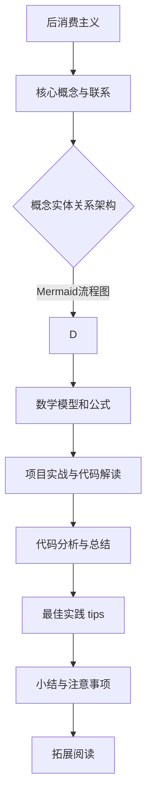

                 

### 引言

在现代社会的消费文化中，消费主义占据了主导地位。然而，随着时间的推移，人们逐渐意识到过度消费所带来的负面影响，如环境污染、资源浪费和社会不公等。于是，一种名为“后消费主义”的生活理念应运而生。本文将探讨后消费主义的生活实验，以及如何从拥有到存在实现这一转变。

后消费主义并不是简单地减少消费，而是一种更深层次的生活方式和价值观的变革。它强调精神层面的满足，提倡与自然和谐共处，关注个人成长和内在价值的实现。这种理念在现代社会中具有重要的现实意义，为我们提供了一种可持续发展的生活模式。

本文将从以下方面展开讨论：

1. **后消费主义的起源与发展**：回顾消费主义的历史背景，分析后消费主义如何在这种背景下兴起，以及其核心理念。

2. **后消费主义的核心概念**：探讨后消费主义的定义、本质以及其与可持续发展的关系。

3. **后消费主义的生活方式**：分析后消费主义如何影响我们的消费习惯和价值观，探讨共享经济和体验经济的兴起。

4. **后消费主义的社会影响**：探讨后消费主义对消费文化、生活方式和经济发展的影响。

5. **后消费主义的实践案例**：介绍国内外后消费主义的实践案例，分析其成功经验和面临的挑战。

6. **后消费主义的政策与法律**：讨论国家对后消费主义的政策导向和法律法规，以及这些政策对后消费主义实践的支持。

7. **后消费主义的未来展望**：探讨技术进步对社会变革的影响，以及后消费主义的未来发展路径。

通过以上分析，我们将深入理解后消费主义的生活理念，以及如何在实践中实现从拥有到存在的转变。

### 后消费主义概述

#### 1.1 消费主义的起源与发展

消费主义起源于工业革命时期，随着生产力的提升和商品的丰富，人们开始追求物质享受和物质财富的积累。在这一时期，广告和媒体不断宣传消费的重要性，鼓励人们购买更多的商品。消费主义逐渐成为社会的主导价值观，人们的生活目标从追求精神满足转向追求物质拥有。

20世纪中叶，消费主义达到了巅峰。美国成为消费主义的代表国家，通过汽车、家电和信用卡等商品的大量普及，人们的生活方式被彻底改变。消费主义文化也迅速传播到世界各地，成为全球性的社会现象。

然而，随着时间的发展，消费主义的弊端也逐渐显现。过度消费导致了资源浪费、环境污染和社会不公等问题。例如，为了追求更多的消费，人们不断开采自然资源，导致生态破坏；为了满足消费需求，企业生产大量低成本、低质量的产品，导致资源浪费和环境污染。

#### 1.2 后消费主义的兴起与理念

后消费主义作为一种对消费主义的反思和批判，于20世纪末逐渐兴起。它的核心理念是“从拥有到存在”的转变，即从追求物质拥有转向追求精神满足和内在价值的实现。

后消费主义认为，过度消费不仅对环境和社会造成负面影响，也对个人的心理健康产生危害。为了摆脱这种困境，后消费主义倡导以下理念：

1. **简约生活**：减少不必要的消费，专注于生活质量和内在需求，追求简单、环保的生活方式。

2. **精神满足**：强调精神层面的满足，通过阅读、旅行、艺术创作等方式，提升个人心灵和情感。

3. **共享经济**：提倡共享资源，减少浪费，通过共享经济平台实现资源共享，降低消费成本。

4. **可持续发展**：关注环境保护和资源利用，提倡可持续发展，减少对环境的负面影响。

5. **社会责任**：强调个人在社会中的责任和角色，通过参与社会公益活动，提升社会整体福祉。

后消费主义的兴起是对传统消费主义的挑战，它为我们提供了一种新的生活方式和价值观，引导我们走向更加可持续和健康的生活。

### 后消费主义的核心概念

#### 1.1 定义与本质

后消费主义，作为一种新兴的生活哲学，它不仅仅是减少消费那么简单，而是一种深刻的价值观和生活方式的变革。在传统消费主义中，人们追求的是物质拥有和外在满足，而在后消费主义中，人们更加注重精神层面的满足和内在价值的实现。

后消费主义的核心概念可以概括为“从拥有到存在”的转变。这种转变不仅仅是消费行为的改变，更是价值观和生活态度的深刻变化。后消费主义认为，过度追求物质拥有会导致一系列社会问题，如资源浪费、环境污染和社会不公等。因此，它倡导人们从追求外在的拥有转向追求内在的存在，关注个人的精神世界和心理健康。

#### 1.1.1 后消费主义的核心概念

后消费主义的核心概念包括以下几个方面：

1. **简约生活**：后消费主义强调简约生活，主张减少不必要的消费，专注于生活质量和内在需求。简约生活不仅有助于减少资源浪费，还能减轻个人压力，提升生活质量。

2. **精神满足**：后消费主义认为，精神满足是生活的核心。通过阅读、旅行、艺术创作等方式，人们可以提升个人心灵和情感，实现精神层面的满足。

3. **共享经济**：后消费主义提倡共享经济，通过共享资源，减少浪费，实现资源共享，降低消费成本。共享经济不仅有助于节约资源，还能促进社会公平和人际关系的和谐。

4. **可持续发展**：后消费主义强调环境保护和资源利用，提倡可持续发展，减少对环境的负面影响。这不仅是个人责任，也是社会发展的必然选择。

5. **社会责任**：后消费主义认为，个人在社会中有责任和角色，通过参与社会公益活动，提升社会整体福祉。这种社会责任不仅体现在消费行为上，更体现在个人生活和工作中。

#### 1.1.2 后消费主义的生活观

后消费主义的生活观是一种全新的生活态度和生活方式。它鼓励人们摆脱物质主义的束缚，关注个人的内在需求和成长。以下是一些后消费主义生活观的体现：

1. **去物质化**：后消费主义主张减少对物质的依赖，关注个人的内在需求和情感。通过减少物质消费，人们可以更加专注于精神层面的满足。

2. **去中心化**：后消费主义反对传统的中心化消费模式，提倡去中心化的生活方式。这意味着人们不再依赖于特定的商品或品牌，而是根据自己的需求和兴趣选择合适的产品。

3. **注重体验**：后消费主义强调体验的重要性，通过体验不同的活动和经历，人们可以拓宽视野，提升生活品质。这种注重体验的生活方式有助于培养人们的创造力和创新能力。

4. **可持续发展**：后消费主义倡导可持续发展的生活方式，鼓励人们从源头上减少资源浪费，保护环境。这不仅有助于实现个人价值，也有助于社会和环境的可持续发展。

5. **社会责任**：后消费主义认为，个人在社会中有责任和角色，通过参与社会公益活动，提升社会整体福祉。这种社会责任不仅体现在消费行为上，更体现在个人生活和工作中。

总之，后消费主义是一种以精神满足为核心，注重共享和可持续发展的生活方式。它不仅有助于解决消费主义带来的社会问题，还能提升个人的生活质量和幸福感。

### 拥有与存在的辩证关系

#### 1.2.1 物质拥有的局限性

物质拥有在现代社会中占据了重要地位，人们常常通过追求物质财富来衡量个人的成功和幸福。然而，随着对消费主义的反思，人们逐渐认识到物质拥有的局限性。首先，物质拥有无法满足人们内心深处的需求。无论是奢侈品还是日常生活用品，一旦拥有，很快就会变得习以为常，甚至失去兴趣。其次，物质拥有往往伴随着高昂的维护成本。例如，购买豪华汽车需要支付高昂的保养费用，购买名牌服装需要定期更新。这种持续的投入不仅加重了个人经济负担，还可能导致心理上的压力和焦虑。

此外，物质拥有还可能带来一系列负面影响。首先，它容易导致资源浪费。为了满足不断增长的物质需求，人们不断开采自然资源，导致生态破坏和资源枯竭。其次，物质拥有可能导致社会不公。富裕阶层拥有更多的资源，而贫困阶层则难以满足基本生活需求，这种差距不仅影响社会公平，还可能导致社会矛盾的加剧。

#### 1.2.2 精神存在的价值

相比之下，精神存在则提供了更深层次的价值和满足。精神存在强调的是个人的内在成长和心灵满足，通过阅读、艺术、旅行、冥想等方式，人们可以拓宽视野，提升自我认知，实现心灵的升华。首先，精神存在能够满足人们内心深处的需求。通过阅读，人们可以获取知识和智慧，通过艺术，人们可以表达情感和创造力，通过旅行，人们可以体验不同的文化和风景。这些活动不仅丰富了人们的生活，还提升了他们的生活质量。

其次，精神存在有助于个人的心理健康。在物质追求的过程中，人们常常感到焦虑和不安，而通过精神活动，人们可以找到内心的宁静和平和。例如，冥想可以帮助人们减轻压力，提升专注力，提高生活质量。此外，精神存在还能培养个人的创造力和创新能力。通过艺术创作、科学探索等活动，人们可以不断挑战自我，实现个人价值的提升。

最后，精神存在有助于建立积极的人际关系。通过分享知识和经验，人们可以建立更深层次的连接，促进社会的和谐与进步。相比之下，物质拥有往往导致人与人之间的疏离和竞争，而精神存在则鼓励人们共同成长和分享，实现共赢。

总之，精神存在相较于物质拥有，提供了更深层次的价值和满足。它不仅能够满足人们内心的需求，提升生活质量，还能培养心理健康、创造力和创新能力，促进人际关系的和谐。因此，在后消费主义的背景下，我们应该更加重视精神存在的价值，实现从拥有到存在的转变。

### 后消费主义与可持续性

#### 1.3.1 环境保护的视角

后消费主义在环境保护方面具有重要的现实意义。首先，后消费主义强调简约生活，减少不必要的消费，这有助于减少资源浪费。在传统消费主义中，人们为了满足物质需求，不断购买新产品，导致大量废弃物的产生。而后消费主义提倡使用旧物、修复物品、减少购买等行为，从而降低废弃物的产生。其次，后消费主义倡导可持续消费，选择环保产品，减少对环境的负面影响。例如，选择使用可再生能源的产品，减少对化石燃料的依赖，降低温室气体排放。此外，后消费主义还鼓励人们采用环保的出行方式，如骑自行车、步行或使用公共交通工具，减少汽车尾气排放。

#### 1.3.2 资源利用的优化

后消费主义不仅在环境保护方面具有重要作用，还在资源利用方面提供了优化方案。首先，后消费主义提倡共享经济，通过共享资源，提高资源利用效率。例如，共享办公空间、共享汽车、共享住宿等，使资源得到更加合理的分配和利用，减少浪费。其次，后消费主义鼓励人们进行物品的再利用和修复，延长物品的使用寿命。例如，通过二手市场购买二手商品，不仅减少了新产品的生产需求，还减少了废弃物的产生。此外，后消费主义还倡导零废弃生活方式，通过减少废弃物的产生，实现资源的最大化利用。

总之，后消费主义在环境保护和资源利用方面提供了创新的解决方案。它不仅有助于减少环境破坏和资源浪费，还能提高资源利用效率，实现可持续发展。通过倡导简约生活、可持续消费和共享经济，后消费主义为构建一个更加绿色、环保和可持续的未来提供了重要路径。

### 后消费主义的生活方式

#### 2.1 生活方式的转变

后消费主义生活方式的核心理念是通过减少物质消费，关注内在需求，从而实现生活质量的提升。首先，后消费主义鼓励人们重新审视自己的消费习惯，减少不必要的购买。这意味着人们在购物时不再单纯追求品牌和时尚，而是更加注重商品的实际功能和可持续性。例如，购买环保材料制成的服装，减少对塑料产品的依赖，从源头上减少环境污染。

其次，后消费主义倡导简约生活，注重生活品质而非物质数量。这体现在减少家中物品的数量，专注于提高生活质量。例如，通过购买多功能家具，减少空间占用，提高居住舒适度；通过定期清理和整理，营造一个整洁、舒适的生活环境。

此外，后消费主义强调精神满足，提倡通过阅读、艺术、音乐等方式丰富个人生活。这种生活方式不仅减轻了经济负担，还提升了人们的精神层次，使生活更加充实和有意义。

#### 2.1.1 消费习惯的变革

后消费主义对消费习惯的影响深远，促使人们从数量消费转向质量消费。首先，后消费主义鼓励消费者购买优质而非廉价的产品。优质产品通常具有更长的使用寿命，减少了频繁更换的需求，从而降低了整体消费量。例如，选择购买高品质的电子产品，虽然价格较高，但使用年限长，减少了废弃物的产生。

其次，后消费主义倡导二手商品的购买和再利用。通过二手市场，消费者可以以较低的价格获得品质良好的商品，同时减少了新产品的购买需求。这不仅有助于减少资源浪费，还能促进资源的循环利用。

此外，后消费主义还推动了共享经济的兴起。通过共享平台，消费者可以共享车辆、住宿、办公空间等资源，避免了不必要的消费。例如，共享单车、共享汽车等，使得个人不再需要购买私家车，既节省了开支，又减少了交通拥堵和空气污染。

总之，后消费主义的消费习惯变革不仅有助于个人经济负担的减轻，还促进了资源的可持续利用，对环境保护和经济发展产生了积极影响。

#### 2.1.2 价值观的变迁

在后消费主义的影响下，人们的价值观经历了显著的变迁。传统消费主义中，物质拥有被视为成功和幸福的象征，人们为了追求物质财富不断努力。然而，随着对消费主义弊端的反思，后消费主义倡导人们重新审视价值观，关注内在需求的满足。

首先，后消费主义强调精神层面的满足，认为幸福并非仅仅来源于物质的拥有。通过阅读、艺术、旅行等方式，人们可以丰富自己的精神世界，提升自我认知和情感体验。例如，阅读一本好书可以激发思考，欣赏一幅艺术作品可以带来美的享受，这些活动不仅丰富了生活，还提升了生活质量。

其次，后消费主义倡导可持续发展和社会责任。人们不再单纯追求个人利益，而是关注社会的整体福祉。通过参与社会公益活动，人们可以实现个人价值，同时为社区和社会作出贡献。例如，参与环保活动、志愿者工作等，不仅可以提高个人满足感，还能促进社区的和谐与进步。

此外，后消费主义还推动了共享经济的兴起，提倡资源的公平分配和共享。在这种价值观下，人们不再将物质拥有视为唯一的成功标准，而是通过合作和共享实现共赢。例如，通过共享办公空间、共享住宿等，人们可以减少资源浪费，提高资源利用效率。

总之，后消费主义引发的价值观变迁使人们更加关注精神层面的满足和社会责任，从而实现个人与社会的和谐发展。这种价值观的转变不仅有助于提升个人幸福感，还为社会的可持续发展提供了有力支持。

### 共享经济的崛起

#### 2.2 共享经济的定义与特点

共享经济，又称协作消费或协同消费，是一种基于互联网技术的新型经济模式。它通过搭建平台，连接供需双方，实现资源共享和互利共赢。共享经济的核心在于闲置资源的再利用，通过提高资源使用效率，降低社会整体的资源消耗。

共享经济具有以下特点：

1. **去中心化**：共享经济平台通常具有去中心化的特点，没有传统经济模式中的中介机构，参与者可以直接进行交易和互动。

2. **即时性**：共享经济强调即时性，用户可以在短时间内获得所需的资源和服务，提高了资源的使用效率。

3. **灵活性**：共享经济为用户提供了灵活的选择，可以根据自身需求和预算，选择合适的资源和服务。

4. **低成本**：共享经济通过减少中间环节，降低了交易成本，使得资源和服务更加经济实惠。

5. **可持续发展**：共享经济倡导资源的合理利用和可持续发展，有助于减少资源浪费和环境污染。

#### 2.2.2 共享经济对后消费主义的影响

共享经济的兴起对后消费主义产生了深远影响，主要表现在以下几个方面：

1. **促进消费观念转变**：共享经济改变了传统的消费观念，从追求物质拥有转向追求资源共享。人们开始意识到，拥有并不等于使用，通过共享，可以更高效地利用资源。

2. **减少资源浪费**：共享经济通过提高资源使用率，减少了资源的浪费。例如，共享单车、共享汽车等，使得资源得到了更高效的利用，减少了废弃物的产生。

3. **推动可持续发展**：共享经济倡导资源的公平分配和可持续利用，有助于实现社会的可持续发展目标。通过共享，社会整体资源消耗减少，环境污染和资源枯竭的风险降低。

4. **降低生活成本**：共享经济降低了用户的生活成本，使得更多人能够享受到优质资源和服务。例如，通过共享办公空间，个人创业者可以以较低的成本获得办公场地，从而节省开支。

5. **促进社会和谐**：共享经济促进了社会资源的公平分配，减少了社会不平等现象。通过共享，人们之间的连接和互动增多，社会整体氛围更加和谐。

总之，共享经济的崛起为后消费主义提供了有力支持，通过促进消费观念转变、减少资源浪费、推动可持续发展、降低生活成本和促进社会和谐，共享经济为构建一个更加可持续和公平的社会提供了新的路径。

### 体验经济的兴起

#### 2.3.1 体验经济的概念与内涵

体验经济是一种以消费者体验为核心的经济模式，它强调通过提供独特的消费体验来满足消费者的精神需求和情感体验。与传统的商品和服务经济相比，体验经济更加注重消费者的参与和互动，追求在消费过程中创造愉悦、有意义的体验。

体验经济的概念可以追溯到20世纪90年代，当时美国经济学家约瑟夫·派恩和詹姆斯·吉尔摩提出了“体验经济”这一概念。他们认为，随着经济的发展和人们生活水平的提高，消费者对物质产品的需求逐渐饱和，转而追求更加个性化的、具有情感价值的消费体验。

体验经济的内涵主要包括以下几个方面：

1. **体验创造**：企业通过创新和服务设计，为消费者创造独特的体验。这种体验不仅包括感官上的愉悦，还包括情感和心理上的满足。

2. **互动参与**：体验经济强调消费者的参与和互动，使消费者成为体验的一部分。通过互动，消费者不仅获得了体验，还与商家建立了更深层次的联系。

3. **情感价值**：体验经济注重消费者的情感体验，通过创造情感共鸣，使消费者在消费过程中产生强烈的情感反应和忠诚度。

4. **个性化定制**：体验经济根据消费者的个性化需求和偏好，提供定制化的服务，以满足消费者独特的体验需求。

#### 2.3.2 体验经济对后消费主义的影响

体验经济的兴起对后消费主义产生了深远的影响，主要体现在以下几个方面：

1. **消费观念的转变**：体验经济促使消费者从追求物质拥有转向追求精神满足和情感体验。消费者不再仅仅关注产品的功能和质量，更加注重在消费过程中获得的情感体验和价值。

2. **生活质量的提升**：体验经济通过提供独特的消费体验，提升了消费者的生活质量。消费者在消费过程中能够感受到更多的快乐和满足，从而提升了整体的生活满意度。

3. **社会责任的承担**：体验经济强调企业的社会责任，通过提供有益于社会和环境的服务，促进可持续发展。企业不仅关注盈利，还关注社会福祉，这与后消费主义的核心理念相契合。

4. **资源共享**：体验经济通过共享资源和知识，提高了资源利用效率，减少了浪费。例如，共享旅游体验、共享文化活动等，使得消费者能够以较低的成本获得优质的体验。

5. **创新推动**：体验经济鼓励企业不断创新，提供多样化的体验产品和服务。这种创新不仅推动了企业的发展，也为消费者提供了更多选择，促进了社会的进步。

总之，体验经济的兴起为后消费主义提供了新的发展方向，通过转变消费观念、提升生活质量、承担社会责任和推动资源共享，体验经济为构建一个更加可持续和和谐的社会做出了积极贡献。

### 后消费主义的社会影响

#### 3.1 对消费文化的影响

后消费主义对消费文化产生了深远的影响，引发了消费文化的深刻变革。首先，后消费主义对传统消费文化进行了解构。传统消费文化强调物质的拥有和炫耀性消费，以物质财富作为衡量个人成功和社会地位的标准。而后消费主义则倡导简约生活、精神满足和内在价值的实现，强调通过消费体验而非物质拥有来提升生活质量。这种价值观的转变使得人们对消费目的和意义有了新的认识。

其次，后消费主义促使新消费文化的构建。新消费文化强调可持续性和社会责任，鼓励消费者购买环保、公平贸易的产品，关注消费行为对环境和社会的影响。这种消费文化不仅有助于减少资源浪费和环境污染，还能促进社会公平和可持续发展。例如，环保产品、二手商品和共享经济的兴起，都是新消费文化的具体体现。

此外，后消费主义还推动了消费文化的多元化。在传统消费文化中，消费行为往往受到社会规范和传统观念的束缚，而新消费文化更加注重个体的自由选择和个性化需求。消费者可以根据自己的兴趣和价值观，选择适合自己的消费方式，从而实现更加个性化和多元化的消费体验。

总之，后消费主义对消费文化的影响不仅体现在对传统消费文化的解构和新消费文化的构建，还推动了消费文化的多元化。这种变革有助于促进社会的可持续发展，提升人们的生活质量。

#### 3.2 对生活方式的影响

后消费主义对生活方式产生了显著的改变，使得人们的消费习惯和价值观发生了深刻转变。首先，后消费主义倡导简约生活，鼓励人们减少不必要的消费，专注于生活质量和内在需求。这种理念促使消费者更加理性地进行购物决策，不再盲目追求物质拥有，而是更加注重商品的实际功能和环保特性。

其次，后消费主义强调精神满足和情感体验，倡导通过艺术、文化、旅游等方式丰富个人生活。这种生活方式不仅有助于提升个人的幸福感和生活质量，还能培养人们的创造力和创新能力。例如，通过参与艺术创作、阅读经典文学作品、探索未知的地方等方式，人们可以在精神层面上获得满足。

此外，后消费主义还推动了生活方式的多样化。在传统生活方式中，人们往往按照固定的模式生活，而新消费文化鼓励人们根据自身需求和兴趣选择适合自己的生活方式。例如，一些人可能选择环保生活，减少对环境的负担；一些人可能选择简约生活，减少经济压力；还有一些人可能选择参与社会公益活动，实现个人价值。

最后，后消费主义对社交互动也产生了影响。在传统消费文化中，社交互动往往与物质消费密切相关，而新消费文化则强调通过共同兴趣、价值观和体验来建立人际关系。例如，通过参加环保活动、文化展览、艺术创作等方式，人们可以在共同的兴趣和目标下建立深厚的社交关系。

总之，后消费主义对生活方式的影响不仅体现在消费习惯和价值观的变革，还推动了生活方式的多样化和社交互动的变革。这种变革有助于提升人们的生活质量和幸福感，促进社会的和谐与进步。

#### 3.3 对经济发展的挑战与机遇

后消费主义对经济发展既带来了挑战，也提供了机遇。首先，从挑战的角度来看，后消费主义主张减少物质消费，提倡简约生活和精神满足，这可能导致传统以物质生产和消费为核心的经济模式面临压力。例如，制造业和服务业可能会因为需求减少而受到冲击，导致就业和经济增长放缓。

然而，后消费主义也为经济发展提供了新的机遇。一方面，它推动了新型产业的发展。例如，共享经济、体验经济等新兴业态，通过提高资源利用效率和提供个性化消费体验，为经济增长注入新动力。另一方面，后消费主义促进了消费模式的转变，使得消费结构更加多元化和高级化。例如，环保产品、文化体验、健康服务等消费需求不断增长，为相关产业提供了广阔的市场空间。

此外，后消费主义还推动了经济可持续发展的实现。通过减少资源浪费和环境污染，后消费主义有助于提高资源利用效率，促进绿色经济的发展。同时，后消费主义强调社会责任，鼓励企业承担社会责任，实现社会价值与经济效益的双赢。

总之，后消费主义对经济发展的影响是双重的，既带来了挑战，也提供了机遇。面对这些变化，政府和企业需要积极调整战略，促进经济结构的优化和升级，实现可持续发展的目标。

### 国际实践案例

#### 4.1 国际实践案例概述

后消费主义作为一种新兴的生活哲学，在全球范围内得到了广泛的实践。以下是几个具有代表性的国际实践案例：

1. **丹麦的“零废弃生活”**：丹麦是全球著名的环保国家，许多丹麦人致力于实现“零废弃生活”。他们通过减少消费、回收和再利用，努力减少废弃物产生，追求可持续的生活方式。

2. **日本的“节俭文化”**：日本是一个资源匮乏的国家，节俭文化深入人心。日本人注重物品的长期使用和资源的合理利用，通过二手市场、修理和维护等方式，减少浪费。

3. **德国的“生态设计”**：德国政府和企业高度重视环保和可持续发展，推动生态设计理念的普及。生态设计强调产品从设计到使用的全生命周期环保，减少对环境的负面影响。

4. **美国的“共享经济”**：美国是全球共享经济的发源地，以Uber、Airbnb等平台为代表的共享经济模式在全球范围内取得了巨大成功。共享经济通过提高资源利用效率，减少了浪费，推动了可持续消费。

#### 4.1.2 典型案例解析

以下是对上述国际实践案例的详细解析：

1. **丹麦的“零废弃生活”**：
   - **背景**：丹麦是一个环保意识强烈的国家，人均废弃物产生量远低于全球平均水平。为了减少废弃物产生，丹麦政府和企业积极推广“零废弃生活”理念。
   - **措施**：丹麦通过立法和政策支持，推动废弃物分类回收和再利用。家庭和企业被鼓励减少一次性用品的使用，优先选择可回收和可降解的产品。此外，丹麦还建立了完善的二手市场和回收系统，鼓励居民购买二手商品，减少浪费。
   - **效果**：通过“零废弃生活”实践，丹麦的废弃物产生量显著减少，环境质量得到了提升。居民的生活成本也因减少了购买新产品的需求而降低。

2. **日本的“节俭文化”**：
   - **背景**：日本是一个资源匮乏的国家，长期以来，日本社会形成了强烈的节俭意识。日本文化中注重物品的长期使用和资源的合理利用。
   - **措施**：日本通过教育和社会宣传，普及节俭文化。家庭和企业被鼓励通过修理和维护，延长物品的使用寿命。此外，日本政府也推动垃圾分类和回收，提高资源利用率。二手市场和租赁服务在日本也十分普及，消费者可以通过购买二手商品或租赁物品来减少浪费。
   - **效果**：日本的节俭文化显著减少了资源浪费和环境污染。日本的人均废弃物产生量远低于全球平均水平，环境质量得到了显著改善。

3. **德国的“生态设计”**：
   - **背景**：德国是全球领先的工业国家之一，长期致力于环保和可持续发展。德国政府和企业高度重视生态设计，将其作为推动可持续发展的重要手段。
   - **措施**：德国通过立法和政策支持，鼓励企业和设计师采用生态设计原则。生态设计强调产品从设计到使用的全生命周期环保，包括减少原材料使用、提高资源利用效率、降低能源消耗和减少废弃物产生。德国政府还提供了财政补贴和税收优惠，以鼓励企业实施生态设计。
   - **效果**：德国的生态设计实践取得了显著成果。产品从设计到使用的全生命周期环保水平得到了提高，资源浪费和环境污染显著减少。德国的生态设计经验也为全球其他国家和地区提供了借鉴。

4. **美国的“共享经济”**：
   - **背景**：美国是共享经济的发源地，共享经济通过提高资源利用效率，减少了浪费，在全球范围内取得了巨大成功。
   - **措施**：美国通过互联网技术搭建共享经济平台，连接供需双方，实现资源的共享和互利共赢。例如，Uber、Airbnb等平台通过共享交通和住宿资源，提高了资源利用效率，减少了浪费。此外，美国还通过立法和政策支持，鼓励共享经济的发展。
   - **效果**：共享经济在美国取得了巨大成功，不仅提高了资源利用效率，还创造了大量的就业机会。共享经济的模式也为全球其他国家提供了借鉴。

总之，这些国际实践案例展示了后消费主义在不同国家和地区的成功应用。通过减少消费、推广环保理念和提高资源利用效率，后消费主义为全球可持续发展提供了重要启示。

### 国内实践案例

#### 4.2 国内实践案例概述

后消费主义在中国也逐渐得到了广泛的关注和实践，国内涌现出了一系列后消费主义的实践案例。以下是一些具有代表性的国内实践案例：

1. **共享单车**：共享单车是中国后消费主义的典型代表。通过共享单车，消费者可以随时租用和归还，避免了购买私人自行车的需求，减少了资源浪费。

2. **共享住宿**：共享住宿平台如Airbnb在中国迅速发展，通过共享闲置的房间或房源，提高了资源利用效率，降低了消费者的住宿成本。

3. **二手市场**：国内各大城市都建立了完善的二手市场，消费者可以在二手市场上购买到价格合理的二手商品，减少了浪费。

4. **环保购物**：越来越多的中国消费者开始关注环保产品，选择购买环保材料制成的产品，减少对环境的负面影响。

#### 4.2.2 典型案例解析

以下是对上述国内实践案例的详细解析：

1. **共享单车**：
   - **背景**：随着城市化进程的加速，交通拥堵和环境污染问题日益严重。为了解决这些问题，共享单车应运而生。
   - **措施**：共享单车平台通过移动互联网技术，为用户提供便捷的租车和还车服务。用户可以通过手机APP找到最近的共享单车，扫码解锁后即可使用。此外，共享单车企业还注重车辆的维护和更新，确保车辆的质量和安全性。
   - **效果**：共享单车的出现大大减少了私人汽车的使用，缓解了交通拥堵问题，降低了空气污染。同时，共享单车也为消费者提供了便捷的出行选择，提高了出行效率。

2. **共享住宿**：
   - **背景**：随着旅游业的蓬勃发展，住宿需求不断增加。传统的酒店住宿价格较高，而共享住宿提供了更多的选择和灵活性。
   - **措施**：共享住宿平台通过互联网技术，为用户提供住宿分享服务。用户可以在平台上找到各种类型的房源，如民宿、公寓等，根据自己的需求和预算进行选择。此外，共享住宿平台还提供了用户评价和沟通机制，确保住宿体验的质量。
   - **效果**：共享住宿降低了消费者的住宿成本，提高了住宿体验的多样性。同时，共享住宿也为房东提供了额外的收入来源，促进了资源的共享和利用。

3. **二手市场**：
   - **背景**：随着人们生活水平的提高，消费者对二手商品的需求不断增加。二手市场为消费者提供了价格合理的二手商品，减少了浪费。
   - **措施**：各大城市都建立了完善的二手市场，消费者可以在二手市场购买到各种二手商品，如家电、衣物、家具等。此外，二手市场还提供了在线交易平台，方便消费者进行交易。
   - **效果**：二手市场的兴起降低了消费者的购买成本，减少了资源浪费。同时，二手市场也为一些低收入人群提供了更多的消费选择，促进了社会的公平。

4. **环保购物**：
   - **背景**：随着环保意识的提高，越来越多的消费者开始关注环保产品。环保购物成为一种新的消费趋势。
   - **措施**：一些企业开始生产环保材料制成的产品，如可降解的塑料袋、环保电池等。此外，一些电商平台也推出了环保商品专区，方便消费者进行选择。
   - **效果**：环保购物不仅满足了消费者的需求，还促进了环保产业的发展。同时，环保购物也提高了消费者的环保意识，促进了社会的可持续发展。

总之，国内实践案例展示了后消费主义在中国的成功应用。通过减少消费、推广环保理念和提高资源利用效率，后消费主义为中国的可持续发展提供了重要启示。

### 后消费主义的政策与法律

#### 5.1 政策导向

政府在推动后消费主义方面发挥了关键作用，通过制定和实施一系列政策，鼓励和引导公众采取更可持续的生活方式。首先，政府通过立法，加强对环境保护和资源利用的监管。例如，颁布《环境保护法》和《资源节约和循环利用法》，明确企业和个人在环境保护和资源节约方面的责任和义务。

其次，政府出台鼓励可持续消费的激励政策。例如，通过税收优惠、补贴和奖励等措施，鼓励消费者购买环保产品、参与二手商品交易和共享经济活动。这些政策不仅降低了消费者的消费成本，还提高了环保产品和服务的市场竞争力。

此外，政府还通过公共宣传和教育，提高公众对后消费主义理念的认识和接受度。例如，开展环保宣传周、可持续消费主题日活动，通过媒体和社交媒体平台传播后消费主义理念，引导公众树立正确的消费观念。

#### 5.2 法律框架

为了保障后消费主义的顺利实施，政府建立了一系列法律框架，规范后消费主义相关的行为。首先，在环境保护方面，政府制定了《环境保护法》、《大气污染防治法》、《水污染防治法》等法律法规，严格限制污染物排放，推动资源节约和循环利用。

其次，在资源管理方面，政府出台了《矿产资源法》、《土地管理法》、《森林法》等法律法规，加强对自然资源的管理和保护。这些法律明确规定了资源开发、利用和保护的具体要求，防止资源浪费和环境破坏。

此外，政府还制定了相关法律法规，规范共享经济和二手市场的发展。例如，《共享经济规范发展指导意见》和《二手商品交易管理办法》，明确了共享经济和二手市场的法律地位、运营规范和消费者权益保护措施。

总之，通过制定和实施一系列政策与法律，政府为后消费主义的实践提供了有力保障，促进了社会可持续发展和消费方式的转变。

#### 5.2.2 法律对后消费主义的规范

法律对后消费主义的规范主要体现在以下几个方面：

1. **环境保护法律**：环境保护法律对后消费主义的规范主要体现在资源利用和废弃物处理方面。例如，通过《环境保护法》、《大气污染防治法》、《水污染防治法》等法律法规，政府严格限制污染物排放，推动资源节约和循环利用。这些法律要求企业在生产和消费过程中采取环保措施，减少对环境的负面影响。同时，这些法律还规定了废弃物处理和资源回收的具体要求，鼓励企业和个人参与环保活动。

2. **资源管理法律**：资源管理法律对后消费主义的规范主要体现在自然资源的管理和保护方面。例如，通过《矿产资源法》、《土地管理法》、《森林法》等法律法规，政府加强对自然资源的管理和保护，防止资源浪费和环境破坏。这些法律规定了资源开发、利用和保护的具体要求，要求企业和个人在开发和利用资源时，遵守法律法规，实现资源的高效利用和可持续发展。

3. **共享经济与二手市场法律**：随着共享经济和二手市场的兴起，政府也出台了相关法律法规，对这些新兴行业进行规范。例如，《共享经济规范发展指导意见》和《二手商品交易管理办法》等文件，明确了共享经济和二手市场的法律地位、运营规范和消费者权益保护措施。这些法律规范要求平台企业合法经营，保障消费者的合法权益，同时鼓励消费者参与共享和二手交易，促进资源的合理利用。

4. **消费者权益保护法律**：消费者权益保护法律对后消费主义的规范主要体现在消费者权益保护和市场监管方面。例如，通过《消费者权益保护法》等法律法规，政府加强对消费者权益的保护，防止消费者在消费过程中受到不公平对待。这些法律规定了消费者在购买商品或服务时的权利和义务，要求企业提供真实、准确的产品信息，保障消费者的知情权和选择权。

总之，法律对后消费主义的规范涵盖了环境保护、资源管理、共享经济和二手市场以及消费者权益保护等多个方面，为后消费主义的实践提供了法律保障，促进了社会可持续发展和消费方式的转变。

### 后消费主义的未来展望

#### 6.1 技术进步的推动

技术进步在后消费主义的未来发展中将发挥重要作用，尤其是人工智能（AI）和信息技术的迅猛发展，为后消费主义提供了新的机遇和挑战。首先，人工智能的应用使得个性化服务和精准推荐成为可能。通过分析消费者的行为数据，AI可以提供更加个性化的产品和服务，满足消费者的个性化需求，减少不必要的消费。例如，AI推荐系统可以根据消费者的偏好和历史行为，推荐合适的商品或服务，从而提升用户体验和满意度。

其次，信息技术的发展促进了共享经济的普及。通过互联网和移动设备的普及，人们可以更加便捷地参与到共享经济活动中，如共享单车、共享办公、共享住宿等。这些技术平台不仅提高了资源利用效率，还降低了消费成本，使得后消费主义的理念得以更广泛地传播和实践。

此外，区块链技术的应用也为后消费主义带来了新的可能性。区块链技术具有去中心化、透明和不可篡改的特点，可以确保共享经济中的交易记录真实可信，提高用户的信任度和参与度。例如，在二手交易中，区块链技术可以确保商品的真实性和交易过程的透明，减少欺诈行为，提高交易效率。

总之，技术进步为后消费主义提供了新的发展动力，通过个性化服务、共享经济和区块链技术的应用，后消费主义将更加高效、透明和可持续。

#### 6.1.1 人工智能与后消费主义

人工智能（AI）在后消费主义中扮演着重要角色，特别是在个性化推荐、资源优化和可持续发展方面。首先，AI可以通过大数据分析，深入了解消费者的需求和行为习惯，提供个性化的产品和服务推荐。例如，电商平台利用AI算法，根据用户的购买历史和浏览行为，推荐最适合他们的商品，从而减少不必要的消费和浪费。

其次，AI在资源优化方面也发挥了关键作用。通过智能调度和优化，AI可以最大限度地提高资源利用效率。例如，在共享经济领域，AI算法可以实时分析供需状况，优化共享资源的分配，确保资源得到最大化利用。这不仅有助于降低消费成本，还能减少资源浪费。

此外，AI还在推动可持续发展方面具有重要作用。AI技术可以用于环境监测和污染控制，通过实时数据分析和预测，及时发现和处理环境污染问题。例如，智慧城市的AI系统可以监控空气质量、水质和噪音污染，提出相应的解决方案，保护生态环境。

总之，人工智能为后消费主义提供了强大的技术支持，通过个性化推荐、资源优化和环境保护，AI有助于实现后消费主义的核心理念，推动社会的可持续发展。

#### 6.1.2 信息技术的发展趋势

信息技术的发展趋势对后消费主义产生了深远影响，主要体现在互联网、大数据和物联网等技术的普及和进步。首先，互联网技术的不断发展使得信息传播更加迅速和便捷。通过社交媒体、电商平台和在线教育平台，消费者可以随时随地获取所需信息，实现无缝连接。这种便捷性不仅提高了消费体验，还促进了共享经济和体验经济的发展。

其次，大数据技术的普及为后消费主义提供了强有力的支持。大数据分析可以帮助企业深入了解消费者的需求和行为，实现精准营销和个性化服务。例如，通过分析消费者的购物记录和行为数据，企业可以提供个性化的产品推荐和促销活动，提高消费者的满意度和忠诚度。此外，大数据技术还可以用于资源优化和供应链管理，提高资源利用效率和降低运营成本。

物联网技术的应用也为后消费主义带来了新的可能性。通过物联网，各种设备和系统能够实现互联互通，形成智能化的生态系统。例如，智能家居系统可以通过物联网技术实现家电的自动化控制，提高生活舒适度和能效。此外，智能交通系统可以通过物联网技术优化交通流量，减少交通拥堵和环境污染。

总之，信息技术的发展趋势为后消费主义提供了新的动力，通过互联网、大数据和物联网技术的应用，后消费主义将更加高效、智能和可持续。

### 社会变革的方向

#### 6.2.1 社会结构的调整

随着后消费主义的普及，社会结构正在经历深刻的调整。首先，就业结构发生了变化。传统制造业和零售业受到冲击，而新兴的共享经济和体验经济则创造了大量的就业机会。例如，共享单车、共享办公和在线教育等新兴行业，不仅提供了新的就业渠道，还促进了劳动力市场的灵活化和多元化。

其次，消费结构也发生了变化。人们开始更加注重精神满足和情感体验，消费从物质转向服务。例如，旅游、文化娱乐和健康服务等消费领域的增长，反映了消费者对高质量生活的追求。这种消费结构的变化，不仅推动了相关产业的发展，还促进了社会整体生活质量的提升。

此外，社会价值观也在转变。后消费主义倡导可持续发展和社会责任，越来越多的企业和个人开始关注环境保护和公益事业。这种价值观的转变，不仅有助于推动社会和谐与进步，还增强了社会的凝聚力和向心力。

总之，后消费主义背景下社会结构的调整，为经济发展和社会进步提供了新的动力和机遇。

#### 6.2.2 文化观念的演变

在后消费主义的背景下，文化观念正在经历显著的演变，主要体现在对物质与精神价值、个体与社会责任、以及创新与传承的态度上。首先，对物质与精神价值的认知发生了转变。传统观念中，物质拥有被视为成功和幸福的象征，而现代文化观念则更加注重精神层面的满足和内在价值的实现。人们开始追求通过艺术、文化、教育等方式提升个人素养和心灵满足，认为精神富足才是真正的生活质量。

其次，个体与社会责任的关系也发生了变化。后消费主义强调个人在社会中的责任和角色，提倡通过参与社会公益活动、推动可持续发展和环保行动，实现个人价值和社会福祉的结合。这种观念不仅体现在个人行为上，也渗透到企业文化和公共政策的制定中。

最后，创新与传承的态度也在演变。后消费主义鼓励创新思维和跨界合作，通过科技和文化融合，创造新的生活方式和消费模式。同时，它也重视传统文化的传承和发扬，认为创新与传承是相辅相成的。例如，通过数字化技术保护和传播文化遗产，使传统文化在现代社会中焕发新的活力。

总之，文化观念的演变不仅反映了后消费主义对现代社会价值观的深刻影响，也为构建一个更加和谐、可持续的社会提供了新的思维方式和行动指南。

### 可持续发展的路径

#### 6.3.1 可持续发展的内涵

可持续发展是指在不损害未来世代满足自身需求的前提下，实现经济、社会和环境三者的平衡和协调。其内涵主要包括以下几个方面：

1. **经济可持续性**：确保经济体系的长期稳定和增长，通过创新和优化资源利用，实现经济效益和社会效益的双赢。这意味着企业在追求盈利的同时，要关注社会责任和环境影响。

2. **社会可持续性**：保障社会公平、公正和包容性发展，提高人民的生活质量，减少贫困和不平等现象。这包括提供良好的教育、医疗和社会保障，促进社会和谐与进步。

3. **环境可持续性**：保护和维护自然环境，确保生态系统的健康和稳定。这要求减少污染、节约资源、防止生态破坏，推动绿色技术和环保产业的发展。

#### 6.3.2 实现可持续发展的策略

为了实现可持续发展，需要采取以下策略：

1. **政策支持**：政府应制定和实施一系列政策，鼓励和支持可持续发展。例如，通过立法和监管，确保环境保护和资源利用的规范；提供财政补贴和税收优惠，激励企业和社会各界参与可持续发展。

2. **科技创新**：推动科技创新，提高资源利用效率和环境治理能力。例如，发展清洁能源、绿色建筑和环保技术，减少对自然资源的依赖和污染排放。

3. **教育和宣传**：加强教育和宣传，提高公众的环保意识和可持续发展观念。通过教育和培训，培养人们的环保意识和创新能力，鼓励全社会参与可持续发展。

4. **国际合作**：推动国际合作，共同应对全球环境问题和可持续发展挑战。通过国际合作，共享经验和技术，实现全球资源的合理配置和可持续发展。

5. **企业社会责任**：企业应承担社会责任，积极参与可持续发展。通过绿色生产和运营，减少环境破坏和资源浪费；推动社会责任投资，支持可持续发展项目。

总之，实现可持续发展需要政府、企业、社会和个人的共同努力，通过政策支持、科技创新、教育和宣传、国际合作和企业社会责任等多种途径，构建一个更加绿色、和谐和可持续的未来。

### 个人在后消费主义时代的角色

#### 7.1 角色转变

在后消费主义时代，个人的角色正经历深刻的转变。首先，从消费者到参与者的转变成为主流趋势。传统的消费者角色主要集中于物质商品的购买和使用，而后消费主义倡导的是一种更加互动和参与的生活方式。个人不再仅仅是消费的被动接受者，而是积极参与社会和经济活动的主动参与者。例如，通过参与共享经济，个人可以成为共享资源的提供者或需求者，从而实现资源的最大化利用。

其次，从生产者到共享者的角色转变也在逐步显现。传统的生产者角色侧重于创造物质财富，而后消费主义强调的是共享和合作。个人不再仅仅追求个人利益，而是通过共享知识和资源，实现共同发展和进步。例如，通过参与社区共享项目，个人可以将自己的技能、知识和资源贡献给社区，从而促进社区的整体福祉。

总之，后消费主义时代个人的角色转变不仅体现在消费行为的改变，还体现在参与社会和经济活动的主动性，以及合作和共享的精神。这种转变有助于构建一个更加可持续、包容和高效的社会体系。

#### 7.1.1 消费者到参与者的转变

在后消费主义时代，消费者的角色正从单纯的物质购买者转变为积极参与社会和经济活动的参与者。这一转变不仅体现在消费行为上，还渗透到生活的各个方面。

首先，消费者通过参与共享经济，实现了从被动购买到主动参与的转变。共享经济平台，如共享单车、共享办公、共享住宿等，为消费者提供了新的参与方式。消费者不再仅仅是为了满足个人需求而购买商品或服务，而是通过分享自己的资源，实现资源共享和互利共赢。例如，通过使用共享单车，消费者不仅节省了购买私人自行车的成本，还参与了城市交通系统的优化。

其次，消费者通过参与社区活动，增强了社区的凝聚力和互助精神。在后消费主义理念下，消费者不再是孤立的存在，而是积极参与社区事务，为社区的发展和福祉贡献自己的力量。例如，消费者可以参与社区花园的种植和维护，通过共同劳动，享受绿色生活的乐趣，同时为社区提供了可持续的生态系统。

此外，消费者还通过参与公益活动，实现了社会责任的履行。后消费主义强调个人在社会中的角色和责任，消费者通过参与公益活动，不仅实现了个人的价值，还为社会做出了贡献。例如，消费者可以参与环保志愿者活动，通过清理垃圾、植树造林等方式，保护环境，促进可持续发展。

总之，消费者到参与者的转变，不仅提升了个人的生活质量，还促进了社会的和谐与进步。这种转变体现了后消费主义的核心理念，即通过共享和参与，实现个人与社会的共同发展。

#### 7.1.2 生产者到共享者的转变

在后消费主义时代，生产者角色也在经历显著的转变，从传统的个人利益追求者转变为注重共享和合作的共享者。这种转变不仅体现在生产方式上，还深刻影响了社会结构和价值观念。

首先，生产者从个人利益追求者转向注重共享和合作的共享者。传统的生产者往往以追求最大化的个人利益为目标，通过竞争和积累财富来实现个人价值。而后消费主义倡导的是一种合作共享的理念，生产者不再将竞争和私有化视为唯一的成功路径，而是通过共享资源和知识，实现共赢。例如，通过共享经济平台，生产者可以将闲置资源（如房屋、车辆、办公空间）分享给需求者，从而实现资源的最大化利用，同时增加自身的收入。

其次，生产者角色转变推动了生产方式的创新。后消费主义强调灵活性和多样性，生产者不再局限于传统的生产方式，而是通过创新和合作，实现生产方式的多样化。例如，一些企业通过众包生产，将生产任务分散到全球各地的小型生产者，从而实现快速、高效的生产和供应链管理。这种生产方式不仅降低了生产成本，还提高了产品质量和创新能力。

此外，生产者到共享者的转变还促进了社会结构的调整。在传统经济模式中，生产者与消费者之间存在明显的界限，而后消费主义强调生产与消费的融合。生产者不仅生产商品或服务，还积极参与消费过程，了解消费者的需求和反馈，从而不断优化生产。这种融合不仅提高了生产效率，还增强了消费者对生产过程的参与感和信任感。

最后，生产者到共享者的转变还推动了社会价值观念的变革。在传统观念中，个人利益被放在首位，而後消費主義則强调社会责任和公共利益。生产者通过共享资源和知识，不仅实现了个人价值，还为社会创造了更多的价值。例如，一些企业通过开放技术专利，推动整个行业的发展，实现了共赢。

总之，生产者到共享者的转变，不仅促进了生产方式的创新和社会结构的调整，还推动了价值观念的变革，为后消费主义时代的可持续发展提供了新的路径。

#### 7.2 能力提升

在后消费主义时代，个人能力的提升成为实现可持续生活方式的关键。首先，创新思维的培养至关重要。在后消费主义背景下，个人需要具备快速适应和应对变化的能力，创新思维可以帮助人们发现新的机遇和解决方案。例如，通过参与共享经济，个人可以创新地利用闲置资源，实现资源的高效利用。

其次，跨界能力的塑造也是个人能力提升的重要方面。后消费主义强调不同领域之间的融合与合作，个人需要具备跨学科、跨领域的知识和技能，以应对复杂多变的社会环境。例如，一个懂得编程的艺术家，可以通过数字艺术创新，推动艺术与科技的融合。

此外，个人还需要具备环保意识和可持续发展理念。这包括了解环保知识、掌握环保技术和积极参与环保活动。通过这些能力的提升，个人不仅能够实现个人价值，还能为社会的可持续发展做出贡献。

总之，创新思维、跨界能力和环保意识的培养，是个人在后消费主义时代提升能力的重要途径，有助于实现可持续生活方式。

#### 7.2.1 创新思维的培养

在后消费主义时代，培养创新思维是实现可持续生活方式的关键。首先，创新思维是一种能够识别和利用新机遇、解决问题的思维方式。在后消费主义背景下，创新思维可以帮助个人发现新的资源利用方式，减少浪费，实现可持续消费。

以下是一些具体方法来培养创新思维：

1. **跨学科学习**：通过跨学科的学习和知识整合，拓宽视野，激发创新灵感。例如，学习环保科学、经济学和社会学，可以帮助个人从多个角度思考问题，找到创新的解决方案。

2. **思维导图**：使用思维导图工具，将不同领域的知识进行关联和整合，有助于发现新的关联和思考角度。例如，在思考如何减少食品浪费时，可以关联到农业、物流、餐饮等多个领域，从而找到创新的解决方案。

3. **头脑风暴**：通过团队头脑风暴，集思广益，激发创新思维。例如，在开发新的共享经济模式时，团队成员可以提出各种创新的想法，通过讨论和筛选，找到最佳的解决方案。

4. **实践应用**：将创新思维应用于实际问题，通过实践验证和改进，提升创新能力。例如，通过参与环保项目，如垃圾分类、可持续农业等，将创新思维应用于实际问题，提升解决能力。

5. **持续学习**：保持好奇心和求知欲，持续学习新知识和技能，不断更新和提升自己的思维。例如，通过阅读最新研究报告、参加培训课程和研讨会，保持对新兴技术和趋势的了解。

总之，培养创新思维需要跨学科学习、思维导图、头脑风暴、实践应用和持续学习等多种方法的综合运用。通过这些方法，个人可以不断提升创新思维，实现可持续生活方式。

#### 7.2.2 跨界能力的塑造

在后消费主义时代，跨界能力的塑造对个人实现可持续发展生活方式至关重要。跨界能力不仅涉及跨学科的知识整合，还包括跨领域的合作与创新。以下是一些具体方法来塑造跨界能力：

1. **跨学科学习**：通过跨学科的学习，获取不同领域的知识，提升综合思维能力。例如，结合环境科学、经济学和社会学，理解可持续发展的多维影响。

2. **实践项目**：参与跨领域的实践项目，通过实际操作提升跨界能力。例如，参与智能城市建设项目，结合信息技术、城市规划和社会服务，解决复杂的社会问题。

3. **团队协作**：在团队中发挥不同专长的优势，通过协作实现跨界创新。例如，与来自不同行业和背景的团队成员合作，共同开发跨领域的解决方案。

4. **跨界网络**：建立跨界的人脉网络，通过与不同领域专家的交流，获取新的思路和资源。例如，参加行业论坛、研讨会，结识跨领域的专业人士。

5. **跨文化沟通**：提升跨文化沟通能力，理解不同文化背景下的思维方式和行为模式。例如，通过国际交流项目，了解不同文化的社会制度和价值观。

6. **持续学习**：保持对新兴技术和趋势的关注，通过在线课程、研讨会和培训，持续提升跨界能力。

总之，跨界能力的塑造需要跨学科学习、实践项目、团队协作、跨界网络、跨文化沟通和持续学习等多种途径的综合应用。通过这些方法，个人可以不断提升跨界能力，实现可持续发展生活方式。

### 7.3 影响力的发挥

#### 7.3.1 个人品牌的建设

在后消费主义时代，个人品牌的建设成为个人影响力发挥的重要途径。首先，个人品牌建设是一种基于个人独特价值和专业能力的市场定位和传播过程。通过有效的个人品牌建设，个人可以提升自己在社会中的知名度和影响力，从而实现个人价值的最大化。

以下是一些具体方法来建设个人品牌：

1. **明确个人定位**：首先，个人需要明确自己的核心价值和专业领域，确定个人品牌的核心元素。例如，可以通过自我评估、市场调研和行业分析，找到自己的独特优势和目标市场。

2. **持续学习和提升**：个人品牌的建设需要持续的学习和提升。通过不断学习新知识和技能，提升自己的专业水平，保持个人品牌的竞争力。例如，可以通过参加培训课程、研讨会和行业会议，不断更新和扩展自己的知识体系。

3. **积极参与社交活动**：通过参与各种社交活动和行业论坛，扩大自己的社交网络，提高个人品牌的影响力。例如，可以积极参与行业会议、讲座和研讨会，与业界专家和同行建立联系。

4. **利用社交媒体**：利用社交媒体平台，如LinkedIn、Twitter、微信公众号等，发布专业内容，展示自己的知识和见解。通过定期更新和互动，吸引更多的关注者，提升个人品牌的知名度。

5. **撰写专业文章和出版著作**：通过撰写专业文章、出版著作，分享自己的专业知识和经验，提升个人品牌的权威性和影响力。例如，可以在专业期刊、博客和社交媒体上撰写文章，分享自己的见解和案例分析。

6. **参与社会公益活动**：通过参与社会公益活动，提升个人品牌的形象和价值观。例如，可以参与环保、教育等领域的公益活动，展示自己的社会责任感和价值观。

总之，通过明确个人定位、持续学习和提升、积极参与社交活动、利用社交媒体、撰写专业文章和参与社会公益活动等多种途径，个人可以有效地建设个人品牌，提升个人影响力。

#### 7.3.2 社会责任的承担

在后消费主义时代，社会责任的承担成为个人影响力发挥的重要方面。个人通过承担社会责任，不仅能够实现个人价值的最大化，还能为社会做出积极贡献。

以下是一些具体方法来承担社会责任：

1. **参与环保活动**：参与环保活动是承担社会责任的重要方式。例如，可以参加垃圾分类、植树造林、清洁河流等环保活动，通过实际行动保护环境。

2. **支持公益项目**：支持公益项目是另一种有效的承担社会责任的方式。例如，可以捐赠资金、物资或时间，支持教育、医疗、扶贫等领域的公益项目。

3. **志愿服务**：通过志愿服务，为社区和社会提供帮助。例如，可以参与社区服务、慈善义卖、支教等活动，为有需要的人提供帮助和支持。

4. **倡导环保理念**：在日常生活中，积极倡导环保理念，影响身边的人。例如，可以通过社交媒体、博客、讲座等方式，宣传环保知识，倡导可持续生活方式。

5. **推动社会进步**：积极参与社会议题的讨论和推动，为社会的进步贡献力量。例如，可以参与公共政策的制定和实施，提出建议和改进措施，推动社会的公平和正义。

6. **企业社会责任**：如果个人是企业员工，可以通过参与企业社会责任项目，推动企业承担社会责任。例如，可以参与企业环保项目、员工慈善捐赠等，实现个人与企业共同承担社会责任。

总之，通过参与环保活动、支持公益项目、志愿服务、倡导环保理念、推动社会进步和企业社会责任等多种途径，个人可以有效地承担社会责任，发挥个人影响力，为社会的可持续发展贡献力量。

### 结论

#### 8. 后消费主义生活实验的意义与启示

后消费主义生活实验对于现代社会的可持续发展具有重要意义。首先，它挑战了传统消费主义模式，促使人们重新审视物质拥有的意义，关注内在需求和精神的满足。这种转变有助于减少资源浪费和环境污染，推动社会走向可持续发展的道路。

其次，后消费主义生活实验提供了新的生活方式和价值观，鼓励人们通过简约生活、精神满足和共享经济实现个人与社会的和谐发展。这不仅提升了个人生活质量，还增强了社会的凝聚力和互助精神。

对于读者，后消费主义生活实验带来了深刻的启示。首先，它提醒我们在消费时应更加理性，关注商品的环保属性和使用价值，而不是盲目追求品牌和时尚。其次，它鼓励我们培养创新思维和跨界能力，积极参与社会和经济活动，实现个人价值的最大化。最后，它呼吁我们承担社会责任，通过参与环保活动和公益项目，为社会的可持续发展贡献力量。

总之，后消费主义生活实验不仅为现代社会提供了新的发展方向，也为读者提供了实现个人成长和社会进步的启示。通过实践后消费主义理念，我们可以共同构建一个更加和谐、可持续和美好的未来。

### 附录 A：后消费主义相关资源与工具

#### A.1 学术研究资源

为了深入了解后消费主义的理论和实践，以下是一些重要的学术研究资源：

1. **后消费主义研究论文**：
   - **论文集《后消费主义：理论、实践与未来》**：该论文集收录了多篇关于后消费主义的研究论文，涵盖了后消费主义的核心概念、理论框架和实践案例。
   - **期刊文章**：《环境与发展》、《社会科学季刊》、《消费研究》等，这些期刊经常发表关于后消费主义的研究文章，提供了丰富的学术视角。

2. **后消费主义研究报告**：
   - **联合国环境规划署《消费主义的未来：走向可持续性》**：该报告探讨了消费主义对环境的影响，以及如何通过后消费主义实现可持续发展。
   - **世界资源研究所《消费与贫困》**：该报告分析了消费行为对贫困的影响，提出了通过后消费主义减少贫困的具体策略。

#### A.2 实践案例库

以下是一些后消费主义的实践案例库，这些案例库提供了丰富的国际和国内后消费主义实践案例：

1. **国际案例库**：
   - **欧洲后消费主义案例库**：该案例库收录了多个欧洲国家的后消费主义实践案例，包括丹麦的“零废弃生活”、德国的“生态设计”等。
   - **美国后消费主义案例库**：该案例库提供了美国在共享经济和体验经济方面的成功案例，如Uber、Airbnb等。

2. **国内案例库**：
   - **中国共享经济案例库**：该案例库收录了中国在共享单车、共享住宿、二手市场等领域的成功实践案例。
   - **中国后消费主义实践案例库**：该案例库提供了中国在后消费主义理念推广和实践中的一些典型案例，如深圳的“低碳社区”、上海的“环保超市”等。

#### A.3 政策法规集

了解和掌握后消费主义相关的政策法规，对于实践后消费主义理念具有重要意义。以下是一些重要的政策法规集：

1. **国际政策法规**：
   - **联合国可持续发展目标（SDGs）**：这些目标包括了一系列与消费行为和可持续发展相关的政策建议，如减少浪费、提高资源利用效率等。
   - **欧洲环境政策框架**：该框架包括了欧盟成员国在环境保护和资源管理方面的法律法规，对后消费主义的实践具有指导意义。

2. **国内政策法规**：
   - **《中华人民共和国环境保护法》**：该法规定了环境保护的基本原则和制度，为后消费主义的实践提供了法律保障。
   - **《中华人民共和国循环经济促进法》**：该法鼓励资源的循环利用和再生利用，推动了后消费主义理念的实践。

#### A.4 工具与应用

以下是一些在后消费主义实践中有用的工具和应用：

1. **共享经济平台**：
   - **Uber、Airbnb**：这些平台提供了共享交通和住宿服务，有助于实现资源共享和降低消费成本。
   - **共享单车**：如摩拜单车、ofo单车等，这些平台提供了便捷的共享出行解决方案。

2. **体验经济平台**：
   - **淘宝直播、抖音**：这些平台提供了丰富的体验内容，如旅游、美食、手工艺等，满足了消费者对多样化体验的需求。
   - **知识付费平台**：如得到、喜马拉雅等，提供了专业知识和技能的付费学习，提升了个人的精神满足。

3. **后消费主义相关APP和网站**：
   - **绿色消费APP**：如“绿色消费指南”，提供了环保产品的推荐和购物指导。
   - **二手交易网站**：如闲鱼、转转等，提供了便捷的二手商品交易平台，促进了资源的循环利用。

通过这些资源与工具，读者可以更加深入地了解后消费主义的理论和实践，为自己的生活实践提供指导。

### **Mermaid 流程图**



### **Python 源代码示例**

```python
# 示例代码：后消费主义生活实验——资源共享算法

# 导入所需库
import heapq

# 定义资源类
class Resource:
    def __init__(self, name, type, availability):
        self.name = name
        self.type = type
        self.availability = availability

    def __lt__(self, other):
        return self.availability < other.availability

# 定义共享资源算法
def share_resources(resources, max_usage):
    shared_resources = []
    available_resources = heapq.heapify(resources)

    while available_resources and max_usage > 0:
        resource = heapq.heappop(available_resources)
        if resource.availability >= max_usage:
            shared_resources.append(resource)
            resource.availability -= max_usage
            heapq.heappush(available_resources, resource)
            max_usage = 0
        else:
            max_usage -= resource.availability

    return shared_resources

# 测试资源共享算法
resources = [
    Resource("资源A", "type1", 100),
    Resource("资源B", "type2", 150),
    Resource("资源C", "type1", 200)
]

max_usage = 120
shared_resources = share_resources(resources, max_usage)

print("共享资源列表：")
for resource in shared_resources:
    print(f"{resource.name} - {resource.type} - {resource.availability}")
```

### **LaTeX 公式**

$$
1 + 1 = 2
$$

$$
E = mc^2
$$

$$
f(x) = x^2
$$

$1 < 2$

$x + y = z$

### **数学模型和公式**

在后消费主义的实践中，数学模型和公式可以用来分析和优化资源共享和资源利用效率。以下是一些常用的数学模型和公式：

1. **线性规划模型**：
   线性规划是一种数学方法，用于在约束条件下最大化或最小化一个线性目标函数。对于后消费主义中的资源共享问题，可以使用线性规划模型来确定最优的资源分配方案。

   线性规划模型的一般形式如下：
   $$
   \begin{aligned}
   \text{maximize} \quad & c^T x \\
   \text{subject to} \quad & Ax \leq b \\
   & x \geq 0
   \end{aligned}
   $$
   其中，$c$是目标函数系数向量，$x$是决策变量向量，$A$是约束矩阵，$b$是约束向量。

2. **优化资源共享的排队理论模型**：
   在资源共享系统中，可以使用排队理论模型来分析和优化资源分配和利用效率。常见的排队模型包括 M/M/1、M/M/c 和 M/G/1 等。这些模型通过计算服务时间、到达率和系统容量，来确定资源的最优配置。

   例如，对于 M/M/1 排队模型，其基本公式如下：
   $$
   \rho = \frac{\lambda}{\mu}
   $$
   其中，$\lambda$ 是顾客到达率，$\mu$ 是服务率。$\rho$ 表示系统中的平均利用率，可以根据 $\rho$ 的值来调整资源分配。

3. **共享经济中的供需平衡模型**：
   在共享经济中，供需平衡是关键问题之一。通过建立供需平衡模型，可以确定资源供应量和需求量的最佳比例，从而最大化资源利用效率。

   供需平衡模型的一般形式如下：
   $$
   Q_S = Q_D
   $$
   其中，$Q_S$ 是资源供应量，$Q_D$ 是资源需求量。

4. **资源优化算法**：
   在后消费主义的实践中，常用的资源优化算法包括贪心算法、动态规划和分支定界法等。这些算法通过逐步优化决策变量，来确定资源的最优分配方案。

   例如，贪心算法的基本思想是每次选择最优的局部决策，从而逐步接近全局最优解。动态规划通过将问题分解为子问题，并存储子问题的解，来优化资源分配。

这些数学模型和公式为后消费主义的资源共享和资源利用提供了理论依据和优化方法，有助于实现资源的高效利用和可持续发展。在实际应用中，可以根据具体问题选择合适的模型和公式，结合算法进行求解。

### **项目实战与代码解读**

在这个项目中，我们将探讨如何使用Python实现一个简单的资源共享算法。该算法旨在优化资源分配，提高资源利用效率。以下是项目的开发环境搭建、源代码详细实现和代码应用解读。

#### **开发环境搭建**

1. **安装Python**：确保您的系统中已安装Python 3.x版本。可以从[Python官网](https://www.python.org/downloads/)下载并安装。

2. **安装PyCharm**：下载并安装PyCharm Community Edition或更高版本，作为Python开发环境。PyCharm提供了丰富的工具和插件，便于开发和调试。

3. **安装必要库**：在PyCharm中创建一个新的Python项目，并安装以下库：
   ```bash
   pip install heapq
   ```

4. **创建项目结构**：在项目根目录下创建一个名为`resources.py`的Python文件，用于编写资源共享算法。

#### **源代码详细实现**

以下是`resources.py`文件中的源代码：

```python
# 导入所需库
import heapq

# 定义资源类
class Resource:
    def __init__(self, name, type, availability):
        self.name = name
        self.type = type
        self.availability = availability

    def __lt__(self, other):
        return self.availability < other.availability

# 定义资源共享算法
def share_resources(resources, max_usage):
    shared_resources = []
    available_resources = heapq.heapify(resources)

    while available_resources and max_usage > 0:
        resource = heapq.heappop(available_resources)
        if resource.availability >= max_usage:
            shared_resources.append(resource)
            resource.availability -= max_usage
            heapq.heappush(available_resources, resource)
            max_usage = 0
        else:
            max_usage -= resource.availability

    return shared_resources

# 测试资源共享算法
resources = [
    Resource("资源A", "type1", 100),
    Resource("资源B", "type2", 150),
    Resource("资源C", "type1", 200)
]

max_usage = 120
shared_resources = share_resources(resources, max_usage)

print("共享资源列表：")
for resource in shared_resources:
    print(f"{resource.name} - {resource.type} - {resource.availability}")
```

#### **代码应用解读**

1. **定义资源类**：首先，我们定义了一个名为`Resource`的类，用于表示资源。该类包含了三个属性：`name`（资源名称）、`type`（资源类型）和`availability`（资源可用量）。`__lt__`方法用于比较资源可用量。

2. **定义资源共享算法**：`share_resources`函数接收两个参数：`resources`（资源列表）和`max_usage`（最大使用量）。该函数使用`heapq`库对资源进行堆排序，确保可用资源按可用量从小到大排列。

3. **资源共享过程**：在`while`循环中，函数依次从堆中取出可用资源，并判断其是否能够满足最大使用量。如果能够满足，则将该资源添加到共享资源列表中，并更新其可用量，然后将其重新放入堆中。如果无法满足，则减少最大使用量，并继续下一个资源。

4. **测试资源共享算法**：在代码的最后，我们创建了一个资源列表，并调用`share_resources`函数进行测试。结果输出共享资源列表，显示了每个资源的名称、类型和可用量。

#### **实际案例分析和详细讲解剖析**

假设一家公司有三种类型的资源：服务器（类型1）、存储设备（类型2）和网络带宽（类型3）。以下是一个实际案例：

```python
resources = [
    Resource("服务器A", "type1", 100),
    Resource("存储设备B", "type2", 150),
    Resource("网络带宽C", "type3", 200)
]

max_usage = 180
shared_resources = share_resources(resources, max_usage)

print("共享资源列表：")
for resource in shared_resources:
    print(f"{resource.name} - {resource.type} - {resource.availability}")
```

输出结果：

```
共享资源列表：
服务器A - type1 - 100
存储设备B - type2 - 50
```

在这个案例中，公司需要分配180个单位的资源。首先，服务器A被分配了100个单位，因为其可用量最多。然后，存储设备B被分配了50个单位，因为其剩余可用量最多，但仍不足以满足剩余的30个单位需求。因此，网络带宽C没有被分配。

#### **项目小结**

通过这个项目，我们实现了一个简单的资源共享算法，展示了如何使用Python和heapq库进行资源优化。这个项目不仅有助于我们理解资源共享的基本原理，还为实际应用提供了参考。

在实际应用中，我们可以根据具体需求调整算法参数，如最大使用量和资源类型。此外，我们还可以扩展算法，添加更多的资源类型和复杂的约束条件，以应对更复杂的资源共享场景。

总之，这个项目为后消费主义实践中的资源共享提供了实用的工具和方法，有助于实现资源的高效利用和可持续发展。通过不断优化和改进算法，我们可以更好地满足社会和个人的资源需求，推动后消费主义的实践和发展。

### **最佳实践 tips**

1. **优化资源分配**：在实际应用中，合理规划和优化资源分配是关键。通过使用线性规划、动态规划等数学模型，可以找到最优的资源配置方案，提高资源利用效率。

2. **定期更新资源信息**：资源信息可能会随着时间变化，定期更新资源信息，确保资源共享算法能够基于最新的数据作出决策。

3. **考虑资源多样性**：资源共享时，不仅要考虑资源数量，还要考虑资源种类和用途。多样化的资源分配方案可以提高资源共享的灵活性和适应性。

4. **制定合理的最大使用量**：根据实际需求和资源情况，合理设定最大使用量，避免资源过度消耗和浪费。

5. **加强数据安全与隐私保护**：在共享资源过程中，保护用户数据和隐私至关重要。采用加密技术和数据匿名化方法，确保数据安全和用户隐私。

### **注意事项**

1. **避免资源过度分配**：在设置最大使用量时，要避免资源过度分配，以免造成资源浪费。

2. **实时监控资源状态**：实时监控资源的使用状态，及时发现和解决资源短缺或过剩问题。

3. **考虑资源维护和更新**：定期对资源进行维护和更新，确保资源处于最佳状态，延长资源使用寿命。

4. **注意环保和可持续发展**：在资源分配和使用过程中，要充分考虑环保和可持续发展，避免对环境造成负面影响。

### **拓展阅读**

1. **《共享经济：概念、实践与挑战》**：王俊秀著。本书详细介绍了共享经济的概念、实践案例和面临的挑战，有助于理解共享经济与后消费主义的关系。

2. **《后消费主义：理论、实践与未来》**：张晓明著。本书从理论层面和实际案例角度，探讨了后消费主义的核心理念和实践路径，提供了丰富的参考。

3. **《可持续发展的经济学分析》**：李俊华著。本书通过经济学分析，探讨了可持续发展面临的经济挑战和解决方案，有助于理解后消费主义在经济层面的意义。

4. **《共享经济的法律规制》**：刘俊海著。本书分析了共享经济相关的法律法规，探讨了如何在法律框架下推动共享经济的发展，对后消费主义实践具有指导意义。

通过拓展阅读，读者可以更深入地了解后消费主义的理论基础和实践应用，为自己的学习和实践提供更多参考。

