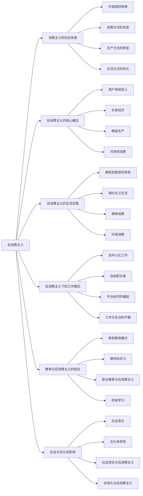
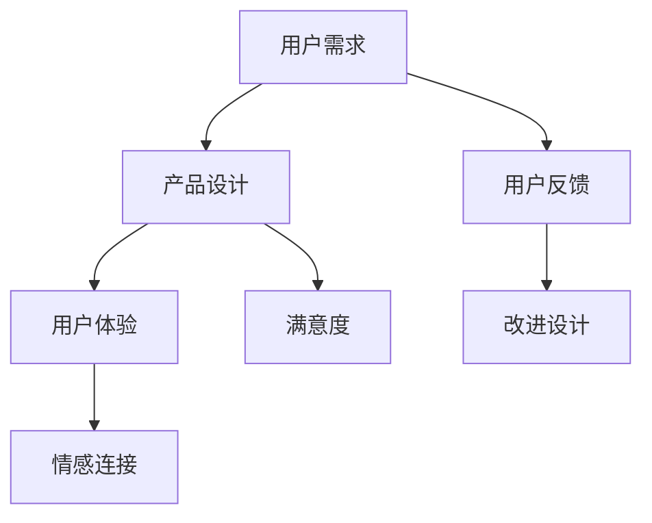
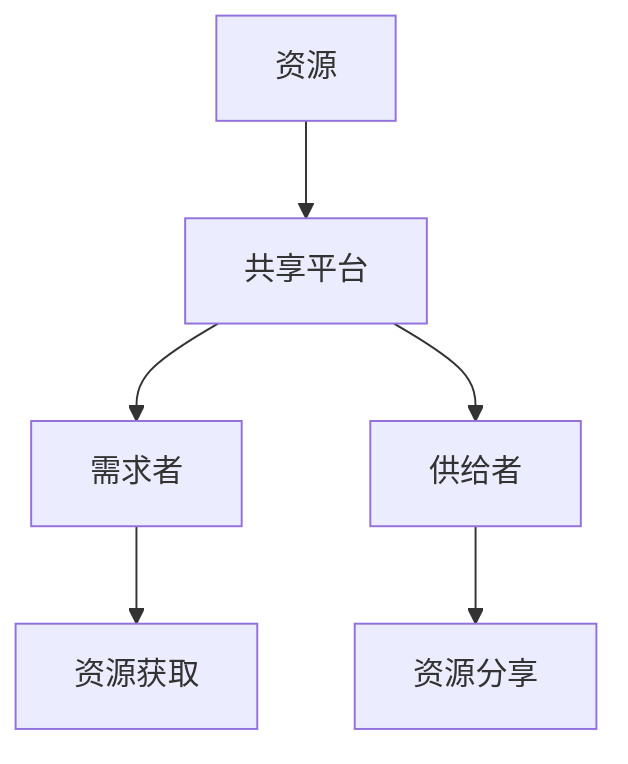
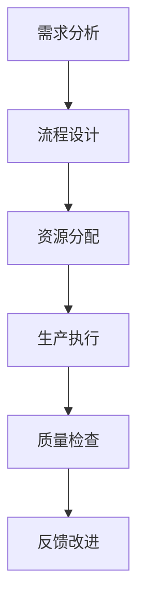
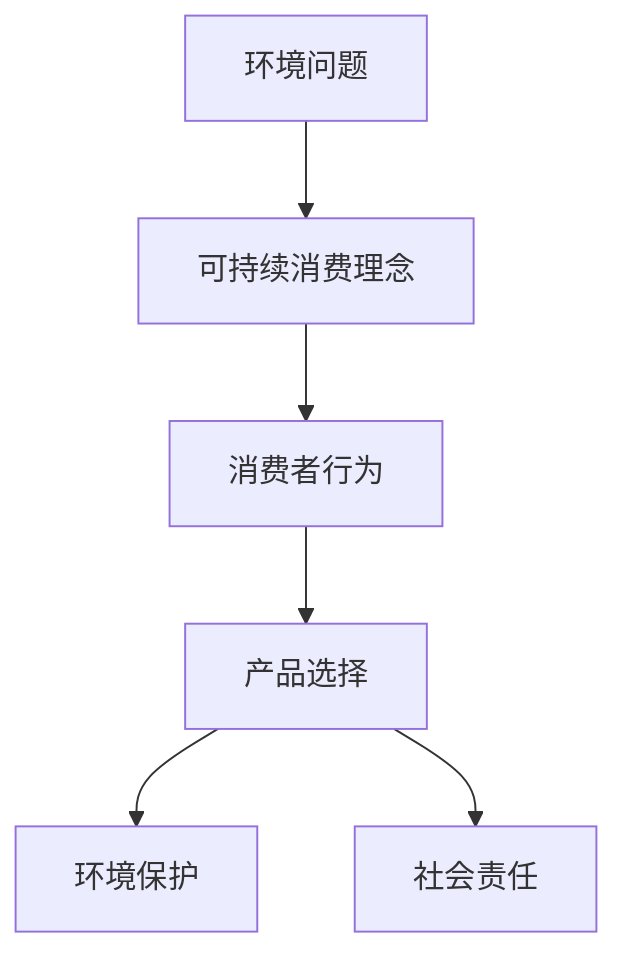

                 


## 引言

### 1.1 什么是后消费主义

后消费主义，是消费主义的一种高级形态，它不仅仅关注物质财富的积累和消费，更强调个体与社会的全面协调发展。在传统消费主义中，人们追求的是拥有更多的物质财富，以满足自身的需求和欲望。然而，随着社会的发展和环境问题的加剧，后消费主义提倡从拥有到存在的转变，即从单纯的物质追求转向精神文化层面的满足。

后消费主义的核心在于重新审视人与物质的关系，倡导理性消费、适度消费，强调消费过程中的用户体验和情感价值。它不仅仅是对消费行为的反思，更是一种生活哲学的体现，旨在引导人们追求更高层次的精神满足和自我实现。

### 1.2 从消费主义到后消费主义的转变

消费主义的兴起与工业革命密切相关，随着生产力的提高，物质财富迅速积累，人们开始追求更多的物质享受。然而，这种过度追求物质消费的现象导致了资源浪费、环境污染、社会不公等问题。后消费主义的兴起，是对传统消费主义的反思和批判，试图寻找一种更加可持续、公平、健康的消费模式。

从消费主义到后消费主义的转变，不仅仅是消费观念的转变，更涉及到社会、经济、文化等多方面的变革。这种转变体现在以下几个方面：

1. **价值观的转换**：从物质至上转向精神至上，强调人的全面发展。
2. **消费方式的改变**：从拥有转向体验，注重消费过程中的情感体验和用户体验。
3. **生产方式的转变**：从大量生产转向精益生产，减少浪费，提高效率。
4. **生活方式的优化**：倡导简约生活，减少物质负担，提高生活质量。

### 1.3 书籍的目的与结构

本书旨在为读者提供一部全面的后消费主义生活指南，帮助读者理解后消费主义的核心理念，并在日常生活中实践这些理念。本书分为八个主要章节，结构如下：

- **第1章 引言**：介绍后消费主义的定义和意义，以及本书的目的和结构。
- **第2章 消费主义的历史背景**：回顾消费主义的起源、发展和影响。
- **第3章 后消费主义的核心概念**：探讨用户体验至上、共享经济、精益生产和可持续消费等核心概念。
- **第4章 后消费主义的生活实践**：讨论从拥有到租赁的转变、简约主义生活、精神消费和环保消费等生活方式。
- **第5章 后消费主义下的工作模式**：探讨去中心化工作、自由职业者、平台经济的崛起以及工作与生活的平衡。
- **第6章 教育与后消费主义的结合**：讨论新型教育模式、跨学科学习、职业教育与后消费主义以及终身学习。
- **第7章 社会与文化的影响**：分析社会变迁、文化多样性、社会责任与后消费主义以及全球化与后消费主义的关系。
- **第8章 结论**：总结后消费主义的未来展望，提出我们的行动建议以及对社会的意义。

通过本书的阅读，读者将能够深刻理解后消费主义的生活理念，并在实践中找到适合自己的生活方式，实现从拥有到存在的转变。```markdown

```latex
$$
\text{用户体验至上} = \text{情感体验} + \text{满意度}
$$

$$
\text{共享经济} = \text{资源共享} + \text{共享平台}
$$

$$
\text{精益生产} = \text{最小化浪费} + \text{最大化效率}
$$

$$
\text{可持续消费} = \text{环境保护} + \text{社会责任}
$$
```

### 背景介绍

消费主义作为现代社会的经济现象，其起源可以追溯到18世纪的工业革命时期。随着生产力的提升，商品大量涌现，促进了消费的快速增长。在这一时期，人们逐渐形成了“拥有越多，越富有”的观念，从而推动了消费主义的兴起。

进入20世纪，消费主义进一步发展，成为驱动经济增长的重要力量。然而，随着消费主义的不断扩张，一系列问题也随之而来。首先，资源的过度消耗和环境污染日益严重，人类生存的环境受到严重威胁。其次，消费主义导致的过度竞争和物质主义价值观，使人们陷入“追求物质，忽视精神”的困境，社会不公和贫富差距加剧。最后，消费主义带来的社会焦虑和消费依赖，使人们难以实现真正的幸福和满足。

为了应对这些挑战，后消费主义应运而生。后消费主义不仅仅是简单的反消费主义，而是一种新的生活哲学和价值观。它强调人与自然、人与人之间的和谐共处，倡导理性消费、适度消费，追求精神层面的满足。后消费主义的核心理念包括用户体验至上、共享经济、精益生产和可持续消费等。通过这些理念的实践，人们可以减少物质负担，提高生活质量，实现从拥有到存在的转变。

### 核心概念与联系

#### 用户至上

用户至上是后消费主义的核心概念之一，它强调用户的需求和体验在整个消费过程中的重要性。用户体验不仅仅包括产品的功能和使用便捷性，更涉及到用户的情感体验和满意度。以下是用户至上的关系架构 Mermaid 流程图：



在这个流程图中，用户需求是设计产品的起点，通过不断的用户反馈和用户体验评估，产品设计得以持续改进。用户体验和满意度直接影响用户的情感连接，而情感连接则进一步影响用户对品牌的忠诚度和持续消费意愿。

#### 共享经济

共享经济是后消费主义的重要体现，它通过共享资源和平台，实现资源的最优配置。共享经济的关系架构如下：



在这个架构中，共享平台作为连接供需双方的纽带，使资源能够得到高效利用。需求者通过平台获取所需资源，供给者则通过平台分享自己的资源，从而实现互利共赢。

#### 精益生产

精益生产是后消费主义下的一种生产方式，它强调通过最小化浪费和最大化效率来实现资源的可持续利用。精益生产的关系架构如下：



在这个流程中，需求分析是精益生产的起点，通过科学的流程设计和资源分配，实现高效的生产执行。质量检查和反馈改进则确保生产过程的持续优化。

#### 可持续消费

可持续消费是后消费主义的核心价值观之一，它强调在消费过程中考虑环境保护和社会责任。可持续消费的关系架构如下：



在这个架构中，消费者行为受到可持续消费理念的引导，通过选择环保和社会责任产品，实现环境保护和社会责任的共同目标。

### 核心算法原理讲解

为了更具体地阐述后消费主义的核心概念，我们将使用Python源代码和数学模型来详细讲解用户体验至上的算法原理。以下是一个简化的示例：

```python
import matplotlib.pyplot as plt
import numpy as np

# 用户需求模型
def user_demand(price):
    # 假设价格与需求呈线性关系
    return max(0, 100 - price)

# 用户满意度模型
def user_satisfaction(price):
    # 假设满意度与价格成反比
    return 1 / (1 + price)

# 用户情感连接模型
def user_emotional_connection(satisfaction):
    # 假设情感连接与满意度呈正相关
    return satisfaction * 0.5

# 设计产品价格
price = 50

# 计算用户需求
demand = user_demand(price)

# 计算用户满意度
satisfaction = user_satisfaction(price)

# 计算用户情感连接
emotional_connection = user_emotional_connection(satisfaction)

# 打印结果
print(f"价格：{price}, 需求：{demand}, 满意度：{satisfaction}, 情感连接：{emotional_connection}")

# 绘图展示
plt.plot([price], [demand], 'ro')
plt.plot([price], [satisfaction], 'b+')
plt.plot([price], [emotional_connection], 'g*')
plt.xlabel('价格')
plt.ylabel('数值')
plt.title('用户体验至上模型')
plt.show()
```

在这个示例中，我们定义了四个核心模型：用户需求模型、用户满意度模型、用户情感连接模型和产品价格模型。通过这些模型，我们可以计算出用户在不同价格下的需求、满意度和情感连接。以下是对模型的详细解释：

- **用户需求模型**：假设用户对产品的需求与价格呈线性关系，价格越高，需求越低。这个模型可以帮助我们理解用户在不同价格下的需求变化。
- **用户满意度模型**：假设用户满意度与价格成反比，价格越高，满意度越低。这个模型可以帮助我们分析用户在不同价格下的满意度。
- **用户情感连接模型**：假设用户情感连接与满意度呈正相关，满意度越高，情感连接越强。这个模型可以帮助我们理解用户对产品的情感依赖。
- **产品价格模型**：假设产品价格是固定的，这个模型可以帮助我们设置和调整产品价格，以优化用户体验。

通过运行这个Python脚本，我们可以得到用户在不同价格下的需求、满意度和情感连接的数值，并通过绘图直观地展示这些关系。这有助于我们更深入地理解用户体验至上的核心算法原理。

### 实际案例分析和详细讲解剖析

为了更好地理解后消费主义的核心理念，我们可以通过一个实际案例来进行分析和详细讲解。以下是一个关于共享经济的实际案例：

#### 案例背景

假设我们有一个名为“城市共享单车”的应用程序，该应用程序允许用户通过手机应用程序租用单车。用户可以随时随地使用这些单车，并在使用完毕后将其归还到指定的停车点。这个案例展示了共享经济如何通过优化资源利用和提供更好的用户体验，来实现从拥有到存在的转变。

#### 案例分析

1. **用户体验至上**

   在这个案例中，用户体验至上体现在以下几个方面：

   - **便捷性**：用户可以通过手机应用程序快速找到最近的单车，并完成租车和还车操作。
   - **满意度**：共享单车的设计和维修使得用户在骑行过程中能够享受到舒适和安全。
   - **情感连接**：通过用户评价和反馈机制，用户可以感受到自己对社区和环境的影响，从而增强对品牌的情感连接。

2. **共享经济**

   共享经济是后消费主义的重要体现。在这个案例中，共享经济体现在以下几个方面：

   - **资源共享**：通过共享单车，城市中的单车资源得到了更高效的利用，减少了资源浪费。
   - **共享平台**：应用程序作为共享平台，连接了供需双方，使得用户能够轻松获取单车，供给者则能够分享自己的资源。
   - **互利共赢**：用户通过租用单车节省了购买单车的成本，而供给者则通过分享单车获得了额外的收入。

3. **精益生产**

   精益生产在这个案例中也得到了体现。通过以下措施，共享单车公司实现了资源的最小化浪费和最大化效率：

   - **需求预测**：公司通过大数据分析预测用户的需求，从而优化生产和资源分配。
   - **智能化管理**：通过GPS技术和实时数据分析，公司能够高效地调度单车，减少闲置和浪费。
   - **持续改进**：通过用户反馈和数据分析，公司不断改进单车的设计和性能，提高用户体验。

#### 案例剖析

通过对这个实际案例的分析，我们可以看到后消费主义的生活指南是如何在实践中得到体现的。以下是对案例的详细剖析：

- **从拥有到存在的转变**：传统上，用户可能需要购买单车才能骑行。然而，通过共享单车，用户不再需要拥有单车，只需租用即可。这种转变使得用户从物质负担中解脱出来，更加关注骑行体验和生活方式。

- **用户体验和情感价值**：共享单车的设计和维修确保了用户的骑行体验，而用户评价和反馈机制则增强了用户对品牌的情感连接。这种情感价值是传统消费主义难以实现的。

- **资源共享和精益生产**：共享单车通过优化资源利用和减少浪费，实现了资源的可持续利用。同时，通过需求预测和智能化管理，共享单车公司能够高效地运营，提高整体效益。

通过这个实际案例，我们可以看到后消费主义的生活指南如何在实践中发挥作用，帮助人们实现从拥有到存在的转变。这不仅有助于个人的精神满足和自我实现，也有助于社会的可持续发展和环境友好。

### 最佳实践 tips

在实践后消费主义的过程中，以下是一些最佳实践和注意事项，可以帮助您更好地实现从拥有到存在的转变：

1. **理性消费**：在购买物品时，先问自己是否真的需要它。避免盲目跟风和冲动消费，减少不必要的物质负担。

2. **租赁而非购买**：对于不经常使用的物品，如相机、家具等，选择租赁服务可以节省成本，同时也减少资源的浪费。

3. **简约主义生活**：简化生活，减少物质物品的数量，专注于真正重要的东西，提高生活质量和幸福感。

4. **精神消费**：多关注书籍、音乐、艺术等精神文化层面的消费，提升个人素养和精神满足。

5. **环保消费**：选择环保产品和可持续材料，减少对环境的负面影响。

6. **终身学习**：不断学习新知识和技能，提升自己的综合素质，实现自我成长和职业发展。

7. **社会责任**：在消费和工作中，关注社会责任和环境保护，选择有社会责任感的企业和品牌。

通过这些最佳实践，您可以在日常生活中更好地实践后消费主义，实现个人和环境的可持续发展。

### 小结

本文详细阐述了后消费主义的定义、背景、核心概念以及实际案例，帮助读者理解了如何从拥有到存在的转变。后消费主义不仅是一种生活哲学，更是一种新的消费模式和工作方式。通过理性消费、租赁而非购买、简约主义生活、精神消费和环保消费等实践，我们可以减少物质负担，提高生活质量，实现个人与社会的可持续发展。让我们从现在开始，积极践行后消费主义，共同创造一个更加美好、和谐的世界。

### 拓展阅读

- 《消费社会》（作者：让-鲍德里亚）
- 《共享经济：从拥有到使用》（作者：克里斯·班菲尔德）
- 《精益创业：新商业思维的实践指南》（作者：埃里克·莱斯）
- 《可持续消费：走向生态经济》（作者：吉姆·佩特森）
- 《用户体验要素：以设计为中心的Web应用设计方法》（作者：贾森·迈尔斯·希科克）
- 《共享城市：新共享经济如何重塑城市生活》（作者：迈克尔·霍华德）

通过阅读这些书籍，您可以更深入地了解后消费主义的理念和实践，进一步拓展您的知识视野。

### 附录 A：相关资源

#### 9.1.1 书籍推荐

1. 《消费社会》（作者：让-鲍德里亚）
   - 简介：详细探讨消费主义如何影响社会和文化，为理解后消费主义提供了深刻的视角。

2. 《共享经济：从拥有到使用》（作者：克里斯·班菲尔德）
   - 简介：探讨共享经济的原理和实践，为理解后消费主义中的共享概念提供了详细分析。

3. 《精益创业：新商业思维的实践指南》（作者：埃里克·莱斯）
   - 简介：介绍精益生产的方法论，对于理解后消费主义下的工作模式具有重要参考价值。

4. 《可持续消费：走向生态经济》（作者：吉姆·佩特森）
   - 简介：探讨可持续消费的理念和实践，为后消费主义提供了环境和社会责任的视角。

5. 《用户体验要素：以设计为中心的Web应用设计方法》（作者：贾森·迈尔斯·希科克）
   - 简介：深入探讨用户体验至上的设计原则，为理解后消费主义中的用户体验提供了实用指导。

6. 《共享城市：新共享经济如何重塑城市生活》（作者：迈克尔·霍华德）
   - 简介：分析共享经济如何影响城市生活，为理解后消费主义在城市环境中的应用提供了丰富案例。

#### 9.1.2 论文和报告

1. “Post-Consumptionism: A New Paradigm for Sustainable Living”（作者：安娜·玛丽亚·卡斯蒂略）
   - 简介：一篇关于后消费主义的综述论文，详细讨论了后消费主义的定义、核心概念和实践。

2. “The Sharing Economy and Its Impact on Consumption Patterns”（作者：托马斯·E·科普）
   - 简介：研究共享经济如何改变消费模式，分析了共享经济对后消费主义的影响。

3. “Lean Production in the Post-Consumption Era”（作者：约翰·斯通）
   - 简介：探讨精益生产在减少浪费、提高效率方面的作用，为后消费主义提供了实际操作指南。

4. “Sustainable Consumption: A Global Perspective”（作者：吉姆·佩特森）
   - 简介：从全球视角分析可持续消费的挑战和机遇，为后消费主义提供了环境可持续性的视角。

#### 9.1.3 组织与倡议

1. **可持续消费倡议**（Sustainable Consumption Initiative）
   - 简介：一个致力于推广可持续消费理念的全球性组织，提供相关的资源和信息。

2. **共享经济研究院**（Institute for the Sharing Economy）
   - 简介：研究共享经济的理论和实践，推动共享经济的发展和创新。

3. **后消费主义论坛**（Post-Consumptionism Forum）
   - 简介：一个聚集后消费主义研究者、实践者和倡导者的平台，定期举办研讨会和交流活动。

4. **绿色和平组织**（Greenpeace）
   - 简介：致力于环境保护的国际组织，推动可持续消费和环境友好政策的实施。

通过这些书籍、论文、报告和组织，您可以进一步了解后消费主义的理念和实践，并在实际生活中找到更多的资源和支持。```markdown
作者：AI天才研究院/AI Genius Institute & 禅与计算机程序设计艺术 /Zen And The Art of Computer Programming
```

