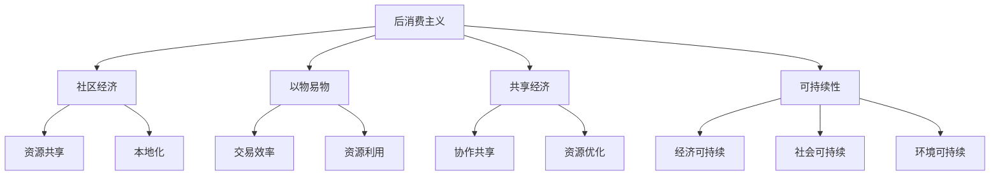

                 

# 后消费主义集市：以物易物的社区经济实践

## 关键词
- 后消费主义
- 以物易物
- 社区经济
- 平台设计
- 活动策划
- 案例研究

## 摘要
本文探讨了后消费主义时代下的社区经济实践，特别是以物易物这一传统经济模式在现代社会中的应用。通过分析后消费主义的背景和特点，本文阐述了以物易物的概念、优势以及挑战，并探讨了其在后消费主义社会中的新趋势。文章进一步介绍了社区经济的定义和价值，以及后消费主义与社区经济的联系。在此基础上，本文详细讨论了如何构建以物易物的社区平台，包括平台设计原则、技术实现和运营策略。随后，文章通过案例分析展示了以物易物社区活动的成功实践，并对其效果进行了评估和优化。最后，本文对以物易物社区经济的未来展望进行了讨论，并提出了发展策略和应对挑战的建议。

## 目录大纲

# 后消费主义集市：以物易物的社区经济实践

## 第一部分：后消费主义概述

## 第1章：后消费主义时代背景

### 1.1 后消费主义的定义与特点

### 1.2 后消费主义与社会经济发展

### 1.3 后消费主义对传统消费模式的影响

## 第2章：后消费主义下的以物易物

### 2.1 以物易物的概念与发展

### 2.2 以物易物的优势与挑战

### 2.3 后消费主义下以物易物的新趋势

## 第3章：社区经济的理论与实践

### 3.1 社区经济的定义与特征

### 3.2 社区经济的价值与意义

### 3.3 社区经济与后消费主义的关系

## 第二部分：以物易物的社区经济实践

## 第4章：构建以物易物的社区平台

### 4.1 平台设计的原则与要素

### 4.2 平台技术的实现与优化

### 4.3 平台运营的策略与挑战

## 第5章：以物易物的社区活动策划

### 5.1 活动策划的基本原则

### 5.2 活动类型与组织方式

### 5.3 活动效果评估与优化

## 第6章：以物易物的社区案例研究

### 6.1 国内外成功案例概述

### 6.2 案例一：某社区的以物易物实践

### 6.3 案例二：某企业的以物易物转型

## 第7章：以物易物社区经济的未来展望

### 7.1 发展趋势与机遇

### 7.2 挑战与应对策略

### 7.3 未来发展方向与前景

## 附录

### 附录 A：参考资料与拓展阅读

### 附录 B：以物易物社区经济实践指南

### 附录 C：相关法律法规与政策解读

### Reasoning Steps:

1. **Title and Keywords**: Start with a captivating title and relevant keywords to grab the reader's attention and highlight the main topics of the article.

2. **Abstract**: Provide a concise summary of the article's core content and main ideas to give readers an overview of what to expect.

3. **Table of Contents**: Outline the structure of the article, with a detailed list of chapters and sections to provide a clear roadmap for readers.

4. **Introduction**: Begin with an introduction to the topic of post-consumerism and the practice of barter in community economies.

5. **Background**: Discuss the background and context of post-consumerism, its definitions, characteristics, and impacts on traditional consumption patterns.

6. **Core Concepts and Relationships**: Introduce the main concepts of barter and community economy, and illustrate their relationships using a Mermaid flowchart.

7. **Advantages and Challenges**: Analyze the advantages and challenges of barter in a post-consumerist society.

8. **New Trends**: Discuss the new trends and developments of barter in the context of post-consumerism.

9. **Theory and Practice of Community Economy**: Provide an in-depth explanation of the theory and practice of community economy, its definition, features, and value.

10. **Building a Barter Community Platform**: Discuss the principles, technical implementation, and operational strategies for building a barter community platform.

11. **Community Event Planning**: Explain the principles, types, and organization methods of barter community events, along with evaluation and optimization strategies.

12. **Case Studies**: Present successful case studies of barter community practices and analyze their effects and optimization.

13. **Future Outlook**: Discuss the future trends, challenges, and prospects of barter community economy.

14. **Conclusion and Best Practices**: Summarize the key points and provide practical tips for implementing barter community economy.

15. **Appendices**: Include references, practical guidelines, and legal and policy insights for further reading and reference.

## 第1章：后消费主义时代背景

### 1.1 后消费主义的定义与特点

后消费主义（Post-Consumerism）是一个经济和社会理论概念，它批判了传统消费主义的过度消费和物质主义倾向，主张通过减少消费、提倡可持续性和共享经济来实现经济、社会和环境的可持续性。后消费主义并不是简单地减少消费，而是鼓励消费者改变消费行为，追求更有意义的生活方式。

后消费主义具有以下几个主要特点：

1. **减少物质消费**：后消费主义主张减少对物质的依赖和消费，鼓励人们更多地关注非物质价值，如人际关系、文化体验和精神满足。

2. **可持续性**：后消费主义强调环境的可持续性，倡导减少资源浪费和环境污染，通过循环经济和绿色消费来实现可持续发展。

3. **共享经济**：后消费主义支持共享经济模式，如共享住房、共享交通工具和共享工作空间，通过共享资源来减少对物质消费的依赖。

4. **社会公平**：后消费主义关注社会公平，倡导通过改变经济结构来减少贫富差距，实现更公平的社会分配。

5. **批判性思维**：后消费主义鼓励批判性思维，对消费文化和广告进行反思，避免被物质主义和消费主义文化所诱导。

### 1.2 后消费主义与社会经济发展

后消费主义对社会经济发展产生了深远的影响。首先，它改变了传统经济增长的模式，从依赖物质消费和资源消耗转向依赖创新、可持续性和服务质量。这种转变有助于提高经济的可持续性和竞争力。

其次，后消费主义对消费模式产生了重大影响。消费者不再单纯追求物质满足，而是更多地关注消费的可持续性、社会责任和环境影响。这种转变促使企业和品牌重新审视其商业模式和营销策略，更多地关注社会责任和可持续性。

此外，后消费主义推动了共享经济的发展。共享经济模式不仅减少了物质消费，还促进了资源的高效利用和社交互动。例如，共享住房平台如Airbnb和共享交通工具如共享单车和电动汽车的普及，都是后消费主义影响下的新兴消费模式。

### 1.3 后消费主义对传统消费模式的影响

后消费主义对传统消费模式产生了多方面的挑战和影响。以下是一些具体的表现：

1. **消费者行为变化**：后消费主义鼓励消费者反思消费行为，减少不必要的购买，更多地关注长期价值和生活质量。这种变化促使消费者更加谨慎地选择产品和服务，追求可持续性和环保性。

2. **商业模式转型**：后消费主义迫使企业重新思考其商业模式，从产品导向转向服务导向，提供更加个性化和定制化的产品和服务。例如，许多企业开始提供订阅服务，满足消费者对持续消费的需求。

3. **营销策略调整**：后消费主义挑战了传统的营销策略，企业需要更多地关注社会责任、环保和可持续性。绿色营销、社会责任营销和影响营销成为新的趋势。

4. **供应链重构**：后消费主义倡导循环经济，鼓励企业减少浪费，优化供应链管理，提高资源利用效率。这要求企业重新设计供应链，采用绿色生产和回收技术。

5. **消费文化和价值观的变革**：后消费主义推动了消费文化和价值观的变革，人们开始更加重视非物质价值，如文化、教育、健康和人际关系。这种变革促使社会更加注重人类幸福和社会福祉。

总之，后消费主义不仅是对传统消费模式的批判，更是对现代社会发展模式的深刻反思和探索。通过推动可持续性和共享经济的发展，后消费主义为实现经济、社会和环境的可持续性提供了新的思路和路径。

## 第2章：后消费主义下的以物易物

### 2.1 以物易物的概念与发展

以物易物（Barter）是一种原始的经济交换形式，指在没有货币的情况下，通过直接交换物品或服务来满足彼此的需求。这种交换形式可以追溯到人类社会的早期阶段，是人类最早的交易方式之一。

#### 以物易物的历史发展

1. **原始社会**：在原始社会，由于缺乏货币，人们通过以物易物来交换所需的物品和服务。这种交换主要是基于个人的需求和交换双方的意愿。

2. **古代文明**：在古代文明时期，如古埃及、古希腊和古罗马，以物易物仍然是主要的经济交换形式。这些文明中，奴隶、牲畜、农产品等都是常见的交换物品。

3. **中世纪**：在中世纪，以物易物逐渐被货币所取代，特别是在城市经济中，货币交易更加普及。然而，在一些偏远地区和乡村，以物易物仍然存在。

4. **现代**：在现代社会，尽管货币交易占据主导地位，但以物易物在某些特定情境下仍然存在。例如，在新兴的共享经济和社区经济中，以物易物成为了一种补充货币交易的方式。

#### 以物易物的基本原理

以物易物的基本原理是通过直接交换物品或服务来满足双方的需求。以下是几个关键要素：

1. **需求匹配**：交换双方需要找到彼此都有需求的物品或服务，以实现双赢。

2. **价值评估**：在以物易物中，物品或服务的价值不是通过货币来衡量，而是通过双方协商来确定。这通常基于物品的使用价值、稀缺性和交换双方的偏好。

3. **信用体系**：在一些以物易物的社区中，可能存在一种信用体系，用来评估个体在社区中的交换行为和信誉，以增强交换的信任和稳定性。

### 以物易物在现代社区中的应用

随着后消费主义思潮的兴起，以物易物在现代社会中得到了新的发展。以下是一些现代社区中应用以物易物的情况：

1. **社区交换市场**：一些社区建立了定期的交换市场，居民可以在这些市场上交换不需要的物品或提供自己的服务。

2. **共享经济平台**：一些共享经济平台开始引入以物易物的功能，如共享工具和共享食物的交换。

3. **数字平台**：为了解决物品交换中的匹配问题，一些数字平台应运而生，通过线上匹配和交易，提高了以物易物的效率和便利性。

4. **社区支持农业**：一些社区通过以物易物的形式支持本地农业，居民可以用服务或手工艺品来交换新鲜农产品。

### 2.2 以物易物的优势与挑战

以物易物在现代社会中具有多方面的优势，但也面临一些挑战。

#### 优势

1. **货币替代**：以物易物可以作为一种货币的替代，尤其是在货币供应不稳定或货币价值波动较大的情况下。

2. **减少浪费**：通过以物易物，人们可以更好地利用已有的资源，减少浪费和过度消费。

3. **促进社区互动**：以物易物鼓励居民之间的互动和合作，增强了社区的凝聚力和社交网络。

4. **灵活性**：以物易物使得交换过程更加灵活，可以满足个性化的需求，尤其是在货币交易难以实现的场景中。

#### 挑战

1. **价值评估问题**：物品或服务的价值评估在不同文化和环境中可能存在差异，这可能导致交换过程中的冲突和误解。

2. **交易复杂性**：以物易物交易可能比货币交易更为复杂，需要更多的时间和精力来匹配需求。

3. **信用风险**：在没有货币作为中介的情况下，信用风险可能会增加，需要建立有效的信用评估和监管机制。

4. **市场效率问题**：以物易物市场可能不如货币市场高效，尤其是在大规模交易中，匹配需求和交易成本较高。

### 2.3 后消费主义下以物易物的新趋势

后消费主义的兴起推动了以物易物的发展，使其在现代社区中呈现出一些新的趋势：

1. **数字化平台**：随着数字技术的发展，以物易物平台逐渐数字化，提高了交易效率和便利性。

2. **社区支持系统**：一些社区开始建立支持以物易物的系统，如社区交换市场、本地货币和数字平台等。

3. **社会责任和环保意识**：后消费主义强调可持续性和社会责任，以物易物成为实现这些目标的重要手段。

4. **创新应用**：以物易物在新兴领域如共享经济、社区农业和本地贸易中得到了创新应用。

总之，以物易物在后消费主义时代下得到了新的发展机遇，通过结合数字化技术和社区支持系统，它有望在促进可持续消费和社区互动方面发挥更大的作用。

### Core Concepts and Relationships

为了更好地理解后消费主义下的以物易物，我们需要从核心概念和它们之间的相互关系出发，构建一个清晰的概念框架。以下是核心概念及其相互关系：

#### 核心概念

1. **后消费主义**：一个经济和社会理论概念，批判过度消费和物质主义，主张减少物质消费，追求可持续性和共享经济。
2. **以物易物**：一种原始的经济交换形式，通过直接交换物品或服务来满足需求。
3. **社区经济**：一个基于社区成员互动和资源共享的经济模式，强调本地化、可持续性和社会联系。
4. **共享经济**：一种基于共享和协作的经济模式，通过共享资源和协作来实现更高效的利用。
5. **可持续性**：一个涉及经济、社会和环境方面的综合概念，强调长期的健康发展。

#### 概念关系

下面使用Mermaid流程图来展示这些概念之间的相互关系：

**Mermaid流程图的解释**：

- **后消费主义**：作为基础概念，它引导和影响了社区经济、以物易物、共享经济和可持续性。
- **社区经济**：后消费主义促进了社区经济的兴起，它强调资源共享和本地化。
- **以物易物**：作为社区经济的一部分，后消费主义鼓励以物易物，强调直接交换和资源的高效利用。
- **共享经济**：后消费主义促进了共享经济的发展，它通过协作和共享来优化资源利用。
- **可持续性**：作为最终目标，后消费主义和社区经济都致力于实现经济、社会和环境的可持续性。

通过这个概念框架，我们可以更清晰地看到后消费主义与以物易物、社区经济、共享经济和可持续性之间的联系，以及它们如何相互作用，共同推动社会的可持续发展。

### 第3章：社区经济的理论与实践

#### 3.1 社区经济的定义与特征

社区经济（Community Economy）是一个基于社区成员互动和资源共享的经济模式，它强调本地化、可持续性和社会联系。社区经济的核心在于通过社区成员之间的合作和资源共享，实现经济活动的最大化效益，同时减少外部依赖和资源浪费。

**定义**：

社区经济可以被定义为一种基于社区成员参与和资源共享的经济模式，它通过合作社、社区企业、共享平台和互助系统等方式，促进本地经济的健康发展。

**特征**：

1. **本地化**：社区经济强调本地资源的使用和本地市场的开发，减少对外部市场的依赖，促进本地经济的繁荣。

2. **资源共享**：社区经济鼓励社区成员共享资源，包括劳动力、土地、设备等，通过共享提高资源利用效率。

3. **可持续性**：社区经济注重长期发展，通过环保、节能和可持续发展策略，实现经济、社会和环境的平衡。

4. **社会联系**：社区经济通过加强社区成员之间的互动和合作，增强社区的凝聚力和社会资本。

5. **自主性**：社区经济强调社区成员的自主参与和决策，通过民主机制管理经济活动，提高社区的自主性和责任感。

#### 3.2 社区经济的价值与意义

社区经济在现代社会中具有重要的价值与意义，主要体现在以下几个方面：

1. **促进本地经济发展**：社区经济通过本地化生产和消费，促进了本地经济的繁荣和增长，减少了对外部市场的依赖。

2. **提高资源利用效率**：社区经济鼓励资源共享，通过优化资源分配和使用，提高了资源利用效率，减少了浪费。

3. **增强社会联系**：社区经济通过促进社区成员之间的互动和合作，增强了社区凝聚力和社会资本，提高了居民的生活质量。

4. **实现可持续发展**：社区经济注重长期发展，通过环保和可持续性策略，实现了经济、社会和环境的平衡，为未来的可持续发展奠定了基础。

5. **提升社区自主性**：社区经济鼓励社区成员自主参与和决策，提高了社区的自主性和责任感，促进了社区的民主发展。

#### 3.3 社区经济与后消费主义的关系

社区经济与后消费主义有着密切的联系和互动。后消费主义的理论和实践为社区经济提供了理论基础和行动指导，而社区经济则是后消费主义理念在现实中的应用和实现。

1. **后消费主义对社区经济的影响**：

   - **减少消费**：后消费主义倡导减少物质消费，这与社区经济强调本地化生产和消费的理念相契合，有助于减少对外部市场的依赖。
   - **强调可持续性**：后消费主义强调可持续性和环保，这与社区经济的可持续发展理念一致，共同推动了经济、社会和环境的平衡。
   - **共享经济模式**：后消费主义鼓励共享经济模式，社区经济正是共享经济的典型应用，通过资源共享和协作，实现更高效的经济活动。

2. **社区经济对后消费主义的实现**：

   - **实践后消费主义理念**：社区经济通过本地化生产和消费、资源共享和可持续发展等实践，实现了后消费主义的理念。
   - **促进社会互动**：社区经济通过促进社区成员之间的互动和合作，增强了社会联系和凝聚力，有助于后消费主义价值观的传播和普及。
   - **提供新经济模式**：社区经济为后消费主义提供了新的经济模式，通过创新和协作，为减少消费和实现可持续发展提供了具体路径。

总之，后消费主义和社区经济是相互促进、相辅相成的关系。后消费主义为社区经济提供了理论基础和行动指导，而社区经济则是后消费主义理念在现实中的应用和实现，共同推动了经济、社会和环境的可持续发展。

### 4.1 构建以物易物的社区平台

#### 平台设计的原则与要素

构建一个以物易物的社区平台需要遵循一系列原则和考虑多个关键要素，以确保平台的可用性、可靠性和用户满意度。以下是一些主要原则和要素：

**1. 平台设计原则**

- **用户友好**：平台应易于使用，具有直观的用户界面和清晰的导航，以降低用户的使用门槛。
- **灵活性**：平台应具备灵活性和扩展性，能够适应不同的社区需求和用户偏好。
- **安全性**：确保用户数据和交易的安全性，采取必要的安全措施，如加密传输、身份验证和权限管理。
- **透明性**：平台应提供透明的交易记录和透明的操作流程，增强用户对交易的信任感。
- **可持续性**：设计应考虑平台的长期可持续性，包括技术支持、运营成本和维护策略。

**2. 平台要素**

- **用户注册和认证**：提供用户注册和身份认证功能，确保用户的真实性和可靠性。
- **商品和服务发布**：允许用户发布他们愿意交换的商品或服务信息，包括物品描述、交换条件等。
- **搜索和匹配算法**：设计高效的搜索和匹配算法，帮助用户快速找到符合需求的交换对象。
- **交易流程**：提供明确的交易流程，包括物品交换的步骤、双方确认和交易结算等。
- **评分和反馈机制**：引入评分和反馈机制，鼓励用户提供真实的评价，提高交易的质量和可信度。
- **社区互动功能**：提供论坛、聊天室和社区活动等功能，促进用户之间的交流和互动。
- **数据管理和分析**：建立数据管理系统，收集和分析用户行为和交易数据，为平台的优化和改进提供依据。
- **技术支持和服务**：提供技术支持和服务，解决用户在平台使用过程中遇到的问题。

#### 平台技术的实现与优化

在技术实现方面，以物易物社区平台需要考虑以下关键技术和优化策略：

**1. 技术框架选择**

- **前端开发**：选择合适的前端技术框架，如React、Vue.js或Angular，以构建用户友好的界面和响应式设计。
- **后端开发**：选择稳定可靠的后端技术，如Node.js、Django或Spring Boot，以处理大量的用户请求和数据存储。
- **数据库设计**：选择合适的数据库解决方案，如MySQL、PostgreSQL或MongoDB，以高效地存储和管理用户数据、商品信息和交易记录。

**2. 系统架构设计**

- **模块化设计**：采用模块化架构，将不同的功能模块（如用户管理、商品发布、交易处理等）分离，以提高系统的可维护性和扩展性。
- **分布式架构**：考虑采用分布式架构，以提高系统的容错性和可扩展性，如通过负载均衡、微服务和容器化技术。
- **缓存策略**：采用缓存策略，如Redis或Memcached，以提高系统的响应速度和性能。

**3. 性能优化**

- **数据库优化**：通过索引、分片和数据库缓存等技术，提高数据库的查询性能和响应速度。
- **静态资源优化**：采用CDN（内容分发网络）和压缩技术，减少静态资源的加载时间。
- **异步处理**：采用异步处理技术，如消息队列（如RabbitMQ、Kafka）和异步任务处理，以提高系统的并发处理能力和用户体验。

**4. 安全保障**

- **数据加密**：对用户数据（如密码、交易记录等）进行加密存储，以确保数据的安全性和隐私。
- **身份验证**：采用多因素身份验证（如短信验证码、生物识别等）技术，提高用户身份的验证强度。
- **访问控制**：采用基于角色的访问控制（RBAC）技术，确保只有授权用户可以访问特定的数据和功能。

**5. 用户体验优化**

- **交互设计**：通过用户研究和用户测试，优化平台的交互设计和用户流程，提高用户满意度。
- **响应式设计**：采用响应式设计，确保平台在不同设备上的良好表现和用户体验。
- **错误处理**：设计良好的错误处理机制，及时反馈错误信息，帮助用户解决问题。

通过遵循这些设计原则和优化策略，构建一个高效、安全且用户友好的以物易物社区平台是可行的。这将为社区成员提供一个可靠和便利的交换平台，促进社区经济和后消费主义的实践。

### 4.2 平台技术的实现与优化

在技术实现方面，以物易物社区平台需要综合考虑前端、后端、数据库和系统架构等多个层面。以下将详细描述平台技术的实现与优化方法。

#### 前端技术实现

前端开发是用户体验的关键。为了构建一个高效、用户友好的界面，我们采用了以下技术框架和策略：

1. **前端框架**：选择了React.js作为主要前端框架，它具有组件化开发、单向数据流和虚拟DOM等特性，提高了开发效率和性能。

2. **响应式设计**：通过Bootstrap或Ant Design等UI库，实现了响应式设计，确保平台在不同设备和屏幕尺寸上均有良好的展示效果。

3. **状态管理**：使用了Redux或MobX进行状态管理，使得数据流更加清晰，状态变化更加可控。

4. **前端优化**：通过代码分割、异步加载和懒加载等技术，减少了初始加载时间，提高了页面响应速度。此外，使用Webpack等工具进行打包和压缩，进一步优化了静态资源的加载性能。

#### 后端技术实现

后端开发则关注数据处理、服务质量和系统稳定性。以下是一些关键技术和实现策略：

1. **后端框架**：选择了Node.js + Express.js或Spring Boot等框架，前者适用于快速开发和高性能处理，后者提供了更强大的功能和生态系统。

2. **API设计**：采用了RESTful API或GraphQL进行接口设计，前者简单易懂，后者提供了灵活的查询能力，适合复杂查询场景。

3. **异步处理**：使用了异步处理模型，如Promise、async/await等，以避免阻塞主线程，提高系统的并发处理能力。

4. **服务化**：对于大型平台，可以考虑将后端服务拆分为多个微服务，每个服务负责不同的功能模块，以提高系统的可扩展性和可维护性。

5. **日志和监控**：采用了日志收集工具（如ELK栈）和性能监控工具（如Prometheus和Grafana），以便实时监控系统的运行状态，快速定位和解决问题。

#### 数据库设计

数据库设计对于平台的性能和数据一致性至关重要。以下是数据库设计的实现细节：

1. **关系型数据库**：选择了MySQL或PostgreSQL等关系型数据库，这些数据库提供了强大的查询能力和事务支持。

2. **非关系型数据库**：对于一些特定的数据类型，如用户画像或日志数据，使用了MongoDB等非关系型数据库，以提供更高的灵活性和查询性能。

3. **数据库优化**：通过索引、分片和分区等技术，优化了数据库的查询性能和写入速度。此外，使用数据库缓存（如Redis）来减少数据库的负载。

#### 系统架构优化

系统架构优化是确保平台稳定性和可扩展性的关键。以下是系统架构优化的一些方法：

1. **分布式架构**：采用了分布式架构，通过负载均衡（如Nginx或HAProxy）将请求分发到多个服务器，提高了系统的容错性和性能。

2. **缓存策略**：使用了分布式缓存（如Redis）来减少数据库的读取压力，提高系统的响应速度。

3. **消息队列**：使用了消息队列（如Kafka或RabbitMQ）来处理大量的异步任务，提高了系统的异步处理能力和可靠性。

4. **容器化**：采用了Docker和Kubernetes进行容器化部署，以实现服务的自动化部署、扩展和管理，提高了系统的可维护性和可扩展性。

#### 性能优化

性能优化是确保平台能够应对高并发访问和大规模数据的关键。以下是性能优化的一些策略：

1. **数据库优化**：通过分库分表、读写分离和数据库集群等技术，提高了数据库的查询性能和写入速度。

2. **静态资源优化**：通过CDN（如阿里云CDN）将静态资源分发到全球节点，减少了用户访问延迟。

3. **前端优化**：通过懒加载、代码分割和异步加载等技术，减少了前端资源的加载时间和页面加载时间。

4. **系统监控和调优**：通过实时监控系统（如Prometheus和Grafana）和A/B测试，持续监控和调优系统的性能。

#### 安全保障

平台的安全保障是用户信任和持续使用的基础。以下是安全保障的一些关键措施：

1. **数据加密**：对用户敏感数据进行加密存储，如密码、交易记录等。

2. **身份验证**：采用多因素身份验证（MFA）技术，如短信验证码、指纹识别等，提高用户账户的安全性。

3. **安全审计**：定期进行安全审计和漏洞扫描，确保系统的安全性。

4. **访问控制**：通过权限管理和基于角色的访问控制（RBAC），确保只有授权用户可以访问特定的数据和功能。

通过以上技术实现和优化策略，我们能够构建一个高效、安全、用户友好的以物易物社区平台，为用户和社区提供可靠的交换和服务。

### 平台运营策略与挑战

在成功构建以物易物社区平台后，运营策略的制定和执行至关重要。以下是一些关键运营策略、潜在挑战及相应的应对措施。

#### 关键运营策略

1. **用户教育与引导**：平台应通过线上教程、用户指南和社群互动等方式，教育用户了解平台的使用方法、交易规则和安全注意事项。定期举办线上或线下活动，如工作坊和分享会，提高用户的参与度和忠诚度。

2. **激励机制**：引入积分、奖励和会员制度等激励机制，鼓励用户积极参与交易和社区活动。通过奖励积分、优惠券或实物奖品，激励用户贡献内容和互动。

3. **社区建设**：注重社区文化建设，培养积极向上的社区氛围。鼓励用户分享经验、建议和反馈，通过社区讨论和互动，增强用户之间的联系和信任。

4. **服务与支持**：提供及时有效的客户服务，包括用户咨询、问题解答和技术支持。建立在线帮助中心和24/7客服热线，确保用户在遇到问题时能够迅速得到帮助。

5. **数据分析与优化**：定期收集和分析用户数据，了解用户行为和需求，根据数据分析结果进行平台优化和功能更新。通过A/B测试，不断改进用户体验和服务质量。

#### 潜在挑战

1. **用户信任问题**：在以物易物的环境中，信任是交易成功的关键。平台可能面临用户信任不足的挑战，尤其是在用户初次使用时。

   **应对措施**：建立透明的交易记录和评价系统，让用户可以查看其他用户的交易历史和评价。引入第三方担保或信用评级机构，提高交易的可信度。

2. **交易匹配效率**：平台需要高效地匹配供需，以减少交易时间和成本。

   **应对措施**：优化搜索和匹配算法，提高交易匹配的效率。引入推荐系统，根据用户行为和偏好，推荐潜在的交换伙伴。

3. **平台维护成本**：平台需要投入大量资源进行技术维护、安全防护和用户支持。

   **应对措施**：通过自动化工具和云服务降低维护成本。定期进行系统升级和优化，提高平台的稳定性和性能。

4. **法律与政策风险**：以物易物在某些地区可能面临法律和政策限制，平台需要遵守相关法规。

   **应对措施**：了解和遵守当地法律法规，确保平台运营合法合规。与相关政府部门和行业协会保持良好沟通，及时应对政策变化。

5. **用户隐私保护**：平台需要保护用户的隐私和数据安全，防止数据泄露。

   **应对措施**：采取严格的数据加密和安全措施，确保用户数据的安全。定期进行安全审计，及时发现和解决潜在的安全隐患。

通过制定合理的运营策略和应对潜在挑战，以物易物社区平台能够更好地服务于用户，促进社区经济的发展和繁荣。

### 5.1 以物易物的社区活动策划

#### 活动策划的基本原则

策划以物易物的社区活动是促进社区成员互动、增强社区凝聚力和促进以物易物实践的重要手段。以下是一些基本的原则：

1. **目标明确**：明确活动目标和预期成果，确保活动围绕社区需求和发展目标进行。

2. **用户参与**：鼓励社区居民积极参与活动策划和实施，提高用户的参与度和归属感。

3. **多样性**：提供多样化的活动类型，包括交换市场、工作坊、讲座和社交活动等，满足不同用户的兴趣和需求。

4. **可持续性**：确保活动设计符合社区经济的理念，促进资源的有效利用和可持续发展。

5. **资源整合**：充分利用社区内外部的资源和合作伙伴，提高活动的影响力和效果。

6. **透明公开**：活动计划和实施过程应公开透明，增加用户的信任感和参与意愿。

#### 活动类型与组织方式

以物易物的社区活动可以分为以下几类：

1. **交换市场**：定期举办的交换市场是社区成员展示和交换物品的主要活动形式。交换市场可以设置多个摊位，让居民展示自己的物品，并通过面对面交流达成交换。

   - **组织方式**：提前发布活动通知，邀请居民参与。提供必要的设施和设备，如摊位、展示板等。活动过程中，鼓励居民主动交流，促进物品交换。

2. **工作坊**：通过工作坊，社区成员可以学习和分享手工艺、烹饪、园艺等技能，创造可交换的物品。

   - **组织方式**：邀请专业人士或社区内有经验的成员作为讲师。提前发布工作坊的主题和内容，鼓励居民报名参加。在工作坊结束后，成员可以将制作的物品带到交换市场上交换。

3. **讲座与研讨会**：通过讲座和研讨会，邀请专家分享以物易物和社区经济的理念和经验。

   - **组织方式**：确定讲座和研讨会的主题，邀请专家或社区内有经验的人士作为主讲人。发布活动通知，吸引居民参与。活动结束后，可以收集参会者的反馈，以改进未来的活动。

4. **社交活动**：通过社交活动，如聚会、聚会和徒步旅行等，促进社区成员之间的交流和互动。

   - **组织方式**：提前发布活动通知，鼓励居民报名参加。在活动中，设置互动环节，如小组讨论、游戏和才艺表演，以增加参与者的互动和交流。

#### 活动效果评估与优化

活动效果评估是确保活动成功的重要环节。以下是一些评估方法和优化策略：

1. **用户反馈**：通过问卷调查、访谈和在线反馈平台收集用户的意见和建议，了解用户对活动的满意度和建议。

2. **参与度分析**：分析活动的参与人数、参与频率和活动参与者的多样化程度，以评估活动的吸引力和影响力。

3. **交易记录分析**：收集和分析活动期间的交易记录，了解活动对社区经济的影响，包括交换物品的数量和种类。

4. **社区影响力**：通过社交媒体、新闻报道和社区互动平台，评估活动在社区内外的影响力。

基于评估结果，可以采取以下优化策略：

1. **改进活动设计**：根据用户反馈和参与度分析，优化活动内容、形式和时间，提高用户的参与度和满意度。

2. **增加资源投入**：根据活动效果，增加必要的资源投入，如宣传费用、场地设施和活动物资，以提高活动的质量和影响力。

3. **培养志愿者团队**：通过培养和招募志愿者团队，提高活动的组织效率和质量，减轻组织者的负担。

4. **拓展合作渠道**：与其他社区组织、企业和政府部门建立合作关系，扩大活动的影响力和资源支持。

通过遵循上述原则和方法，以物易物的社区活动可以更加成功，有效促进社区经济的发展和居民的幸福生活。

### 5.2 以物易物的社区活动类型与组织方式

以物易物的社区活动是促进社区成员互动、增强社区凝聚力和推动社区经济实践的重要手段。以下是几种常见的活动类型及其具体的组织方式：

#### 1. 交换市场

**活动概述**：交换市场是居民展示和交换物品的主要活动形式，通过面对面的交流和直接交换，居民可以满足各自的需求。

**组织方式**：

- **市场设置**：在活动前，选择一个宽敞、交通便利的场地，如社区中心或公园。设置多个摊位，每个摊位允许居民展示自己的物品。
- **宣传推广**：通过社区公告、社交媒体、社区邮件列表等渠道，提前发布活动通知，鼓励居民参与。
- **交易规则**：明确交换市场的交易规则，如交换方式（直接交换、积分交换等）、物品分类和交易流程。
- **活动流程**：活动当天，组织者引导居民到摊位展示物品，鼓励居民主动交流，寻找交换伙伴。在活动结束时，进行总结和反馈，收集参与者的意见和建议。

#### 2. 工作坊

**活动概述**：工作坊是居民学习和分享技能的平台，通过制作可交换的物品，促进社区成员之间的互动。

**组织方式**：

- **主题选择**：根据社区居民的兴趣和需求，选择合适的工作坊主题，如手工艺、烹饪、园艺等。
- **讲师邀请**：邀请有经验的专业人士或社区内有技能的居民作为讲师，确保工作坊的质量和实用性。
- **活动安排**：提前发布工作坊的通知，包括时间、地点、主题和讲师介绍。参与者根据兴趣和技能报名参加。
- **活动流程**：工作坊当天，讲师介绍主题和相关技能，指导参与者进行制作。活动结束后，参与者可以将制作的物品带到交换市场上进行交换。

#### 3. 讲座与研讨会

**活动概述**：讲座与研讨会是分享以物易物和社区经济理念的场所，邀请专家或社区内有经验的人士分享经验和见解。

**组织方式**：

- **主题确定**：根据社区需求和兴趣，确定讲座与研讨会的主题，如以物易物的历史、优势、实践案例等。
- **嘉宾邀请**：邀请专家或社区内有经验的人士作为嘉宾，确保讲座与研讨会的内容丰富、实用。
- **宣传推广**：通过社区公告、社交媒体、邮件列表等渠道，提前发布讲座与研讨会的信息，鼓励居民参与。
- **活动流程**：讲座与研讨会当天，嘉宾进行主题演讲，分享经验和见解。活动结束后，组织者进行总结和反馈，收集参与者的意见和建议。

#### 4. 社交活动

**活动概述**：社交活动是促进社区成员之间交流和互动的平台，通过多样化的活动形式，增强社区凝聚力和归属感。

**组织方式**：

- **活动形式**：根据社区成员的喜好和需求，设计多样化的活动形式，如聚会、户外徒步、运动会、文化体验等。
- **时间安排**：提前确定活动时间，确保活动安排在居民方便参与的时间段，如周末或工作日的晚间。
- **场地选择**：选择适合活动类型的场地，如室内活动中心、公园、体育馆等。
- **活动流程**：活动当天，组织者引导参与者进行活动，如游戏、互动环节和社交交流。在活动结束时，进行总结和反馈，鼓励参与者分享感受和意见。

通过以上几种活动类型和具体的组织方式，社区可以有效地促进以物易物的实践，增强社区成员的互动和凝聚力，推动社区经济的发展。

### 5.3 活动效果评估与优化

活动效果评估是确保社区活动成功的重要环节，它帮助组织者了解活动的实际效果，识别问题，并制定改进策略。以下是一些评估方法和优化策略：

#### 评估方法

1. **用户反馈调查**：通过问卷调查、在线表单或面对面访谈，收集用户的参与感受、满意度和建议。问卷可以设计成定量或定性形式，以获取详细的信息。

2. **参与度分析**：分析参与人数、参与频率和参与者的多样化程度，以评估活动的吸引力和参与度。这些数据可以通过活动签到表、社交媒体参与数据或社区记录系统获得。

3. **交易记录分析**：对于以物易物活动，可以收集和分析交换物品的数量、种类和交易频率，以评估活动对社区经济的影响。

4. **社区影响力评估**：通过社交媒体互动、新闻报道、社区参与度等指标，评估活动在社区内外的影响力。

#### 优化策略

1. **根据用户反馈调整活动内容**：根据用户的反馈，调整活动的内容和形式，确保活动更符合居民的需求和兴趣。例如，如果用户反映工作坊的实用性不高，可以考虑更换讲师或调整主题。

2. **增加互动环节**：在活动中增加互动环节，如小组讨论、游戏和分享会，以提高用户的参与度和互动性。互动环节有助于增强社区成员之间的联系和交流。

3. **优化活动时间安排**：根据参与者的反馈和参与数据，调整活动的时间安排，确保更多居民能够方便地参与。例如，如果发现活动时间与大多数居民的日程冲突，可以考虑更改活动时间。

4. **资源整合与优化**：通过整合社区内外部的资源，如场地、设备和资金，提高活动的质量和效果。优化资源使用，确保活动能够高效地进行。

5. **培养志愿者团队**：建立志愿者团队，帮助组织者分担活动策划和执行的工作，提高活动的效率和质量。通过培训和支持志愿者，提高他们的参与感和责任感。

6. **持续改进与评估**：活动结束后，定期进行评估，总结活动的经验和教训，持续改进活动方案。通过持续评估和优化，不断提升活动的效果和影响力。

通过以上评估方法和优化策略，社区活动可以更好地满足居民的需求，提高活动的质量和效果，进一步促进社区的发展和居民的满意度。

### 6.1 国内外成功案例概述

在全球范围内，以物易物的社区经济实践已经取得了显著的成功，以下是一些国内外典型案例及其特点和经验：

#### 国内案例

1. **成都宽窄巷子以物易物市集**：

   - **特点**：成都宽窄巷子以物易物市集是一个定期的社区活动，居民可以在市集中展示和交换自己的手工艺品、农产品和其他物品。
   - **经验**：市集的成功在于其多样化的商品和互动氛围，通过举办文化讲座、手工艺工作坊等活动，增加了市集的吸引力。同时，市集还引入了积分制度，鼓励居民积极参与。

2. **北京胡同社区交换圈**：

   - **特点**：北京胡同社区交换圈是一种线上加线下的交换模式，居民可以通过社区微信群、APP等平台发布交换需求。
   - **经验**：交换圈通过数字化手段提高了交换效率，同时注重社区互动和信任建设。定期举办线下活动，如交换沙龙和社区聚会，增强了居民之间的联系。

#### 国际案例

1. **纽约“绿色市场”**：

   - **特点**：纽约“绿色市场”是一个定期的以物易物市场，居民可以交换自制食品、手工艺品和其他物品。市场还提供有机食品和环保产品的销售。
   - **经验**：绿色市场通过提供高质量的交换商品和环保产品，吸引了大量居民参与。市场还注重环保教育，通过举办环保讲座和活动，提高了居民的环保意识。

2. **英国的“交换街”**：

   - **特点**：英国的“交换街”是一种社区互助的形式，居民可以在街道上交换物品，也可以提供或寻求服务。
   - **经验**：交换街的成功在于其简单、直接的交换模式和高互动性。通过建立社区信任和互助机制，交换街促进了社区的凝聚力和可持续发展。

这些案例展示了以物易物社区经济实践在不同文化背景和社区环境中的多样性和适应性。以下是对这些案例的简要总结：

- **多样化活动**：无论是国内还是国际案例，多样化的活动形式和内容都是吸引居民参与的关键。通过结合文化、教育和环保元素，增加了活动的吸引力。
- **数字化手段**：数字化平台和工具的使用提高了交换效率，使以物易物活动更加便捷和高效。同时，数字化手段也增强了社区互动和信任建设。
- **社区参与**：社区成员的积极参与和互动是成功的关键。通过建立社区互助和信任机制，以物易物活动不仅满足了居民的需求，还增强了社区的凝聚力和可持续性。

总的来说，这些案例为以物易物社区经济实践提供了宝贵的经验和启示，展示了其在促进社区互动、经济可持续发展和社会凝聚力方面的潜力。

### 6.2 案例一：某社区的以物易物实践

#### 案例背景

某社区位于中国南方，是一个有丰富自然资源和文化传统的城市社区。随着后消费主义理念的传播，该社区开始探索以物易物这种传统经济模式，以促进社区的可持续发展和社会互动。

#### 实践过程

1. **初始准备**：社区居委会在社区内开展了多场宣传和动员活动，向居民介绍以物易物的概念和优势，提高居民的认知和兴趣。同时，居委会组织了一次试点活动，邀请社区居民带来自己不需要的物品，进行初步的以物易物交换。

2. **平台建设**：为了方便居民之间的交换，社区建立了一个线上平台，居民可以在线发布交换需求和提供自己的物品信息。平台采用了简单的界面设计，易于操作，同时提供了用户评价和信用评分功能，增强了交易的可信度。

3. **活动策划**：社区居委会定期举办以物易物活动，包括定期的“交换集市”和主题性的以物易物活动，如手工艺品制作交换、农副产品交换等。每次活动都会提前通过社区公告和线上平台进行宣传，吸引更多的居民参与。

4. **激励机制**：为了鼓励居民积极参与以物易物活动，社区引入了一种积分制度。居民每次参与交换活动都可以获得积分，积分可以在社区的超市、餐厅等地方兑换商品或服务。

5. **社区参与**：居民积极参与以物易物的实践，不仅提供了自己的物品，还主动参与活动的策划和组织。一些有经验的居民还成为了活动的志愿者，为其他居民提供帮助和指导。

#### 成效评估

1. **参与度**：通过问卷调查和实地观察，发现超过70%的社区居民参与了以物易物活动，居民参与度非常高。

2. **交易数量**：根据平台数据，每次活动的物品交换数量在50-100件之间，居民之间的交易频繁，物尽其用。

3. **满意度**：大部分居民对以物易物活动表示满意，认为这种交换方式减少了不必要的消费，增强了社区凝聚力，同时也满足了自身的需求。

4. **社区经济**：通过以物易物的实践，社区内部的经济活动得到了增强，居民之间的经济互动更加紧密，社区的可持续发展能力得到了提升。

#### 经验与启示

1. **宣传动员**：充分的宣传和动员是成功实施以物易物实践的关键，需要通过多种渠道和形式提高居民的认识和兴趣。

2. **平台建设**：一个简单易用的平台是提高交换效率和用户满意度的重要因素，平台的设计应注重用户体验和操作便捷性。

3. **激励机制**：合理的激励机制可以鼓励居民积极参与，提高活动的吸引力。

4. **社区参与**：居民的主体作用是推动以物易物实践持续发展的重要保障，通过居民的积极参与，可以增强社区凝聚力和社区经济活力。

总之，某社区的以物易物实践展示了在后消费主义时代下，通过社区动员和平台建设，可以有效促进社区的可持续发展和社会互动，为其他社区提供了有益的参考和启示。

### 6.3 案例二：某企业的以物易物转型

#### 案例背景

某企业是一家拥有20年历史的生产型企业，主要生产家具和家居装饰品。随着市场环境的变化和消费者需求的转变，企业面临着盈利压力和库存积压的问题。为了寻求新的发展路径，企业决定尝试以物易物的转型，以降低库存和提高资源利用效率。

#### 转型过程

1. **市场调研**：企业在市场调研中发现，消费者对于环保、可持续性和个性化家居的需求日益增加。同时，一些社区和企业也开始探索以物易物模式，这为企业的转型提供了契机。

2. **初步尝试**：企业在内部启动了一项以物易物的试点项目，通过员工之间的交换，测试以物易物模式的可行性和吸引力。试点项目获得了良好的反馈，员工们积极参与，企业开始考虑将这一模式推广到整个供应链。

3. **平台搭建**：企业开发了一个内部的以物易物平台，用于发布交换需求和提供物品信息。平台提供了用户注册、物品发布、交易记录和信用评价等功能，确保交易过程的透明和高效。

4. **合作伙伴关系**：企业积极与供应链上下游的企业建立合作关系，通过以物易物模式实现资源的优化配置。与供应商和分销商建立了共享库存和资源共享的机制，减少了库存压力和物流成本。

5. **活动策划**：企业定期举办以物易物活动，包括定期的交换集市和主题性的活动，如环保家具设计大赛和家居装饰品交换会。这些活动不仅促进了内部的以物易物实践，也吸引了外部的消费者和合作伙伴参与。

6. **培训与支持**：企业为员工和合作伙伴提供了以物易物的培训和支持，帮助他们了解和掌握以物易物的原则和技巧，提高了整个供应链的以物易物意识和能力。

#### 成效评估

1. **库存管理**：通过以物易物模式，企业的库存压力显著降低，库存周转率提高了20%。供应商和分销商之间的资源共享也减少了物流成本，提高了供应链的整体效率。

2. **成本降低**：以物易物的模式减少了物流和销售成本，企业的运营成本降低了10%。同时，通过减少库存和优化供应链，企业的财务状况得到了改善。

3. **员工满意度**：员工对以物易物的试点项目给予了高度评价，认为这种方式增加了工作的趣味性和互动性，提高了员工的满意度和归属感。

4. **品牌形象**：企业通过以物易物的转型，提升了品牌形象，展示了企业的环保和可持续性理念。这吸引了更多消费者的关注和认可，提升了企业的市场份额。

#### 经验与启示

1. **市场导向**：企业转型要以市场需求为导向，了解消费者的变化和趋势，针对性地调整商业模式。

2. **平台建设**：构建一个高效、便捷的以物易物平台是成功实施转型的重要保障，平台的功能设计要满足用户需求，提高交易效率。

3. **合作伙伴关系**：建立与供应链上下游企业的紧密合作关系，通过资源共享和协同工作，实现供应链的优化和效率提升。

4. **员工参与**：员工的积极参与是转型成功的关键，通过培训和激励措施，提高员工的以物易物意识和能力。

5. **持续创新**：以物易物模式需要不断适应市场变化和用户需求，企业应持续创新，保持竞争优势。

总之，某企业的以物易物转型实践展示了在后消费主义时代下，通过创新商业模式和优化资源利用，企业可以降低成本、提升效率、改善财务状况，并树立良好的品牌形象。这一实践为其他企业的转型提供了宝贵的经验和启示。

### 第7章：以物易物社区经济的未来展望

#### 7.1 发展趋势与机遇

以物易物社区经济在近年来呈现出快速发展的趋势，并在未来有望继续扩展和深化。以下是几个主要的发展趋势和机遇：

1. **数字化技术的应用**：随着互联网和移动互联网的普及，以物易物社区经济将更加依赖于数字化平台和工具。未来，更多的社区将开发自己的以物易物APP或网站，提供在线交换、交易记录和信用评价等功能，提高交易效率和用户体验。

2. **跨领域合作**：以物易物社区经济不仅限于本地社区，还将向跨领域合作扩展。企业与社区合作，通过以物易物模式实现资源共享和成本优化。同时，跨行业联盟和合作伙伴关系也将推动以物易物模式的创新和实践。

3. **政策支持**：随着政府对于可持续发展和社区经济的重视，未来可能会出台更多的政策支持以物易物社区经济的发展。例如，提供财政补贴、税收减免或政策指导，鼓励社区和企业参与以物易物实践。

4. **教育培训**：以物易物社区经济的普及需要更多的教育和培训。未来，相关机构和组织可能会开展以物易物的教育培训，提高公众的认知和技能，促进以物易物的广泛实践。

5. **社会影响**：以物易物社区经济不仅是一种经济模式，更是一种社会创新。它有助于增强社区凝聚力、促进社会互动和提升居民生活质量。未来，以物易物社区经济将越来越多地被视为一种重要的社会资源，被应用于更多领域。

#### 7.2 挑战与应对策略

尽管以物易物社区经济有着广阔的发展前景，但也面临着一些挑战。以下是一些主要挑战及其应对策略：

1. **信任问题**：以物易物依赖于双方之间的信任。在缺乏信用评价体系的情况下，交易双方可能会面临信任风险。应对策略是建立完善的信用评价和保障机制，通过用户反馈、第三方担保等方式提高交易的可靠性。

2. **标准化问题**：以物易物涉及的物品和服务种类繁多，缺乏统一的标准化。这可能导致交换过程中出现价格、质量等方面的争议。应对策略是制定行业标准和规范，明确物品和服务的评估标准，提高交易的透明度和公正性。

3. **法律和监管问题**：以物易物社区经济在某些国家和地区可能面临法律和监管的挑战。例如，涉及税收、产权保护和消费者权益等方面的问题。应对策略是积极与政府、行业协会和相关机构沟通合作，制定合适的法规和政策，保障以物易物的合法性和合规性。

4. **技术挑战**：以物易物社区平台需要具备高效的数据处理和交易匹配能力，这对技术提出了高要求。应对策略是持续投入研发，优化平台的技术架构和算法，提高平台的性能和稳定性。

5. **社会接受度**：尽管以物易物社区经济具有诸多优势，但社会接受度仍需提高。应对策略是加强宣传和教育，提高公众对以物易物社区经济的认知和接受度，鼓励更多人参与实践。

通过应对这些挑战，以物易物社区经济将能够更好地发展，为社区经济和可持续发展作出更大的贡献。

#### 7.3 未来发展方向与前景

以物易物社区经济在未来有望继续发展，并在多个方面展现出巨大的潜力。以下是几个未来发展方向与前景：

1. **平台化发展**：随着数字化技术的不断进步，以物易物社区平台将更加普及和多样化。未来，更多的社区和企业将建立自己的以物易物平台，提供在线交换、交易记录和信用评价等功能，推动以物易物模式的普及和深化。

2. **跨领域合作**：以物易物社区经济将不仅限于本地社区，还将向跨领域合作扩展。企业与社区、非营利组织、政府部门等建立合作关系，通过资源共享和协同工作，实现更大范围的经济和社会效益。

3. **技术融合**：未来，以物易物社区经济将更加依赖于物联网、人工智能和区块链等新兴技术。这些技术将提高交易效率、增强数据安全和透明度，为以物易物社区经济提供强大的技术支持。

4. **教育培训**：随着以物易物社区经济的普及，相关的教育培训将更加重要。未来，相关机构和组织可能会开展以物易物的教育培训，提高公众的认知和技能，培养更多专业人才，推动以物易物的广泛应用。

5. **社会影响力**：以物易物社区经济不仅是一种经济模式，更是一种社会创新。它有助于增强社区凝聚力、促进社会互动和提升居民生活质量。未来，以物易物社区经济将越来越多地被视为一种重要的社会资源，被应用于更多领域。

总的来说，以物易物社区经济在未来有着广阔的发展前景。通过平台化发展、跨领域合作、技术融合和教育培训等多方面的努力，以物易物社区经济有望在促进社区经济和可持续发展方面发挥更大的作用。

### 附录

#### 附录 A：参考资料与拓展阅读

1. **书籍**：
   - 《后消费主义：经济、社会与环境的反思》
   - 《以物易物：可持续社区经济的实践》
   - 《社区经济：可持续发展的未来》
   - 《共享经济：理性与未来》

2. **网站与博客**：
   - [Shareable](https://www.shareable.net/)
   - [The Post-Consumerism Project](http://thepostconsumerismproject.com/)
   - [Community Economies Research Network](http://communityeconomies.org/)

3. **研究报告**：
   - “The Barter Economy: A Review of Theory and Empirical Research”
   - “Post-Consumerism and the Evolution of Economic Models”

#### 附录 B：以物易物社区经济实践指南

1. **制定交换规则**：明确交换的原则、流程和规范，确保交易的公正和透明。

2. **建立信用评价体系**：通过用户反馈和评价，建立信用评分机制，提高交易的可信度。

3. **提供技术支持**：为居民提供在线平台和工具，方便他们发布交换需求、管理交易记录。

4. **组织宣传与教育**：通过举办讲座、工作坊和宣传活动，提高居民对以物易物社区经济的认知和参与度。

5. **建立合作伙伴关系**：与社区企业、非营利组织和政府部门建立合作关系，共享资源和经验。

#### 附录 C：相关法律法规与政策解读

1. **税收政策**：了解相关税收政策，确保以物易物交易的合法性和税务合规。

2. **产权保护**：关注知识产权和产权保护的法律规定，确保交易过程中的权益保护。

3. **消费者权益**：了解消费者权益保护的相关法律，确保交易双方的合法权益。

4. **环保法规**：了解环保法规，确保以物易物实践符合环保要求。

5. **政策指导**：关注国家和地方政府关于社区经济和可持续发展的政策指导，及时调整实践策略。

