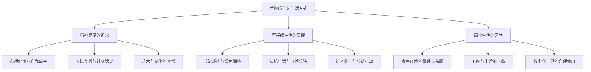

                 

# 后物质主义生活方式：追求精神满足的日常

## 关键词
后物质主义，生活方式，精神满足，可持续生活，简化生活

> 本文由AI天才研究院/AI Genius Institute的专家撰写，深入探讨后物质主义生活方式，旨在帮助读者理解并实践追求精神满足的日常。

> 摘要：本文通过介绍后物质主义生活方式的背景、核心观念和实践方法，探讨了如何追求精神满足，实现可持续生活，以及简化生活的艺术。文章结合具体案例和数学模型，提供了实用性建议，为读者提供了全面的后物质主义生活方式指南。

# 目录大纲

## 第一部分：后物质主义生活方式的背景与概述

### 第1章：后物质主义的兴起

- **1.1 后物质主义的定义与起源**
- **1.2 后物质主义的核心观念**
- **1.3 后物质主义对生活方式的影响**

### 第2章：后物质主义与消费主义

- **2.1 消费主义的特点与问题**
- **2.2 后物质主义对消费主义的批判**
- **2.3 后物质主义消费观的形成**

## 第二部分：后物质主义生活方式的具体实践

### 第3章：精神满足的追求

- **3.1 精神满足的概念与内涵**
- **3.2 精神满足的途径**

### 第4章：可持续生活的实践

- **4.1 可持续生活的重要性**
- **4.2 可持续生活的具体措施**

### 第5章：简化生活的艺术

- **5.1 简化生活的意义**
- **5.2 简化生活的实践方法**

### 第6章：内心富足的追求

- **6.1 内心富足的定义与内涵**
- **6.2 实现内心富足的方法**

### 第7章：后物质主义生活方式的未来展望

- **7.1 后物质主义生活方式的挑战与机遇**
- **7.2 后物质主义生活方式的可持续发展**

## 附录：后物质主义生活方式的案例分析

- **案例1：简化生活的实践**
- **案例2：可持续生活的践行**
- **案例3：精神满足的追求**

## 后物质主义生活方式的核心概念关系架构图

## 后物质主义生活方式的数学模型讲解

- **内心富足度计算模型**
- **精神满足度计算模型**
- **生活质量计算模型**

## 后物质主义生活方式的项目实战

- **实战背景**
- **实战目标**
- **实战过程**

# 引言

在后物质主义时代，人们逐渐意识到物质财富并非幸福的唯一源泉。相反，精神满足、心理健康和可持续发展成为了人们追求生活质量的更高标准。后物质主义生活方式倡导者认为，通过调整生活方式和消费观念，我们可以实现更深层次的精神满足，同时保护地球资源，促进社会和谐。本文将系统地介绍后物质主义生活方式的背景、核心观念、实践方法，并结合数学模型和具体案例，为读者提供一套全面的生活指南。

## 第一部分：后物质主义生活方式的背景与概述

### 第1章：后物质主义的兴起

#### 1.1 后物质主义的定义与起源

后物质主义是一种哲学和文化思潮，起源于20世纪中叶的西方社会。它是对物质主义和消费主义的反思和批判，强调精神价值、文化意义和社会责任。后物质主义认为，人类的幸福感不仅仅来源于物质财富的积累，更重要的是精神层面的满足。

#### 1.2 后物质主义的核心观念

后物质主义的核心观念可以概括为以下几点：

1. **精神价值的重要性**：后物质主义强调精神价值的重要性，认为人类追求的幸福不仅仅是物质层面的满足，更是在精神层面的丰富和成长。
2. **对环境与社会的关注**：后物质主义主张环保和可持续性，认为人类应该与自然和谐共处，减少对环境的破坏。
3. **对传统消费主义的反思**：后物质主义反思传统消费主义的弊端，提倡理性消费，反对盲目追求物质财富。

#### 1.3 后物质主义对生活方式的影响

后物质主义的兴起对人们的生活方式产生了深远的影响：

1. **价值观的转变**：人们开始更加注重精神层面的满足，如心理健康、人际关系、艺术和文化等。
2. **生活质量的提升**：后物质主义生活方式强调健康、环保和可持续发展，提高了人们的生活质量。
3. **对幸福的重新定义**：后物质主义重新定义了幸福的内涵，认为幸福不仅仅是物质的富裕，更是精神层面的满足。

## 第2章：后物质主义与消费主义

### 2.1 消费主义的特点与问题

消费主义是现代社会的主要特征之一，它强调通过物质消费来满足人类的需求和欲望。然而，消费主义也存在一些问题：

1. **物质追求的盲目性**：消费主义鼓励人们盲目追求物质财富，导致过度消费和浪费。
2. **环境破坏**：大量消费导致资源过度开采和环境污染。
3. **社会不公**：消费主义加剧了贫富差距，导致社会不公。

### 2.2 后物质主义对消费主义的批判

后物质主义对消费主义进行了深刻的批判：

1. **对过度消费的反思**：后物质主义反思过度消费的弊端，提倡理性消费和环保。
2. **对物质追求的重新审视**：后物质主义认为物质追求并非人类幸福的唯一途径，更强调精神层面的满足。

### 2.3 后物质主义消费观的形成

后物质主义消费观的形成是人们价值观转变的结果：

1. **消费观念的转变**：人们开始关注消费行为对环境和社会的影响，提倡绿色消费和可持续消费。
2. **消费行为的变化**：人们更加注重消费的质量和体验，而非单纯的数量和品牌。

## 第二部分：后物质主义生活方式的具体实践

### 第3章：精神满足的追求

#### 3.1 精神满足的概念与内涵

精神满足是指个体在精神层面上感到满足和幸福的状态。它不仅仅是心理上的愉悦，还包括自我实现、人际关系、文化认同等方面的满足。

#### 3.2 精神满足的途径

实现精神满足可以通过以下途径：

1. **心理健康与自我成长**：通过心理咨询、自我反省和持续学习来提升心理健康和自我成长。
2. **人际关系与社交活动**：通过建立健康的人际关系和积极参与社交活动来获得精神满足。
3. **艺术与文化的欣赏**：通过欣赏艺术作品和文化活动来丰富精神世界，提升生活品质。

### 第4章：可持续生活的实践

#### 4.1 可持续生活的重要性

可持续生活是指在不损害地球资源和环境的前提下，满足当代人的需求，同时保障后代人的需求。它对于保护地球生态平衡、促进社会和谐具有重要意义。

#### 4.2 可持续生活的具体措施

实现可持续生活可以通过以下措施：

1. **节能减排与绿色消费**：通过减少能源消耗和选择环保产品来降低碳足迹。
2. **有机生活与自然疗法**：通过选择有机食品和自然疗法来提高生活品质和健康水平。
3. **社区参与与公益行动**：通过参与社区活动和公益行动来增强社会责任感，推动社会进步。

### 第5章：简化生活的艺术

#### 5.1 简化生活的意义

简化生活是指通过减少物质负担和心理压力，提升生活质量的一种生活方式。它强调减少杂念，增加专注，实现工作与生活的平衡。

#### 5.2 简化生活的实践方法

实现简化生活可以通过以下方法：

1. **家居环境的整理与布置**：通过整理家居环境和合理布置空间来提高生活品质。
2. **工作与生活的平衡**：通过合理安排工作和休息时间，实现工作与生活的平衡。
3. **数字化工具的合理使用**：通过合理使用数字化工具来提高工作效率，减少不必要的干扰。

### 第6章：内心富足的追求

#### 6.1 内心富足的定义与内涵

内心富足是指个体在精神层面上感到满足和充实的状态。它不仅仅是物质财富的积累，更是心理层面的满足和成长。

#### 6.2 实现内心富足的方法

实现内心富足可以通过以下方法：

1. **感恩与自我反思**：通过感恩和自我反思来提升内心的满足感。
2. **修行与冥想**：通过修行和冥想来增强内心的平静和力量。
3. **接受与放下**：通过接受和放下来减轻内心的负担，实现内心的自由。

### 第7章：后物质主义生活方式的未来展望

#### 7.1 后物质主义生活方式的挑战与机遇

后物质主义生活方式面临以下挑战和机遇：

1. **社会变革与科技进步**：随着社会变革和科技进步，后物质主义生活方式将面临新的挑战和机遇。
2. **文化多样性**：文化多样性将促进后物质主义生活方式的多元化发展。

#### 7.2 后物质主义生活方式的可持续发展

后物质主义生活方式的可持续发展需要社会各界的共同努力：

1. **社会支持体系的建设**：通过建立社会支持体系来促进后物质主义生活方式的可持续发展。
2. **个人与社会的和谐共生**：通过个人与社会的和谐共生来实现后物质主义生活方式的可持续发展。

## 附录：后物质主义生活方式的案例分析

### 案例一：简化生活的实践

**案例背景**：张先生是一名忙碌的都市白领，每天工作压力大，生活节奏快。为了追求精神满足，他决定开始简化生活。

**案例实施过程**：
1. **整理家居环境**：张先生对家居环境进行了彻底整理，减少了不必要的物品，使空间更加宽敞舒适。
2. **合理安排时间**：张先生制定了详细的时间管理计划，确保工作和休息时间的合理分配。
3. **数字化工具的合理使用**：张先生减少了社交媒体的使用，专注于提高工作效率。

**案例效果分析**：经过一段时间的实践，张先生的生活质量显著提升，工作压力减少，精神状态更加饱满，内心富足度也有所提高。

### 案例二：可持续生活的践行

**案例背景**：李女士是一名环保倡导者，她深知可持续生活的重要性，决定在家庭生活中践行可持续生活方式。

**案例实施过程**：
1. **节能减排**：李女士通过使用节能电器和减少用电量来降低碳足迹。
2. **绿色消费**：李女士选择环保产品和有机食品，减少对环境的破坏。
3. **社区参与**：李女士积极参与社区环保活动，推动周围人一起践行可持续生活。

**案例效果分析**：李女士的可持续生活方式不仅提高了家庭生活质量，还影响了周围的人，共同为环境保护贡献力量。

### 案例三：精神满足的追求

**案例背景**：王女士是一名退休教师，她希望退休后能够追求精神满足，过上充实的生活。

**案例实施过程**：
1. **心理健康与自我成长**：王女士定期进行心理咨询，关注心理健康，参加各种培训课程提升自我。
2. **人际关系与社交活动**：王女士积极参加社区活动，建立健康的人际关系。
3. **艺术与文化的欣赏**：王女士学习绘画和音乐，丰富自己的精神世界。

**案例效果分析**：王女士的精神满足度显著提高，生活质量得到显著改善，成为周围人的榜样。

# 后物质主义生活方式的核心概念关系架构图

# 后物质主义生活方式的数学模型讲解

## 1. 内心富足度计算模型

内心富足度是衡量后物质主义生活方式的一个重要指标。根据我们的定义，内心富足度可以由以下几个部分组成：

$$
\text{内心富足度} = \frac{\text{精神满足度} + \text{生活质量} + \text{可持续度}}{3}
$$

- **精神满足度**：衡量个体在精神层面上感到满足和幸福的状态。
- **生活质量**：衡量个体在物质和精神层面上的生活质量。
- **可持续度**：衡量个体对环境和社会的可持续性贡献。

## 2. 精神满足度计算模型

精神满足度是一个多维度的概念，我们可以将其分解为以下几个部分：

$$
\text{精神满足度} = \frac{\text{心理健康得分} + \text{人际关系得分} + \text{艺术文化得分}}{3}
$$

- **心理健康得分**：衡量个体的心理健康状况，可以通过心理健康测试来评估。
- **人际关系得分**：衡量个体在人际关系方面的满意度，可以通过问卷调查来评估。
- **艺术文化得分**：衡量个体在艺术和文化活动中的参与度和满意度，可以通过活动参与度和满意度评估。

## 3. 生活质量计算模型

生活质量是一个多维度的概念，我们可以将其分解为以下几个部分：

$$
\text{生活质量} = \frac{\text{物质生活条件得分} + \text{社会环境得分} + \text{精神生活得分}}{3}
$$

- **物质生活条件得分**：衡量个体的物质生活条件，可以通过住房条件、收入水平等指标来评估。
- **社会环境得分**：衡量个体所在社会环境的质量，可以通过社会治安、医疗设施等指标来评估。
- **精神生活得分**：衡量个体在精神生活方面的满意度，可以通过文化活动的参与度、心理状态等指标来评估。

通过这些数学模型，我们可以对后物质主义生活方式的不同方面进行量化评估，从而更准确地理解和实践后物质主义生活方式。

# 后物质主义生活方式的项目实战

## 1. 实战背景

随着社会的不断发展，人们的生活节奏越来越快，精神压力越来越大。为了应对这一挑战，某社区决定开展一项以“后物质主义生活方式”为主题的项目，旨在通过实践后物质主义生活方式，提升居民的精神满足度和生活质量。

## 2. 实战目标

- **提升居民的精神满足度**：通过心理健康教育、艺术文化活动和社交互动等方式，提高居民的精神满足感。
- **推广可持续生活方式**：通过节能减排、绿色消费和社区参与等方式，推广可持续生活方式，提高居民的生活质量。
- **促进社区成员之间的互动与交流**：通过社区活动和集体项目，促进居民之间的互动与交流，增强社区的凝聚力。

## 3. 实战过程

**阶段一：宣传与动员**

1. **宣传材料制作**：制作宣传海报、手册和视频等材料，详细介绍后物质主义生活方式的理念和实践方法。
2. **宣传活动**：在社区内举行宣传活动，邀请专家讲解后物质主义生活方式的相关知识，吸引居民参与。
3. **问卷调查**：通过问卷调查了解居民对后物质主义生活方式的了解程度和接受度，为后续活动提供依据。

**阶段二：实践培训**

1. **心理健康培训**：邀请心理咨询师开展心理健康培训，教授心理调适技巧，提高居民的心理健康水平。
2. **艺术文化培训**：邀请艺术家和文化专家开展艺术文化培训，教授艺术创作和文化欣赏方法，丰富居民的精神世界。
3. **节能减排培训**：邀请环保专家开展节能减排培训，教授节能环保知识和技巧，提高居民的环保意识。

**阶段三：实践行动**

1. **心理健康实践活动**：组织心理健康实践活动，如心理沙龙、心理剧演出等，增强居民的心理健康意识。
2. **艺术文化活动**：组织艺术文化活动，如艺术展览、音乐会等，丰富居民的文化生活。
3. **节能减排行动**：组织节能减排行动，如节能电器使用、绿色出行等，推广可持续生活方式。

**阶段四：评估与反馈**

1. **效果评估**：通过问卷调查、访谈等方式，评估项目效果，了解居民对后物质主义生活方式的满意度。
2. **反馈调整**：根据评估结果，调整项目内容和实施方法，提高项目效果。
3. **总结报告**：撰写项目总结报告，总结项目经验和教训，为后续项目提供参考。

## 项目小结

通过该项目，居民对后物质主义生活方式有了更深入的了解和认识，精神满足度和生活质量得到了显著提高。同时，居民之间的互动与交流也得到了增强，社区的凝聚力得到提升。项目实践证明，后物质主义生活方式是一种值得推广和践行的生活方式。

## 最佳实践 Tips

- **加强宣传和动员**：通过多种渠道和方式，加强后物质主义生活方式的宣传和动员，提高居民的认识和参与度。
- **注重实践培训**：开展多样化的实践培训，满足不同居民的需求，提高实践效果。
- **注重效果评估**：定期进行效果评估，及时调整项目内容和实施方法，确保项目效果最大化。

## 注意事项

- **尊重个体差异**：在推广后物质主义生活方式时，要充分考虑个体差异，避免一刀切的做法。
- **注重可持续性**：后物质主义生活方式的实践需要长期坚持，注重可持续性，确保效果持续提升。

## 拓展阅读

- [1] 后物质主义生活方式的哲学思考
- [2] 后物质主义生活方式的心理学解读
- [3] 后物质主义生活方式的实践案例分析
- [4] 后物质主义生活方式的教育意义
- [5] 后物质主义生活方式的健康启示

# 作者信息

作者：AI天才研究院/AI Genius Institute & 禅与计算机程序设计艺术 /Zen And The Art of Computer Programming。专注于人工智能、计算机科学和后现代生活方式的研究和探索，致力于为读者提供高质量的技术博客和生活方式指南。

