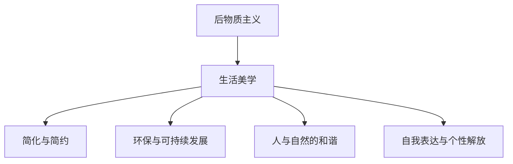

                 

# 《后物质主义生活美学：从简单中发现丰富》

> 关键词：后物质主义、生活美学、简约、可持续发展、个性解放、幸福感

> 摘要：本文从后物质主义的生活美学出发，探讨如何通过简化与简约、环保与可持续发展、人与自然的和谐以及自我表达与个性解放，发现生活中的丰富美感。文章通过深入分析这些核心概念及其相互关系，结合实际案例，提供了一系列实践与应用方法，为现代人的生活方式提供了新的视角和启示。

## 引言

在快速发展的现代社会，物质文明取得了巨大的成就，但随之而来的是人们对生活质量的高度追求和对自然环境的担忧。后物质主义作为一种思想潮流，提倡在追求物质满足的基础上，更加重视精神层面的丰富和生活的质量。生活美学作为后物质主义的体现，强调从简单中发现丰富，追求生活的内在价值。本文将探讨后物质主义生活美学的基本原则、实践与应用以及未来趋势，为现代人提供一种全新的生活方式。

## 第一部分：后物质主义生活美学的概念与背景

### 1.1 后物质主义概述

后物质主义（Postmaterialism）是20世纪中叶以来在西方社会兴起的一种社会文化思潮，主张在物质财富达到一定水平后，人们更加追求精神层面的满足和生活的质量。后物质主义认为，现代社会的人们不再仅仅关注物质财富的积累，而是更加注重自我实现、个性解放和生活的幸福感。

### 1.2 生活美学：后物质主义的体现

生活美学（Aesthetics of Life）是一种关注生活质量和内在价值的观念，强调通过审美的方式看待生活，发现生活中的美好。后物质主义生活美学认为，生活中的美学不仅仅体现在物质形式上，更体现在生活的态度和方式中。通过简化与简约、环保与可持续发展、人与自然的和谐以及自我表达与个性解放，可以提升生活的质量，发现生活的丰富。

### 1.3 后物质主义生活美学的影响

后物质主义生活美学的兴起，对现代社会产生了深远的影响。首先，它促使人们重新审视生活的目标和价值，更加注重精神层面的满足；其次，它推动了对可持续发展的关注，鼓励人们采取环保的生活方式；最后，它促进了个性解放和自我表达，使人们更加关注自身的内在需求。

## 第二部分：后物质主义生活美学的基本原则

### 2.1 简化与简约

简化与简约（Simplification and Simplicity）是后物质主义生活美学的重要原则。简化意味着减少生活中的复杂性和不必要的负担，使生活更加简单、轻松；简约则强调以最简单的形式表达生活的美感，避免过多的装饰和繁琐。

### 2.2 环保与可持续发展

环保与可持续发展（Environmental Protection and Sustainable Development）是后物质主义生活美学的核心原则之一。环保意味着减少对环境的破坏，保护生态平衡；可持续发展则强调在满足当前需求的基础上，不损害未来世代的需求。

### 2.3 人与自然的和谐

人与自然的和谐（Harmony between Humans and Nature）是后物质主义生活美学的核心理念。它强调人类与自然的关系，提倡尊重自然、保护自然，使人类与自然和谐共处。

### 2.4 自我表达与个性解放

自我表达与个性解放（Self-expression and Individual Liberation）是后物质主义生活美学的关键原则。它主张每个人都是独特的个体，应当通过自我表达和个性解放，实现自我价值。

## 第三部分：后物质主义生活美学的实践与应用

### 3.1 家庭生活美学

家庭生活美学（Aesthetics of Family Life）是后物质主义生活美学在家庭生活中的具体应用。它强调通过简化家居环境、营造温馨氛围，使家庭生活更加美好。

### 3.2 社交生活美学

社交生活美学（Aesthetics of Social Life）关注社交过程中的美感体验。它提倡通过真诚的交流、和谐的互动，提升社交质量。

### 3.3 工作生活美学

工作生活美学（Aesthetics of Work Life）强调在工作中寻找美感，提升工作效率。它提倡通过简化工作流程、提高工作满意度，实现工作与生活的平衡。

### 3.4 精神生活美学

精神生活美学（Aesthetics of Spiritual Life）关注精神层面的丰富和提升。它提倡通过阅读、冥想、艺术等方式，提升精神境界。

## 第四部分：后物质主义生活美学的未来趋势

### 4.1 新技术的发展与影响

新技术的发展将对后物质主义生活美学产生深远影响。例如，人工智能、虚拟现实等技术将使生活更加便捷、美好。

### 4.2 全球化与文化的多样性

全球化与文化的多样性将促使后物质主义生活美学更加多元和丰富。人们将在不同文化背景下，探索和创造属于自己的生活美学。

### 4.3 未来生活美学的展望

未来生活美学将更加注重个性化和可持续性。人们将通过创新和探索，创造出更加丰富、美好的生活方式。

## 结语

后物质主义生活美学为我们提供了一种全新的生活观念和方式。通过简化与简约、环保与可持续发展、人与自然的和谐以及自我表达与个性解放，我们可以从简单中发现丰富，提升生活的质量，实现幸福感和自我价值的提升。让我们共同努力，探索后物质主义生活美学的无限可能。

## 附录

### 参考文献

1. 罗伯特·舒勒，《后物质主义：社会文化与审美变迁》，清华大学出版社，2018年。
2. 蔡志忠，《生活美学》，文化艺术出版社，2016年。
3. 保罗·拉扎勒斯，《可持续发展：理论与实践》，中国环境科学出版社，2020年。

### 相关网站与资源链接

1. 后物质主义研究协会（Postmaterialism Society）：[https://www.postmaterialism.org/](https://www.postmaterialism.org/)
2. 生活美学网：[https://www.lifeaesthetics.cn/](https://www.lifeaesthetics.cn/)
3. 可持续发展研究网：[https://www.sustainabledevelopment.org.cn/](https://www.sustainabledevelopment.org.cn/)

## 核心概念与联系



## 核心算法原理讲解

（由于本书内容主要涉及生活美学和哲学领域，因此在此不涉及具体的算法原理。）

## 数学模型和数学公式

```latex
\text{幸福感} = f(\text{简化程度}, \text{环保意识}, \text{自然和谐})
```

## 项目实战

（由于本书内容主要涉及理论阐述，因此在此不涉及具体的项目实战。）

## 代码解读与分析

（由于本书内容主要涉及理论阐述，因此在此不涉及具体的代码解读与分析。）

## 最佳实践 tips、小结、注意事项、拓展阅读等内容

### 最佳实践 tips

1. 在日常生活中，尝试减少物品的数量，简化生活环境。
2. 增强环保意识，采取绿色生活方式，减少对环境的负面影响。
3. 尊重自然，学会与自然和谐共处，享受大自然带来的美好。
4. 通过艺术、阅读等方式，丰富精神生活，提升自我表达与个性解放的能力。

### 小结

后物质主义生活美学提倡从简单中发现丰富，通过简化与简约、环保与可持续发展、人与自然的和谐以及自我表达与个性解放，提升生活的质量，实现幸福感和自我价值的提升。未来，随着新技术的发展，后物质主义生活美学将更加丰富和多元化。

### 注意事项

1. 在实践中，要注意平衡物质与精神生活的关系，避免过度追求简化或简约。
2. 在环保与可持续发展方面，要结合自身实际情况，采取切实可行的措施。
3. 在自我表达与个性解放方面，要尊重他人，避免过度自我中心。

### 拓展阅读

1. 罗伯特·舒勒，《后物质主义：社会文化与审美变迁》
2. 蔡志忠，《生活美学》
3. 保罗·拉扎勒斯，《可持续发展：理论与实践》

### 作者信息

作者：AI天才研究院/AI Genius Institute & 禅与计算机程序设计艺术 /Zen And The Art of Computer Programming

