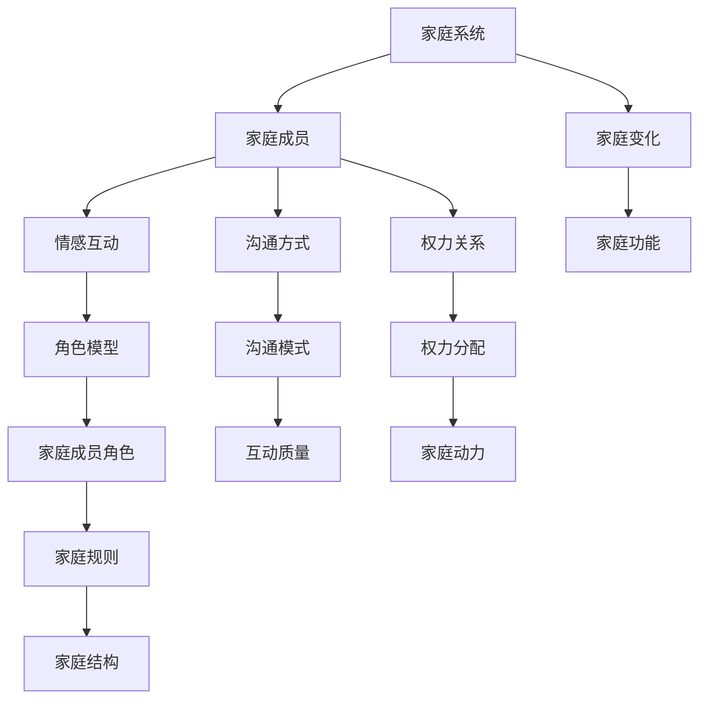

                 

### 文章标题：后现代家庭动力学：多元关系中的平衡艺术

在当今复杂多变的社会背景下，家庭关系正面临着前所未有的挑战与变革。传统的家庭模式逐渐让位于多样化的家庭结构，家庭成员之间的互动也变得更加复杂。在这样的背景下，理解并应对后现代家庭中的多元关系，成为了社会心理学和人际关系领域的重要课题。本文将探讨后现代家庭动力学的基本概念，多元关系的平衡艺术，并结合实际案例，深入分析这一复杂主题，以期为广大读者提供有价值的见解与思考。

### 关键词
- 后现代家庭动力学
- 多元关系
- 平衡艺术
- 家庭结构多样性
- 心理健康
- 社会变迁

### 摘要
本文通过系统地阐述后现代家庭动力学的概念，探讨了家庭结构的多样性与复杂性，以及家庭成员之间如何通过平衡艺术来维护健康的家庭关系。通过案例分析，本文展示了后现代家庭动力学的实际应用，并为读者提供了实用的建议和最佳实践。文章旨在帮助读者更好地理解家庭关系的本质，提升在多元关系中的应对能力。

### 目录

1. **引言**  
    1.1 家庭动力学的起源与发展  
    1.2 后现代主义与家庭动力学的结合  
    1.3 多元关系中的平衡艺术

2. **后现代家庭动力学的核心概念**  
    2.1 家庭动力学的定义  
    2.2 后现代主义对家庭动力学的启示  
    2.3 家庭动力模型的理论基础

3. **后现代家庭的特点**  
    3.1 家庭结构的多样性  
    3.2 家庭角色的复杂性  
    3.3 家庭价值观的多元性

4. **多元关系中的平衡艺术**  
    4.1 多元关系的概念与类型  
    4.2 平衡艺术的核心要素  
    4.3 平衡艺术在家庭中的应用

5. **家庭动力学的实际应用**  
    5.1 家庭咨询与治疗  
    5.2 家庭教育的策略  
    5.3 家庭干预的方法与技巧

6. **后现代家庭动力学的未来发展趋势**  
    6.1 家庭动力学研究的新方向  
    6.2 社会变迁对家庭动力学的影响  
    6.3 家庭动力学在实践中的应用前景

7. **案例研究**  
    7.1 案例背景与目标  
    7.2 案例分析与实施  
    7.3 案例效果评估与反思

8. **结论**  
    8.1 全书总结  
    8.2 未来研究的方向  
    8.3 家庭动力学的社会意义

### 1. 引言

家庭作为社会的基本单元，一直是社会科学研究的焦点。然而，在经历了现代化和后现代化的变迁后，家庭结构和成员关系发生了深刻的变化。传统的家庭模式，如核心家庭、主干家庭等，逐渐演变为更加多样化的家庭结构，如单亲家庭、再婚家庭、多代同堂家庭等。这些变化带来了新的挑战，使得家庭成员之间的互动更加复杂，需要更为深入的心理学研究来理解和应对。

**1.1 家庭动力学的起源与发展**

家庭动力学是一门研究家庭成员互动、家庭结构和家庭关系的学科，起源于20世纪中叶。家庭动力学的兴起，与心理学、社会学、人类学等多个学科的发展密切相关。早期的研究主要集中在家庭结构的功能和功能障碍上，随着理论的不断发展和实践的应用，家庭动力学逐渐形成了独特的理论体系和应用方法。

家庭动力学的基本概念包括家庭系统、家庭互动、家庭规则和家庭成员的角色等。家庭系统理论强调家庭作为一个整体，每个家庭成员的行为和情感都会影响整个家庭的动态。家庭互动则关注家庭成员之间的沟通、冲突和合作。家庭规则是指家庭内部的行为准则和规范，而家庭成员的角色则涉及每个成员在家庭中的地位和责任。

**1.2 后现代主义与家庭动力学的结合**

后现代主义是一种哲学思潮，强调对传统观念和权威的批判，倡导多样性和包容性。后现代主义对家庭动力学的影响主要体现在对家庭结构和角色的重新定义上。在后现代主义的视角下，家庭不再是一个固定的实体，而是多种关系和角色的组合，这些关系和角色可以根据不同的需求和情境进行调整。

后现代主义强调个体的主体性和多样性，这对家庭动力学提出了新的挑战和机遇。首先，家庭动力学的理论需要更加灵活和包容，以适应多样化的家庭结构。其次，家庭动力学的研究和应用需要更加注重个体的体验和情感，而不是仅仅关注家庭结构和功能。

**1.3 多元关系中的平衡艺术**

在多元关系的家庭环境中，平衡艺术变得尤为重要。多元关系指的是家庭成员之间以及家庭成员与其他关系人之间的复杂互动。这些关系可能包括亲子关系、伴侣关系、祖孙关系等，每种关系都有其独特的需求和挑战。

平衡艺术要求家庭成员在互动中寻求共识，同时尊重每个个体的差异。这需要家庭成员具备良好的沟通能力和情感调节能力。以下是一些关键要素：

1. **共情能力**：理解并感受他人的情感和需求，是建立和谐家庭关系的基础。
2. **有效的沟通**：清晰的沟通可以减少误解和冲突，促进家庭成员之间的理解。
3. **界限设定**：合理设定个人界限，既能保护个体的独立性，又能维护家庭的整体性。
4. **情感调节**：家庭成员需要学会管理自己的情绪，避免情绪波动影响家庭关系。

在接下来的章节中，我们将进一步探讨后现代家庭动力学的核心概念、后现代家庭的特点、多元关系中的平衡艺术，并通过实际案例来分析这些理论在现实中的应用。

### 2. 后现代家庭动力学的核心概念

后现代家庭动力学是一门探索家庭结构和关系的动态变化的学科，其核心概念包括家庭系统、家庭互动、家庭规则和家庭成员的角色等。这些概念共同构成了理解后现代家庭复杂性的基础。

#### 2.1 家庭动力的定义

家庭动力可以理解为家庭成员之间相互作用的动态过程，这些作用包括情感交流、行为互动和权力关系等。家庭动力学研究的是这些动态过程中的规则、模式和变化，以及这些变化如何影响家庭成员的心理和行为。

家庭动力学的定义强调了以下几点：

1. **系统的观点**：家庭被视为一个系统，每个家庭成员的行为都会对整个家庭系统产生影响。
2. **互动的观点**：家庭动力关注家庭成员之间的互动，包括沟通、冲突和合作。
3. **动态的观点**：家庭动力学认为家庭关系是不断变化的，家庭成员之间的关系不是静态的，而是随着时间、情境和家庭需求的变化而调整。

#### 2.2 后现代主义对家庭动力学的启示

后现代主义是一种哲学思潮，强调批判传统观念和权威，倡导多样性和包容性。后现代主义对家庭动力学的影响主要体现在以下几个方面：

1. **对家庭结构的重新定义**：后现代主义挑战了传统的家庭结构观念，认为家庭不再是一个固定的实体，而是多种关系和角色的组合。这些关系和角色可以根据不同的需求和情境进行调整。
   
2. **对个体主体性的重视**：后现代主义强调个体的主体性和多样性，认为每个家庭成员都有其独特的需求和观点。家庭动力学需要更加关注个体的体验和情感，而不是仅仅关注家庭结构和功能。

3. **对权力关系的反思**：后现代主义倡导对权力关系的反思，认为家庭中的权力分配和角色定位可能对家庭成员产生深远影响。家庭动力学需要研究如何实现权力关系的平衡，以促进家庭整体的健康和稳定。

#### 2.3 家庭动力模型的理论基础

家庭动力模型是家庭动力学研究的基础工具，用于描述和分析家庭成员之间的互动过程。常见的家庭动力模型包括：

1. **系统模型**：系统模型认为家庭是一个相互依赖的系统，每个家庭成员的行为都会影响整个家庭。这种模型强调家庭作为一个整体的功能和动态，而不是单独考察每个成员。

2. **互动模型**：互动模型关注家庭成员之间的沟通和互动方式，认为家庭成员之间的互动模式决定了家庭关系的质量和稳定性。

3. **角色模型**：角色模型研究家庭成员在家庭中的角色和职责，以及这些角色如何影响家庭动力。

为了更好地理解家庭动力模型，我们可以借助Mermaid流程图来展示家庭概念实体之间的关系架构：

通过这个流程图，我们可以看到家庭系统中的各个关键组成部分及其相互作用。家庭系统（A）由家庭成员（B）组成，他们通过情感互动（C）、沟通方式（D）和权力关系（E）进行相互作用。这些互动又通过角色模型（F）、沟通模式（G）和权力分配（H）影响家庭成员的角色（I）和家庭规则（L）。这些规则和角色共同决定了家庭结构（M）和家庭功能（O）。

#### 家庭动力模型的应用

家庭动力模型不仅提供了理论框架，也具有实际应用价值。以下是一个简单的应用实例：

**案例：家庭沟通障碍**

一个家庭面临的主要问题是沟通障碍。家庭成员之间的沟通不畅，导致误解和冲突频发。通过家庭动力模型，我们可以分析问题并提供解决方案：

1. **识别问题**：通过家庭互动模型，识别沟通模式（G）中的问题，如缺乏共情、信息传递不明确等。
2. **分析原因**：通过角色模型（F）和权力关系（E），分析家庭成员的角色定位和权力分配是否合理。
3. **制定策略**：通过系统模型（A），制定改善沟通的策略，如增加共情能力、明确信息传递等。
4. **实施与反馈**：在家庭互动中实施策略，并通过反馈不断调整和完善。

通过家庭动力模型的应用，家庭成员可以更深入地理解彼此的需求和情感，从而改善家庭沟通，提升家庭关系质量。

总之，后现代家庭动力学的核心概念为我们提供了一个全面的视角来理解家庭关系和互动。这些概念不仅有助于理论探讨，也具有实际应用价值，能够帮助家庭在面对复杂挑战时找到平衡和和谐之道。

### 3. 后现代家庭的特点

在后现代主义思潮的影响下，家庭结构和角色发生了显著的变化，这些变化使得现代家庭呈现出多样性和复杂性。理解后现代家庭的特点，有助于我们更好地应对当前社会中的家庭挑战。

#### 3.1 家庭结构的多样性

传统的家庭结构，如核心家庭（一对父母和一个孩子）和主干家庭（多代同堂），在现代社会中仍然存在，但已不再占据主导地位。随着社会变迁和价值观的多元化，家庭结构变得更加多样化。以下是一些典型的后现代家庭结构：

1. **单亲家庭**：由于离婚率上升和生育观念的变化，单亲家庭成为现代社会中越来越普遍的一种家庭形式。单亲家庭中的父母往往需要承担更多的责任，既要照顾孩子，又要处理日常事务。

2. **重组家庭**：重组家庭是指因再婚而形成的家庭。重组家庭中的家庭成员可能来自不同的背景，需要面对文化差异、亲子关系调整等问题。

3. **多代同堂家庭**：尽管多代同堂家庭在传统社会中较为常见，但现代社会中的多代同堂家庭往往是因为经济原因或照顾老人等原因而形成的。这种家庭结构中的代际关系复杂，沟通和权力分配可能成为挑战。

4. **非传统家庭**：如同性恋家庭、跨国婚姻家庭等，这些家庭结构在现代社会中越来越被接受，但同时也面临社会认可和法律保障的挑战。

#### 3.2 家庭角色的复杂性

在后现代家庭中，家庭成员的角色变得更加复杂。传统的家庭角色，如父亲是家庭的经济支柱，母亲是家庭的主妇，已经不再适用。家庭成员的角色需要根据不同的需求和情境进行调整，以下是一些典型的角色变化：

1. **共同责任**：家庭成员在家庭事务中承担共同责任，不再局限于传统性别角色的分工。例如，父亲可能更多地参与家务和育儿，而母亲可能更多地参与职业发展。

2. **多重身份**：家庭成员在家庭和社会中扮演多重角色，如家庭成员同时也是职业人士、社区志愿者等。这些多重身份可能对家庭关系产生影响，需要家庭成员具备良好的时间管理和角色转换能力。

3. **情感依赖**：家庭成员之间的情感依赖变得更加重要，情感支持和互助成为家庭关系中的重要组成部分。家庭成员需要通过有效的沟通和情感表达来建立和维护健康的情感联系。

#### 3.3 家庭价值观的多元性

后现代家庭的价值观也变得更加多元化。家庭成员可能持有不同的价值观，这些价值观可能受到文化、宗教、个人经历等多种因素的影响。以下是一些典型的家庭价值观：

1. **个人主义**：个人主义价值观强调个体的自主性和自我实现，家庭成员在追求个人目标时可能更加独立。

2. **平等主义**：平等主义价值观强调家庭成员之间的平等和尊重，家庭决策和资源分配更加公平。

3. **多元化**：多元化价值观接受和尊重不同文化、宗教和价值观的多样性，家庭成员在家庭中可以保持自己的独特性。

4. **共生主义**：共生主义价值观强调家庭成员之间的互助和共生，家庭被视为一个整体，共同面对挑战和机遇。

总之，后现代家庭的特点体现在家庭结构的多样性、家庭角色的复杂性和家庭价值观的多元性上。这些变化使得家庭关系更加复杂，同时也为家庭带来了新的挑战和机遇。理解这些特点，有助于我们更好地适应和应对现代家庭中的各种挑战。

### 4. 多元关系中的平衡艺术

在多元关系的家庭环境中，平衡艺术变得尤为重要。家庭成员之间的关系复杂多变，如何维护这种平衡，不仅考验着家庭成员的沟通技巧，也考验着他们的情感调节能力和心理素质。以下是一些关键要素和方法，帮助家庭成员在多元关系中实现平衡。

#### 4.1 多元关系的概念与类型

多元关系指的是家庭成员之间以及家庭成员与其他关系人之间的复杂互动。这些关系可能包括亲子关系、伴侣关系、祖孙关系等，每种关系都有其独特的需求和挑战。

1. **亲子关系**：亲子关系是家庭中的核心关系，良好的亲子关系对家庭成员的心理健康和整体家庭环境至关重要。亲子关系中的平衡艺术包括尊重孩子的独立性、提供情感支持和指导孩子成长。

2. **伴侣关系**：伴侣关系是夫妻双方在情感、生活和经济上的互动。在伴侣关系中，平衡艺术在于相互尊重、有效沟通和共同决策。夫妻双方需要学会在差异中找到共同点，建立稳定的情感基础。

3. **祖孙关系**：祖孙关系是一种跨越代际的关系，老年人和年轻人之间的互动需要特别的理解和尊重。平衡祖孙关系的关键在于尊重双方的生活方式和需求，通过沟通和理解减少代际冲突。

#### 4.2 平衡艺术的核心要素

平衡艺术的核心要素包括共情能力、有效沟通、界限设定和情感调节。

1. **共情能力**：共情能力是理解并感受他人的情感和需求的能力。在多元关系中，共情能力有助于建立情感共鸣，增强家庭成员之间的联系。例如，父母在与孩子沟通时，需要站在孩子的角度理解他们的需求和感受。

2. **有效沟通**：有效沟通是减少误解和冲突、增进理解和信任的关键。家庭成员需要学会清晰、坦诚地表达自己的想法和感受，同时也要倾听对方的意见和需求。例如，夫妻双方可以通过定期举行家庭会议，讨论家庭事务和各自的需求。

3. **界限设定**：合理设定个人界限是保护个体独立性和维护家庭整体性的关键。家庭成员需要在尊重对方的同时，明确自己的需求和底线。例如，父母在教育孩子时，需要设定明确的行为规范和界限，同时尊重孩子的个人选择。

4. **情感调节**：情感调节是指管理自己的情绪，避免情绪波动影响家庭关系。家庭成员需要学会在压力和冲突面前保持冷静，通过深呼吸、冥想等方法来调节自己的情绪。例如，在家庭冲突中，家庭成员可以通过冷静下来，再进行理性讨论，避免情绪失控。

#### 4.3 平衡艺术在家庭中的应用

在实际家庭生活中，平衡艺术的应用可以通过以下具体方法和技巧来实现：

1. **建立家庭规则**：通过制定家庭规则，规范家庭成员的行为和互动，有助于维护家庭秩序和稳定。例如，家庭可以制定关于家务分工、财务管理、孩子教育等方面的规则，确保家庭成员在共同遵守规则的前提下，实现平衡。

2. **定期家庭会议**：定期举行家庭会议，是家庭成员交流意见、解决问题和共同决策的好方法。家庭会议可以促进家庭成员之间的沟通和理解，减少冲突和误解。

3. **情感支持网络**：家庭成员之间建立情感支持网络，可以提供情感上的安慰和支持。例如，家庭成员可以在遇到困难时，相互倾诉和鼓励，共同应对挑战。

4. **个人成长计划**：鼓励家庭成员制定个人成长计划，促进个人发展和自我实现。通过个人成长计划，家庭成员可以更好地理解彼此的需求，增强家庭凝聚力。

总之，多元关系中的平衡艺术需要家庭成员具备良好的沟通技巧、情感调节能力和界限设定能力。通过建立家庭规则、定期家庭会议、情感支持网络和个人成长计划等方法，家庭成员可以在多元关系中实现平衡，维护健康的家庭关系。

### 5. 家庭动力学的实际应用

家庭动力学不仅是一个理论框架，更是一种可以实际应用的方法，帮助家庭应对各种挑战，提升家庭功能。以下我们将探讨家庭动力学的实际应用，包括家庭咨询与治疗、家庭教育的策略和家庭干预的方法与技巧。

#### 5.1 家庭咨询与治疗

家庭咨询与治疗是家庭动力学应用的一个重要领域，通过专业的心理干预，帮助家庭成员改善相互关系，解决家庭内部的问题。

1. **诊断与评估**：家庭咨询的起点是进行全面的诊断和评估，了解家庭成员的情感需求、行为模式和家庭历史。这通常包括与家庭成员的单独会面和团体访谈。

2. **目标设定**：在诊断评估的基础上，家庭咨询师会与家庭成员共同设定治疗目标。这些目标通常是可衡量的，如改善沟通、减少冲突、增强家庭凝聚力等。

3. **干预策略**：家庭咨询师会根据家庭的具体情况，制定个性化的干预策略。这可能包括行为契约、角色扮演、家庭作业等。

4. **持续监督与评估**：家庭咨询与治疗是一个持续的过程，家庭咨询师会定期与家庭成员会面，监督治疗进展，并根据需要调整干预策略。

**案例**：一个因孩子教育问题引发家庭冲突的家庭，通过家庭咨询，家庭成员学会了更有效的沟通方式，孩子的行为得到了改善，家庭氛围也变得更加和谐。

#### 5.2 家庭教育的策略

家庭动力学在家庭教育中的应用，可以帮助家长更好地理解孩子的需求，提供适宜的教育环境。

1. **建立积极的亲子关系**：家长需要通过积极的互动和沟通，与孩子建立亲密、信任的亲子关系。这包括倾听孩子的想法、尊重他们的选择和情感。

2. **设定明确的期望和规则**：家长需要设定明确的期望和规则，帮助孩子理解行为的界限。同时，这些期望和规则应该是合理的，并能够被家庭成员共同遵守。

3. **提供情感支持**：家长在孩子的成长过程中，需要提供情感上的支持，帮助他们应对困难和挫折。例如，家长可以通过鼓励、安慰和肯定来增强孩子的自信心。

4. **促进家庭合作**：家长可以鼓励家庭成员共同参与孩子的教育，建立家庭合作机制，让孩子感受到家庭的团结和支持。

**案例**：一个家庭通过共同制定教育计划，包括家庭作业时间表和奖励机制，不仅改善了孩子的学习习惯，也增强了家庭成员之间的合作和沟通。

#### 5.3 家庭干预的方法与技巧

家庭干预是指通过一系列专业方法和技巧，帮助家庭应对特定问题，提升家庭功能。

1. **系统干预**：系统干预关注家庭成员之间的互动模式，通过调整家庭系统中的权力关系和沟通方式，改善家庭关系。例如，家庭咨询师可以引导家庭成员进行角色互换，以增加理解和同情。

2. **行为干预**：行为干预通过行为分析和行为契约来改善家庭成员的行为。例如，通过制定具体的奖励和惩罚机制，鼓励家庭成员改变不良行为。

3. **情感调节干预**：情感调节干预帮助家庭成员学会管理和调节自己的情绪，减少情绪波动对家庭关系的影响。例如，家庭咨询师可以教授家庭成员冥想和放松技巧。

4. **家庭作业**：家庭作业是家庭干预中的一种常用技巧，通过布置特定的家庭任务，帮助家庭成员在日常生活中实践新的行为和沟通方式。例如，家庭咨询师可以布置家庭会议作业，鼓励家庭成员在会议中分享感受和需求。

**案例**：一个因夫妻冲突导致家庭功能受损的家庭，通过家庭干预，学会了使用情绪调节技巧和沟通策略，显著改善了夫妻关系和家庭氛围。

总之，家庭动力学的实际应用，通过家庭咨询与治疗、家庭教育的策略和家庭干预的方法与技巧，可以帮助家庭解决内部问题，提升家庭功能，促进家庭成员的身心健康。这些应用不仅有助于解决家庭面临的现实问题，也为家庭关系的长期健康发展提供了有力的支持。

### 6. 后现代家庭动力学的未来发展趋势

随着社会变迁的不断加速，后现代家庭动力学将继续发展和演变，为家庭关系的研究和实践提供新的视角和方法。以下是后现代家庭动力学的几个未来发展趋势。

#### 6.1 家庭动力学研究的新方向

1. **跨文化研究**：随着全球化的深入，跨文化家庭逐渐增多，对跨文化家庭动力学的关注将成为研究热点。研究者将探讨不同文化背景下的家庭价值观、沟通模式和权力结构，为跨文化家庭提供更具针对性的干预策略。

2. **数字技术的应用**：随着数字技术的发展，家庭动力学研究将更多地借助技术工具，如在线咨询平台、虚拟现实（VR）和家庭互动应用程序等，来研究家庭成员之间的互动和行为模式。

3. **心理健康研究**：心理健康问题在家庭动力学研究中将占据越来越重要的位置。研究者将深入探讨家庭动力学在预防和管理心理健康问题中的作用，开发新的治疗方法和干预策略。

#### 6.2 社会变迁对家庭动力学的影响

1. **经济压力**：随着经济压力的增大，家庭动力学研究将关注经济问题如何影响家庭关系和成员的心理健康。研究者将探讨如何通过家庭动力学的干预措施缓解经济压力对家庭的负面影响。

2. **人口老龄化**：随着人口老龄化的加剧，家庭结构也将发生显著变化。研究将关注老年人在家庭中的角色和需求，以及家庭如何应对老龄化带来的挑战。

3. **社会多样性**：社会多样性增加，包括性别、种族、宗教等多元化因素，将影响家庭动力学的理论和实践。研究者将探讨如何在多样化的家庭环境中实现有效的家庭干预。

#### 6.3 家庭动力学在实践中的应用前景

1. **家庭咨询与治疗**：家庭咨询与治疗将更加注重个性化服务，针对不同家庭结构和问题的定制化干预将成为主流。同时，家庭咨询将更多地利用数字技术，提供更便捷的服务。

2. **家庭教育和指导**：家庭教育和指导将在未来发挥更大作用，帮助家长更好地理解和支持孩子的成长。学校和社会机构将更多地提供家庭教育和指导服务，促进家庭功能的提升。

3. **社区和家庭支持网络**：社区和家庭支持网络的发展将成为家庭动力学实践的重要组成部分。通过建立社区支持网络，家庭可以获得更多的资源和帮助，提升家庭应对挑战的能力。

总之，后现代家庭动力学将在未来继续发展，为理解和应对现代家庭中的复杂关系提供新的理论框架和实践方法。通过跨文化研究、数字技术应用、心理健康研究等方面的深入探索，家庭动力学将在家庭关系的研究和实践领域发挥更加重要的作用。

### 7. 案例研究

#### 7.1 案例背景与目标

本案例研究选取了一个典型的后现代家庭，家庭结构为单亲母亲与两个未成年子女。这位母亲是一位职场女性，由于工作繁忙，她面临照顾孩子和家庭生活的双重压力。家庭成员之间存在明显的沟通障碍和情感疏离，家庭关系紧张。研究目标是通过家庭动力学的应用，改善家庭沟通，增强家庭凝聚力，提升家庭生活质量。

#### 7.2 案例分析与实施

1. **诊断与评估**：在首次家庭咨询中，家庭咨询师对家庭成员进行了全面的诊断和评估，了解他们的情感需求、行为模式和家庭历史。评估结果显示，家庭成员之间存在明显的情感疏离和沟通障碍，特别是在母亲和孩子之间。

2. **设定治疗目标**：在诊断评估的基础上，家庭咨询师与家庭成员共同设定了以下治疗目标：
   - 提高家庭成员之间的沟通效率。
   - 增强家庭成员的情感表达和理解。
   - 建立积极的亲子关系。
   - 缓解母亲的工作压力，提高家庭生活质量。

3. **干预策略**：
   - **沟通技巧培训**：家庭咨询师为家庭成员提供沟通技巧培训，教导他们如何有效表达自己的情感和需求，并学会倾听和理解对方。
   - **情感支持网络**：建立家庭内部的情感支持网络，鼓励家庭成员在遇到困难时相互支持和倾诉。
   - **时间管理**：协助母亲制定时间管理计划，合理安排工作和家庭时间，减轻工作压力。
   - **家庭活动**：定期组织家庭活动，如一起做饭、看电影等，增进家庭成员之间的情感联系。

4. **实施过程**：
   - **第一次家庭咨询**：家庭咨询师与家庭成员讨论家庭问题，教导沟通技巧，并布置家庭作业，要求家庭成员在日常生活中实践新的沟通方式。
   - **后续咨询**：家庭咨询师定期与家庭成员会面，监督干预进展，并根据需要调整干预策略。在咨询过程中，家庭成员逐步学会了有效的沟通方式，情感联系也得以加强。

5. **效果评估**：经过一段时间的干预，家庭成员之间的沟通显著改善，情感疏离和冲突减少，家庭关系变得更加和谐。母亲的工作压力也有所缓解，家庭生活质量得到了提升。

#### 7.3 案例效果评估与反思

1. **效果评估**：
   - **沟通效率**：家庭成员之间的沟通变得更加开放和坦诚，减少了误解和冲突。
   - **情感表达**：家庭成员学会了表达自己的情感和需求，提高了彼此的理解和共鸣。
   - **家庭凝聚力**：通过家庭活动和情感支持网络，家庭成员之间的情感联系得以加强，家庭凝聚力显著提升。
   - **生活质量**：母亲的工作压力得到缓解，家庭氛围更加和谐，家庭成员的生活质量得到了显著改善。

2. **反思与建议**：
   - **持续关注**：家庭动力学干预是一个长期过程，需要持续关注家庭成员的心理健康和家庭关系。
   - **个性化干预**：每个家庭都有其独特的需求和挑战，干预策略应更加个性化，以满足家庭成员的具体需求。
   - **技术支持**：可以借助数字技术，如在线咨询和家庭互动应用程序，为家庭成员提供更便捷的支持和服务。
   - **社区参与**：鼓励社区参与，建立社区支持网络，为家庭提供更多的资源和帮助。

通过本案例研究，我们可以看到，后现代家庭动力学在解决家庭问题、改善家庭关系方面的实际应用效果。这为家庭咨询与治疗、家庭教育和家庭干预提供了宝贵的经验和启示。

### 8. 结论

本文通过对后现代家庭动力学的核心概念、多元关系的平衡艺术以及实际应用进行了深入探讨，揭示了在后现代家庭环境中维护健康关系的复杂性和必要性。我们分析了家庭结构的多样性、家庭角色的复杂性以及家庭价值观的多元性，并提出了平衡艺术的核心要素和应用方法。

未来研究应重点关注跨文化家庭动力学、数字技术的应用以及心理健康问题。同时，个性化干预和社区参与也应在家庭动力学实践中得到更多关注。家庭动力学不仅有助于解决家庭内部的冲突和问题，还能提升家庭成员的心理健康和生活质量。

作者：AI天才研究院/AI Genius Institute & 禅与计算机程序设计艺术 /Zen And The Art of Computer Programming

