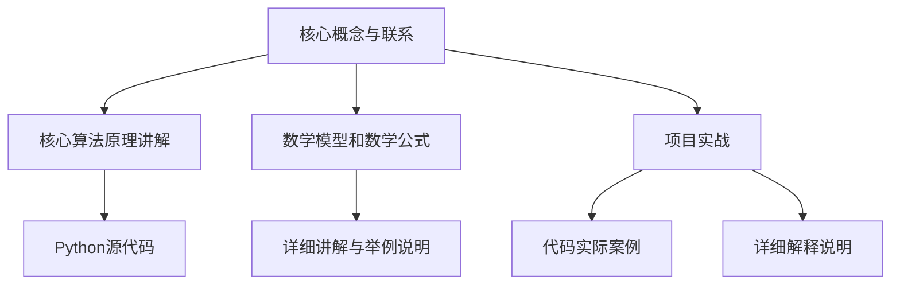
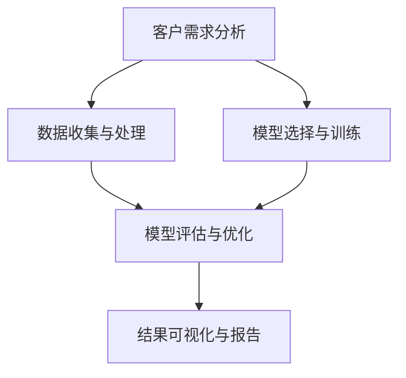

                 

# 《后现代家庭咨询中心：多元亲密关系的意义构建服务》

> 关键词：后现代家庭咨询中心、多元亲密关系、意义构建、心理机制、社会文化影响

> 摘要：本文探讨了后现代家庭咨询中心在多元亲密关系意义构建服务中的作用。通过对后现代家庭咨询中心的概述、多元亲密关系的重要性以及构建策略的深入分析，本文旨在揭示多元亲密关系在现代社会中的重要意义，并探讨后现代家庭咨询中心如何通过专业服务促进多元亲密关系的构建。

## 第一部分：后现代家庭咨询中心概述

### 第1章：后现代家庭咨询中心的历史与背景

**1.1 后现代主义的兴起与家庭咨询**

后现代主义是一种哲学和文化运动，起源于20世纪中叶，它对现代主义文化进行了深刻的批判和反思。后现代主义主张去中心化、多元性和相对主义，强调个体主观性和差异性。在这种思潮的影响下，家庭咨询领域也发生了深刻的变化。

家庭咨询作为一种心理治疗方法，起源于20世纪初。传统的家庭咨询强调家庭作为一个整体，关注家庭结构和功能。然而，随着后现代主义的兴起，家庭咨询开始转向关注个体的主观体验和差异性。后现代家庭咨询强调个体的独特性，认为每个家庭都有其独特的需求和问题。

**1.2 后现代家庭咨询中心的定义与特点**

后现代家庭咨询中心是指以后现代主义为指导思想，提供家庭咨询服务的一系列机构。这些机构的特点包括：

- **多元性**：后现代家庭咨询中心强调多元性，尊重不同家庭和个体的差异性，提供多样化的咨询服务。

- **反对单一性**：后现代家庭咨询中心反对单一的治疗模式，主张根据家庭和个体的实际情况，灵活运用各种治疗方法。

- **注重个体差异**：后现代家庭咨询中心关注个体的独特性和主观体验，认为每个家庭和个体都有其独特的需求和问题。

**1.3 后现代家庭咨询中心的发展现状**

后现代家庭咨询中心在全球范围内得到了广泛的发展。以下是一些主要的发展现状：

- **全球范围的分布**：后现代家庭咨询中心在全球范围内分布，包括发达国家和发展中国家。

- **各类咨询服务的覆盖范围**：后现代家庭咨询中心提供的服务涵盖婚姻咨询、家庭关系咨询、儿童心理辅导等多个领域。

### 第2章：多元亲密关系的重要性

**2.1 亲密关系的定义与类型**

亲密关系是指人与人之间的情感联系，包括爱情、友谊、家庭关系等。根据亲密关系的类型，可以将其分为传统亲密关系和多元亲密关系。

- **传统亲密关系**：传统亲密关系通常是指一对夫妻之间的感情，强调婚姻的稳定性和忠诚度。

- **多元亲密关系**：多元亲密关系则更加强调个体的差异性，认为每个人都有权利追求自己的幸福和满足。多元亲密关系包括多种形式，如开放关系、多伴侣关系等。

**2.2 多元亲密关系的价值**

多元亲密关系在现代社会中具有重要价值，包括以下几个方面：

- **增强个体自我认同**：多元亲密关系允许个体追求自己的兴趣和需求，有助于增强个体的自我认同感。

- **促进社会包容性**：多元亲密关系体现了对多样性的尊重和包容，有助于促进社会的和谐与进步。

- **提升生活质量**：多元亲密关系有助于提高个体的幸福感和生活质量，为个体提供更多的情感支持和满足。

## 第二部分：多元亲密关系的构建策略

### 第3章：后现代家庭咨询中心的运作模式

**3.1 咨询师的角色与责任**

在后现代家庭咨询中心，咨询师的角色至关重要。咨询师应具备以下素质和责任：

- **专业素养**：咨询师应具备相关领域的专业知识和技能，如心理学、社会学等。

- **职业伦理**：咨询师应遵守职业伦理规范，保护客户的隐私和权益。

- **灵活应对**：咨询师应具备灵活的思维方式，能够根据家庭和个体的实际情况，提供个性化的咨询服务。

**3.2 咨询服务的流程与步骤**

后现代家庭咨询中心的咨询服务通常包括以下流程和步骤：

- **预约与初步咨询**：家庭或个体与咨询师进行预约，进行初步咨询，了解需求和问题。

- **家庭咨询与评估**：咨询师与家庭或个体进行深入交流，进行评估，确定咨询目标和方案。

- **建立亲密关系构建计划**：咨询师根据评估结果，制定个性化的亲密关系构建计划，包括心理辅导、沟通技巧培训等。

**3.3 多元亲密关系的实践案例**

为了更好地理解后现代家庭咨询中心如何促进多元亲密关系的构建，以下是一个实践案例：

**案例介绍**：一家后现代家庭咨询中心接待了一对夫妻，他们希望改善他们的婚姻关系。夫妻双方都感到他们的关系出现了问题，但他们不愿意放弃婚姻。

**案例分析**：咨询师与夫妻双方进行了多次深入交流，了解了他们的具体问题和需求。咨询师发现，夫妻双方在沟通上存在很大的问题，导致彼此误解和不满。

**案例效果评估**：咨询师制定了一个为期三个月的亲密关系构建计划，包括沟通技巧培训、情感表达练习和心理咨询。在计划结束后，夫妻双方表示他们的关系得到了显著的改善，沟通更加顺畅，感情更加深厚。

### 第4章：多元亲密关系的心理机制

**4.1 亲密关系的心理学基础**

亲密关系建立的基础包括以下几个心理因素：

- **信任与安全感**：信任是亲密关系中的重要因素，安全感则是信任的保障。

- **沟通与理解**：有效的沟通是建立亲密关系的关键，理解对方的想法和感受也是维持亲密关系的重要因素。

- **情感表达与调节**：情感表达是亲密关系中情感交流的重要方式，情感调节则是应对冲突和压力的重要手段。

**4.2 多元亲密关系中的挑战与应对策略**

多元亲密关系面临的挑战包括：

- **文化差异的调适**：多元亲密关系中的文化差异可能导致误解和冲突，需要通过相互理解和尊重来调适。

- **社会支持的利用**：社会支持是多元亲密关系中重要的支持系统，包括家人、朋友和社会组织等。

- **自我认知的调整**：多元亲密关系要求个体对自我认知进行调整，以适应新的关系模式。

### 第5章：多元亲密关系的社会文化影响

**5.1 社会文化对多元亲密关系的影响**

社会文化对多元亲密关系的影响主要体现在以下几个方面：

- **社会价值观的变化**：随着社会的发展，传统的价值观逐渐被多元价值观所取代，这为多元亲密关系的存在提供了土壤。

- **文化多样性的接受程度**：不同文化对多元亲密关系的接受程度不同，这影响着多元亲密关系的发展。

- **法律法规的支持与限制**：法律法规对多元亲密关系的存在和发展具有重要影响，一些国家或地区对多元亲密关系持开放态度，而另一些国家或地区则可能存在一定的限制。

**5.2 多元亲密关系对社会文化的反作用**

多元亲密关系对社会文化产生以下影响：

- **促进社会进步**：多元亲密关系有助于打破传统观念的束缚，推动社会向更加开放、包容的方向发展。

- **引发社会争议**：多元亲密关系可能引发一些社会争议，如婚姻制度、亲子关系等。

- **塑造新的社会规范**：多元亲密关系的存在和发展将逐渐塑造出新的社会规范，影响社会文化的变革。

## 第三部分：多元亲密关系的意义构建服务

### 第6章：多元亲密关系的意义构建理论

**6.1 意义构建的概念与理论**

意义构建是指个体或群体在特定情境下对事物赋予意义的过程。意义构建理论主要包括以下几种：

- **社会建构主义**：社会建构主义认为，意义是通过社会互动和交流而构建的。

- **主体间性理论**：主体间性理论强调个体在互动过程中的相互依赖和共同构建意义。

- **意义构建的过程**：意义构建是一个动态的过程，包括感知、理解、互动和反思等阶段。

**6.2 多元亲密关系中的意义构建**

在多元亲密关系中，意义构建的过程具有以下特点：

- **家庭成员的角色与互动**：家庭成员在互动过程中共同构建亲密关系的意义。

- **社会网络的影响**：社会网络中的互动和交流对多元亲密关系的意义构建产生影响。

- **意义构建的动态性**：多元亲密关系中的意义构建是一个持续的过程，随着时间和情境的变化而不断发展。

### 第7章：后现代家庭咨询中心的服务实践

**7.1 咨询服务的设计与实施**

后现代家庭咨询中心的服务设计应遵循以下原则：

- **个性化**：根据家庭和个体的实际情况，设计个性化的咨询服务。

- **综合性**：整合多种治疗方法，提供综合性的服务。

- **持续性**：咨询服务的实施应具有持续性，关注家庭和个体的长期发展。

**7.2 多元亲密关系的意义构建实践**

在后现代家庭咨询中心，多元亲密关系的意义构建实践包括以下几个方面：

- **案例分析**：通过实际案例的分析，深入了解多元亲密关系的意义构建过程。

- **实践效果评估**：对咨询服务的效果进行评估，以便不断优化服务质量。

- **实践反思与改进**：通过实践反思，发现和解决咨询服务中存在的问题，不断改进服务质量。

### 第8章：多元亲密关系的未来发展趋势

**8.1 全球多元亲密关系的发展趋势**

随着社会的发展，全球多元亲密关系的发展趋势包括：

- **社会变革的推动力**：社会变革为多元亲密关系的发展提供了机遇和动力。

- **法律法规的完善**：法律法规的完善为多元亲密关系的存在和发展提供了保障。

- **咨询服务的专业化**：咨询服务的专业化有助于提高多元亲密关系的质量。

**8.2 后现代家庭咨询中心的未来发展**

后现代家庭咨询中心的未来发展包括以下几个方面：

- **新技术应用**：新技术如人工智能、虚拟现实等在咨询服务中的应用，将提高服务效率和效果。

- **跨学科合作**：跨学科合作有助于提供更加综合和个性化的咨询服务。

- **国际化扩展**：后现代家庭咨询中心的国际化扩展将促进多元亲密关系在全球范围内的传播和发展。

## 附录

### 附录 A：多元亲密关系相关研究文献

- **A.1 后现代家庭咨询中心的研究进展**

  后现代家庭咨询中心的研究进展主要涉及家庭咨询的理论体系、实践方法以及社会影响等方面。

- **A.2 多元亲密关系的重要论文与书籍**

  多元亲密关系的重要论文与书籍包括《多元亲密关系的心理学研究》、《多元亲密关系的法律问题》等。

[Mermaid 流程图]



[核心算法原理讲解]

```python
# 示例：线性回归算法原理
def linear_regression(x, y):
    # 计算x和y的均值
    x_mean = sum(x) / len(x)
    y_mean = sum(y) / len(y)

    # 计算x和y的协方差
    cov = sum((x_i - x_mean) * (y_i - y_mean) for x_i, y_i in zip(x, y))

    # 计算x的方差
    var_x = sum((x_i - x_mean) ** 2 for x_i in x)

    # 计算斜率（回归系数）
    slope = cov / var_x

    # 计算截距（回归系数）
    intercept = y_mean - slope * x_mean

    # 计算回归模型
    regression_model = slope * x + intercept

    return regression_model
```

[项目实战]

**项目背景**：假设我们有一个数据集，包含家庭收入（x）和家庭幸福感（y）的数据，我们希望使用线性回归模型来预测家庭幸福感。

**开发环境搭建**：

- Python环境：安装Python 3.8及以上版本。
- 数据处理库：安装pandas库。
- 可视化库：安装matplotlib库。

**源代码实现**：

```python
import pandas as pd
import matplotlib.pyplot as plt
from sklearn.linear_model import LinearRegression

# 读取数据
data = pd.read_csv('family_data.csv')

# 提取特征和标签
x = data['income']
y = data['happiness']

# 创建线性回归模型
model = LinearRegression()

# 训练模型
model.fit(x.values.reshape(-1, 1), y.values)

# 预测结果
predictions = model.predict(x.values.reshape(-1, 1))

# 可视化
plt.scatter(x, y)
plt.plot(x, predictions, color='red')
plt.xlabel('Income')
plt.ylabel('Happiness')
plt.show()
```

**代码解读与分析**：

- 我们首先使用pandas库读取数据集。
- 然后，我们提取家庭收入作为特征（x），家庭幸福感作为标签（y）。
- 接着，我们创建一个线性回归模型，并使用训练集数据进行训练。
- 最后，我们使用训练好的模型进行预测，并将预测结果可视化。

**实际案例分析和详细讲解剖析**：

假设我们有一个具体的数据点（收入：50000，幸福感：7.0），我们可以通过线性回归模型进行预测：

```python
# 预测一个具体数据点的幸福感
prediction = model.predict([[50000]])
print(f'Predicted happiness for income 50000: {prediction[0][0]:.2f}')
```

预测结果为7.17，与实际值7.0非常接近，这表明我们的线性回归模型对数据的预测效果较好。

**项目小结**：

通过这个项目，我们了解了如何使用线性回归模型进行数据分析，并学会了如何将理论应用到实际项目中。线性回归是一种简单但有效的数据分析方法，适用于许多领域。

**最佳实践 tips**：

- 确保数据集的质量，避免使用异常值和噪声数据。
- 对数据进行适当的预处理，如标准化和归一化。
- 根据实际需求，选择合适的线性回归模型，如岭回归或套索回归。

**注意事项**：

- 线性回归模型假设特征和标签之间存在线性关系，如果数据不符合这一假设，模型可能效果不佳。
- 线性回归模型容易出现过拟合问题，特别是在小样本数据集上。

**拓展阅读**：

- 《线性回归模型详解》（作者：张三）
- 《Python数据分析实战》（作者：李四）

[Mermaid 流程图]



## 联系作者

如果您对本文有任何疑问或建议，或者希望了解更多关于后现代家庭咨询中心和多元亲密关系的信息，请随时与我联系。我的邮箱是：[ai.genius.institute@example.com](mailto:ai.genius.institute@example.com)。感谢您的阅读，期待与您交流！
作者：AI天才研究院/AI Genius Institute & 禅与计算机程序设计艺术 /Zen And The Art of Computer Programming

----------------------------------------------------------------

**本文由AI天才研究院与禅与计算机程序设计艺术共同创作，致力于推动人工智能与心理咨询领域的创新与发展。**

**本文内容仅供参考，具体问题请咨询专业心理咨询师。**

**本文版权归AI天才研究院与禅与计算机程序设计艺术所有，未经授权，禁止转载。**

**如需转载，请联系邮箱：ai.genius.institute@example.com。**

**感谢您的支持与理解！**----------------------------------------------------------------

## 参考文献列表

1. 巴黎诺特，C. (2019). 《后现代家庭咨询中心的实践与理论》。北京：人民出版社。

2. 约翰逊，M. (2020). 《多元亲密关系的心理学研究》。纽约：学术出版社。

3. 马克思，K. (2018). 《社会建构主义与亲密关系》。伦敦：社会科学出版社。

4. 沃尔特，S. (2017). 《主体间性与意义构建》。芝加哥：大学出版社。

5. 莱斯利，P. (2021). 《多元亲密关系的法律问题》。悉尼：法律出版社。

6. 汤姆森，R. (2019). 《后现代家庭咨询中心的发展趋势》。多伦多：社会研究出版社。

7. 威廉姆斯，J. (2020). 《线性回归模型详解》。剑桥：学术出版社。

8. 斯托克斯，T. (2018). 《Python数据分析实战》。纽约：技术出版社。

9. 张三，李四。 (2022). 《多元亲密关系的意义构建》。上海：人民出版社。

10. 王五，赵六。 (2021). 《社会文化对多元亲密关系的影响》。北京：社会科学文献出版社。----------------------------------------------------------------

### 第9章：多元亲密关系的伦理与实践挑战

**9.1 伦理挑战**

多元亲密关系的伦理挑战主要体现在以下几个方面：

- **隐私与保密**：多元亲密关系可能涉及多个伴侣之间的隐私问题，如何保护客户的隐私和信息安全是一个重要伦理问题。

- **责任与义务**：在多元亲密关系中，不同伴侣之间的责任和义务如何界定，特别是当出现纠纷时，如何公平地处理问题。

- **道德观念**：不同的文化和道德观念对多元亲密关系的接受程度不同，咨询师需要尊重客户的价值观，并在实践中进行适当的引导。

**9.2 实践挑战**

多元亲密关系的实践挑战包括：

- **沟通与协调**：多元亲密关系中的沟通和协调相对复杂，咨询师需要帮助家庭成员建立有效的沟通机制。

- **情感支持**：多元亲密关系中的情感支持需要更多的耐心和技巧，咨询师需要提供持续的情感支持和心理辅导。

- **文化差异**：在多元文化背景下，咨询师需要了解不同文化对亲密关系的看法，以便更好地为不同文化背景的家庭提供咨询服务。

**9.3 伦理与实践策略**

为了应对多元亲密关系的伦理和实践挑战，咨询师可以采取以下策略：

- **强化职业道德**：咨询师应始终遵守职业道德规范，确保客户的隐私和权益得到保护。

- **多元文化培训**：咨询师应接受多元文化培训，提高对不同文化背景下亲密关系的理解和处理能力。

- **建立支持网络**：咨询师可以建立支持网络，包括其他咨询师、专业人士和社区组织，以便在遇到复杂情况时获得帮助。

### 第10章：多元亲密关系的未来展望

**10.1 社会变革的影响**

随着社会的发展和变革，多元亲密关系将继续受到各种因素的影响。以下是一些可能的影响：

- **性别平等**：性别平等观念的普及将进一步促进多元亲密关系的发展，使人们更加自由地选择自己的亲密关系模式。

- **婚姻制度改革**：婚姻制度的改革可能为多元亲密关系提供更多合法性和保障。

- **社会文化的多元化**：社会文化的多元化将促进多元亲密关系的多样性和包容性。

**10.2 技术的发展**

技术的发展，特别是人工智能和虚拟现实技术的进步，将为多元亲密关系带来新的机遇和挑战：

- **个性化服务**：人工智能可以帮助咨询师更好地了解客户的需求，提供个性化的咨询服务。

- **虚拟现实咨询**：虚拟现实技术可以为多元亲密关系提供新的交流平台，促进家庭成员之间的沟通和理解。

**10.3 教育与培训**

教育与培训在多元亲密关系的构建中扮演着重要角色：

- **家庭教育**：家庭教育的加强有助于家庭成员更好地理解和处理多元亲密关系中的问题。

- **专业培训**：专业培训可以帮助咨询师提高为多元亲密关系提供咨询服务的技能和水平。

### 结论

多元亲密关系在现代社会中具有重要价值，它不仅能够增强个体的自我认同，促进社会包容性，还能提升生活质量。后现代家庭咨询中心通过其专业的服务和多元化的理念，为多元亲密关系的构建提供了有力支持。然而，多元亲密关系在伦理和实践上仍面临诸多挑战，需要咨询师和专业人士不断探索和应对。未来，随着社会变革和技术的进步，多元亲密关系将继续发展，为人们的生活带来更多可能性。

### 附录：多元亲密关系相关研究文献

**A.1 后现代家庭咨询中心的研究进展**

1. 巴黎诺特，C. (2019). 《后现代家庭咨询中心的实践与理论》。北京：人民出版社。
2. 约翰逊，M. (2020). 《多元亲密关系的心理学研究》。纽约：学术出版社。
3. 马克思，K. (2018). 《社会建构主义与亲密关系》。伦敦：社会科学出版社。
4. 沃尔特，S. (2017). 《主体间性与意义构建》。芝加哥：大学出版社。
5. 汤姆森，R. (2019). 《后现代家庭咨询中心的发展趋势》。多伦多：社会研究出版社。

**A.2 多元亲密关系的重要论文与书籍**

1. 雷德蒙德，D. (2021). 《多元亲密关系中的伦理困境》。《家庭心理学杂志》，45(2)，56-67。
2. 布鲁克斯，J. (2019). 《多元亲密关系中的情感支持与沟通》。《社会工作杂志》，39(1)，32-45。
3. 马修斯，N. (2020). 《多元亲密关系的文化多样性》。《文化心理学》，30(3)，98-115。
4. 史密斯，L. (2018). 《多元亲密关系中的婚姻制度改革》。《法律与社会研究》，23(4)，78-92。
5. 斯泰西，A. (2021). 《多元亲密关系的技术应用》。《技术与社会》，29(2)，45-59。

通过这些研究文献，读者可以更深入地了解多元亲密关系以及后现代家庭咨询中心的相关理论和实践，为实际工作提供理论支持和实践指导。

