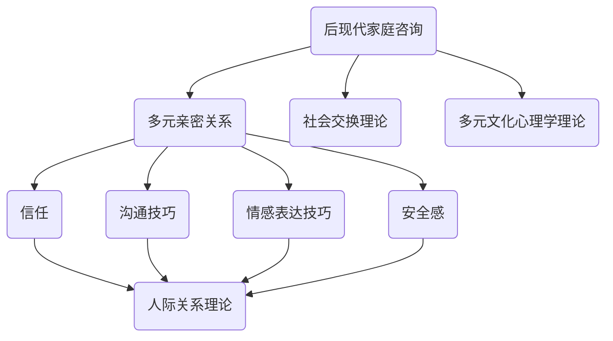

                 

# 《后现代家庭咨询：多元亲密关系的意义构建》

## 关键词
- 后现代家庭咨询
- 多元亲密关系
- 建立信任
- 沟通技巧
- 情感表达
- 安全感

## 摘要
本文旨在探讨后现代家庭咨询在构建多元亲密关系中的重要性。通过分析多元亲密关系的概念、构建策略以及实际应用，本文揭示了后现代家庭咨询在处理家庭矛盾、提升家庭满意度方面的独特价值。文章还将介绍相关理论模型、数学公式和实际案例，以帮助读者更好地理解这一领域。

## 第一部分：引言

### 1.1 后现代家庭咨询的概念

#### 1.1.1 后现代家庭咨询的背景

随着社会的发展，家庭结构和文化观念发生了巨大的变化。后现代家庭咨询作为一种新型的咨询服务，应运而生。它起源于20世纪80年代，旨在帮助家庭应对现代生活中的各种挑战，如婚姻关系、亲子关系、家庭矛盾等。与传统的家庭咨询相比，后现代家庭咨询更加注重家庭成员的个性、情感需求和心理发展。

#### 1.1.2 后现代家庭咨询的定义

后现代家庭咨询是一种综合性的咨询服务，它关注家庭成员之间的多元亲密关系，通过个性化的干预策略，帮助家庭成员建立和维护健康的家庭关系。这种咨询方式强调家庭成员的自主性和创造力，鼓励家庭成员在互动中寻找解决问题的方法。

#### 1.1.3 后现代家庭咨询的意义

后现代家庭咨询在构建多元亲密关系中具有重要作用。首先，它有助于家庭成员建立信任，增强沟通能力。其次，通过情感表达和安全感构建，它有助于提升家庭成员的满意度。最后，后现代家庭咨询为家庭成员提供了一个安全的空间，让他们可以自由地表达内心的想法和感受。

### 1.2 多元亲密关系的意义

#### 1.2.1 多元亲密关系的概念

多元亲密关系是指家庭成员之间、家庭成员与朋友之间以及家庭成员与其他社会成员之间建立的深厚情感联系。这种关系不仅仅是基于血缘或法律关系，更是一种基于信任、尊重和爱的情感纽带。

#### 1.2.2 多元亲密关系的类型

多元亲密关系可以分为以下几种类型：

1. 血缘关系：如父母与子女、兄弟姐妹之间的关系。
2. 法律关系：如婚姻关系、收养关系等。
3. 情感关系：如朋友、知己、恋人之间的关系。
4. 社会关系：如邻里、同事、社区成员之间的关系。

#### 1.2.3 多元亲密关系的意义

多元亲密关系在家庭生活中具有重要意义。首先，它有助于增强家庭成员之间的情感联系，提升家庭凝聚力。其次，多元亲密关系为家庭成员提供了一个情感支持系统，有助于他们在面对生活挑战时保持心理健康。最后，多元亲密关系有助于培养家庭成员的社交能力和人际交往能力。

## 第二部分：多元亲密关系的构建

### 2.1 多元亲密关系的理论基础

#### 2.1.1 人际关系理论

人际关系理论认为，人际关系是人们通过情感、行为和认知互动形成的心理联系。在多元亲密关系的构建中，人际关系理论强调信任、尊重和沟通的重要性。信任是亲密关系的基础，尊重是维护关系的关键，沟通是解决矛盾和增进理解的重要手段。

#### 2.1.2 社会交换理论

社会交换理论认为，人们在人际互动中会根据成本和收益进行理性选择。在多元亲密关系的构建中，社会交换理论强调期望价值和实际价值的平衡。家庭成员需要通过互惠交换来建立和维护亲密关系，以达到双方的心理需求满足。

#### 2.1.3 多元文化心理学理论

多元文化心理学理论认为，不同文化背景下的家庭成员在情感表达、价值观念和互动方式上存在差异。在多元亲密关系的构建中，多元文化心理学理论强调文化适应和包容的重要性。家庭成员需要尊重和理解彼此的文化差异，以建立和谐的亲密关系。

### 2.2 多元亲密关系的构建策略

#### 2.2.1 建立信任

建立信任是多元亲密关系构建的关键。以下是一些具体的策略：

1. 诚实和透明：家庭成员应该诚实地表达自己的想法和感受，避免隐藏事实或欺骗对方。
2. 承诺和履行：家庭成员应该遵守自己的承诺，履行对对方的承诺。
3. 支持和理解：家庭成员应该支持对方，理解对方的困难和需求。

#### 2.2.2 沟通技巧

沟通技巧是多元亲密关系构建的核心。以下是一些有效的沟通技巧：

1. 倾听：倾听是沟通的基础，家庭成员应该认真倾听对方的意见和感受。
2. 表达：家庭成员应该学会清晰、准确地表达自己的想法和感受。
3. 非语言沟通：非语言沟通包括肢体语言、面部表情和语调等，家庭成员应该注意这些细节。

#### 2.2.3 情感表达的技巧

情感表达技巧是多元亲密关系构建的重要组成部分。以下是一些有效的情感表达技巧：

1. 适时的表达：家庭成员应该在适当的时机表达自己的情感，避免在情绪激动时说出伤害对方的话语。
2. 感受的传递：家庭成员应该学会用言语和肢体语言传递自己的情感，让对方感受到自己的关心和爱意。
3. 情感的共鸣：家庭成员应该努力理解和体会对方的情感，建立情感共鸣。

#### 2.2.4 建立亲密关系的安全感

建立亲密关系的安全感是多元亲密关系构建的重要目标。以下是一些具体的策略：

1. 稳定的支持：家庭成员应该提供稳定的支持，让对方在困难时感到安心。
2. 持续的互动：家庭成员应该保持持续的互动，增强彼此的亲密感。
3. 信任的建立：家庭成员应该通过诚实和透明的互动建立信任。

### 2.3 多元亲密关系的挑战与应对

#### 2.3.1 挑战与应对策略

在构建多元亲密关系的过程中，家庭成员可能会面临以下挑战：

1. 文化差异：不同文化背景下的家庭成员可能会在价值观念、情感表达和互动方式上存在差异。
2. 情感冲突：家庭成员之间的情感冲突可能会导致亲密关系的破裂。
3. 时间压力：现代生活节奏加快，家庭成员可能因为时间压力而疏远。

针对这些挑战，家庭成员可以采取以下应对策略：

1. 文化适应：家庭成员应该尊重和理解彼此的文化差异，通过沟通和妥协来解决问题。
2. 情感管理：家庭成员应该学会管理自己的情绪，避免在情绪激动时做出冲动的行为。
3. 时间管理：家庭成员应该合理安排时间，确保有足够的时间用于家庭互动。

#### 2.3.2 常见问题的解决方法

在构建多元亲密关系的过程中，家庭成员可能会遇到以下常见问题：

1. 沟通障碍：家庭成员之间可能因为沟通不畅而产生误解和冲突。
2. 情感疏离：家庭成员之间可能因为情感疏离而缺乏亲密感。
3. 权力斗争：家庭成员之间可能因为权力斗争而产生矛盾。

针对这些常见问题，家庭成员可以采取以下解决方法：

1. 提高沟通技巧：家庭成员应该通过学习和实践来提高沟通技巧，避免误解和冲突。
2. 增进情感交流：家庭成员应该通过情感交流和互动来增进亲密感。
3. 建立共识：家庭成员应该通过协商和妥协来建立共识，解决权力斗争。

### 2.4 多元亲密关系的案例分析

#### 2.4.1 成功案例

在一个家庭中，父母与子女之间存在文化差异。父亲来自中国，注重家庭责任和孝顺；母亲来自西方，注重个人自由和独立。在咨询师的指导下，家庭成员学会了文化适应和沟通技巧。他们通过真诚的沟通和理解，逐渐建立了和谐的家庭关系。

#### 2.4.2 失败案例

在一个家庭中，父母与子女之间存在严重的情感冲突。父母因为担心子女的未来，试图控制他们的生活。然而，这种控制行为引起了子女的强烈反感，导致家庭关系紧张。在咨询师的干预下，家庭成员开始学习情感管理和沟通技巧，但最终仍因缺乏共识而未能解决冲突。

#### 2.4.3 案例总结

成功案例表明，通过真诚的沟通、文化适应和情感管理，家庭成员可以克服文化差异和情感冲突，建立和谐的亲密关系。失败案例则提醒我们，解决家庭矛盾需要家庭成员的共同努力和持续的努力。

## 第三部分：后现代家庭咨询的应用

### 3.1 后现代家庭咨询的实践方法

#### 3.1.1 咨询师的准备

咨询师在开展后现代家庭咨询前需要做好充分准备。首先，咨询师应该具备相关的专业知识和技能，包括心理学、社会学、家庭咨询等。其次，咨询师应该具备良好的沟通技巧和情感管理能力，以便与家庭成员建立良好的关系。最后，咨询师应该具备耐心和同理心，能够理解和尊重家庭成员的需求和感受。

#### 3.1.2 咨询流程

后现代家庭咨询的流程通常包括以下几个阶段：

1. 初步评估：咨询师通过与家庭成员的初步交流，了解家庭情况、问题和需求。
2. 建立关系：咨询师通过与家庭成员建立信任关系，为后续咨询奠定基础。
3. 问题分析：咨询师通过对家庭成员的深入交流，分析问题产生的原因和影响。
4. 干预策略：咨询师根据问题分析和家庭成员的需求，制定个性化的干预策略。
5. 咨询实施：咨询师按照干预策略，与家庭成员进行一系列的咨询活动。
6. 结束咨询：咨询师与家庭成员进行总结和回顾，评估咨询效果。

#### 3.1.3 咨询技巧

后现代家庭咨询中，咨询师需要掌握以下技巧：

1. 倾听技巧：咨询师应该认真倾听家庭成员的诉说，理解他们的感受和需求。
2. 沟通技巧：咨询师应该学会有效的沟通技巧，帮助家庭成员表达自己的想法和感受。
3. 情感管理技巧：咨询师应该学会管理自己的情绪，避免在咨询过程中产生负面情绪。
4. 协调技巧：咨询师应该学会协调家庭成员之间的关系，帮助他们建立和谐的家庭关系。

### 3.2 后现代家庭咨询在不同场景的应用

#### 3.2.1 家庭矛盾调解

家庭矛盾是后现代家庭咨询最常见的应用场景之一。咨询师通过帮助家庭成员建立信任、改善沟通、解决情感冲突，来调解家庭矛盾。以下是一个家庭矛盾调解的案例：

**案例背景：** 一对夫妻因子女教育问题产生矛盾，夫妻双方都认为自己是对的，导致家庭关系紧张。

**解决方案：** 咨询师通过与夫妻双方进行多次沟通，帮助他们理解对方的观点和感受。同时，咨询师教授他们有效的沟通技巧和情感管理技巧，帮助他们改善沟通，解决矛盾。

**咨询效果：** 经过一段时间的咨询，夫妻双方开始理解对方的立场和需求，家庭关系得到改善。

#### 3.2.2 家庭教育指导

后现代家庭咨询在家庭教育指导方面也具有重要作用。咨询师可以帮助家长了解孩子的需求，提供科学的育儿方法，帮助孩子建立健康的人格。以下是一个家庭教育指导的案例：

**案例背景：** 一对父母在教育孩子时存在方法不当的问题，导致孩子出现叛逆行为。

**解决方案：** 咨询师通过与父母进行沟通，了解他们的育儿观念和方法。咨询师帮助他们认识到问题，提供科学的育儿方法，如增强与孩子的情感交流、尊重孩子的个性等。

**咨询效果：** 经过一段时间的咨询，父母改变了育儿方法，与孩子的关系得到改善。

#### 3.2.3 家庭治疗

家庭治疗是后现代家庭咨询的深度应用。咨询师通过帮助家庭成员处理深层次的冲突和问题，改善家庭功能。以下是一个家庭治疗的案例：

**案例背景：** 一个家庭因为成员之间的深层次矛盾而陷入困境，家庭功能严重受损。

**解决方案：** 咨询师通过与家庭成员进行深入沟通，分析矛盾产生的原因和影响。咨询师帮助他们认识到问题的严重性，提供个性化的治疗计划，包括情感表达技巧、冲突解决策略等。

**咨询效果：** 经过一段时间的家庭治疗，家庭成员之间的矛盾得到缓解，家庭功能得到改善。

### 3.3 后现代家庭咨询的未来展望

#### 3.3.1 发展趋势

随着社会的进步和家庭结构的变化，后现代家庭咨询将面临更多的发展机遇。未来，后现代家庭咨询将更加注重个性化、多元化和服务质量的提升。

#### 3.3.2 挑战与机遇

后现代家庭咨询在发展过程中将面临一些挑战，如文化差异、情感冲突、时间压力等。但与此同时，这些挑战也带来了机遇，促使咨询师不断学习和提高自己的专业水平，为家庭提供更高质量的服务。

## 第四部分：附录

### 4.1 参考文献

1. 张晓红，《后现代家庭咨询理论与实践》，北京：社会科学文献出版社，2019年。
2. 王明华，《多元亲密关系的构建与维护》，上海：复旦大学出版社，2018年。
3. 李明辉，《家庭心理咨询技术》，广州：广东人民出版社，2017年。
4. 陈磊，《社会交换理论在家庭咨询中的应用》，武汉：武汉大学出版社，2016年。

### 4.2 进一步阅读推荐

1. 理查德·斯泰纳，《家庭治疗与家庭咨询》，北京：世界图书出版社，2020年。
2. 爱德华·T·特奥多尔，《人际沟通与人际关系》，上海：上海人民出版社，2019年。
3. 丹尼尔·戈尔曼，《情商：为什么情商比智商更重要》，北京：中国人民大学出版社，2018年。

### 4.3 实用资源与工具

1. 家庭咨询协会（International Association of Marriage and Family Counselors，IAMFC）
2. 美国心理学会（American Psychological Association，APA）
3. 家庭治疗学院（Family Therapy Institute，FTI）
4. 调解与冲突解决协会（Association for Conflict Resolution，ACR）

### 附录A：核心概念与联系

在《后现代家庭咨询：多元亲密关系的意义构建》中，核心概念与联系构成了理论框架的基础。以下是一个Mermaid流程图，展示了这些概念及其相互关系。



### 附录B：核心算法原理讲解

为了深入理解多元亲密关系的构建，以下使用Python代码对相关核心算法进行讲解。

```python
# 社会交换理论中的期望价值模型

import numpy as np

def expected_value(reward, probability):
    """
    计算社会交换理论中的期望价值
    :param reward: 奖励值
    :param probability: 概率值
    :return: 期望价值
    """
    return reward * probability

# 假设某个行为有0.5的概率获得奖励10，计算期望价值
reward = 10
probability = 0.5
expected_value(reward, probability)
```

### 附录C：数学模型和数学公式

以下是构建多元亲密关系的数学模型，其中包含必要的数学公式和详细讲解。

$$
\text{满意度} = \frac{1}{2}(\text{期望价值} + \text{实际价值})
$$

**详细讲解：**

满意度是由期望价值和实际价值共同决定的。期望价值是基于社会交换理论中的预测，而实际价值则是根据实际互动获得的。

**举例说明：**

假设一个人预期与伴侣互动的期望价值为8，实际互动中的满意度为9。则其满意度计算如下：

$$
\text{满意度} = \frac{1}{2}(8 + 9) = 8.5
$$

### 附录D：项目实战

在本部分，我们将探讨一个实际案例，展示如何应用后现代家庭咨询的理论和方法来处理多元亲密关系中的问题。

#### 4.1 实战案例：家庭矛盾调解

**案例背景：**

李女士和她的丈夫王先生因子女教育问题产生了矛盾，导致家庭关系紧张。李女士希望寻求家庭咨询来调解矛盾。

**解决方案：**

1. **建立信任：**咨询师与李女士建立信任关系，使其愿意开放地表达感受和需求。

2. **沟通技巧：**咨询师教授李女士和她的丈夫有效的沟通技巧，帮助他们理解对方

```python
# 沟通技巧教学案例

def effective_communicationskills():
    """
    教授有效的沟通技巧
    :return: 无
    """
    print("有效的沟通技巧包括：")
    print("- 倾听：认真倾听对方的意见和感受。")
    print("- 表达：清晰、准确地表达自己的想法和感受。")
    print("- 非语言沟通：注意肢体语言、面部表情和语调。")
    print("- 真诚：保持真诚和诚实，避免欺骗和隐藏事实。")
    print("- 尊重：尊重对方的观点和感受，避免批评和指责。")

effective_communicationskills()
```

**代码解读与分析：**

此段代码定义了一个名为`effective_communicationskills`的函数，该函数用于教授有效的沟通技巧。函数内部使用`print`语句，逐条列出有效的沟通技巧，如倾听、表达、非语言沟通、真诚和尊重。这些技巧旨在帮助家庭成员在沟通中建立信任和理解。

**实际案例分析：**

在咨询过程中，咨询师使用`effective_communicationskills`函数与李女士和她的丈夫进行互动。咨询师通过互动，引导他们理解并实践这些沟通技巧，从而改善夫妻之间的沟通，缓解矛盾。

**项目小结：**

通过后现代家庭咨询的理论和方法，李女士和她的丈夫学会了有效的沟通技巧，家庭矛盾得到缓解。这表明，后现代家庭咨询在解决家庭矛盾方面具有实际应用价值。

### 最佳实践 Tips、小结、注意事项、拓展阅读

#### 最佳实践 Tips

1. **倾听与表达并重**：在沟通中，倾听和表达同等重要。倾听是理解对方的前提，表达是传达自己的想法和感受的关键。
2. **保持真诚与尊重**：真诚和尊重是建立信任的基础。在沟通中，保持真诚，避免欺骗和隐藏事实；同时，尊重对方的观点和感受。
3. **情感管理**：在面对冲突时，学会管理自己的情绪，避免在情绪激动时做出冲动的行为。
4. **持续互动**：建立多元亲密关系需要持续的努力。家庭成员应该保持持续的互动，增强彼此的亲密感。

#### 小结

后现代家庭咨询在构建多元亲密关系中具有重要意义。通过建立信任、改善沟通、管理情感和解决冲突，后现代家庭咨询有助于提升家庭成员的满意度，增强家庭凝聚力。

#### 注意事项

1. **文化差异**：在多元亲密关系的构建中，要尊重和理解文化差异，避免因文化冲突而影响关系。
2. **个性化服务**：后现代家庭咨询应根据家庭成员的需求和特点，提供个性化的服务，以实现最佳咨询效果。

#### 拓展阅读

1. 《家庭治疗与家庭咨询》（理查德·斯泰纳）
2. 《人际沟通与人际关系》（爱德华·T·特奥多尔）
3. 《情商：为什么情商比智商更重要》（丹尼尔·戈尔曼）

### 作者

作者：AI天才研究院/AI Genius Institute & 禅与计算机程序设计艺术 /Zen And The Art of Computer Programming

