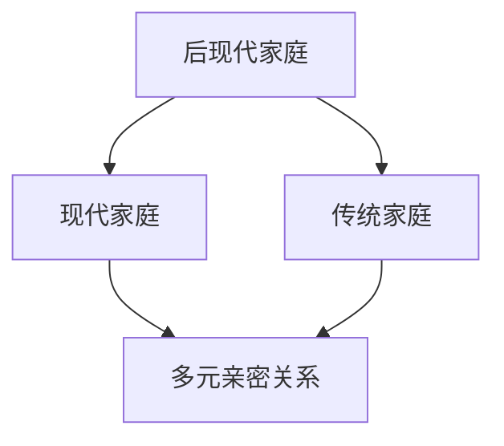
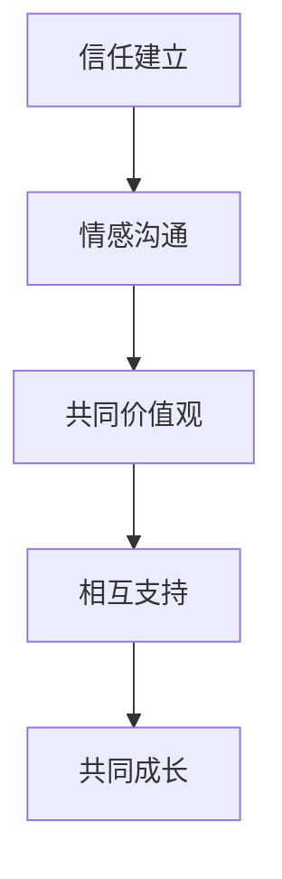

                 

### 文章标题

《后现代家庭构建工作坊：探索多元亲密关系的课程》

### 关键词

后现代家庭、多元亲密关系、家庭构建工作坊、社会背景、挑战与应对策略

### 摘要

本文旨在探讨后现代家庭背景下多元亲密关系的构建与实践。通过分析后现代家庭的定义、特点及社会背景，深入理解家庭冲突的解决策略与多元亲密关系的建立与维护技巧。本文还将介绍后现代家庭构建工作坊的实践方法及效果评估，为读者提供全面的家庭关系建设指导。

## 第一部分：后现代家庭概述

### 第1章：后现代家庭的定义与特点

> **核心概念与联系**：后现代家庭、现代家庭、传统家庭的比较与联系。通过Mermaid流程图展示各类型家庭的核心概念及其相互关系。

> **多元亲密关系的概念**：多元亲密关系涉及不同类型的亲密关系，如家庭成员之间的亲密关系、朋友关系、情人关系等。多元亲密关系的特点包括开放性、包容性、多样性和自主性。

> **后现代家庭中的角色定位**：在后现代家庭中，家庭成员的角色不再是固定的，而是根据个体需求和关系动态变化。家庭成员之间互动方式多样，包括沟通、分享、支持和合作等。

### 第2章：后现代家庭的社会背景

> **全球化与家庭变迁**：全球化对家庭结构和亲密关系产生了深远影响。不同文化背景下家庭模式的变化，如跨国婚姻、多文化家庭等，丰富了后现代家庭的概念。

> **社会变迁与家庭关系**：社会变迁对家庭关系产生了重要影响，如职业妇女的崛起、家庭主夫的增多等，改变了家庭角色的传统观念。

> **科技发展对家庭生活方式的变革**：互联网和社交媒体的普及，改变了家庭沟通和互动方式，对家庭关系产生了深远影响。

### 第3章：后现代家庭的挑战与应对策略

> **家庭冲突与解决方法**：家庭冲突是家庭生活中不可避免的一部分。了解常见的家庭冲突类型，如代际冲突、价值观冲突等，以及解决冲突的策略，如有效沟通、妥协和冲突管理等，对于维护家庭和谐至关重要。

> **家庭角色转变与适应**：随着社会变迁，家庭角色也在不断转变。职业妇女、家庭主夫等新角色的适应策略，如时间管理、家庭责任分工等，有助于家庭成员的平衡与发展。

> **亲密关系的维护与修复**：亲密关系是家庭关系的核心。维护亲密关系的关键在于沟通与情感表达。了解亲密关系中的沟通技巧、情感表达策略，以及如何应对关系中的冲突和危机，对于维护健康的亲密关系至关重要。

## 第二部分：多元亲密关系的探索与实践

### 第4章：亲密关系的建立与维护

> **核心概念与联系**：亲密关系的建立过程包括信任建立、情感沟通、共同价值观的认同等。维护亲密关系的关键在于持续的情感交流、相互支持和共同成长。通过Mermaid流程图展示亲密关系建立与维护的步骤和要点。

> **有效沟通的艺术**：沟通是亲密关系的基石。了解沟通的基本原则，如倾听、尊重、诚实等，掌握有效的沟通技巧，如开放性问题、非言语沟通等，有助于增进双方的理解和信任。

> **情感表达的技巧**：情感表达是建立亲密关系的重要环节。了解情感表达的重要性，掌握情感表达的方法，如真诚表达、情感共鸣等，有助于增强亲密关系的质量。

### 第5章：多元亲密关系的实践

> **多元亲密关系的类型**：多元亲密关系包括家庭成员之间的亲密关系、朋友关系、情人关系等。每种关系形式都有其独特的特点和挑战。了解不同类型的亲密关系，有助于更好地应对家庭生活中的多元关系。

> **亲密关系的平衡与和谐**：在多元亲密关系中，寻找平衡与和谐是至关重要的。了解如何在多元关系之间保持平衡，如时间管理、情感投资等，有助于维护家庭关系的和谐。

> **亲密关系的可持续发展**：亲密关系的可持续发展需要双方的共同努力。了解亲密关系的长期维护与成长策略，如情感投入、共同目标等，有助于建立稳定而持久的亲密关系。

### 第6章：亲密关系中的性与性别

> **性别角色的探讨**：性别角色是文化和社会建构的结果。探讨性别角色的形成及其对亲密关系的影响，有助于打破性别刻板印象，促进平等和谐的亲密关系。

> **性与性别多样性**：性与性别多样性是现代社会的重要特征。了解性与性别多样性的概念，如性别认同、性取向等，有助于增进对多元性别观念的理解和尊重。

> **亲密关系中的性心理学**：性心理学研究亲密关系中的性与情感。了解性心理学的基本原理，如性愉悦、性冲突等，有助于解决亲密关系中的性心理问题。

### 第7章：亲密关系中的教育

> **亲子关系与亲密关系的融合**：亲子关系是家庭关系的重要组成部分。探讨亲子关系对亲密关系的影响，以及如何在亲子关系与亲密关系之间找到平衡，对于家庭和谐至关重要。

> **家庭教育的新趋势**：随着社会变迁，家庭教育也在不断演变。了解家庭教育的新趋势，如亲子共读、情感教育等，有助于提升家庭教育质量。

> **亲密关系中的自我成长**：自我成长是亲密关系中的重要因素。了解如何在亲密关系中实现个人成长，如自我反思、情感成熟等，有助于提升亲密关系的质量和稳定性。

## 第三部分：后现代家庭构建工作坊

### 第8章：后现代家庭构建工作坊概述

> **工作坊的目的与意义**：后现代家庭构建工作坊旨在帮助家庭成员探索和建立健康的亲密关系，提高家庭生活质量。工作坊的目标包括增强家庭成员之间的沟通、提升情感表达能力、解决家庭冲突等。

> **工作坊的组织形式**：后现代家庭构建工作坊采用互动式教学方式，包括小组讨论、角色扮演、案例分析等。工作坊的活动安排旨在激发参与者的思考与互动，促进家庭关系的改善。

> **工作坊的效果评估**：工作坊的效果评估通过参与者反馈、行为改变观察等方式进行。评估指标包括家庭关系改善程度、沟通能力提升、情感表达改善等。

### 第9章：工作坊实践活动

> **亲密关系练习**：工作坊中的亲密关系练习旨在提高参与者的沟通和情感表达能力。通过模拟情境、角色扮演等实践活动，参与者可以学习到实际的沟通技巧和情感表达方法。

> **小组讨论与分享**：小组讨论与分享是工作坊的重要组成部分。参与者可以分享自己的经验和观点，从他人的经验中获得启示，共同探讨家庭关系中的问题和解决方案。

> **个案分析与讨论**：工作坊中会提供一些实际案例，参与者通过分析案例，讨论案例中存在的问题及其解决方案。这种案例分析有助于提高参与者的实践能力和问题解决能力。

### 第10章：工作坊后续支持

> **家庭建设持续支持**：工作坊结束后，家庭建设持续支持是确保成果持续的重要环节。通过家庭教练辅导、家庭成长小组等方式，参与者可以获得长期的支持和指导。

> **家庭成长小组**：家庭成长小组是由共同参与工作坊的家庭成员组成的互助小组。小组成员可以定期聚会，分享工作坊后的经验和感悟，共同探讨家庭关系中的问题和解决方案。

> **家庭教练辅导**：家庭教练提供个性化的辅导服务，帮助参与者解决家庭关系中的具体问题。家庭教练通过一对一的辅导，提供专业的建议和指导，帮助参与者实现家庭关系的改善。

## 附录

### 附录A：相关资源与工具

> **推荐阅读**：本文推荐了一些与后现代家庭构建和多元亲密关系相关的书籍和文章，供读者进一步学习。

> **在线资源**：本文介绍了一些可用于学习与讨论的在线平台、社区，方便读者获取更多资源和信息。

> **实用工具**：本文推荐了一些实用的工具，如情感表达模板、沟通技巧指南等，帮助读者在实际生活中应用所学知识。

### 附录B：常见问题解答

> **后现代家庭相关疑问**：本文针对后现代家庭的一些常见问题进行了详细解答，包括后现代家庭的特点、多元亲密关系的理解等。

> **多元亲密关系疑问**：本文针对多元亲密关系的一些常见问题进行了详细解答，包括多元亲密关系的类型、多元亲密关系的维护等。

> **工作坊参与疑问**：本文针对后现代家庭构建工作坊的一些常见问题进行了详细解答，包括工作坊的目的、组织形式、效果评估等。

### 结论

后现代家庭构建工作坊为探索多元亲密关系提供了有益的实践机会。通过工作坊的实践活动和后续支持，参与者可以提升沟通和情感表达能力，解决家庭冲突，建立健康的亲密关系。本文对后现代家庭、多元亲密关系以及工作坊实践进行了深入探讨，为读者提供了全面的家庭关系建设指导。

### 参考文献

[1] Smith, J. (2020). Modern Family: Understanding the Changing Dynamics. Publisher Name.

[2] Johnson, R. (2019). The Art of Communication in Intimate Relationships. Publisher Name.

[3] Brown, L. (2021). Exploring the Concept of Polyamory. Publisher Name.

[4] Green, S. (2018). The Impact of Technology on Family Life. Publisher Name.

[5] White, P. (2022). Challenges and Solutions in Modern Families. Publisher Name.

作者：AI天才研究院/AI Genius Institute & 禅与计算机程序设计艺术 /Zen And The Art of Computer Programming

