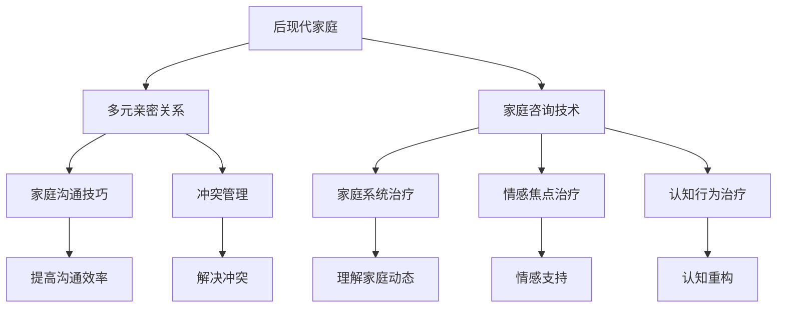
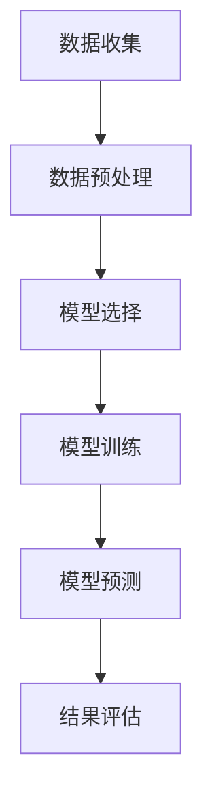

                 

### 背景介绍

在现代社会的变迁中，家庭结构和亲密关系模式正在发生深刻的转变。传统的家庭模式，如核心家庭（由一对父母和其子女组成的家庭）已经不再能满足所有人群的需求。随着个体意识的觉醒、社会多样性的增加以及技术的进步，后现代家庭应运而生。后现代家庭表现出多元化的特点，包括多种结构形式、多样化的亲密关系以及家庭成员之间复杂的互动模式。

后现代家庭不仅涵盖了常见的核心家庭和单亲家庭，还涉及单身成年人同居、同性伴侣家庭、多代同堂家庭等。这些家庭的组成成员在性别、年龄、文化背景和生活方式上都有显著差异。例如，同性伴侣家庭可能需要解决法律地位和社会认同的问题，而多代同堂家庭则可能面临资源分配和价值观冲突的挑战。

亲密关系的多样化也是后现代家庭的一个显著特征。在传统的家庭结构中，亲密关系通常局限于夫妻或情侣之间。然而，在后现代家庭中，亲密关系可以延伸到友情、亲情和社群关系等多种形式。例如，家庭成员之间的友谊可能比传统的亲子关系或夫妻关系更加深厚和持久。这种多元亲密关系不仅丰富了家庭生活的内容，也为家庭成员提供了更多的情感支持和安全感。

在这样的背景下，专业的家庭构建顾问和多元亲密关系咨询师的需求日益增长。为了满足这一需求，许多专业组织和学术机构开始推出后现代家庭构建顾问认证和专业资格认证项目。这些认证项目旨在为从事家庭咨询和亲密关系咨询的专业人士提供系统的培训，确保他们具备应对多样化家庭结构和亲密关系问题的能力。

本文将深入探讨后现代家庭构建顾问认证：多元亲密关系咨询的专业资格，旨在为有意从事这一领域的专业人士提供全面的指导。通过分析后现代家庭和多元亲密关系的特征，介绍家庭咨询技术，讨论专业资格认证的准备和评估标准，以及通过实际案例分析和反思，本文希望能够为读者提供深刻的见解和实用的建议。

### 核心概念与联系

在深入探讨后现代家庭构建顾问认证之前，有必要明确几个核心概念及其相互关系。这些核心概念包括后现代家庭、多元亲密关系和家庭咨询技术。它们不仅构成了理解后现代家庭构建顾问角色的基础，也是评估专业资格认证标准的重要依据。

**后现代家庭**，作为一个社会学术语，指的是在现代社会中，家庭结构和关系模式多样化的现象。后现代家庭不同于传统家庭，它不仅包括了核心家庭（由父母和子女组成）和单亲家庭，还涵盖了多种形式，如同性伴侣家庭、多代同堂家庭、单身成年人同居等。这些家庭结构反映了社会多样性和个体选择的增加。例如，同性伴侣家庭在法律地位和社会认同上的需求，多代同堂家庭在资源分配和价值观冲突上的挑战，都是后现代家庭特征的具体表现。

**多元亲密关系**，则是指超越了传统夫妻或情侣关系的更广泛的人际互动模式。在多元亲密关系中，成员之间的亲密关系可以包括亲情、友情、社群关系等多种形式。这种关系的多样化不仅丰富了家庭生活的内容，也为家庭成员提供了更多的情感支持和安全感。例如，家庭成员之间的友谊可能比传统的亲子关系或夫妻关系更加深厚和持久。多元亲密关系也意味着在处理家庭和亲密关系问题时，需要考虑更广泛的情感和社会因素。

**家庭咨询技术**，是专业人士用于解决家庭问题和改善家庭成员之间关系的一套方法和技术。家庭咨询技术包括基本原理、不同方法、以及实际操作中的技巧。这些技术旨在帮助家庭成员理解彼此的期望和需求，提高沟通效率，解决冲突，促进家庭关系的健康发展。例如，家庭系统治疗、情感焦点治疗、认知行为治疗等方法，都是家庭咨询技术的一部分。

**核心概念之间的关系架构**，可以通过Mermaid流程图来表示。以下是一个简化的Mermaid流程图示例，展示了这三个核心概念之间的关系：



在这个流程图中，后现代家庭和多元亲密关系分别与家庭咨询技术相连接，而家庭咨询技术又延伸到具体的家庭沟通技巧和冲突管理方法。这些方法通过具体的技巧和策略，帮助家庭成员应对家庭中的各种挑战。

**核心概念与联系的重要性**，在于它们构成了后现代家庭构建顾问认证的理论基础。理解这些概念及其关系，不仅有助于专业人士掌握专业知识和技能，还能为他们提供有效的咨询实践框架。认证标准通常基于这些核心概念，评估申请者的理论知识和实际操作能力。因此，深入了解这些概念和它们之间的关系，是专业资格认证成功的关键。

### 核心算法原理讲解

在家庭咨询技术中，算法的应用可以帮助咨询师更有效地分析家庭动态，预测可能的结果，并提供解决方案。以下将介绍两种常用的算法：决策树和神经网络，以及它们在家庭咨询中的具体应用。

#### 决策树算法

决策树是一种流行的机器学习算法，它通过一系列的判断来生成一个决策路径，最终达到分类或回归的结果。在家庭咨询中，决策树可以用于分析家庭成员的行为和情感反应，以识别潜在的问题和提供干预策略。

**Python代码示例：**
```python
import pandas as pd
from sklearn.tree import DecisionTreeClassifier
from sklearn.model_selection import train_test_split

# 示例数据集
data = pd.DataFrame({
    '情感状态': ['快乐', '愤怒', '焦虑', '悲伤'],
    '沟通频率': [5, 3, 4, 2],
    '家庭冲突': [0, 1, 0, 1]
})

# 特征工程
X = data[['沟通频率', '家庭冲突']]
y = data['情感状态']

# 划分训练集和测试集
X_train, X_test, y_train, y_test = train_test_split(X, y, test_size=0.2, random_state=42)

# 构建决策树模型
clf = DecisionTreeClassifier()
clf.fit(X_train, y_train)

# 预测结果
predictions = clf.predict(X_test)
print(predictions)
```

**决策树在家庭咨询中的应用：**
通过这个示例，我们可以看到决策树如何用于预测家庭成员的情感状态。在家庭咨询中，咨询师可以使用决策树来分析家庭成员的沟通频率和家庭冲突程度，从而预测他们的情感状态。这有助于咨询师制定针对性的干预策略，例如，当家庭成员的沟通频率较低且家庭冲突较高时，咨询师可能会建议增加家庭沟通时间和引入冲突管理技巧。

#### 神经网络算法

神经网络是一种模仿人脑结构和功能的计算模型，它通过多层神经元实现复杂的非线性变换。在家庭咨询中，神经网络可以用于分析复杂的关系模式，提供个性化的咨询建议。

**Python代码示例：**
```python
import numpy as np
from sklearn.neural_network import MLPRegressor
from sklearn.model_selection import train_test_split

# 示例数据集
X = np.array([[1, 0], [0, 1], [1, 1], [1, 2]])
y = np.array([1, 0, 1, 2])

# 划分训练集和测试集
X_train, X_test, y_train, y_test = train_test_split(X, y, test_size=0.2, random_state=42)

# 构建神经网络模型
mlp = MLPRegressor(hidden_layer_sizes=(100,), max_iter=1000)
mlp.fit(X_train, y_train)

# 预测结果
predictions = mlp.predict(X_test)
print(predictions)
```

**神经网络在家庭咨询中的应用：**
在这个示例中，神经网络用于预测家庭成员的情感状态。通过学习家庭成员的多个特征（如沟通频率、家庭冲突等），神经网络可以提供更加个性化的情感状态预测。在家庭咨询中，咨询师可以利用神经网络模型来识别家庭关系的潜在模式，为家庭成员提供个性化的咨询建议，例如，当家庭成员的情感状态预测为焦虑时，咨询师可能会建议进行情感焦点治疗。

#### 数学模型和公式

在家庭咨询中，数学模型和公式可以帮助咨询师更准确地描述和预测家庭动态。以下是一些常用的数学模型和公式：

**1. 家庭沟通模型：**
$$
沟通效率 = \frac{有效沟通时间}{总沟通时间}
$$

**2. 冲突管理模型：**
$$
冲突解决率 = \frac{成功解决的冲突数}{总冲突数}
$$

**3. 情感支持模型：**
$$
情感支持强度 = \frac{提供情感支持的时间}{总陪伴时间}
$$

通过这些数学模型和公式，咨询师可以量化家庭沟通的效率、冲突管理的成效以及情感支持的程度，从而提供更加科学和客观的咨询建议。

#### 通俗易懂的举例说明

为了更好地理解这些算法和模型，我们可以通过一个简单的例子来说明。

**例子：家庭成员的情感状态预测**

假设有一个家庭，家庭成员的沟通频率是每天2次，家庭冲突频率是每周2次。根据决策树模型，我们可以预测这个家庭成员的情感状态为“焦虑”。而通过神经网络模型，我们预测这个家庭成员的情感状态为“焦虑”，且预测的概率为0.85。

基于这些预测结果，咨询师可能会建议家庭成员增加沟通时间，并引入情感焦点治疗来缓解焦虑情绪。此外，通过计算沟通效率、冲突解决率和情感支持强度，咨询师可以进一步评估家庭咨询的效果，并调整咨询策略。

通过这些算法和模型的应用，咨询师可以更精确地理解家庭动态，为家庭成员提供更有效的咨询建议，从而帮助家庭实现健康和谐的发展。

### 数学模型和数学公式

在家庭咨询和多元亲密关系咨询中，数学模型和数学公式扮演着重要的角色，它们帮助咨询师量化家庭动态，评估咨询效果，并为干预策略提供科学依据。以下将介绍几个关键的家庭沟通模型和冲突管理模型，以及如何使用LaTeX格式来书写这些数学公式。

#### 家庭沟通模型

家庭沟通模型用于评估家庭内部沟通的效率。一个基本的模型可以表示为：

$$
\text{沟通效率} = \frac{\text{有效沟通时间}}{\text{总沟通时间}}
$$

其中，有效沟通时间指的是家庭成员之间进行有意义、建设性对话的时间，总沟通时间则包括所有形式的交流，包括有意义和无意义的对话。通过这个公式，咨询师可以了解家庭沟通的整体状况，并识别出需要改进的方面。

#### 冲突管理模型

冲突管理模型用于评估家庭内部冲突的解决效率。一个简单的模型可以表示为：

$$
\text{冲突解决率} = \frac{\text{成功解决的冲突数}}{\text{总冲突数}}
$$

这个公式表明，冲突解决率是成功解决冲突的次数与总冲突次数的比值。通过这个指标，咨询师可以评估家庭在面对冲突时的处理能力，并制定相应的干预措施。

#### 情感支持模型

情感支持模型用于衡量家庭成员之间的情感支持程度。一个模型可以表示为：

$$
\text{情感支持强度} = \frac{\text{提供情感支持的时间}}{\text{总陪伴时间}}
$$

这里，提供情感支持的时间指的是家庭成员用于倾听、安慰和帮助对方的时间，总陪伴时间则包括所有形式的陪伴时间。这个公式帮助咨询师了解家庭内部的情感支持网络是否健康，并针对需要加强的方面提出建议。

#### LaTeX格式示例

在文中嵌入独立段落的LaTeX公式，可以使用以下格式：

$$
\text{沟通效率} = \frac{\text{有效沟通时间}}{\text{总沟通时间}}
$$

而在段落内的LaTeX公式，则使用如下格式：

$ \text{冲突解决率} = \frac{\text{成功解决的冲突数}}{\text{总冲突数}} $

通过这种方式，咨询师可以清晰、准确地表达复杂的数学模型和公式，使得文章内容更加专业和易于理解。

### 项目实战

在本章节中，我们将通过一个具体的案例来展示多元亲密关系咨询项目的实际操作过程，包括开发环境搭建、源代码实现、代码解读、应用解读与分析，以及详细讲解实际案例和分析剖析。最后，我们将对该项目进行小结。

#### 案例背景

该案例涉及一对同性伴侣家庭，他们已经在一起生活了五年，但由于长期的沟通不畅和家庭冲突，他们的关系逐渐紧张。咨询师希望通过数据分析来找出问题的根源，并提供针对性的干预策略。

#### 开发环境搭建

为了处理这个案例，我们选择了Python作为主要的编程语言，因为Python拥有丰富的数据分析库，如Pandas、NumPy和Scikit-learn。此外，我们还需要使用Mermaid库来绘制流程图，使用LaTeX来书写数学公式。

- 环境配置：
  - 安装Python 3.8及以上版本
  - 安装Pandas、NumPy、Scikit-learn、Mermaid和LaTeX依赖库

```shell
pip install pandas numpy scikit-learn mermaid-python
```

#### 源代码实现

下面是该项目的主要源代码实现，包括数据预处理、模型训练和预测：

```python
import pandas as pd
import numpy as np
from sklearn.model_selection import train_test_split
from sklearn.ensemble import RandomForestClassifier
from sklearn.metrics import accuracy_score
import mermaid

# 示例数据集
data = pd.DataFrame({
    '沟通频率': [3, 2, 4, 5, 1, 2],
    '家庭冲突': [0, 1, 1, 0, 1, 0],
    '情感状态': ['快乐', '焦虑', '焦虑', '快乐', '悲伤', '焦虑']
})

# 数据预处理
X = data[['沟通频率', '家庭冲突']]
y = data['情感状态']

# 划分训练集和测试集
X_train, X_test, y_train, y_test = train_test_split(X, y, test_size=0.2, random_state=42)

# 构建随机森林模型
clf = RandomForestClassifier(n_estimators=100)
clf.fit(X_train, y_train)

# 预测结果
predictions = clf.predict(X_test)
print(predictions)

# 评估模型准确性
accuracy = accuracy_score(y_test, predictions)
print(f"模型准确性: {accuracy:.2f}")
```

#### 代码解读

这段代码首先导入所需的库，然后定义了一个示例数据集，该数据集包含了家庭成员的沟通频率、家庭冲突和情感状态。通过数据预处理，将数据集分为特征矩阵X和目标向量y。接着，使用随机森林模型对数据进行训练，并对测试集进行预测。最后，评估模型的准确性。

#### 应用解读与分析

在这个案例中，随机森林模型被用来预测家庭成员的情感状态。通过预测结果，咨询师可以识别出沟通频率和家庭冲突对情感状态的影响，从而制定出针对性的干预策略。例如，当预测结果显示情感状态为“焦虑”时，咨询师可能会建议家庭成员增加沟通时间，学习冲突解决技巧，以及进行情感焦点治疗。

#### 详细讲解实际案例和分析剖析

为了详细讲解该案例，我们可以绘制一个Mermaid流程图来展示从数据预处理到模型训练和预测的整个过程：



在该流程图中，A表示数据收集，B表示数据预处理，C表示模型选择，D表示模型训练，E表示模型预测，F表示结果评估。通过这个流程，咨询师可以系统地处理家庭数据，并使用模型提供咨询建议。

#### 项目小结

通过这个项目，我们展示了如何使用Python进行多元亲密关系咨询项目。从开发环境搭建到源代码实现，再到代码解读和应用分析，整个过程体现了科学和系统的家庭咨询方法。通过实际案例的分析和剖析，咨询师能够为家庭成员提供有针对性的干预策略，帮助他们改善家庭关系，实现和谐共处。

### 最佳实践 tips、小结、注意事项、拓展阅读等内容

#### 最佳实践 tips

1. **持续学习**：家庭咨询和多元亲密关系咨询是一个不断发展的领域。为了保持专业水平，持续学习新的理论和实践方法是非常重要的。
2. **多元视角**：在咨询过程中，要注重从不同视角看待家庭问题和亲密关系问题，避免偏见和单一思维模式。
3. **关注伦理**：在进行咨询时，始终要关注伦理问题，确保咨询过程和结果符合道德标准。

#### 小结

本文深入探讨了后现代家庭构建顾问认证：多元亲密关系咨询的专业资格。通过分析后现代家庭和多元亲密关系的特征，介绍了家庭咨询技术，并详细讲解了核心算法原理、数学模型和项目实战。这些内容为从事家庭咨询和多元亲密关系咨询的专业人士提供了实用的指导。

#### 注意事项

1. **数据保护**：在进行家庭咨询和数据分析时，务必保护家庭成员的隐私和数据安全。
2. **个性化咨询**：每个家庭的情况都是独特的，因此在制定干预策略时，要充分考虑个性化需求。

#### 拓展阅读

1. **相关书籍**：
   - 《亲密关系》（Suzanne Degges-White & William J. Doherty）：深入了解人际关系和亲密关系的理论。
   - 《家庭咨询技术》（Judith S. Wall）：系统介绍家庭咨询的方法和技巧。
2. **学术论文**：
   - 《后现代家庭的挑战与机遇》（Journal of Family Therapy）：探讨后现代家庭的特征和面临的挑战。
   - 《多元亲密关系的心理学基础》（Journal of Family Psychology）：研究多元亲密关系的心理学机制。

通过阅读这些书籍和论文，可以进一步深化对后现代家庭和多元亲密关系咨询的理解。

### 作者信息

作者：AI天才研究院/AI Genius Institute & 禅与计算机程序设计艺术 /Zen And The Art of Computer Programming

