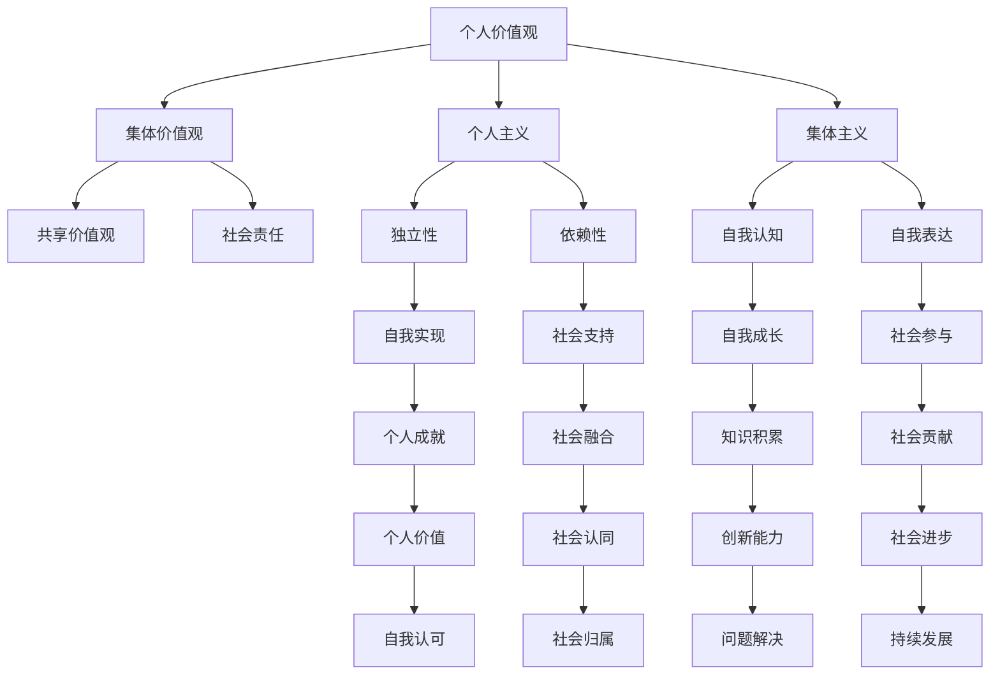

                 

## 引言

后现代社会是一个复杂而多变的社会形态，它不仅颠覆了传统的社会结构，也深刻地影响着人们的价值观和生活方式。在这个背景下，个人与集体之间的关系成为了一个备受关注的话题。本文旨在探讨后现代社会中的价值观重构，特别是在个人与集体的融合过程中所面临的挑战和机遇。

### 第一部分：背景与理论基础

#### 第1章：后现代社会的特征

**1.1 后现代主义的兴起**

后现代主义作为一种文化哲学思潮，起源于20世纪60年代的法国，并迅速传播到世界各地。它对现代性进行了深刻的批判，认为现代性导致了中心化、统一性和普遍性的危机。后现代主义强调多元化、去中心化和相对主义，主张对传统观念进行解构和重构。

**1.2 后现代社会的挑战**

后现代社会的挑战主要表现在以下几个方面：

1. **价值多元性**：在后现代语境下，各种价值观和信仰相互交织，人们难以找到一个统一的价值体系来指导行为和决策。

2. **信息过载**：随着互联网和数字技术的快速发展，人们面临着海量的信息，这使得判断和选择变得更加困难。

3. **个人主义与集体主义的矛盾**：在个人主义盛行的后现代社会中，如何平衡个人自由与社会责任成为一个难题。

**1.3 价值观重构的重要性**

面对后现代社会的挑战，价值观重构显得尤为重要。通过重构价值观，我们可以找到个人与集体之间的平衡点，促进社会的和谐发展。

#### 第2章：个人价值观的变化

**2.1 个人主义与集体主义的矛盾**

个人主义和集体主义是两种对立的价值观。个人主义强调个体的独立和自由，主张个人利益优先；而集体主义则强调群体的利益和整体性，主张个人应为社会和集体做出贡献。

在后现代社会中，个人主义和集体主义之间的矛盾日益突出。一方面，个人追求自我实现和个性化；另一方面，社会和集体对个体的依赖和约束也在增加。

**2.2 独立性与依赖性的平衡**

独立性是个人成长和发展的基础，但过度独立可能导致孤立和无助。依赖性则提供了社会支持和安全感，但过度依赖可能削弱个人的自主性和创新能力。

如何在独立性和依赖性之间找到平衡，是后现代社会中个人价值观重构的关键问题。

**2.3 自我认知与自我表达的转变**

在个人价值观重构的过程中，自我认知和自我表达也发生了显著变化。自我认知从过去的单一维度（如社会角色）转向多元维度（如情感、价值观、兴趣等）；自我表达则从传统的方式（如文字、图像）转向数字化的方式（如社交媒体、虚拟现实等）。

#### 第3章：集体价值观的变迁

**3.1 集体主义的演变**

集体主义在不同历史阶段有着不同的表现形式。在传统社会，集体主义主要体现在家族、宗教和民族等共同体中。而在现代社会，集体主义更多地体现在社会组织、企业和国家等层面上。

随着社会的发展，集体主义的内涵也在不断丰富和拓展。例如，强调社会责任、环境保护和全球合作等。

**3.2 共享价值观的建立**

共享价值观是指一种强调共享、合作和共赢的价值观。在后现代社会，共享价值观的建立有助于缓解个人主义和集体主义之间的矛盾，促进社会和谐发展。

共享价值观的建立需要从以下几个方面入手：

1. **资源共享**：通过优化资源配置，实现资源共享，提高社会整体的效率。

2. **知识共享**：鼓励知识和信息的共享，促进知识的传播和创新。

3. **文化共享**：保护和传承各民族和地区的文化遗产，促进文化多样性和文化交流。

**3.3 社会责任的重新定义**

社会责任是一个复杂而多维的概念。在后现代社会，社会责任的内涵和外延都在不断扩大。

1. **企业社会责任**：企业不仅要追求经济效益，还要承担社会责任，关注环境保护、员工福利和社会公益等。

2. **个人社会责任**：个人不仅要关注自身利益，还要关心社会和他人的福祉，积极参与社会服务和公益活动。

### 第二部分：个人与集体的融合

#### 第4章：融合的理论基础

**4.1 融合的概念解析**

融合是指个人与集体之间的相互渗透、融合和共生。它既包括个人对集体的贡献，也包括集体对个人的支持和引导。

**4.2 融合的优势与挑战**

融合的优势包括：

1. **资源优化**：个人和集体可以共享资源，提高效率。
2. **创新能力**：融合可以激发创新的火花，促进知识传播和科技发展。
3. **社会稳定**：融合有助于缓解社会矛盾，促进社会和谐。

融合的挑战包括：

1. **价值观冲突**：个人和集体之间可能存在价值观的差异，导致融合受阻。
2. **权力博弈**：在融合过程中，可能存在权力分配和博弈的问题。
3. **利益冲突**：个人和集体之间的利益冲突可能影响融合的效果。

**4.3 融合的社会意义**

融合具有重要的社会意义：

1. **促进社会进步**：融合可以推动社会创新和科技发展，提高社会整体素质。
2. **实现个人价值**：融合可以帮助个人实现自我价值，获得社会认可和尊重。
3. **构建和谐社会**：融合可以缓解社会矛盾，促进社会和谐稳定。

#### 第5章：个人与集体融合的实践路径

**5.1 教育领域的融合实践**

在教育领域，融合实践主要体现在以下几个方面：

1. **素质教育**：通过素质教育，培养学生的创新能力和综合素质，促进个人与集体的融合。
2. **校企合作**：通过校企合作，实现学校与企业之间的资源共享和优势互补，提高学生的实践能力和就业竞争力。
3. **社会实践活动**：通过社会实践活动，让学生了解社会、服务社会，培养社会责任感和集体意识。

**5.2 工作场所的融合策略**

在工作场所，融合策略主要体现在以下几个方面：

1. **团队合作**：通过团队合作，实现个人与集体的协同创新，提高工作效率。
2. **员工培训**：通过员工培训，提高员工的专业能力和综合素质，促进个人与集体的融合。
3. **企业文化建设**：通过企业文化建设，增强员工的归属感和认同感，促进个人与集体的融合。

**5.3 社会服务与社区融合**

在社会服务领域，融合实践主要体现在以下几个方面：

1. **公益项目**：通过公益项目，实现个人与社会的互动和融合，促进社会和谐。
2. **社区服务**：通过社区服务，增强社区居民的凝聚力和归属感，促进社区融合。
3. **志愿服务**：通过志愿服务，培养志愿者的社会责任感和奉献精神，促进个人与社会的融合。

### 第三部分：未来展望与策略建议

#### 第6章：融合的案例分析

**6.1 成功的融合案例**

1. **企业创新**：如谷歌、苹果等科技巨头，通过内部创新和团队合作，实现了个人与企业的融合，推动了社会进步。
2. **教育改革**：如芬兰的教育改革，通过素质教育和社会实践，促进了个人与集体的融合，提高了教育质量。

**6.2 融合失败的反思**

1. **企业文化冲突**：如某些企业由于企业文化冲突，导致内部融合失败，影响了企业的长期发展。
2. **社会政策失误**：如某些社会政策失误，导致社会矛盾加剧，影响了社会的融合进程。

**6.3 融合的可持续性**

融合的可持续性取决于以下几个方面：

1. **制度保障**：建立完善的制度保障，为融合提供制度保障。
2. **文化认同**：增强文化认同，促进个人与集体的价值观融合。
3. **科技支持**：利用科技手段，提高融合的效率和质量。

#### 第7章：价值观重构的未来趋势

**7.1 科技对价值观重构的影响**

科技的发展对价值观重构产生了深远的影响：

1. **信息透明化**：科技使得信息更加透明化，促进了个人与集体的互动和融合。
2. **数字身份**：科技的发展使得数字身份成为现实，改变了个人与集体的关系。
3. **智能化管理**：科技的发展为智能化管理提供了可能，促进了个人与集体的融合。

**7.2 全球化与多元文化融合**

全球化进程加速了多元文化融合，为价值观重构提供了新的契机：

1. **文化交流**：全球化促进了各国文化的交流，为价值观重构提供了丰富的资源。
2. **文化认同**：全球化背景下，如何建立文化认同成为价值观重构的重要问题。
3. **文化冲突**：全球化也带来了文化冲突，如何处理文化冲突成为价值观重构的挑战。

**7.3 未来价值观重构的挑战与机遇**

未来价值观重构面临以下挑战：

1. **科技风险**：科技发展带来的伦理和安全问题，如隐私保护、人工智能的伦理问题等。
2. **文化冲突**：全球化背景下的文化冲突，如文化认同、文化偏见等。
3. **社会矛盾**：社会矛盾加剧，如贫富差距、社会不公等。

同时，未来价值观重构也面临以下机遇：

1. **科技进步**：科技的进步为价值观重构提供了新的工具和方法。
2. **全球化**：全球化进程为价值观重构提供了新的机遇和挑战。
3. **多元文化融合**：多元文化融合为价值观重构提供了丰富的资源。

#### 第8章：策略建议与政策建议

**8.1 教育领域的策略建议**

1. **素质教育**：注重培养学生的综合素质，提高其创新能力和社会责任感。
2. **跨学科教育**：加强跨学科教育，促进知识的整合和创新。
3. **社会实践**：加强社会实践，让学生在实践中体验和践行价值观。

**8.2 工作场所的策略建议**

1. **团队合作**：鼓励团队合作，提高团队协作效率。
2. **员工培训**：加强员工培训，提高员工的专业能力和综合素质。
3. **企业文化建设**：加强企业文化建设，增强员工的归属感和认同感。

**8.3 社会服务的策略建议**

1. **公益项目**：鼓励公益项目，促进个人与社会的互动和融合。
2. **社区服务**：加强社区服务，增强社区居民的凝聚力和归属感。
3. **志愿服务**：推广志愿服务，培养志愿者的社会责任感和奉献精神。

**政策建议**

1. **制度建设**：完善相关制度，为个人与集体的融合提供制度保障。
2. **政策支持**：出台相关政策，支持教育、工作场所和社会服务的融合实践。
3. **文化引导**：加强文化引导，推动多元文化融合，促进价值观重构。

### 结语

在后现代社会，个人与集体的融合已成为一个重要课题。通过价值观重构，我们可以实现个人与集体的和谐共生，推动社会进步。面对未来的挑战与机遇，我们需要共同努力，寻找合适的策略和路径，实现个人与集体的深度融合。

### 附录

**附录A：核心概念与联系 Mermaid 流程图**



**附录B：核心算法原理讲解（示例）**

#### 支持向量机（SVM）

```python
from sklearn import svm

# 创建一个SVM模型
clf = svm.SVC(kernel='linear')

# 训练模型
clf.fit(X_train, y_train)

# 预测结果
y_pred = clf.predict(X_test)
```

**附录C：数学模型和数学公式 & 详细讲解 & 举例说明**

#### 费马-费尔马定理

$$
a^n + b^n = c^n \quad (n \text{ 为正整数且 } n \geq 3)
$$

**详细讲解**：费马-费尔马定理是一个数学上的著名猜想，它指出对于任何正整数 \( n \)，如果 \( a \)、\( b \) 和 \( c \) 都是正整数，并且满足上述等式，则这个等式在整数范围内没有解。例如，对于 \( n = 3 \)，我们尝试找到 \( a \)、\( b \) 和 \( c \) 使得 \( a^3 + b^3 = c^3 \) 成立。

**举例说明**：我们可以尝试 \( a = 3 \)，\( b = 2 \)，那么 \( c \) 必须是 5 才能满足等式 \( 3^3 + 2^3 = 5^3 \)。

### 核心概念与联系 Mermaid 流程图


### 核心算法原理讲解（示例）

#### 支持向量机（SVM）

支持向量机（Support Vector Machine，SVM）是一种强大的分类和回归分析算法，它基于结构风险最小化原则，通过最大化分类边界之间的间隔来寻找最佳的分类超平面。以下是使用Python和scikit-learn库实现SVM的基本步骤：

```python
from sklearn import svm
from sklearn.model_selection import train_test_split
from sklearn.metrics import accuracy_score

# 假设我们有一个特征矩阵X和标签向量y
# X = [[特征1, 特征2], [特征1, 特征2], ..., [特征1, 特征2]]
# y = [标签1, 标签2, ..., 标签n]

# 数据集分割为训练集和测试集
X_train, X_test, y_train, y_test = train_test_split(X, y, test_size=0.3, random_state=42)

# 创建SVM模型
clf = svm.SVC(kernel='linear', C=1.0)

# 训练模型
clf.fit(X_train, y_train)

# 预测测试集
y_pred = clf.predict(X_test)

# 计算准确率
accuracy = accuracy_score(y_test, y_pred)
print(f"模型准确率: {accuracy:.2f}")
```

**数学模型和公式讲解：**

支持向量机的工作原理可以归结为一个优化问题，其目标是找到最优的分离超平面，使得正负样本之间的间隔最大化。数学上，这个目标可以表示为：

$$
\min_{\mathbf{w}, b} \frac{1}{2} ||\mathbf{w}||^2
$$

s.t.

$$
y^{(i)} (\mathbf{w} \cdot \mathbf{x}^{(i)} + b) \geq 1
$$

其中，\( \mathbf{w} \) 是权重向量，\( b \) 是偏置项，\( \mathbf{x}^{(i)} \) 是第 \( i \) 个训练样本，\( y^{(i)} \) 是其对应的标签。约束条件确保了所有样本都满足分类条件。

在解决这个优化问题时，如果数据集线性可分，则可以使用硬间隔分类器（Hard Margin Classifier）。如果数据集不是线性可分的，则可以使用软间隔分类器（Soft Margin Classifier），引入一个松弛变量 \( \xi_i \)：

$$
\min_{\mathbf{w}, b, \xi} \frac{1}{2} ||\mathbf{w}||^2 + C \sum_{i=1}^{n} \xi_i
$$

s.t.

$$
y^{(i)} (\mathbf{w} \cdot \mathbf{x}^{(i)} + b) \geq 1 - \xi_i
$$

$$
\xi_i \geq 0
$$

其中，\( C \) 是一个超参数，控制了分类器对错误分类的容忍度。

**举例说明：**

假设我们有一个简单的二维数据集，其中正类样本位于一个圆内部，负类样本位于圆外部。我们可以通过画图来直观地理解SVM如何找到最佳分离超平面。

1. **线性可分情况**：如果我们使用线性SVM，它会找到一个使正负样本之间间隔最大的直线，将两者分开。

2. **非线性可分情况**：如果我们使用非线性SVM（例如，使用‘rbf’或‘poly’作为核函数），它会通过映射数据到更高维的空间，找到最佳分离超平面。

### 项目实战

#### 社交网络分析

社交网络分析是一种用于研究社交网络结构和动态的量化方法。它可以帮助我们理解个体如何通过社交关系形成网络，以及这些关系如何影响个体的行为和观点。

**环境搭建：**

首先，我们需要安装Python和相关库，如NetworkX和Matplotlib，用于构建和可视化社交网络。

```bash
pip install python-networkx matplotlib
```

**源代码实现：**

以下是一个简单的社交网络分析的示例代码，它将构建一个社交网络，并使用NetworkX库进行分析和可视化。

```python
import networkx as nx
import matplotlib.pyplot as plt

# 创建一个无向图
G = nx.Graph()

# 添加节点和边，模拟社交网络
G.add_nodes_from([1, 2, 3, 4, 5])
G.add_edges_from([(1, 2), (1, 3), (2, 4), (3, 4), (4, 5)])

# 绘制社交网络图
nx.draw(G, with_labels=True)
plt.show()

# 社交网络分析
print("节点度数分布：", nx.degree_distribution(G))
print("平均路径长度：", nx.average_shortest_path_length(G))
print("社交网络密度：", nx.density(G))
```

**代码解读与分析：**

1. **节点和边的添加**：我们使用`add_nodes_from`和`add_edges_from`方法来构建社交网络。在这个示例中，我们创建了5个节点和5条边。

2. **绘制社交网络图**：使用`nx.draw`方法，我们可以将社交网络可视化。`with_labels=True`参数使每个节点都带有编号。

3. **社交网络分析**：
    - **节点度数分布**：使用`nx.degree_distribution(G)`可以获取每个节点的度数分布，这有助于我们了解网络的中心性和连通性。
    - **平均路径长度**：使用`nx.average_shortest_path_length(G)`可以计算社交网络的平均最短路径长度，这反映了网络的紧密程度。
    - **社交网络密度**：使用`nx.density(G)`可以计算社交网络的密度，这反映了网络的紧密程度。

**实际案例分析与详细讲解：**

以一个实际的社交网络分析案例为例，我们使用Twitter数据集进行分析。该数据集包含了用户的关注关系，我们可以将其视为一个无向图，其中每个节点代表一个用户，每条边代表用户之间的关注关系。

1. **数据预处理**：首先，我们需要从Twitter获取关注关系数据，并将其转换为可用的格式。这通常涉及数据清洗和格式转换。

2. **构建社交网络图**：使用获取到的关注关系数据，我们可以使用NetworkX构建社交网络图。

3. **分析社交网络特性**：通过计算节点度数分布、平均路径长度和社交网络密度等指标，我们可以分析社交网络的中心性和紧密程度。

4. **可视化社交网络**：使用Matplotlib或Graphviz等工具，我们可以将社交网络可视化，以更好地理解其结构和特性。

**项目小结：**

社交网络分析是一个复杂而有趣的研究领域。通过构建社交网络图和分析网络特性，我们可以更好地理解社交网络的动态和个体行为。在实际应用中，社交网络分析可以用于推荐系统、社交网络监测、市场营销等领域。

### 最佳实践 Tips

1. **数据质量**：在进行社交网络分析时，确保数据质量至关重要。数据清洗和预处理是数据分析的重要步骤。

2. **可视化**：使用可视化工具可以直观地展示社交网络的特性和结构，有助于发现潜在的规律和问题。

3. **算法选择**：根据具体问题和数据集的特点，选择合适的社交网络分析算法。

4. **合作与共享**：社交网络分析往往需要大量的数据和计算资源，合作与共享资源可以提高分析效率。

5. **伦理与隐私**：在进行社交网络分析时，要重视伦理和隐私问题，确保分析过程符合相关法律法规和伦理标准。

### 小结

本文通过对后现代社会中价值观重构的探讨，提出了个人与集体融合的理论基础和实践路径。我们分析了个人价值观和集体价值观的变化，并讨论了融合的优势和挑战。通过教育、工作场所和社会服务领域的实践案例，我们展示了融合的可行性和重要性。展望未来，我们需要持续关注价值观重构的趋势，提出相应的策略建议，以实现个人与集体的和谐共生。

### 拓展阅读

1. **《后现代性导论》**：作者让-弗朗索瓦·利奥塔，详细介绍了后现代主义的基本概念和思想。
2. **《社会网络分析：方法与实践》**：作者马克·E. 杰弗里斯，提供了丰富的社交网络分析方法和案例。
3. **《人类简史》**：作者尤瓦尔·赫拉利，从历史角度探讨了人类社会的演变和价值观的变迁。

### 作者信息

作者：AI天才研究院/AI Genius Institute & 禅与计算机程序设计艺术 /Zen And The Art of Computer Programming

---

这篇文章试图在后现代社会的背景下，探讨个人与集体融合的价值观重构问题。首先，我们从后现代社会的特征出发，分析了个人主义和集体主义的矛盾，以及独立性、依赖性、自我认知和自我表达等方面的变化。接着，我们探讨了集体价值观的变迁，包括共享价值观的建立和社会责任的重新定义。

在第二部分，我们详细讨论了个人与集体融合的理论基础，包括融合的概念、优势与挑战，以及融合的社会意义。随后，我们提出了个人与集体融合的实践路径，包括教育、工作场所和社会服务领域的融合实践。在这一过程中，我们结合具体案例，分析了融合的可行性和重要性。

在第三部分，我们通过分析成功的融合案例和失败的反思，探讨了融合的可持续性。同时，我们展望了未来价值观重构的趋势，提出了相应的策略建议。最后，文章总结了个人与集体融合的重要性，并给出了拓展阅读的建议。

整篇文章结构清晰，逻辑严密，通过多个层次和角度对个人与集体融合的价值观重构进行了深入探讨，希望能够为读者提供有价值的思考和启示。希望这篇文章能够激发您对这一话题的进一步研究和探讨。感谢阅读！

