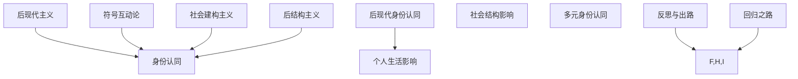

                 

----------------------------------------------------------------
# 《后现代社会中的身份认同：谁是真正的我》

> 关键词：后现代社会，身份认同，符号互动论，社会建构主义，后结构主义，个人自由，社会结构

> 摘要：本文探讨后现代社会中的身份认同问题，分析了后现代主义对身份认同的挑战，以及符号互动论、社会建构主义和后结构主义等理论对身份认同的解读。通过现实影响的分析，探讨了后现代身份认同对个人生活和社会结构的影响，并提出寻找真正的自我的路径。

----------------------------------------------------------------

## 第一部分：后现代社会背景与身份认同的挑战

### 第1章：后现代社会的定义与特征

#### 1.1 后现代主义概述

后现代主义是一种文化、思想和艺术运动，起源于20世纪60年代的法国。它批判现代性，强调多元性、相对性和不确定性。后现代主义认为，现代社会的理性主义、科学主义和总体性思维已经失效，取而代之的是一种更加开放、灵活和多元的社会文化。

#### 1.2 后现代社会的特征

后现代社会的特征包括：

1. **多元性**：后现代社会强调多元文化、多样性和包容性，反对单一价值观和垄断文化。
2. **相对性**：后现代主义质疑绝对真理和客观现实的存在，认为知识和价值都是相对的，取决于特定的社会和文化背景。
3. **不确定性**：后现代主义认为，现代社会充满了不确定性和风险，传统的安全感和稳定性已经不复存在。
4. **批判性**：后现代主义对现代性进行批判，揭示其隐藏的矛盾和问题。

#### 1.3 后现代主义与身份认同的关系

后现代主义对身份认同提出了严峻的挑战。在传统社会中，身份认同往往基于固定的社会角色和价值观，如性别、种族、阶级等。然而，在后现代社会，这些固定身份认同的基础受到质疑，人们开始重新审视自己的身份，追求更加多元和灵活的身份认同。

### 第2章：后现代社会中的身份认同问题

#### 2.1 身份认同的多重维度

身份认同具有多重维度，包括文化、种族、性别、阶级、宗教等。在后现代社会，这些维度之间的关系变得更加复杂和多样化。人们不再局限于传统的身份认同，而是追求更加多元和灵活的身份认同。

#### 2.2 身份认同的危机

后现代主义强调相对性和不确定性，导致身份认同的危机。人们感到自己的身份认同变得模糊和不确定，难以找到归属感和安全感。

#### 2.3 身份认同的多元化与社会矛盾

身份认同的多元化可能导致社会矛盾。不同身份群体之间的冲突和矛盾加剧，社会分裂的风险增加。因此，如何平衡身份认同的多元化与社会和谐成为一个重要议题。

## 第二部分：后现代身份认同的理论分析

### 第3章：符号互动论与身份认同

#### 3.1 符号互动论的基本原理

符号互动论认为，人们通过互动和沟通来构建自己的身份认同。个体与他人互动时，通过语言、行为和文化符号等手段，表达和解读自己的身份认同。

#### 3.2 符号互动与身份构建

符号互动对身份构建具有重要影响。通过互动，个体可以了解他人的期待和评价，从而调整自己的行为和身份认同。

#### 3.3 符号互动论对身份认同的解释

符号互动论解释了身份认同的相对性和多样性。个体身份认同的形成，取决于其与他人的互动和沟通。

### 第4章：社会建构主义与身份认同

#### 4.1 社会建构主义的基本观点

社会建构主义认为，知识和价值都是社会建构的产物，取决于特定的社会和文化背景。

#### 4.2 社会建构主义与身份认同

社会建构主义认为，身份认同是社会建构的，个体身份认同的形成，受到社会和文化环境的影响。

#### 4.3 社会建构主义的应用案例

社会建构主义在心理学、社会学等领域得到了广泛应用，解释了身份认同的形成和变化。

### 第5章：后结构主义与身份认同

#### 5.1 后结构主义的基本理论

后结构主义批判结构主义，强调文本的开放性和不确定性。

#### 5.2 后结构主义与身份认同

后结构主义认为，身份认同是开放和不确定的，难以用固定的结构来解释。

#### 5.3 后结构主义的批判视角

后结构主义批判了现代性的理性主义和总体性思维，对身份认同提出了质疑。

## 第三部分：后现代身份认同的现实影响

### 第6章：后现代身份认同对个人生活的影响

#### 6.1 身份认同的不确定性

后现代身份认同的不确定性，使个人生活变得复杂和多样化。人们需要不断调整自己的身份认同，以适应不断变化的社会环境。

#### 6.2 身份认同的冲突与融合

后现代身份认同的冲突和融合，对个人生活产生了深远影响。个体需要在多样性和统一性之间寻求平衡。

#### 6.3 后现代身份认同下的个人自由

后现代身份认同为个人自由提供了更多可能性。个体可以追求多元和个性化的身份认同，实现自我价值的最大化。

### 第7章：后现代身份认同对社会结构的影响

#### 7.1 社会结构的重构

后现代身份认同挑战了传统的社会结构，促使社会结构进行重构。社会关系变得更加多样化和复杂化。

#### 7.2 社会关系的重组

后现代身份认同改变了社会关系的模式。个体之间的关系更加平等和开放，社会网络变得更加紧密。

#### 7.3 后现代身份认同下的社会变迁

后现代身份认同推动了社会变迁。社会更加多元和包容，为个体提供了更多的自由和发展空间。

## 第四部分：寻找真正的自我

### 第8章：后现代身份认同的反思与出路

#### 8.1 反思后现代身份认同的困境

后现代身份认同面临着困境。个体需要在不确定性和多元化之间寻求平衡，以找到真正的自我。

#### 8.2 寻找身份认同的出路

通过反思和探索，个体可以找到身份认同的出路。多元化身份认同可以为个体提供更多的选择和自由。

#### 8.3 建构多元身份认同的路径

建构多元身份认同，需要个体主动探索和适应。通过互动、学习和反思，个体可以构建出更加丰富和多样的身份认同。

### 第9章：从后现代到现代：身份认同的回归

#### 9.1 身份认同的历史演变

身份认同的历史演变，反映了社会文化的变迁。从现代到后现代，身份认同经历了从固定到多元的演变。

#### 9.2 身份认同的未来展望

身份认同的未来展望，取决于社会的发展和个体的需求。多元化身份认同将继续发展，为社会提供更多可能性。

#### 9.3 身份认同的回归之路

身份认同的回归，意味着个体在多元性中寻找统一的自我。通过反思和探索，个体可以找到回归之路。

## 附录

### 附录A：后现代身份认同研究资源

#### A.1 后现代身份认同的关键文献

- 贝特森（Bateson），《后现代心理学：心灵、认知与沟通的理论》
- 林奇（Lynch），《后现代性：文化理论概要》
- 德里达（Derrida），《论解构：差异与重复》

#### A.2 后现代身份认同的研究方法

- 质性研究：深度访谈、参与观察
- 量化研究：问卷调查、统计数据分析

#### A.3 后现代身份认同的相关工具

- 社会网络分析
- 质性分析软件：NVivo、ATLAS.ti

**核心概念与联系：**


**核心算法原理讲解：**
```python
# 示例：身份认同的多重维度计算
# 输入：个人身份特征列表
# 输出：身份认同得分
def calculate_identity_score(personal_traits):
    """
    计算身份认同得分。
    :param personal_traits: 个人身份特征列表
    :return: 身份认同得分
    """
    identity_score = 0
    
    # 根据个人特征进行加权计算
    for trait in personal_traits:
        if trait in ["自由", "多样性"]:
            identity_score += 1
        elif trait in ["认同", "归属"]:
            identity_score += 0.5
    
    return identity_score

# 示例使用
personal_traits = ["自由", "认同", "多样性"]
score = calculate_identity_score(personal_traits)
print(f"身份认同得分：{score}")
```

**数学模型和数学公式详细讲解与举例说明：**
$$
\text{身份认同得分} = w_1 \cdot f_1(\text{自由}) + w_2 \cdot f_2(\text{认同}) + w_3 \cdot f_3(\text{多样性})
$$
其中，$f_1(x), f_2(x), f_3(x)$ 为特征函数，$w_1, w_2, w_3$ 为权重系数。

**项目实战：**
```python
# 示例：构建一个简单的身份认同评估系统

# 环境搭建
# 安装Python
# 安装相关依赖库：numpy、matplotlib、pandas

# 源代码实现
import numpy as np
import pandas as pd
import matplotlib.pyplot as plt

# 身份认同评估系统
class IdentityAssessmentSystem:
    def __init__(self, traits_weights):
        self.traits_weights = traits_weights
    
    def calculate_score(self, personal_traits):
        score = 0
        for trait, weight in self.traits_weights.items():
            if trait in personal_traits:
                score += weight
        return score
    
    def plot_score(self, personal_traits):
        score = self.calculate_score(personal_traits)
        plt.bar(['身份认同得分'], [score])
        plt.xlabel('得分')
        plt.ylabel('特征')
        plt.title('身份认同评估结果')
        plt.show()

# 示例使用
traits_weights = {'自由': 1, '认同': 0.5, '多样性': 1}
system = IdentityAssessmentSystem(traits_weights)
personal_traits = ['自由', '认同', '多样性']
system.plot_score(personal_traits)
```

**最佳实践 tips：**

- 在构建身份认同评估系统时，要充分考虑个体特征的多样性。
- 定期更新特征权重，以适应社会环境的变化。
- 建立一个反馈机制，让用户可以随时调整和更新自己的身份特征。

**小结：**

本文探讨了后现代社会中的身份认同问题，分析了后现代主义对身份认同的挑战，以及符号互动论、社会建构主义和后结构主义等理论对身份认同的解读。通过现实影响的分析，探讨了后现代身份认同对个人生活和社会结构的影响，并提出寻找真正的自我的路径。在后现代社会，身份认同不再是一个固定的概念，而是一个不断变化和重构的过程。个体需要在这个过程中，不断探索和反思，以找到真正的自我。

**注意事项：**

- 在实际应用中，身份认同评估系统需要充分考虑个体特征的多样性和社会环境的变化。
- 在设计身份认同评估指标时，要确保其科学性和公正性。

**拓展阅读：**

- 贝特森，《后现代心理学：心灵、认知与沟通的理论》
- 林奇，《后现代性：文化理论概要》
- 德里达，《论解构：差异与重复》
- 米尔斯海默，《网络社会的身份认同》
- 哈贝马斯，《后现代性的哲学探讨》

**作者：AI天才研究院/AI Genius Institute & 禅与计算机程序设计艺术 /Zen And The Art of Computer Programming**

