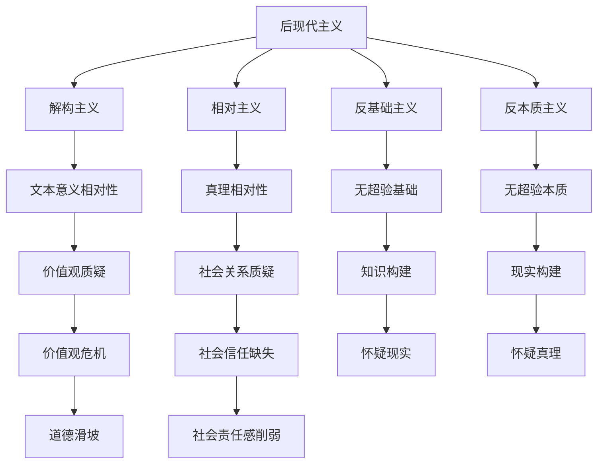

                 

### 核心概念与联系

#### 后现代主义与价值观危机

后现代主义作为一种哲学和文化思潮，起源于20世纪60年代的法国，迅速传播到全球各地。它是对现代性的一种批判，认为现代性在政治、经济、文化等方面都存在着不可调和的矛盾和危机。后现代主义的核心概念包括解构主义、相对主义、反基础主义和反本质主义等。这些概念共同构成了对现代性价值观的挑战，从而引发了一场深刻的价值观危机。

首先，解构主义由德里达提出，强调文本的意义不是固定不变的，而是在读者与文本的互动中不断生成和变化。这一观点质疑了传统的本质主义和基础主义，使得人们对自我、现实、真理等概念产生了怀疑。相对主义则认为，真理和价值观是相对的，而不是绝对的，不同文化和社会背景下，人们对同一问题的看法和价值观可能截然不同。反基础主义和反本质主义则进一步否定了一切超验的基础和本质存在，认为知识、现实和价值观都是构建出来的。

#### 价值观危机的表现

价值观危机在后现代社会中表现为多个方面。首先，传统价值观的解体是一个显著特征。随着现代社会的发展，传统的家庭、宗教、国家等价值观逐渐受到质疑和挑战。人们开始质疑这些价值观的合理性和适用性，导致社会信任的缺失和道德滑坡。其次，个体主义的兴起也是价值观危机的重要表现。个体主义强调个人自由、自我实现和利益最大化，这种观念导致了社会责任感的削弱和社会联系的松散。最后，社会信任的缺失也是一个突出的现象。在高度发达的信息社会中，虚假信息和网络欺诈等现象频发，使得人们之间的信任关系变得脆弱和复杂。

#### 后现代主义与价值观危机的联系

后现代主义和价值观危机之间存在着密切的联系。一方面，后现代主义的理论与实践促使人们重新审视和批判传统价值观，从而引发了价值观危机。另一方面，价值观危机又进一步强化了后现代主义的观点，使得人们对现实和真理的怀疑更加深刻。这种相互影响和互动使得后现代主义和价值观危机成为现代社会的两大关键现象。

为了更直观地理解这些概念之间的关系，我们可以使用Mermaid流程图来展示它们之间的关联。以下是核心概念与联系的Mermaid流程图：

通过上述流程图，我们可以清晰地看到后现代主义的核心概念如何引发对传统价值观的质疑，进而导致价值观危机。接下来，我们将进一步探讨后现代主义的理论基础和哲学根源，以及这些理论基础如何影响后现代社会的价值观。

#### 后现代主义的理论基础与哲学根源

后现代主义并非凭空出现，其理论基础和哲学根源可以追溯到现代性本身。现代性是一个复杂的、多层次的概念，它涉及到政治、经济、文化等多个领域。简而言之，现代性是指从启蒙时代以来，西方社会在科学、理性、个人主义、自由市场等方面的全面发展。然而，现代性也带来了一系列的矛盾和危机，这些矛盾和危机成为后现代主义兴起的温床。

首先，让我们回顾一下现代性的核心特征。现代性的基础是科学和理性，它强调通过观察、实验和逻辑推理来认识世界。这种科学方法不仅推动了科学革命，也促进了技术进步和社会发展。现代性还强调个人主义，认为个体应该自由地追求自己的目标和利益，这种观念体现在政治体制的民主化和经济体制的市场化中。此外，现代性还倡导自由、平等和人权，这些价值观在法律、政治和教育等方面都有所体现。

然而，现代性也存在一些内在的矛盾和危机。首先，科学和理性的发展虽然带来了技术进步，但也导致了人与自然关系的紧张。现代科技的发展使得人类对自然环境的控制能力大大增强，但这种控制也带来了一系列环境问题，如气候变化、物种灭绝等。其次，个人主义的强调虽然赋予了个体更多的自由，但也导致了社会责任感的削弱。在个人主义的框架下，个体往往只关注自己的利益，忽视了社会整体利益，这导致了社会联系的松散和社会信任的缺失。最后，现代性的自由和平等观念在实践中往往存在不平等现象。尽管法律上保障了人人平等，但在经济、社会和文化等方面，人们仍然面临不平等的现实。

这些矛盾和危机为后现代主义的兴起提供了理论基础和哲学根源。后现代主义认为，现代性的危机根源在于其内在的逻辑和观念，这些逻辑和观念需要被重新审视和批判。后现代主义的代表人物，如德里达、福柯、利奥塔等，通过他们的理论著作，对现代性的种种观念进行了深刻的批判。

德里达的解构主义理论是对现代性本质主义和基础主义的质疑。他提出，文本的意义不是固定不变的，而是在阅读过程中不断生成和变化。这一观点挑战了传统意义的稳定性和确定性，也质疑了现代性的理性主义和本质主义。福柯的权力理论则揭示了现代性中权力的运作机制。他认为，权力无处不在，不仅存在于国家机构中，也存在于社会生活的方方面面。福柯的这些观点使得人们对现代社会的权力结构和权力关系有了更深刻的认识。

利奥塔的“后现代条件”理论则进一步探讨了现代性的危机。他认为，现代性已经进入了一个后现代阶段，这是一个知识爆炸、信息泛滥的时代。在这个时代，传统的权威和知识体系已经无法有效应对复杂多变的社会现实，这导致了知识和真理的危机。利奥塔提出了“复杂性”、“不确定性”和“多样性”这三个后现代条件，这些条件挑战了现代性的基本逻辑和观念。

总的来说，后现代主义的理论基础和哲学根源是对现代性矛盾和危机的批判。后现代主义通过质疑现代性的基础和本质，揭示了现代性内在的矛盾和问题，从而为解决这些问题提供了新的思路和方法。接下来，我们将进一步探讨这些理论基础如何影响后现代社会的价值观。

#### 后现代主义与后现代社会的价值观关系

后现代主义对后现代社会的价值观产生了深远的影响，这种影响可以从个体、社会和政治等多个层面来观察。首先，在后现代主义的视角下，个体的价值观经历了一场深刻的变革。传统的个人主义观念强调个体的独特性和独立性，而后现代主义则进一步强化了这一观念，认为个体的自由和自我实现是价值的核心。这种观念的强化使得个体更加注重个人感受和体验，而不是社会的期望和规范。

具体来说，后现代主义对个体价值观的影响表现在以下几个方面：

1. **个体自由**：后现代主义强调个体的自由，认为每个人都应该有权利自由选择自己的生活方式、信仰和价值观。这种观念挑战了传统的社会规范和道德准则，使得人们对“正确”和“错误”的判断更加宽容。

2. **自我实现**：后现代主义鼓励个体追求自我实现，认为每个人都有自己的潜能和目标，应该自由地发掘和实现这些潜能。这种观念促使人们更加关注自我成长和内在满足，而不是仅仅追求物质成功和社会地位。

3. **相对主义**：后现代主义的相对主义观念认为，真理和价值观是相对的，不是绝对的。这种观念导致了对传统权威和专家意见的质疑，使得人们更加独立地思考和判断，不再盲从权威。

其次，从社会层面来看，后现代主义对传统的社会结构和价值观提出了挑战。在现代社会中，社会结构往往基于等级和分工，而后现代主义则强调平等和多元。这种观念的传播导致了社会阶层的模糊化和社会身份的多元化。

1. **社会平等**：后现代主义倡导社会平等，反对任何形式的社会歧视和不平等。这种观念在社会运动中得到了广泛传播，如性别平等运动、种族平等运动等。

2. **文化多元性**：后现代主义认为，文化是多元的，每个文化都有其独特的价值和意义。这种观念促进了文化多样性的保护和尊重，同时也带来了一定的文化冲突和融合。

3. **社会批判**：后现代主义对社会现状持批判态度，认为现代社会存在着种种不公和不合理。这种批判精神推动了社会改革和社会正义的进步。

最后，从政治层面来看，后现代主义对政治结构和政治观念也产生了影响。在传统政治体系中，权力通常集中在少数人手中，而后现代主义则主张权力的分散和平等。

1. **民主化**：后现代主义倡导民主化，认为政治决策应该更加透明、参与度更高，以确保每个人的声音都能被听到。

2. **去中心化**：后现代主义强调去中心化，反对集权和垄断。这种观念在互联网和数字技术领域得到了广泛应用，如区块链技术、分布式网络等。

3. **政治参与**：后现代主义鼓励公民积极参与政治活动，通过直接民主、社区参与等方式，提高社会的政治参与度。

总的来说，后现代主义对后现代社会的价值观产生了深刻的影响，这些影响不仅改变了人们对自我和社会的认识，也推动了社会和政治的变革。然而，这种变革也带来了一些挑战和争议，如个体自由与社会责任的平衡、文化多元性与社会统一性的冲突等。接下来，我们将进一步探讨后现代价值观危机的具体表现，以及这种危机对社会和个人带来的影响。

### 后现代价值观危机的具体表现

后现代价值观危机在后现代社会中表现为多个层面的深刻变化，这些变化不仅挑战了传统的价值观体系，也对社会结构和人际关系产生了深远影响。以下是后现代价值观危机的具体表现：

#### 1. 传统价值观的解体

在后现代主义的影响下，许多传统价值观逐渐解体。例如，在家庭方面，传统的家庭结构逐渐被多样化替代，单亲家庭、同性恋家庭、跨文化家庭等成为常态。这些变化挑战了传统家庭观念的稳定性和权威性，使得家庭关系变得更加复杂和多元。

在宗教方面，随着科学发展和理性思维的普及，人们对宗教信仰的依赖逐渐减弱。宗教传统和信仰体系在后现代社会中面临着质疑和挑战，这导致了宗教在社会中的地位下降，宗教冲突减少，但同时也引发了道德和伦理观念的模糊化。

在社会道德方面，传统的道德规范和价值观逐渐被质疑和挑战。后现代主义强调相对主义，认为道德标准是多元的，没有绝对的善恶之分。这种观念使得社会道德的底线变得模糊，道德相对主义成为主流，人们更倾向于根据自己的价值观来评判行为，而不是遵循统一的标准。

#### 2. 个体主义的兴起

个体主义在后现代社会中得到了进一步强化。个体主义强调个人自由、自我实现和利益最大化。这种观念在个人层面上表现为对个人权利和自由的追求，但在社会层面上则可能导致社会责任感的削弱。

个体主义的一个显著表现是人们对自我实现和内在满足的追求。越来越多的人开始关注个人成长和内心体验，追求自我价值实现，而不是仅仅追求物质财富和社会地位。这种趋势在一定程度上促进了社会的多样性和创新，但同时也可能导致社会联系的松散和社区精神的削弱。

此外，个体主义的兴起还带来了个人主义和集体主义之间的冲突。在传统社会中，集体主义观念占据主导地位，强调个人应该为集体利益服务。而后现代个体主义则强调个人的独特性和自由，这可能导致对集体利益和社会责任的忽视。

#### 3. 社会信任的缺失

社会信任是维系社会稳定和发展的基础。然而，在后现代社会的背景下，社会信任面临着严重的危机。首先，信息的不对称和虚假信息的泛滥导致了人们之间的信任危机。在互联网时代，信息的传播速度极快，但同时也带来了信息真伪难以辨别的问题。虚假新闻、网络欺诈等现象频发，使得人们对信息来源和真实性产生了怀疑，进而影响了社会信任。

其次，社会不平等和贫富差距的扩大也是导致社会信任缺失的一个重要因素。在经济全球化的大背景下，贫富差距日益扩大，社会阶层分化明显。这种不平等现象导致社会成员之间的信任关系受到挑战，人们更倾向于怀疑他人的动机和诚信，社会信任基础变得脆弱。

此外，社会结构的变动和快速变化也削弱了社会信任。在后现代社会，人们的价值观和生活方式变得更加多元和复杂，社会关系变得松散和流动。这种变化使得社会成员之间的信任关系变得更加难以建立和维护。

#### 4. 道德滑坡

后现代价值观危机还表现为道德滑坡的现象。随着传统价值观的解体和社会信任的缺失，道德标准和行为规范变得模糊和不确定。人们更倾向于根据自己的价值观和利益来评判行为，而不是遵循统一的社会道德准则。

道德滑坡的一个显著表现是道德相对主义成为主流观念。在道德相对主义观念下，没有绝对的善恶之分，每种行为都有其合理的解释和理由。这种观念虽然赋予了个体更大的道德自由，但也导致了道德判断的模糊化和行为规范的不确定性。

此外，道德滑坡还表现为道德规范的削弱。在传统社会中，道德规范往往通过家庭、宗教、教育等渠道传递和强化。然而，在后现代社会，这些传统渠道的影响力逐渐减弱，新的道德规范和价值观尚未形成，导致道德规范的混乱和不确定性。

总的来说，后现代价值观危机在后现代社会中表现为传统价值观的解体、个体主义的兴起、社会信任的缺失和道德滑坡。这些危机不仅挑战了传统的价值体系，也对社会的稳定和发展产生了深远影响。接下来，我们将进一步探讨这些危机对社会和个人带来的具体影响和挑战。

#### 社会和个人层面的影响

后现代价值观危机对社会和个人层面的影响是多方面的，既带来了挑战，也提供了机遇。首先，从社会层面来看，价值观危机对社会结构、政治体制和社会信任等方面产生了深远影响。

在社会结构方面，传统价值观的解体和个体主义的兴起导致社会成员之间的联系变得更加松散和多元。家庭、宗教、国家等传统社会结构的基础受到挑战，新型社会关系逐渐形成，如网络社区、兴趣小组等。这种变化既促进了社会的多样性和创新，也带来了一定的社会不稳定和信任危机。

在政治体制方面，后现代价值观危机对民主和权威提出了新的挑战。个体主义强调个人自由和自我实现，这要求政治体制更加开放和包容，确保每个个体的声音都能被听到。然而，这也可能导致政治极化和分裂，民主制度面临新的困境。如何在保障个体自由的同时，维护社会的整体利益和团结，成为政治体制面临的重要问题。

社会信任的缺失是后现代价值观危机的另一个重要表现。信息的不对称和虚假信息的泛滥，以及社会不平等和贫富差距的扩大，导致社会成员之间的信任关系变得脆弱。社会信任的缺失不仅影响了社会的稳定和发展，也削弱了社会凝聚力和集体行动的能力。

从个人层面来看，后现代价值观危机对个体的价值观、心理健康和社会行为产生了深刻影响。

首先，个体价值观的多元化使得人们对自己的生活方式和选择更加宽容，但也带来了价值观冲突和心理压力。在相对主义观念下，个体需要不断调整自己的价值观，以适应不同的社会和文化环境。这种变化虽然促进了个体自由和多样性，但也可能导致心理困惑和价值迷失。

其次，心理健康问题在价值观危机背景下变得更加突出。个体在追求自我实现的过程中，可能会面临内在冲突和焦虑。如何在自我实现和社会责任之间找到平衡，成为个体心理健康的重要问题。

最后，后现代价值观危机对个体的社会行为也产生了影响。个体在价值观多元和不确定的环境中，可能更加倾向于追求短期利益和个人满足，而忽视社会整体利益和长期发展。这种变化可能导致社会道德滑坡和信任危机的进一步加剧。

总的来说，后现代价值观危机对社会和个人层面产生了深远的影响，既带来了挑战，也提供了机遇。如何在价值观多元和不确定的环境中，找到平衡和解决方案，成为现代社会和个人面临的重要课题。

### 后现代主义与后现代价值观危机的关联

后现代主义与后现代价值观危机之间存在着紧密的关联。首先，后现代主义是一种哲学和文化思潮，它质疑和批判现代性的基础和本质，从而引发了一系列价值观危机。具体来说，后现代主义的核心观点包括解构主义、相对主义、反基础主义和反本质主义，这些观点共同构成了对传统价值观的挑战。

解构主义由德里达提出，强调文本的意义不是固定不变的，而是在读者与文本的互动中不断生成和变化。这一观点质疑了传统意义的稳定性和确定性，使得人们对自我、现实、真理等概念产生了怀疑。相对主义则认为，真理和价值观是相对的，而不是绝对的，不同文化和社会背景下，人们对同一问题的看法和价值观可能截然不同。反基础主义和反本质主义进一步否定了一切超验的基础和本质存在，认为知识、现实和价值观都是构建出来的。

这些观点共同构成了对传统价值观的批判和质疑，从而引发了一系列价值观危机。首先，后现代主义的解构主义和相对主义观点挑战了传统价值观的基础，使得人们对自我认同和社会规范产生了怀疑。这种怀疑导致了个体价值观的多元化和社会信任的缺失。其次，反基础主义和反本质主义的观点质疑了传统知识的权威性，使得人们更加倾向于独立思考和判断，而不是盲从权威。这种变化既促进了知识的多样性和创新，也导致了社会共识的缺失和价值观的混乱。

此外，后现代主义还强调个体自由和自我实现，这进一步加剧了价值观危机。在个体主义的框架下，个体更加注重个人感受和体验，而不是社会的期望和规范。这种观念的强化导致了社会责任感的削弱和社会联系的松散。同时，个体追求自我实现的过程中，可能会面临内在冲突和焦虑，这也加剧了价值观危机。

总之，后现代主义通过质疑和批判现代性的基础和本质，引发了价值观危机。这些危机不仅挑战了传统的价值观体系，也对社会的稳定和发展产生了深远影响。理解后现代主义与后现代价值观危机之间的关联，有助于我们更好地应对现代社会中的各种挑战。

### 后现代价值观危机的解决策略

面对后现代价值观危机，我们需要从多个层面提出解决方案，以重建社会信任、恢复道德秩序，并促进个体与社会的和谐发展。以下是具体的解决策略：

#### 1. 教育改革

教育是价值观形成和传递的重要途径。因此，教育改革是解决后现代价值观危机的关键。首先，教育应该注重批判性思维的培养，鼓励学生独立思考、质疑权威，培养他们面对复杂多变的社会现实的应变能力。其次，教育应该强调道德教育的重要性，通过案例教学、道德讨论等方式，帮助学生建立正确的道德观念和行为准则。此外，教育还应该注重文化多样性教育，使学生了解和尊重不同的文化和价值观，促进社会包容性和和谐发展。

#### 2. 媒体责任

媒体在塑造社会价值观方面具有巨大影响力。为了解决后现代价值观危机，媒体应该承担起社会责任，传播正能量，避免虚假信息和不良内容的传播。首先，媒体应该提高自身的新闻专业性和道德标准，确保信息的真实性和客观性。其次，媒体应该加强舆论引导，积极传播积极向上、富有建设性的声音，促进社会共识的形成。此外，媒体还可以利用数字技术，提供多样化的信息渠道和互动平台，使公众能够更加便捷地获取信息和表达观点。

#### 3. 社会参与

社会参与是增强社会信任和凝聚力的有效途径。政府和社会组织应该积极推动公众参与社会事务，提高公民的参与度和责任感。首先，政府可以通过立法和政策，保障公民的基本权利和自由，鼓励公众参与公共事务的讨论和决策。其次，社会组织可以开展多样化的公益活动和社会服务，增强社会成员之间的联系和互动。此外，社区建设也是促进社会参与的重要方式，通过社区活动，居民可以共同参与社区管理和公共事务，增强社区凝聚力和归属感。

#### 4. 道德重建

道德重建是解决后现代价值观危机的根本途径。首先，社会应该倡导和弘扬传统美德，如诚实、守信、友善等，使这些美德成为社会成员的共同价值观。其次，社会应该制定和实施道德规范和行为准则，明确社会成员的行为边界和道德责任。此外，道德重建还需要通过家庭教育、学校教育、社会教育等多渠道进行，使道德观念深入人心，成为人们日常行为和决策的指南。

#### 5. 增强社会信任

社会信任是维系社会稳定和发展的基础。为了增强社会信任，首先，社会应该加强法治建设，确保法律的有效实施和社会公正。其次，社会应该建立和完善信用体系，通过信用评价和监管，规范市场秩序和社会行为。此外，社会应该鼓励和推广诚信文化，使诚信成为社会成员的自觉行为和价值观。通过这些措施，可以逐步恢复社会信任，增强社会的凝聚力和稳定性。

总之，解决后现代价值观危机需要多方面的努力和合作。通过教育改革、媒体责任、社会参与、道德重建和增强社会信任等策略，我们可以逐步重建社会价值观体系，促进社会的和谐发展。

### 全文总结与未来展望

在后现代社会的背景下，价值观危机已经成为一个不容忽视的重要问题。通过对后现代主义的理论基础、价值观危机的具体表现以及解决策略的深入探讨，我们可以清晰地看到，这一危机不仅挑战了传统的价值体系，也对社会的稳定和发展产生了深远影响。后现代主义强调解构主义、相对主义、反基础主义和反本质主义等核心观点，这些观点使得人们对自我、现实和真理产生了深刻的怀疑，进而导致了传统价值观的解体、个体主义的兴起和社会信任的缺失。

面对这一危机，我们需要采取多方面的策略，包括教育改革、媒体责任、社会参与、道德重建和增强社会信任等。这些策略旨在重建社会价值观体系，促进社会的和谐发展。然而，解决价值观危机并非一蹴而就，它需要长期的努力和持续的探索。

在未来的发展中，后现代价值观可能会呈现出更加多元化、相对化的趋势。这意味着我们需要更加开放和包容的心态，尊重不同的价值观和生活方式。同时，我们还需要关注新兴技术和社会变革对价值观的影响，以适应不断变化的社会环境。

总之，后现代价值观危机是一个复杂而严峻的挑战，但也是一个重要的机遇。通过深刻理解这一危机的本质，采取有效的解决策略，我们可以为社会的和谐发展奠定坚实的基础。作者：AI天才研究院/AI Genius Institute & 禅与计算机程序设计艺术 /Zen And The Art of Computer Programming。

---

### 拓展阅读与讨论

在探讨后现代社会的价值观危机时，读者可能会对相关理论和实践有更深入的兴趣。以下是一些推荐的拓展阅读资源，以及潜在的讨论话题：

#### 拓展阅读

1. **《解构主义》 - Jacques Derrida**  
   作者德里达是解构主义的奠基人，他的著作详细阐述了解构主义的核心观点和方法，对理解后现代主义和价值观危机至关重要。

2. **《资本主义的文化逻辑》 - Jean-François Lyotard**  
   利奥塔的这本书分析了资本主义文化逻辑的演变，探讨了后现代主义如何挑战现代性的文化基础。

3. **《现代性的后果》 - Anthony Giddens**  
   吉登斯在这本书中探讨了现代性对社会结构、文化观念和价值观的影响，以及这些影响如何引发社会危机。

#### 讨论话题

1. **后现代主义与相对主义的关系**  
   后现代主义的相对主义观点是否会导致道德和伦理的相对化？如何在这种相对主义中找到道德共识？

2. **个体主义与社会责任**  
   个体主义在强调个人自由和自我实现的同时，如何平衡与社会责任的关系？

3. **社会信任的重建**  
   在信息泛滥和社交媒体时代，社会信任如何重建？隐私、数据保护和网络伦理在这一过程中扮演什么角色？

4. **教育与价值观的传承**  
   教育如何在后现代背景下传承和维护传统价值观？教育制度需要哪些改革来应对价值观危机？

5. **后现代主义与全球化**  
   后现代主义如何影响全球化进程？全球化对后现代价值观危机有何影响？

通过深入阅读和讨论这些资源，读者可以进一步理解后现代价值观危机的复杂性，并探索可能的解决路径。这不仅可以丰富读者的知识体系，也有助于在理论和实践中找到应对危机的方法。作者：AI天才研究院/AI Genius Institute & 禅与计算机程序设计艺术 /Zen And The Art of Computer Programming。

