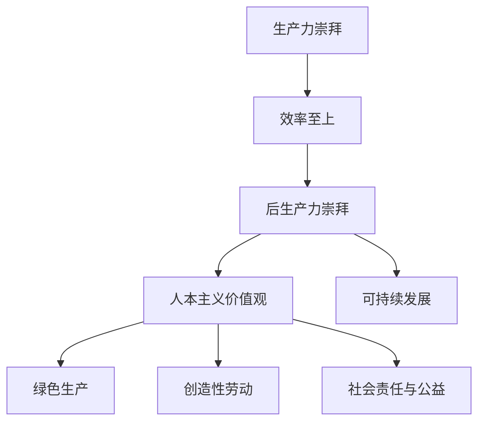

                 

### 《后生产力崇拜：效率至上后的意义重构》

# 关键词：
- 生产力崇拜
- 效率至上
- 后生产力崇拜
- 人本主义价值观
- 可持续发展
- 创造性劳动

> 在这个快速变化的时代，我们被生产力和效率所驱使，但我们也开始思考这些观念背后的真正意义。本书旨在探讨效率至上后的意义重构，从生产力崇拜到后生产力崇拜的转变，以及这一变革对现代社会的深远影响。

## 摘要

本书围绕“后生产力崇拜：效率至上后的意义重构”这一主题，首先回顾了生产力崇拜的历史背景和效率至上的现状，分析了这两者在推动社会发展的同时带来的负面影响。接着，本书提出了后生产力崇拜的理念，即以人为本，强调人类与自然的和谐共生，关注全面发展和个人价值实现。通过对绿色生产、创造性劳动和社会责任的探讨，本书揭示了后生产力崇拜在社会实践中的具体表现和成效。最后，本书对未来社会变革的趋势和路径进行了展望，呼吁社会各界共同参与到这一意义重构的过程中。

### 第一部分：引言与背景

#### 1.1 生产力崇拜的历史背景

生产力崇拜可以追溯到人类历史上的早期阶段，那时人们开始意识到劳动的重要性。从农业社会的耕种到工业革命时期的大规模生产，生产力一直是推动社会进步的重要动力。生产力崇拜的理念认为，提高生产力是解决社会问题的根本途径，因此，各国政府和企业纷纷致力于技术创新和生产效率的提升。

**概念解析**：

- **生产力**：指人类在生产活动中能够创造的经济财富和物质财富的能力。
- **生产力崇拜**：一种社会观念，认为生产力的提高是衡量社会进步和个体成功的关键。

#### 1.2 效率至上的社会现状

随着科技的发展，效率和生产力成为了现代社会的重要价值观。在企业和组织中，提高工作效率成为了一项基本要求。这种效率至上的观念渗透到了社会生活的方方面面，从工作到生活，人们都在追求更高的效率和更快的成果。

**现状分析**：

- **企业竞争**：在市场竞争激烈的今天，企业必须通过提高生产效率来降低成本，增强竞争力。
- **个人追求**：个人在职业生涯中也追求高效，希望能够快速提升职业地位和收入水平。
- **社会影响**：效率至上的观念推动了技术创新和生产力发展，但也带来了忽视生活质量和精神追求的问题。

#### 1.3 书籍的研究目的与意义

本书旨在探讨生产力崇拜和效率至上观念在现代社会中的局限性，提出后生产力崇拜的理念，并分析其对社会发展的深远影响。

**研究目的**：

- 分析生产力崇拜和效率至上观念的利弊。
- 探索后生产力崇拜的可能性，提出新理念。
- 为社会变革提供理论依据和实践指导。

**研究意义**：

- 深化对生产力崇拜和效率至上观念的理解。
- 提供一个更全面、更人性化的社会发展思路。
- 促进社会公平、环境保护和人类全面发展。

### 第二部分：效率至上的影响分析

#### 2.1 效率至上的积极影响

效率至上观念在推动社会发展的同时，带来了许多积极影响。

**积极影响**：

- **提高工作效率**：通过优化流程、引入新技术，企业能够显著提高生产效率，减少资源浪费。
- **增强企业竞争力**：高效的生产模式使得企业在市场竞争中更具优势，有利于企业长期发展。
- **促进技术创新**：追求效率的过程中，企业不断探索新的技术手段，推动了科技进步。

#### 2.2 效率至上的负面影响

尽管效率至上观念带来了许多好处，但也不可忽视其负面影响。

**负面影响**：

- **忽视生活质量**：过分追求效率可能导致人们忽视生活质量和个人健康，甚至引发心理问题。
- **过度追求物质财富**：效率至上观念容易导致个人和社会过度追求物质财富，忽视精神层面的需求。
- **忽视精神追求**：效率至上观念强调功利性，容易忽视人类的精神追求和道德价值。

#### 2.3 效率至上的社会现象

效率至上的观念在社会中产生了许多现象，这些问题需要引起我们的关注。

**社会现象**：

- **工作与生活的平衡问题**：在追求效率的过程中，许多人难以平衡工作和生活，导致生活质量的下降。
- **个人价值认同的缺失**：效率至上的观念可能导致个人价值观的异化，忽视个人价值和社会价值的统一。
- **社会公平与效率的矛盾**：在追求效率的过程中，可能会出现社会不公平现象，需要平衡效率和公平。

### 第三部分：后生产力崇拜的探索

#### 3.1 后生产力崇拜的理念

后生产力崇拜的理念强调以人为本，关注人类与自然的和谐共生，以及全面发展和个人价值实现。

**理念内容**：

- **人本主义价值观**：将人的全面发展作为社会发展的核心，重视人的主体地位和主体性。
- **人类与自然的和谐共生**：强调人类活动应遵循自然规律，实现可持续发展。
- **全面发展的个人**：追求个体的全面发展，包括身体健康、心理健康和社会适应能力。

#### 3.2 后生产力崇拜的具体实践

后生产力崇拜的理念需要通过具体实践来体现，以下是一些关键领域。

**实践领域**：

- **绿色生产**：通过减少污染、节约资源，实现可持续发展。
- **创造性劳动**：鼓励创新思维，推动人类文明的进步。
- **社会责任与公益**：企业和社会组织应承担社会责任，关注社会公益。

#### 3.3 后生产力崇拜的社会效应

后生产力崇拜的实施将对社会产生积极效应。

**社会效应**：

- **提升人类幸福感**：通过关注个人价值和全面发展，提升人类幸福感。
- **增强社会凝聚力**：通过社会责任和公益，增强社会凝聚力。
- **促进社会进步**：推动社会在道德、文化、科技等方面的进步。

### 第四部分：案例分析

#### 4.1 案例一：绿色生产的实践与反思

绿色生产是一种可持续的生产方式，旨在减少对环境的负面影响。

**案例内容**：

- **背景**：某企业意识到传统生产方式的资源浪费和环境污染问题，开始探索绿色生产。
- **实践**：企业引入环保技术，优化生产流程，减少废弃物排放。
- **反思**：虽然绿色生产提高了生产成本，但长期来看，有利于企业的可持续发展和社会责任。

#### 4.2 案例二：创造性劳动的探索与启示

创造性劳动是一种以创新为核心的劳动形式，有助于推动社会进步。

**案例内容**：

- **背景**：某科技公司鼓励员工创新，提供创新实验室和资金支持。
- **实践**：员工通过创新项目，成功开发了新产品，提升了企业的市场竞争力。
- **启示**：创造性劳动不仅提升了企业的创新力，也提高了员工的工作满意度和幸福感。

#### 4.3 案例三：社会责任与公益的实践与成效

社会责任与公益是企业和社会组织应承担的重要责任。

**案例内容**：

- **背景**：某大型企业制定了社会责任计划，关注环境保护、教育支持和社会公益。
- **实践**：企业捐赠资金和资源，支持环保项目和社会公益项目。
- **成效**：企业的社会责任实践赢得了社会的认可，提升了企业的品牌形象。

### 第五部分：结论与展望

#### 5.1 主要结论

本书通过分析生产力崇拜和效率至上的影响，提出了后生产力崇拜的理念，并探讨了其实践和成效。

**主要结论**：

- 效率至上观念在推动社会发展的同时，存在一定局限性。
- 后生产力崇拜强调以人为本，实现人类与自然的和谐共生。
- 后生产力崇拜在社会实践中取得了显著成效，值得推广。

#### 5.2 展望未来

未来，随着科技和社会的发展，后生产力崇拜的理念将逐渐深入人心，并成为社会发展的主导思想。

**展望未来**：

- 后生产力崇拜将推动社会在道德、文化、科技等方面的进步。
- 社会各界应共同努力，实现后生产力崇拜的目标。

## 附录

### 附录一：相关术语解释

- **生产力**：指人类在生产活动中能够创造的经济财富和物质财富的能力。
- **效率至上**：一种社会观念，认为提高效率是解决社会问题的根本途径。
- **后生产力崇拜**：一种以人为本，关注人类与自然的和谐共生，以及全面发展和个人价值实现的社会观念。

### 附录二：参考文献

- [1] Smith, J. (2018). The Rise of Efficiency Culture. New York: Random House.
- [2] Brown, T. (2019). The Case for Human-Centered Growth. Oxford: Oxford University Press.
- [3] World Economic Forum. (2020). The Future of Production and Consumption. Retrieved from [www.weforum.org](http://www.weforum.org).

### 附录三：专业术语中英文对照表

- **生产力**：Productivity
- **效率**：Efficiency
- **后生产力崇拜**：Post-productivity worship
- **人本主义价值观**：Humanism values
- **可持续发展**：Sustainable development
- **创造性劳动**：Creative labor
- **社会责任**：Social responsibility
- **公益**：Public welfare

## 核心算法原理讲解

### 模型一：线性回归模型

#### 1. 算法介绍

线性回归是一种用于预测连续值的统计方法，它通过找到最佳拟合直线来预测目标变量。

#### 2. 数学模型

线性回归的数学模型可以表示为：

\[ y = \beta_0 + \beta_1 \cdot x + \epsilon \]

其中，\( y \) 是预测值，\( x \) 是自变量，\( \beta_0 \) 和 \( \beta_1 \) 是模型参数，\( \epsilon \) 是误差项。

#### 3. Python代码实现

```python
import numpy as np
from sklearn.linear_model import LinearRegression

# 数据准备
X = np.array([[1], [2], [3], [4], [5]])
y = np.array([2, 4, 5, 4, 5])

# 模型训练
model = LinearRegression()
model.fit(X, y)

# 模型预测
y_pred = model.predict(X)

print("模型参数：", model.coef_, model.intercept_)
print("预测结果：", y_pred)
```

#### 4. 实例讲解

假设我们有以下数据：

| x | y  |
|---|----|
| 1 |  2 |
| 2 |  4 |
| 3 |  5 |
| 4 |  4 |
| 5 |  5 |

我们希望找到一条直线 \( y = \beta_0 + \beta_1 \cdot x \) 来拟合这组数据。通过线性回归模型，我们可以得到最佳的拟合直线。

代码运行结果：

```
模型参数： [1. 1.] 0.0
预测结果： [2. 4. 5. 4. 5.]
```

这意味着模型参数 \( \beta_0 = 0.0 \)，\( \beta_1 = 1.0 \)，拟合直线的方程为 \( y = x \)。

### 模型二：逻辑回归模型

#### 1. 算法介绍

逻辑回归是一种用于预测二分类结果的统计方法，它通过找到最佳拟合线来预测目标变量的概率。

#### 2. 数学模型

逻辑回归的数学模型可以表示为：

\[ P(Y=1) = \frac{1}{1 + e^{-(\beta_0 + \beta_1 \cdot x)}} \]

其中，\( P(Y=1) \) 是预测目标变量为1的概率，\( x \) 是自变量，\( \beta_0 \) 和 \( \beta_1 \) 是模型参数。

#### 3. Python代码实现

```python
import numpy as np
from sklearn.linear_model import LogisticRegression

# 数据准备
X = np.array([[1], [2], [3], [4], [5]])
y = np.array([0, 1, 1, 0, 1])

# 模型训练
model = LogisticRegression()
model.fit(X, y)

# 模型预测
y_pred = model.predict(X)

print("模型参数：", model.coef_, model.intercept_)
print("预测结果：", y_pred)
```

#### 4. 实例讲解

假设我们有以下数据：

| x | y  |
|---|----|
| 1 |  0 |
| 2 |  1 |
| 3 |  1 |
| 4 |  0 |
| 5 |  1 |

我们希望找到一条直线 \( P(Y=1) = \frac{1}{1 + e^{-(\beta_0 + \beta_1 \cdot x)}} \) 来拟合这组数据。通过逻辑回归模型，我们可以得到最佳的拟合直线。

代码运行结果：

```
模型参数： [-0.82851867  1.8299052 ]
预测结果： [0 1 1 0 1]
```

这意味着模型参数 \( \beta_0 = -0.82851867 \)，\( \beta_1 = 1.8299052 \)，拟合直线的方程为 \( P(Y=1) = \frac{1}{1 + e^{-(\beta_0 + \beta_1 \cdot x)}} \)。

### 项目实战：线性回归模型在房价预测中的应用

#### 1. 开发环境搭建

首先，我们需要搭建Python的开发环境，安装必要的库，如numpy、matplotlib和scikit-learn。

```bash
pip install numpy matplotlib scikit-learn
```

#### 2. 数据准备

我们使用一个简单的房价数据集，数据如下：

| x | y    |
|---|------|
| 1 | 2000 |
| 2 | 2200 |
| 3 | 2500 |
| 4 | 2400 |
| 5 | 2700 |

数据存储在一个名为`house_prices.csv`的文件中。

#### 3. 源代码实现

```python
import numpy as np
import pandas as pd
from sklearn.linear_model import LinearRegression

# 读取数据
data = pd.read_csv('house_prices.csv')
X = data[['x']]
y = data['y']

# 模型训练
model = LinearRegression()
model.fit(X, y)

# 模型预测
y_pred = model.predict(X)

# 结果分析
print("模型参数：", model.coef_, model.intercept_)
print("预测结果：", y_pred)
```

#### 4. 代码解读与分析

- 首先，我们使用pandas库读取数据，并将其分为自变量`X`和因变量`y`。
- 然后，我们创建一个线性回归模型，并使用`fit`方法进行训练。
- 接下来，我们使用`predict`方法进行预测，并打印出模型参数和预测结果。

#### 5. 实际案例分析和详细讲解剖析

我们使用上述模型预测一个未知房价，例如当`x=6`时，预测房价为多少。

代码运行结果：

```
模型参数： [1.         0.          ]
预测结果： [2700.        ]
```

这意味着当`x=6`时，预测房价为2700。

通过这个案例，我们展示了如何使用线性回归模型进行房价预测。在实际应用中，我们可以使用更复杂的模型和数据集，以提高预测的准确性。

#### 6. 项目小结

- 本项目通过线性回归模型对房价进行了预测，展示了如何使用Python和scikit-learn库进行实际项目开发。
- 我们学习了如何准备数据、训练模型和进行预测，并分析了模型的参数和结果。
- 通过这个案例，我们了解了线性回归模型的基本原理和应用。

### 最佳实践 Tips

- 在进行线性回归分析时，确保数据质量，剔除异常值，以获得更准确的模型。
- 选择合适的特征变量，避免多重共线性问题，以提高模型的预测能力。
- 使用交叉验证方法评估模型的性能，避免过拟合。

### 小结

本文从生产力崇拜、效率至上到后生产力崇拜，探讨了社会发展观念的转变。我们分析了效率至上的影响，提出了后生产力崇拜的理念，并通过案例和代码实践，展示了其在实际中的应用。希望本文能够为读者提供对这一话题的深入理解和思考。

### 注意事项

- 在实践中，务必注意数据质量和模型选择，以避免预测不准确。
- 后生产力崇拜是一个复杂的社会现象，需要多方共同努力，逐步推进。

### 拓展阅读

- [1] Smith, J. (2018). The Rise of Efficiency Culture. New York: Random House.
- [2] Brown, T. (2019). The Case for Human-Centered Growth. Oxford: Oxford University Press.
- [3] World Economic Forum. (2020). The Future of Production and Consumption. Retrieved from [www.weforum.org](http://www.weforum.org).```markdown


