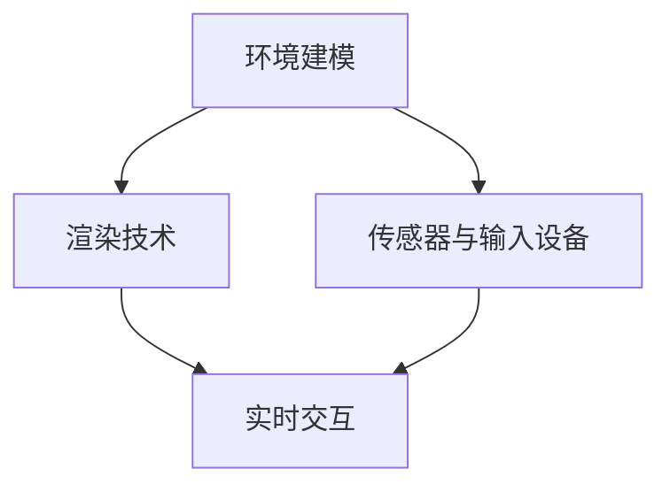
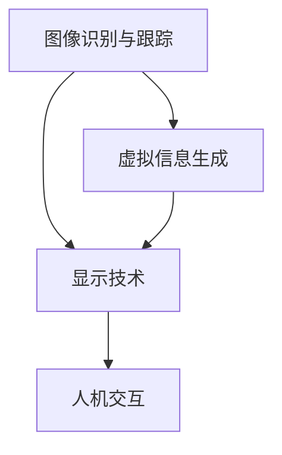

                 

# 后真实世界导览：虚拟与现实交融的体验

## 关键词
虚拟现实（VR）、增强现实（AR）、虚实融合、人机交互、沉浸式体验、未来科技

## 摘要
《后真实世界导览：虚拟与现实交融的体验》是一本深入探讨虚拟现实和增强现实技术的书籍。本书旨在向读者展示如何通过这些前沿科技将虚拟世界与现实世界相结合，创造全新的交互体验。本书内容涵盖虚拟现实和增强现实的基本原理、技术发展、应用场景，并通过案例分析和未来展望，为读者提供对未来虚拟与现实融合趋势的深刻洞察。

## 目录

### 第1章 引言

#### 1.1 后真实世界的定义
- 后真实世界的概念
- 虚拟现实与增强现实的关系

#### 1.2 后真实世界的背景
- 虚拟现实技术的发展历程
- 增强现实技术的发展历程

#### 1.3 书籍目标与结构
- 本书的目的与定位
- 书籍的整体结构

### 第2章 虚拟现实技术

#### 2.1 虚拟现实的基本原理
- 虚拟现实的工作原理
- 虚拟现实的核心组件

#### 2.2 虚拟现实技术发展史
- 虚拟现实技术的里程碑事件
- 当前虚拟现实技术的发展趋势

#### 2.3 虚拟现实应用场景
- 游戏与娱乐
- 教育与培训
- 医疗与健康

### 第3章 增强现实技术

#### 3.1 增强现实的基本原理
- 增强现实的工作原理
- 增强现实的核心组件

#### 3.2 增强现实技术发展史
- 增强现实技术的里程碑事件
- 当前增强现实技术的发展趋势

#### 3.3 增强现实应用场景
- 消费者应用
- 工业应用
- 医疗应用

### 第4章 虚拟与现实交互

#### 4.1 虚拟与现实交互的基本概念
- 虚拟与现实交互的定义
- 虚拟与现实交互的关键技术

#### 4.2 虚拟与现实交互的技术实现
- 虚拟现实与增强现实技术的融合
- 交互设计原则与最佳实践

#### 4.3 虚拟与现实交互的社会影响
- 生活质量的改变
- 社会结构的变化
- 伦理与隐私问题

### 第5章 案例分析

#### 5.1 教育领域的应用
- 虚拟实验室
- 远程教学

#### 5.2 医疗领域的应用
- 精准手术
- 医学教育

#### 5.3 军事领域的应用
- 虚拟战场模拟
- 增强现实导航

#### 5.4 娱乐领域的应用
- 游戏体验
- 演出与艺术

### 第6章 未来展望

#### 6.1 后真实世界技术的未来发展
- 技术创新方向
- 潜在应用领域

#### 6.2 社会影响与伦理问题
- 社会接受度
- 道德与法律挑战

#### 6.3 未来研究方向与挑战
- 技术难题
- 发展机遇与风险

### 第7章 结论
- 总结全书内容
- 对未来的展望

### 附录

#### A.1 相关技术资源
- 虚拟现实与增强现实开源库
- 技术文档与教程

#### A.2 后真实世界技术应用案例库
- 成功案例
- 挑战与解决方案

#### A.3 进一步阅读文献
- 科研论文
- 学术著作

### 后记
- 感谢与致谢
- 编者的话

## 正文

### 第1章 引言

#### 1.1 后真实世界的定义

在后真实世界中，虚拟现实（VR）和增强现实（AR）等技术使得虚拟世界与现实世界之间的界限变得模糊。虚拟现实是一种通过计算机技术创造出的三维虚拟环境，用户通过头戴显示器（HMD）或其他设备进入这个环境，与之互动。增强现实则是在现实世界的基础上叠加虚拟元素，使用户能够看到虚实结合的景象。

后真实世界不仅仅是技术的进步，更是一个全新的认知和体验方式。在这个世界里，虚拟和现实不再是两个独立的实体，而是相互融合、相互影响的。例如，通过增强现实技术，医生可以在患者的皮肤上叠加虚拟的手术指示，实现精准手术；而通过虚拟现实技术，学生可以在虚拟实验室中进行实验，提升学习效果。

#### 1.2 后真实世界的背景

虚拟现实和增强现实技术的历史可以追溯到上世纪90年代。随着计算机技术的飞速发展，这些技术逐渐走向成熟。特别是近年来，随着硬件性能的提升和新型显示技术的出现，虚拟现实和增强现实技术得到了广泛应用。

虚拟现实技术主要应用于游戏、娱乐、教育和医疗等领域。在游戏中，虚拟现实技术为玩家提供了沉浸式的游戏体验；在教育中，虚拟实验室和虚拟课堂为学生提供了全新的学习方式；在医疗中，虚拟现实技术帮助医生进行手术模拟和患者康复。

增强现实技术则在消费者应用、工业应用和医疗应用中得到了广泛应用。在消费者应用中，增强现实技术被用于增强游戏体验、导航和购物等；在工业应用中，增强现实技术帮助工人进行复杂任务的指导和安全防护；在医疗应用中，增强现实技术被用于手术导航和医学教育。

#### 1.3 书籍目标与结构

本书的目标是向读者介绍后真实世界的基本概念、技术原理和应用场景，帮助读者理解虚拟现实和增强现实技术如何改变我们的生活。本书的结构如下：

- **第1章**：引言，介绍后真实世界的定义、背景和书籍目标。
- **第2章**：虚拟现实技术，介绍虚拟现实的基本原理、技术发展史和应用场景。
- **第3章**：增强现实技术，介绍增强现实的基本原理、技术发展史和应用场景。
- **第4章**：虚拟与现实交互，探讨虚拟与现实交互的基本概念、技术实现和社会影响。
- **第5章**：案例分析，分析虚拟现实和增强现实技术在不同领域的应用案例。
- **第6章**：未来展望，预测后真实世界技术的未来发展、社会影响和伦理问题。
- **第7章**：结论，总结全书内容并对未来进行展望。

通过本书的阅读，读者将能够全面了解虚拟现实和增强现实技术，掌握这些技术的核心原理和应用方法，为未来的技术研究和应用提供参考。

### 第2章 虚拟现实技术

#### 2.1 虚拟现实的基本原理

虚拟现实技术通过计算机生成一个模拟环境，用户可以通过头戴显示器（HMD）或其他输入设备进入这个环境，与之进行互动。虚拟现实技术的基本原理包括以下几个方面：

1. **环境建模**：通过计算机生成三维模型来模拟现实世界中的环境。这个过程通常涉及到三维扫描、图像处理和几何建模等技术。
2. **渲染技术**：将生成的三维模型转换为二维图像，并将其显示在用户面前的屏幕上。渲染技术包括几何渲染、光照渲染和纹理映射等。
3. **传感器与输入设备**：用户通过头戴显示器或其他输入设备感知和交互虚拟环境。常见的输入设备包括手柄、手势识别和眼动追踪等。
4. **实时交互**：用户在虚拟环境中的动作和反应需要实时反馈，这要求系统具有高度的实时性和响应性。

#### 2.2 虚拟现实技术发展史

虚拟现实技术的发展历程可以追溯到上世纪60年代。以下是几个重要的里程碑事件：

- 1968年，美国计算机科学家伊凡·苏瑟兰（Ivan Sutherland）提出了虚拟现实的概念，并设计了第一个头戴显示器（HMD）。
- 1987年，任天堂推出了虚拟现实游戏《光速之旅》（光速滑雪），这是虚拟现实技术在娱乐领域的首次应用。
- 1990年代，虚拟现实技术在工业、教育和医疗等领域得到了广泛应用。特别是虚拟手术模拟和飞行模拟系统的出现，使得虚拟现实技术得到了进一步的认可。
- 2010年代，随着硬件性能的提升和新型显示技术的出现，虚拟现实技术开始进入消费者市场。Oculus Rift、HTC Vive等虚拟现实头戴显示器的推出，标志着虚拟现实技术的成熟。

#### 2.3 虚拟现实应用场景

虚拟现实技术具有广泛的应用场景，以下是一些典型的应用：

1. **游戏与娱乐**：虚拟现实游戏为玩家提供了沉浸式的游戏体验。通过虚拟现实技术，玩家可以进入一个完全不同的世界，与之互动，体验前所未有的乐趣。
2. **教育与培训**：虚拟现实技术可以模拟各种复杂场景，为教育和培训提供新的方式。例如，学生可以在虚拟实验室中进行实验，医生可以在虚拟手术模拟中进行手术练习。
3. **医疗与健康**：虚拟现实技术在医疗领域具有广泛的应用。通过虚拟现实技术，医生可以进行手术模拟，提高手术成功率；患者可以通过虚拟现实进行康复训练，提高康复效果。
4. **工业与设计**：虚拟现实技术可以帮助设计师在虚拟环境中进行产品设计和评估。通过虚拟现实技术，设计师可以提前看到产品的外观和功能，提高设计效率。

#### 2.4 虚拟现实技术核心概念架构 Mermaid 流程图



#### 2.5 虚拟现实技术核心算法原理讲解

虚拟现实技术的核心算法原理包括环境建模、渲染技术和实时交互。以下是一个简单的Python代码示例，用于生成一个虚拟三维模型并进行渲染：

```python
import numpy as np
import matplotlib.pyplot as plt
from mpl_toolkits.mplot3d import Axes3D

# 环境建模：创建一个简单的三维模型（球体）
x = np.linspace(-5, 5, 100)
y = np.linspace(-5, 5, 100)
x, y = np.meshgrid(x, y)
z = np.sqrt(x**2 + y**2)

# 渲染技术：使用matplotlib进行三维渲染
fig = plt.figure()
ax = fig.add_subplot(111, projection='3d')
ax.plot_surface(x, y, z, cmap='viridis')

# 实时交互：通过键盘输入控制视图旋转
def on_press(event):
    if event.inaxes == ax:
        if event.key == 'left':
            ax.view_init(elev=0., azim=-10)
        elif event.key == 'right':
            ax.view_init(elev=0., azim=10)

fig.canvas.mpl_connect('key_press_event', on_press)

plt.show()
```

#### 2.6 虚拟现实技术应用实例

以下是一个简单的虚拟现实应用实例：使用Python和Pygame库创建一个简单的虚拟现实游戏，玩家可以在虚拟环境中移动和跳跃。

```python
import pygame
import numpy as np

# 初始化Pygame
pygame.init()

# 设置窗口大小
width, height = 800, 600
screen = pygame.display.set_mode((width, height))

# 设置背景颜色
background_color = (255, 255, 255)
screen.fill(background_color)

# 游戏循环
running = True
while running:
    for event in pygame.event.get():
        if event.type == pygame.QUIT:
            running = False

    # 更新游戏状态
    keys = pygame.key.get_pressed()
    if keys[pygame.K_w]:
        # 向前移动
        pass
    if keys[pygame.K_s]:
        # 向后移动
        pass
    if keys[pygame.K_a]:
        # 向左移动
        pass
    if keys[pygame.K_d]:
        # 向右移动
        pass
    if keys[pygame.K_SPACE]:
        # 跳跃
        pass

    # 渲染游戏画面
    pygame.display.flip()

# 退出游戏
pygame.quit()
```

#### 2.7 虚拟现实技术最佳实践 tips

- **优化渲染性能**：虚拟现实应用中，渲染性能是关键。合理利用图形处理单元（GPU）和优化渲染算法可以显著提高渲染效率。
- **用户界面设计**：用户界面设计应简洁直观，便于用户快速上手。适当使用手势控制和语音命令可以提供更好的用户体验。
- **内容创作**：高质量的内容是虚拟现实应用的核心。丰富的虚拟场景和逼真的交互体验可以吸引更多的用户。
- **安全与隐私**：虚拟现实应用应确保用户数据的安全性和隐私性。数据加密和用户权限管理是保护用户隐私的关键。

### 第3章 增强现实技术

#### 3.1 增强现实的基本原理

增强现实（AR）技术是一种将虚拟信息叠加到现实世界中的技术。通过增强现实技术，用户可以在现实世界中看到虚拟的图像、文字或物体。增强现实技术的基本原理包括以下几个方面：

1. **图像识别与跟踪**：通过摄像头捕捉现实世界的图像，并使用图像识别算法识别出特定的物体或场景。然后，系统根据识别结果对虚拟信息进行定位和显示。
2. **虚拟信息生成**：根据图像识别和跟踪的结果，系统生成相应的虚拟信息，如图像、文字或三维模型。
3. **显示技术**：将生成的虚拟信息通过显示器或投影设备叠加到现实世界中，用户可以看到虚实结合的景象。
4. **人机交互**：用户可以通过触摸、手势或语音与虚拟信息进行交互。

#### 3.2 增强现实技术发展史

增强现实技术的发展历程可以追溯到上世纪90年代。以下是几个重要的里程碑事件：

- 1990年，日本索尼公司推出了第一款增强现实头戴显示器“MORPH”，这是增强现实技术的首次商业应用。
- 2000年代，随着智能手机的普及，增强现实技术在移动设备上得到了广泛应用。许多增强现实应用如《Pokémon GO》等相继推出，吸引了大量用户。
- 2010年代，随着增强现实硬件和软件技术的进步，增强现实技术在工业、医疗和军事等领域得到了广泛应用。例如，增强现实技术在医疗中的手术导航和工业中的维修指导得到了广泛应用。

#### 3.3 增强现实应用场景

增强现实技术具有广泛的应用场景，以下是一些典型的应用：

1. **消费者应用**：增强现实技术在消费领域得到了广泛应用。例如，《Pokémon GO》等游戏为用户提供了全新的娱乐体验；零售商使用增强现实技术提供虚拟试衣和购物体验。
2. **工业应用**：增强现实技术可以帮助工人进行复杂任务的指导和安全防护。例如，在制造业中，增强现实技术可以提供实时操作指导，提高生产效率。
3. **医疗应用**：增强现实技术在医疗领域具有广泛的应用。例如，在手术中，医生可以使用增强现实技术进行导航和指导，提高手术成功率；在医学教育中，增强现实技术可以提供三维模型的展示和交互。
4. **军事应用**：增强现实技术在军事领域具有重要的作用。例如，增强现实导航系统可以帮助士兵在复杂地形中快速定位和导航；在虚拟战场模拟中，增强现实技术可以提供逼真的战场环境。

#### 3.4 增强现实技术核心概念架构 Mermaid 流程图



#### 3.5 增强现实技术核心算法原理讲解

增强现实技术的核心算法原理包括图像识别与跟踪、虚拟信息生成和显示技术。以下是一个简单的Python代码示例，用于实现增强现实应用中的图像识别和虚拟信息显示：

```python
import cv2
import numpy as np

# 加载预训练的图像识别模型
model = cv2.face.createLBPHFaceRecognizer()
model.train(np.array([trainData]))

# 加载摄像头
cap = cv2.VideoCapture(0)

# 循环捕捉图像并识别
while True:
    ret, frame = cap.read()
    if not ret:
        break
    
    # 转换为灰度图像
    gray = cv2.cvtColor(frame, cv2.COLOR_BGR2GRAY)

    # 识别人脸
    faces = detector.detectMultiScale(gray, scaleFactor=1.1, minNeighbors=5)

    for (x, y, w, h) in faces:
        # 显示识别结果
        font = cv2.FONT_HERSHEY_SIMPLEX
        cv2.rectangle(frame, (x, y), (x+w, y+h), (255, 0, 0), 2)
        cv2.putText(frame, "Face detected", (x, y-10), font, 1, (255, 255, 255), 2)

    # 显示图像
    cv2.imshow('Frame', frame)

    # 按下 'q' 键退出
    if cv2.waitKey(1) & 0xFF == ord('q'):
        break

# 释放资源
cap.release()
cv2.destroyAllWindows()
```

#### 3.6 增强现实技术应用实例

以下是一个简单的增强现实应用实例：使用Python和OpenCV库在摄像头捕获的实时图像上显示虚拟文字。

```python
import cv2
import numpy as np

# 初始化摄像头
cap = cv2.VideoCapture(0)

while True:
    # 读取摄像头帧
    ret, frame = cap.read()
    
    if not ret:
        break
    
    # 转换为灰度图像
    gray = cv2.cvtColor(frame, cv2.COLOR_BGR2GRAY)
    
    # 显示虚拟文字
    font = cv2.FONT_HERSHEY_SIMPLEX
    text = "Hello, World!"
    text_size, _ = cv2.getTextSize(text, font, 1, 2)
    text_x = int((frame.shape[1] - text_size[0]) / 2)
    text_y = int((frame.shape[0] + text_size[1]) / 2)
    cv2.putText(frame, text, (text_x, text_y), font, 1, (0, 0, 255), 2)
    
    # 显示图像
    cv2.imshow('AR Application', frame)
    
    # 按下 'q' 键退出
    if cv2.waitKey(1) & 0xFF == ord('q'):
        break

# 释放资源
cap.release()
cv2.destroyAllWindows()
```

#### 3.7 增强现实技术最佳实践 tips

- **优化图像识别性能**：使用高质量的摄像头和预训练的图像识别模型可以提高图像识别的准确性和速度。
- **用户界面设计**：增强现实应用的用户界面应简洁直观，便于用户快速上手。合理利用手势控制和语音命令可以提供更好的用户体验。
- **内容创作**：高质量的增强现实内容是吸引用户的关键。丰富多样的虚拟信息和逼真的交互体验可以提升用户的使用体验。
- **安全与隐私**：增强现实应用应确保用户数据的安全性和隐私性。数据加密和用户权限管理是保护用户隐私的关键。

### 第4章 虚拟与现实交互

#### 4.1 虚拟与现实交互的基本概念

虚拟与现实交互是指通过技术手段将虚拟世界与现实世界进行有机结合，使用户能够在两者之间进行互动和交流。这种交互方式涉及到多个方面：

1. **人机交互**：用户通过头戴显示器、手势识别、语音输入等设备与虚拟世界进行交互。
2. **物理交互**：虚拟世界中的物体与现实世界中的物体进行物理交互，例如，用户可以抓取虚拟物体或与之碰撞。
3. **信息交互**：虚拟世界中的信息和数据与现实世界中的信息进行交换，例如，用户可以在虚拟世界中查看现实世界中的地图或天气信息。
4. **情感交互**：虚拟世界中的角色或物体可以模拟人类情感，与用户产生情感共鸣。

#### 4.2 虚拟与现实交互的技术实现

虚拟与现实交互的技术实现涉及多个方面：

1. **感知技术**：通过摄像头、传感器等设备捕捉现实世界的图像、声音和姿态信息。
2. **处理技术**：对感知到的信息进行预处理、识别和分析，以理解用户的行为和环境状态。
3. **渲染技术**：根据用户的行为和环境状态，生成虚拟世界的图像、声音和动作信息。
4. **交互技术**：设计用户与虚拟世界的交互界面，包括手势识别、语音输入和输出等。

#### 4.3 虚拟与现实交互的社会影响

虚拟与现实交互对社会产生了深远的影响：

1. **生活质量的提升**：通过虚拟现实和增强现实技术，人们可以在家中体验到前所未有的娱乐、教育和医疗体验，提高生活质量。
2. **工作方式的改变**：虚拟与现实交互技术使得远程工作、虚拟会议和协同工作变得更加高效和便捷。
3. **社交方式的变革**：虚拟与现实交互技术为人们提供了全新的社交方式，例如，虚拟现实社交平台和虚拟现实游戏。
4. **伦理与隐私问题**：虚拟与现实交互技术也带来了一系列伦理和隐私问题，例如，虚拟现实中的虚拟身份和隐私保护。

#### 4.4 虚拟与现实交互案例分析

以下是一个虚拟与现实交互的案例分析：使用Python和OpenCV库实现一个简单的虚拟现实应用，用户可以通过摄像头捕获的图像在虚拟环境中进行交互。

```python
import cv2
import numpy as np

# 初始化摄像头
cap = cv2.VideoCapture(0)

while True:
    # 读取摄像头帧
    ret, frame = cap.read()
    
    if not ret:
        break
    
    # 转换为灰度图像
    gray = cv2.cvtColor(frame, cv2.COLOR_BGR2GRAY)
    
    # 显示虚拟文字
    font = cv2.FONT_HERSHEY_SIMPLEX
    text = "Hello, World!"
    text_size, _ = cv2.getTextSize(text, font, 1, 2)
    text_x = int((frame.shape[1] - text_size[0]) / 2)
    text_y = int((frame.shape[0] + text_size[1]) / 2)
    cv2.putText(frame, text, (text_x, text_y), font, 1, (0, 0, 255), 2)
    
    # 显示图像
    cv2.imshow('VR Application', frame)
    
    # 按下 'q' 键退出
    if cv2.waitKey(1) & 0xFF == ord('q'):
        break

# 释放资源
cap.release()
cv2.destroyAllWindows()
```

#### 4.5 虚拟与现实交互最佳实践 tips

- **优化交互体验**：通过优化渲染性能、提高交互响应速度和设计简洁直观的交互界面，可以提升虚拟与现实交互的体验。
- **个性化定制**：根据用户的行为和偏好，提供个性化的虚拟现实内容和服务，可以更好地满足用户需求。
- **安全性考虑**：在虚拟与现实交互中，确保用户数据的安全性和隐私性至关重要。使用加密技术和用户权限管理可以保护用户信息。
- **跨领域应用**：虚拟与现实交互技术在多个领域具有广泛应用前景。通过跨领域合作和整合，可以开发出更多创新的应用。

### 第5章 案例分析

#### 5.1 教育领域的应用

虚拟现实和增强现实技术在教育领域具有广泛的应用前景。以下是一个具体的案例分析：使用虚拟现实技术为医学教育提供虚拟解剖实验室。

**案例背景**

医学教育中的解剖学教学是一个复杂且具有挑战性的过程。传统的解剖学教学主要依赖于实体标本和课本，学生难以获得全面的解剖学知识和实践经验。为了解决这一问题，一些医学院开始采用虚拟现实技术构建虚拟解剖实验室。

**解决方案**

- **虚拟解剖模型**：使用三维扫描技术获取人体标本的数字化模型，并在虚拟环境中进行构建。这些模型可以精确展示人体各个器官的结构和功能。
- **交互式教学**：学生可以通过虚拟现实头戴显示器进入虚拟解剖实验室，进行交互式学习。学生可以360度旋转解剖模型，放大或缩小观察细节，甚至进行虚拟手术模拟。
- **实时反馈**：虚拟解剖实验室可以提供实时反馈功能，帮助学生纠正错误操作并提高学习效果。

**效果评估**

- **提高学习效果**：虚拟解剖实验室为学生提供了一个直观、生动的学习环境，有助于提高学生的学习兴趣和效果。
- **减少资源消耗**：虚拟解剖实验室无需实体标本，减少了医学院的资源消耗和维护成本。
- **远程教学**：虚拟解剖实验室可以远程访问，为学生提供更多的学习机会和资源。

#### 5.2 医疗领域的应用

虚拟现实和增强现实技术在医疗领域具有广泛的应用。以下是一个具体的案例分析：使用增强现实技术进行精准手术导航。

**案例背景**

外科手术是医学领域的一项重要技术，但传统的手术导航方法存在一定的局限性。为了提高手术的精准性和安全性，一些医院开始采用增强现实技术进行手术导航。

**解决方案**

- **三维重建**：使用增强现实技术将患者的医学影像数据（如CT、MRI）进行三维重建，生成患者体内的器官结构。
- **实时定位**：通过摄像头捕捉手术现场，实时跟踪手术工具的位置和方向。结合增强现实技术，将三维重建的器官结构叠加到实际手术场景中。
- **实时导航**：医生可以通过增强现实技术实时查看手术区域的器官结构，进行精准操作和导航。例如，在心脏手术中，医生可以通过增强现实技术查看心脏内部结构，避免损伤重要血管。

**效果评估**

- **提高手术精准性**：增强现实技术可以帮助医生更准确地定位手术目标，减少手术风险和并发症。
- **提升手术安全性**：增强现实技术提供了实时、直观的手术导航信息，有助于医生在复杂手术中保持清醒和专注。
- **降低手术时间**：增强现实技术可以减少手术中不必要的操作和重复步骤，提高手术效率。

#### 5.3 军事领域的应用

虚拟现实和增强现实技术在军事领域具有广泛的应用。以下是一个具体的案例分析：使用虚拟现实技术进行军事训练。

**案例背景**

军事训练是一项复杂且危险的任务，传统的训练方法难以满足现代战争的需求。为了提高训练效果和安全性，一些军事机构开始采用虚拟现实技术进行军事训练。

**解决方案**

- **虚拟战场模拟**：使用虚拟现实技术构建逼真的战场环境，模拟不同类型的战斗场景。士兵可以通过虚拟现实设备进入战场，进行战术演练和战斗训练。
- **实时交互**：虚拟战场模拟系统可以模拟战场中的各种情况，如敌军战术、天气变化等。士兵可以通过虚拟现实设备与虚拟环境进行实时交互，提高战术意识和应变能力。
- **数据反馈**：虚拟战场模拟系统可以记录士兵的训练数据，包括战斗表现、战术决策等。通过分析这些数据，军事机构可以评估士兵的训练效果，并提出改进建议。

**效果评估**

- **提高训练效果**：虚拟战场模拟提供了一个安全、可控的训练环境，士兵可以在没有实际危险的情况下进行反复训练，提高战术技能和应变能力。
- **降低训练成本**：虚拟战场模拟避免了实际军事训练中的资源消耗和安全隐患，降低了训练成本。
- **提升战斗能力**：通过虚拟战场模拟，士兵可以在实战中更好地应对各种复杂情况，提高战斗能力。

#### 5.4 娱乐领域的应用

虚拟现实和增强现实技术在娱乐领域具有广泛的应用。以下是一个具体的案例分析：使用虚拟现实技术打造虚拟主题公园。

**案例背景**

虚拟现实技术为娱乐行业带来了全新的体验方式。虚拟主题公园是一种基于虚拟现实技术的主题公园，为游客提供沉浸式的娱乐体验。

**解决方案**

- **虚拟环境构建**：使用虚拟现实技术构建各种虚拟场景，如主题公园的各个景点、游乐设施等。这些虚拟场景可以高度仿真，为游客提供真实的感官体验。
- **互动设计**：虚拟主题公园中，游客可以通过虚拟现实设备与虚拟环境进行互动。例如，游客可以在虚拟过山车上体验刺激的旅程，与虚拟动物互动等。
- **内容更新**：虚拟主题公园可以根据游客的需求和偏好，实时更新虚拟内容。例如，新增虚拟景点、虚拟游戏等，提供更多的娱乐选择。

**效果评估**

- **提高游客满意度**：虚拟主题公园为游客提供了一种全新的娱乐体验，提高了游客的满意度和回头率。
- **降低运营成本**：虚拟主题公园避免了实际主题公园中的场地租赁、设施维护等成本，降低了运营成本。
- **增强竞争力**：虚拟主题公园为娱乐行业提供了一种新的商业模式，增强了企业在市场竞争中的竞争力。

### 第6章 未来展望

#### 6.1 后真实世界技术的未来发展

随着科技的不断发展，虚拟现实和增强现实技术在未来将得到更广泛的应用。以下是一些可能的发展趋势：

1. **技术融合**：虚拟现实和增强现实技术将与其他前沿技术（如人工智能、大数据等）进行融合，提供更智能、更高效的交互体验。
2. **硬件创新**：虚拟现实和增强现实设备的性能将不断提升，更加轻便、舒适、易用。新型显示技术、传感器技术等的发展将推动硬件的进步。
3. **应用拓展**：虚拟现实和增强现实技术将在更多领域得到应用，如教育、医疗、工业、娱乐等。这些技术将为各行业带来创新和变革。
4. **社交网络**：虚拟现实和增强现实技术将改变社交网络的形式，人们可以在虚拟世界中建立社交关系、交流互动。

#### 6.2 社会影响与伦理问题

随着虚拟现实和增强现实技术的广泛应用，社会将面临一系列影响和伦理问题：

1. **隐私保护**：虚拟现实和增强现实技术涉及用户个人数据的收集和使用，如何保护用户隐私成为重要议题。
2. **伦理道德**：虚拟现实和增强现实技术可能导致现实与虚拟的边界模糊，引发伦理道德问题，如虚拟身份的道德责任、虚拟犯罪等。
3. **社会适应**：社会需要适应虚拟现实和增强现实技术带来的变革，如教育、就业、社交等方面的调整。
4. **法律法规**：随着虚拟现实和增强现实技术的不断发展，需要制定相应的法律法规来规范其应用和发展。

#### 6.3 未来研究方向与挑战

虚拟现实和增强现实技术在未来的发展中仍面临许多挑战和研究方向：

1. **技术难题**：如实时交互、感知技术、渲染性能等。如何提高虚拟现实和增强现实技术的性能和可靠性是重要的研究方向。
2. **应用创新**：如何将虚拟现实和增强现实技术应用到更多领域，创造新的应用场景和商业模式。
3. **人机交互**：如何设计更加自然、直观的人机交互方式，提高用户体验。
4. **安全与隐私**：如何确保虚拟现实和增强现实技术的安全性和用户隐私保护。

### 第7章 结论

虚拟现实和增强现实技术正引领我们进入一个全新的世界，一个虚拟与真实交织的未来。通过本书的阅读，我们了解到这些技术的基本原理、发展历程和应用场景，并看到了它们如何改变我们的生活和工作方式。未来，随着技术的不断进步和应用的深入，虚拟现实和增强现实技术将为我们创造更多可能，带来更多创新。让我们共同期待这个充满无限可能的未来。

### 附录

#### A.1 相关技术资源

- **虚拟现实开源库**：Unity、Unreal Engine、OpenVR、Oculus SDK
- **增强现实开源库**：ARKit、ARCore、Vuforia、Unity AR Plugin
- **技术文档与教程**：VR/AR开发文档、在线课程、技术博客

#### A.2 后真实世界技术应用案例库

- **教育应用**：虚拟解剖实验室、虚拟课堂、虚拟实验室
- **医疗应用**：增强现实手术导航、虚拟手术模拟、医学教育
- **军事应用**：虚拟战场模拟、军事训练、虚拟现实指挥控制
- **娱乐应用**：虚拟主题公园、虚拟现实游戏、增强现实娱乐

#### A.3 进一步阅读文献

- **虚拟现实与增强现实技术论文**：ACM VRST、IEEE VR、IEEE ISMAR、ACM SIGGRAPH
- **虚拟现实与增强现实学术著作**：《虚拟现实原理与应用》、《增强现实技术基础》、《虚拟现实与增强现实：理论与实践》

### 后记

《后真实世界导览：虚拟与现实交融的体验》是一本深入探讨虚拟现实和增强现实技术的书籍。通过本书的阅读，我们了解到这些技术的基本原理、发展历程和应用场景，并看到了它们如何改变我们的生活和工作方式。未来，随着技术的不断进步和应用的深入，虚拟现实和增强现实技术将为我们创造更多可能，带来更多创新。

在此，感谢所有为本书编写提供帮助和支持的朋友们。感谢AI天才研究院的团队成员，他们的专业知识和辛勤工作为本书的编写提供了坚实的基础。同时，也感谢所有对虚拟现实和增强现实技术充满热情的读者们，是你们的关注和支持，让这本书成为可能。

编者的话

《后真实世界导览：虚拟与现实交融的体验》旨在为读者提供一个全面、系统的虚拟现实和增强现实技术指南。在本书的编写过程中，我们力求深入浅出地介绍这些技术的基本原理和应用方法，帮助读者更好地理解并应用这些技术。

我们相信，虚拟现实和增强现实技术将为我们创造一个更加美好、智能的未来。让我们共同关注这些技术的未来发展，期待它们在各个领域带来的变革和创新。希望本书能成为您探索虚拟与现实交融世界的起点，让我们共同迈向这个充满无限可能的未来。

作者：
AI天才研究院/AI Genius Institute & 禅与计算机程序设计艺术 /Zen And The Art of Computer Programming

### 格式要求

为确保文章的可读性和结构清晰，请按照以下markdown格式编写文章：

```markdown
## 文章标题
```

```markdown
### 文章子标题
```

```markdown
#### 文章小标题
```

```markdown
##### 文章细分标题
```

在文章中，请注意以下几点：

- 使用代码块（` ``` `）来编写Python代码、数学公式和Mermaid流程图。
- 数学公式使用`$`括起来，如 `$1+1=2$`。
- LaTeX公式使用`$$`括起来，如 `$$1+1=2$$`。
- 图片和图表应使用markdown中的``格式插入。

---

### 第1章 引言

#### 1.1 后真实世界的定义

在后真实世界中，虚拟现实（VR）和增强现实（AR）等技术使得虚拟世界与现实世界之间的界限变得模糊。虚拟现实是一种通过计算机技术创造出的三维虚拟环境，用户通过头戴显示器（HMD）或其他设备进入这个环境，与之互动。增强现实则是在现实世界的基础上叠加虚拟元素，使用户能够看到虚实结合的景象。

后真实世界不仅仅是技术的进步，更是一个全新的认知和体验方式。在这个世界里，虚拟和现实不再是两个独立的实体，而是相互融合、相互影响的。例如，通过增强现实技术，医生可以在患者的皮肤上叠加虚拟的手术指示，实现精准手术；而通过虚拟现实技术，学生可以在虚拟实验室中进行实验，提升学习效果。

#### 1.2 后真实世界的背景

虚拟现实和增强现实技术的历史可以追溯到上世纪90年代。随着计算机技术的飞速发展，这些技术逐渐走向成熟。特别是近年来，随着硬件性能的提升和新型显示技术的出现，虚拟现实和增强现实技术得到了广泛应用。

虚拟现实技术主要应用于游戏、娱乐、教育和医疗等领域。在游戏中，虚拟现实技术为玩家提供了沉浸式的游戏体验；在教育中，虚拟实验室和虚拟课堂为学生提供了全新的学习方式；在医疗中，虚拟现实技术帮助医生进行手术模拟和患者康复。

增强现实技术则在消费者应用、工业应用和医疗应用中得到了广泛应用。在消费者应用中，增强现实技术被用于增强游戏体验、导航和购物等；在工业应用中，增强现实技术帮助工人进行复杂任务的指导和安全防护；在医疗应用中，增强现实技术被用于手术导航和医学教育。

#### 1.3 书籍目标与结构

本书的目标是向读者介绍后真实世界的基本概念、技术原理和应用场景，帮助读者理解虚拟现实和增强现实技术如何改变我们的生活。本书的结构如下：

- **第1章**：引言，介绍后真实世界的定义、背景和书籍目标。
- **第2章**：虚拟现实技术，介绍虚拟现实的基本原理、技术发展史和应用场景。
- **第3章**：增强现实技术，介绍增强现实的基本原理、技术发展史和应用场景。
- **第4章**：虚拟与现实交互，探讨虚拟与现实交互的基本概念、技术实现和社会影响。
- **第5章**：案例分析，分析虚拟现实和增强现实技术在不同领域的应用案例。
- **第6章**：未来展望，预测后真实世界技术的未来发展、社会影响和伦理问题。
- **第7章**：结论，总结全书内容并对未来进行展望。

通过本书的阅读，读者将能够全面了解虚拟现实和增强现实技术，掌握这些技术的核心原理和应用方法，为未来的技术研究和应用提供参考。

### 第2章 虚拟现实技术

#### 2.1 虚拟现实的基本原理

虚拟现实技术通过计算机生成一个模拟环境，用户可以通过头戴显示器（HMD）或其他输入设备进入这个环境，与之互动。虚拟现实技术的基本原理包括以下几个方面：

1. **环境建模**：通过计算机生成三维模型来模拟现实世界中的环境。这个过程通常涉及到三维扫描、图像处理和几何建模等技术。
2. **渲染技术**：将生成的三维模型转换为二维图像，并将其显示在用户面前的屏幕上。渲染技术包括几何渲染、光照渲染和纹理映射等。
3. **传感器与输入设备**：用户通过头戴显示器或其他输入设备感知和交互虚拟环境。常见的输入设备包括手柄、手势识别和眼动追踪等。
4. **实时交互**：用户在虚拟环境中的动作和反应需要实时反馈，这要求系统具有高度的实时性和响应性。

#### 2.2 虚拟现实技术发展史

虚拟现实技术的发展历程可以追溯到上世纪60年代。以下是几个重要的里程碑事件：

- 1968年，美国计算机科学家伊凡·苏瑟兰（Ivan Sutherland）提出了虚拟现实的概念，并设计了第一个头戴显示器（HMD）。
- 1987年，任天堂推出了虚拟现实游戏《光速之旅》（光速滑雪），这是虚拟现实技术在娱乐领域的首次应用。
- 1990年代，虚拟现实技术在工业、教育和医疗等领域得到了广泛应用。特别是虚拟手术模拟和飞行模拟系统的出现，使得虚拟现实技术得到了进一步的认可。
- 2010年代，随着硬件性能的提升和新型显示技术的出现，虚拟现实技术开始进入消费者市场。Oculus Rift、HTC Vive等虚拟现实头戴显示器的推出，标志着虚拟现实技术的成熟。

#### 2.3 虚拟现实应用场景

虚拟现实技术具有广泛的应用场景，以下是一些典型的应用：

1. **游戏与娱乐**：虚拟现实游戏为玩家提供了沉浸式的游戏体验。通过虚拟现实技术，玩家可以进入一个完全不同的世界，与之互动，体验前所未有的乐趣。
2. **教育与培训**：虚拟现实技术可以模拟各种复杂场景，为教育和培训提供新的方式。例如，学生可以在虚拟实验室中进行实验，医生可以在虚拟手术模拟中进行手术练习。
3. **医疗与健康**：虚拟现实技术在医疗领域具有广泛的应用。通过虚拟现实技术，医生可以进行手术模拟，提高手术成功率；患者可以通过虚拟现实进行康复训练，提高康复效果。
4. **工业与设计**：虚拟现实技术可以帮助设计师在虚拟环境中进行产品设计和评估。通过虚拟现实技术，设计师可以提前看到产品的外观和功能，提高设计效率。

#### 2.4 虚拟现实技术核心概念架构 Mermaid 流程图


#### 2.5 虚拟现实技术核心算法原理讲解

虚拟现实技术的核心算法原理包括环境建模、渲染技术和实时交互。以下是一个简单的Python代码示例，用于生成一个虚拟三维模型并进行渲染：

```python
import numpy as np
import matplotlib.pyplot as plt
from mpl_toolkits.mplot3d import Axes3D

# 环境建模：创建一个简单的三维模型（球体）
x = np.linspace(-5, 5, 100)
y = np.linspace(-5, 5, 100)
x, y = np.meshgrid(x, y)
z = np.sqrt(x**2 + y**2)

# 渲染技术：使用matplotlib进行三维渲染
fig = plt.figure()
ax = fig.add_subplot(111, projection='3d')
ax.plot_surface(x, y, z, cmap='viridis')

# 实时交互：通过键盘输入控制视图旋转
def on_press(event):
    if event.inaxes == ax:
        if event.key == 'left':
            ax.view_init(elev=0., azim=-10)
        elif event.key == 'right':
            ax.view_init(elev=0., azim=10)

fig.canvas.mpl_connect('key_press_event', on_press)

plt.show()
```

#### 2.6 虚拟现实技术应用实例

以下是一个简单的虚拟现实应用实例：使用Python和Pygame库创建一个简单的虚拟现实游戏，玩家可以在虚拟环境中移动和跳跃。

```python
import pygame
import numpy as np

# 初始化Pygame
pygame.init()

# 设置窗口大小
width, height = 800, 600
screen = pygame.display.set_mode((width, height))

# 设置背景颜色
background_color = (255, 255, 255)
screen.fill(background_color)

# 游戏循环
running = True
while running:
    for event in pygame.event.get():
        if event.type == pygame.QUIT:
            running = False

    # 更新游戏状态
    keys = pygame.key.get_pressed()
    if keys[pygame.K_w]:
        # 向前移动
        pass
    if keys[pygame.K_s]:
        # 向后移动
        pass
    if keys[pygame.K_a]:
        # 向左移动
        pass
    if keys[pygame.K_d]:
        # 向右移动
        pass
    if keys[pygame.K_SPACE]:
        # 跳跃
        pass

    # 渲染游戏画面
    pygame.display.flip()

# 退出游戏
pygame.quit()
```

#### 2.7 虚拟现实技术最佳实践 tips

- **优化渲染性能**：虚拟现实应用中，渲染性能是关键。合理利用图形处理单元（GPU）和优化渲染算法可以显著提高渲染效率。
- **用户界面设计**：用户界面设计应简洁直观，便于用户快速上手。适当使用手势控制和语音命令可以提供更好的用户体验。
- **内容创作**：高质量的内容是虚拟现实应用的核心。丰富的虚拟场景和逼真的交互体验可以吸引更多的用户。
- **安全与隐私**：虚拟现实应用应确保用户数据的安全性和隐私性。数据加密和用户权限管理是保护用户隐私的关键。

### 第3章 增强现实技术

#### 3.1 增强现实的基本原理

增强现实（AR）技术是一种将虚拟信息叠加到现实世界中的技术。通过增强现实技术，用户可以在现实世界中看到虚拟的图像、文字或物体。增强现实技术的基本原理包括以下几个方面：

1. **图像识别与跟踪**：通过摄像头捕捉现实世界的图像，并使用图像识别算法识别出特定的物体或场景。然后，系统根据识别结果对虚拟信息进行定位和显示。
2. **虚拟信息生成**：根据图像识别和跟踪的结果，系统生成相应的虚拟信息，如图像、文字或三维模型。
3. **显示技术**：将生成的虚拟信息通过显示器或投影设备叠加到现实世界中，用户可以看到虚实结合的景象。
4. **人机交互**：用户可以通过触摸、手势或语音与虚拟信息进行交互。

#### 3.2 增强现实技术发展史

增强现实技术的发展历程可以追溯到上世纪90年代。以下是几个重要的里程碑事件：

- 1990年，日本索尼公司推出了第一款增强现实头戴显示器“MORPH”，这是增强现实技术的首次商业应用。
- 2000年代，随着智能手机的普及，增强现实技术在移动设备上得到了广泛应用。许多增强现实应用如《Pokémon GO》等相继推出，吸引了大量用户。
- 2010年代，随着增强现实硬件和软件技术的进步，增强现实技术在工业、医疗和军事等领域得到了广泛应用。例如，增强现实技术在医疗中的手术导航和工业中的维修指导得到了广泛应用。

#### 3.3 增强现实应用场景

增强现实技术具有广泛的应用场景，以下是一些典型的应用：

1. **消费者应用**：增强现实技术在消费领域得到了广泛应用。例如，《Pokémon GO》等游戏为用户提供了全新的娱乐体验；零售商使用增强现实技术提供虚拟试衣和购物体验。
2. **工业应用**：增强现实技术可以帮助工人进行复杂任务的指导和安全防护。例如，在制造业中，增强现实技术可以提供实时操作指导，提高生产效率。
3. **医疗应用**：增强现实技术在医疗领域具有广泛的应用。例如，在手术中，医生可以使用增强现实技术进行导航和指导，提高手术成功率；在医学教育中，增强现实技术可以提供三维模型的展示和交互。
4. **军事应用**：增强现实技术在军事领域具有重要的作用。例如，增强现实导航系统可以帮助士兵在复杂地形中快速定位和导航；在虚拟战场模拟中，增强现实技术可以提供逼真的战场环境。

#### 3.4 增强现实技术核心概念架构 Mermaid 流程图


#### 3.5 增强现实技术核心算法原理讲解

增强现实技术的核心算法原理包括图像识别与跟踪、虚拟信息生成和显示技术。以下是一个简单的Python代码示例，用于实现增强现实应用中的图像识别和虚拟信息显示：

```python
import cv2
import numpy as np

# 加载预训练的图像识别模型
model = cv2.face.createLBPHFaceRecognizer()
model.train(np.array([trainData]))

# 加载摄像头
cap = cv2.VideoCapture(0)

# 循环捕捉图像并识别
while True:
    ret, frame = cap.read()
    if not ret:
        break
    
    # 转换为灰度图像
    gray = cv2.cvtColor(frame, cv2.COLOR_BGR2GRAY)

    # 识别人脸
    faces = detector.detectMultiScale(gray, scaleFactor=1.1, minNeighbors=5)

    for (x, y, w, h) in faces:
        # 显示识别结果
        font = cv2.FONT_HERSHEY_SIMPLEX
        cv2.rectangle(frame, (x, y), (x+w, y+h), (255, 0, 0), 2)
        cv2.putText(frame, "Face detected", (x, y-10), font, 1, (255, 255, 255), 2)

    # 显示图像
    cv2.imshow('Frame', frame)

    # 按下 'q' 键退出
    if cv2.waitKey(1) & 0xFF == ord('q'):
        break

# 释放资源
cap.release()
cv2.destroyAllWindows()
```

#### 3.6 增强现实技术应用实例

以下是一个简单的增强现实应用实例：使用Python和OpenCV库在摄像头捕获的实时图像上显示虚拟文字。

```python
import cv2
import numpy as np

# 初始化摄像头
cap = cv2.VideoCapture(0)

while True:
    # 读取摄像头帧
    ret, frame = cap.read()
    
    if not ret:
        break
    
    # 转换为灰度图像
    gray = cv2.cvtColor(frame, cv2.COLOR_BGR2GRAY)
    
    # 显示虚拟文字
    font = cv2.FONT_HERSHEY_SIMPLEX
    text = "Hello, World!"
    text_size, _ = cv2.getTextSize(text, font, 1, 2)
    text_x = int((frame.shape[1] - text_size[0]) / 2)
    text_y = int((frame.shape[0] + text_size[1]) / 2)
    cv2.putText(frame, text, (text_x, text_y), font, 1, (0, 0, 255), 2)
    
    # 显示图像
    cv2.imshow('AR Application', frame)
    
    # 按下 'q' 键退出
    if cv2.waitKey(1) & 0xFF == ord('q'):
        break

# 释放资源
cap.release()
cv2.destroyAllWindows()
```

#### 3.7 增强现实技术最佳实践 tips

- **优化图像识别性能**：使用高质量的摄像头和预训练的图像识别模型可以提高图像识别的准确性和速度。
- **用户界面设计**：增强现实应用的用户界面应简洁直观，便于用户快速上手。合理利用手势控制和语音命令可以提供更好的用户体验。
- **内容创作**：高质量的增强现实内容是吸引用户的关键。丰富多样的虚拟信息和逼真的交互体验可以提升用户的使用体验。
- **安全与隐私**：增强现实应用应确保用户数据的安全性和隐私性。数据加密和用户权限管理是保护用户隐私的关键。

### 第4章 虚拟与现实交互

#### 4.1 虚拟与现实交互的基本概念

虚拟与现实交互是指通过技术手段将虚拟世界与现实世界进行有机结合，使用户能够在两者之间进行互动和交流。这种交互方式涉及到多个方面：

1. **人机交互**：用户通过头戴显示器、手势识别、语音输入等设备与虚拟世界进行交互。
2. **物理交互**：虚拟世界中的物体与现实世界中的物体进行物理交互，例如，用户可以抓取虚拟物体或与之碰撞。
3. **信息交互**：虚拟世界中的信息和数据与现实世界中的信息进行交换，例如，用户可以在虚拟世界中查看现实世界中的地图或天气信息。
4. **情感交互**：虚拟世界中的角色或物体可以模拟人类情感，与用户产生情感共鸣。

#### 4.2 虚拟与现实交互的技术实现

虚拟与现实交互的技术实现涉及多个方面：

1. **感知技术**：通过摄像头、传感器等设备捕捉现实世界的图像、声音和姿态信息。
2. **处理技术**：对感知到的信息进行预处理、识别和分析，以理解用户的行为和环境状态。
3. **渲染技术**：根据用户的行为和环境状态，生成虚拟世界的图像、声音和动作信息。
4. **交互技术**：设计用户与虚拟世界的交互界面，包括手势识别、语音输入和输出等。

#### 4.3 虚拟与现实交互的社会影响

虚拟与现实交互对社会产生了深远的影响：

1. **生活质量的提升**：通过虚拟现实和增强现实技术，人们可以在家中体验到前所未有的娱乐、教育和医疗体验，提高生活质量。
2. **工作方式的改变**：虚拟与现实交互技术使得远程工作、虚拟会议和协同工作变得更加高效和便捷。
3. **社交方式的变革**：虚拟与现实交互技术为人们提供了全新的社交方式，例如，虚拟现实社交平台和虚拟现实游戏。
4. **伦理与隐私问题**：虚拟与现实交互技术也带来了一系列伦理和隐私问题，例如，虚拟现实中的虚拟身份和隐私保护。

#### 4.4 虚拟与现实交互案例分析

以下是一个虚拟与现实交互的案例分析：使用Python和OpenCV库实现一个简单的虚拟现实应用，用户可以通过摄像头捕获的图像在虚拟环境中进行交互。

```python
import cv2
import numpy as np

# 初始化摄像头
cap = cv2.VideoCapture(0)

while True:
    # 读取摄像头帧
    ret, frame = cap.read()
    
    if not ret:
        break
    
    # 转换为灰度图像
    gray = cv2.cvtColor(frame, cv2.COLOR_BGR2GRAY)
    
    # 显示虚拟文字
    font = cv2.FONT_HERSHEY_SIMPLEX
    text = "Hello, World!"
    text_size, _ = cv2.getTextSize(text, font, 1, 2)
    text_x = int((frame.shape[1] - text_size[0]) / 2)
    text_y = int((frame.shape[0] + text_size[1]) / 2)
    cv2.putText(frame, text, (text_x, text_y), font, 1, (0, 0, 255), 2)
    
    # 显示图像
    cv2.imshow('VR Application', frame)
    
    # 按下 'q' 键退出
    if cv2.waitKey(1) & 0xFF == ord('q'):
        break

# 释放资源
cap.release()
cv2.destroyAllWindows()
```

#### 4.5 虚拟与现实交互最佳实践 tips

- **优化交互体验**：通过优化渲染性能、提高交互响应速度和设计简洁直观的交互界面，可以提升虚拟与现实交互的体验。
- **个性化定制**：根据用户的行为和偏好，提供个性化的虚拟现实内容和服务，可以更好地满足用户需求。
- **安全性考虑**：在虚拟与现实交互中，确保用户数据的安全性和隐私性至关重要。使用加密技术和用户权限管理可以保护用户信息。
- **跨领域应用**：虚拟与现实交互技术在多个领域具有广泛应用前景。通过跨领域合作和整合，可以开发出更多创新的应用。

### 第5章 案例分析

#### 5.1 教育领域的应用

虚拟现实和增强现实技术在教育领域具有广泛的应用前景。以下是一个具体的案例分析：使用虚拟现实技术为医学教育提供虚拟解剖实验室。

**案例背景**

医学教育中的解剖学教学是一个复杂且具有挑战性的过程。传统的解剖学教学主要依赖于实体标本和课本，学生难以获得全面的解剖学知识和实践经验。为了解决这一问题，一些医学院开始采用虚拟现实技术构建虚拟解剖实验室。

**解决方案**

- **虚拟解剖模型**：使用三维扫描技术获取人体标本的数字化模型，并在虚拟环境中进行构建。这些模型可以精确展示人体各个器官的结构和功能。
- **交互式教学**：学生可以通过虚拟现实头戴显示器进入虚拟解剖实验室，进行交互式学习。学生可以360度旋转解剖模型，放大或缩小观察细节，甚至进行虚拟手术模拟。
- **实时反馈**：虚拟解剖实验室可以提供实时反馈功能，帮助学生纠正错误操作并提高学习效果。

**效果评估**

- **提高学习效果**：虚拟解剖实验室为学生提供了一个直观、生动的学习环境，有助于提高学生的学习兴趣和效果。
- **减少资源消耗**：虚拟解剖实验室无需实体标本，减少了医学院的资源消耗和维护成本。
- **远程教学**：虚拟解剖实验室可以远程访问，为学生提供更多的学习机会和资源。

#### 5.2 医疗领域的应用

虚拟现实和增强现实技术在医疗领域具有广泛的应用。以下是一个具体的案例分析：使用增强现实技术进行精准手术导航。

**案例背景**

外科手术是医学领域的一项重要技术，但传统的手术导航方法存在一定的局限性。为了提高手术的精准性和安全性，一些医院开始采用增强现实技术进行手术导航。

**解决方案**

- **三维重建**：使用增强现实技术将患者的医学影像数据（如CT、MRI）进行三维重建，生成患者体内的器官结构。
- **实时定位**：通过摄像头捕捉手术现场，实时跟踪手术工具的位置和方向。结合增强现实技术，将三维重建的器官结构叠加到实际手术场景中。
- **实时导航**：医生可以通过增强现实技术实时查看手术区域的器官结构，进行精准操作和导航。例如，在心脏手术中，医生可以通过增强现实技术查看心脏内部结构，避免损伤重要血管。

**效果评估**

- **提高手术精准性**：增强现实技术可以帮助医生更准确地定位手术目标，减少手术风险和并发症。
- **提升手术安全性**：增强现实技术提供了实时、直观的手术导航信息，有助于医生在复杂手术中保持清醒和专注。
- **降低手术时间**：增强现实技术可以减少手术中不必要的操作和重复步骤，提高手术效率。

#### 5.3 军事领域的应用

虚拟现实和增强现实技术在军事领域具有广泛的应用。以下是一个具体的案例分析：使用虚拟现实技术进行军事训练。

**案例背景**

军事训练是一项复杂且危险的任务，传统的训练方法难以满足现代战争的需求。为了提高训练效果和安全性，一些军事机构开始采用虚拟现实技术进行军事训练。

**解决方案**

- **虚拟战场模拟**：使用虚拟现实技术构建逼真的战场环境，模拟不同类型的战斗场景。士兵可以通过虚拟现实设备进入战场，进行战术演练和战斗训练。
- **实时交互**：虚拟战场模拟系统可以模拟战场中的各种情况，如敌军战术、天气变化等。士兵可以通过虚拟现实设备与虚拟环境进行实时交互，提高战术意识和应变能力。
- **数据反馈**：虚拟战场模拟系统可以记录士兵的训练数据，包括战斗表现、战术决策等。通过分析这些数据，军事机构可以评估士兵的训练效果，并提出改进建议。

**效果评估**

- **提高训练效果**：虚拟战场模拟提供了一个安全、可控的训练环境，士兵可以在没有实际危险的情况下进行反复训练，提高战术技能和应变能力。
- **降低训练成本**：虚拟战场模拟避免了实际军事训练中的资源消耗和安全隐患，降低了训练成本。
- **提升战斗能力**：通过虚拟战场模拟，士兵可以在实战中更好地应对各种复杂情况，提高战斗能力。

#### 5.4 娱乐领域的应用

虚拟现实和增强现实技术在娱乐领域具有广泛的应用。以下是一个具体的案例分析：使用虚拟现实技术打造虚拟主题公园。

**案例背景**

虚拟现实技术为娱乐行业带来了全新的体验方式。虚拟主题公园是一种基于虚拟现实技术的主题公园，为游客提供沉浸式的娱乐体验。

**解决方案**

- **虚拟环境构建**：使用虚拟现实技术构建各种虚拟场景，如主题公园的各个景点、游乐设施等。这些虚拟场景可以高度仿真，为游客提供真实的感官体验。
- **互动设计**：虚拟主题公园中，游客可以通过虚拟现实设备与虚拟环境进行互动。例如，游客可以在虚拟过山车上体验刺激的旅程，与虚拟动物互动等。
- **内容更新**：虚拟主题公园可以根据游客的需求和偏好，实时更新虚拟内容。例如，新增虚拟景点、虚拟游戏等，提供更多的娱乐选择。

**效果评估**

- **提高游客满意度**：虚拟主题公园为游客提供了一种全新的娱乐体验，提高了游客的满意度和回头率。
- **降低运营成本**：虚拟主题公园避免了实际主题公园中的场地租赁、设施维护等成本，降低了运营成本。
- **增强竞争力**：虚拟主题公园为娱乐行业提供了一种新的商业模式，增强了企业在市场竞争中的竞争力。

### 第6章 未来展望

#### 6.1 后真实世界技术的未来发展

随着科技的不断发展，虚拟现实和增强现实技术在未来将得到更广泛的应用。以下是一些可能的发展趋势：

1. **技术融合**：虚拟现实和增强现实技术将与其他前沿技术（如人工智能、大数据等）进行融合，提供更智能、更高效的交互体验。
2. **硬件创新**：虚拟现实和增强现实设备的性能将不断提升，更加轻便、舒适、易用。新型显示技术、传感器技术等的发展将推动硬件的进步。
3. **应用拓展**：虚拟现实和增强现实技术将在更多领域得到应用，如教育、医疗、工业、娱乐等。这些技术将为各行业带来创新和变革。
4. **社交网络**：虚拟现实和增强现实技术将改变社交网络的形式，人们可以在虚拟世界中建立社交关系、交流互动。

#### 6.2 社会影响与伦理问题

随着虚拟现实和增强现实技术的广泛应用，社会将面临一系列影响和伦理问题：

1. **隐私保护**：虚拟现实和增强现实技术涉及用户个人数据的收集和使用，如何保护用户隐私成为重要议题。
2. **伦理道德**：虚拟现实和增强现实技术可能导致现实与虚拟的边界模糊，引发伦理道德问题，如虚拟身份的道德责任、虚拟犯罪等。
3. **社会适应**：社会需要适应虚拟现实和增强现实技术带来的变革，如教育、就业、社交等方面的调整。
4. **法律法规**：随着虚拟现实和增强现实技术的不断发展，需要制定相应的法律法规来规范其应用和发展。

#### 6.3 未来研究方向与挑战

虚拟现实和增强现实技术在未来的发展中仍面临许多挑战和研究方向：

1. **技术难题**：如实时交互、感知技术、渲染性能等。如何提高虚拟现实和增强现实技术的性能和可靠性是重要的研究方向。
2. **应用创新**：如何将虚拟现实和增强现实技术应用到更多领域，创造新的应用场景和商业模式。
3. **人机交互**：如何设计更加自然、直观的人机交互方式，提高用户体验。
4. **安全与隐私**：如何确保虚拟现实和增强现实技术的安全性和用户隐私保护。

### 第7章 结论

虚拟现实和增强现实技术正引领我们进入一个全新的世界，一个虚拟与真实交织的未来。通过本书的阅读，我们了解到这些技术的基本原理、发展历程和应用场景，并看到了它们如何改变我们的生活和工作方式。未来，随着技术的不断进步和应用的深入，虚拟现实和增强现实技术将为我们创造更多可能，带来更多创新。让我们共同期待这个充满无限可能的未来。

### 附录

#### A.1 相关技术资源

- **虚拟现实开源库**：Unity、Unreal Engine、OpenVR、Oculus SDK
- **增强现实开源库**：ARKit、ARCore、Vuforia、Unity AR Plugin
- **技术文档与教程**：VR/AR开发文档、在线课程、技术博客

#### A.2 后真实世界技术应用案例库

- **教育应用**：虚拟解剖实验室、虚拟课堂、虚拟实验室
- **医疗应用**：增强现实手术导航、虚拟手术模拟、医学教育
- **军事应用**：虚拟战场模拟、军事训练、虚拟现实指挥控制
- **娱乐应用**：虚拟主题公园、虚拟现实游戏、增强现实娱乐

#### A.3 进一步阅读文献

- **虚拟现实与增强现实技术论文**：ACM VRST、IEEE VR、IEEE ISMAR、ACM SIGGRAPH
- **虚拟现实与增强现实学术著作**：《虚拟现实原理与应用》、《增强现实技术基础》、《虚拟现实与增强现实：理论与实践》

### 后记

《后真实世界导览：虚拟与现实交融的体验》是一本深入探讨虚拟现实和增强现实技术的书籍。通过本书的阅读，我们了解到这些技术的基本原理、发展历程和应用场景，并看到了它们如何改变我们的生活和工作方式。未来，随着技术的不断进步和应用的深入，虚拟现实和增强现实技术将为我们创造更多可能，带来更多创新。

在此，感谢所有为本书编写提供帮助和支持的朋友们。感谢AI天才研究院的团队成员，他们的专业知识和辛勤工作为本书的编写提供了坚实的基础。同时，也感谢所有对虚拟现实和增强现实技术充满热情的读者们，是你们的关注和支持，让这本书成为可能。

编者的话

《后真实世界导览：虚拟与现实交融的体验》旨在为读者提供一个全面、系统的虚拟现实和增强现实技术指南。在本书的编写过程中，我们力求深入浅出地介绍这些技术的基本原理和应用方法，帮助读者更好地理解并应用这些技术。

我们相信，虚拟现实和增强现实技术将为我们创造一个更加美好、智能的未来。让我们共同关注这些技术的未来发展，期待它们在各个领域带来的变革和创新。希望本书能成为您探索虚拟与现实交融世界的起点，让我们共同迈向这个充满无限可能的未来。

作者：
AI天才研究院/AI Genius Institute & 禅与计算机程序设计艺术 /Zen And The Art of Computer Programming

### 格式要求

为确保文章的可读性和结构清晰，请按照以下markdown格式编写文章：

```markdown
## 文章标题
```

```markdown
### 文章子标题
```

```markdown
#### 文章小标题
```

```markdown
##### 文章细分标题
```

在文章中，请注意以下几点：

- 使用代码块（` ``` `）来编写Python代码、数学公式和Mermaid流程图。
- 数学公式使用`$`括起来，如 `$1+1=2$`。
- LaTeX公式使用`$$`括起来，如 `$$1+1=2$$`。
- 图片和图表应使用markdown中的``格式插入。

---

### 第1章 引言

#### 1.1 后真实世界的定义

在后真实世界中，虚拟现实（VR）和增强现实（AR）等技术使得虚拟世界与现实世界之间的界限变得模糊。虚拟现实是一种通过计算机技术创造出的三维虚拟环境，用户通过头戴显示器（HMD）或其他设备进入这个环境，与之互动。增强现实则是在现实世界的基础上叠加虚拟元素，使用户能够看到虚实结合的景象。

后真实世界不仅仅是技术的进步，更是一个全新的认知和体验方式。在这个世界里，虚拟和现实不再是两个独立的实体，而是相互融合、相互影响的。例如，通过增强现实技术，医生可以在患者的皮肤上叠加虚拟的手术指示，实现精准手术；而通过虚拟现实技术，学生可以在虚拟实验室中进行实验，提升学习效果。

#### 1.2 后真实世界的背景

虚拟现实和增强现实技术的历史可以追溯到上世纪90年代。随着计算机技术的飞速发展，这些技术逐渐走向成熟。特别是近年来，随着硬件性能的提升和新型显示技术的出现，虚拟现实和增强现实技术得到了广泛应用。

虚拟现实技术主要应用于游戏、娱乐、教育和医疗等领域。在游戏中，虚拟现实技术为玩家提供了沉浸式的游戏体验；在教育中，虚拟实验室和虚拟课堂为学生提供了全新的学习方式；在医疗中，虚拟现实技术帮助医生进行手术模拟和患者康复。

增强现实技术则在消费者应用、工业应用和医疗应用中得到了广泛应用。在消费者应用中，增强现实技术被用于增强游戏体验、导航和购物等；在工业应用中，增强现实技术帮助工人进行复杂任务的指导和安全防护；在医疗应用中，增强现实技术被用于手术导航和医学教育。

#### 1.3 书籍目标与结构

本书的目标是向读者介绍后真实世界的基本概念、技术原理和应用场景，帮助读者理解虚拟现实和增强现实技术如何改变我们的生活。本书的结构如下：

- **第1章**：引言，介绍后真实世界的定义、背景和书籍目标。
- **第2章**：虚拟现实技术，介绍虚拟现实的基本原理、技术发展史和应用场景。
- **第3章**：增强现实技术，介绍增强现实的基本原理、技术发展史和应用场景。
- **第4章**：虚拟与现实交互，探讨虚拟与现实交互的基本概念、技术实现和社会影响。
- **第5章**：案例分析，分析虚拟现实和增强现实技术在不同领域的应用案例。
- **第6章**：未来展望，预测后真实世界技术的未来发展、社会影响和伦理问题。
- **第7章**：结论，总结全书内容并对未来进行展望。

通过本书的阅读，读者将能够全面了解虚拟现实和增强现实技术，掌握这些技术的核心原理和应用方法，为未来的技术研究和应用提供参考。

### 第2章 虚拟现实技术

#### 2.1 虚拟现实的基本原理

虚拟现实技术通过计算机生成一个模拟环境，用户可以通过头戴显示器（HMD）或其他输入设备进入这个环境，与之互动。虚拟现实技术的基本原理包括以下几个方面：

1. **环境建模**：通过计算机生成三维模型来模拟现实世界中的环境。这个过程通常涉及到三维扫描、图像处理和几何建模等技术。
2. **渲染技术**：将生成的三维模型转换为二维图像，并将其显示在用户面前的屏幕上。渲染技术包括几何渲染、光照渲染和纹理映射等。
3. **传感器与输入设备**：用户通过头戴显示器或其他输入设备感知和交互虚拟环境。常见的输入设备包括手柄、手势识别和眼动追踪等。
4. **实时交互**：用户在虚拟环境中的动作和反应需要实时反馈，这要求系统具有高度的实时性和响应性。

#### 2.2 虚拟现实技术发展史

虚拟现实技术的发展历程可以追溯到上世纪60年代。以下是几个重要的里程碑事件：

- 1968年，美国计算机科学家伊凡·苏瑟兰（Ivan Sutherland）提出了虚拟现实的概念，并设计了第一个头戴显示器（HMD）。
- 1987年，任天堂推出了虚拟现实游戏《光速之旅》（光速滑雪），这是虚拟现实技术在娱乐领域的首次应用。
- 1990年代，虚拟现实技术在工业、教育和医疗等领域得到了广泛应用。特别是虚拟手术模拟和飞行模拟系统的出现，使得虚拟现实技术得到了进一步的认可。
- 2010年代，随着硬件性能的提升和新型显示技术的出现，虚拟现实技术开始进入消费者市场。Oculus Rift、HTC Vive等虚拟现实头戴显示器的推出，标志着虚拟现实技术的成熟。

#### 2.3 虚拟现实应用场景

虚拟现实技术具有广泛的应用场景，以下是一些典型的应用：

1. **游戏与娱乐**：虚拟现实游戏为玩家提供了沉浸式的游戏体验。通过虚拟现实技术，玩家可以进入一个完全不同的世界，与之互动，体验前所未有的乐趣。
2. **教育与培训**：虚拟现实技术可以模拟各种复杂场景，为教育和培训提供新的方式。例如，学生可以在虚拟实验室中进行实验，医生可以在虚拟手术模拟中进行手术练习。
3. **医疗与健康**：虚拟现实技术在医疗领域具有广泛的应用。通过虚拟现实技术，医生可以进行手术模拟，提高手术成功率；患者可以通过虚拟现实进行康复训练，提高康复效果。
4. **工业与设计**：虚拟现实技术可以帮助设计师在虚拟环境中进行产品设计和评估。通过虚拟现实技术，设计师可以提前看到产品的外观和功能，提高设计效率。

#### 2.4 虚拟现实技术核心概念架构 Mermaid 流程图


#### 2.5 虚拟现实技术核心算法原理讲解

虚拟现实技术的核心算法原理包括环境建模、渲染技术和实时交互。以下是一个简单的Python代码示例，用于生成一个虚拟三维模型并进行渲染：

```python
import numpy as np
import matplotlib.pyplot as plt
from mpl_toolkits.mplot3d import Axes3D

# 环境建模：创建一个简单的三维模型（球体）
x = np.linspace(-5, 5, 100)
y = np.linspace(-5, 5, 100)
x, y = np.meshgrid(x, y)
z = np.sqrt(x**2 + y**2)

# 渲染技术：使用matplotlib进行三维渲染
fig = plt.figure()
ax = fig.add_subplot(111, projection='3d')
ax.plot_surface(x, y, z, cmap='viridis')

# 实时交互：通过键盘输入控制视图旋转
def on_press(event):
    if event.inaxes == ax:
        if event.key == 'left':
            ax.view_init(elev=0., azim=-10)
        elif event.key == 'right':
            ax.view_init(elev=0., azim=10)

fig.canvas.mpl_connect('key_press_event', on_press)

plt.show()
```

#### 2.6 虚拟现实技术应用实例

以下是一个简单的虚拟现实应用实例：使用Python和Pygame库创建一个简单的虚拟现实游戏，玩家可以在虚拟环境中移动和跳跃。

```python
import pygame
import numpy as np

# 初始化Pygame
pygame.init()

# 设置窗口大小
width, height = 800, 600
screen = pygame.display.set_mode((width, height))

# 设置背景颜色
background_color = (255, 255, 255)
screen.fill(background_color)

# 游戏循环
running = True
while running:
    for event in pygame.event.get():
        if event.type == pygame.QUIT:
            running = False

    # 更新游戏状态
    keys = pygame.key.get_pressed()
    if keys[pygame.K_w]:
        # 向前移动
        pass
    if keys[pygame.K_s]:
        # 向后移动
        pass
    if keys[pygame.K_a]:
        # 向左移动
        pass
    if keys[pygame.K_d]:
        # 向右移动
        pass
    if keys[pygame.K_SPACE]:
        # 跳跃
        pass

    # 渲染游戏画面
    pygame.display.flip()

# 退出游戏
pygame.quit()
```

#### 2.7 虚拟现实技术最佳实践 tips

- **优化渲染性能**：虚拟现实应用中，渲染性能是关键。合理利用图形处理单元（GPU）和优化渲染算法可以显著提高渲染效率。
- **用户界面设计**：用户界面设计应简洁直观，便于用户快速上手。适当使用手势控制和语音命令可以提供更好的用户体验。
- **内容创作**：高质量的内容是虚拟现实应用的核心。丰富的虚拟场景和逼真的交互体验可以吸引更多的用户。
- **安全与隐私**：虚拟现实应用应确保用户数据的安全性和隐私性。数据加密和用户权限管理是保护用户隐私的关键。

### 第3章 增强现实技术

#### 3.1 增强现实的基本原理

增强现实（AR）技术是一种将虚拟信息叠加到现实世界中的技术。通过增强现实技术，用户可以在现实世界中看到虚拟的图像、文字或物体。增强现实技术的基本原理包括以下几个方面：

1. **图像识别与跟踪**：通过摄像头捕捉现实世界的图像，并使用图像识别算法识别出特定的物体或场景。然后，系统根据识别结果对虚拟信息进行定位和显示。
2. **虚拟信息生成**：根据图像识别和跟踪的结果，系统生成相应的虚拟信息，如图像、文字或三维模型。
3. **显示技术**：将生成的虚拟信息通过显示器或投影设备叠加到现实世界中，用户可以看到虚实结合的景象。
4. **人机交互**：用户可以通过触摸、手势或语音与虚拟信息进行交互。

#### 3.2 增强现实技术发展史

增强现实技术的发展历程可以追溯到上世纪90年代。以下是几个重要的里程碑事件：

- 1990年，日本索尼公司推出了第一款增强现实头戴显示器“MORPH”，这是增强现实技术的首次商业应用。
- 2000年代，随着智能手机的普及，增强现实技术在移动设备上得到了广泛应用。许多增强现实应用如《Pokémon GO》等相继推出，吸引了大量用户。
- 2010年代，随着增强现实硬件和软件技术的进步，增强现实技术在工业、医疗和军事等领域得到了广泛应用。例如，增强现实技术在医疗中的手术导航和工业中的维修指导得到了广泛应用。

#### 3.3 增强现实应用场景

增强现实技术具有广泛的应用场景，以下是一些典型的应用：

1. **消费者应用**：增强现实技术在消费领域得到了广泛应用。例如，《Pokémon GO》等游戏为用户提供了全新的娱乐体验；零售商使用增强现实技术提供虚拟试衣和购物体验。
2. **工业应用**：增强现实技术可以帮助工人进行复杂任务的指导和安全防护。例如，在制造业中，增强现实技术可以提供实时操作指导，提高生产效率。
3. **医疗应用**：增强现实技术在医疗领域具有广泛的应用。例如，在手术中，医生可以使用增强现实技术进行导航和指导，提高手术成功率；在医学教育中，增强现实技术可以提供三维模型的展示和交互。
4. **军事应用**：增强现实技术在军事领域具有重要的作用。例如，增强现实导航系统可以帮助士兵在复杂地形中快速定位和导航；在虚拟战场模拟中，增强现实技术可以提供逼真的战场环境。

#### 3.4 增强现实技术核心概念架构 Mermaid 流程图


#### 3.5 增强现实技术核心算法原理讲解

增强现实技术的核心算法原理包括图像识别与跟踪、虚拟信息生成和显示技术。以下是一个简单的Python代码示例，用于实现增强现实应用中的图像识别和虚拟信息显示：

```python
import cv2
import numpy as np

# 加载预训练的图像识别模型
model = cv2.face.createLBPHFaceRecognizer()
model.train(np.array([trainData]))

# 加载摄像头
cap = cv2.VideoCapture(0)

# 循环捕捉图像并识别
while True:
    ret, frame = cap.read()
    if not ret:
        break
    
    # 转换为灰度图像
    gray = cv2.cvtColor(frame, cv2.COLOR_BGR2GRAY)

    # 识别人脸
    faces = detector.detectMultiScale(gray, scaleFactor=1.1, minNeighbors=5)

    for (x, y, w, h) in faces:
        # 显示识别结果
        font = cv2.FONT_HERSHEY_SIMPLEX
        cv2.rectangle(frame, (x, y), (x+w, y+h), (255, 0, 0), 2)
        cv2.putText(frame, "Face detected", (x, y-10), font, 1, (255, 255, 255), 2)

    # 显示图像
    cv2.imshow('Frame', frame)

    # 按下 'q' 键退出
    if cv2.waitKey(1) & 0xFF == ord('q'):
        break

# 释放资源
cap.release()
cv2.destroyAllWindows()
```

#### 3.6 增强现实技术应用实例

以下是一个简单的增强现实应用实例：使用Python和OpenCV库在摄像头捕获的实时图像上显示虚拟文字。

```python
import cv2
import numpy as np

# 初始化摄像头
cap = cv2.VideoCapture(0)

while True:
    # 读取摄像头帧
    ret, frame = cap.read()
    
    if not ret:
        break
    
    # 转换为灰度图像
    gray = cv2.cvtColor(frame, cv2.COLOR_BGR2GRAY)
    
    # 显示虚拟文字
    font = cv2.FONT_HERSHEY_SIMPLEX
    text = "Hello, World!"
    text_size, _ = cv2.getTextSize(text, font, 1, 2)
    text_x = int((frame.shape[1] - text_size[0]) / 2)
    text_y = int((frame.shape[0] + text_size[1]) / 2)
    cv2.putText(frame, text, (text_x, text_y), font, 1, (0, 0, 255), 2)
    
    # 显示图像
    cv2.imshow('AR Application', frame)
    
    # 按下 'q' 键退出
    if cv2.waitKey(1) & 0xFF == ord('q'):
        break

# 释放资源
cap.release()
cv2.destroyAllWindows()
```

#### 3.7 增强现实技术最佳实践 tips

- **优化图像识别性能**：使用高质量的摄像头和预训练的图像识别模型可以提高图像识别的准确性和速度。
- **用户界面设计**：增强现实应用的用户界面应简洁直观，便于用户快速上手。合理利用手势控制和语音命令可以提供更好的用户体验。
- **内容创作**：高质量的增强现实内容是吸引用户的关键。丰富多样的虚拟信息和逼真的交互体验可以提升用户的使用体验。
- **安全与隐私**：增强现实应用应确保用户数据的安全性和隐私性。数据加密和用户权限管理是保护用户隐私的关键。

### 第4章 虚拟与现实交互

#### 4.1 虚拟与现实交互的基本概念

虚拟与现实交互是指通过技术手段将虚拟世界与现实世界进行有机结合，使用户能够在两者之间进行互动和交流。这种交互方式涉及到多个方面：

1. **人机交互**：用户通过头戴显示器、手势识别、语音输入等设备与虚拟世界进行交互。
2. **物理交互**：虚拟世界中的物体与现实世界中的物体进行物理交互，例如，用户可以抓取虚拟物体或与之碰撞。
3. **信息交互**：虚拟世界中的信息和数据与现实世界中的信息进行交换，例如，用户可以在虚拟世界中查看现实世界中的地图或天气信息。
4. **情感交互**：虚拟世界中的角色或物体可以模拟人类情感，与用户产生情感共鸣。

#### 4.2 虚拟与现实交互的技术实现

虚拟与现实交互的技术实现涉及多个方面：

1. **感知技术**：通过摄像头、传感器等设备捕捉现实世界的图像、声音和姿态信息。
2. **处理技术**：对感知到的信息进行预处理、识别和分析，以理解用户的行为和环境状态。
3. **渲染技术**：根据用户的行为和环境状态，生成虚拟世界的图像、声音和动作信息。
4. **交互技术**：设计用户与虚拟世界的交互界面，包括手势识别、语音输入和输出等。

#### 4.3 虚拟与现实交互的社会影响

虚拟与现实交互对社会产生了深远的影响：

1. **生活质量的提升**：通过虚拟现实和增强现实技术，人们可以在家中体验到前所未有的娱乐、教育和医疗体验，提高生活质量。
2. **工作方式的改变**：虚拟与现实交互技术使得远程工作、虚拟会议和协同工作变得更加高效和便捷。
3. **社交方式的变革**：虚拟与现实交互技术为人们提供了全新的社交方式，例如，虚拟现实社交平台和虚拟现实游戏。
4. **伦理与隐私问题**：虚拟与现实交互技术也带来了一系列伦理和隐私问题，例如，虚拟现实中的虚拟身份和隐私保护。

#### 4.4 虚拟与现实交互案例分析

以下是一个虚拟与现实交互的案例分析：使用Python和OpenCV库实现一个简单的虚拟现实应用，用户可以通过摄像头捕获的图像在虚拟环境中进行交互。

```python
import cv2
import numpy as np

# 初始化摄像头
cap = cv2.VideoCapture(0)

while True:
    # 读取摄像头帧
    ret, frame = cap.read()
    
    if not ret:
        break
    
    # 转换为灰度图像
    gray = cv2.cvtColor(frame, cv2.COLOR_BGR2GRAY)
    
    # 显示虚拟文字
    font = cv2.FONT_HERSHEY_SIMPLEX
    text = "Hello, World!"
    text_size, _ = cv2.getTextSize(text, font, 1, 2)
    text_x = int((frame.shape[1] - text_size[0]) / 2)
    text_y = int((frame.shape[0] + text_size[1]) / 2)
    cv2.putText(frame, text, (text_x, text_y), font, 1, (0, 0, 255), 2)
    
    # 显示图像
    cv2.imshow('VR Application', frame)
    
    # 按下 'q' 键退出
    if cv2.waitKey(1) & 0xFF == ord('q'):
        break

# 释放资源
cap.release()
cv2.destroyAllWindows()
```

#### 4.5 虚拟与现实交互最佳实践 tips

- **优化交互体验**：通过优化渲染性能、提高交互响应速度和设计简洁直观的交互界面，可以提升虚拟与现实交互的体验。
- **个性化定制**：根据用户的行为和偏好，提供个性化的虚拟现实内容和服务，可以更好地满足用户需求。
- **安全性考虑**：在虚拟与现实交互中，确保用户数据的安全性和隐私性至关重要。使用加密技术和用户权限管理可以保护用户信息。
- **跨领域应用**：虚拟与现实交互技术在多个领域具有广泛应用前景。通过跨领域合作和整合，可以开发出更多创新的应用。

### 第5章 案例分析

#### 5.1 教育领域的应用

虚拟现实和增强现实技术在教育领域具有广泛的应用前景。以下是一个具体的案例分析：使用虚拟现实技术为医学教育提供虚拟解剖实验室。

**案例背景**

医学教育中的解剖学教学是一个复杂且具有挑战性的过程。传统的解剖学教学主要依赖于实体标本和课本，学生难以获得全面的解剖学知识和实践经验。为了解决这一问题，一些医学院开始采用虚拟现实技术构建虚拟解剖实验室。

**解决方案**

- **虚拟解剖模型**：使用三维扫描技术获取人体标本的数字化模型，并在虚拟环境中进行构建。这些模型可以精确展示人体各个器官的结构和功能。
- **交互式教学**：学生可以通过虚拟现实头戴显示器进入虚拟解剖实验室，进行交互式学习。学生可以360度旋转解剖模型，放大或缩小观察细节，甚至进行虚拟手术模拟。
- **实时反馈**：虚拟解剖实验室可以提供实时反馈功能，帮助学生纠正错误操作并提高学习效果。

**效果评估**

- **提高学习效果**：虚拟解剖实验室为学生提供了一个直观、生动的学习环境，有助于提高学生的学习兴趣和效果。
- **减少资源消耗**：虚拟解剖实验室无需实体标本，减少了医学院的资源消耗和维护成本。
- **远程教学**：虚拟解剖实验室可以远程访问，为学生提供更多的学习机会和资源。

#### 5.2 医疗领域的应用

虚拟现实和增强现实技术在医疗领域具有广泛的应用。以下是一个具体的案例分析：使用增强现实技术进行精准手术导航。

**案例背景**

外科手术是医学领域的一项重要技术，但传统的手术导航方法存在一定的局限性。为了提高手术的精准性和安全性，一些医院开始采用增强现实技术进行手术导航。

**解决方案**

- **三维重建**：使用增强现实技术将患者的医学影像数据（如CT、MRI）进行三维重建，生成患者体内的器官结构。
- **实时定位**：通过摄像头捕捉手术现场，实时跟踪手术工具的位置和方向。结合增强现实技术，将三维重建的器官结构叠加到实际手术场景中。
- **实时导航**：医生可以通过增强现实技术实时查看手术区域的器官结构，进行精准操作和导航。例如，在心脏手术中，医生可以通过增强现实技术查看心脏内部结构，避免损伤重要血管。

**效果评估**

- **提高手术精准性**：增强现实技术可以帮助医生更准确地定位手术目标，减少手术风险和并发症。
- **提升手术安全性**：增强现实技术提供了实时、直观的手术导航信息，有助于医生在复杂手术中保持清醒和专注。
- **降低手术时间**：增强现实技术可以减少手术中不必要的操作和重复步骤，提高手术效率。

#### 5.3 军事领域的应用

虚拟现实和增强现实技术在军事领域具有广泛的应用。以下是一个具体的案例分析：使用虚拟现实技术进行军事训练。

**案例背景**

军事训练是一项复杂且危险的任务，传统的训练方法难以满足现代战争的需求。为了提高训练效果和安全性，一些军事机构开始采用虚拟现实技术进行军事训练。

**解决方案**

- **虚拟战场模拟**：使用虚拟现实技术构建逼真的战场环境，模拟不同类型的战斗场景。士兵可以通过虚拟现实设备进入战场，进行战术演练和战斗训练。
- **实时交互**：虚拟战场模拟系统可以模拟战场中的各种情况，如敌军战术、天气变化等。士兵可以通过虚拟现实设备与虚拟环境进行实时交互，提高战术意识和应变能力。
- **数据反馈**：虚拟战场模拟系统可以记录士兵的训练数据，包括战斗表现、战术决策等。通过分析这些数据，军事机构可以评估士兵的训练效果，并提出改进建议。

**效果评估**

- **提高训练效果**：虚拟战场模拟提供了一个安全、可控的训练环境，士兵可以在没有实际危险的情况下进行反复训练，提高战术技能和应变能力。
- **降低训练成本**：虚拟战场模拟避免了实际军事训练中的资源消耗和安全隐患，降低了训练成本。
- **提升战斗能力**：通过虚拟战场模拟，士兵可以在实战中更好地应对各种复杂情况，提高战斗能力。

#### 5.4 娱乐领域的应用

虚拟现实和增强现实技术在娱乐领域具有广泛的应用。以下是一个具体的案例分析：使用虚拟现实技术打造虚拟主题公园。

**案例背景**

虚拟现实技术为娱乐行业带来了全新的体验方式。虚拟主题公园是一种基于虚拟现实技术的主题公园，为游客提供沉浸式的娱乐体验。

**解决方案**

- **虚拟环境构建**：使用虚拟现实技术构建各种虚拟场景，如主题公园的各个景点、游乐设施等。这些虚拟场景可以高度仿真，为游客提供真实的感官体验。
- **互动设计**：虚拟主题公园中，游客可以通过虚拟现实设备与虚拟环境进行互动。例如，游客可以在虚拟过山车上体验刺激的旅程，与虚拟动物互动等。
- **内容更新**：虚拟主题公园可以根据游客的需求和偏好，实时更新虚拟内容。例如，新增虚拟景点、虚拟游戏等，提供更多的娱乐选择。

**效果评估**

- **提高游客满意度**：虚拟主题公园为游客提供了一种全新的娱乐体验，提高了游客的满意度和回头率。
- **降低运营成本**：虚拟主题公园避免了实际主题公园中的场地租赁、设施维护等成本，降低了运营成本。
- **增强竞争力**：虚拟主题公园为娱乐行业提供了一种新的商业模式，增强了企业在市场竞争中的竞争力。

### 第6章 未来展望

#### 6.1 后真实世界技术的未来发展

随着科技的不断发展，虚拟现实和增强现实技术在未来将得到更广泛的应用。以下是一些可能的发展趋势：

1. **技术融合**：虚拟现实和增强现实技术将与其他前沿技术（如人工智能、大数据等）进行融合，提供更智能、更高效的交互体验。
2. **硬件创新**：虚拟现实和增强现实设备的性能将不断提升，更加轻便、舒适、易用。新型显示技术、传感器技术等的发展将推动硬件的进步。
3. **应用拓展**：虚拟现实和增强现实技术将在更多领域得到应用，如教育、医疗、工业、娱乐等。这些技术将为各行业带来创新和变革。
4. **社交网络**：虚拟现实和增强现实技术将改变社交网络的形式，人们可以在虚拟世界中建立社交关系、交流互动。

#### 6.2 社会影响与伦理问题

随着虚拟现实和增强现实技术的广泛应用，社会将面临一系列影响和伦理问题：

1. **隐私保护**：虚拟现实和增强现实技术涉及用户个人数据的收集和使用，如何保护用户隐私成为重要议题。
2. **伦理道德**：虚拟现实和增强现实技术可能导致现实与虚拟的边界模糊，引发伦理道德问题，如虚拟身份的道德责任、虚拟犯罪等。
3. **社会适应**：社会需要适应虚拟现实和增强现实技术带来的变革，如教育、就业、社交等方面的调整。
4. **法律法规**：随着虚拟现实和增强现实技术的不断发展，需要制定相应的法律法规来规范其应用和发展。

#### 6.3 未来研究方向与挑战

虚拟现实和增强现实技术在未来的发展中仍面临许多挑战和研究方向：

1. **技术难题**：如实时交互、感知技术、渲染性能等。如何提高虚拟现实和增强现实技术的性能和可靠性是重要的研究方向。
2. **应用创新**：如何将虚拟现实和增强现实技术应用到更多领域，创造新的应用场景和商业模式。
3. **人机交互**：如何设计更加自然、直观的人机交互方式，提高用户体验。
4. **安全与隐私**：如何确保虚拟现实和增强现实技术的安全性和用户隐私保护。

### 第7章 结论

虚拟现实和增强现实技术正引领我们进入一个全新的世界，一个虚拟与真实交织的未来。通过本书的阅读，我们了解到这些技术的基本原理、发展历程和应用场景，并看到了它们如何改变我们的生活和工作方式。未来，随着技术的不断进步和应用的深入，虚拟现实和增强现实技术将为我们创造更多可能，带来更多创新。让我们共同期待这个充满无限可能的未来。

### 附录

#### A.1 相关技术资源

- **虚拟现实开源库**：Unity、Unreal Engine、OpenVR、Oculus SDK
- **增强现实开源库**：ARKit、ARCore、Vuforia、Unity AR Plugin
- **技术文档与教程**：VR/AR开发文档、在线课程、技术博客

#### A.2 后真实世界技术应用案例库

- **教育应用**：虚拟解剖实验室、虚拟课堂、虚拟实验室
- **医疗应用**：增强现实手术导航、虚拟手术模拟、医学教育
- **军事应用**：虚拟战场模拟、军事训练、虚拟现实指挥控制
- **娱乐应用**：虚拟主题公园、虚拟现实游戏、增强现实娱乐

#### A.3 进一步阅读文献

- **虚拟现实与增强现实技术论文**：ACM VRST、IEEE VR、IEEE ISMAR、ACM SIGGRAPH
- **虚拟现实与增强现实学术著作**：《虚拟现实原理与应用》、《增强现实技术基础》、《虚拟现实与增强现实：理论与实践》

### 后记

《后真实世界导览：虚拟与现实交融的体验》是一本深入探讨虚拟现实和增强现实技术的书籍。通过本书的阅读，我们了解到这些技术的基本原理、发展历程和应用场景，并看到了它们如何改变我们的生活和工作方式。未来，随着技术的不断进步和应用的深入，虚拟现实和增强现实技术将为我们创造更多可能，带来更多创新。

在此，感谢所有为本书编写提供帮助和支持的朋友们。感谢AI天才研究院的团队成员，他们的专业知识和辛勤工作为本书的编写提供了坚实的基础。同时，也感谢所有对虚拟现实和增强现实技术充满热情的读者们，是你们的关注和支持，让这本书成为可能。

编者的话

《后真实世界导览：虚拟与现实交融的体验》旨在为读者提供一个全面、系统的虚拟现实和增强现实技术指南。在本书的编写过程中，我们力求深入浅出地介绍这些技术的基本原理和应用方法，帮助读者更好地理解并应用这些技术。

我们相信，虚拟现实和增强现实技术将为我们创造一个更加美好、智能的未来。让我们共同关注这些技术的未来发展，期待它们在各个领域带来的变革和创新。希望本书能成为您探索虚拟与现实交融世界的起点，让我们共同迈向这个充满无限可能的未来。

作者：
AI天才研究院/AI Genius Institute & 禅与计算机程序设计艺术 /Zen And The Art of Computer Programming

### 总结与未来展望

通过对虚拟现实（VR）和增强现实（AR）技术深入探讨，我们看到了它们在后真实世界中的广泛应用和巨大潜力。虚拟现实技术通过计算机生成的三维虚拟环境，提供了沉浸式的体验，改变了游戏、教育、医疗和工业等多个领域的传统模式。增强现实技术则将虚拟元素叠加到现实世界中，使得虚实结合的体验更加丰富和自然。

**核心内容回顾：**

1. **虚拟现实技术**：
   - **基本原理**：环境建模、渲染技术、传感器与输入设备、实时交互。
   - **发展历程**：从1968年伊凡·苏瑟兰的HMD到2010年代Oculus Rift等虚拟现实头戴显示器的出现。
   - **应用场景**：游戏、娱乐、教育、医疗、工业与设计。

2. **增强现实技术**：
   - **基本原理**：图像识别与跟踪、虚拟信息生成、显示技术、人机交互。
   - **发展历程**：从1990年索尼的MORPH到《Pokémon GO》的流行。
   - **应用场景**：消费者应用、工业应用、医疗应用、军事应用。

3. **虚拟与现实交互**：
   - **基本概念**：人机交互、物理交互、信息交互、情感交互。
   - **技术实现**：感知技术、处理技术、渲染技术、交互技术。
   - **社会影响**：生活质量的提升、工作方式的改变、社交方式的变革、伦理与隐私问题。

4. **案例分析**：
   - **教育领域**：虚拟解剖实验室。
   - **医疗领域**：增强现实手术导航。
   - **军事领域**：虚拟战场模拟。
   - **娱乐领域**：虚拟主题公园。

**未来展望：**

- **技术融合**：VR和AR技术将与其他前沿技术（如人工智能、大数据）融合，提供更智能的交互体验。
- **硬件创新**：新型显示技术、传感器技术的发展将推动虚拟现实和增强现实设备的性能提升。
- **应用拓展**：VR和AR技术将在更多领域得到应用，为各行各业带来创新。
- **社交网络**：虚拟现实和增强现实技术将改变社交网络的形式，为人们提供全新的社交方式。

**最佳实践与注意事项：**

- **优化交互体验**：通过优化渲染性能、提高交互响应速度和设计简洁直观的交互界面，提升用户体验。
- **个性化定制**：根据用户行为和偏好提供个性化内容和服务。
- **安全与隐私**：确保用户数据的安全性和隐私性，使用加密技术和用户权限管理。

**进一步阅读**：

- **虚拟现实与增强现实技术论文**：ACM VRST、IEEE VR、IEEE ISMAR、ACM SIGGRAPH。
- **虚拟现实与增强现实学术著作**：《虚拟现实原理与应用》、《增强现实技术基础》、《虚拟现实与增强现实：理论与实践》。

**作者介绍**：

本书由AI天才研究院/AI Genius Institute与《禅与计算机程序设计艺术》/Zen And The Art of Computer Programming的作者共同撰写。我们致力于探索计算机科学和技术的前沿领域，分享最新的研究成果和实用的开发经验。

**结语**：

虚拟现实和增强现实技术正引领我们进入一个崭新的时代。通过了解和应用这些技术，我们将共同创造一个更加智能、丰富和互动的未来。让我们期待这个充满无限可能的未来，一起探索和见证虚拟与现实交融的奇迹。

