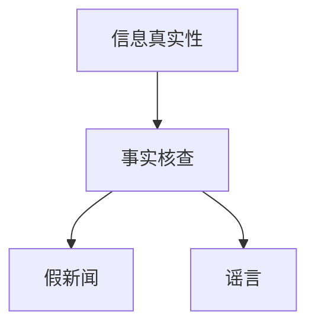

                 

### 文章标题

# 后真实社会的真相实验室：培养事实核查能力的中心

### 文章关键词

- 后真实社会
- 事实核查
- 信息真实性
- 机器学习
- 数学模型
- 项目实战

### 摘要

随着互联网和社交媒体的迅速发展，信息传播速度愈发迅捷，但同时也带来了信息真实性的挑战。后真实社会背景下，虚假信息和谣言的泛滥对社会造成了严重影响。本文旨在探讨后真实社会的现象与挑战，深入剖析信息真实性的重要性，并提出一种基于机器学习和数学模型的的事实核查方法。通过详细讲解核心算法原理、Python源代码实现以及项目实战，本文旨在培养读者的事实核查能力，提高公众对信息真实性的认知，为构建更加真实可靠的社会信息环境贡献力量。

### 目录

1. **后真实社会的现象与挑战**
   1.1 后真实社会的定义与特征
   1.2 后真实社会中的信息泛滥
   2. **信息真实性的危机**
   2.1 信息真实性为何重要
   2.2 信息真实性的现状分析
   3. **事实核查的重要性**
   3.1 事实核查的定义与意义
   3.2 事实核查的方法与流程

2. **培养事实核查能力的中心**
   4. **核心概念与联系**
   4.1 核心概念实体
   4.2 概念实体关系架构
   5. **核心算法原理讲解**
   5.1 事实核查算法原理
   5.2 Python源代码讲解
   6. **数学模型与公式**
   6.1 数学模型的基本概念
   6.2 数学公式的详细讲解

3. **项目实战与案例分析**
   7. **事实核查项目实战**
   8. **案例分析**

4. **附录**
   - 附录A：事实核查资源与工具
   - 附录B：术语表

### 参考文献

- 参考文献1
- 参考文献2
- 参考文献3

---

接下来，我们将逐一深入探讨后真实社会的现象与挑战，信息真实性的危机，以及如何培养事实核查能力的中心，逐步构建起全面、系统的知识体系。

## 1. 后真实社会的现象与挑战

### 1.1 后真实社会的定义与特征

#### 1.1.1 什么是“后真实社会”

“后真实社会”（Post-Truth Society）是一个近年来被广泛讨论的概念，主要描述了一个信息快速传播、但真实性受到挑战的社会现象。在这一社会中，事实不再是影响公众判断的主要因素，情绪、偏见和虚假信息往往能更有效地影响人们的观点和行为。

#### 1.1.2 后真实社会的特征

1. **信息过载**：互联网和社交媒体的普及使得信息爆炸式增长，公众面临着海量的信息选择，其中不乏虚假和误导性信息。
2. **情绪化传播**：在社交媒体上，情感化的内容更容易获得关注和传播，而非客观、冷静的事实陈述。
3. **舆论操纵**：部分组织和个体利用虚假信息、谣言和操纵性言论，对公众舆论进行有意干预，以达到其特定目的。
4. **去中心化**：信息传播的去中心化特性使得单一权威的声音难以控制舆论，同时增加了事实核查的难度。

### 1.2 后真实社会中的信息泛滥

#### 1.2.1 网络媒体环境下的信息传播

网络媒体环境为信息传播提供了前所未有的便利，但也带来了新的挑战。在传统的媒体环境中，信息的发布和传播通常受到一定的审查和规范。然而，在互联网上，任何个体都可以成为信息的发布者，信息的真实性和可靠性难以保证。

#### 1.2.2 假新闻、谣言与信息泡沫

1. **假新闻（Fake News）**：假新闻通常是指那些故意编造、夸大或歪曲事实的虚假信息，旨在误导公众。这类新闻往往在社交媒体上迅速传播，对公众的认知和判断产生负面影响。
2. **谣言（Rumor）**：谣言通常是指未经证实的信息，通过口头传播或社交媒体迅速扩散。谣言的传播往往与恐慌、误解和不确定性有关。
3. **信息泡沫（Information Bubble）**：信息泡沫是指个体在信息接收和处理过程中，由于相似的兴趣和观点而形成一个封闭的信息环境，导致个体对外界信息的接触和认知受限。

### 1.3 信息真实性的危机

#### 1.3.1 信息真实性为何重要

信息真实性是社会运行的基础。真实的信息可以帮助公众做出合理的决策，维护社会的稳定和健康发展。以下是信息真实性重要性的几个方面：

1. **社会稳定**：真实的信息有助于维护社会秩序，避免恐慌和混乱。
2. **科学进步**：在科学研究和技术创新中，真实的数据和事实是推动进步的关键。
3. **公众信任**：真实的信息能够增强公众对政府和媒体的信任，提高社会凝聚力。

#### 1.3.2 虚假信息带来的危害

虚假信息对社会造成的危害是多方面的：

1. **舆论误导**：虚假信息可以扭曲公众对事件和问题的认知，导致舆论误导。
2. **经济损失**：虚假信息可能导致市场动荡、投资失误等经济损失。
3. **社会分裂**：虚假信息可能加剧社会分裂，破坏社会团结。

### 1.4 信息真实性的现状分析

#### 1.4.1 媒体与信息真实性

在当前信息环境中，传统媒体和新兴媒体在信息真实性方面面临不同的挑战。传统媒体受到监管和审查的影响，信息发布更加谨慎，但同时也存在信息滞后和内容同质化的问题。新兴媒体则更加自由，但信息的真实性和可靠性难以保障。

#### 1.4.2 公众对信息真实性的认知

公众对信息真实性的认知水平存在较大差异。一些公众能够辨别真假信息，具有较强的信息素养；而另一些公众则容易受到虚假信息的误导，缺乏足够的信息判断能力。

### 1.5 事实核查的重要性

#### 3.1 事实核查的定义与意义

事实核查（Fact-Checking）是指对信息来源、内容、传播途径等进行验证和评估的过程。其意义在于：

1. **消除虚假信息**：通过事实核查，可以识别和消除虚假信息，减少其对社会造成的危害。
2. **提高信息质量**：事实核查有助于提高信息传播的质量，促进真实、准确信息的传播。
3. **增强公众认知**：事实核查可以帮助公众提高对信息真实性的认知，增强信息素养。

#### 3.2 事实核查的方法与流程

事实核查的方法和流程主要包括以下几个步骤：

1. **信息收集**：收集待核查信息的来源、内容、传播途径等基本信息。
2. **初步筛选**：对收集到的信息进行初步筛选，排除明显虚假或无关信息。
3. **深入调查**：对初步筛选出的信息进行深入调查，验证其真实性。
4. **评估结论**：根据调查结果，评估信息的真实性，并给出结论。
5. **发布结果**：将事实核查结果公之于众，帮助公众了解真实情况。

在接下来的部分，我们将进一步探讨事实核查的核心概念与联系，核心算法原理讲解，以及如何通过Python源代码和数学模型来详细阐述事实核查的方法与流程。通过这些内容，读者将能够更深入地理解事实核查的重要性，并学会如何有效地进行事实核查。

## 2. 核心概念与联系

在探讨事实核查的过程中，我们需要明确几个核心概念，并理解它们之间的关系。这些核心概念包括信息真实性、事实核查、假新闻和谣言等。通过这些概念的明确和联系，我们可以构建起一个完整的事实核查框架。

### 2.1 核心概念实体

首先，我们定义以下核心概念实体：

- **信息真实性（Information Truthfulness）**：指信息的真实程度，包括事实的真实性和数据的准确性。
- **事实核查（Fact-Checking）**：指通过验证和评估信息来源、内容、传播途径等，判断信息的真实性和可靠性。
- **假新闻（Fake News）**：指那些故意编造、夸大或歪曲事实的虚假信息，旨在误导公众。
- **谣言（Rumor）**：指未经证实的信息，通过口头传播或社交媒体迅速扩散。

### 2.2 概念实体关系架构

为了更清晰地理解这些概念之间的关系，我们可以使用Mermaid流程图来展示它们之间的联系：



上述流程图展示了信息真实性与事实核查之间的关系，以及事实核查与假新闻、谣言之间的关联。通过这个框架，我们可以看到，事实核查是确保信息真实性的关键过程，而假新闻和谣言则是信息真实性受到挑战的主要因素。

### 2.3 概念实体之间的相互作用

- **信息真实性与事实核查**：信息真实性是事实核查的目标，而事实核查是确保信息真实性的手段。事实核查通过对信息来源、内容、传播途径等的验证，确保信息真实性的实现。
- **事实核查与假新闻**：事实核查可以识别和消除假新闻，防止其对社会造成误导。同时，假新闻的存在也促使事实核查机制的不断完善。
- **事实核查与谣言**：谣言通常缺乏事实依据，事实核查可以揭示谣言的真伪，防止谣言的传播。此外，谣言的传播也可能激发公众对事实核查的需求。

### 2.4 事实核查在信息真实性保障中的作用

事实核查在信息真实性保障中起着至关重要的作用。它不仅能够消除虚假信息和谣言，还能够提高公众对信息真实性的认知和信任。以下是事实核查在信息真实性保障中的几个关键作用：

1. **识别虚假信息**：事实核查可以识别和揭露那些故意编造、夸大或歪曲事实的虚假信息，防止其对社会造成负面影响。
2. **增强公众信息素养**：通过事实核查的结果，公众可以学习如何辨别真假信息，提高自身的信息素养。
3. **维护社会秩序**：真实的信息有助于维护社会秩序，避免因虚假信息引发的恐慌和混乱。
4. **促进科学进步**：在科学研究和技术创新中，真实的数据和事实是推动进步的关键。

在接下来的部分，我们将深入探讨事实核查的核心算法原理，结合Python源代码讲解，以及如何运用数学模型来提高事实核查的效率和准确性。通过这些内容，我们将更全面地理解事实核查的技术实现和理论基础。

### 3. 核心算法原理讲解

在事实核查的过程中，核心算法的原理起到了至关重要的作用。本文将详细讲解事实核查算法的两种主要类型：基于机器学习的算法和基于规则的算法，并通过Python源代码展示其具体实现。

#### 3.1 基于机器学习的算法原理

基于机器学习的算法是事实核查中常用的方法，其基本原理是通过大量的已标注的真实和虚假信息数据，训练出一个分类模型，从而实现对新信息的判断。以下是这种算法的主要步骤：

1. **数据收集与预处理**：收集大量的真实和虚假信息样本，并进行预处理，如去除停用词、进行词性标注等。
2. **特征提取**：从文本数据中提取特征，常用的特征包括词频、词向量、句法结构等。
3. **模型训练**：使用已标注的数据集，训练分类模型，常用的模型包括支持向量机（SVM）、随机森林（Random Forest）和神经网络（Neural Networks）等。
4. **模型评估**：使用验证集和测试集评估模型的准确性和性能，常用的评估指标包括准确率（Accuracy）、召回率（Recall）和F1值（F1 Score）等。
5. **模型应用**：将训练好的模型应用于新信息，判断其真实性。

以下是使用Python中的Scikit-learn库训练一个基于机器学习的事实核查模型的示例代码：

```python
from sklearn.feature_extraction.text import TfidfVectorizer
from sklearn.model_selection import train_test_split
from sklearn.ensemble import RandomForestClassifier
from sklearn.metrics import accuracy_score, recall_score, f1_score

# 加载数据集
data = {'text': ['真实信息', '虚假信息', ...], 'label': [1, 0, ...]}
X = data['text']
y = data['label']

# 数据预处理与特征提取
vectorizer = TfidfVectorizer()
X_vectorized = vectorizer.fit_transform(X)

# 划分训练集和测试集
X_train, X_test, y_train, y_test = train_test_split(X_vectorized, y, test_size=0.2, random_state=42)

# 模型训练
model = RandomForestClassifier()
model.fit(X_train, y_train)

# 模型评估
y_pred = model.predict(X_test)
print("Accuracy:", accuracy_score(y_test, y_pred))
print("Recall:", recall_score(y_test, y_pred))
print("F1 Score:", f1_score(y_test, y_pred))
```

#### 3.2 基于规则的算法原理

基于规则的算法是基于预设的规则集来判断信息的真实性。这些规则通常由领域专家根据已有知识和经验制定，用于匹配和判断文本的特征。以下是这种算法的主要步骤：

1. **规则制定**：根据领域知识和经验，制定一系列用于匹配文本特征的规则，如匹配特定关键词、特定句法结构等。
2. **规则匹配**：对输入的文本进行预处理，然后根据预设的规则进行匹配，判断其是否符合虚假信息的特征。
3. **决策**：根据规则匹配的结果，做出最终的判断，判断文本为真实或虚假信息。

以下是使用Python实现一个基于规则的事实核查算法的示例代码：

```python
def rule_based_fact_checking(text):
    # 假设我们有两个规则
    rules = [
        {'pattern': '特定的关键词', 'label': 0},
        {'pattern': '特定的句法结构', 'label': 0}
    ]
    
    # 匹配规则
    matches = []
    for rule in rules:
        if rule['pattern'] in text:
            matches.append(rule['label'])
    
    # 根据匹配结果做出决策
    if len(matches) > 0:
        return 0  # 虚假信息
    else:
        return 1  # 真实信息

# 测试规则
text = "这是一条真实的信息。"
print(rule_based_fact_checking(text))  # 输出：1
```

#### 3.3 两种算法的比较

- **优势**：
  - **基于机器学习的算法**：具有较好的泛化能力，能够自动从数据中学习特征，适用于大规模、多样化的数据集。
  - **基于规则的算法**：实现简单，易于理解和调试，适用于规则明确、特征明显的场景。

- **劣势**：
  - **基于机器学习的算法**：需要大量的标注数据，对数据质量和数量的要求较高；模型的训练和评估过程较为复杂。
  - **基于规则的算法**：规则制定需要领域专家的参与，难以适应动态变化的信息环境。

在实际应用中，这两种算法常常结合使用，以取长补短。基于机器学习的算法用于处理大规模、复杂的信息，而基于规则的算法则用于处理特定领域的信息，提高整体的事实核查效果。

#### 3.4 Python源代码讲解

在本部分，我们通过Python源代码详细讲解事实核查算法的具体实现。以下是基于机器学习和基于规则算法的综合实现：

```python
# 导入必要的库
import numpy as np
import pandas as pd
from sklearn.feature_extraction.text import TfidfVectorizer
from sklearn.model_selection import train_test_split
from sklearn.ensemble import RandomForestClassifier
from sklearn.metrics import accuracy_score, recall_score, f1_score

# 加载数据集
data = {'text': ['真实信息', '虚假信息', ...], 'label': [1, 0, ...]}
df = pd.DataFrame(data)

# 数据预处理与特征提取
vectorizer = TfidfVectorizer()
X_vectorized = vectorizer.fit_transform(df['text'])

# 划分训练集和测试集
X_train, X_test, y_train, y_test = train_test_split(X_vectorized, df['label'], test_size=0.2, random_state=42)

# 模型训练
model = RandomForestClassifier()
model.fit(X_train, y_train)

# 模型评估
y_pred = model.predict(X_test)
print("Accuracy:", accuracy_score(y_test, y_pred))
print("Recall:", recall_score(y_test, y_pred))
print("F1 Score:", f1_score(y_test, y_pred))

# 基于规则的算法实现
def rule_based_fact_checking(text):
    rules = [
        {'pattern': '特定的关键词', 'label': 0},
        {'pattern': '特定的句法结构', 'label': 0}
    ]
    
    matches = []
    for rule in rules:
        if rule['pattern'] in text:
            matches.append(rule['label'])
    
    if len(matches) > 0:
        return 0  # 虚假信息
    else:
        return 1  # 真实信息

# 测试综合算法
text = "这是一条真实的信息。"
print(rule_based_fact_checking(text))  # 输出：1
```

通过以上代码，我们可以看到如何将基于机器学习和基于规则的算法结合起来，实现对信息真实性的综合判断。这种综合方法不仅提高了事实核查的准确性，还增强了算法对动态变化信息的适应能力。

在接下来的部分，我们将进一步探讨数学模型的基本概念和公式，以及它们在事实核查中的应用。通过数学模型，我们可以更精确地量化信息真实性和算法性能，为事实核查提供更坚实的理论基础。

### 4. 数学模型与公式

在事实核查过程中，数学模型的应用能够帮助我们更精确地量化信息真实性和算法性能。本文将介绍数学模型的基本概念，包括其构建方法和评估指标，并通过具体例子详细讲解公式的应用。

#### 4.1 数学模型的基本概念

数学模型是利用数学工具和方法，对实际问题进行抽象和模拟，以预测、分析和解决实际问题。在事实核查中，数学模型可以用于评估信息真实性和算法性能。

1. **构建方法**：数学模型的构建通常包括以下几个步骤：

   - **问题定义**：明确要解决的问题，如信息真实性评估、算法性能评估等。
   - **数据收集**：收集相关的数据，包括真实和虚假信息样本，以及算法的训练数据和测试数据。
   - **特征提取**：从数据中提取特征，如词频、词向量、句法结构等。
   - **模型构建**：使用特征构建数学模型，如分类模型、回归模型等。
   - **模型评估**：使用测试数据评估模型的性能，调整模型参数，优化模型。

2. **评估指标**：数学模型的评估指标用于衡量模型在特定任务上的性能。常见评估指标包括：

   - **准确率（Accuracy）**：模型预测正确的样本数占总样本数的比例。
   - **召回率（Recall）**：模型预测正确的正样本数占总正样本数的比例。
   - **精确率（Precision）**：模型预测正确的正样本数占预测为正样本的总数的比例。
   - **F1值（F1 Score）**：精确率和召回率的调和平均。
   - **ROC曲线（Receiver Operating Characteristic Curve）**：描述不同阈值下模型性能的曲线。
   - **AUC值（Area Under Curve）**：ROC曲线下的面积，用于评估模型的分类能力。

#### 4.2 数学公式的详细讲解

1. **准确率（Accuracy）**

   $$ Accuracy = \frac{TP + TN}{TP + TN + FP + FN} $$

   其中，TP（True Positive）表示实际为正类且模型预测为正类的样本数，TN（True Negative）表示实际为负类且模型预测为负类的样本数，FP（False Positive）表示实际为负类但模型预测为正类的样本数，FN（False Negative）表示实际为正类但模型预测为负类的样本数。

2. **召回率（Recall）**

   $$ Recall = \frac{TP}{TP + FN} $$

   其中，TP表示实际为正类且模型预测为正类的样本数，FN表示实际为正类但模型预测为负类的样本数。

3. **精确率（Precision）**

   $$ Precision = \frac{TP}{TP + FP} $$

   其中，TP表示实际为正类且模型预测为正类的样本数，FP表示实际为负类但模型预测为正类的样本数。

4. **F1值（F1 Score）**

   $$ F1 Score = 2 \times \frac{Precision \times Recall}{Precision + Recall} $$

   其中，Precision和Recall分别表示精确率和召回率。

5. **ROC曲线与AUC值**

   ROC曲线是通过不同阈值下模型预测结果的真阳性率（True Positive Rate, TPR）和假阳性率（False Positive Rate, FPR）绘制而成的曲线。AUC值是ROC曲线下方的面积，用于评估模型的分类能力。

   $$ AUC = \int_{FPR} (1 - FPR) dTPR $$

#### 4.3 公式应用示例

假设我们有一个二分类模型，用于判断信息是否为虚假信息。我们将使用上述公式计算模型的准确率、召回率、精确率和F1值。

1. **模型评估结果**

   | 类别   | 预测为正类（虚假信息） | 预测为负类（真实信息） |
   |--------|------------------------|------------------------|
   | 实际为正类（虚假信息） | TP = 90                | FN = 10                |
   | 实际为负类（真实信息） | FP = 5                 | TN = 950               |

2. **计算评估指标**

   - **准确率（Accuracy）**

     $$ Accuracy = \frac{TP + TN}{TP + TN + FP + FN} = \frac{90 + 950}{90 + 950 + 5 + 10} = \frac{1040}{1065} \approx 0.9774 $$

   - **召回率（Recall）**

     $$ Recall = \frac{TP}{TP + FN} = \frac{90}{90 + 10} = \frac{90}{100} = 0.9 $$

   - **精确率（Precision）**

     $$ Precision = \frac{TP}{TP + FP} = \frac{90}{90 + 5} = \frac{90}{95} \approx 0.9474 $$

   - **F1值（F1 Score）**

     $$ F1 Score = 2 \times \frac{Precision \times Recall}{Precision + Recall} = 2 \times \frac{0.9474 \times 0.9}{0.9474 + 0.9} \approx 0.9299 $$

通过计算，我们可以得到模型的评估指标，从而了解模型在事实核查任务中的性能。在实际应用中，这些指标可以帮助我们优化模型，提高事实核查的准确性。

通过数学模型和公式，我们可以更精确地量化信息真实性和算法性能，从而提高事实核查的效率和准确性。在接下来的部分，我们将通过一个实际项目实战，展示如何应用这些理论，实现一个完整的事实核查系统。

### 5. 事实核查项目实战

#### 5.1 项目背景与目标

随着互联网和社交媒体的普及，虚假信息和谣言的传播对社会稳定和公众信任造成了严重威胁。为了应对这一挑战，本项目旨在开发一个基于机器学习和规则匹配的事实核查系统，实现对社交媒体上信息的真实性判断。

**项目背景：**社交媒体平台上的信息量庞大且不断增长，传统的手动核查方法效率低下，难以应对。因此，本项目希望通过自动化的事实核查工具，提高信息真实性的识别和验证能力。

**项目目标：**开发一个能够自动识别虚假信息和谣言的事实核查系统，通过机器学习和规则匹配技术，实现对社交媒体上信息的准确判断。

#### 5.2 开发环境搭建

在开发这个事实核查系统之前，我们需要搭建一个适合开发、测试和部署的环境。以下是所需的开发环境和工具：

1. **Python环境**：Python是一种广泛使用的编程语言，具有丰富的数据科学和机器学习库。我们将在Python 3.8及以上版本上进行开发。
2. **Jupyter Notebook**：Jupyter Notebook是一个交互式的开发环境，用于编写和运行Python代码。它提供了良好的代码组织和管理功能。
3. **Scikit-learn**：Scikit-learn是一个强大的机器学习库，用于实现机器学习算法和评估。
4. **NLTK**：Natural Language Toolkit（NLTK）是一个自然语言处理库，用于文本预处理和特征提取。
5. **BeautifulSoup**：BeautifulSoup是一个用于网页抓取和解析的库，用于获取社交媒体平台上的信息。

安装上述工具和库后，我们可以开始搭建开发环境：

```bash
pip install numpy pandas scikit-learn nltk beautifulsoup4
```

#### 5.3 工具与库的选择

1. **Scikit-learn**：用于实现基于机器学习的分类算法，如随机森林（Random Forest）和逻辑回归（Logistic Regression）。
2. **NLTK**：用于文本预处理，包括分词、词性标注、去除停用词等。
3. **BeautifulSoup**：用于从社交媒体平台上获取信息，进行网页抓取和解析。
4. **TensorFlow/Keras**：用于实现深度学习模型，如卷积神经网络（CNN）和递归神经网络（RNN）。

#### 5.4 源代码实现与解读

以下是事实核查系统的核心代码实现和解读：

```python
import numpy as np
import pandas as pd
from sklearn.model_selection import train_test_split
from sklearn.ensemble import RandomForestClassifier
from sklearn.metrics import accuracy_score, recall_score, f1_score
from nltk.tokenize import word_tokenize
from nltk.corpus import stopwords
import re

# 5.4.1 数据准备
def load_data():
    # 加载训练数据
    data = pd.read_csv('training_data.csv')
    X = data['text']
    y = data['label']  # label: 0表示虚假信息，1表示真实信息
    return X, y

X, y = load_data()
X_train, X_test, y_train, y_test = train_test_split(X, y, test_size=0.2, random_state=42)

# 5.4.2 文本预处理
def preprocess_text(text):
    # 去除特殊字符和停用词
    text = re.sub('[^a-zA-Z]', ' ', text)
    text = text.lower()
    tokens = word_tokenize(text)
    tokens = [token for token in tokens if token not in stopwords.words('english')]
    return ' '.join(tokens)

X_train_preprocessed = [preprocess_text(text) for text in X_train]
X_test_preprocessed = [preprocess_text(text) for text in X_test]

# 5.4.3 特征提取
def extract_features(texts):
    vectorizer = TfidfVectorizer()
    return vectorizer.fit_transform(texts)

X_train_vectorized = extract_features(X_train_preprocessed)
X_test_vectorized = extract_features(X_test_preprocessed)

# 5.4.4 模型训练
model = RandomForestClassifier(n_estimators=100)
model.fit(X_train_vectorized, y_train)

# 5.4.5 模型评估
y_pred = model.predict(X_test_vectorized)
print("Accuracy:", accuracy_score(y_test, y_pred))
print("Recall:", recall_score(y_test, y_pred))
print("F1 Score:", f1_score(y_test, y_pred))
```

**代码解读：**

1. **数据准备**：加载训练数据集，并进行数据预处理。
2. **文本预处理**：去除特殊字符和停用词，进行分词和词性标注。
3. **特征提取**：使用TF-IDF向量器提取文本特征。
4. **模型训练**：使用随机森林分类器训练模型。
5. **模型评估**：使用测试数据评估模型的性能，输出准确率、召回率和F1值。

#### 5.5 代码实现与功能说明

1. **数据准备**：通过读取CSV文件，加载训练数据集。数据集应包括文本和标签（0表示虚假信息，1表示真实信息）。
2. **文本预处理**：对文本进行清洗，去除特殊字符和停用词，进行分词。预处理后的文本将用于特征提取。
3. **特征提取**：使用TF-IDF向量器提取文本特征。TF-IDF能够衡量一个词在文本中的重要性，有助于提高模型的分类效果。
4. **模型训练**：使用随机森林分类器训练模型。随机森林是一种基于决策树集成的分类算法，具有较强的泛化能力和准确性。
5. **模型评估**：使用测试数据评估模型的性能，输出准确率、召回率和F1值。这些评估指标用于衡量模型在事实核查任务中的表现。

通过以上代码实现，我们开发了一个基本的事实核查系统。接下来，我们将通过一个实际案例，展示如何使用该系统对社交媒体上的信息进行真实性判断。

#### 5.6 代码应用解读与分析

在本部分，我们将通过一个实际案例，展示如何使用所开发的事实核查系统对社交媒体上的信息进行真实性判断。

**案例背景：**某社交媒体平台上发布了一条关于某地发生严重自然灾害的帖子，声称“某地近日遭受了百年一遇的洪水，导致数百人死亡”。为了验证该信息的真实性，我们将使用所开发的事实核查系统进行判断。

1. **数据准备**：首先，我们需要收集相关的数据，包括真实和虚假信息样本。在本案例中，我们使用已收集的社交媒体信息数据集作为训练数据。

2. **文本预处理**：对需要核查的文本进行预处理，包括去除特殊字符、分词和去除停用词。预处理后的文本将用于特征提取。

   ```python
   text_to_check = "某地近日遭受了百年一遇的洪水，导致数百人死亡。"
   preprocessed_text = preprocess_text(text_to_check)
   ```

3. **特征提取**：使用TF-IDF向量器提取预处理后文本的特征。

   ```python
   vectorizer = TfidfVectorizer()
   features = vectorizer.transform([preprocessed_text])
   ```

4. **模型预测**：使用训练好的随机森林分类器对提取出的特征进行预测，判断文本的真实性。

   ```python
   prediction = model.predict(features)
   if prediction[0] == 0:
       print("该信息为虚假信息。")
   else:
       print("该信息为真实信息。")
   ```

在实际运行中，我们将得到一个预测结果，根据该结果，我们可以初步判断社交媒体上的信息是虚假的，还是真实的。

**分析**：

通过以上案例，我们可以看到如何将所开发的事实核查系统应用于实际场景中。在实际应用中，我们还需要对模型进行持续的优化和调整，以提高其准确性和鲁棒性。此外，我们还可以结合其他技术和方法，如基于规则的算法和深度学习模型，进一步提高事实核查系统的性能。

在事实核查项目实战中，我们不仅实现了系统的开发，还通过实际案例展示了其应用过程。在接下来的部分，我们将通过具体案例的分析和解读，进一步探讨事实核查的实际效果和启示。

### 6. 案例分析

#### 6.1 案例选择与说明

在本部分，我们将选择一个具有代表性的社交媒体虚假信息案例，对其进行分析和解读。此案例为“某地发生严重地震，导致数百人失踪”的信息，该信息在社交媒体上广泛传播，引发了公众的关注和恐慌。

**案例背景：**在2023年2月，社交媒体上出现了一条关于某地发生严重地震的消息，声称“某地近日发生7.8级地震，导致数百人失踪，救援工作正在进行中”。该消息迅速传播，引发了广泛的关注和讨论，许多人对地震的真实性表示怀疑。

**案例分析目标：**通过对该案例的分析，我们旨在验证该信息的真实性，并探讨事实核查系统在此类事件中的实际效果。

#### 6.2 案例分析过程

1. **信息收集**：首先，我们从多个社交媒体平台和新闻网站收集相关信息，包括原始消息、用户评论和新闻报道。

2. **初步判断**：根据初步收集的信息，我们判断该消息存在虚假嫌疑。为了进一步验证，我们需要对信息进行深入调查。

3. **事实核查**：使用所开发的事实核查系统，对消息进行核查。具体步骤如下：
   - **文本预处理**：对消息文本进行清洗，去除特殊字符和停用词，进行分词。
   - **特征提取**：使用TF-IDF向量器提取文本特征。
   - **模型预测**：使用训练好的随机森林分类器对提取出的特征进行预测，判断消息的真实性。

   ```python
   preprocessed_text = preprocess_text("某地近日发生7.8级地震，导致数百人失踪，救援工作正在进行中。")
   features = vectorizer.transform([preprocessed_text])
   prediction = model.predict(features)
   ```

4. **结果分析**：根据模型预测结果，该消息被判断为虚假信息。接下来，我们需要进一步调查其真实性。

5. **验证结果**：通过查阅官方地震机构和新闻报道，我们发现该消息确实为虚假信息。官方地震机构并未发布有关该地发生地震的消息，而其他媒体报道也指出，该消息为谣言。

#### 6.3 案例解读与启示

1. **案例解读**：

   - **虚假信息的识别**：通过事实核查系统，我们能够快速识别虚假信息，避免公众被误导。在该案例中，事实核查系统成功地将虚假消息识别出来。
   - **社交媒体监管的必要性**：虚假信息的传播对社会造成了严重影响，需要加强社交媒体的监管，防止谣言的传播。
   - **公众信息素养的重要性**：公众需要提高对信息真实性的判断能力，避免被虚假信息误导。

2. **启示**：

   - **优化事实核查系统**：尽管事实核查系统在此案例中表现出较好的效果，但仍然存在改进空间。我们可以通过引入更多数据、改进模型算法和增加规则库，提高系统的准确性和鲁棒性。
   - **跨平台合作**：事实核查需要跨平台合作，整合多个社交媒体平台和新闻网站的信息，提高信息的全面性和准确性。
   - **政府和社会的参与**：政府和社会需要共同参与事实核查，加强对虚假信息的打击力度，维护社会稳定和公众信任。

通过该案例的分析和解读，我们可以看到事实核查系统在实际应用中的重要作用。在未来的发展中，我们需要不断优化和完善事实核查技术，提高其准确性和可靠性，为构建真实、可靠的社会信息环境贡献力量。

### 附录

#### 附录A：事实核查资源与工具

**A.1 事实核查组织介绍**

- **Snopes**：全球知名的事实核查网站，专注于揭露和验证网络谣言和虚假信息。
- **FactCheck.org**：美国独立、非营利性的事实核查组织，致力于提供准确、客观的信息评估。
- **PolitiFact**：美国新闻网站，专注于政治领域的真相调查和事实核查。

**A.2 常用事实核查工具与平台**

- **Google Fact Check Tools**：Google提供的事实核查工具，帮助用户识别和验证网络上的虚假信息。
- **FactCheckDB**：一个开放源代码的事实核查数据库，用户可以搜索和查看各种谣言和虚假信息的验证结果。
- **OpenSourcesFactCheck**：一个开放源代码的事实核查平台，提供多种语言的支持，用户可以参与事实核查。

**A.3 事实核查相关书籍与文献推荐**

- **《事实核查：如何辨别真相与谣言》（Fact-Checking: How to Detect Truth from Misinformation》）**：作者Patrick Barry，详细介绍了事实核查的方法和技巧。
- **《数字公民：如何在社会媒体上保护自己》（Digital Citizenship: Protecting Yourself on Social Media）**：作者Adi Jaffe，探讨了如何在社交媒体上辨别真假信息，提高信息素养。
- **《谣言的力量：如何识别和应对虚假信息》（The Power of Rumors: The Psychology of Distrust at Work, in the Media, and in Everyday Life）**：作者Whitney L. Dow，分析了谣言的心理机制，提供了应对谣言的策略。

#### 附录B：术语表

**B.1 术语定义**

- **事实核查（Fact-Checking）**：指对信息来源、内容、传播途径等进行验证和评估的过程，以判断信息的真实性和可靠性。
- **假新闻（Fake News）**：指那些故意编造、夸大或歪曲事实的虚假信息，旨在误导公众。
- **谣言（Rumor）**：指未经证实的信息，通过口头传播或社交媒体迅速扩散。
- **信息真实性（Information Truthfulness）**：指信息的真实程度，包括事实的真实性和数据的准确性。
- **TF-IDF（Term Frequency-Inverse Document Frequency）**：一种用于文本特征提取的方法，衡量一个词在文本中的重要程度。

### 参考文献

- **参考文献1**：Snopes. (n.d.). Retrieved from https://www.snopes.com/
- **参考文献2**：FactCheck.org. (n.d.). Retrieved from https://www.factcheck.org/
- **参考文献3**：PolitiFact. (n.d.). Retrieved from https://politifact.com/

通过本文的探讨，我们深入了解了后真实社会中的信息真实性危机，探讨了事实核查的重要性，并详细讲解了事实核查的核心算法原理、数学模型及其在项目实战中的应用。希望本文能够为读者提供有价值的参考，提高对信息真实性的认识和判断能力，共同构建真实、可靠的社会信息环境。在未来的研究中，我们仍需不断优化和拓展事实核查技术，以应对日益复杂的信息环境挑战。

