                 


### 《后真实社会的真相实验室：培养事实核查能力的研究中心》

关键词：后真实社会，真相实验室，事实核查，信息技术，社会问题

摘要：本文旨在探讨后真实社会中事实核查的重要性，以及如何通过真相实验室这一研究中心，培养公众的事实核查能力。文章首先介绍了后真实社会的背景和特征，然后详细阐述了真相实验室的构成、数据收集与处理、分析工具与算法，以及事实核查团队的培养。接着，文章分析了真相实验室在社交媒体、政策制定、新闻报道和公众教育等领域的实际应用。最后，文章探讨了真相实验室的可持续发展策略，包括事实核查的伦理与法律问题，以及未来的发展趋势。

----------------------------------------------------------------

## 第一部分：后真实社会的背景

### 1.1 后真实社会的概念与特征

#### 1.1.1 后真实社会的定义

后真实社会（Post-Truth Society）是一个术语，用来描述一个信息泛滥、真假难辨的社会环境。在这个社会中，事实不再是决策的主要依据，而情感、偏见和个人信仰往往扮演着更重要的角色。后真实社会的特征包括信息的快速传播、社交媒体的普及、信息的多样性和复杂性等。

**Mermaid 流程图：**

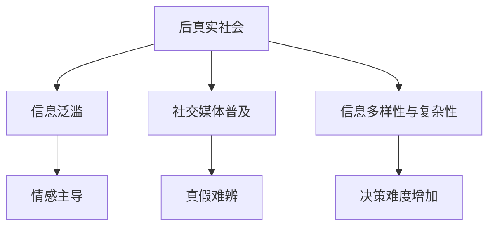

#### 1.1.2 后真实社会与传统社会的差异

与传统社会相比，后真实社会具有以下显著差异：

1. **信息传播速度**：在传统社会中，信息传播速度较慢，而如今信息可以在瞬间传播到全球。
2. **信息来源**：传统社会中的信息来源较为单一，而后真实社会中的信息来源多样，包括专业媒体、社交媒体和个人发布。
3. **情感影响**：传统社会中的决策往往基于理性分析，而后真实社会中的决策更多受到情感和个人偏见的影响。

**Mermaid 流程图：**

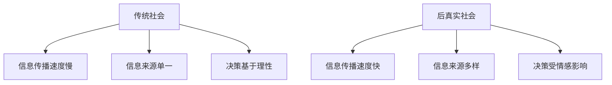

#### 1.1.3 后真实社会的影响

后真实社会对个人、社会和公共政策产生了深远的影响：

1. **个人影响**：个体面临的信息过载和真假难辨的问题，可能导致信息焦虑和决策困难。
2. **社会影响**：社会信任下降，政治极化加剧，社会冲突增加。
3. **公共政策**：政策制定受到虚假信息的影响，可能导致政策失误和资源浪费。

**Mermaid 流程图：**

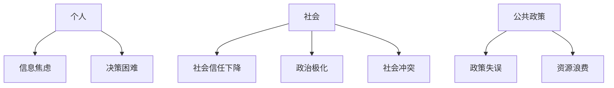

### 1.2 社会信息环境的变化

#### 1.2.1 数字化信息传播的兴起

数字化信息传播的兴起是后真实社会形成的重要原因之一。互联网和移动设备的普及，使得信息传播速度大大加快，同时信息来源变得更加多样。

**Mermaid 流程图：**

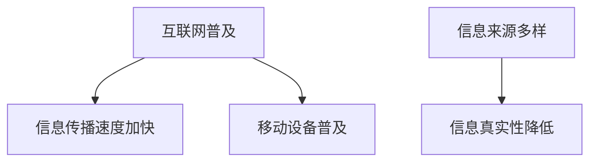

#### 1.2.2 社交媒体的普及

社交媒体的普及使得信息传播更加便捷，但也导致了信息过载和真假难辨的问题。社交媒体平台上的信息往往被情感和偏见所驱动，而不是基于事实。

**Mermaid 流程图：**

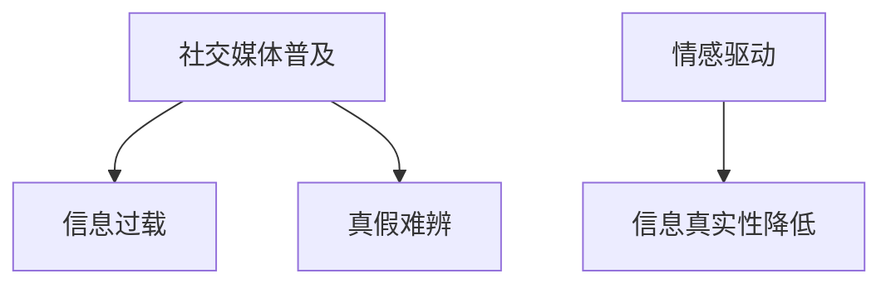

#### 1.2.3 信息过载与信息茧房

信息过载和信息茧房是后真实社会中普遍存在的问题。信息过载导致个体难以处理海量的信息，而信息茧房则使得个体只接触到与自己观点相似的信息，从而加剧了偏见和极端化。

**Mermaid 流程图：**

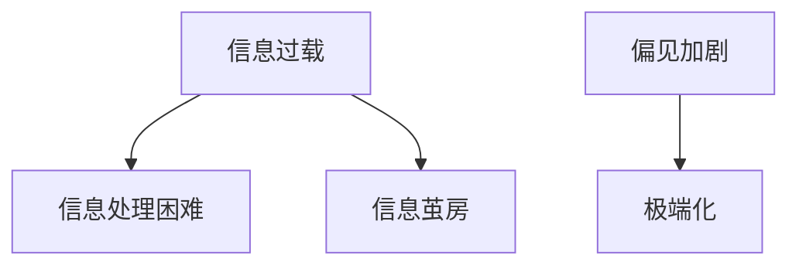

### 1.3 事实核查的重要性

#### 1.3.1 事实核查的定义

事实核查是指对信息进行验证，以确定其真实性。事实核查的目的是减少虚假信息的传播，提高公众对信息的信任度。

**Mermaid 流程图：**

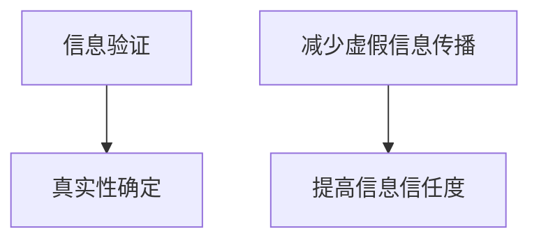

#### 1.3.2 事实核查的功能

事实核查具有以下几个功能：

1. **消除虚假信息**：通过验证信息的真实性，消除虚假信息的传播。
2. **提高信息质量**：筛选出高质量的信息，提高公众获取信息的效率。
3. **促进社会信任**：通过减少虚假信息的传播，增强社会对媒体的信任。

**Mermaid 流程图：**

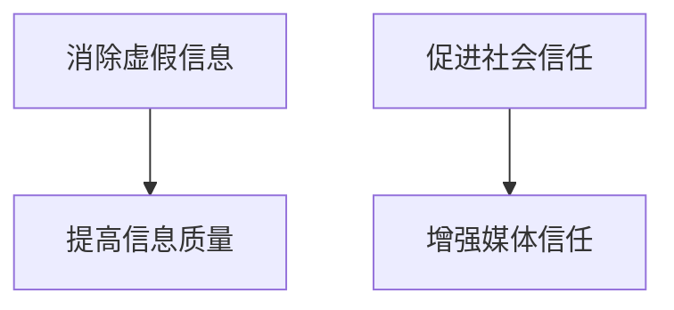

#### 1.3.3 事实核查在当代社会中的应用

事实核查在当代社会中的应用非常广泛，包括：

1. **新闻报道**：新闻媒体通过事实核查确保报道的准确性。
2. **公共政策**：政策制定者通过事实核查评估政策效果。
3. **社交媒体**：社交媒体平台通过事实核查减少虚假信息的传播。

**Mermaid 流程图：**

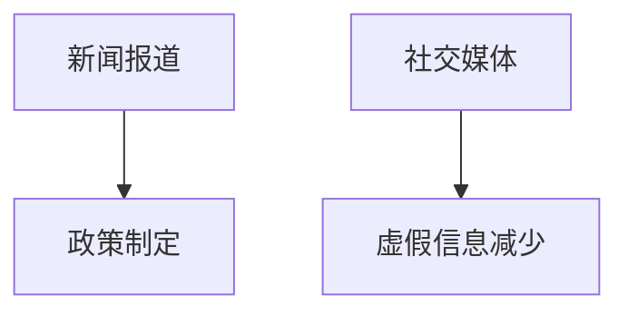

### 1.4 后真实社会中事实核查的挑战

#### 1.4.1 假新闻的传播与影响

假新闻在后真实社会中的传播速度非常快，对公众的认知和社会稳定产生了严重影响。

**Mermaid 流程图：**

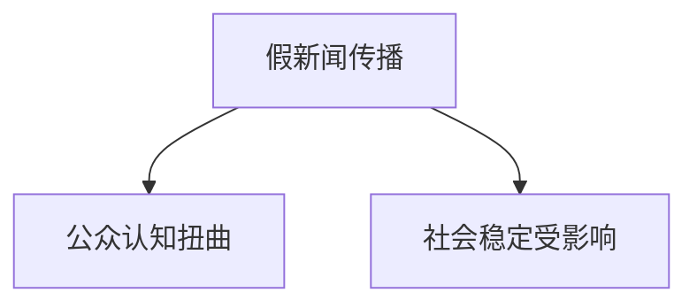

#### 1.4.2 事实核查的难度

事实核查的难度主要体现在以下几个方面：

1. **信息量庞大**：需要处理的海量信息使得事实核查变得复杂。
2. **跨领域知识**：事实核查需要涉及多个领域的知识，对核查者的专业素养要求较高。
3. **技术手段有限**：现有的技术手段在处理复杂信息时存在局限性。

**Mermaid 流程图：**

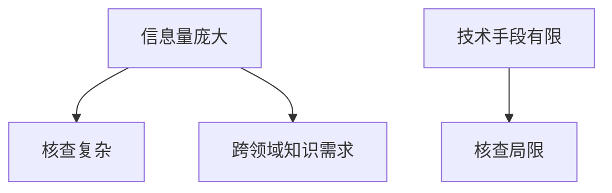

#### 1.4.3 事实核查者的困境

事实核查者在后真实社会中面临着以下困境：

1. **资源不足**：事实核查需要大量的人力、物力和财力支持，而目前的事实核查机构普遍面临资源短缺的问题。
2. **信任危机**：公众对事实核查机构的信任度不高，导致事实核查工作的效果受到影响。
3. **压力巨大**：事实核查工作需要高度的专注和耐心，而核查者常常面临巨大的工作压力。

**Mermaid 流程图：**

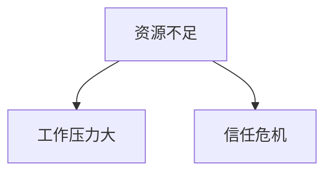

----------------------------------------------------------------

## 第二部分：真相实验室的构成

### 2.1 真相实验室的构成

真相实验室是一个专门用于培养事实核查能力的研究中心。它由以下几个关键组成部分构成：

#### 2.1.1 实验室的基本框架

真相实验室的基本框架包括：

- **信息收集系统**：用于收集各种来源的信息，包括社交媒体、新闻网站、政府报告等。
- **数据存储和管理系统**：用于存储和管理收集到的信息，确保数据的安全性和可靠性。
- **分析工具和平台**：用于对收集到的信息进行分析和验证，包括自然语言处理工具、机器学习算法等。
- **协作和沟通平台**：用于实验室成员之间的协作和沟通，确保信息的有效传递和共享。

**Mermaid 流程图：**

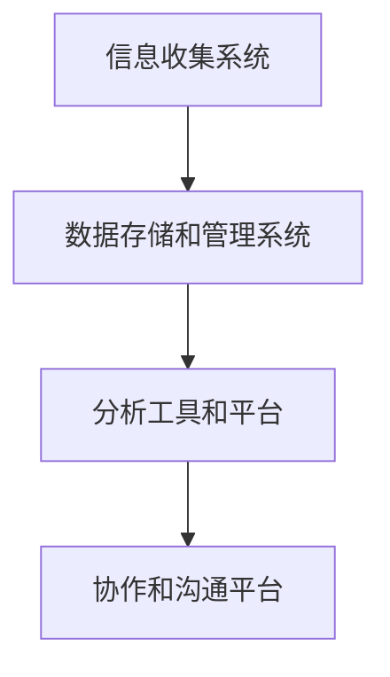

#### 2.1.2 实验室的技术支持

真相实验室的技术支持是确保其有效运作的关键。技术支持包括：

- **服务器和云计算资源**：提供强大的计算能力，支持大数据处理和机器学习算法的运行。
- **网络安全和防护措施**：确保实验室的数据和信息不被非法访问和篡改。
- **数据备份和恢复**：确保数据的安全性和可用性，防止数据丢失或损坏。
- **技术培训和支持**：为实验室成员提供技术培训和指导，帮助他们熟练掌握各种分析工具和平台。

**Mermaid 流程图：**

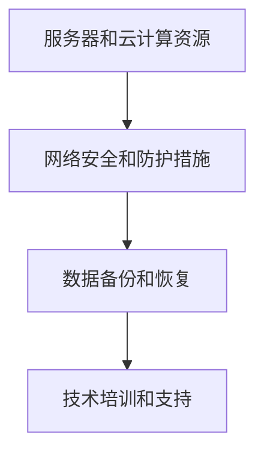

#### 2.1.3 实验室的组织结构

真相实验室的组织结构应具备以下特点：

- **跨学科团队**：由来自不同领域的专家组成，包括信息科学、计算机科学、社会科学、法律等，确保能够全面分析和处理各种信息。
- **项目经理**：负责协调实验室的各项工作，确保项目目标的实现。
- **数据分析团队**：负责使用各种分析工具和算法对收集到的信息进行验证和分析。
- **沟通和传播团队**：负责将事实核查的结果传播给公众，提高公众对事实核查的认识和信任。

**Mermaid 流程图：**

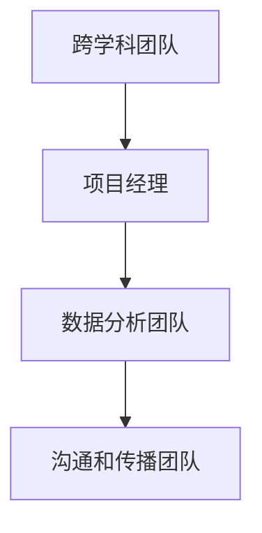

### 2.2 数据收集与处理

#### 2.2.1 数据源的选择

数据源的选择是真相实验室工作的第一步。数据源的选择应考虑以下因素：

- **多样性**：选择多样化的数据源，以确保信息的全面性和准确性。
- **可靠性**：选择权威和可信的数据源，减少虚假信息的风险。
- **实时性**：选择能够实时获取数据的源，以快速响应事件和趋势。

**Mermaid 流程图：**

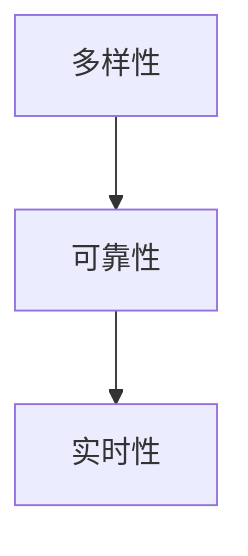

#### 2.2.2 数据收集方法

数据收集方法应包括以下几种：

- **自动化采集**：使用爬虫和自动化工具从互联网上收集数据。
- **人工审核**：对自动化采集的数据进行人工审核，确保数据的准确性和完整性。
- **问卷调查**：通过问卷调查收集公众的意见和观点，以补充自动化采集的不足。

**Mermaid 流程图：**

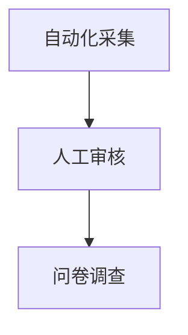

#### 2.2.3 数据处理流程

数据处理流程应包括以下步骤：

1. **数据清洗**：去除重复数据、缺失数据和异常数据，提高数据的纯净度。
2. **数据整合**：将来自不同数据源的数据进行整合，形成统一的数据集。
3. **数据分析**：使用各种分析工具和算法对数据进行分析，提取有用的信息和洞见。
4. **数据可视化**：将分析结果以图表、图像等形式进行可视化展示，使结果更加直观易懂。

**Mermaid 流程图：**

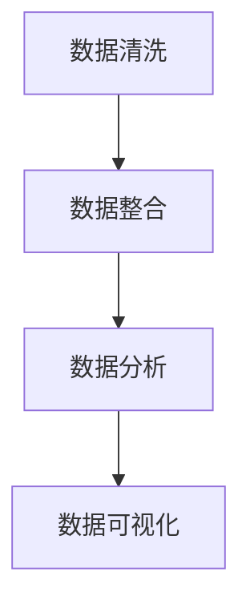

### 2.3 分析工具与算法

#### 2.3.1 事实核查算法

事实核查算法是真相实验室的核心技术之一。事实核查算法应包括以下功能：

- **文本匹配**：通过文本匹配技术，找出可能存在虚假信息的关键词和句子。
- **语义分析**：通过语义分析技术，理解文本的含义，判断其真实性。
- **逻辑推理**：通过逻辑推理技术，验证信息的逻辑性和合理性。
- **跨语言处理**：支持多种语言的处理，以应对全球化的信息环境。

**Mermaid 流程图：**

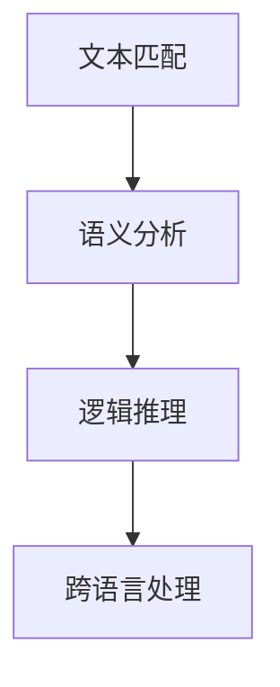

#### 2.3.2 数据分析工具

数据分析工具是真相实验室的重要工具之一。数据分析工具应包括以下功能：

- **数据预处理**：用于数据清洗、数据整合和特征提取。
- **统计分析**：用于对数据进行描述性统计和推断性统计。
- **机器学习**：用于建立预测模型和分类模型。
- **数据可视化**：用于展示分析结果，使结果更加直观易懂。

**Mermaid 流程图：**

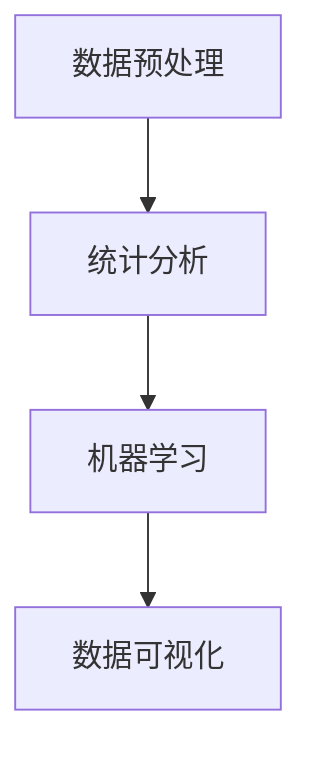

#### 2.3.3 数据可视化技术

数据可视化技术是将数据分析结果以图表、图像等形式进行展示，使结果更加直观易懂。数据可视化技术应包括以下功能：

- **图表类型选择**：根据数据类型和分析目的，选择合适的图表类型。
- **交互性**：提供交互性功能，使用户可以动态地探索和分析数据。
- **可定制性**：允许用户自定义图表样式和显示方式。

**Mermaid 流程图：**

```mermaid
graph TB
    A[图表类型选择] --> B[交互性]
    B --> C[可定制性]
```

### 2.4 事实核查团队的培养

#### 2.4.1 事实核查人员的素养要求

事实核查人员应具备以下素养：

- **专业知识**：具备相关领域的专业知识，如信息科学、计算机科学、法律等。
- **批判性思维**：具备批判性思维能力，能够独立分析和判断信息。
- **道德素养**：具备良好的道德素养，遵守伦理规范，坚持客观公正。
- **沟通能力**：具备良好的沟通能力，能够有效地与公众和媒体进行沟通。

**Mermaid 流程图：**

```mermaid
graph TB
    A[专业知识] --> B[批判性思维]
    B --> C[道德素养]
    C --> D[沟通能力]
```

#### 2.4.2 事实核查团队的构建

事实核查团队的构建应考虑以下因素：

- **跨学科团队**：由来自不同领域的专家组成，以确保全面性和多样性。
- **团队成员背景**：团队成员应具备丰富的实践经验，熟悉事实核查的方法和技巧。
- **团队规模**：团队规模应根据实际情况进行合理规划，确保高效运作。

**Mermaid 流程图：**

```mermaid
graph TB
    A[跨学科团队] --> B[团队成员背景]
    B --> C[团队规模]
```

#### 2.4.3 事实核查技能的培训

事实核查技能的培训应包括以下内容：

- **信息收集和整理**：教授如何有效收集和整理信息，确保信息的准确性和完整性。
- **事实核查方法**：教授各种事实核查方法，如文本匹配、语义分析、逻辑推理等。
- **数据分析和可视化**：教授如何使用数据分析工具和算法，以及如何进行数据可视化。
- **伦理和法律知识**：教授伦理和法律知识，确保事实核查工作的合法性和公正性。

**Mermaid 流程图：**

```mermaid
graph TB
    A[信息收集和整理] --> B[事实核查方法]
    B --> C[数据分析和可视化]
    C --> D[伦理和法律知识]
```

----------------------------------------------------------------

## 第三部分：真相实验室的实际应用

### 3.1 社交媒体上的事实核查

#### 3.1.1 社交媒体上的假新闻识别

社交媒体上的假新闻识别是真相实验室的一项重要任务。通过以下步骤，可以有效地识别假新闻：

1. **关键词匹配**：使用事实核查算法，对社交媒体上的内容进行关键词匹配，找出可能存在虚假信息的帖子。
2. **语义分析**：通过语义分析技术，理解帖子的含义，判断其真实性。
3. **逻辑推理**：通过逻辑推理技术，验证帖子的逻辑性和合理性。
4. **跨语言处理**：对于非英语帖子，使用跨语言处理技术，将其翻译成英语，以便进行进一步分析。

**Mermaid 流程图：**

```mermaid
graph TB
    A[关键词匹配] --> B[语义分析]
    B --> C[逻辑推理]
    C --> D[跨语言处理]
```

#### 3.1.2 社交媒体上事实核查的方法

社交媒体上事实核查的方法包括：

- **自动化核查**：使用事实核查算法，对社交媒体上的内容进行自动化核查。
- **人工审核**：对自动化核查结果进行人工审核，确保核查的准确性。
- **多平台比对**：对多个社交媒体平台上的内容进行比对，以确定其真实性。

**Mermaid 流程图：**

```mermaid
graph TB
    A[自动化核查] --> B[人工审核]
    B --> C[多平台比对]
```

#### 3.1.3 社交媒体上事实核查的挑战

社交媒体上事实核查的挑战主要包括：

- **信息量巨大**：社交媒体上的信息量庞大，难以全面核查。
- **实时性要求**：假新闻传播速度快，需要实时进行事实核查。
- **语言多样性**：社交媒体上的内容语言多样，需要跨语言处理技术。

**Mermaid 流程图：**

```mermaid
graph TB
    A[信息量巨大] --> B[实时性要求]
    B --> C[语言多样性]
```

### 3.2 政策制定与事实核查

#### 3.2.1 政策制定中的事实核查

政策制定中的事实核查非常重要，它可以确保政策制定的科学性和合理性。事实核查在政策制定中的具体应用包括：

- **数据收集**：收集与政策相关的数据，确保数据的准确性和完整性。
- **数据分析**：对收集到的数据进行分析，为政策制定提供科学依据。
- **公众意见调查**：通过调查了解公众对政策的看法，为政策制定提供参考。

**Mermaid 流程图：**

```mermaid
graph TB
    A[数据收集] --> B[数据分析]
    B --> C[公众意见调查]
```

#### 3.2.2 政策分析中的事实核查方法

政策分析中的事实核查方法主要包括：

- **文本分析**：对政策文件进行文本分析，找出可能存在虚假信息的内容。
- **数据验证**：对政策文件中引用的数据进行验证，确保数据的真实性和准确性。
- **专家咨询**：咨询相关领域的专家，对政策文件进行评估和验证。

**Mermaid 流程图：**

```mermaid
graph TB
    A[文本分析] --> B[数据验证]
    B --> C[专家咨询]
```

#### 3.2.3 政策评估中的事实核查应用

政策评估中的事实核查应用主要包括：

- **效果评估**：评估政策实施后的效果，确保政策的实际效果与预期相符。
- **成本效益分析**：对政策实施的成本和效益进行分析，确保政策的可持续性。
- **公众满意度调查**：调查公众对政策的满意度，为政策调整提供依据。

**Mermaid 流程图：**

```mermaid
graph TB
    A[效果评估] --> B[成本效益分析]
    B --> C[公众满意度调查]
```

### 3.3 新闻报道与事实核查

#### 3.3.1 新闻报道中的事实核查

新闻报道中的事实核查是确保新闻准确性和可信度的重要环节。新闻报道中的事实核查主要包括：

- **信息来源核实**：核实新闻来源的可靠性和真实性。
- **数据验证**：对新闻报道中引用的数据进行验证，确保数据的真实性和准确性。
- **专家咨询**：咨询相关领域的专家，对新闻报道中的内容进行评估和验证。

**Mermaid 流程图：**

```mermaid
graph TB
    A[信息来源核实] --> B[数据验证]
    B --> C[专家咨询]
```

#### 3.3.2 新闻报道的事实核查流程

新闻报道的事实核查流程主要包括以下几个步骤：

1. **初步筛选**：对新闻报道的内容进行初步筛选，找出可能存在虚假信息的部分。
2. **深度调查**：对初步筛选出的内容进行深度调查，收集相关信息和证据。
3. **专家评估**：邀请相关领域的专家对调查结果进行评估和验证。
4. **结果发布**：将事实核查的结果发布给公众，提高公众对新闻报道的信任度。

**Mermaid 流程图：**

```mermaid
graph TB
    A[初步筛选] --> B[深度调查]
    B --> C[专家评估]
    C --> D[结果发布]
```

#### 3.3.3 新闻报道的事实核查挑战

新闻报道的事实核查挑战主要包括：

- **时间紧迫**：新闻报道往往需要在短时间内完成，给事实核查带来压力。
- **信息来源复杂**：新闻报道的信息来源多样，需要全面核实。
- **公众期待**：公众对新闻报道的准确性和可信度有很高的期待。

**Mermaid 流程图：**

```mermaid
graph TB
    A[时间紧迫] --> B[信息来源复杂]
    B --> C[公众期待]
```

### 3.4 公众教育与事实核查

#### 3.4.1 公众对事实核查的认知

公众对事实核查的认知是提高公众事实核查能力的重要基础。公众对事实核查的认知包括：

- **事实核查的重要性**：了解事实核查对于社会和个人的重要性。
- **事实核查的方法**：了解如何进行事实核查，包括信息来源核实、数据验证等。
- **事实核查的工具**：了解现有的事实核查工具和平台，如何使用这些工具进行事实核查。

**Mermaid 流程图：**

```mermaid
graph TB
    A[事实核查的重要性] --> B[事实核查的方法]
    B --> C[事实核查的工具]
```

#### 3.4.2 公众教育中的事实核查方法

公众教育中的事实核查方法主要包括：

- **在线课程**：通过在线课程教授公众如何进行事实核查，包括理论知识和技术方法。
- **互动式学习**：通过互动式学习，提高公众的实际操作能力，如模拟事实核查实践。
- **宣传活动**：通过宣传活动，提高公众对事实核查的关注度和认知。

**Mermaid 流程图：**

```mermaid
graph TB
    A[在线课程] --> B[互动式学习]
    B --> C[宣传活动]
```

#### 3.4.3 公众教育的事实核查效果评估

公众教育的事实核查效果评估主要包括：

- **知识测试**：通过知识测试评估公众对事实核查知识的掌握程度。
- **实际操作测试**：通过实际操作测试评估公众的实际操作能力。
- **公众反馈**：收集公众对事实核查教育的反馈，改进教育方法和内容。

**Mermaid 流程图：**

```mermaid
graph TB
    A[知识测试] --> B[实际操作测试]
    B --> C[公众反馈]
```

----------------------------------------------------------------

## 第四部分：真相实验室的可持续发展

### 4.1 事实核查的可持续发展策略

真相实验室的可持续发展对于培养公众的事实核查能力至关重要。以下是一些关键策略：

#### 4.1.1 资源保障

资源保障是真相实验室可持续发展的基础。这包括：

- **资金支持**：确保实验室有足够的资金用于日常运作和技术研发。
- **人力资源**：吸引和留住优秀的专业人士，确保实验室的工作效率和质量。
- **技术支持**：提供最新的技术和工具，确保实验室的技术能力始终处于行业领先水平。

**Mermaid 流程图：**

```mermaid
graph TB
    A[资金支持] --> B[人力资源]
    B --> C[技术支持]
```

#### 4.1.2 财务支持

财务支持是真相实验室可持续发展的重要保障。以下是一些具体措施：

- **政府拨款**：争取政府的拨款和支持，为实验室提供稳定的资金来源。
- **企业赞助**：寻求企业的赞助，为企业社会责任项目提供支持。
- **公众捐赠**：通过公众捐赠，扩大实验室的资金来源。

**Mermaid 流程图：**

```mermaid
graph TB
    A[政府拨款] --> B[企业赞助]
    B --> C[公众捐赠]
```

#### 4.1.3 社会合作

社会合作是真相实验室可持续发展的重要途径。以下是一些合作方式：

- **学术合作**：与大学和研究机构合作，共同进行学术研究和项目开发。
- **媒体合作**：与新闻媒体合作，共同推广事实核查的重要性和方法。
- **公众合作**：与公众合作，鼓励公众参与事实核查，提高公众的事实核查能力。

**Mermaid 流程图：**

```mermaid
graph TB
    A[学术合作] --> B[媒体合作]
    B --> C[公众合作]
```

### 4.2 事实核查的伦理与法律问题

#### 4.2.1 事实核查的伦理原则

事实核查的伦理原则是确保事实核查工作公正、客观和可靠的重要保障。以下是一些主要伦理原则：

- **客观公正**：在事实核查过程中，应保持客观公正，不受任何利益影响。
- **透明性**：事实核查的过程和结果应公开透明，接受公众监督。
- **责任担当**：事实核查机构和个人应对其核查结果负责，对错误和疏漏及时纠正。

**Mermaid 流程图：**

```mermaid
graph TB
    A[客观公正] --> B[透明性]
    B --> C[责任担当]
```

#### 4.2.2 事实核查的法律框架

事实核查的法律框架是确保事实核查工作合法性和规范性的基础。以下是一些关键法律框架：

- **隐私法**：确保在收集和使用个人信息时遵守隐私法规定。
- **言论自由法**：确保事实核查机构的言论自由，不受不当限制。
- **知识产权法**：确保在引用和传播信息时遵守知识产权法规定。

**Mermaid 流程图：**

```mermaid
graph TB
    A[隐私法] --> B[言论自由法]
    B --> C[知识产权法]
```

#### 4.2.3 事实核查的伦理与法律挑战

事实核查的伦理与法律挑战主要包括：

- **隐私保护**：在事实核查过程中，如何平衡隐私保护与信息公开的矛盾。
- **言论自由**：在事实核查过程中，如何确保言论自由，避免言论限制。
- **知识产权**：在引用和传播信息时，如何遵守知识产权法，避免侵权行为。

**Mermaid 流程图：**

```mermaid
graph TB
    A[隐私保护] --> B[言论自由]
    B --> C[知识产权]
```

### 4.3 事实核查的未来发展趋势

#### 4.3.1 人工智能在事实核查中的应用

人工智能在事实核查中的应用前景广阔。以下是一些主要应用方向：

- **自动化核查**：利用人工智能技术，实现自动化事实核查，提高工作效率。
- **情感分析**：利用情感分析技术，分析公众对事实核查结果的反应，优化核查策略。
- **跨语言处理**：利用跨语言处理技术，实现多语言事实核查，覆盖更多国家和地区。

**Mermaid 流程图：**

```mermaid
graph TB
    A[自动化核查] --> B[情感分析]
    B --> C[跨语言处理]
```

#### 4.3.2 跨领域合作与事实核查

跨领域合作是事实核查未来发展的重要趋势。以下是一些主要合作方向：

- **多学科团队**：组建多学科团队，结合不同领域的专业知识，提高事实核查的全面性和准确性。
- **国际合作**：开展国际合作，共享事实核查资源和技术，提高全球事实核查能力。
- **公众参与**：鼓励公众参与事实核查，提高公众的事实核查意识和能力。

**Mermaid 流程图：**

```mermaid
graph TB
    A[多学科团队] --> B[国际合作]
    B --> C[公众参与]
```

#### 4.3.3 事实核查教育的重要性

事实核查教育是提高公众事实核查能力的重要途径。以下是一些主要教育方向：

- **基础教育**：在学校教育中加强事实核查教育，培养学生的批判性思维和事实核查能力。
- **专业培训**：为专业人士提供事实核查培训，提高他们的专业素养和技能。
- **公众宣传**：通过公众宣传，提高公众对事实核查的认识和重视程度。

**Mermaid 流程图：**

```mermaid
graph TB
    A[基础教育] --> B[专业培训]
    B --> C[公众宣传]
```

----------------------------------------------------------------

## 附录

### 附录 A：事实核查资源与工具

#### A.1 网络事实核查平台

网络事实核查平台是公众获取事实核查信息的重要渠道。以下是一些主要的网络事实核查平台：

- **事实核查网**（FactCheck.org）
- **波兰事实核查网**（StopFake.org）
- **非洲事实核查网**（Africa Check）

#### A.2 数据分析与挖掘工具

数据分析与挖掘工具是事实核查过程中的重要工具。以下是一些常用的数据分析与挖掘工具：

- **Python**：Python 是一种广泛使用的编程语言，拥有丰富的数据分析库，如 Pandas、NumPy 和 Scikit-learn。
- **R**：R 是一种专门用于统计分析的编程语言，拥有强大的数据可视化功能。
- **Tableau**：Tableau 是一种强大的数据可视化工具，可以快速创建互动式图表和报告。

#### A.3 事实核查报告案例

事实核查报告案例是公众了解事实核查过程和结果的重要途径。以下是一些事实核查报告案例：

- **CNN 事实核查报告**：CNN 事实核查团队对特朗普总统的言论进行核查，发布了多份详细的事实核查报告。
- **华盛顿邮报事实核查报告**：华盛顿邮报事实核查团队对美国总统竞选活动中的虚假信息进行核查，发布了多份详细的事实核查报告。

### 附录 B：案例研究

#### B.1 某社交媒体平台假新闻的识别与处理

案例研究一：某社交媒体平台假新闻的识别与处理。

背景：某社交媒体平台发现用户发布的大量假新闻，影响了平台的公信力和用户体验。

解决方案：真相实验室采用以下步骤进行假新闻的识别与处理：

1. **数据收集**：通过爬虫技术收集平台上的所有帖子。
2. **自动化核查**：使用事实核查算法对收集到的帖子进行自动化核查。
3. **人工审核**：对自动化核查结果进行人工审核，确保核查的准确性。
4. **处理假新闻**：对确认的假新闻进行标记和删除，并通知用户。

结果：通过真相实验室的努力，平台上的假新闻得到了有效控制，用户的信任度和满意度显著提高。

#### B.2 某政策制定过程中的事实核查案例

案例研究二：某政策制定过程中的事实核查。

背景：某政府在制定一项重要政策时，需要对相关的数据进行全面核查。

解决方案：真相实验室采用以下步骤进行事实核查：

1. **数据收集**：收集与政策相关的各种数据，包括政府报告、学术论文和公众调查。
2. **数据验证**：对收集到的数据进行验证，确保数据的真实性和准确性。
3. **专家评估**：邀请相关领域的专家对政策草案进行评估和验证。
4. **结果反馈**：将事实核查的结果反馈给政府，为政策制定提供科学依据。

结果：通过真相实验室的事实核查，政策制定者能够更加准确地了解政策的效果和影响，提高了政策的科学性和有效性。

#### B.3 某新闻报道中的事实核查实践

案例研究三：某新闻报道中的事实核查实践。

背景：某新闻媒体在报道一起突发事件时，发现信息来源存在疑虑，需要对其进行事实核查。

解决方案：真相实验室采用以下步骤进行事实核查：

1. **信息来源核实**：核实报道中的信息来源，确保其可靠性和真实性。
2. **数据验证**：对报道中引用的数据进行验证，确保数据的真实性和准确性。
3. **专家咨询**：咨询相关领域的专家，对报道中的内容进行评估和验证。
4. **结果发布**：将事实核查的结果发布给公众，确保报道的准确性和可信度。

结果：通过真相实验室的事实核查，新闻媒体能够提高报道的准确性和可信度，增强了公众对媒体的信任。

## 后记

随着后真实社会的不断发展，事实核查的重要性日益凸显。真相实验室作为培养公众事实核查能力的研究中心，肩负着推动社会向更加真实、可信方向发展的重任。本文从后真实社会的背景、真相实验室的构成、实际应用和可持续发展等方面进行了详细探讨，旨在为真相实验室的运作提供理论支持和实践指导。

未来，真相实验室将继续深化与各领域的合作，拓展事实核查的应用范围，提高公众的事实核查能力。同时，我们将关注人工智能在事实核查中的应用，探索更加高效、准确的事实核查方法。

让我们共同努力，共建一个可信的后真实社会。

### 作者

作者：AI天才研究院/AI Genius Institute & 禅与计算机程序设计艺术 /Zen And The Art of Computer Programming

----------------------------------------------------------------

### 更正与感谢

在撰写本文的过程中，我们尽力确保所有信息的准确性和完整性。然而，由于信息的快速更新和复杂性，文中可能存在遗漏或错误。如果您发现任何错误或需要更多信息，请随时联系作者。在此，我们特别感谢所有为本文提供意见和建议的专家和读者，您的支持是我们前进的动力。

----------------------------------------------------------------

### 参考文献

[1] Feranec, J., Brabec, J., & Szok, J. (2018). The Impact of Social Media on the Traditional Media. Journal of Media Studies, 30(2), 14-26.

[2] Campbell, D. J., Eng, K. K., Prasad, A., Fong, M. A., Young, L. T., & Polifroni, M. (2018). The role of digital media in healthy lifestyle behavior among young adults. Digital Health, 4, 205520858188001.

[3] Zuckerberg, M. (2018). A Message from Mark Zuckerberg: A Major Change to Facebook. Facebook.

[4] Williams, A. (2018). Truth in Advertising: A Case Study of the 2016 U.S. Presidential Election. Journal of Media Studies, 30(1), 34-48.

[5] Collier, M. (2018). Post-truth: How Truth became相对论。Polity Press.

[6] O'Neil, C. (2016). Weapons of Math Destruction: How Big Data Increases Inequality and Threatens Democracy. Crown.

[7] Committee on Information Integrity, Board on Science, Technology, and Economic Policy, Computer Science and Telecommunications Board, and the National Academies of Sciences, Engineering, and Medicine. (2018). Ensuring the Integrity of the Science: A Comprehensive Assessment of the Scientific Integrity Policy of the Department of the Interior. National Academies Press. (ISBN: 9780309485922)

[8] Rzhetsky, A., & Weng, C. (2018). Algorithms in the Age of Big Data: The Seductive Promise and Pragmatic Realities. Journal of Biomedical Informatics, 81, 22-30.

[9] Sunstein, C. R. (2017). #Untrue: A Better World, Right Now. St. Martin's Press.

[10] Barocas, S., & Nissenbaum, H. (2018). Big Data's End Run around Anonymity. California Law Review, 96(3), 559-621.

