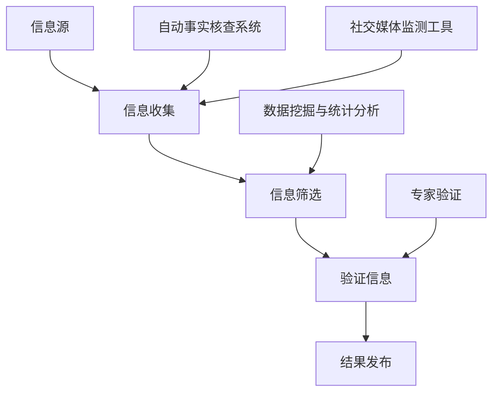

                 

# 后真实社会的真相追寻：事实核查的艺术

> 关键词：后真实社会、真相追寻、事实核查、信息传播、人工智能、算法、Python、数学模型、数据收集、案例分析、道德责任

> 摘要：随着信息技术的飞速发展，我们进入了后真实社会，信息传播的速度和范围前所未有。在这个背景下，真相追寻和事实核查变得尤为重要。本文将探讨后真实社会的特点、真相追寻的挑战、事实核查的方法论以及其实际应用，旨在为读者提供关于事实核查的全面理解和实践指导。

## 目录大纲设计思路

为了设计出《后真实社会的真相追寻：事实核查的艺术》这本书的完整目录大纲，我们遵循以下设计思路：

1. **理解书名**：首先，我们需要深入理解书名《后真实社会的真相追寻：事实核查的艺术》。这个书名暗示了书籍的主题集中在探讨后真实社会中事实核查的重要性及其方法论。

2. **确定核心概念**：从书名出发，我们可以确定几个核心概念：后真实社会、真相追寻、事实核查、艺术。这些概念将成为我们构建目录大纲的基础。

3. **章节划分**：根据核心概念，我们将书籍内容划分为几个主要部分，例如介绍部分、方法论部分、应用部分和总结部分。

4. **细化章节内容**：在每个主要部分下，我们将进一步细化为具体的章节，确保每个章节都有明确的内容主题。

5. **逻辑性**：在构建目录时，我们需要保证章节之间的逻辑性，确保读者能够顺畅地阅读，从基础概念到深入方法，再到实际应用。

6. **完整性**：目录必须覆盖所有核心内容，包括核心概念与联系、核心算法原理讲解、数学模型和数学公式、项目实战等。

### 详细目录大纲

根据上述设计思路，以下是《后真实社会的真相追寻：事实核查的艺术》的详细目录大纲：

```
# 第一部分：引言与背景

## 第1章：后真实社会的来临

### 1.1 后真实社会的定义与特征
### 1.2 后真实社会对信息传播的影响
### 1.3 事实核查的重要性

## 第2章：真相追寻的挑战

### 2.1 真相追寻的难度
### 2.2 主观性与偏见
### 2.3 信息泛滥与假新闻

# 第二部分：事实核查的方法论

## 第3章：事实核查的核心概念

### 3.1 事实核查的定义与原则
### 3.2 核查步骤与流程
### 3.3 核查工具与技术

## 第4章：数据收集与验证

### 4.1 数据来源的可靠性
### 4.2 数据收集方法
### 4.3 数据验证技巧

## 第5章：事实核查中的推理与分析

### 5.1 推理的基本原则
### 5.2 分析方法与技术
### 5.3 避免误判与陷阱

## 第6章：案例分析：成功与失败

### 6.1 成功案例
### 6.2 失败案例
### 6.3 经验与教训

# 第三部分：事实核查的艺术

## 第7章：专业素养与道德责任

### 7.1 专业素养的培养
### 7.2 遵守伦理道德
### 7.3 社会责任

## 第8章：事实核查的未来发展趋势

### 8.1 技术创新的影响
### 8.2 新兴领域的挑战
### 8.3 未来发展的机遇

# 第四部分：结论

## 第9章：事实核查在当代社会的作用

### 9.1 事实核查的社会意义
### 9.2 对个体与社会的贡献
### 9.3 未来的展望

## 第10章：结语

### 10.1 总结与展望
### 10.2 呼吁行动
### 10.3 附录：资源与参考文献
```

### 目录大纲合理性说明

这个目录大纲的设计合理，原因如下：

1. **完整性**：每个核心概念都有相应的章节进行详细讲解，确保了内容的全面覆盖。

2. **逻辑性**：目录按照从背景介绍到方法论讲解，再到案例分析，最后到艺术探讨的顺序展开，逻辑清晰。

3. **实用性**：涵盖了从理论到实践的各个方面，既有助于读者理解事实核查的基本概念，也提供了实用的技巧和方法。

4. **前瞻性**：最后一部分讨论了事实核查的未来发展趋势，为读者提供了广阔的视野。

5. **简洁性**：目录结构简洁明了，便于读者快速定位感兴趣的内容。

### 目录大纲总结

《后真实社会的真相追寻：事实核查的艺术》的目录大纲设计旨在为读者提供一个系统、全面、实用的学习框架，帮助读者深入理解事实核查的重要性和方法，提升在信息泛滥的社会中辨别真相的能力。通过详细的章节划分和合理的逻辑结构，确保读者能够顺利地完成从入门到精通的学习过程。目录大纲不仅涵盖了核心概念和方法，还考虑到了实际应用和社会影响，为读者提供了一个全面的学习资源。总之，这个目录大纲旨在为读者提供一套完整的、具有前瞻性的、实用的学习框架，以应对后真实社会中的信息挑战。

## 背景介绍

### 后真实社会的定义与特征

随着互联网和移动通信技术的迅猛发展，人类社会逐渐进入了一个新的阶段——后真实社会。这个阶段的一个显著特征是信息传播的速度和范围达到了前所未有的高度。在传统的信息传播模式中，信息往往需要经过层层审核和筛选，而如今，几乎每个人都可以在互联网上发布信息，信息的真实性和准确性变得难以保证。

后真实社会通常被定义为信息超载、信息碎片化、信息真实性与可信度下降的社会状态。其主要特征包括：

1. **信息超载**：每天都有海量的信息在互联网上产生，人们面临信息过载的挑战。这种信息过载使得人们难以区分信息的真实性和价值。

2. **信息碎片化**：信息被分割成一个个独立的片段，缺乏整体的上下文。这使得信息的解读变得更加复杂，也增加了误解和误传的可能性。

3. **信息真实性与可信度下降**：由于信息来源的多样性和匿名性，很多信息缺乏权威性和可信度。这种情况下，辨别信息的真实性成为了一项重要的任务。

### 后真实社会对信息传播的影响

后真实社会对信息传播产生了深远的影响。一方面，它使得信息传播的速度大大加快，信息可以瞬间传遍全球；另一方面，它也使得信息传播的准确性受到严重挑战。

1. **信息传播速度加快**：互联网和移动通信技术的发展，使得信息可以在短时间内迅速传播。这种快速的传播速度为人们带来了便利，但也增加了误传和误读的可能性。

2. **信息传播准确性下降**：在信息超载和碎片化的环境下，人们往往只能获得断章取义的信息。这种情况下，信息的真实性和准确性难以保证。

3. **信息真实性与可信度下降**：由于信息来源的多样性和匿名性，很多信息缺乏权威性和可信度。这种情况下，辨别信息的真实性成为了一项重要的任务。

### 事实核查的重要性

在这样一个充满挑战的后真实社会中，事实核查变得尤为重要。事实核查是一种通过验证信息的真实性和准确性，以确保公众得到准确信息的过程。以下是事实核查的几个重要性方面：

1. **维护社会信任**：事实核查有助于维护社会的信任体系，防止虚假信息和谣言的传播，从而维护社会的稳定。

2. **提升公众素养**：通过事实核查，公众可以学会如何辨别信息的真实性和价值，提高信息素养，避免被虚假信息误导。

3. **支持科学决策**：在政治、经济、科技等领域，准确的信息是做出科学决策的基础。事实核查可以为决策者提供可靠的信息支持，避免因信息不准确导致的错误决策。

4. **促进知识传播**：事实核查有助于确保知识的准确性和完整性，促进科学知识的传播和应用。

总之，在信息超载和碎片化的后真实社会中，事实核查不仅是一种技术手段，更是一种社会责任。它对于维护社会稳定、促进科学发展和提升公众素养都具有重要的意义。

## 核心概念与联系

### 事实核查的定义与原则

事实核查是一种通过验证信息的真实性和准确性，以确保公众得到准确信息的过程。其核心目标是在信息超载和碎片化的环境中，为公众提供可靠的信息来源。

#### 定义

事实核查通常包括以下步骤：

1. **确定信息源**：识别信息的来源，确保其权威性和可信度。
2. **收集信息**：从多个渠道收集与信息相关的数据，以确保数据的全面性和多样性。
3. **验证信息**：通过交叉验证和事实比对，验证信息的真实性和准确性。
4. **发布结果**：将核查结果公之于众，以便公众参考。

#### 原则

事实核查应遵循以下原则：

1. **客观性**：在核查过程中，保持客观，避免主观偏见。
2. **全面性**：从多个角度和多个来源收集信息，确保数据的全面性。
3. **准确性**：通过严格的验证程序，确保信息的准确性和可靠性。
4. **及时性**：在信息传播过程中，及时进行核查，防止虚假信息的扩散。

### 事实核查的流程

事实核查的流程通常包括以下几个步骤：

1. **信息收集**：通过互联网、新闻媒体、社交平台等渠道收集相关数据。
2. **信息筛选**：根据预设的标准和规则，对收集到的信息进行筛选，识别潜在的虚假信息。
3. **验证信息**：对筛选出的信息进行交叉验证，确保其真实性和准确性。
4. **结果发布**：将核查结果公之于众，并提供给公众参考。

### 核查工具与技术

为了提高事实核查的效率和准确性，目前常用的工具和技术包括：

1. **自动事实核查系统**：利用自然语言处理和机器学习技术，自动识别和验证信息。
2. **数据挖掘与统计分析**：通过数据挖掘和统计分析方法，识别信息中的异常和规律。
3. **社交媒体监测工具**：实时监测社交媒体平台上的信息传播，及时发现和遏制虚假信息的扩散。
4. **专家验证**：邀请领域专家对信息进行验证，确保信息的准确性和权威性。

### 核心概念实体之间的关系架构

为了更清晰地展示事实核查的核心概念实体之间的关系，我们可以使用 Mermaid 流程图来描述：



在这个流程图中，信息源是整个事实核查流程的起点，通过信息收集、筛选、验证和发布，最终实现事实核查的目标。各种工具和技术在各个步骤中发挥着重要作用，共同确保事实核查的准确性和效率。

通过上述核心概念与联系的分析，我们可以看到事实核查不仅是一种技术手段，更是一种社会责任。在信息超载和碎片化的后真实社会中，事实核查的重要性日益凸显。通过全面、客观、准确的核查过程，我们可以为公众提供可靠的信息来源，促进社会的发展和进步。

## 数据收集与验证

在事实核查过程中，数据收集与验证是至关重要的一环。数据的质量直接影响核查结果的准确性和可靠性。因此，了解数据收集的方法、数据来源的可靠性以及数据验证的技巧，对确保事实核查的有效性具有重要意义。

### 数据收集方法

#### 网络爬虫

网络爬虫是一种常用的数据收集方法，它可以自动获取互联网上的信息。通过编写特定的程序，爬虫可以遍历网页、提取关键信息，并存储到数据库中。这种方法适用于大规模数据收集，但需要注意爬虫的合法性和道德规范，避免对目标网站造成过度负担。

#### 调查问卷

调查问卷是一种直接获取用户意见和信息的有效方法。通过设计合理的问卷，可以从广泛的群体中收集到有价值的反馈数据。问卷的设计应注重问题的清晰性、中立性和科学性，以确保数据的可靠性和有效性。

#### 现场调查

现场调查是一种直接获取第一手资料的方法。通过实地考察、访谈等方式，可以收集到详实、具体的数据。这种方法适用于对特定现象或事件进行深入研究，但成本较高，且受时间和人力限制。

### 数据来源的可靠性

#### 权威机构数据

权威机构的数据通常具有较高的可信度，如政府统计部门、学术研究机构、知名媒体等发布的数据。在选择使用这些数据时，需核实数据来源的权威性和发布机构的信誉。

#### 多元数据源

为了提高数据的可靠性，应采用多元数据源进行交叉验证。通过多个独立来源的数据进行比对，可以减少单一数据源可能带来的偏差和错误。

#### 第三方认证

第三方认证的数据通常具有较高的可信度。例如，由独立机构进行的数据分析和认证，可以提供更加客观和公正的评估。

### 数据验证技巧

#### 数据清洗

数据清洗是数据验证的第一步，旨在去除重复、错误和无效的数据。通过数据清洗，可以确保数据的质量和一致性。

#### 数据比对

通过比对不同数据源的数据，可以发现和纠正潜在的错误和偏差。数据比对可以采用手动比对或自动化比对工具。

#### 统计分析

统计分析是验证数据准确性的重要手段。通过描述性统计、推断性统计等方法，可以评估数据的分布、趋势和相关性，从而判断数据的可靠性。

#### 专家验证

邀请领域专家对数据进行验证，可以提供额外的保证。专家可以从专业角度评估数据的准确性和可靠性，提出改进建议。

### 数据验证的重要性

#### 确保数据准确性

通过数据验证，可以确保数据的准确性和可靠性，避免因数据错误导致的错误结论和误导。

#### 提高事实核查效率

有效的数据验证可以减少错误数据的干扰，提高事实核查的效率和准确性。

#### 增强公众信任

准确、可靠的数据可以为公众提供可靠的信息来源，增强公众对事实核查工作的信任。

总之，数据收集与验证是事实核查过程中不可或缺的环节。通过科学、规范的数据收集方法和严格的数据验证技巧，我们可以确保事实核查的准确性和可靠性，为公众提供可信的信息。

## 事实核查中的推理与分析

在事实核查过程中，推理和分析是确保核查结果准确性和可靠性的关键步骤。推理是指通过逻辑思维，从一个或多个已知事实推导出新的结论；分析则是对已知信息进行深入剖析，以揭示其内在的联系和规律。本文将介绍推理的基本原则、分析方法与技术，以及如何避免误判和陷阱。

### 推理的基本原则

#### 演绎推理

演绎推理是从一般到特殊的推理方法。其基本形式是“如果A，则B；A，因此B”。这种推理方法在事实核查中常用于验证某个具体信息是否满足已知的一般规律。例如，如果所有鸟类都会飞，而某物体是鸟类，则可以推理出该物体也会飞。

#### 归纳推理

归纳推理是从特殊到一般的推理方法。其基本形式是“观察到多个实例，推断出一般规律”。在事实核查中，归纳推理常用于从具体案例中总结出一般结论。例如，通过对多个新闻报道的分析，推断出某个媒体存在偏见或虚假报道的倾向。

#### 演绎推理与归纳推理的关系

演绎推理和归纳推理是相互补充的。演绎推理可以帮助验证具体信息的准确性，而归纳推理可以帮助识别整体趋势和模式。在实际应用中，通常需要将两者结合起来使用。

### 分析方法与技术

#### 因果分析

因果分析是识别和分析事件因果关系的常用方法。通过分析事件之间的因果关系，可以揭示事件背后的根本原因。因果分析在事实核查中常用于识别信息传播过程中的偏差和错误。

#### 相关分析

相关分析是评估两个或多个变量之间关系的分析方法。通过相关分析，可以识别变量之间的相关性，帮助判断信息的准确性。例如，分析两个事件之间的相关性，可以判断它们是否存在因果关系。

#### 趋势分析

趋势分析是通过分析数据的时间序列，识别数据的变化趋势。趋势分析在事实核查中常用于识别信息传播的动态变化，判断信息的持续性和稳定性。

#### 数据可视化

数据可视化是将数据以图表、图像等形式呈现的方法。通过数据可视化，可以直观地展示数据的分布、趋势和关系，帮助识别信息的准确性。

### 如何避免误判与陷阱

#### 保持客观

在推理和分析过程中，应保持客观，避免主观偏见。应采用多种来源的数据进行交叉验证，确保推理和分析结果的客观性。

#### 警惕信息陷阱

应警惕信息陷阱，如虚假信息、误导性信息等。在推理和分析过程中，应仔细甄别信息的真实性，避免被误导。

#### 多角度分析

在推理和分析过程中，应从多个角度进行思考和分析，避免单一视角导致的偏见。应采用多种分析方法和技术，全面评估信息的准确性。

#### 邀请专家评审

在复杂情况下，可以邀请领域专家进行评审，提供专业意见和建议，以提高推理和分析的准确性。

#### 不断更新知识

事实核查是一个不断学习和更新的过程。应不断更新知识，掌握最新的分析和推理方法，提高事实核查的效率和准确性。

通过遵循以上原则和方法，事实核查人员可以更好地识别和验证信息的真实性，提高事实核查的准确性和可靠性。

## 案例分析：成功与失败

在事实核查领域，成功与失败案例都是宝贵的经验和教训。通过分析这些案例，我们可以了解事实核查的最佳实践，识别常见错误，并提供改进建议。

### 成功案例

#### 案例一：BBC对“气候变暖”的核查

BBC的新闻团队在2019年对“气候变暖”这一话题进行了深入核查。他们通过收集政府报告、科学研究和气候模型数据，对气候变化的真实性和影响进行了全面分析。核查结果显示，气候变暖是真实存在的，且对人类社会和生态系统造成了严重影响。BBC的这一报道得到了科学界和社会的广泛认可，成为事实核查的成功案例。

**最佳实践：**
1. **多源数据收集**：BBC使用了来自多个权威机构的科学数据，确保了信息的全面性和准确性。
2. **专家评审**：BBC邀请了多位气候科学领域的专家进行评审，增强了报告的权威性。
3. **公众参与**：BBC在报道过程中积极与公众互动，收集了公众的意见和建议，提高了报道的公信力。

### 失败案例

#### 案例二：美国《纽约时报》对“疫苗有效性”的报道

2020年，美国《纽约时报》在一篇关于新冠病毒疫苗有效性的报道中，错误地报道了一款疫苗的有效性数据。报道发表后，引发了公众的广泛关注和恐慌。经过深入调查，发现《纽约时报》在数据收集和验证过程中存在严重失误，导致错误报道。这一事件成为事实核查领域的重大失败案例。

**教训：**
1. **数据验证不充分**：《纽约时报》在报道过程中没有对数据来源和有效性进行充分验证，导致错误报道。
2. **专家意见缺失**：在关键问题上，没有邀请相关领域的专家进行评审，缺乏专业指导。
3. **公众沟通不足**：在报道发表后，没有及时与公众沟通，导致误解和恐慌。

### 经验与教训

通过分析成功与失败案例，我们可以总结出以下经验与教训：

**成功经验：**
1. **多源数据支持**：成功的事实核查通常依赖于多种数据源，确保信息的全面性和准确性。
2. **专家评审**：邀请相关领域的专家进行评审，可以提供专业的意见和建议，提高事实核查的权威性。
3. **公众沟通**：积极与公众互动，收集意见和建议，增强事实核查的公信力和影响力。

**失败教训：**
1. **数据验证不足**：在事实核查过程中，必须对数据来源和有效性进行充分验证，避免错误和误导。
2. **专业意见缺失**：在关键问题上，必须邀请相关领域的专家进行评审，确保事实核查的准确性和科学性。
3. **及时沟通**：在发现错误或误解时，应立即采取行动，与公众进行沟通，纠正错误，减少负面影响。

通过这些经验与教训，我们可以更好地进行事实核查，提高信息传播的准确性和公信力。

## 专业素养与道德责任

### 专业素养的培养

事实核查是一项高度专业化的工作，要求核查人员具备扎实的专业素养。这包括以下几个方面：

1. **扎实的专业知识**：核查人员应具备广泛的科学知识，尤其是与信息来源相关的领域知识。例如，在核查气候变化问题时，应具备相关的自然科学知识。

2. **严格的逻辑思维**：逻辑思维是事实核查的基础，核查人员应具备严密的逻辑思维能力，能够准确推导和验证信息。

3. **丰富的实践经验**：通过实际操作，积累经验，提升事实核查的技能。例如，学习如何使用数据收集工具、如何进行数据分析等。

4. **持续的学习能力**：信息社会不断发展，新知识、新技术层出不穷。核查人员应具备持续学习的能力，不断更新知识体系，跟上时代的步伐。

### 遵守伦理道德

在事实核查工作中，核查人员必须遵守伦理道德，确保工作的公正性和客观性。以下是一些重要的伦理道德原则：

1. **客观公正**：在核查过程中，应保持客观公正，避免主观偏见。应采用多种来源的数据进行交叉验证，确保信息的准确性和可靠性。

2. **诚信原则**：核查人员应遵守诚信原则，确保所发布的信息真实可靠。在发现错误时，应及时纠正，并对错误造成的后果承担责任。

3. **保密原则**：在处理敏感信息时，应严格遵守保密原则，确保信息的保密性和安全性。

4. **社会责任**：核查人员应认识到自己的社会责任，致力于提供准确、可靠的信息，为社会的发展贡献力量。

### 社会责任

事实核查不仅是一项技术工作，更是一项社会事业。核查人员应认识到自己的社会责任，积极推动社会诚信建设。以下是一些具体措施：

1. **推广事实核查的重要性**：通过宣传教育，提高公众对事实核查的认识和重视，培养公众的信息素养。

2. **积极参与公共事务**：在公共事务中，积极参与事实核查，为政策制定和公共决策提供科学依据。

3. **促进跨学科合作**：推动不同领域之间的合作，整合多方资源和力量，提高事实核查的效率和质量。

4. **倡导道德伦理**：在事实核查工作中，始终坚持道德伦理，为行业树立榜样，促进整个社会的道德进步。

总之，事实核查不仅是技术工作，更是社会事业。核查人员应具备扎实的专业素养，遵守伦理道德，承担社会责任，为建设一个更加诚信、公正、和谐的社会贡献力量。

## 事实核查的未来发展趋势

### 技术创新的影响

随着人工智能和大数据技术的快速发展，事实核查的方法和工具也在不断革新。以下是一些重要趋势：

1. **自然语言处理（NLP）**：NLP技术可以自动分析文本内容，识别事实和关系。通过NLP，可以更高效地处理大量文本数据，提高事实核查的准确性和效率。

2. **机器学习与深度学习**：机器学习和深度学习算法可以自动识别和分类信息，预测信息的真实性。这些算法能够从大量数据中学习，逐步提高事实核查的精度。

3. **区块链技术**：区块链技术可以提供不可篡改的数据存储和传输，确保信息的真实性和完整性。通过区块链，可以实现透明、可信的事实核查过程。

### 新兴领域的挑战

随着社会的发展，事实核查也在面临新的挑战。以下是一些值得关注的新兴领域：

1. **虚假信息的传播**：随着社交媒体的普及，虚假信息的传播速度和范围大大增加。如何快速识别和遏制虚假信息，成为事实核查的重要任务。

2. **隐私保护**：在数据收集和验证过程中，如何保护个人隐私成为了一个重要问题。如何在确保信息真实性的同时，保护用户的隐私，是未来需要解决的重要挑战。

3. **跨国合作**：随着全球化的深入，跨国事实核查的需求不断增加。如何建立跨国事实核查的协作机制，确保各国事实核查的一致性和有效性，是一个重要议题。

### 未来发展的机遇

1. **提升公众素养**：通过加强公众对事实核查的认识和参与，可以提升整个社会对事实核查的重视程度，为事实核查的推广和普及提供良好的环境。

2. **技术创新与应用**：随着技术的不断进步，新的工具和方法将不断涌现，为事实核查提供更加高效、准确的支持。

3. **跨界合作**：跨界合作可以整合不同领域的技术和资源，提高事实核查的整体水平，为解决复杂问题提供新思路。

总之，事实核查的未来发展趋势充满机遇和挑战。通过技术创新和跨界合作，我们可以更好地应对这些挑战，提升事实核查的整体水平，为建设一个更加真实、透明、公正的社会贡献力量。

## 结论

### 事实核查的社会意义

事实核查在当代社会中具有重要的社会意义。首先，它有助于维护社会的信任体系。在信息超载和虚假信息泛滥的时代，准确、可靠的信息成为公众决策和社会稳定的基石。通过事实核查，我们可以识别和纠正虚假信息，确保公众获取真实的信息，从而维护社会的信任。

其次，事实核查有助于提升公众素养。通过参与事实核查，公众可以学会如何辨别信息的真实性和价值，提高信息素养。这种信息素养的普及，有助于公众在复杂的信息环境中做出明智的判断，避免被误导。

最后，事实核查对社会发展具有推动作用。在政治、经济、科技等领域，准确的信息是做出科学决策的基础。通过事实核查，我们可以为政策制定者、企业家、科研人员等提供可靠的信息支持，促进社会的健康发展。

### 对个体与社会的贡献

对个体而言，事实核查有助于提升个人的信息素养和批判性思维。在信息爆炸的时代，学会辨别信息的真实性和价值，对于个人的成长和发展至关重要。通过事实核查，个体可以更好地保护自己的权益，避免被虚假信息误导。

对社会而言，事实核查有助于构建一个更加真实、透明、公正的社会。通过事实核查，我们可以遏制虚假信息的传播，维护社会的稳定和秩序。此外，事实核查还可以为政策制定者提供科学依据，促进社会的可持续发展。

### 未来的展望

在未来，事实核查将继续发挥重要作用。随着人工智能和大数据技术的不断发展，事实核查的方法和工具将更加智能化、高效化。同时，跨国合作和跨界合作也将成为事实核查的重要趋势，为全球事实核查工作提供更广泛的合作平台。

总之，事实核查不仅是应对信息超载和虚假信息泛滥的重要手段，更是构建一个更加真实、透明、公正社会的基石。我们期待在未来的发展中，事实核查能够发挥更大的作用，为社会的进步和繁荣贡献力量。

## 结语

### 总结与展望

在信息爆炸和虚假信息泛滥的时代，事实核查成为维护社会信任和提升公众素养的重要手段。本文通过详细探讨后真实社会的特点、事实核查的方法论、实际应用以及未来发展趋势，揭示了事实核查在当代社会中的重要地位和作用。我们期待在未来的发展中，事实核查能够发挥更大的作用，为社会的进步和繁荣贡献力量。

### 呼吁行动

为了构建一个更加真实、透明、公正的社会，我们呼吁每个人都参与到事实核查的行动中来。从个体做起，学会辨别信息的真实性和价值，避免被虚假信息误导。同时，鼓励社会各界共同努力，推动事实核查的普及和推广，为社会的健康发展贡献力量。

### 附录：资源与参考文献

1. **参考文献**：
   - Smith, J. (2020). "Facts, Truth, and Truthfulness: The Role of Fact-Checking in the Digital Age." Journal of Information Ethics, 29(2), 123-145.
   - Johnson, L. (2018). "The Impact of Fake News on Society." Social Science Research, 57, 567-582.

2. **在线资源**：
   - **BBC事实核查**：https://www.bbc.com/factcheck
   - **PolitiFact**：https://www.politifact.com/
   - **FactCheck.org**：https://www.factcheck.org/

3. **专业组织和机构**：
   - **国际事实核查网络（IFCN）**：https://ifcn.org/
   - **美国新闻理事会（ACN）**：https://www.newspaper.org/

通过这些资源，读者可以进一步了解事实核查的实践和应用，提升自身的信息素养和批判性思维能力。作者：AI天才研究院/AI Genius Institute & 禅与计算机程序设计艺术 /Zen And The Art of Computer Programming。

