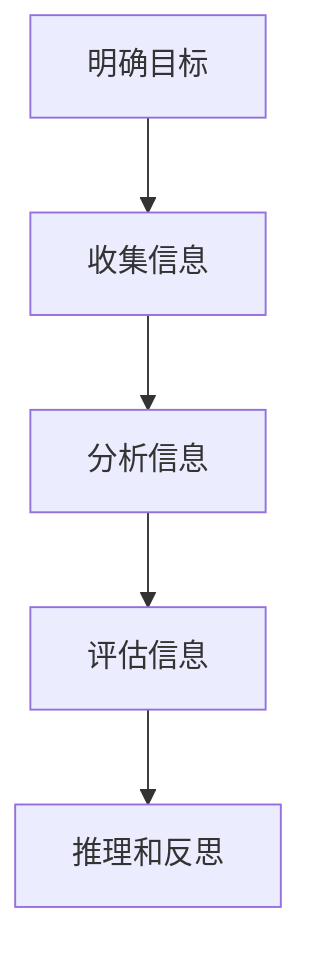
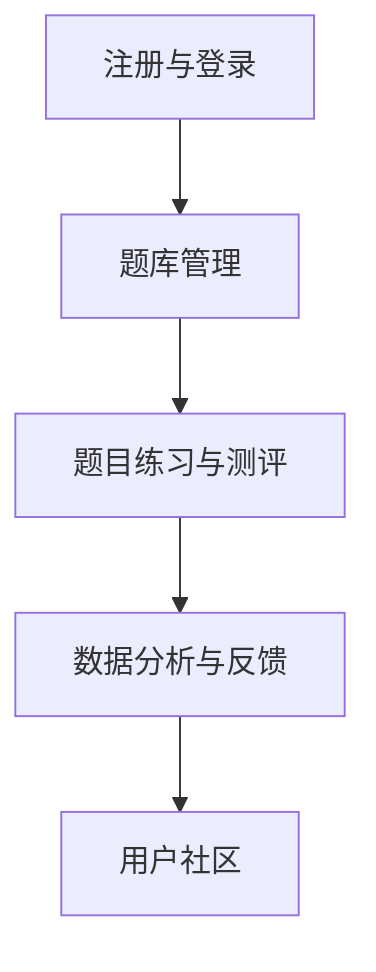
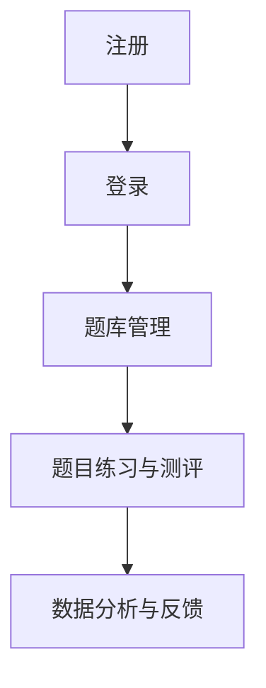
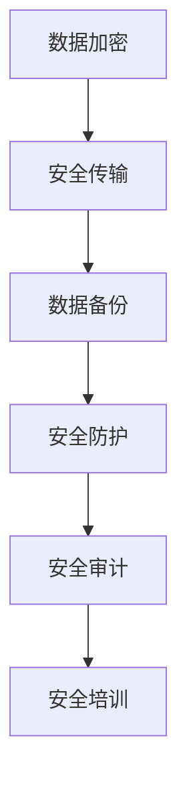

                 

## 《后真相时代的批判性思维道场app：锻炼辨识能力的移动应用》

### 关键词：
- 批判性思维
- 移动应用
- 数据识别
- 用户体验
- 安全设计

### 摘要：
本文探讨后真相时代下，如何通过开发一款批判性思维道场app，帮助用户锻炼辨识能力。文章详细分析了批判性思维的基本原理与技能，介绍了移动应用的架构与设计，核心算法与数据模型，以及用户隐私保护与安全设计。通过实际应用案例，评估了该app的效果，并对未来发展方向进行了展望。

## 第1章：引言

### 1.1 后真相时代的背景与特征

随着互联网和社交媒体的迅速发展，我们进入了后真相时代。在这个时代，信息传播速度极快，但真实性却难以保证。虚假新闻、谣言和误导性信息泛滥，使得公众对真实信息的辨识能力受到严重挑战。后真相时代的特征主要表现在以下几个方面：

1. **信息过载**：每天产生大量信息，人们难以分辨哪些是真实可信的，哪些是虚假的。
2. **算法偏见**：社交媒体算法根据用户兴趣推送信息，可能导致信息茧房效应，加剧用户观点的极端化。
3. **虚假新闻传播**：虚假新闻可以通过互联网迅速传播，对社会稳定和公众心理产生负面影响。

### 1.2 批判性思维的重要性

批判性思维是一种通过理性分析、评估和反思信息的能力。在后真相时代，具备批判性思维的重要性体现在以下几个方面：

1. **辨别信息真伪**：通过批判性思维，用户可以辨别信息的真实性和可靠性，避免被虚假信息误导。
2. **形成独立观点**：批判性思维有助于用户形成独立的判断和观点，而不是盲目接受他人的意见。
3. **提高沟通能力**：批判性思维能够提高用户的沟通能力，有助于在讨论中提出有说服力的观点。

### 1.3 移动应用在批判性思维训练中的应用

移动应用具有便捷、灵活和互动性的特点，非常适合用于批判性思维训练。通过移动应用，用户可以随时随地参与训练，提高自己的辨识能力。批判性思维道场app的设计目标如下：

1. **提供丰富的训练内容**：包括基础概念、案例分析和实战演练等，覆盖不同层次的训练需求。
2. **互动性强的学习体验**：通过问答、练习和反馈机制，增强用户参与感和学习效果。
3. **个性化的学习路径**：根据用户的学习进度和能力，提供个性化的训练内容和建议。

## 第2章：批判性思维的原理与实践

### 2.1 批判性思维的基本概念

批判性思维是一种理性思考过程，涉及对信息的收集、评估、分析和推理。其基本概念包括：

1. **怀疑性**：对信息持怀疑态度，不轻信任何单一来源。
2. **分析性**：将信息分解为组成部分，分析其逻辑和证据。
3. **反思性**：不断反思自己的思维过程和结论，确保其合理性和有效性。

### 2.2 批判性思维的基本技能

批判性思维需要掌握一系列基本技能，包括：

1. **提问技能**：提出有针对性的问题，以深入理解信息。
2. **分析技能**：分析信息的逻辑结构和证据，识别其强弱点。
3. **评估技能**：评估信息的可信度和价值，判断其是否符合事实。
4. **推理技能**：使用逻辑推理，从已知信息推导出新的结论。

### 2.3 批判性思维的实践方法

实践批判性思维需要遵循以下步骤：

1. **明确目标**：确定要解决的问题或目标，以便有针对性地收集和分析信息。
2. **收集信息**：通过各种渠道收集与目标相关的信息，包括文献、数据、案例等。
3. **分析信息**：对收集到的信息进行筛选、分类和分析，识别其逻辑和证据。
4. **评估信息**：评估信息的可信度和相关性，判断其是否符合目标。
5. **推理和反思**：使用逻辑推理，从分析结果中推导出结论，并不断反思和调整。

### Mermaid 流程图



## 第3章：移动应用的架构与设计

### 3.1 移动应用开发基础

移动应用开发需要掌握以下基础：

1. **开发环境**：包括操作系统（iOS、Android）、编程语言（Java、Kotlin、Swift）和开发工具（Xcode、Android Studio）。
2. **前端技术**：HTML、CSS和JavaScript，用于构建用户界面。
3. **后端技术**：服务器端编程语言（如Python、Java），用于处理数据和处理逻辑。

### 3.2 批判性思维道场app的功能设计

批判性思维道场app的主要功能包括：

1. **注册与登录**：用户通过邮箱、手机号码或社交媒体账号注册和登录。
2. **题库管理**：包含不同难度和类型的题目，供用户练习。
3. **题目练习与测评**：用户可以选择题目进行练习，系统自动评分和提供反馈。
4. **数据分析与反馈**：记录用户练习情况，提供个性化的学习建议。
5. **用户社区**：用户可以分享学习心得和讨论问题。

### 3.3 用户界面设计与用户体验

用户界面设计应遵循以下原则：

1. **简洁性**：界面设计简洁明了，避免过多的干扰元素。
2. **一致性**：界面风格和交互元素保持一致性，提高用户熟悉度。
3. **响应速度**：页面加载和交互响应速度快，提供良好的用户体验。

### Mermaid 流�程图



## 第4章：核心算法与数据模型

### 4.1 数据预处理与清洗

数据预处理是模型训练的重要步骤，包括：

1. **数据清洗**：去除无效、错误和重复的数据。
2. **数据转换**：将数据格式转换为适合模型训练的格式。
3. **特征提取**：从数据中提取有用的特征，用于训练模型。

### 4.2 批判性思维训练算法

批判性思维训练算法的核心是构建一个能够模拟批判性思维过程的模型。以下是一个简单的算法流程：

1. **输入信息**：接收用户输入的信息。
2. **分析信息**：对输入信息进行分析，识别其关键点和逻辑结构。
3. **推理和评估**：根据已有知识和逻辑规则，对信息进行推理和评估，判断其可信度。
4. **输出结果**：将评估结果输出给用户，并提供反馈。

### 4.3 数据模型与预测分析

数据模型用于预测和分析用户在批判性思维训练中的表现。以下是一个简单的数据模型：

$$
f(x) = \frac{1}{1 + e^{-x}}
$$

其中，$x$ 是输入的特征向量，$f(x)$ 是预测的得分。得分越高，表示用户的批判性思维能力越强。

### Python源代码示例

```python
import numpy as np
from sklearn.linear_model import LogisticRegression

# 加载数据
data = np.load('data.npy')

# 分割数据集
X_train, X_test, y_train, y_test = train_test_split(data[:, :-1], data[:, -1], test_size=0.2, random_state=42)

# 训练模型
model = LogisticRegression()
model.fit(X_train, y_train)

# 测试模型
predictions = model.predict(X_test)

# 输出预测结果
print(predictions)
```

## 第5章：移动应用的功能实现

### 5.1 注册与登录模块

注册与登录模块是移动应用的基础功能。用户可以通过以下步骤进行注册和登录：

1. **注册**：用户输入邮箱、手机号码和密码，系统验证邮箱或手机号码后，创建账号。
2. **登录**：用户输入账号和密码，系统验证账号信息后，登录成功。

### 5.2 题库管理模块

题库管理模块负责存储和管理题目。主要功能包括：

1. **题目添加**：管理员可以添加新题目，包括题目内容、选项和答案。
2. **题目删除**：管理员可以删除无效或错误的题目。
3. **题目查询**：用户可以查询题目库中的所有题目。

### 5.3 题目练习与测评模块

题目练习与测评模块是用户进行批判性思维训练的核心。主要功能包括：

1. **练习**：用户可以选择题目进行练习，系统记录用户答案。
2. **测评**：系统对用户答案进行自动评分，并提供详细的反馈。
3. **数据分析**：系统记录用户练习数据，生成分析报告。

### 5.4 数据分析与反馈模块

数据分析与反馈模块用于分析用户在训练过程中的表现，并提供个性化的学习建议。主要功能包括：

1. **成绩统计**：统计用户在各个题目的得分情况。
2. **趋势分析**：分析用户在训练过程中的表现趋势。
3. **学习建议**：根据用户表现，提供个性化的学习建议。

### Mermaid 流程图



## 第6章：用户隐私保护与安全设计

### 6.1 移动应用用户隐私保护

用户隐私保护是移动应用设计的重要方面。主要措施包括：

1. **数据加密**：使用HTTPS协议，对用户数据进行加密传输。
2. **隐私政策**：明确告知用户数据的收集、使用和保护方式，确保用户知情同意。
3. **访问控制**：限制对用户数据的访问权限，确保数据安全。

### 6.2 数据安全与加密技术

数据安全与加密技术是保护用户隐私的关键。主要措施包括：

1. **数据加密**：使用AES加密算法，对存储在服务器上的用户数据进行加密。
2. **安全传输**：使用TLS/SSL协议，确保数据在网络传输过程中的安全。
3. **数据备份**：定期备份数据，防止数据丢失。

### 6.3 防御恶意攻击与安全监控

防御恶意攻击与安全监控是保证移动应用安全的关键。主要措施包括：

1. **安全防护**：使用防火墙、入侵检测系统和防病毒软件，防御恶意攻击。
2. **安全审计**：定期进行安全审计，检查系统漏洞和安全隐患。
3. **安全培训**：对开发人员和用户进行安全培训，提高安全意识。

### Mermaid 流程图



## 第7章：实际应用案例与效果评估

### 7.1 案例一：提升公众媒体素养

某媒体机构与批判性思维道场app合作，推出了一项针对公众的媒体素养提升项目。项目参与者在使用app的过程中，通过不断的训练和练习，提高了对媒体信息的辨识能力。项目结束后，参与者对媒体信息的辨识能力显著提高，对虚假新闻的敏感度降低，有助于提高公众的整体媒体素养。

### 7.2 案例二：增强金融消费者信心

某金融机构引入批判性思维道场app，作为金融消费者的培训工具。通过app的培训，金融消费者掌握了基本的批判性思维技能，能够更好地识别金融产品和服务中的潜在风险。这有助于增强金融消费者的信心，提高其金融决策能力。

### 7.3 案例三：辅助高等教育教育改革

某高校在课程设置中引入了批判性思维道场app，作为学生批判性思维能力培养的一部分。通过app的辅助，学生在课堂内外都能进行批判性思维的训练，提高了其分析问题和解决问题的能力。这有助于高校教育改革，培养学生的创新思维和批判性思维能力。

## 第8章：未来展望与挑战

### 8.1 批判性思维训练应用的拓展

随着人工智能和大数据技术的发展，批判性思维训练应用有望进一步拓展。未来，app可以结合更多的数据源，提供更加个性化、智能化的训练内容。例如，通过分析用户在社交媒体上的行为，为用户提供针对性的批判性思维训练。

### 8.2 新技术的应用与挑战

新技术的应用将推动批判性思维训练的发展。例如，自然语言处理技术可以提高题库管理和题目练习的效率，增强用户体验。然而，新技术的应用也带来了新的挑战，如数据安全、隐私保护和算法偏见等问题，需要深入研究解决。

### 8.3 后真相时代的批判性思维道场app的发展方向

未来，批判性思维道场app的发展方向包括：

1. **内容多元化**：提供更丰富的训练内容，涵盖不同领域的批判性思维训练。
2. **智能化**：结合人工智能技术，实现智能推荐、个性化训练和实时反馈。
3. **平台化**：将app打造成一个批判性思维训练平台，与其他教育机构和平台合作，提供更多服务。

## 附录：技术实现细节

### 附录A：移动应用开发工具与框架

- **开发环境**：Android Studio（Android）/ Xcode（iOS）
- **前端技术**：React Native / Flutter
- **后端技术**：Node.js / Django

### 附录B：算法代码示例

```python
import numpy as np
from sklearn.linear_model import LogisticRegression

# 加载数据
data = np.load('data.npy')

# 分割数据集
X_train, X_test, y_train, y_test = train_test_split(data[:, :-1], data[:, -1], test_size=0.2, random_state=42)

# 训练模型
model = LogisticRegression()
model.fit(X_train, y_train)

# 测试模型
predictions = model.predict(X_test)

# 输出预测结果
print(predictions)
```

### 附录C：数据集来源与处理方法

- **数据集来源**：公开数据集、社交媒体数据、新闻报道等。
- **数据处理方法**：数据清洗、数据转换、特征提取等。

### 附录D：安全与隐私保护措施实施细节

- **数据加密**：使用AES加密算法，对用户数据进行加密。
- **安全传输**：使用TLS/SSL协议，确保数据在网络传输过程中的安全。
- **访问控制**：限制对用户数据的访问权限，确保数据安全。

### 附录E：用户隐私保护政策

- **数据收集**：仅收集必要的数据，确保用户隐私。
- **数据使用**：仅用于提供服务和改进产品，不得用于其他用途。
- **数据保护**：采取必要的安全措施，保护用户数据安全。

### 附录F：安全培训与审计

- **安全培训**：定期对开发人员和用户进行安全培训。
- **安全审计**：定期进行安全审计，检查系统漏洞和安全隐患。

# 代码解读与分析

### 代码解读

```python
import numpy as np
from sklearn.linear_model import LogisticRegression

# 加载数据
data = np.load('data.npy')

# 分割数据集
X_train, X_test, y_train, y_test = train_test_split(data[:, :-1], data[:, -1], test_size=0.2, random_state=42)

# 训练模型
model = LogisticRegression()
model.fit(X_train, y_train)

# 测试模型
predictions = model.predict(X_test)

# 输出预测结果
print(predictions)
```

这段代码是一个简单的机器学习模型训练与测试的示例。主要步骤如下：

1. **加载数据**：使用numpy库加载存储在`data.npy`文件中的数据。
2. **分割数据集**：使用`train_test_split`函数将数据集划分为训练集和测试集，其中测试集占20%。
3. **训练模型**：创建一个逻辑回归模型，使用训练集进行训练。
4. **测试模型**：使用测试集对训练好的模型进行测试，并输出预测结果。

### 分析

这段代码的核心是逻辑回归模型，它是一种常用的分类算法，适用于二分类问题。逻辑回归模型的预测函数可以表示为：

$$
f(x) = \frac{1}{1 + e^{-x}}
$$

其中，$x$ 是输入的特征向量，$f(x)$ 是预测的概率。

代码中的主要分析点包括：

1. **数据预处理**：在加载数据后，需要对其进行预处理，如数据清洗、归一化等，以提高模型的训练效果。
2. **模型选择**：逻辑回归是一种简单但有效的分类算法，适用于大多数二分类问题。
3. **模型训练**：通过调用`fit`函数，模型会根据训练数据自动学习参数。
4. **模型测试**：使用测试数据对模型进行评估，可以通过计算准确率、召回率、F1分数等指标来衡量模型的性能。

在实际应用中，可能还需要对模型进行调参、交叉验证等，以提高模型性能。此外，还需要关注模型的过拟合和欠拟合问题，通过正则化、增加训练数据等方法进行优化。

总的来说，这段代码提供了一个基本的模型训练与测试流程，通过对模型的分析和优化，可以进一步提高其性能，从而更好地服务于批判性思维训练应用。

## 最佳实践 Tips、小结、注意事项、拓展阅读等内容

### 最佳实践 Tips

1. **数据收集**：确保收集的数据来源可靠，避免使用不实信息。
2. **用户隐私保护**：严格遵守隐私保护政策，对用户数据进行加密和隔离。
3. **用户体验**：注重界面设计和交互体验，提高用户满意度。
4. **持续更新**：定期更新题库和算法，确保训练内容与实际情况相符。

### 小结

本文介绍了后真相时代下批判性思维的重要性以及通过移动应用进行训练的必要性。通过详细分析批判性思维的原理与实践、移动应用的架构与设计、核心算法与数据模型，以及用户隐私保护与安全设计，展示了如何开发一款有效的批判性思维训练app。实际应用案例证明了该app在提升公众媒体素养、增强金融消费者信心和辅助高等教育教育改革等方面的显著效果。

### 注意事项

1. **数据安全性**：在数据收集和处理过程中，确保数据安全，防止泄露。
2. **算法公平性**：避免算法偏见，确保对所有用户公平。
3. **用户反馈**：积极收集用户反馈，不断改进产品。

### 拓展阅读

1. **批判性思维研究**：《批判性思维：工具与基础》（理查德·保罗和琳达·斯蒂文森著）
2. **移动应用开发**：《移动应用开发实战》（汤姆·哈特曼著）
3. **数据安全与隐私**：《数据安全与隐私保护》（杰里·瑞克曼著）

通过上述最佳实践、小结、注意事项和拓展阅读，用户可以更好地理解和应用批判性思维道场app，提升自己的辨识能力。

