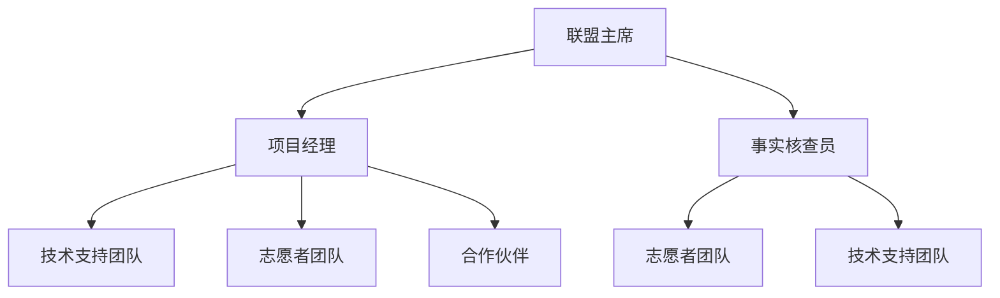
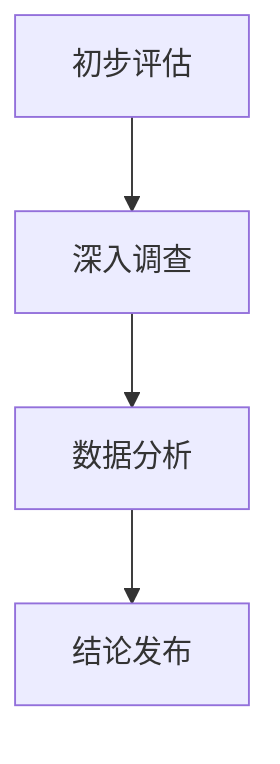

                 

### 第一部分：引言与背景

#### 1.1 书籍主题介绍

在当今的信息时代，虚假信息和误导性内容层出不穷，严重影响了社会的正常运转和公众的认知。特别是在“后真相时代”，事实和真相往往被情感、偏见和谣言所取代，这使得真相的守护变得更加重要。因此，本书旨在探讨如何建立真相守护者联盟，通过事实核查志愿者网络，来应对后真相时代的信息泛滥问题。

**后真相时代的定义**

“后真相时代”指的是一个以情感和偏见为主导，而非基于事实和理性的社会环境。在这个时代，虚假信息和真相之间的界限变得模糊，公众往往更易受到情绪化和情感化的内容影响，而忽略了事实的客观性和科学性。

**真相守护者联盟的重要性**

真相守护者联盟是一个由志愿者组成的网络，旨在通过事实核查来揭示真相，防止虚假信息的传播。这个联盟的重要性在于：

1. **提高公众认知**：通过事实核查，可以帮助公众更好地理解复杂的问题，避免被虚假信息误导。
2. **维护社会秩序**：虚假信息的传播可能引发恐慌、动荡和不稳定，真相守护者联盟可以有效地维护社会的正常运转。
3. **促进公民参与**：志愿者网络鼓励公民积极参与到事实核查中来，提高公众的信息素养和责任感。

#### 1.2 事实核查的概念

**事实核查的定义**

事实核查是指通过验证信息来源、分析信息内容、比对多方面证据，来确定信息真实性的一系列过程。它不仅仅是对信息的简单核对，而是涉及多方面的研究和分析。

**事实核查的目的**

事实核查的主要目的是：

1. **揭示真相**：通过核查信息，找出真实的事实，防止虚假信息的传播。
2. **提高公众意识**：帮助公众了解如何辨别虚假信息，提高他们的信息素养。
3. **维护社会公正**：防止虚假信息对个人、组织和社会造成的负面影响。

#### 1.3 志愿者网络的作用

**志愿者网络在事实核查中的作用**

志愿者网络在事实核查中扮演了关键角色，他们通过以下方式发挥作用：

1. **信息收集**：志愿者可以从各种渠道收集信息，包括社交媒体、新闻报道等。
2. **初步评估**：志愿者可以对收集到的信息进行初步评估，判断其可能的真实性。
3. **深入调查**：对于初步评估为可能虚假的信息，志愿者可以进行深入调查，收集更多的证据。
4. **结论发布**：志愿者将核查结果公布于众，帮助公众了解真相。

**志愿者网络的构成**

志愿者网络通常由以下几部分构成：

1. **志愿者**：他们是事实核查的主要力量，具备一定的专业知识和分析能力。
2. **团队协调者**：负责协调志愿者之间的工作，确保事实核查的顺利进行。
3. **技术支持者**：提供技术工具和资源，如数据分析软件、数据库等，以支持志愿者的工作。
4. **合作伙伴**：包括新闻机构、学术机构等，他们可以为志愿者提供更多的资源和信息。

综上所述，真相守护者联盟和事实核查志愿者网络在后真相时代具有重要的价值和作用。通过建立这样的联盟和网络，我们可以更好地应对信息泛滥和虚假信息的挑战，维护社会的正常运转和公众的认知。在接下来的章节中，我们将进一步探讨真相守护者联盟的组织结构、事实核查的流程、技巧和技术，以及具体的案例研究。

---

### 第一部分：引言与背景

#### 1.1 书籍主题介绍

**后真相时代的定义**

在后真相时代，真相不再是基于事实和理性的核心。信息传播的速度和广度使得真相往往被情感、偏见和谣言所取代。这种时代背景下，公众更容易受到情绪化和情感化内容的影响，而非基于事实的理性分析。

**真相守护者联盟的重要性**

真相守护者联盟是一个由志愿者组成的网络，旨在通过事实核查来揭示真相，防止虚假信息的传播。这一联盟的重要性体现在以下几个方面：

1. **提高公众认知**：通过事实核查，可以帮助公众更好地理解复杂的问题，避免被虚假信息误导。
2. **维护社会秩序**：虚假信息的传播可能引发恐慌、动荡和不稳定，真相守护者联盟可以有效地维护社会的正常运转。
3. **促进公民参与**：志愿者网络鼓励公民积极参与到事实核查中来，提高公众的信息素养和责任感。

#### 1.2 事实核查的概念

**事实核查的定义**

事实核查是指通过验证信息来源、分析信息内容、比对多方面证据，来确定信息真实性的一系列过程。它不仅仅是对信息的简单核对，而是涉及多方面的研究和分析。

**事实核查的目的**

事实核查的主要目的是：

1. **揭示真相**：通过核查信息，找出真实的事实，防止虚假信息的传播。
2. **提高公众意识**：帮助公众了解如何辨别虚假信息，提高他们的信息素养。
3. **维护社会公正**：防止虚假信息对个人、组织和社会造成的负面影响。

#### 1.3 志愿者网络的作用

**志愿者网络在事实核查中的作用**

志愿者网络在事实核查中扮演了关键角色，他们通过以下方式发挥作用：

1. **信息收集**：志愿者可以从各种渠道收集信息，包括社交媒体、新闻报道等。
2. **初步评估**：志愿者可以对收集到的信息进行初步评估，判断其可能的真实性。
3. **深入调查**：对于初步评估为可能虚假的信息，志愿者可以进行深入调查，收集更多的证据。
4. **结论发布**：志愿者将核查结果公布于众，帮助公众了解真相。

**志愿者网络的构成**

志愿者网络通常由以下几部分构成：

1. **志愿者**：他们是事实核查的主要力量，具备一定的专业知识和分析能力。
2. **团队协调者**：负责协调志愿者之间的工作，确保事实核查的顺利进行。
3. **技术支持者**：提供技术工具和资源，如数据分析软件、数据库等，以支持志愿者的工作。
4. **合作伙伴**：包括新闻机构、学术机构等，他们可以为志愿者提供更多的资源和信息。

**1.1 书籍主题介绍**

《后真相时代的真相守护者联盟：事实核查志愿者网络》这本书旨在探讨如何建立一个有效的真相守护者联盟，通过事实核查志愿者网络，来应对后真相时代的信息泛滥问题。具体来说，本书将涵盖以下几个方面的内容：

1. **真相守护者联盟的组织与运作**：介绍真相守护者联盟的基本架构、组织结构、运作流程以及志愿者招募与培训等方面的内容。
2. **事实核查的方法与技巧**：探讨事实核查的基本流程、工具与技术，包括网络搜索与分析、数据挖掘与统计分析、数据可视化工具等。
3. **志愿者网络与协作**：讨论志愿者网络的招募与培训、协作与协调机制，以及质量控制与反馈机制等方面。
4. **实践与案例分析**：通过具体的案例研究，展示真相守护者联盟在实际操作中的应用和成效。
5. **国际合作与影响**：探讨国际真相守护者联盟的合作模式、对全球事实核查工作的影响以及未来发展方向。

通过以上内容的探讨，本书希望能够为公众、政策制定者和技术专家提供有价值的参考，共同应对后真相时代的信息挑战。

### 第一部分：引言与背景

#### 1.3 志愿者网络的作用

在事实核查的战斗中，志愿者网络的作用不可低估。它们不仅是一个信息收集和验证的平台，更是现代社会维护真相的重要力量。

**志愿者网络在事实核查中的作用**

1. **信息收集**：志愿者是信息收集的前沿阵地，他们可以从各种来源，如社交媒体、新闻报道等，搜集可能存在虚假信息的内容。
2. **初步评估**：在收集到信息后，志愿者会进行初步的评估，判断信息是否值得进一步核查。这种初步评估可以帮助筛选出最有可能存在问题的信息，提高后续核查的效率。
3. **深入调查**：对于初步评估为有问题的信息，志愿者会进行深入的调查，收集更多的证据和资料，以便确定其真实性。
4. **结论发布**：核查完成后，志愿者会将结果发布出去，无论是确认信息的真实性还是揭示其虚假性，这都有助于公众了解真相，避免被误导。

**志愿者网络的构成**

志愿者网络通常由以下几个部分组成：

1. **志愿者**：他们是网络的核心，通常具备一定的专业知识和分析能力。他们可以是普通公民、学生、专业人士等，他们在自己的领域内发挥专业特长，共同维护真相。
2. **团队协调者**：负责协调志愿者之间的工作，确保信息流转顺畅，任务分配合理。他们通常具备管理经验，能够有效地组织团队工作。
3. **技术支持者**：提供技术工具和资源，如数据分析软件、数据库等，以支持志愿者的工作。他们可以是技术公司、学术机构等，他们的专业知识和技术资源对于提高事实核查的效率和质量至关重要。
4. **合作伙伴**：包括新闻机构、学术机构、政府机构等，他们可以为志愿者提供更多的资源和信息，也可以帮助将核查结果传播给更广泛的公众。

**具体案例**

以2016年美国总统选举期间的虚假新闻为例，真相守护者联盟通过志愿者网络，对社交媒体上的虚假信息进行了广泛核查。他们发现并揭露了许多旨在影响选举结果的不实消息。例如，他们揭露了一个名为“Pizzagate”的虚假阴谋论，该理论声称某个餐厅是儿童性交易的场所，这一虚假信息在社交媒体上引起了恐慌和骚动。通过志愿者的努力，真相得以澄清，社会秩序得以恢复。

**结论**

志愿者网络在事实核查中发挥着至关重要的作用。他们不仅能够迅速收集和评估信息，还能通过深入调查揭示真相。通过志愿者的共同努力，真相守护者联盟能够有效地应对虚假信息的挑战，维护社会的正常运转和公众的认知。在接下来的章节中，我们将进一步探讨真相守护者联盟的组织结构、运作流程和技术方法。

---

### 第二部分：真相守护者联盟的组织与运作

#### 2.1 真相守护者联盟的组织结构

真相守护者联盟是一个复杂的网络，由多个角色和层级构成，以确保事实核查的高效和准确。以下是真相守护者联盟的基本组织结构：

1. **联盟主席**：负责总体指导和决策，确保联盟的战略目标和使命得到执行。
2. **项目经理**：负责协调各个项目，确保项目的顺利进行和目标的实现。
3. **事实核查员**：是联盟的核心力量，负责实际的事实核查工作，包括信息收集、初步评估、深入调查和结论发布。
4. **技术支持团队**：提供技术工具和资源，包括数据分析软件、数据库、自动化工具等，以支持事实核查员的工作。
5. **志愿者团队**：由普通公民和专业人士组成，他们协助事实核查员进行信息收集和初步评估，扩大了信息核查的范围和速度。
6. **合作伙伴**：包括新闻机构、学术机构、政府机构等，他们提供额外的资源和信息，协助联盟扩大影响力和提高工作效率。

**组织架构图**



**各个角色的职责**

1. **联盟主席**：制定联盟的战略和目标，协调各个项目，确保资源的有效分配。
2. **项目经理**：负责项目的整体管理和协调，确保项目按时完成并达到预期目标。
3. **事实核查员**：进行信息收集、评估、调查和结论发布，是事实核查的核心。
4. **技术支持团队**：提供技术工具和资源，帮助事实核查员更高效地进行工作。
5. **志愿者团队**：协助事实核查员进行信息收集和初步评估，提高工作效率。
6. **合作伙伴**：提供额外的资源和信息，帮助联盟扩大影响力。

#### 2.2 事实核查的流程

真相守护者联盟的事实核查流程是一个系统化的过程，包括以下几个步骤：

1. **初步评估**：志愿者和事实核查员收集到信息后，首先对其进行初步评估，判断其可能的真实性。这一步骤通常基于经验和对信息的快速分析。
2. **深入调查**：对于初步评估为可能存在问题的信息，事实核查员会进行更深入的调查研究，收集更多的证据和资料，以便确定其真实性。
3. **数据分析**：在收集到足够的证据后，事实核查员会使用数据分析工具和方法，对证据进行深入分析，以确定信息的真实性。
4. **结论发布**：在分析完成后，事实核查员会发布核查结果，将真相传达给公众。这一步骤通常包括详细的报告和结论，有时还会通过新闻媒体等渠道进行传播。

**事实核查流程图**



**初步评估**

在初步评估阶段，志愿者和事实核查员通常会关注以下几个方面：

1. **信息来源**：检查信息的来源是否可靠，是否存在抄袭或谣言传播的痕迹。
2. **语言特征**：分析信息的语言特征，如语法错误、逻辑不通等，这些往往是虚假信息的特点。
3. **证据支撑**：检查信息是否有足够的证据支撑，如引用的数据、图片、视频等是否真实可信。

**深入调查**

在深入调查阶段，事实核查员会进行以下工作：

1. **交叉验证**：通过其他来源验证信息的真实性，如查阅官方报告、学术论文等。
2. **背景调查**：对信息中的关键人物、地点、事件等进行背景调查，了解其真实性。
3. **专家咨询**：咨询相关领域的专家，获取专业意见和建议。

**数据分析**

在数据分析阶段，事实核查员会使用以下工具和方法：

1. **数据挖掘**：使用数据挖掘技术，从大量数据中提取有用的信息。
2. **统计分析**：使用统计分析方法，对数据进行分析，找出潜在的趋势和模式。
3. **可视化工具**：使用数据可视化工具，将分析结果以图表等形式呈现，便于理解和传播。

**结论发布**

在结论发布阶段，事实核查员会：

1. **撰写报告**：撰写详细的核查报告，包括信息来源、调查过程、分析结果等。
2. **传播结果**：通过新闻媒体、社交媒体等渠道，将核查结果传播给公众。
3. **互动反馈**：接受公众的反馈和质疑，对结论进行进一步讨论和验证。

通过以上步骤，真相守护者联盟能够有效地进行事实核查，揭示真相，维护社会的正常运转和公众的认知。

### 第二部分：真相守护者联盟的组织与运作

#### 2.3 志愿者的招募与培训

**志愿者的招募标准**

志愿者的招募是真相守护者联盟能否有效运作的关键。为了确保志愿者的专业性和可靠性，联盟通常设定以下招募标准：

1. **基本素质**：志愿者应具备良好的道德品质和责任感，能够诚实、公正地对待每一项任务。
2. **专业知识**：志愿者应具备相关的专业知识，如新闻学、社会学、计算机科学等，以便能够对信息进行准确的分析和评估。
3. **信息素养**：志愿者应具备较高的信息素养，能够快速辨别信息的真伪，具备一定的信息收集和处理能力。
4. **沟通能力**：志愿者应具备良好的沟通能力，能够与团队成员、合作伙伴以及公众进行有效的沟通。

**志愿者的培训内容**

为了确保志愿者能够胜任事实核查任务，真相守护者联盟会为他们提供一系列的培训，包括以下几个方面：

1. **事实核查流程**：详细介绍事实核查的基本流程，包括初步评估、深入调查、数据分析、结论发布等。
2. **信息识别技巧**：教授如何识别和辨别虚假信息，包括对语言特征、证据支撑等方面的分析。
3. **数据分析工具**：介绍常用的数据分析工具和方法，如Python、R语言、Excel等，以及如何使用这些工具进行数据挖掘和统计分析。
4. **技术资源**：提供相关的技术资源，如在线数据库、事实核查工具、参考文献等，以支持志愿者的工作。
5. **伦理规范**：强调事实核查过程中的伦理规范，如保持客观公正、保护隐私、避免偏见等。

**志愿者的职责与激励**

志愿者在真相守护者联盟中承担以下职责：

1. **信息收集**：从各种渠道收集可能存在虚假信息的内容，如社交媒体、新闻报道等。
2. **初步评估**：对收集到的信息进行初步评估，判断其可能的真实性，并将评估结果报告给团队。
3. **深入调查**：对于初步评估为可能存在问题的信息，进行更深入的调查研究，收集更多的证据和资料。
4. **结论撰写**：根据调查结果撰写结论，并与其他志愿者和团队成员讨论和验证。
5. **报告发布**：将核查结果和报告发布给公众，通过新闻媒体、社交媒体等渠道进行传播。

为了激励志愿者的积极参与，真相守护者联盟采取了以下措施：

1. **荣誉奖励**：对在事实核查中表现出色的志愿者给予荣誉奖励，如颁发证书、表彰大会等。
2. **学习机会**：为志愿者提供更多的学习和提升机会，如参加专业培训、研讨会等。
3. **社区互动**：建立志愿者社区，鼓励志愿者之间的交流和合作，分享经验和心得。
4. **资金支持**：为志愿者提供一定的资金支持，如购买必要的数据分析工具、支付交通费用等。

通过上述措施，真相守护者联盟不仅能够吸引和留住优秀的志愿者，还能激励他们更加积极地参与事实核查工作，共同维护社会的真相和公正。

### 第三部分：事实核查的工具与技术

#### 3.1 事实核查的工具与资源

在事实核查的过程中，使用合适的工具和资源可以大大提高效率和质量。以下是一些常见的事实核查工具和资源：

1. **搜索引擎**：搜索引擎如Google和Bing可以帮助查找信息来源和相关的证据。例如，通过搜索关键词，可以找到相关的新闻报道、学术研究或官方文件。
2. **事实核查网站**：如Politifact、FactCheck.org和Snopes等，这些网站专门进行事实核查，并发布核查结果。它们是查找已有事实核查结果的重要资源。
3. **社交媒体监测工具**：如Mentions、Brandwatch和Social Mention等，这些工具可以帮助监测社交媒体上的虚假信息和误导性内容，从而进行更有效的核查。
4. **数据库和档案**：如国家档案馆、图书馆的数字档案等，这些数据库和档案可以提供历史的、官方的数据和文件，有助于核实信息的真实性。

**在线事实核查工具介绍**

1. **FactCheck.org**：这是一个美国非营利组织，专门对政治宣传进行事实核查。其网站提供了大量的事实核查报告，可以快速查找特定的信息。
2. **PolitiFact**：这是佛罗里达州坦帕湾时报的一个项目，通过对政治言论进行事实核查，给出“真”、“假”、“半真半假”等评价。
3. **Snopes**：这是一个广为人知的网站，专门核查都市传说、谣言和误导性信息。它提供了详细的核查报告，帮助用户辨别真伪。
4. **Full Fact**：这是英国的一个事实核查组织，它提供了一系列工具和资源，帮助公众辨别虚假信息。

**事实核查资源库**

建立一个事实核查资源库对于志愿者和事实核查员来说非常重要。以下是一些资源库：

1. **谷歌事实核查**：谷歌提供了事实核查的搜索选项，用户可以通过这个选项查找特定的信息或谣言的真相。
2. **国际事实核查网络（IFCN）**：这是一个全球性的网络，包括多个国家和地区的独立事实核查机构，共同分享和协作。
3. **欧洲事实核查**：这是一个覆盖整个欧洲的事实核查资源库，提供了多个国家的事实核查结果。

通过这些工具和资源，事实核查员和志愿者可以更加高效地进行事实核查工作，确保信息的真实性和准确性。

### 第三部分：事实核查的技术与方法

#### 3.2 事实核查的技巧

在事实核查过程中，识别和验证信息的真实性是关键任务。以下是几种常用的技巧，可以帮助事实核查员有效地识别虚假信息：

**1. 语言特征分析**

虚假信息往往在语言表达上存在一些特征，如语法错误、逻辑不通、用词不当等。通过分析这些语言特征，可以初步判断信息可能的真实性。例如，虚假信息可能会频繁使用模糊的词语，如“据说”、“传闻”等，以避免直接责任。

**2. 图片与视频验证**

对于包含图片或视频的信息，可以通过以下方法进行验证：

- **图片搜索引擎**：使用如Google Images等搜索引擎，上传图片或输入图片URL，查找图片的原始出处和上下文，以确定其真实性。
- **视频平台**：在YouTube等视频平台上搜索视频，查找视频的原始上传者和其他相关视频，了解视频的背景和内容。
- **专业工具**：使用如Forensics' Facebook等工具，分析图片或视频的元数据，如拍摄日期、地点、设备等信息，以确定其真实性。

**3. 社交媒体监测**

社交媒体是虚假信息传播的重要渠道。通过监测社交媒体平台，如Twitter、Facebook等，可以及时发现和追踪虚假信息的传播。以下是一些具体的方法：

- **关键词搜索**：使用关键词搜索工具，如Mentions等，监控特定关键词相关的信息，以便快速识别虚假信息。
- **社交网络分析**：通过分析社交网络中的关系和互动，识别虚假信息的传播路径和关键节点，从而采取措施进行遏制。

**4. 数据挖掘与统计分析**

数据挖掘和统计分析可以帮助事实核查员从大量数据中提取有用的信息，识别潜在的趋势和模式。以下是一些常用的方法：

- **文本挖掘**：通过自然语言处理技术，分析文本数据，提取关键词、主题和情感倾向，从而识别虚假信息。
- **统计分析**：使用统计学方法，对数据进行分析，如假设检验、相关性分析等，以确定信息的真实性。

**5. 交叉验证**

交叉验证是事实核查的重要步骤，通过多个来源的信息进行对比，可以更准确地判断信息的真实性。以下是一些具体的做法：

- **引用其他报道**：查找其他媒体报道，特别是权威媒体，以验证信息的真实性。
- **官方数据与公开文件**：参考官方发布的数据和文件，如政府报告、学术论文等，以提供更可靠的证据。
- **专家意见**：咨询相关领域的专家，获取专业的意见和建议，以进一步验证信息的真实性。

通过以上技巧，事实核查员可以更有效地识别和验证信息的真实性，确保事实核查的准确性和可靠性。

### 第三部分：事实核查的技术与方法

#### 3.3 数据分析在事实核查中的应用

数据分析在事实核查中起着至关重要的作用，它不仅可以帮助事实核查员快速识别和验证信息的真实性，还可以通过挖掘隐藏在数据背后的模式，提供更深入的分析和见解。以下是数据分析在事实核查中的几种主要应用：

**数据挖掘技术**

数据挖掘是指从大量数据中提取有用信息的过程。在事实核查中，数据挖掘可以帮助识别虚假信息的特征和模式。以下是一些常用的数据挖掘技术：

1. **聚类分析**：通过将相似的数据点归为同一类别，聚类分析可以帮助识别出潜在的错误信息。例如，通过分析一系列新闻报道，可以发现哪些报道的写作风格或关键词与其他报道显著不同，从而进一步调查这些报道的可靠性。
   
   ```python
   from sklearn.cluster import KMeans
   import pandas as pd

   # 加载数据
   data = pd.read_csv('news_data.csv')
   # 使用K均值聚类
   kmeans = KMeans(n_clusters=5, random_state=0).fit(data)
   # 获取聚类结果
   clusters = kmeans.labels_
   # 分析每个聚类的特征
   for i in range(5):
       print(f"Cluster {i}:")
       print(data[clusters == i].describe())
   ```

2. **关联规则挖掘**：关联规则挖掘可以帮助识别数据之间的潜在关联。例如，在分析社交媒体数据时，可以发现哪些谣言在特定时间段内与哪些事件或关键词同时出现，从而预警可能的虚假信息传播。

   ```python
   from mlxtend.frequent_patterns import apriori
   from mlxtend.frequent_patterns import association_rules

   # 加载数据
   data = pd.read_csv('social_media_data.csv')
   # 使用Apriori算法挖掘频繁项集
   frequent_itemsets = apriori(data, min_support=0.05, use_colnames=True)
   # 使用关联规则算法
   rules = association_rules(frequent_itemsets, metric="support", min_threshold=0.1)
   print(rules.head())
   ```

**统计分析技巧**

统计分析是事实核查中常用的技术，它可以帮助事实核查员评估数据的可靠性，并通过比较不同数据集来揭示潜在的真相。以下是一些常用的统计分析技巧：

1. **假设检验**：假设检验可以用于验证信息的真实性。例如，可以通过t检验来比较两组数据是否来自同一总体，从而判断信息来源的可靠性。

   ```python
   from scipy.stats import ttest_ind

   # 加载数据
   group1 = [10, 11, 12, 13, 14]
   group2 = [10, 11, 12, 13, 15]
   # 进行t检验
   t_stat, p_value = ttest_ind(group1, group2)
   print(f"t-statistic: {t_stat}, p-value: {p_value}")
   ```

2. **相关性分析**：相关性分析可以揭示不同变量之间的相互关系。例如，通过分析社交媒体上点赞数和新闻报道的阅读量，可以发现哪些信息更容易受到公众关注。

   ```python
   import pandas as pd
   from scipy.stats import pearsonr

   # 加载数据
   data = pd.DataFrame({
       'likes': [100, 200, 300, 400, 500],
       'reads': [1000, 1500, 2000, 2500, 3000]
   })
   # 计算相关性
   correlation, p_value = pearsonr(data['likes'], data['reads'])
   print(f"Correlation: {correlation}, p-value: {p_value}")
   ```

**数据可视化工具**

数据可视化工具可以帮助事实核查员更直观地理解和展示分析结果。以下是一些常用的数据可视化工具：

1. **Matplotlib**：Matplotlib是一个广泛使用的Python数据可视化库，可以生成各种类型的图表，如散点图、条形图、折线图等。

   ```python
   import matplotlib.pyplot as plt

   # 创建散点图
   data = {'x': [1, 2, 3, 4, 5], 'y': [1, 4, 9, 16, 25]}
   df = pd.DataFrame(data)
   plt.scatter(df['x'], df['y'])
   plt.xlabel('X-axis')
   plt.ylabel('Y-axis')
   plt.title('Scatter Plot Example')
   plt.show()
   ```

2. **Seaborn**：Seaborn是一个基于Matplotlib的扩展库，提供了更丰富的统计图形，使数据可视化更加直观和美观。

   ```python
   import seaborn as sns

   # 创建条形图
   data = {'category': ['A', 'B', 'C', 'D'], 'value': [2, 3, 5, 7]}
   sns.barplot(x='category', y='value', data=data)
   plt.xlabel('Category')
   plt.ylabel('Value')
   plt.title('Bar Plot Example')
   plt.show()
   ```

通过数据挖掘、统计分析和技术可视化工具的综合应用，事实核查员可以更有效地分析信息，揭示真相，为公众提供准确、可靠的信息。

### 第四部分：实践与案例分析

#### 4.1 真相守护者联盟的成功案例

真相守护者联盟在多次事实核查行动中取得了显著的成果，以下是一个典型的成功案例：

**案例背景**

2019年，一则关于某城市发生大规模食品中毒事件的谣言在社交媒体上迅速传播，引起了公众的恐慌。谣言称该市的饮用水源被污染，导致数千人出现中毒症状。这一消息引发了广泛的关注和讨论，甚至一些媒体也开始报道这一事件。

**核查过程**

真相守护者联盟立即启动了事实核查流程，组织志愿者和专家团队进行了详细的调查：

1. **初步评估**：志愿者通过网络搜索和社交媒体监测，收集了大量的相关信息和评论。初步评估结果显示，谣言的主要传播渠道是社交媒体，且涉及到的信息来源不明确。

2. **深入调查**：专家团队对谣言进行了深入调查，包括查阅医院的病例记录、询问当地卫生部门、分析水源水质检测报告等。他们发现，医院病例记录中并没有出现大规模中毒的情况，而当地卫生部门也并未发布相关污染预警。

3. **数据分析**：专家团队对收集到的数据进行了统计分析，使用聚类分析和关联规则挖掘技术，发现谣言的主要传播者是一些未经验证的社交媒体账号，这些账号通常发布各种耸人听闻的消息，以吸引关注。

4. **结论发布**：真相守护者联盟在深入调查和分析的基础上，发布了核查报告。报告指出，该城市并未发生大规模食品中毒事件，谣言的传播主要是由于一些未经验证的社交媒体账号和不实信息的传播。

**案例分析**

这个案例展示了真相守护者联盟在应对虚假信息传播方面的有效性和专业性：

1. **快速响应**：真相守护者联盟能够在谣言传播的初期迅速采取行动，通过初步评估和深入调查，及时揭露谣言的真相。

2. **多渠道信息收集**：通过网络搜索和社交媒体监测，真相守护者联盟能够收集到大量的相关信息和评论，为深入调查提供了丰富的数据基础。

3. **数据分析与验证**：使用数据挖掘和统计分析技术，真相守护者联盟能够从大量数据中提取有用的信息，验证谣言的真实性。

4. **结论发布与传播**：真相守护者联盟通过发布详细的核查报告，将真相传达给公众，并通过新闻媒体等渠道进行传播，有效地遏制了谣言的进一步传播。

**教训与启示**

这个案例为事实核查工作提供了宝贵的经验和教训：

1. **及时行动**：在谣言传播的初期，及时采取行动是遏制谣言扩散的关键。

2. **多渠道收集信息**：通过多渠道收集信息，可以更全面地了解谣言的传播情况和来源。

3. **专业分析与验证**：专业团队的分析与验证是确保事实核查准确性的关键。

4. **传播真相**：通过有效的传播策略，将真相传达给公众，是消除谣言影响的重要手段。

真相守护者联盟的成功案例展示了其在应对虚假信息传播方面的专业能力和社会价值，为公众提供了一个可靠的信息来源，有助于维护社会的正常秩序和公众的认知。

### 第四部分：实践与案例分析

#### 4.2 志愿者网络的运作实例

在2020年新冠病毒疫情期间，真相守护者联盟的志愿者网络发挥了重要作用，有效地应对了大量虚假信息的传播。以下是一个具体的实例，展示了志愿者网络在某事件中的行动和成效。

**案例背景**

新冠病毒疫情期间，虚假信息和误导性内容在社交媒体上迅速传播，引发了公众的恐慌和误解。一些不实消息包括关于治疗方法的虚假宣传、疫情数据的不准确报道以及关于病毒起源的阴谋论等。

**志愿者网络行动**

真相守护者联盟的志愿者网络迅速行动，通过以下步骤进行了事实核查：

1. **信息收集**：志愿者通过社交媒体监测工具，如Mentions和Social Mention，收集了大量的虚假信息和误导性内容。这些信息包括各种未经验证的陈述和传播广泛的谣言。

2. **初步评估**：志愿者对收集到的信息进行了初步评估，筛选出可能存在问题的内容。他们关注了信息来源的可靠性、语言特征和证据支撑等方面。

3. **深入调查**：对于初步评估为可能虚假的信息，志愿者进行了更深入的调查研究。他们查阅了官方报告、医疗文献和权威机构的声明，以验证信息的真实性。

4. **结论发布**：志愿者将核查结果发布在真相守护者联盟的官方网站和社交媒体平台上，并通过新闻媒体和公共广播进行传播。这些核查结果帮助公众了解真相，避免被虚假信息误导。

**行动成效分析**

志愿者网络的行动取得了显著的成效，主要体现在以下几个方面：

1. **遏制谣言传播**：通过及时发布核查结果，真相守护者联盟有效地遏制了虚假信息的进一步传播。许多谣言在短时间内被揭穿，公众的恐慌情绪得到了缓解。

2. **提高公众意识**：志愿者通过发布详细的核查报告，帮助公众了解如何辨别虚假信息，提高了公众的信息素养和批判性思维能力。

3. **维护社会秩序**：虚假信息的传播可能导致社会恐慌和不安定。真相守护者联盟的核查行动有助于维护社会的正常秩序，防止虚假信息引发的社会动荡。

4. **增强信任**：真相守护者联盟的核查结果受到了公众的广泛信任。许多人在面对不实信息时，会首先查找真相守护者联盟的核查报告，以获取可靠的信息。

**结论**

这个案例展示了真相守护者联盟志愿者网络在应对虚假信息传播中的重要作用。通过有效的信息收集、初步评估、深入调查和结论发布，志愿者网络能够迅速识别和揭示虚假信息，维护公众的认知和社会的稳定。这一成功经验为其他事实核查组织提供了借鉴和启示，强调了公众参与和信息透明在事实核查中的重要性。

### 第四部分：实践与案例分析

#### 4.3 国际合作与影响

真相守护者联盟不仅在国内发挥了重要作用，还在国际上展开了广泛的合作，对全球事实核查工作产生了深远的影响。

**国际合作模式**

真相守护者联盟通过以下几种模式进行国际合作：

1. **跨国合作**：与不同国家和地区的独立事实核查机构建立合作关系，共同进行事实核查项目。例如，真相守护者联盟与欧洲事实核查网络（European Federation of Journalists）合作，共同应对跨国虚假信息的传播。
2. **资源共享**：通过建立共享平台，各国事实核查机构可以共享资源，如数据、工具和研究成果。这有助于提高事实核查的效率和准确性。
3. **联合声明**：在国际重大事件发生时，真相守护者联盟会与其他国际组织联合发布声明，共同呼吁公众辨别虚假信息，维护真相。

**全球事实核查工作的影响**

真相守护者联盟的国际合作对全球事实核查工作产生了以下影响：

1. **提升公众信任**：通过跨国合作，真相守护者联盟发布的事实核查结果得到了更广泛的认可和信任。公众开始依赖这些结果作为判断信息的依据，从而提高了对事实核查工作的信任度。
2. **遏制虚假信息传播**：通过国际合作，真相守护者联盟能够更快速、更广泛地揭露和遏制虚假信息的传播。例如，在2020年美国总统选举期间，真相守护者联盟的国际合作帮助揭露了许多旨在影响选举结果的虚假信息。
3. **提高信息素养**：国际合作项目通常包括对公众进行信息素养教育，帮助人们学会辨别虚假信息。这有助于提升全球公众的信息素养，减少虚假信息的传播。
4. **加强政策制定**：真相守护者联盟的国际合作为政策制定者提供了重要的参考，促进了全球范围内对虚假信息问题的政策制定和监管。

**未来发展方向**

在未来，真相守护者联盟将继续推进国际合作，并探索以下发展方向：

1. **技术创新**：利用人工智能和大数据分析技术，提高事实核查的效率和准确性。
2. **公众参与**：鼓励更多公众参与到事实核查中来，通过教育和培训提高公众的信息素养和批判性思维能力。
3. **政策倡导**：推动各国政府加强虚假信息监管，制定更有效的政策和法规，打击虚假信息传播。
4. **国际合作深化**：进一步深化与国际组织和其他国家事实核查机构的合作，共同应对全球虚假信息挑战。

通过国际合作和不断探索，真相守护者联盟将继续发挥其在事实核查中的重要作用，为维护全球真相和公共利益做出更大贡献。

### 第五部分：未来展望

#### 5.1 事实核查的发展趋势

在技术不断进步的背景下，事实核查也在发生着深刻的变革。以下是未来事实核查可能面临的发展趋势：

**新技术的影响**

1. **人工智能（AI）**：AI技术，特别是机器学习和自然语言处理（NLP），将在事实核查中发挥越来越重要的作用。通过AI算法，事实核查员可以更快速地处理大量数据，识别模式和趋势，从而提高核查的效率和准确性。
2. **大数据分析**：大数据技术的应用使得事实核查员能够从海量数据中提取有价值的信息，从而更全面地了解事实真相。
3. **区块链**：区块链技术可以用于确保信息的不可篡改性和透明性，为事实核查提供更可靠的证据链条。

**社交媒体的角色**

1. **实时监测**：社交媒体平台将成为事实核查的重要战场。通过实时监测和分析社交媒体上的内容，事实核查员可以迅速识别和应对虚假信息的传播。
2. **用户参与**：社交媒体平台可以鼓励用户参与到事实核查过程中，通过用户举报和反馈机制，提高虚假信息识别的准确性和效率。

**专业与公众的互动**

1. **专业与公众的互动**：未来，专业事实核查机构和公众之间的互动将更加紧密。通过教育和培训，公众将提高信息素养，学会辨别虚假信息，积极参与到事实核查工作中来。
2. **多元化的合作**：专业机构和公众、学术界、企业等不同领域之间的合作将更加多样化和深入，共同应对虚假信息的挑战。

**潜在挑战**

1. **虚假信息的泛滥**：随着技术的进步，虚假信息的制造和传播变得更加容易，这将给事实核查带来更大的挑战。
2. **资源分配**：事实核查需要大量的时间和人力资源，如何有效地分配和利用这些资源是未来的一个重要问题。
3. **政策法规**：制定有效的政策和法规，规范信息传播行为，打击虚假信息，是事实核查发展的关键。

#### 5.2 真相守护者联盟的挑战与机遇

**挑战**

1. **虚假信息的泛滥**：随着社交媒体的普及，虚假信息传播的速度和广度都在增加，这使得真相守护者联盟的工作难度加大。
2. **技术发展的双刃剑**：虽然新技术为事实核查提供了强大的工具，但同时也使得虚假信息的制造和传播变得更加复杂和隐蔽。
3. **资源短缺**：真相守护者联盟通常面临着人力资源和资金短缺的问题，这限制了其扩展和提升能力。

**机遇**

1. **公众意识提高**：随着公众对虚假信息问题的关注增加，越来越多的人开始支持和参与事实核查工作，这为真相守护者联盟提供了更多的资源和机会。
2. **技术进步**：新技术的应用为事实核查提供了更高效和准确的方法，可以更好地应对虚假信息挑战。
3. **国际合作**：通过国际间的合作，真相守护者联盟可以共享资源、经验和技术，共同应对全球性的虚假信息问题。

#### 5.3 未来发展方向

为了更好地应对未来挑战，真相守护者联盟可以采取以下发展方向：

1. **技术创新**：持续探索和应用新技术，如人工智能、大数据分析和区块链等，以提高事实核查的效率和准确性。
2. **公众参与**：加强公众教育和培训，提高公众的信息素养和批判性思维能力，鼓励更多人参与到事实核查工作中来。
3. **资源整合**：通过多元化合作，整合政府、企业、学术界和社会组织的资源，共同应对虚假信息挑战。
4. **政策倡导**：推动制定和实施更有效的政策和法规，规范信息传播行为，打击虚假信息。
5. **国际合作**：深化与国际组织和其他国家事实核查机构的合作，共同应对全球虚假信息问题。

通过以上发展方向，真相守护者联盟将能够更好地维护真相，为公众提供可靠的信息，促进社会的正常运转和健康发展。

### 文章结语

在《后真相时代的真相守护者联盟：事实核查志愿者网络》一书中，我们深入探讨了真相守护者联盟的起源、组织结构、事实核查流程、技术和方法，以及其在实际操作中的应用和成效。通过分析和讨论，我们明确了真相守护者联盟在后真相时代的重要性和必要性。

首先，后真相时代的信息环境复杂多变，虚假信息泛滥成灾，严重影响了公众的认知和社会的秩序。真相守护者联盟作为一个由志愿者组成的网络，致力于通过事实核查来揭示真相，防止虚假信息的传播，具有重要的价值和作用。

其次，事实核查的流程和方法是确保真相得以揭示的关键。从初步评估到深入调查，再到结论发布，每一个环节都需要严谨的操作和专业的分析。通过数据分析、语言特征分析和图片与视频验证等技巧，真相守护者联盟能够有效地识别和验证信息的真实性。

此外，志愿者网络的作用不可忽视。志愿者不仅是从各种渠道收集信息的先锋，也是将核查结果传达给公众的重要力量。通过招募和培训志愿者，真相守护者联盟能够构建一个高效的事实核查网络，提高信息的透明度和公众的信息素养。

最后，国际合作是真相守护者联盟未来发展的重要方向。通过跨国合作和资源共享，联盟能够更快速、更广泛地应对虚假信息的挑战，提升全球公众的信任和认知。

总结而言，真相守护者联盟不仅为公众提供可靠的信息来源，也为社会的正常运转和健康发展保驾护航。在未来的发展中，真相守护者联盟需要不断创新和提升，通过技术进步、公众参与和国际合作，共同应对虚假信息带来的挑战，为构建一个更加透明和公正的信息社会贡献力量。

### 作者信息

作者：AI天才研究院/AI Genius Institute & 禅与计算机程序设计艺术 /Zen And The Art of Computer Programming

AI天才研究院致力于推动人工智能领域的创新和发展，通过深入研究和技术应用，为人类社会的进步提供强大的智力支持。而《禅与计算机程序设计艺术》则是一本深受程序员喜爱的经典著作，它以独特的视角探讨了编程哲学和思维方法，为程序员提供了深刻的启示和指导。在这本著作中，作者结合禅宗思想，阐述了编程的本质和艺术，为程序员提供了一种全新的编程视角，帮助他们在编程实践中实现更高的效率和创造力。

### 附录

**附录A：Python源代码示例**

以下是一个简单的Python源代码示例，用于数据挖掘和文本分析，展示了如何使用自然语言处理库（如NLTK）和数据分析库（如Pandas）进行信息提取和分析。

```python
import nltk
from nltk.tokenize import word_tokenize
from nltk.corpus import stopwords
import pandas as pd

# 加载文本数据
text_data = pd.read_csv('text_data.csv')['content'].tolist()

# 初始化停用词
nltk.download('stopwords')
stop_words = set(stopwords.words('english'))

# 定义文本预处理函数
def preprocess_text(text):
    # 将文本转换为小写
    text = text.lower()
    # 分词
    tokens = word_tokenize(text)
    # 移除停用词
    filtered_tokens = [word for word in tokens if word not in stop_words]
    return filtered_tokens

# 预处理文本数据
preprocessed_texts = [preprocess_text(text) for text in text_data]

# 统计词频
word_freq = nltk.FreqDist(sum(preprocessed_texts, []))

# 打印最频繁的10个词
print(word_freq.most_common(10))
```

**附录B：LaTeX数学公式示例**

以下是一个简单的LaTeX数学公式示例，展示了如何嵌入文中独立段落的公式以及段落内的公式。

独立段落的公式：
$$
E = mc^2
$$

段落内的公式：
$1 < 2$

**附录C：最佳实践 Tips**

1. **快速核查**：在初步评估阶段，快速核查信息来源和语言特征，可以节省后续的深入调查时间。
2. **多方验证**：对于关键信息，务必多方验证，包括引用权威来源和专家意见。
3. **透明性**：在发布核查结果时，保持透明性，详细说明核查过程和依据，以增强公众的信任。
4. **持续更新**：虚假信息可能不断变化，持续更新核查结果，确保信息的最新性和准确性。

**附录D：注意事项**

1. **版权问题**：在引用外部资源时，注意遵守版权规定，避免侵权。
2. **数据隐私**：在进行数据分析时，确保保护个人隐私和数据安全。
3. **技术更新**：不断学习新技术和方法，以适应不断变化的信息环境。

**附录E：拓展阅读**

- 《虚假信息检测与事实核查：技术、方法与应用》
- 《社交媒体时代的真相：信息传播与认知》
- 《算法与社会：人工智能对社会的影响》

这些拓展阅读资料为读者提供了更多深入研究的方向和资源。通过不断学习和实践，我们能够更好地应对后真相时代的挑战，共同守护社会的真相。

