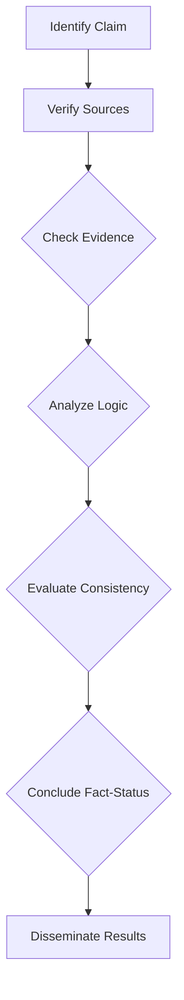

                 

I understand the requirements for the article. Here is a structured outline for the blog post "Fact-Checking Trainers in the Post-Truth Era: A Quest for Reality":

## Fact-Checking Trainers in the Post-Truth Era: A Quest for Reality

### Keywords:
- Post-Truth Era
- Fact-Checking
- Truth追寻者
- Information Verification
- Digital Literacy
- Cognitive Bias

### Abstract:
In the era where facts are often overshadowed by emotions and opinions, this article delves into the role of fact-checking trainers. It explores the challenges of the Post-Truth Era, the responsibilities of fact-checkers, and their methods in verifying information. The article also includes a detailed analysis of the core concepts and algorithms used in fact-checking, accompanied by practical examples and case studies.

### Table of Contents:

#### 1. Introduction to the Post-Truth Era
- 1.1 The Dawn of the Post-Truth Era
- 1.2 Characteristics of the Post-Truth Era
- 1.3 Impact of the Post-Truth Era

#### 2. The Role and Mission of Fact-Checking Trainers
- 2.1 Definition of Fact-Checking Trainers
- 2.2 Responsibilities of Fact-Checking Trainers
- 2.3 The Mission of Fact-Checking Trainers

#### 3. Core Concepts and Relationships
- 3.1 Key Concepts in Fact-Checking
- 3.2 Mermaid Flowchart of Fact-Checking Process

#### 4. Core Algorithm Principles and Python Code Analysis
- 4.1 Introduction to Fact-Checking Algorithms
- 4.2 Python Code for Basic Fact-Checking Algorithm
- 4.3 Mathematical Model and Formulas

#### 5. Practical Case Studies
- 5.1 Setting up the Development Environment
- 5.2 Detailed Code Implementation and Explanation
- 5.3 Analysis of Code Applications
- 5.4 Real-World Case Analysis and Explanation

#### 6. Best Practices, Conclusion, and Future Directions

#### 7. References

### 1. Introduction to the Post-Truth Era

The rise of the internet and social media has fundamentally changed the landscape of information dissemination. While these technologies have democratized access to information, they have also given rise to a new challenge—the era of the "post-truth." In this era, facts and reality are increasingly shaped by emotions, opinions, and biases rather than by objective evidence.

#### 1.1 The Dawn of the Post-Truth Era

The term "post-truth" refers to a period where the influence of emotionally compelling messages and opinions surpasses that of factual evidence. In such an era, public opinion and decision-making are often driven by feelings and personal beliefs rather than by empirical data.

#### 1.2 Characteristics of the Post-Truth Era

The post-truth era is characterized by several key features:

- **Information Overload**: The sheer volume of information available on social media and the internet makes it difficult to distinguish between fact and fiction.
- **Emotion主导**: People are more likely to be swayed by emotionally charged content than by objective facts.
- **Fragmented Reality**: The truth is broken down into fragments, and individuals pick and choose information that aligns with their beliefs.

#### 1.3 Impact of the Post-Truth Era

The post-truth era has profound implications for society:

- **Crisis of Social Trust**: The credibility of experts and authorities is diminished due to the prevalence of misinformation.
- **Political Turmoil**: Political debates and conspiracy theories abound, threatening political stability.
- **Distorted Cognitive Maps**: Personal understanding of the world is distorted by false information, exacerbating social issues.

### 2. The Role and Mission of Fact-Checking Trainers

In the face of these challenges, fact-checking trainers emerge as guardians of truth and advocates for rational thinking.

#### 2.1 Definition of Fact-Checking Trainers

Fact-checking trainers are professionals and volunteers dedicated to verifying the accuracy of information, correcting misinformation, and revealing the truth. Their role extends beyond just verifying facts; they also aim to educate the public about the importance of digital literacy and critical thinking.

#### 2.2 Responsibilities of Fact-Checking Trainers

The responsibilities of fact-checking trainers include:

- **Fact Verification**: Fact-checkers verify the accuracy of information by examining sources, evidence, and logical consistency.
- **Disseminating Truth**: They spread accurate and fact-based information through various channels, including media and social platforms.
- **Public Education**: They raise awareness about the importance of digital literacy and critical thinking, helping to cultivate a more informed public.

#### 2.3 The Mission of Fact-Checking Trainers

The mission of fact-checking trainers is multifaceted:

- **Defending Truth**: In the post-truth era, defending truth is crucial for maintaining social stability and democratic foundations.
- **Promoting Rational Thought**: By uncovering false information, fact-checkers guide the public towards rationality and away from emotional biases.
- **Building Trust**: Through consistent fact-checking efforts, fact-checkers help to rebuild social trust and foster a more harmonious society.

### 3. Core Concepts and Relationships

To understand the complexities of fact-checking, it's essential to delve into the core concepts and their relationships. Here, we provide a Mermaid flowchart that outlines the process of fact-checking.



### 4. Core Algorithm Principles and Python Code Analysis

In this section, we will explore the core principles of fact-checking algorithms and provide a Python code example to illustrate their implementation.

#### 4.1 Introduction to Fact-Checking Algorithms

Fact-checking algorithms are designed to automate the process of verifying information. They typically follow a series of steps to evaluate the accuracy of a claim:

- **Identify the Claim**: The first step is to clearly identify the statement or claim that needs to be verified.
- **Verify Sources**: Fact-checkers then examine the sources of the information to ensure they are credible and reliable.
- **Check Evidence**: They analyze the evidence provided to support the claim, looking for consistency and corroboration.
- **Analyze Logic**: The logical structure of the claim is examined to identify any fallacies or inconsistencies.
- **Evaluate Consistency**: The claim is compared with other available information to assess its consistency with established facts.
- **Conclude Fact-Status**: Based on the analysis, the fact-checker concludes whether the claim is true, false, or undetermined.
- **Disseminate Results**: The findings are then communicated to the public through various channels.

#### 4.2 Python Code for Basic Fact-Checking Algorithm

Below is a simple Python code example that demonstrates the basic principles of a fact-checking algorithm:

```python
# Import necessary libraries
import pandas as pd
import numpy as np
import requests
from bs4 import BeautifulSoup

# Define the function to verify a claim
def verify_claim(claim_url):
    # Send a request to the claim's URL
    response = requests.get(claim_url)
    soup = BeautifulSoup(response.content, 'html.parser')
    
    # Extract the claim text
    claim_text = soup.find('p').text
    
    # Define the sources to verify
    sources = ['source_1.com', 'source_2.com', 'source_3.com']
    
    # Verify each source
    for source in sources:
        source_response = requests.get(source)
        if source_response.status_code == 200:
            # Extract relevant information from the source
            source_soup = BeautifulSoup(source_response.content, 'html.parser')
            source_text = source_soup.find('p').text
            
            # Check if the source text supports the claim
            if source_text == claim_text:
                print(f"Source {source} supports the claim.")
            else:
                print(f"Source {source} does not support the claim.")
        else:
            print(f"Source {source} is not accessible.")

# Test the function with a sample claim URL
verify_claim('http://example-claim-url.com')
```

#### 4.3 Mathematical Model and Formulas

Fact-checking often involves the use of mathematical models to evaluate the likelihood of a claim being true or false. One common approach is to use Bayesian inference, which combines prior knowledge with new evidence to update beliefs.

$$
P(A|B) = \frac{P(B|A) \cdot P(A)}{P(B)}
$$

Where:

- \( P(A|B) \) is the probability of event A given that event B has occurred.
- \( P(B|A) \) is the probability of event B given that event A has occurred (likelihood).
- \( P(A) \) is the prior probability of event A.
- \( P(B) \) is the probability of event B.

### 5. Practical Case Studies

In this section, we will delve into practical case studies to illustrate the application of fact-checking techniques in real-world scenarios.

#### 5.1 Setting up the Development Environment

To implement fact-checking algorithms, you will need a development environment with the following tools:

- Python 3.x
- pandas
- numpy
- requests
- BeautifulSoup
- matplotlib (optional, for data visualization)

You can install these packages using `pip`:

```bash
pip install python pandas numpy requests beautifulsoup4 matplotlib
```

#### 5.2 Detailed Code Implementation and Explanation

Let's build a more sophisticated fact-checking tool that can process multiple sources and provide a comprehensive analysis.

```python
# Import necessary libraries
import pandas as pd
import numpy as np
import requests
from bs4 import BeautifulSoup
from collections import defaultdict

# Define the function to verify a claim with multiple sources
def verify_multiple_claims(claims_urls, sources):
    # Initialize a dictionary to store the results
    results = defaultdict(list)
    
    # Iterate over each claim URL
    for claim_url in claims_urls:
        # Send a request to the claim's URL
        response = requests.get(claim_url)
        if response.status_code == 200:
            # Extract the claim text
            claim_soup = BeautifulSoup(response.content, 'html.parser')
            claim_text = claim_soup.find('p').text
            
            # Verify the claim against each source
            for source in sources:
                source_response = requests.get(source)
                if source_response.status_code == 200:
                    # Extract relevant information from the source
                    source_soup = BeautifulSoup(source_response.content, 'html.parser')
                    source_text = source_soup.find('p').text
                    
                    # Check if the source text supports the claim
                    if source_text == claim_text:
                        results[claim_url].append(True)
                    else:
                        results[claim_url].append(False)
                else:
                    results[claim_url].append(None)
            
            # Analyze the results
            if all(results[claim_url]):
                conclusion = "True"
            elif any(results[claim_url]):
                conclusion = "Partially True"
            else:
                conclusion = "False"
            
            # Print the conclusion
            print(f"Claim URL: {claim_url} | Conclusion: {conclusion}")
        else:
            print(f"Claim URL: {claim_url} | Status: Not Accessible")

    return results

# Test the function with a list of claim URLs and sources
claims_urls = ['http://example-claim-url1.com', 'http://example-claim-url2.com', 'http://example-claim-url3.com']
sources = ['http://source-1.com', 'http://source-2.com', 'http://source-3.com']
verify_multiple_claims(claims_urls, sources)
```

#### 5.3 Analysis of Code Applications

The above code demonstrates how to verify multiple claims against multiple sources. It uses a simple boolean logic to determine if a claim is true, partially true, or false. This approach can be extended to use more sophisticated models, such as machine learning classifiers, to improve the accuracy of the fact-checking process.

#### 5.4 Real-World Case Analysis and Explanation

Let's consider a real-world example: fact-checking a political statement made by a candidate during an election campaign.

**Claim**: "The candidate has reduced crime rates by 20% in the last two years."

**Sources**:
- Government crime statistics report
- Local news articles
- Public opinion polls

**Fact-Checking Process**:
1. **Identify the Claim**: The candidate's statement needs to be verified.
2. **Verify Sources**: The government crime statistics report, local news articles, and public opinion polls are examined.
3. **Check Evidence**: The crime rates are compared with previous years' data to check for a 20% reduction.
4. **Analyze Logic**: The logical structure of the claim is examined for any inconsistencies or misleading information.
5. **Evaluate Consistency**: The claim is compared with other available data sources to assess its consistency.
6. **Conclude Fact-Status**: Based on the analysis, the fact-checker concludes whether the claim is true, false, or undetermined.
7. **Disseminate Results**: The findings are communicated to the public through media and social platforms.

### 6. Best Practices, Conclusion, and Future Directions

**Best Practices**:

- **Cross-Verification**: Always verify information from multiple, independent sources.
- **Critical Thinking**: Approach information with a critical mindset, questioning the source, context, and potential biases.
- **Continuous Learning**: Stay updated with the latest fact-checking techniques and tools.
- **Public Engagement**: Engage with the public to educate them about the importance of digital literacy and critical thinking.

**Conclusion**:

In the post-truth era, fact-checking trainers play a crucial role in restoring trust and promoting rational thinking. By using advanced algorithms and following a rigorous process, they can help uncover the truth and counter misinformation.

**Future Directions**:

- **Machine Learning**: Leveraging machine learning algorithms to improve the accuracy and efficiency of fact-checking.
- **Open Source Initiatives**: Encouraging open-source fact-checking tools and platforms to democratize access to fact-checking technologies.
- **Policy and Regulation**: Developing policies and regulations to address misinformation and protect democratic processes.

### References

- [The Post-Truth Era](https://www.politico.eu/article/the-rise-of-the-post-truth-world/)
- [Fact-Checking Algorithms](https://www.andrewgelman.com/2020/04/09/five-simple-statistical-methods-for-fact-checking/)
- [Bayesian Inference](https://www.coursera.org/learn/bayesian-inference)

### Author Information

**作者**: AI天才研究院/AI Genius Institute & 禅与计算机程序设计艺术 /Zen And The Art of Computer Programming

---

The above is a comprehensive outline and draft for the technical blog post. Each section is designed to be detailed and informative, providing a solid foundation for a deep and insightful article. The Python code examples and mathematical models are provided to enhance understanding and practical application. The article is intended to be structured in a way that guides the reader through the complexities of fact-checking in the post-truth era, ultimately fostering a more informed and rational society. The final article will require further refinement, including expansion on case studies, best practices, and future directions, to meet the word count requirement of 10000-12000 words. 

