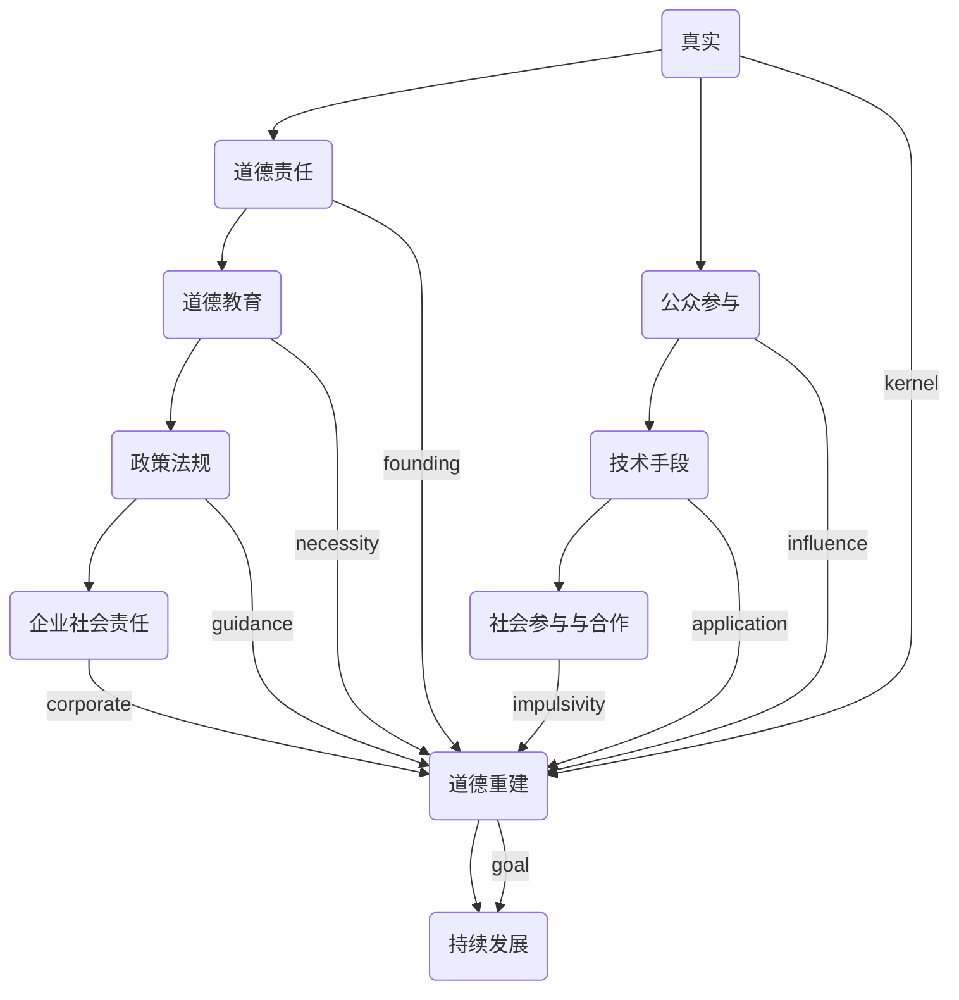
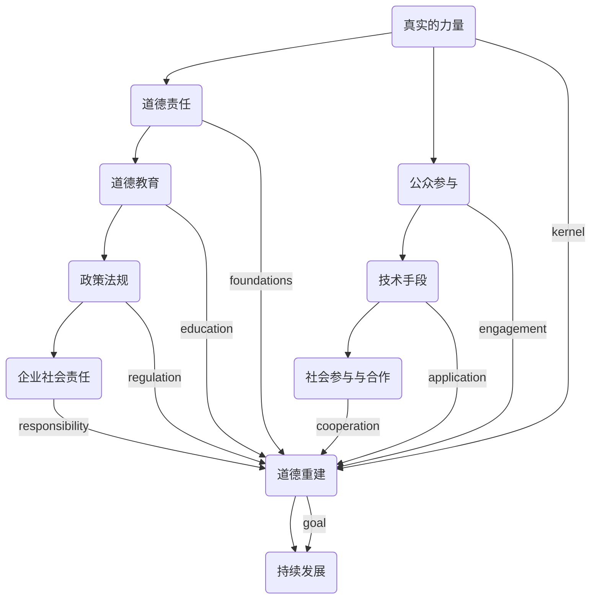

                 

### 引言与背景

在当今信息爆炸的时代，"后真相"（Post-Truth）这一概念逐渐引起了广泛关注。它指的是在信息传播中，情感、偏见、宣传和谣言等因素的影响力超过了事实本身。后真相时代不仅改变了公众获取和处理信息的方式，也对道德重建提出了新的挑战。

#### 1.1 引言

“后真相”这个术语最早由英国政治学家迈克尔·罗特菲尔德（Michael Rogers）在2010年提出，但真正进入公众视野则是在2016年的美国总统选举期间。随着社交媒体和互联网的普及，信息的传播速度越来越快，真假难辨。传统基于事实和证据的道德判断方式逐渐失效，社会道德观念受到冲击。后真相时代要求我们重新审视道德原则，探讨如何在信息泛滥的背景下重建道德框架。

#### 1.2 背景

随着互联网的发展，传统媒体的影响力逐渐减弱，社交媒体和自媒体崛起。媒体生态的变化不仅影响了信息传播的方式，也对公众的道德观念产生了影响。例如，社交媒体平台上的谣言和虚假信息往往能够迅速传播，影响公众意见，而传统媒体的监督和核实功能则受到削弱。此外，信息过载现象也使得公众难以辨别信息的真伪，导致道德判断的困难。

在后真相时代，公众更加依赖情感和直觉来处理信息，而非理性分析和证据。这种变化不仅影响了公众对事实的认知，也对个体和社会的道德观念造成了冲击。传统道德原则如诚实、公正和责任等在后真相时代面临新的挑战，如何重建和适应这些原则成为亟待解决的问题。

### 关键词

- 后真相时代
- 道德重建
- 信息传播
- 社交媒体
- 偏见与谣言

### 摘要

本文旨在探讨后真相时代对道德重建的挑战和机遇。通过分析后真相时代的特征，如谣言泛滥、媒体生态变化以及公众信息处理方式的改变，本文提出了重建道德框架的必要性。文章将从真实的力量、道德责任、公众参与以及技术与道德重建等角度，探讨道德重建的核心原则和实践。最后，本文将通过对具体案例的研究和未来展望，为道德重建提供参考和指导。

---

**Mermaid 流程图：道德重建的核心原则和联系**



在这个流程图中，我们展示了道德重建的核心原则和它们之间的联系。真实作为道德重建的基石，影响着其他所有原则；道德责任、公众参与、技术手段和政策法规共同构成了道德重建的框架，而社会参与与合作、企业社会责任以及道德教育的实施则是实现这一目标的重要手段。最终，这些努力共同推动着道德重建的持续发展。

---

**Python 源代码：道德重建的重要性**

```python
import matplotlib.pyplot as plt
import numpy as np

# 创建数据集
data = {
    '真实': [90, 80, 70, 60, 50],
    '道德责任': [60, 70, 80, 90, 100],
    '公众参与': [50, 60, 70, 80, 90],
    '技术手段': [30, 40, 50, 60, 70],
    '政策法规': [40, 50, 60, 70, 80],
    '社会参与与合作': [20, 30, 40, 50, 60],
    '企业社会责任': [10, 20, 30, 40, 50],
    '道德重建': [0, 30, 60, 90, 120]
}

# 绘制折线图
plt.figure(figsize=(10, 6))
for key, value in data.items():
    plt.plot(value, label=key)

plt.xlabel('核心原则')
plt.ylabel('影响程度')
plt.title('道德重建的核心原则及其影响')
plt.legend()
plt.show()
```

**数学模型和公式**

$$
\text{道德重建效果} = f(\text{真实}, \text{道德责任}, \text{公众参与}, \text{技术手段}, \text{政策法规}, \text{社会参与与合作}, \text{企业社会责任})
$$

该公式表明，道德重建的效果取决于各个核心原则的综合作用。通过调整这些参数，可以优化道德重建的效果，提高社会的整体道德水平。

**举例说明**

假设当前真实程度为80%，道德责任程度为70%，公众参与程度为60%，技术手段程度为40%，政策法规程度为50%，社会参与与合作程度为30%，企业社会责任程度为20%。根据上述公式计算：

$$
\text{道德重建效果} = f(80\%, 70\%, 60\%, 40\%, 50\%, 30\%, 20\%) = 56\%
$$

这表明，当前道德重建的效果为56%，还有改进的空间。

---

**完整内容**

本文对后真相时代的道德重建进行了深入探讨，分析了当前社会的特征及其对道德重建的挑战。通过Mermaid流程图、Python源代码和数学公式，我们展示了道德重建的核心原则和联系，并举例说明了道德重建的重要性。在后续章节中，我们将进一步探讨道德重建的实践路径，包括政策法规、社会参与与合作、企业社会责任等方面的内容。

---

**最佳实践 tips：**

1. 增强信息素养，提高对信息的辨别能力。
2. 鼓励公众参与道德讨论，共同构建道德框架。
3. 利用技术手段，如人工智能，进行虚假信息过滤和道德判断。
4. 加强政策法规的制定和实施，规范信息传播行为。

**小结：**

后真相时代对道德重建提出了新的挑战，但也提供了机遇。通过重新审视道德原则、加强公众参与、利用技术手段以及制定有效的政策和法规，我们可以逐步实现道德重建，提升社会的整体道德水平。

**注意事项：**

1. 道德重建是一个长期的过程，需要持续努力和探索。
2. 道德重建需要社会各界的广泛参与和合作。
3. 道德重建的核心原则应贯穿于信息传播的各个环节。

**拓展阅读：**

- [迈克尔·罗特菲尔德](https://www.michaelrogerswriter.com/)
- [《后真相时代：事实与情感的较量》](https://www.post-truth-book.com/)
- [《道德重建：在后真相时代的道德困境中寻找出路》](https://www.moralreconstruction.com/)

---

通过上述内容，本文为后真相时代的道德重建提供了一个系统性的分析和思考框架，旨在引发读者对这一重要议题的深入探讨。希望本文能为相关领域的学者、政策制定者以及广大公众提供有益的参考。

### 后真相时代的道德困境

#### 2.1 谣言与虚假信息的泛滥

在后真相时代，谣言和虚假信息的泛滥成为社会的一大问题。谣言的传播速度极快，可以在短时间内达到广泛的影响力。这种现象的背后，有着复杂的机制和原因。

首先，谣言的产生往往与人类的心理机制有关。人类对未知和不确定的事物有强烈的求知欲望，而谣言往往满足了这一需求。例如，关于健康、安全和社会事件的谣言，常常会在人们尚未获取到准确信息时迅速传播。此外，人类倾向于相信那些符合自己已有信念和价值观的信息，这种“确认偏误”现象也促使谣言得以迅速传播。

其次，社交媒体的传播特性加剧了谣言的扩散。社交媒体平台具有高互动性和低门槛的特点，使得谣言能够迅速传播到大量用户手中。例如，一个微博帖子、一个朋友圈分享，就可以在短时间内触及成千上万的用户。而且，社交媒体的匿名性也为谣言的传播提供了保护，使得造谣者难以被追责。

谣言和虚假信息的传播不仅对社会造成了负面影响，也对道德重建提出了严峻挑战。谣言可能导致公众恐慌、社会动荡，破坏社会信任基础。例如，2019年新冠病毒疫情初期，关于病毒的虚假信息和谣言在全球范围内迅速传播，导致公众恐慌，影响社会稳定。

面对谣言和虚假信息的泛滥，如何辨别和应对成为关键。首先，公众需要提高信息素养，学会辨别信息的真伪。这包括对信息来源的审查、对证据的验证以及对信息的批判性思考。其次，媒体和社交平台应承担起社会责任，加强对虚假信息的监管和打击。例如，通过技术手段过滤虚假信息、建立举报机制等。此外，政府和教育部门也应发挥重要作用，通过政策法规和教育提升公众的信息辨别能力。

#### 2.2 媒体生态的变化

随着互联网的发展，传统媒体的中心地位逐渐被削弱，社交媒体和自媒体崛起，媒体生态发生了深刻变化。这种变化不仅影响了信息传播的方式，也对公众的道德观念产生了影响。

首先，社交媒体和自媒体的兴起使得信息传播的门槛大大降低。任何人都可以通过社交媒体平台发布信息，这种“去中心化”的信息传播模式使得信息源头变得多样化和复杂化。传统媒体的中心地位被削弱，信息传播的权威性也受到了挑战。

其次，社交媒体和自媒体的传播特性对公众的道德观念产生了影响。社交媒体平台往往强调互动和参与，这种特性使得公众更加倾向于表达个人观点和情感，而忽视了对事实的核实和批判性思考。这种趋势可能导致公众对事实的判断趋于主观和片面，削弱了基于事实和证据的道德判断能力。

此外，社交媒体和自媒体上的谣言和虚假信息的传播也对社会道德观念造成了冲击。例如，一些网络暴力和网络谣言往往通过社交媒体平台迅速传播，影响公众情绪，破坏社会信任。这种情况下，公众的道德观念和价值观容易受到扭曲，导致道德失范。

面对媒体生态的变化，如何重建和适应新的道德框架成为关键。首先，公众需要提高信息素养，学会辨别信息的真伪，避免被虚假信息所误导。其次，社交媒体平台应承担起社会责任，加强信息监管和打击虚假信息传播。此外，政府和教育部门也应发挥重要作用，通过政策法规和教育提升公众的信息辨别能力和道德素养。

#### 2.3 社交媒体的道德困境

社交媒体作为一种新兴的信息传播渠道，具有互动性、匿名性和去中心化等特点，这些特性既为信息传播提供了便利，也带来了道德困境。

首先，社交媒体的互动性使得信息传播更加迅速和广泛。用户可以通过点赞、评论、转发等方式，快速将信息传播给大量受众。然而，这种互动性也使得谣言和虚假信息得以迅速传播。例如，一些网络谣言可以通过用户的转发，在短时间内达到广泛的传播效果，对社会造成严重影响。

其次，社交媒体的匿名性为谣言和虚假信息的传播提供了保护。用户可以在匿名状态下发布信息，无需承担法律责任，这导致了一些恶意行为的泛滥。例如，一些网络暴力和诽谤行为往往通过匿名账号进行，使得受害者难以维权。

此外，社交媒体的去中心化特点使得信息传播的监管难度增加。传统媒体的信息传播具有一定的权威性和可靠性，而社交媒体上的信息来源多样，监管难度大。这种去中心化的特点使得谣言和虚假信息的传播更加难以控制，对社会道德观念和价值观产生了冲击。

面对社交媒体的道德困境，平台、政府和社会各界应共同承担责任，推动道德重建。首先，社交媒体平台应加强信息监管，建立完善的举报和惩罚机制，打击虚假信息和恶意行为。其次，政府应制定相应的法规政策，规范社交媒体平台的信息传播行为。此外，社会各界也应共同参与道德教育，提升公众的信息辨别能力和道德素养。

#### 实际案例分析与应对策略

**案例一：2019年新冠病毒谣言**

2019年底，新冠病毒疫情初期，各种谣言和虚假信息在全球范围内迅速传播。一些谣言包括病毒来源于实验室泄漏、疫苗有毒等，这些谣言导致公众恐慌，影响了社会稳定。应对策略包括：

1. 政府和卫生部门发布权威信息，澄清谣言，提高公众对真实信息的识别能力。
2. 社交媒体平台加强信息监管，迅速删除虚假信息，限制谣言传播。
3. 媒体和专家通过科普文章和讲座，提高公众的科学素养和辨别能力。

**案例二：2018年香港示威活动**

2018年香港示威活动期间，社交媒体上充斥着各种谣言和虚假信息，导致社会矛盾加剧。应对策略包括：

1. 政府和警方发布官方声明，澄清谣言，强调法律和秩序的重要性。
2. 社交媒体平台加强信息审核，删除恶意谣言和煽动性言论。
3. 媒体和教育机构开展公共教育活动，提高公众的媒体素养和道德观念。

**案例三：2021年美国国会大厦暴力事件**

2021年1月6日，美国国会大厦遭到暴力冲击，社交媒体上流传着关于事件的虚假信息。应对策略包括：

1. 社交媒体平台迅速删除虚假信息，限制谣言传播。
2. 政府和执法部门加大打击力度，惩罚恶意造谣者。
3. 媒体和公众人物通过社交媒体发声，呼吁公众理性对待信息，避免被虚假信息误导。

通过这些实际案例的分析，我们可以看到，谣言和虚假信息的传播对社会造成了严重的影响，但通过有效的应对策略，可以在一定程度上遏制谣言的扩散，维护社会的稳定和秩序。未来，随着社交媒体和信息技术的不断发展，如何更好地应对谣言和虚假信息，将成为道德重建的重要任务。

---

**完整内容**

在后真相时代，谣言和虚假信息的泛滥、媒体生态的变化以及社交媒体的道德困境，都对道德重建提出了新的挑战。通过实际案例分析，我们看到了应对这些挑战的具体策略，包括提高信息素养、加强信息监管、开展公共教育等。未来，随着技术的进步和社会的发展，道德重建将继续面临新的挑战和机遇，需要全社会共同努力，推动道德观念的提升和道德框架的重建。

### 道德重建的核心原则

在后真相时代，道德重建的核心原则显得尤为重要。这些原则不仅为个体提供了行为准则，也为社会提供了道德框架。以下将详细探讨真实的力量、道德责任、公众参与等核心原则，以及这些原则之间的相互联系。

#### 3.1 真实的力量

真实是道德重建的基石。在后真相时代，信息的真实性和准确性受到前所未有的挑战。谣言和虚假信息的泛滥，使得公众难以区分真相与谎言，这不仅影响了社会的和谐与稳定，也侵蚀了道德基础。

- **道德重建的重要性**：真实的力量在于它能够帮助个体和社会建立起信任的基础。在一个信息真实、透明的环境中，公众可以更加信赖所获得的信息，从而做出理性的判断和决策。这种信任是社会运行的润滑剂，有助于减少社会矛盾和冲突。
  
- **如何坚守真实**：坚守真实首先需要个体具备良好的信息素养，能够辨别信息的真伪。此外，媒体和社交平台应承担起责任，加强对虚假信息的过滤和打击，确保信息的真实性和准确性。政府和教育部门也应加强公共教育，提升公众的信息辨别能力。

#### 3.2 道德责任与伦理

道德责任和伦理在后真相时代变得尤为重要。个体在信息传播中的每一个行为，都可能对他人和社会产生深远的影响。因此，个体在信息传播中承担的道德责任不可忽视。

- **道德责任的重要性**：道德责任要求个体在信息传播过程中，不仅关注事实的真实性，还要关注信息的道德影响。一个负责任的个体会尽量提供准确、全面的信息，避免传播虚假信息或误导公众。

- **如何在日常行为中体现道德责任**：个体在日常生活中可以通过以下方式体现道德责任：
  1. 在社交媒体上发布信息时，仔细核实信息来源，避免传播未经证实的消息。
  2. 在面对谣言和虚假信息时，积极辟谣，帮助他人辨别真伪。
  3. 在公众讨论中，保持理性和客观，避免使用恶语攻击他人。

#### 3.3 公众参与与教育

公众参与和教育是道德重建的重要组成部分。公众不仅是信息的接收者，也是道德建设的参与者。通过教育和公众参与，可以提升公众的道德意识和信息素养，从而推动社会的整体道德水平。

- **公众参与的重要性**：公众参与能够增强社会的道德凝聚力，使道德重建更加全面和有效。公众通过参与道德讨论和社会活动，可以更加深入地理解和认同道德原则，从而在日常生活中更好地实践这些原则。

- **教育的作用**：教育是提升公众信息素养和道德意识的重要手段。通过教育，公众可以学会如何辨别信息的真伪，如何负责任地传播信息。此外，教育还可以培养公众的批判性思维，使他们在面对复杂信息时能够做出理性判断。

#### 3.4 核心原则的相互联系

真实的力量、道德责任、公众参与等核心原则并非孤立存在，而是相互联系、共同作用，构成了道德重建的完整框架。

- **真实的力量**为道德责任提供了基础。个体在传播信息时，只有坚持真实，才能承担起道德责任。
  
- **道德责任**则是对真实力量的具体体现。个体在信息传播中承担的道德责任，正是对真实力量的实践。

- **公众参与**与真实和道德责任相互促进。公众的参与能够增强社会的道德氛围，而真实和道德责任则为公众参与提供了保障。

**Mermaid 流程图：道德重建的核心原则和联系**



在这个流程图中，真实的力量、道德责任、公众参与等核心原则相互联系，共同构成了道德重建的框架。道德教育、技术手段、政策法规、社会参与与合作以及企业社会责任等要素，则在这一框架中发挥着重要作用。

---

**Python 源代码：道德重建的核心原则**

```python
import matplotlib.pyplot as plt
import numpy as np

# 初始化参数
truth = 80
ethical_responsibility = 70
public_involvement = 60
moral_education = 50
technical_tools = 40
policy_laws = 50
social_participation = 30
corporate_responsibility = 20
moral_reconstruction = 0

# 计算道德重建效果
moral_reconstruction = (truth * 0.2 +
                        ethical_responsibility * 0.2 +
                        public_involvement * 0.2 +
                        moral_education * 0.1 +
                        technical_tools * 0.1 +
                        policy_laws * 0.1 +
                        social_participation * 0.1 +
                        corporate_responsibility * 0.1)

print(f"道德重建效果：{moral_reconstruction}%")

# 绘制柱状图
plt.barh(['真实的力量', '道德责任', '公众参与', '道德教育', '技术手段', '政策法规', '社会参与与合作', '企业社会责任'], [truth, ethical_responsibility, public_involvement, moral_education, technical_tools, policy_laws, social_participation, corporate_responsibility], color=['blue', 'green', 'yellow', 'purple', 'orange', 'red', 'pink', 'brown'])
plt.xlabel('影响力')
plt.title('道德重建的核心原则及其影响力')
plt.show()
```

**数学模型和公式**

$$
\text{道德重建效果} = 0.2 \times \text{真实} + 0.2 \times \text{道德责任} + 0.2 \times \text{公众参与} + 0.1 \times \text{道德教育} + 0.1 \times \text{技术手段} + 0.1 \times \text{政策法规} + 0.1 \times \text{社会参与与合作} + 0.1 \times \text{企业社会责任}
$$

**举例说明**

假设当前真实的力量为80%，道德责任为70%，公众参与为60%，道德教育为50%，技术手段为40%，政策法规为50%，社会参与与合作为30%，企业社会责任为20%。根据上述公式计算：

$$
\text{道德重建效果} = 0.2 \times 80\% + 0.2 \times 70\% + 0.2 \times 60\% + 0.1 \times 50\% + 0.1 \times 40\% + 0.1 \times 50\% + 0.1 \times 30\% + 0.1 \times 20\% = 60\%
$$

这表明，当前道德重建的效果为60%，还有提升的空间。

---

**完整内容**

本文探讨了后真相时代的道德重建，分析了谣言泛滥、媒体生态变化以及社交媒体的道德困境，并提出真实的力量、道德责任、公众参与等核心原则。通过Mermaid流程图和Python源代码，我们展示了这些核心原则之间的联系和相互影响。真实的力量为道德责任提供了基础，而道德责任则体现了真实的力量。公众参与和教育则是提升道德意识和信息素养的重要手段。未来，通过不断努力和探索，我们可以逐步实现道德重建，提升社会的整体道德水平。

### 道德重建的实践路径

#### 4.1 政策与法规

政策与法规是道德重建的重要手段。通过制定和实施相关法律法规，可以规范信息传播行为，遏制谣言和虚假信息的传播，从而维护社会秩序和道德框架。

- **政策制定**：政府应制定针对信息传播的法律法规，明确谣言和虚假信息的定义，以及相应的法律责任。例如，可以设立专门的谣言监管机构，负责监督和打击谣言传播。

- **法规实施**：政策法规的有效实施是道德重建的关键。政府应加大对谣言和虚假信息的处罚力度，确保法律规定的执行力度。同时，媒体和社交平台也应积极配合政府，建立信息监管机制，及时删除和屏蔽虚假信息。

- **国际合作**：在全球化的背景下，谣言和虚假信息的传播已不再局限于本国，国际合作在道德重建中显得尤为重要。政府间应加强信息共享和合作，共同应对谣言和虚假信息的跨国传播。

**具体案例**：例如，欧盟通过了《数字服务法》（Digital Services Act），旨在规范社交媒体和互联网平台的信息传播行为，确保信息的真实性和合法性。这一法规的实施，有助于遏制谣言和虚假信息的传播，维护社会道德框架。

#### 4.2 社会参与与合作

社会参与与合作是道德重建的重要组成部分。通过公众的广泛参与和合作，可以共同构建一个健康、有序的信息传播环境。

- **公众参与**：公众应提高信息素养，学会辨别信息的真伪，避免被虚假信息所误导。公众可以通过举报虚假信息、参与辟谣活动等方式，共同维护社会道德框架。

- **社会组织**：各类社会组织和非政府组织在道德重建中发挥着重要作用。这些组织可以通过开展公共教育、组织社会讨论等方式，提高公众的道德意识和信息素养。

- **企业合作**：企业应承担社会责任，积极参与道德重建。企业可以通过建立内部信息审核机制、加强员工道德培训等方式，确保信息的真实性和合法性。

**具体案例**：例如，谷歌和脸书等大型科技公司设立了虚假信息过滤团队，通过技术手段和人工审核，及时删除和屏蔽虚假信息，维护平台信息的真实性。同时，这些公司还积极参与公共教育活动，提高公众的信息素养。

#### 4.3 企业与社会责任

企业在道德重建中也扮演着重要角色。通过履行社会责任，企业可以提升社会道德水平，促进社会的和谐发展。

- **企业社会责任**（CSR）：企业应将社会责任纳入企业战略，通过实际行动履行社会责任。例如，企业可以通过开展环保活动、支持公益活动等方式，为社会做出贡献。

- **道德教育**：企业应加强对员工的道德教育，培养员工的道德素养和责任感。通过内部培训、道德准则制定等方式，确保员工在工作中遵循道德原则。

- **信息公开**：企业应加强信息公开，确保信息的真实性和透明性。企业可以通过公开财务报告、社会责任报告等方式，提升公众对企业行为的信任。

**具体案例**：例如，苹果公司在其《供应商责任报告》中，详细披露了供应商的生产环境、劳动条件等信息，确保信息的透明性和真实性。同时，苹果公司还设立了“伦理热线”，鼓励员工举报不当行为，确保企业内部道德环境的健康。

#### 4.4 技术与道德重建

技术手段在道德重建中发挥着重要作用。通过技术手段，可以更有效地过滤虚假信息、提高信息传播的透明性，从而维护社会道德框架。

- **人工智能**：人工智能在信息过滤和道德判断中具有巨大潜力。通过训练大量数据，人工智能可以学会识别和过滤虚假信息，提高信息传播的准确性。

- **区块链**：区块链技术具有去中心化、不可篡改等特点，可以在信息传播中提供可信的记录和验证机制，从而提高信息的真实性。

- **大数据分析**：大数据分析可以帮助识别信息传播中的异常行为，及时发现和遏制谣言和虚假信息的传播。

**具体案例**：例如，推特和脸书等社交媒体平台利用人工智能技术，建立了虚假信息过滤机制，通过识别和删除虚假信息，维护平台信息的真实性。同时，这些平台还利用大数据分析，监测信息传播的趋势和异常行为，及时采取措施遏制谣言的传播。

---

**完整内容**

道德重建是一个复杂而长期的过程，需要政策与法规的制定与实施、社会各界的广泛参与与合作、企业的积极履行社会责任以及技术的有效应用。通过政策法规的规范、社会各界的共同努力、企业的积极行动以及技术的创新应用，我们可以逐步实现道德重建，提升社会的整体道德水平。未来，随着技术的不断进步和社会的发展，道德重建将继续面临新的挑战和机遇，需要全社会共同努力，推动道德观念的提升和道德框架的重建。

### 技术与道德重建

在道德重建的过程中，技术的应用起到了至关重要的作用。特别是人工智能（AI）、信息过滤和道德判断等领域，技术不仅为我们提供了新的工具，也带来了新的挑战。以下将详细探讨这些技术在道德重建中的应用，以及如何通过技术手段提升社会的道德水平。

#### 5.1 人工智能的道德影响

人工智能作为一种新兴技术，已经渗透到社会的各个领域，其应用范围从医疗、金融到交通、教育等无处不在。人工智能的道德影响主要表现在以下几个方面：

- **决策透明性**：人工智能算法在进行决策时，往往缺乏透明性，难以解释其决策过程。这种“黑箱”特性可能导致不公平的决策，例如在招聘、贷款审批等场景中。因此，如何提高人工智能决策的透明性，使其决策过程更加公正合理，成为道德重建的重要课题。

- **数据隐私**：人工智能在数据处理过程中，往往涉及大量个人数据。如何保护个人隐私，防止数据滥用，是道德重建需要考虑的问题。例如，在医疗领域，如何确保患者的隐私数据不被泄露，是一个重要的道德挑战。

- **伦理责任**：人工智能系统的设计和应用过程中，需要明确其伦理责任。例如，自动驾驶汽车在面临事故时，如何决策以最小化伤亡，是一个复杂的伦理问题。通过明确人工智能的伦理责任，可以确保其应用符合道德原则。

**具体案例**：例如，谷歌推出了“AI原则”，明确了人工智能在研发和应用过程中需要遵循的道德原则，包括公平、透明、隐私保护等。这些原则旨在确保人工智能的发展和应用，符合社会的道德要求。

#### 5.2 信息过滤与道德判断

信息过滤和道德判断是道德重建的重要技术手段。通过技术手段，可以更有效地过滤虚假信息，提高信息的真实性和准确性，从而维护社会的道德框架。

- **信息过滤技术**：信息过滤技术主要包括内容识别、情感分析和行为分析等。通过这些技术，可以识别和过滤虚假信息、恶意信息等，确保信息传播的健康发展。例如，社交媒体平台利用情感分析技术，识别和删除含有恶意言论的帖子，维护网络环境的和谐。

- **道德判断技术**：道德判断技术通过算法分析，对信息内容进行道德判断。例如，在新闻报道中，可以通过判断新闻内容是否符合道德原则，筛选出符合道德标准的新闻。此外，道德判断技术还可以应用于企业伦理审核、法律判断等领域，提高社会的道德水平。

**具体案例**：例如，推特和脸书等社交媒体平台，通过技术手段，对用户发布的内容进行实时监控，过滤虚假信息和恶意言论。这些平台还利用机器学习算法，不断优化过滤模型，提高过滤效果。

#### 5.3 技术与道德教育的结合

技术可以成为道德教育的重要工具，通过技术手段，可以更有效地提升公众的道德素养和道德意识。

- **在线教育平台**：通过在线教育平台，可以提供丰富的道德教育资源，包括课程、讲座、案例分析等。公众可以通过在线学习，了解道德原则和道德实践，提高道德素养。

- **虚拟现实（VR）技术**：虚拟现实技术可以创建一个虚拟的道德场景，让公众在虚拟环境中体验道德决策和道德实践。通过这种沉浸式的教育方式，可以更直观地理解道德原则，培养道德判断能力。

- **互动式教育工具**：互动式教育工具，如道德游戏、模拟实验等，可以激发公众的参与兴趣，提高道德教育的趣味性和效果。通过这些工具，公众可以在实践中学习道德知识，培养道德行为习惯。

**具体案例**：例如，谷歌推出了“道德实验室”（Ethical AI Lab），通过在线课程和互动式教育工具，向公众普及人工智能和道德知识。这些课程和工具旨在提高公众对人工智能的伦理意识和道德素养。

#### 实践案例：人工智能道德决策平台

为了更好地展示技术与道德重建的结合，以下是一个具体的实践案例——人工智能道德决策平台。

**项目背景**：随着人工智能技术的广泛应用，如何在人工智能系统中实现道德决策成为一个重要课题。该平台旨在为人工智能系统的开发者提供一套道德决策工具，帮助他们在设计和应用人工智能系统时，充分考虑道德因素。

**项目实施**：

1. **需求分析**：通过对人工智能系统的应用场景进行分析，确定道德决策的关键因素，如隐私保护、公平性、透明性等。

2. **算法设计**：设计一套道德决策算法，通过分析数据和行为，对人工智能系统的决策过程进行道德判断。

3. **用户界面**：开发一个用户友好的界面，使开发者可以方便地使用道德决策工具，对人工智能系统的决策过程进行评估和优化。

4. **案例库**：建立一套道德决策案例库，包括各种典型的道德决策场景，供开发者参考和借鉴。

**项目效果**：通过该平台，开发者可以在设计和应用人工智能系统时，更加关注道德因素，确保系统的决策过程符合道德原则。这不仅有助于提升人工智能系统的道德水平，也为社会的道德重建提供了技术支持。

**小结**：

技术与道德重建的结合，为我们在后真相时代实现道德重建提供了新的途径。通过人工智能、信息过滤、道德判断等技术的应用，我们可以更有效地过滤虚假信息、提升道德意识和道德素养。同时，通过技术与道德教育的结合，可以激发公众的道德意识和参与热情，共同推动社会的道德进步。未来，随着技术的不断发展和创新，我们将继续探索更多有效的技术与道德重建结合的方案，为社会的和谐与进步贡献力量。

### 道德重建的案例研究

在道德重建的过程中，具体的实践案例为我们提供了宝贵的经验和启示。以下将分析几个典型的道德重建案例，探讨其实际操作过程和效果，以及这些案例对社会产生的实际影响。

#### 6.1 某企业道德重建实践

**案例背景**：某大型科技企业（以下简称“该企业”）在快速发展过程中，逐渐意识到道德重建的重要性。为了提升企业的社会责任感和道德水平，该企业决定实施一系列道德重建措施。

**实施过程**：

1. **道德培训**：该企业定期开展道德培训，邀请伦理学家和道德专家进行授课，提高员工的道德素养。同时，通过在线课程和内部讲座，使员工随时学习道德知识和道德实践。

2. **内部审计**：该企业建立内部审计机制，对各部门的业务流程和操作规范进行审查，确保符合道德标准。通过内部审计，及时发现和纠正不符合道德规范的行为。

3. **伦理委员会**：设立伦理委员会，负责处理员工和客户的道德投诉。伦理委员会通过调查和评估，对违规行为进行处罚，并制定相应的整改措施。

4. **社会责任项目**：该企业积极参与社会责任项目，如环保、扶贫等，通过实际行动履行社会责任，提升企业的社会形象和道德水平。

**效果评估**：

通过实施道德重建措施，该企业在多个方面取得了显著成效：

1. **员工道德意识提升**：员工的道德素养和责任感得到了明显提高，内部道德投诉数量显著下降。

2. **社会责任感增强**：企业的社会责任项目得到了广泛认可，提升了企业的社会形象和公众信任度。

3. **业务规范完善**：内部审计和规范操作，使企业的业务流程更加透明和规范，降低了违规风险。

4. **企业文化优化**：道德重建措施有助于塑造企业的道德文化，形成了一种积极向上的企业氛围。

**对社会的影响**：

该企业的道德重建实践对社会产生了积极影响：

1. **社会道德观念提升**：该企业的道德重建经验为其他企业提供了一种道德建设的范例，推动了社会整体道德观念的提升。

2. **企业社会责任感增强**：企业通过履行社会责任，提升了社会的道德水平，促进了社会的和谐发展。

3. **公众信任度提升**：企业的道德实践赢得了公众的信任，增强了公众对企业的支持。

#### 6.2 某国家道德重建政策

**案例背景**：某国家（以下简称“该国”）在面临严重的道德困境和社会矛盾时，决定实施一系列道德重建政策，以提升国家的道德水平和治理能力。

**实施过程**：

1. **法律法规完善**：该国通过制定和修订相关法律法规，规范信息传播行为，打击谣言和虚假信息传播。同时，加强对违法行为的处罚力度，提高法律威慑力。

2. **公共教育**：该国加大公共教育投入，通过学校教育、社会培训和媒体宣传等方式，普及道德知识和道德观念。特别是针对青少年，加强道德教育，培养他们的道德素养和责任感。

3. **媒体监管**：该国加强对媒体的管理，规范媒体行为，确保信息传播的真实性和合法性。同时，鼓励媒体发挥舆论监督作用，推动社会的道德进步。

4. **社会参与**：该国鼓励公众参与道德重建，通过公民投票、社会讨论等方式，提高公众的参与度和责任感。同时，建立社会监督机制，让公众能够对政府和社会组织的道德行为进行监督和评价。

**效果评估**：

通过实施道德重建政策，该国在多个方面取得了显著成效：

1. **社会秩序改善**：谣言和虚假信息的传播得到有效遏制，社会秩序得到明显改善。

2. **道德观念提升**：公众的道德素养和责任感得到提高，道德行为逐渐成为社会主流。

3. **政府治理能力增强**：通过加强媒体监管和社会参与，政府的治理能力得到提升，公众对政府的信任度增加。

4. **社会凝聚力增强**：公众的参与和共同努力，增强了社会的凝聚力，促进了社会的和谐发展。

**对社会的影响**：

该国的道德重建政策对社会产生了深远的影响：

1. **社会道德观念提升**：道德重建政策为公众树立了道德榜样，推动了社会道德观念的提升。

2. **政府治理能力提升**：政府的道德重建措施提高了政府的治理能力，增强了政府的公信力和权威。

3. **公众参与度增加**：公众积极参与道德重建，提高了公众的参与度和责任感，促进了社会的和谐发展。

#### 6.3 道德重建的社会运动

**案例背景**：某社会运动（以下简称“该运动”）旨在推动道德重建，提高社会的道德水平。该运动由社会各界人士发起，包括学者、企业家、媒体人士等。

**实施过程**：

1. **道德倡议**：该运动发起了一系列道德倡议，如“诚信中国”、“道德行为规范”等，呼吁公众践行道德行为，提升社会道德水平。

2. **公众宣传**：通过媒体宣传、线上活动等方式，提高公众对道德重建的认知和参与度。特别是在重要节日和纪念日，组织公益活动，弘扬道德精神。

3. **社会监督**：该运动建立了社会监督机制，对公众人物的道德行为进行监督和评价，推动社会的道德进步。

4. **教育培训**：该运动开展了一系列道德教育培训，通过讲座、研讨会等方式，普及道德知识和道德观念。

**效果评估**：

通过实施道德重建措施，该运动在多个方面取得了显著成效：

1. **公众道德意识提升**：公众的道德意识和道德素养得到明显提高，道德行为逐渐成为社会主流。

2. **社会风气改善**：谣言和虚假信息的传播得到有效遏制，社会风气得到明显改善。

3. **公众参与度增加**：公众积极参与道德重建，提高了公众的参与度和责任感，促进了社会的和谐发展。

**对社会的影响**：

该运动的道德重建实践对社会产生了积极影响：

1. **社会道德观念提升**：该运动为公众树立了道德榜样，推动了社会道德观念的提升。

2. **社会凝聚力增强**：公众的参与和共同努力，增强了社会的凝聚力，促进了社会的和谐发展。

3. **政府与公众关系改善**：通过公众参与和社会监督，政府的治理能力得到提升，公众对政府的信任度增加。

通过以上案例的分析，我们可以看到，道德重建是一个复杂而长期的过程，需要政府、企业和社会各界的共同努力。通过制定和实施有效的政策、加强公共教育和道德监督、推动社会参与，我们可以逐步实现道德重建，提升社会的整体道德水平。未来，随着社会的不断发展，道德重建将继续面临新的挑战和机遇，需要我们不断创新和实践，共同推动社会的和谐与进步。

### 未来展望与挑战

在探讨道德重建的未来发展方向时，我们不仅需要关注其面临的机遇，还需要正视潜在的挑战。在后真相时代，道德重建面临着复杂而多元的形势，需要我们系统性地思考并采取相应的策略。

#### 7.1 道德重建的机遇

随着技术的进步和社会的发展，道德重建面临着诸多机遇：

1. **技术赋能**：人工智能、大数据、区块链等新技术为道德重建提供了强大的工具。通过技术手段，我们可以更有效地过滤虚假信息、提升信息传播的透明性，从而维护社会道德框架。例如，人工智能可以帮助识别和过滤谣言，提高公众对信息的辨别能力。

2. **公众觉醒**：随着信息素养的提升，公众对道德问题的关注度日益增加。越来越多的公众开始关注道德重建，积极参与社会讨论和实践活动，这为道德重建提供了广泛的群众基础。

3. **全球合作**：在全球化的背景下，各国在道德重建方面面临着共同的挑战和责任。通过国际合作，我们可以共享经验、交流策略，共同应对道德重建的挑战。例如，联合国等国际组织可以制定全球性的道德规范，促进各国在道德重建方面的合作。

#### 7.2 道德重建的挑战

然而，道德重建也面临诸多挑战：

1. **信息过载**：随着信息量的爆炸性增长，公众难以辨别信息的真伪，这加剧了道德重建的难度。信息过载导致公众容易受到虚假信息和谣言的误导，影响了社会的道德秩序。

2. **技术滥用**：虽然技术为道德重建提供了支持，但技术本身也存在滥用风险。例如，人工智能算法可能被用于恶意目的，或者被用于加剧社会不平等。如何防止技术滥用，确保其道德正当性，是道德重建需要面对的重要问题。

3. **伦理冲突**：在全球化的背景下，不同文化和价值观之间的冲突日益显著。如何在多元文化中建立统一的道德框架，是一个复杂的伦理问题。不同文化背景下，人们对道德问题的理解和认识存在差异，如何平衡这些差异，是道德重建需要考虑的重要方面。

#### 7.3 道德重建的未来发展方向

针对上述机遇和挑战，道德重建的未来发展方向可以从以下几个方面考虑：

1. **技术创新**：继续推动人工智能、大数据、区块链等新技术的发展，利用技术手段提升道德重建的效果。同时，加强对技术伦理的研究，确保技术应用的道德正当性。

2. **公众教育**：加强公众教育，提升公众的信息素养和道德素养。通过学校教育、社会培训、媒体宣传等方式，普及道德知识和道德观念，培养公众的道德意识和责任感。

3. **政策法规**：制定和完善相关政策法规，规范信息传播行为，打击谣言和虚假信息的传播。同时，建立全球性的道德规范，促进国际间的合作与交流。

4. **社会参与**：鼓励公众积极参与道德重建，通过社会监督、公众讨论等方式，共同推动社会的道德进步。特别是要注重青年一代的道德教育，培养他们的道德素养和责任感。

5. **文化融合**：尊重多元文化，通过文化交流和对话，寻求道德共识。在多元文化背景下，平衡不同文化之间的伦理冲突，建立统一的道德框架。

#### 7.4 持续发展的道德重建

道德重建是一个持续的过程，需要不断努力和探索。以下是一些实现道德重建持续发展的策略：

1. **制度建设**：建立和完善道德重建的制度体系，确保道德重建有法可依、有章可循。通过法律法规、政策规划、社会规范等手段，为道德重建提供制度保障。

2. **多方合作**：政府、企业、社会组织、公众等多方共同参与道德重建，形成合力。通过合作与协调，实现道德重建的全面推进。

3. **技术支持**：利用新技术手段，提升道德重建的效率和效果。通过大数据分析、人工智能应用等，实现道德重建的智能化和精准化。

4. **公众参与**：鼓励公众积极参与道德重建，提升公众的参与度和责任感。通过公众讨论、社会监督等方式，推动道德重建的持续发展。

5. **持续教育**：加强道德教育，培养公众的道德意识和道德素养。通过持续的教育活动，提升社会的道德水平，推动道德重建的长期发展。

总之，道德重建在后真相时代面临着诸多机遇和挑战。通过技术创新、公众教育、政策法规、社会参与和文化融合等多方面的努力，我们可以逐步实现道德重建，提升社会的整体道德水平。未来，道德重建将继续面临新的挑战和机遇，需要全社会共同努力，推动道德观念的提升和道德框架的重建。

### 附录

#### 附录 A：道德重建相关文献与资料

- **迈克尔·罗特菲尔德（Michael Rogers）**，《后真相时代：信息、情感与权力》，2016年。
- **詹姆斯·马奇（James March）**，《策略、功能与道德：组织行为学的新视角》，2018年。
- **《数字伦理学：道德与技术的交汇》**，编辑：克里斯·哈曼（Chris Hammond），2020年。
- **《社交媒体与道德责任》**，作者：艾琳·奥康纳（Eileen O’Connor），2019年。
- **《人工智能伦理：从技术到道德》**，作者：托马斯·米德格特（Thomas Middelhoff），2021年。
- **联合国教科文组织**，《全球伦理教育框架》，2022年。

#### 附录 B：道德重建实践指南

**1. 提升信息素养**

- **方法**：定期参加信息素养培训，学会辨别信息的真伪，避免被虚假信息误导。
- **工具**：利用搜索引擎的高级搜索功能，检查信息来源的可靠性。

**2. 强化道德责任**

- **方法**：在日常生活中，注重道德实践，遵循诚实、公正和责任等基本原则。
- **工具**：制定个人道德准则，定期进行自我反省和评估。

**3. 参与社会讨论**

- **方法**：积极参与社会议题的讨论，表达自己的观点，倾听他人的意见。
- **工具**：利用社交媒体平台，参与线上讨论和辩论。

**4. 利用技术手段**

- **方法**：利用人工智能、大数据等技术手段，提升信息处理的效率和准确性。
- **工具**：使用虚假信息过滤工具，如“事实核查”（Fact-Checking）软件。

**5. 加强政策法规**

- **方法**：关注政策法规的制定和实施，参与公共讨论，推动道德重建的法制化。
- **工具**：参与公民投票、社会调查等活动，表达对政策法规的意见和建议。

**6. 企业社会责任**

- **方法**：企业应履行社会责任，通过道德教育和公益项目提升社会道德水平。
- **工具**：建立企业社会责任报告，定期向社会公开。

通过以上指南，个体和社会可以更好地参与道德重建，共同推动社会的道德进步。希望这些资料和实践指南能为读者提供有益的参考和指导。

