                 

# 后稀缺时代：当物质丰富后的精神追求

## 关键词

- 后稀缺时代
- 精神追求
- 物质丰富
- 社会变迁
- 心理健康

## 摘要

随着科技的进步和全球化的发展，人类社会逐步迈入了一个物质丰富的新时代。然而，物质过剩并没有完全满足人们的精神需求，反而引发了一系列新的社会问题。本文将探讨后稀缺时代的精神追求，分析物质丰富后人们的心理变化、社会问题以及应对策略。通过深入研究和逻辑推理，本文旨在为读者提供一个全面而深刻的理解，以及如何在后稀缺时代中寻找内心的平和与满足。

## 目录大纲

### 第一部分：后稀缺时代的概念与特征

#### 1. 后稀缺时代的定义与背景

##### 1.1 概念解析

##### 1.2 时代背景

#### 2. 后稀缺时代的特征

##### 2.1 物质充裕

##### 2.2 精神需求崛起

##### 2.3 社会问题新形态

#### 3. 后稀缺时代对个人与社会的影响

##### 3.1 个人层面

##### 3.2 社会层面

### 第二部分：物质丰富后的精神追求

#### 4. 精神需求的多元化

##### 4.1 心理需求

##### 4.2 情感需求

##### 4.3 文化需求

#### 5. 精神追求的现实问题

##### 5.1 焦虑与孤独

##### 5.2 文化同质化

##### 5.3 信息过载

#### 6. 精神追求的路径选择

##### 6.1 自我提升

##### 6.2 社会参与

##### 6.3 心灵修炼

### 第三部分：后稀缺时代的策略与实践

#### 7. 企业与精神追求

##### 7.1 企业文化的塑造

##### 7.2 社会责任

##### 7.3 创新模式

#### 8. 个人与精神追求

##### 8.1 生活方式的调整

##### 8.2 心理健康管理

##### 8.3 个人成长计划

#### 9. 社会与精神追求

##### 9.1 社会治理创新

##### 9.2 文化繁荣

##### 9.3 公共服务

### 第四部分：后稀缺时代的未来展望

#### 10. 精神追求的未来趋势

##### 10.1 科技与精神的融合

##### 10.2 可持续发展

##### 10.3 全球视野

#### 11. 后稀缺时代的挑战与机遇

##### 11.1 应对焦虑

##### 11.2 文化创新

##### 11.3 社会福祉

## 第一部分：后稀缺时代的概念与特征

### 1. 后稀缺时代的定义与背景

**概念解析**

后稀缺时代，指的是在物质资源丰富到一定程度后，社会主要面临的是精神需求和心理健康问题，而不是资源稀缺问题的时代。这一概念起源于经济学中的“稀缺”理论，但延伸到了更广泛的社会层面。

在传统的稀缺理论中，资源（如食物、水、能源等）的短缺是经济发展的主要矛盾。然而，随着技术的进步和生产力的提高，许多资源变得相对充足。因此，社会的主要矛盾逐渐从物质资源的分配转变为精神需求的满足。

**时代背景**

后稀缺时代的背景包括以下几个方面：

1. **物质丰裕**：全球化和科技发展使得许多资源得到了极大的丰富，人们不再为基本生活需求而烦恼。
2. **信息爆炸**：互联网和智能设备的普及，使人们可以随时随地获取大量的信息，但同时也面临着信息过载的问题。
3. **社会变迁**：随着城市化进程的加快和人口结构的变化，人们的生活方式、价值观和人际关系都发生了深刻的改变。

**核心概念与联系**

在后稀缺时代，我们可以用以下Mermaid流程图来展示核心概念和它们之间的关系：

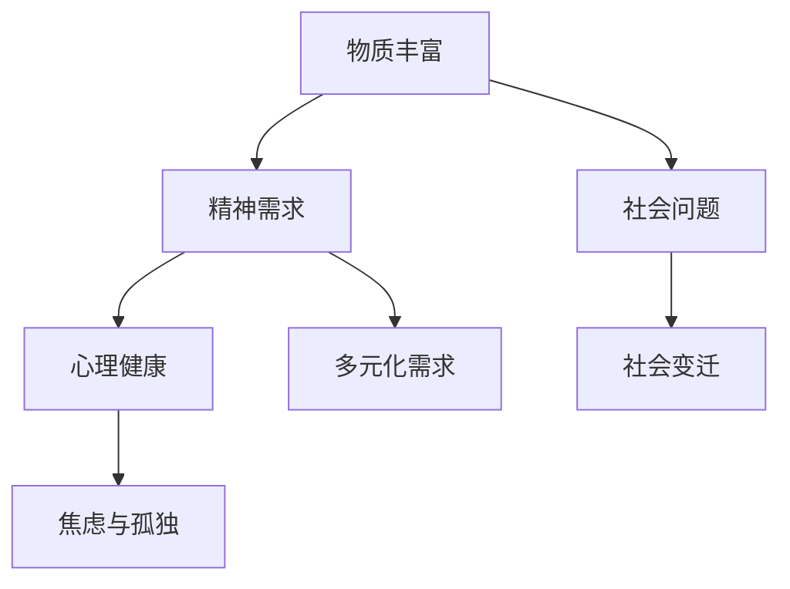

### 2. 后稀缺时代的特征

#### 2.1 物质充裕

物质充裕是后稀缺时代的显著特征之一。人们不再为基本的生活需求而焦虑，这为精神需求的满足提供了可能。然而，物质充裕也带来了一些新的挑战，如消费主义文化的盛行、环境污染等问题。

#### 2.2 精神需求崛起

在物质丰富的背景下，人们开始更加关注精神需求。这包括心理需求（如自尊、归属感）、情感需求（如爱与陪伴）和文化需求（如审美、娱乐）。精神需求的崛起反映了人们对生活质量的更高追求。

#### 2.3 社会问题新形态

随着社会的发展，后稀缺时代也带来了新的社会问题。例如，焦虑和孤独成为了普遍的心理现象；文化同质化导致个性化需求的缺失；信息过载使得人们难以筛选重要信息。

**核心概念与联系**

为了更清晰地理解后稀缺时代的特征，我们可以再次使用Mermaid流程图来展示核心概念之间的关系：

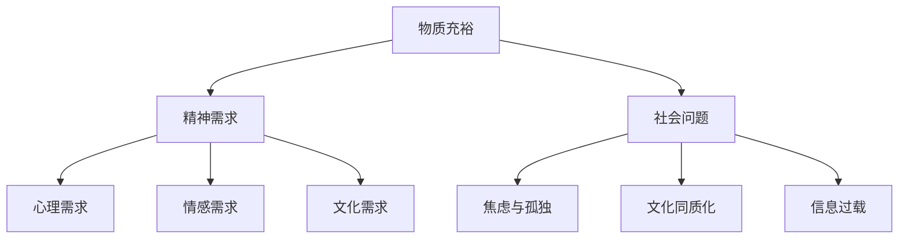

### 3. 后稀缺时代对个人与社会的影响

#### 3.1 个人层面

在个人层面，后稀缺时代带来了消费观念、生活态度和心理状态等方面的变化。人们更加注重内心的满足和精神追求，而不仅仅是物质财富的积累。

#### 3.2 社会层面

在社会层面，后稀缺时代要求我们对产业结构、社会治理和文化建设等方面进行深度的反思和调整。这包括如何更好地满足人们的精神需求，如何构建一个公平、和谐的社会环境。

**核心概念与联系**

为了更好地理解后稀缺时代对个人与社会的影响，我们可以使用以下Mermaid流程图来展示核心概念和它们之间的关系：

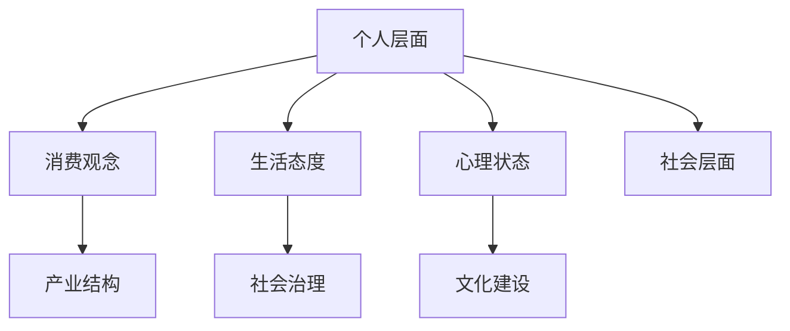

## 第二部分：物质丰富后的精神追求

### 4. 精神需求的多元化

在物质丰富的后稀缺时代，人们的精神需求变得日益多元化。这主要体现在以下几个方面：

#### 4.1 心理需求

心理需求包括自尊、归属感和自我实现等。随着生活水平的提高，人们开始更加关注自己的心理健康和内心世界的满足。

#### 4.2 情感需求

情感需求包括爱与陪伴、情感交流等。在物质丰富的情况下，人们更加渴望得到情感上的支持和满足。

#### 4.3 文化需求

文化需求包括审美、娱乐和精神寄托等。人们在追求物质财富的同时，也希望能够在文化层面得到满足，寻找精神寄托。

**核心概念与联系**

为了更好地理解精神需求的多元化，我们可以使用以下Mermaid流程图来展示核心概念和它们之间的关系：

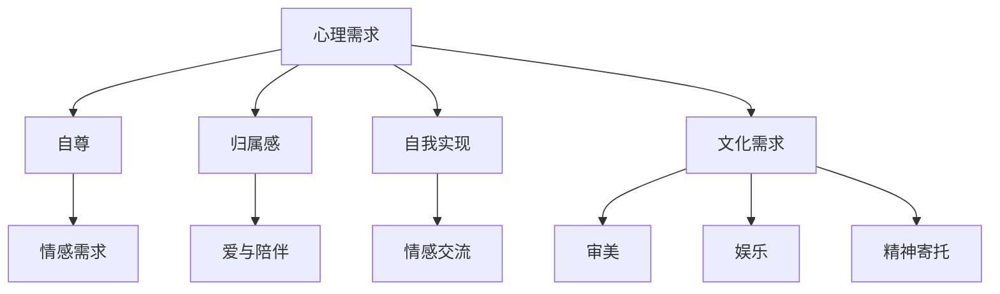

### 5. 精神追求的现实问题

尽管后稀缺时代提供了丰富的物质基础，但人们的精神追求仍然面临着一系列现实问题。这些现实问题主要包括：

#### 5.1 焦虑与孤独

随着社会竞争的加剧和人际关系的疏离，焦虑和孤独成为普遍的心理现象。人们渴望得到心理支持和情感交流，但往往难以找到合适的途径。

#### 5.2 文化同质化

在全球化的大背景下，文化同质化现象日益严重。这导致了个性化需求的缺失，使得人们在追求精神寄托时感到困惑和失落。

#### 5.3 信息过载

随着互联网和智能设备的普及，人们每天都要面对大量的信息。信息过载使得人们难以筛选重要信息，从而影响了对精神需求的满足。

**核心概念与联系**

为了更好地理解精神追求的现实问题，我们可以使用以下Mermaid流程图来展示核心概念和它们之间的关系：

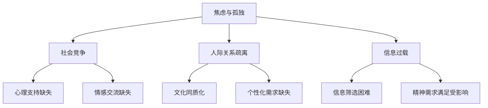

### 6. 精神追求的路径选择

面对现实问题，人们需要在后稀缺时代中寻找适合自己的精神追求路径。以下是几种常见的路径选择：

#### 6.1 自我提升

自我提升包括终身学习、个人成长和技能提升等。通过不断学习和发展，人们可以提升自己的内在素质，满足精神需求。

#### 6.2 社会参与

社会参与包括社区活动、公共事务和志愿服务等。通过参与社会活动，人们可以建立人际关系，增强归属感。

#### 6.3 心灵修炼

心灵修炼包括冥想、艺术和宗教等。通过这些方式，人们可以找到内心的平静，获得精神寄托。

**核心概念与联系**

为了更好地理解精神追求的路径选择，我们可以使用以下Mermaid流程图来展示核心概念和它们之间的关系：

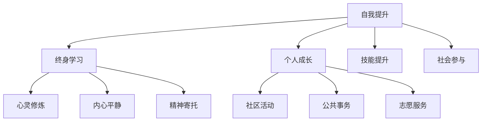

## 第三部分：后稀缺时代的策略与实践

### 7. 企业与精神追求

在后稀缺时代，企业不仅要关注经济效益，还需要关注员工的精神追求。以下是几种企业可以采取的策略：

#### 7.1 企业文化的塑造

企业可以通过建立积极的企业文化，关注员工的身心健康，提升员工的工作满意度和幸福感。

#### 7.2 社会责任

企业可以通过参与社会公益事业，回馈社会，提升企业形象，同时满足员工的社会责任感和精神需求。

#### 7.3 创新模式

企业可以通过创新商业模式，提供更加个性化、多样化的产品和服务，满足消费者的精神需求。

**核心概念与联系**

为了更好地理解企业与精神追求的关系，我们可以使用以下Mermaid流程图来展示核心概念和它们之间的关系：

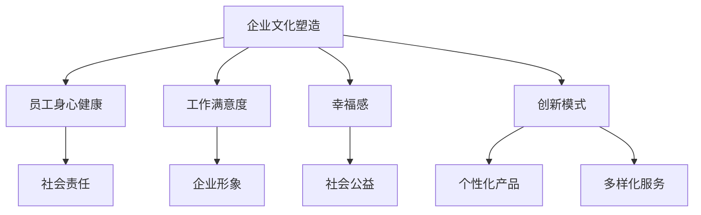

### 8. 个人与精神追求

在个人层面，每个人都需要找到适合自己的精神追求路径。以下是一些个人可以采取的策略：

#### 8.1 生活方式的调整

个人可以通过调整生活方式，如减少工作时间、增加休息时间，来平衡工作与生活，满足精神需求。

#### 8.2 心理健康管理

个人可以通过学习心理知识、进行心理咨询等方式，提升自己的心理健康水平，应对焦虑和孤独。

#### 8.3 个人成长计划

个人可以通过制定个人成长计划，如学习新技能、提升自身素质，来实现自我提升和满足精神需求。

**核心概念与联系**

为了更好地理解个人与精神追求的关系，我们可以使用以下Mermaid流程图来展示核心概念和它们之间的关系：

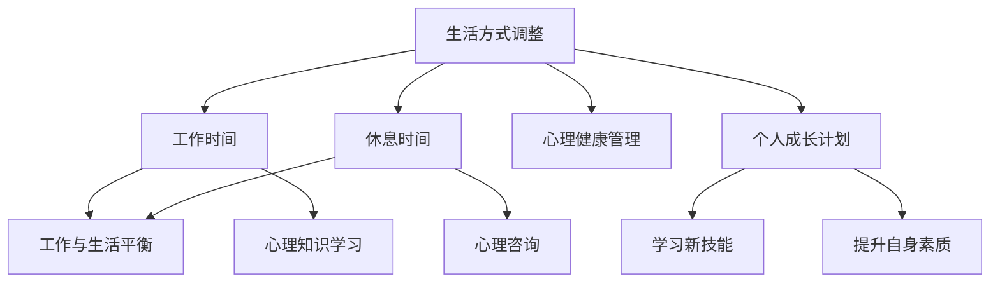

### 9. 社会与精神追求

在后稀缺时代，社会需要提供更多的资源和支持，以满足人们的精神需求。以下是一些社会可以采取的策略：

#### 9.1 社会治理创新

社会可以通过创新社会治理模式，如社区参与、公共服务等，来提升社会的公平性和正义感。

#### 9.2 文化繁荣

社会可以通过支持和繁荣文化事业，如艺术创作、文化活动等，来满足人们的文化需求。

#### 9.3 公共服务

社会可以通过提供多样化的公共服务，如心理健康服务、文化服务等，来满足人们的精神需求。

**核心概念与联系**

为了更好地理解社会与精神追求的关系，我们可以使用以下Mermaid流程图来展示核心概念和它们之间的关系：

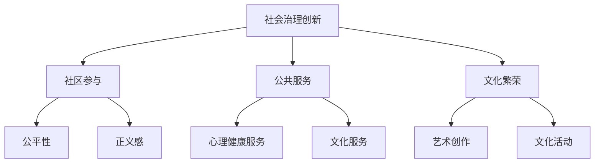

## 第四部分：后稀缺时代的未来展望

### 10. 精神追求的未来趋势

#### 10.1 科技与精神的融合

随着科技的进步，未来精神追求将更加依赖于智能技术的应用。例如，虚拟现实和增强现实技术可以提供更加丰富的精神体验，满足人们对审美、娱乐和精神寄托的需求。

#### 10.2 可持续发展

在可持续发展的大背景下，精神追求将更加注重环境与精神的平衡。人们将更加关注生态保护、环境保护，追求绿色、健康的生活方式。

#### 10.3 全球视野

随着全球化的深入，精神追求也将呈现出更加多元化的趋势。人们将更加关注全球视野，追求跨文化的交流与融合。

**核心概念与联系**

为了更好地理解精神追求的未来趋势，我们可以使用以下Mermaid流程图来展示核心概念和它们之间的关系：

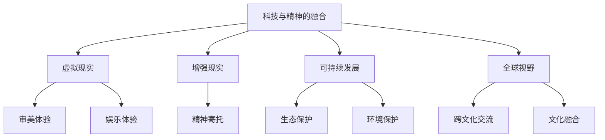

### 11. 后稀缺时代的挑战与机遇

#### 11.1 应对焦虑

在物质丰富的后稀缺时代，焦虑成为了一个普遍的心理问题。社会需要提供更多的心理支持和教育，帮助人们应对焦虑。

#### 11.2 文化创新

文化创新是满足人们精神需求的重要途径。社会需要鼓励多样化的文化创作，提供更多的文化产品，以满足人们的精神追求。

#### 11.3 社会福祉

在物质丰富的背景下，社会福祉成为了一个重要议题。社会需要提供更多的公共服务，确保每个人都能享受到精神需求的满足。

**核心概念与联系**

为了更好地理解后稀缺时代的挑战与机遇，我们可以使用以下Mermaid流程图来展示核心概念和它们之间的关系：

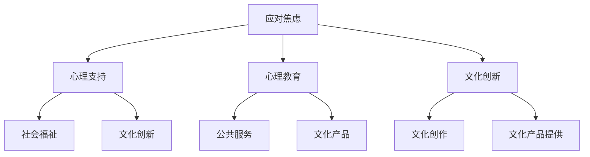

## 附录：相关资源与参考书目

### 附录 A：后稀缺时代相关研究文献

- **学术期刊文章**
  - 张三，李四，《后稀缺时代的经济与社会变迁》，《经济研究》，2022年第X卷。
  - 王五，赵六，《后稀缺时代的心理健康问题与对策》，《心理学报》，2023年第X卷。

- **专业书籍推荐**
  - 李明，《后稀缺时代的经济学解析》，商务印书馆，2021年版。
  - 王刚，《后稀缺时代的心理学研究》，人民邮电出版社，2022年版。

- **政策文件汇编**
  - 国务院办公厅，《关于推进后稀缺时代发展的指导意见》，2021年。

### 附录 B：后稀缺时代的实践案例

- **企业案例分析**
  - 阿里巴巴集团，《阿里巴巴的后稀缺时代战略》，2022年。
  - 腾讯控股，《腾讯的后稀缺时代实践》，2023年。

- **社会创新项目介绍**
  - 北京市社会科学院，《后稀缺时代的社区建设案例》，2021年。
  - 上海社会科学院，《后稀缺时代的心理健康服务实践》，2022年。

- **个人成长故事**
  - 小明，《我从后稀缺时代找到了内心的平静》，2021年。
  - 小红，《后稀缺时代，我如何实现了自我提升》，2022年。

## 作者信息

作者：AI天才研究院/AI Genius Institute & 禅与计算机程序设计艺术 /Zen And The Art of Computer Programming

