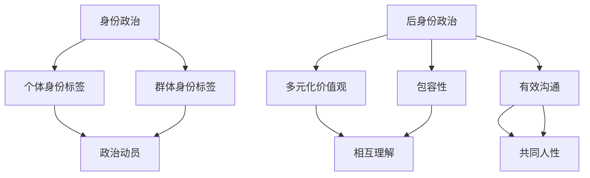

                 

# 《后身份政治时代的对话：超越标签寻找共同人性》

## 关键词
身份政治、对话艺术、共同人性、跨文化交流、社会影响

## 摘要
本文探讨后身份政治时代的对话艺术，以及如何通过超越标签寻找共同人性，实现有效沟通和相互理解。文章首先介绍了身份政治的背景与影响，随后深入分析了对话的基本原则、技巧与实践，并探讨了共同人性的探索与应用。通过数学模型和Python源代码的详细阐述，结合实际案例，本文为读者提供了关于后身份政治时代对话的有效指导。

## 第一部分：后身份政治时代概述

### 第1章：后身份政治时代的概念与背景

**背景介绍**
后身份政治时代是指在现代社会中，人们逐渐认识到身份标签的局限性，开始探索更加多元和包容的价值观。这一转变源于全球化、信息技术和多元文化交融的背景下，个体和群体之间的差异愈发显著。身份政治，即基于个体或群体身份标签进行政治动员和社会互动的现象，在后身份政治时代面临着新的挑战和机遇。

**核心概念与联系**

以下是身份政治和后身份政治的核心概念及其关系架构的Mermaid流程图：

**定义与起源**
- **身份政治**：指政治动员或社会互动基于个体或群体身份标签（如性别、种族、文化、宗教等）。
- **后身份政治**：强调超越身份标签，寻求共同人性，建立多元、包容的价值观。

**主要特征**
- **多元化**：强调多元文化的共存和相互尊重。
- **包容性**：关注个体差异，倡导平等权利和机会。
- **相互理解**：强调通过有效沟通，增进不同身份群体之间的理解和信任。

### 第2章：身份政治的影响与挑战

**对个体的影响**
身份政治可能导致个体在心理上产生认同感或排斥感，影响个体的自我认知和人际关系。

**对社会的影响**
身份政治可能加剧社会分裂，导致冲突和矛盾。在后身份政治时代，如何缓解这些负面影响，建立更加和谐的社会关系，成为重要的议题。

**面临的挑战**
- **文化差异**：不同身份群体之间的文化差异可能导致误解和冲突。
- **政治动员**：身份政治依然存在，如何平衡不同群体的利益，避免政治动员的负面影响，是重要挑战。

## 第二部分：对话的艺术

### 第3章：对话的基本原则

**开放性**
对话的开放性意味着参与者愿意倾听不同的观点，不预设立场，以开放的心态进行交流。

**平等性**
对话的平等性强调每个参与者都应该受到尊重，不论其身份和地位。平等性有助于建立互信，促进有效沟通。

**尊重与理解**
尊重和理解的对话强调对他人观点的尊重，以及对对方情感和背景的理解。这是建立共同人性的基础。

### 第4章：对话的技巧与实践

**倾听的重要性**
倾听是有效对话的核心，它有助于理解对方的观点和情感，建立信任和共鸣。

**提问的艺术**
提问可以帮助引导对话方向，深入了解对方的观点和需求。开放式提问和封闭式提问各有特点，应根据对话情境选择。

**情感表达的技巧**
情感表达是沟通中的重要部分，适当的情感表达可以增进亲密感，但需要注意表达的适度性和合适性。

### 第5章：对话中的冲突与解决

**冲突的识别与分类**
冲突可以分为理性冲突和情感冲突，理解冲突的类型有助于采取相应的解决策略。

**冲突的处理方法**
处理冲突的方法包括理性对话、情感调节、妥协和求同存异等。

**冲突的解决策略**
解决冲突的关键在于找到双方都能接受的解决方案，促进对话的顺利进行。

## 第三部分：寻找共同人性

### 第6章：人类共性的探索

**人类共性的定义与重要性**
人类共性是指不同文化、种族、性别和宗教背景的人们共同拥有的特质和需求。

**人类共性的特点与表现形式**
人类共性包括情感、价值观、社会行为等方面。通过了解这些特点，我们可以更好地理解不同身份群体之间的共同点。

**人类共性的文化差异与融合**
文化差异是人类共性的一部分，但通过交流和融合，可以促进不同文化之间的理解和尊重。

### 第7章：共同人性的实践与应用

**共同人性在组织管理中的应用**
在组织管理中，共同人性有助于建立和谐的团队关系，提高工作效率和员工满意度。

**共同人性在教育领域的影响**
教育领域强调共同人性，有助于培养学生的人际交往能力和跨文化理解能力。

**共同人性在跨文化交流中的意义**
跨文化交流中，共同人性有助于建立相互信任和尊重，促进文化交流和合作。

### 第8章：共同人性的未来展望

**共同人性对人类社会的影响**
共同人性有助于缓解社会矛盾，促进社会和谐与发展。

**共同人性的发展方向**
随着全球化进程的加速，共同人性的发展方向将更加多元和包容。

**共同人性的实现路径**
通过教育、文化交流和政治合作等途径，可以逐步实现共同人性的目标。

## 附录

### 附录A：后身份政治时代的案例分析

**案例一：某企业的对话实践**
通过企业内部的对话实践，如何建立多元化的工作环境，提高员工满意度和工作效率。

**案例二：某社区的共同人性探索**
探讨社区如何通过共同人性的实践，促进邻里和谐与互助。

**案例三：跨文化对话的成功故事**
分享跨文化对话的成功案例，分析如何实现跨文化交流和理解。

## 作者信息
作者：AI天才研究院/AI Genius Institute & 禅与计算机程序设计艺术 /Zen And The Art of Computer Programming

---

请注意，由于文章字数限制，本文仅提供了一个大纲框架和部分章节的内容概述。实际撰写时，每个章节都需要根据大纲进行详细的扩展和论述。此外，具体的Python代码、数学公式和实际案例将根据各章节的内容进行补充。文章的撰写需要确保逻辑清晰、内容丰富、语言准确，符合专业IT技术博客的标准。

