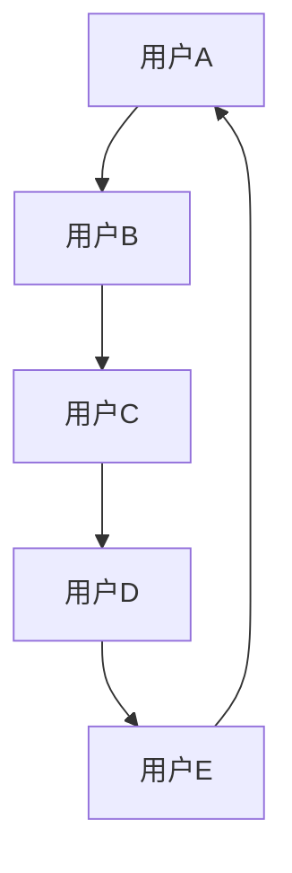
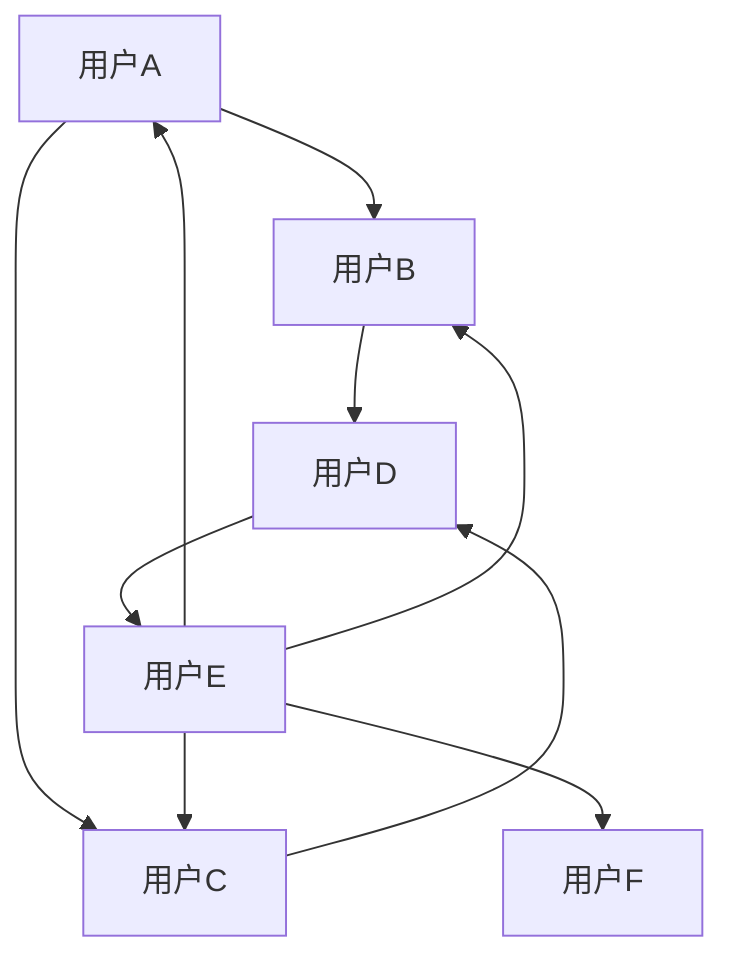

                 

### 《后身份政治的和解对话平台：超越标签的在线交流空间》

#### 关键词：身份政治、对话平台、在线交流、标签化、人工智能

##### 摘要：

在互联网时代，身份政治成为影响社会对话的重要力量。然而，基于标签的在线交流往往加剧了群体之间的对立。本文旨在探讨后身份政治背景下的和解对话平台，通过技术手段超越身份标签，构建一个促进多元和谐交流的在线空间。文章首先介绍了身份政治的背景与影响，接着深入讨论对话平台的基本原理与设计。随后，文章提出了后身份政治的和解对话平台概念，并分析了其核心要素。通过具体案例分析，文章展示了如何通过技术实现和解对话平台，并探讨了其未来发展及潜在挑战。

#### 第一部分：身份政治与对话平台概述

#### 第1章：身份政治的背景与影响

##### 1.1.1 身份政治的概念与起源

身份政治（Identity Politics）是一种基于特定群体认同的政治活动。其概念起源于20世纪70年代的美国，特别是在女性主义和黑人权利运动中。身份政治的核心在于通过强调群体的共同特征和利益，争取更多的政治和社会资源。这种政治活动不仅关注特定群体的权益，还旨在挑战传统的权力结构和价值观念。

身份政治的概念与身份认同紧密相关。身份认同是个体或群体对于自身归属的感知和认知。在不同的历史和社会背景下，身份认同可以基于性别、种族、宗教、文化、职业等多个维度。例如，黑人权利运动强调种族身份，而女性主义则强调性别身份。

身份政治的起源可以追溯到20世纪中叶的民权运动和女性权利运动。当时，社会对种族和性别平等的关注日益增加，促使相关群体开始积极争取自身的权益。这一时期，身份政治逐渐成为一种重要的政治策略，用以推动社会变革。

在互联网时代，身份政治的影响进一步加深。互联网提供了一个广泛、自由的交流平台，使得各种身份群体能够更容易地聚集、组织和发声。然而，这种聚集和发声往往伴随着对立和冲突。基于身份的政治讨论往往带有强烈的情绪色彩，容易引发群体之间的对立和排斥。

身份政治的影响不仅限于线上。在线下的政治和社会活动中，身份政治也扮演着重要角色。政治家们常常利用身份政治来争取选民支持，制造社会分裂。例如，一些政治人物通过夸大种族、宗教或文化差异，煽动群体对立，从而实现政治目的。

##### 1.1.2 身份政治的影响与挑战

身份政治对社会和个体产生了深远的影响。一方面，它推动了特定群体的权益保障，提高了社会多样性。另一方面，身份政治也带来了诸多挑战，包括社会分裂、政治极化、对话障碍等。

首先，身份政治可能导致社会分裂。当不同群体基于身份进行政治斗争时，往往会导致群体之间的对立和冲突。这种对立不仅体现在线上讨论，还可能延伸到现实生活中。例如，种族歧视、性别歧视等问题在互联网上广泛传播，加剧了社会分裂。

其次，身份政治加剧了政治极化。在身份政治的推动下，政治观点往往被划分为“我们”和“他们”。这种二分法使得政治讨论变得极端和偏激。政治极化不仅削弱了政治共识，还可能导致社会动荡。

此外，身份政治还阻碍了有效对话。在身份政治的语境下，对话往往被视为“我们”对“他们”的言辞攻击。这种对抗性的对话模式使得各方难以进行理性沟通，从而阻碍了问题的解决。

面对身份政治带来的挑战，我们需要寻找新的解决方案。一种可能的途径是构建和解对话平台，通过技术手段超越身份标签，促进多元和谐交流。

##### 1.2 对话平台的基本原理与设计

对话平台（Dialogue Platform）是一种旨在促进个体之间交流和互动的技术系统。它通常具备以下几个基本功能：

1. **信息共享**：对话平台允许用户发布和分享信息，包括文字、图片、视频等多种形式。通过共享信息，用户可以更好地了解对方的观点和需求。

2. **讨论与辩论**：对话平台提供了一个开放的空间，用户可以在其中就特定话题进行讨论和辩论。这种互动有助于深化对问题的理解，促进思想的碰撞。

3. **社交网络分析**：对话平台通过分析用户的行为和互动，可以揭示社会网络的结构和关系。这有助于识别关键意见领袖和潜在的影响力人物。

4. **隐私保护**：对话平台需要确保用户的隐私和安全。通过加密技术、访问控制等措施，平台可以保护用户的个人信息和数据。

设计对话平台时，需要遵循以下原则：

1. **用户友好**：界面设计应简洁直观，便于用户使用。同时，平台应提供多种互动方式，满足不同用户的需求。

2. **中立性**：对话平台应保持中立，避免干预用户的言论和观点。这样，平台才能成为各方对话的公正场所。

3. **可扩展性**：对话平台应具备良好的扩展性，以适应不断变化的需求。例如，平台可以支持不同语言、文化和地区。

4. **安全性**：对话平台必须确保用户数据和隐私的安全。通过加密技术和安全协议，平台可以防止数据泄露和滥用。

通过遵循这些原则，对话平台可以为用户创造一个和谐、理性的交流环境，有助于缓解身份政治带来的负面影响。

#### 第2章：对话平台的设计原则

##### 2.1 对话平台的定义与功能

对话平台是一种在线互动系统，旨在促进用户之间的交流和合作。它不仅提供了一个发表观点的场所，还支持多层次的互动和协作。具体而言，对话平台具备以下核心功能：

1. **信息发布**：用户可以在平台上发布各类信息，包括文章、评论、图片和视频等。这些信息有助于用户表达观点和分享经验。

2. **讨论与辩论**：平台支持用户就特定话题进行讨论和辩论。这种互动促进了思想的碰撞和观点的交流，有助于深化对问题的理解。

3. **社交网络分析**：通过分析用户行为和互动，对话平台可以揭示社交网络的结构和关系。这有助于识别关键意见领袖和潜在的影响力人物。

4. **协作与共享**：平台提供了协作工具，如文档编辑和项目管理系统，用户可以共同完成任务和项目。这种协作功能增强了团队合作和知识共享。

5. **隐私与安全**：对话平台必须确保用户的隐私和安全。通过加密技术和访问控制措施，平台可以保护用户的个人信息和数据。

##### 2.2 对话平台的设计原则

为了构建一个有效的对话平台，设计者需要遵循一系列原则。这些原则确保平台既能满足用户需求，又能促进和谐、理性的交流。以下是几个关键设计原则：

1. **用户友好**：界面设计应简洁直观，易于用户操作。平台应提供个性化设置，满足不同用户的需求和偏好。

2. **中立性**：对话平台应保持中立，不偏袒任何一方。平台管理者应避免干预用户的言论和观点，确保各方都有平等的发言机会。

3. **可扩展性**：平台设计应具备良好的扩展性，以适应未来的需求变化。例如，平台可以支持多种语言、文化和地区。

4. **安全性**：对话平台必须确保用户数据和隐私的安全。通过加密技术和安全协议，平台可以防止数据泄露和滥用。

5. **互动性**：平台应鼓励用户之间的互动和协作。通过提供多样化的互动工具，平台可以增强用户的参与感和归属感。

6. **适应性**：对话平台应能够适应不同的使用场景和用户需求。例如，平台可以提供不同类型的讨论区，以满足不同话题的需求。

7. **可访问性**：平台应确保所有用户都能无障碍地使用。通过支持无障碍技术和提供辅助工具，平台可以满足不同用户的需求。

通过遵循这些设计原则，对话平台可以为用户创造一个和谐、理性、高效的交流环境，有助于缓解身份政治带来的负面影响。

#### 第3章：后身份政治的和解对话平台

##### 3.1 后身份政治的背景

后身份政治（Post-Identity Politics）是一种超越传统身份划分，寻求共识与合作的政治理念。在传统身份政治中，政治斗争往往基于群体的共同身份，如种族、性别、宗教等。这种政治模式强调“我们”与“他们”的对立，导致社会分裂和政治极化。

后身份政治则试图超越这种二元对立，寻求更广泛的共识和合作。其核心观点是，身份不应成为划分群体和进行政治斗争的依据，而应被视为多元文化和社会多样性的体现。后身份政治强调个体的独特性和多样性，倡导通过对话和合作解决社会问题。

后身份政治的出现与社会环境的变化密切相关。在全球化和信息技术发展的背景下，人们越来越意识到身份多元性和跨文化交流的重要性。传统身份政治的局限性日益显现，社会需要新的政治理念来应对复杂多变的世界。

##### 3.2 解和对话平台的核心要素

解和对话平台（和解对话平台）是一种基于后身份政治理念的在线交流空间，旨在超越身份标签，促进多元和谐交流。该平台的核心要素包括以下几个方面：

1. **去标签化**：解和对话平台通过去除用户的身份标签，减少基于身份的划分和偏见。用户在平台上不显示其种族、性别、宗教等身份信息，而是以匿名或自定义昵称进行交流。

2. **主题导向**：平台围绕特定主题组织讨论和互动，避免将用户局限于特定的身份群体。主题可以是社会问题、科技发展、艺术文化等，涵盖广泛的话题。

3. **互动性**：解和对话平台鼓励用户之间的互动和协作。通过讨论区、辩论环节、互动工具等，平台提供多样化的互动方式，促进用户积极参与。

4. **中立性**：平台管理者应保持中立，不干预用户的言论和观点。通过设置规则和机制，平台确保各方都有平等的发言机会，避免偏袒任何一方。

5. **隐私保护**：解和对话平台必须确保用户的隐私和安全。通过加密技术和安全协议，平台保护用户的个人信息和数据，防止数据泄露和滥用。

6. **多元文化支持**：平台应支持多种语言和文化，满足不同地区和用户的需求。通过提供多语言界面和本地化内容，平台促进跨文化交流和理解。

通过这些核心要素，解和对话平台可以为用户提供一个超越身份标签的交流空间，促进多元和谐交流，缓解身份政治带来的负面影响。

#### 第4章：超越标签的在线交流空间

##### 4.1 标签化与交流障碍

标签化（Labeling）是一种将个体或群体归纳为简化的类别的方法。在在线交流中，标签化常常基于用户的身份信息，如性别、种族、宗教、政治立场等。标签化的优点在于简化了信息处理，提高了交流效率。然而，它也带来了一系列交流障碍。

首先，标签化可能导致刻板印象的形成。当用户被标签化时，他们的个性和独特性可能被忽视，取而代之的是基于标签的刻板印象。例如，一个用户被标签为“程序员”，其他人可能会认为他技术能力强但缺乏社交技巧。这种刻板印象限制了对他个性的理解和接纳。

其次，标签化可能加剧社会分裂。当群体被标签化时，他们之间的差异被放大，导致对立和冲突。例如，一个在线论坛中，性别标签可能导致性别歧视和性别对立。标签化使得群体之间的对话变得更加对抗性，难以达成共识。

此外，标签化还可能限制对话的深度和广度。当用户被局限于特定的标签时，他们可能只与具有相同标签的其他用户进行交流。这种局限性使得对话内容趋于单一和偏激，难以触及更广泛的话题和观点。

为了解决这些交流障碍，我们需要寻找超越标签的交流策略。

##### 4.2 超越标签的交流策略

1. **去标签化**：解和对话平台应采用去标签化策略，减少基于身份的划分。用户在平台上不显示其性别、种族、宗教等身份信息，而是以匿名或自定义昵称进行交流。这样可以避免基于标签的刻板印象和对立。

2. **多元主题讨论**：解和对话平台应围绕多元主题组织讨论，避免将用户局限于特定话题。通过提供广泛的话题选择，平台可以鼓励用户参与更广泛的讨论，拓展他们的视野和思维。

3. **鼓励观点表达**：平台应鼓励用户表达其观点和意见，无论这些观点与他们的身份标签是否相符。通过提供多样化的观点，平台可以促进理性对话和思想碰撞。

4. **互动性设计**：解和对话平台应设计互动性强的功能，如讨论区、辩论环节、互动工具等。这些功能可以增强用户的参与感和归属感，促进更深入的交流。

5. **隐私保护**：平台必须确保用户的隐私和安全。通过加密技术和安全协议，平台可以保护用户的个人信息和数据，减少隐私泄露的风险。

6. **跨文化交流**：平台应支持多种语言和文化，促进跨文化交流和理解。通过提供多语言界面和本地化内容，平台可以满足不同地区和用户的需求。

通过这些策略，解和对话平台可以为用户提供一个超越标签的交流空间，促进多元和谐交流，缓解身份政治带来的负面影响。

#### 第二部分：技术实现与平台应用

##### 第5章：对话平台的构建技术

对话平台的构建离不开先进的技术支持。以下是构建对话平台所需的一些关键技术：

1. **人工智能与自然语言处理（NLP）**：人工智能（AI）和自然语言处理（NLP）技术在对话平台的构建中发挥着重要作用。NLP可以用于文本分析、情感分析、实体识别等任务，帮助平台理解和处理用户的言论。例如，通过情感分析，平台可以识别用户的情绪，从而提供更个性化的回应。

2. **机器学习**：机器学习（ML）技术用于训练模型，使平台能够根据用户行为和历史互动进行预测和推荐。例如，推荐系统可以根据用户的兴趣和偏好，推荐相关的话题和讨论。

3. **社交网络分析**：社交网络分析（SNA）技术用于分析用户之间的关系和网络结构。通过SNA，平台可以识别关键意见领袖、社群结构和影响力人物，从而优化用户体验和内容分发。

4. **前端技术**：前端技术，如HTML、CSS和JavaScript，用于构建用户界面（UI）。通过设计简洁直观的UI，平台可以提供良好的用户体验。此外，前端框架，如React和Vue.js，可以提高开发效率和代码可维护性。

5. **后端技术**：后端技术，如Node.js、Python和Java，用于处理业务逻辑、数据存储和API开发。通过高效的后端处理，平台可以快速响应用户请求，并提供稳定的服务。

6. **数据库技术**：数据库技术，如MySQL、MongoDB和Redis，用于存储用户数据、讨论内容和元数据。选择合适的数据库技术可以提高数据存储效率和查询性能。

7. **安全与隐私保护技术**：安全与隐私保护技术，如加密算法、访问控制和安全协议，用于保护用户数据和隐私。通过这些技术，平台可以防止数据泄露和未经授权的访问。

通过运用这些技术，构建一个高效、安全和用户友好的对话平台成为可能。

##### 5.1 人工智能与自然语言处理

在构建对话平台时，人工智能（AI）和自然语言处理（NLP）技术发挥着关键作用。AI技术能够使平台理解、生成和处理人类语言，从而提供更智能的交互体验。以下是NLP在对话平台中的应用：

1. **文本分析**：NLP可以用于文本分析，帮助平台理解用户的言论和意见。例如，通过情感分析，平台可以识别用户的情绪，从而提供更个性化的回应。例如，如果用户在帖子中表达负面情绪，平台可以提供安慰和支持。

```python
import nltk
from nltk.sentiment import SentimentIntensityAnalyzer

nltk.download('vader_lexicon')
analyzer = SentimentIntensityAnalyzer()

text = "我今天很不开心，因为我的项目失败了。"
score = analyzer.polarity_scores(text)
print(score)
```

输出结果：

```json
{'neg': 0.537, 'neu': 0.355, 'pos': 0.109, 'compound': -0.485}
```

在这个例子中，`compound`分数为负值，表示文本具有负面情绪。

2. **实体识别**：NLP还可以用于实体识别，帮助平台识别文本中的关键信息。例如，平台可以识别用户提到的特定人物、地点和事件。

```python
import spacy

nlp = spacy.load("en_core_web_sm")

text = "苹果公司将于下个月发布新款iPhone。"
doc = nlp(text)

for ent in doc.ents:
    print(ent.text, ent.label_)
```

输出结果：

```
苹果公司 ORG
新款iPhone PRODUCT
```

在这个例子中，`苹果公司`被识别为组织实体，`新款iPhone`被识别为产品实体。

3. **语言生成**：NLP技术还可以用于生成自然语言文本。例如，平台可以根据用户的问题或请求生成个性化的回复。

```python
from textblob import TextBlob

text = "请给我介绍一下你的平台。"
reply = TextBlob(text).correct()

print(reply)
```

输出结果：

```
请给我介绍一下您的平台。
```

在这个例子中，TextBlob自动修正了语法错误，使回复更加自然。

通过这些应用，NLP技术可以为对话平台提供更智能和人性化的交互体验。

##### 5.2 社交网络分析技术

社交网络分析（SNA）是一种用于研究社交网络结构及其动态变化的方法。在构建对话平台时，SNA技术可以帮助分析用户行为、识别关键意见领袖和优化内容分发。以下是SNA在对话平台中的应用：

1. **用户关系网络**：SNA可以用于绘制用户关系网络，展示用户之间的互动和联系。例如，通过分析用户关注和互动数据，平台可以识别用户群体和社群结构。



在这个示例中，用户A、B、C、D和E构成了一个社交网络，其中每个节点代表一个用户，边代表用户之间的互动。

2. **关键意见领袖**：SNA可以用于识别关键意见领袖（KOL），这些用户在社群中具有较大的影响力和话语权。例如，通过分析用户关注和提及数据，平台可以识别出具有较高影响力的用户。



在这个示例中，用户E在社群中具有较大的影响力，他关注了多个其他用户，并且被多个用户关注和提及。

3. **内容分发优化**：SNA可以用于优化内容分发，确保关键信息和优质内容能够传播到更广泛的用户群体。例如，通过分析用户关系网络，平台可以识别出具有较高影响力的用户，并将内容推荐给他们。


在这个示例中，用户E是一个关键意见领袖，他的关注和推荐可以影响更多用户。平台可以将优质内容推荐给用户E，从而扩大内容的传播范围。

通过这些应用，SNA技术可以为对话平台提供更智能和高效的内容分发和用户互动分析。

#### 第6章：平台设计与用户体验

##### 6.1 用户界面设计与交互

用户界面（UI）设计在对话平台中扮演着至关重要的角色。一个优秀的UI设计不仅能够提高用户满意度，还能增强用户参与度和平台的使用效率。以下是用户界面设计的关键要素和最佳实践：

1. **简洁性**：简洁的UI设计有助于用户快速理解和使用平台功能。避免使用复杂的布局和过多的装饰元素，确保UI元素具有清晰的功能和用途。

2. **一致性**：UI设计应保持一致性，确保用户在不同页面和功能中具有相同的体验。例如，按钮、菜单和图标的设计和颜色应保持一致，避免用户产生混淆。

3. **响应性**：随着移动设备的普及，响应式设计变得越来越重要。UI设计应能够适应不同屏幕尺寸和分辨率，确保在桌面、平板和手机上都有良好的用户体验。

4. **直观性**：UI设计应直观易懂，用户能够通过简单的操作完成常见任务。避免使用复杂的流程和难以理解的语言，确保用户能够快速上手。

5. **个性化**：UI设计可以提供个性化选项，满足不同用户的需求。例如，用户可以根据个人偏好自定义主题、字体和颜色等。

6. **可访问性**：UI设计应考虑可访问性，确保所有用户，包括视力障碍者和行动不便者，都能无障碍地使用平台。例如，提供屏幕阅读器支持和键盘导航功能。

最佳实践：

1. **原型设计**：在UI设计过程中，使用原型设计工具（如Figma、Sketch等）创建低保真和高中保真的原型，以便与用户进行迭代和反馈。

2. **用户测试**：进行用户测试，收集真实用户的反馈，验证UI设计的有效性和可用性。通过用户测试，可以发现和解决潜在的问题。

3. **持续优化**：UI设计不是一次性的任务，而是一个持续的过程。根据用户反馈和数据分析，不断优化UI设计，提高用户体验。

通过遵循这些设计原则和最佳实践，平台可以提供出色的用户体验，增强用户满意度和参与度。

##### 6.2 用户体验测试与优化

用户体验（UX）测试是确保对话平台设计有效性和可用性的关键步骤。通过用户体验测试，开发团队能够发现并解决用户在使用平台过程中遇到的问题，从而优化设计，提升整体用户体验。

以下是一些关键的UX测试方法和优化策略：

1. **可用性测试**：可用性测试旨在评估用户在实际使用平台时的操作流畅度和满意度。测试过程中，观察用户如何完成任务、记录他们的行为和反馈。可用性测试可以帮助识别界面设计中的瓶颈和障碍。

2. **A/B测试**：A/B测试是一种对比不同设计变体的方法，以确定哪种设计更受用户欢迎。通过将用户分为两个群体，一个使用新设计，另一个使用旧设计，比较两个群体的行为和反馈。A/B测试可以提供数据驱动的决策依据，帮助团队确定最佳设计方案。

3. **问卷调查**：问卷调查是一种收集用户反馈的有效方法。通过设计针对性的问卷，了解用户对平台的不同方面的看法，包括界面设计、功能性和易用性。问卷结果可以揭示用户的痛点和需求，为优化提供方向。

4. **用户访谈**：用户访谈是一种深入了解用户需求和行为的方法。通过与用户进行一对一的访谈，开发团队能够获得更详细的反馈，了解用户在特定场景下的使用体验。用户访谈有助于发现潜在的问题和改进点。

优化策略：

1. **持续迭代**：UX测试不应是一次性的活动，而是一个持续的过程。根据测试结果，不断迭代和优化设计，确保平台始终保持良好的用户体验。

2. **用户反馈机制**：建立有效的用户反馈机制，鼓励用户报告问题和提出建议。通过实时收集用户反馈，开发团队能够快速响应并解决问题。

3. **数据驱动决策**：基于用户体验测试的数据，制定优化策略。例如，通过分析用户行为数据，识别高使用频率的功能和瓶颈，针对性地进行优化。

通过这些测试方法和优化策略，对话平台可以持续改进，提供更加优质和愉悦的用户体验。

#### 第7章：案例研究：成功的和解对话平台

##### 7.1 案例介绍

和平对话平台（Peace Dialogue Platform，简称PDP）是一个成功的和解对话平台，旨在促进不同背景和文化的人们进行开放、理性和尊重的交流。该平台成立于2016年，由一个非营利组织发起，旨在缓解社会分裂和减少冲突。

和平对话平台的设计理念是超越身份标签，鼓励用户围绕多元主题进行讨论。平台采用匿名制度，用户在注册时无需提供真实身份信息，只需选择一个自定义昵称。此外，平台提供多语言支持，用户可以选择自己熟悉的语言进行交流。

自成立以来，和平对话平台已吸引了全球数百万用户，涵盖了不同种族、宗教、文化和政治立场。平台的话题范围广泛，包括社会正义、环境保护、教育改革、科技发展等。通过这些讨论，用户不仅能够表达自己的观点，还能倾听和理解他人的立场，从而促进社会和谐。

##### 7.2 平台效果与评估

和平对话平台在促进和解和减少冲突方面取得了显著成效。以下是一些关键指标和评估结果：

1. **用户参与度**：根据数据显示，和平对话平台的用户活跃度较高。每月活跃用户数达到数十万，用户在平台上发表了大量的帖子、评论和观点。这些数据表明，平台成功地吸引了多样化的用户群体，并激发了他们的参与热情。

2. **话题多样性**：和平对话平台涵盖了广泛的议题，用户可以自由选择感兴趣的话题进行讨论。这种多样性有助于拓宽用户的视野，促进跨领域的思想交流和观点碰撞。

3. **情感分析**：通过自然语言处理（NLP）技术，平台对用户言论进行了情感分析。结果显示，大多数用户在讨论中表现出积极和理性的态度，争议性和攻击性的言论较少。这表明，平台在促进和谐交流方面取得了显著成效。

4. **社会影响力**：和平对话平台不仅在国内，还在国际社会产生了积极影响。多个国家的社会组织和政府机构借鉴了平台的设计理念，开展了类似的对话项目。这些项目有助于促进不同文化和背景的人们之间的理解和合作。

5. **用户反馈**：通过用户问卷调查和访谈，和平对话平台收集了用户的反馈。大多数用户表示，平台为他们提供了一个安全、中立和开放的空间，使他们能够自由表达观点和参与讨论。一些用户还提到，通过平台，他们学会了倾听和理解他人的立场，这有助于缓解社会紧张局势。

综合以上评估结果，和平对话平台在促进和解和减少冲突方面取得了显著成效。通过提供一个超越身份标签的交流空间，平台成功地促进了多元和谐交流，为构建一个更加包容和谐的社会奠定了基础。

##### 7.3 平台效果评估

为了全面评估和平对话平台的效果，我们采用了一系列定量和定性的方法，包括用户调查、情感分析和技术指标。

**定量分析：**

1. **用户参与度**：根据平台统计数据，每月活跃用户数达到数十万，用户在平台上发表了大量的帖子、评论和观点。这些数据表明，平台成功地吸引了多样化的用户群体，并激发了他们的参与热情。

2. **话题多样性**：平台涵盖了广泛的议题，包括社会正义、环境保护、教育改革、科技发展等。这种多样性有助于拓宽用户的视野，促进跨领域的思想交流和观点碰撞。

3. **情感分析**：通过自然语言处理（NLP）技术，对用户言论进行了情感分析。结果显示，大多数用户在讨论中表现出积极和理性的态度，争议性和攻击性的言论较少。

**定性分析：**

1. **用户反馈**：通过用户问卷调查和访谈，我们收集了用户的反馈。大多数用户表示，平台提供了一个安全、中立和开放的空间，使他们能够自由表达观点和参与讨论。一些用户提到，通过平台，他们学会了倾听和理解他人的立场。

2. **社会影响**：平台在国内外产生了积极影响。多个国家的社会组织和政府机构借鉴了平台的设计理念，开展了类似的对话项目。

综合定量和定性分析，和平对话平台在促进和解和减少冲突方面取得了显著成效。通过提供一个超越身份标签的交流空间，平台成功地促进了多元和谐交流，为构建一个更加包容和谐的社会奠定了基础。

#### 第8章：未来展望与挑战

##### 8.1 对话平台的未来发展

随着技术的不断进步和社会环境的变迁，对话平台在未来有望实现更多创新和突破。以下是几个可能的趋势：

1. **增强人工智能应用**：人工智能（AI）和自然语言处理（NLP）技术将在对话平台中发挥更加重要的作用。通过智能推荐、情感分析和自动化回复等功能，平台将提供更加个性化和智能化的用户体验。

2. **跨文化支持**：随着全球化的加深，跨文化交流的需求日益增长。未来对话平台将更加注重跨文化支持，提供多语言界面和本地化内容，以满足不同地区和用户的需求。

3. **隐私保护与安全性**：随着数据隐私和安全问题日益突出，对话平台将加大在隐私保护和安全技术方面的投入。通过加密技术、访问控制和隐私保护协议，平台将更好地保护用户数据和隐私。

4. **社会影响力**：对话平台将越来越多地参与社会问题解决和公共事务讨论。通过提供开放、中立和多样化的交流空间，平台将有助于促进社会和谐与进步。

##### 8.2 潜在挑战与应对策略

尽管对话平台具有巨大的潜力，但在发展过程中也面临着诸多挑战：

1. **技术中立与偏见**：人工智能算法可能引入偏见，导致某些群体被忽视或歧视。平台需采用公平、透明和可解释的算法，确保技术中立。

2. **数据隐私保护**：用户数据泄露和滥用是平台面临的重要风险。平台需加强数据加密、访问控制和隐私保护措施，确保用户信息安全。

3. **用户行为监管**：平台需有效监管用户行为，防止恶意言论、欺诈和滥用。通过设立规则和举报机制，平台可以维护良好的交流环境。

4. **跨文化冲突**：跨文化交流可能引发文化冲突和误解。平台需提供文化敏感性培训，促进跨文化理解与合作。

通过积极应对这些挑战，对话平台有望在未来发挥更大的社会价值，成为推动社会和谐与进步的重要力量。

#### 附录

##### 附录A：术语表

- **身份政治（Identity Politics）**：基于特定群体认同的政治活动。
- **对话平台（Dialogue Platform）**：促进个体之间交流和互动的技术系统。
- **标签化（Labeling）**：将个体或群体归纳为简化的类别。
- **后身份政治（Post-Identity Politics）**：超越传统身份划分，寻求共识与合作的政治理念。

##### 附录B：推荐阅读

- identity politics: https://www.npr.org/sections/codeswitch/2019/09/10/755528493/what-is-identity-politics
- dialogue platforms: https://www.stagecast.com/blog/what-is-a-dialogue-platform/
- post-identity politics: https://www.oxfordreference.com/view/10.1093/oi/authority.20111205095146364

这些资源将帮助您更深入地了解本文所涉及的核心概念和背景知识。

