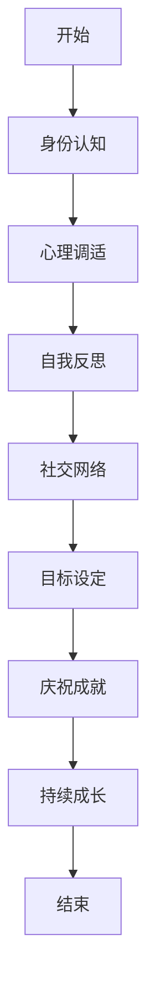

                 

# 引言

在当今这个快速变化的时代，我们每个人都面临着各种各样的挑战。身份焦虑，作为一种普遍的心理现象，也在现代社会中变得尤为突出。身份焦虑，简单来说，就是对自我身份的不确定性和焦虑感。这种焦虑可能源于职业、人际关系、社会角色等多个方面，其表现形式多样，从轻微的迷茫到严重的心理困扰，不一而足。

## 1.1 身份焦虑的起源与后身份焦虑时代

身份焦虑并非一个全新的概念。自古以来，人类就在不断地探索自我身份的意义。然而，随着社会结构、经济模式、文化价值观的快速变迁，身份焦虑的问题变得更加复杂和普遍。后身份焦虑时代，是指在这个全球化和数字化的背景下，人们对于自我身份的认知和认同所面临的新挑战。

### 起源

身份焦虑的起源可以追溯到多个方面：

1. **社会变迁**：工业革命以来，社会结构和经济模式发生了翻天覆地的变化，传统的社会角色和身份认同逐渐瓦解，人们开始面对新的不确定性和压力。
2. **文化多元**：全球化带来了文化的交融和碰撞，不同的文化价值观相互影响，使得个体在自我认同上产生了困惑和焦虑。
3. **信息技术**：互联网和社交媒体的普及，让个体的生活变得透明，也加剧了身份认同的焦虑感。

### 后身份焦虑时代的特征

后身份焦虑时代具有以下特征：

1. **多元身份**：个体可能同时拥有多种社会角色和身份，如职业人士、家庭主妇、社交媒体网红等，这使得身份的界定变得更加复杂。
2. **角色冲突**：不同的社会角色和身份之间可能存在冲突，导致个体感到困惑和焦虑。
3. **自我表达**：个体更加注重自我表达和个性化，但这也增加了对自我身份的不确定性和焦虑感。

## 1.2 本书的目的与结构安排

本书旨在帮助读者理解身份焦虑的起源和表现，并提供一套有效的自我探索课程，帮助读者找到真实的自我。本书分为七个部分，结构安排如下：

### 第二部分：理解身份焦虑

- **身份的定义与变迁**：探讨身份在不同历史时期和文化背景下的定义和变迁。
- **身份焦虑的成因与表现**：分析身份焦虑的成因及其在不同人群中的表现。
- **后身份焦虑时代的特征与挑战**：讨论后身份焦虑时代的特征和面临的挑战。
- **身份危机的心理影响**：探讨身份危机对心理健康的负面影响。

### 第三部分：自我探索的路径

- **自我认知的重要性**：阐述自我认知对个体成长和发展的意义。
- **心理调适策略**：介绍几种常见的心理调适策略。
- **内在探索的实践方法**：提供具体的实践方法，帮助读者进行内在探索。
- **自我价值的重建**：讨论如何通过自我反思和正面的自我评价来重建自我价值。
- **社交关系的调整**：探讨如何调整社交关系，以支持自我探索和身份重建。

### 第四部分：课程实施

- **课程设置与安排**：详细描述课程的具体设置和安排。
- **每周课程主题与内容**：列出每周的课程主题和内容。
- **实践活动的组织**：描述如何组织实践活动，以支持课程的学习和探索。
- **课程评估与反馈**：介绍如何评估课程的成效，以及如何收集和反馈学员的意见和建议。

### 第五部分：案例分析

- **案例一**：一位职业女性的自我探索之旅。
- **案例二**：一位年轻人的身份重建之路。
- **案例三**：一位创业者的自我成长经历。

### 第六部分：总结与展望

- **课程收获与反思**：总结课程的主要收获和读者的反思。
- **后续学习的建议**：提供后续学习的建议，以支持读者的自我成长。
- **对社会的贡献与影响**：讨论课程对社会的贡献和影响。

### 第七部分：附录

- **相关文献推荐**：提供关于身份焦虑和自我探索的相关文献。
- **心理咨询师资源**：列出心理咨询师和心理健康机构的联系方式。
- **进一步探索的方向**：提供进一步探索的方向和建议。
- **课程参与者反馈与建议**：收集和整理课程参与者的反馈和建议。

## 1.3 读者的期望与自我成长路径

本书的目标读者包括那些在身份焦虑中感到困惑和焦虑的人，以及对自我探索和心理健康感兴趣的专业人士。通过阅读本书，读者可以：

- **理解身份焦虑的成因和表现**：通过深入分析，了解身份焦虑的根源和表现形式，为后续的自我探索提供理论基础。
- **掌握自我探索的方法和技巧**：学习一系列实用的自我探索方法和技巧，如心理调适策略、内在探索实践等，帮助读者找到真实的自我。
- **重建自我价值**：通过自我反思和正面的自我评价，重建自我价值，提高自我认同感。
- **改善社交关系**：调整社交关系，建立更加健康和支持的人际网络。
- **实现自我成长**：通过自我探索和成长，实现个人目标和梦想，过上更加充实和满意的生活。

总的来说，本书不仅提供了理论知识，还结合了实际案例和具体实践方法，旨在帮助读者走出身份焦虑的困境，找到真实的自我，实现自我成长和幸福。接下来，我们将深入探讨身份焦虑的成因和表现，为自我探索的旅程奠定基础。

## 理解身份焦虑

身份焦虑是一种普遍的心理现象，其成因复杂多样，表现形式也因人而异。在现代社会中，身份焦虑不仅影响个人的心理健康，还可能对整个社会产生深远的影响。在本节中，我们将深入探讨身份焦虑的成因、表现，以及后身份焦虑时代的特征和挑战。

### 身份的定义与变迁

身份，是指一个人在特定社会和文化背景中所扮演的角色和位置。从传统意义上讲，身份往往与家庭、职业、地域等社会角色密切相关。然而，随着社会的发展，身份的定义和变迁也经历了巨大的变化。

1. **传统的身份定义**：
   - 家庭角色：在传统社会中，家庭是身份的重要来源。一个人的身份往往与其在家庭中的角色紧密相关，如父亲、母亲、儿子或女儿。
   - 职业角色：职业是另一个重要的身份来源。一个人的身份很大程度上取决于其职业，如医生、教师、工人等。
   - 地域角色：地域也是身份的一个方面。例如，一个人可能因为出生或生活在某个特定地区而拥有特定的身份认同，如上海人、北京人等。

2. **现代身份的变迁**：
   - 多元化：现代社会中，个体的身份越来越多元化。一个人可能同时拥有多个社会角色和身份，如职业人士、家庭成员、社交媒体用户等。
   - 个性化：随着社会对个人独特性的重视，个体的身份越来越强调个性化。人们开始更加关注自我表达和个性化身份的构建。
   - 漂移性：互联网和全球化使得个体的身份变得更加流动和不确定。一个人可能在不同时间和空间中扮演不同的角色，导致身份的模糊化和不确定性。

3. **后现代身份**：
   - 后现代身份强调个体的主观性和建构性。身份不再被看作是固定的、客观的实体，而是由个体通过自我表达和社会互动不断建构和重塑的过程。
   - 后现代身份强调身份的多元性和动态性。个体可能拥有多种身份，并在不同的社会情境中灵活调整自己的身份认同。

### 身份焦虑的成因

身份焦虑的成因复杂多样，可以从以下几个方面进行探讨：

1. **社会变迁**：
   - **职业流动性**：随着职业的快速变化和就业市场的波动，个体对于职业身份的稳定性和安全感感到焦虑。
   - **文化多样性**：文化多样性的增加使得个体在寻找自己的身份认同时面临更多的选择和困惑。
   - **全球化**：全球化使得个体面临更多的跨文化互动，这种互动可能导致身份的模糊化和不安全感。

2. **个人经历**：
   - **早期经验**：个体在成长过程中，如果经历过身份认同的危机或挫折，可能会在成年后产生持续的焦虑感。
   - **自我认知**：个体对自己的认知和评价可能影响其身份认同。如果个体对自己的认知存在偏差或不足，可能会产生身份焦虑。

3. **心理因素**：
   - **自我怀疑**：个体可能对自己的身份感到怀疑，不确定自己在社会中的角色和位置。
   - **恐惧失去**：个体可能担心失去现有的身份认同，或者担心未来无法找到新的身份认同。

### 身份焦虑的表现

身份焦虑的表现形式多种多样，以下是一些常见的表现：

1. **心理症状**：
   - **焦虑和紧张**：个体可能感到持续的焦虑和紧张，尤其是在需要表达自己身份或面对身份问题时。
   - **自我怀疑**：个体可能对自己的能力和价值产生怀疑，导致自我否定和自卑。
   - **恐惧和回避**：个体可能害怕面对身份问题，回避相关的社交和职业活动。

2. **行为表现**：
   - **频繁变动**：个体可能在职业、居住地、社交圈子等方面频繁变动，以寻找一个能够带来稳定身份认同的环境。
   - **过度追求**：个体可能过度追求自我表达和个性化，希望通过不断的改变和尝试来找到自己的身份。
   - **社交回避**：个体可能避免与他人深入交往，以减少因身份问题带来的焦虑和困惑。

### 后身份焦虑时代的特征与挑战

后身份焦虑时代具有以下特征和挑战：

1. **身份的多元性**：
   - **多重身份**：个体可能同时拥有多种社会角色和身份，如职业人士、家庭主妇、社交媒体用户等。
   - **角色冲突**：不同的身份之间可能存在冲突，导致个体感到困惑和焦虑。

2. **身份的不确定性**：
   - **模糊性**：随着社会角色的多样化，个体的身份认同变得模糊和不确定。
   - **不稳定**：个体可能感到自己的身份不稳定，难以找到长期的归属感。

3. **自我表达的挑战**：
   - **自我表达的压力**：个体可能感到压力，需要不断地表达自己，以维持自己的身份认同。
   - **表达的多样性**：个体需要在不同的社交和文化环境中灵活调整自己的表达方式，以适应不同的身份角色。

4. **社会认同的缺失**：
   - **归属感**：个体可能难以找到与自己身份认同相符的社会群体，导致归属感的缺失。
   - **社会排斥**：个体可能因为身份的不确定性或冲突而受到社会的排斥和歧视。

### 身份危机的心理影响

身份危机，即个体在寻找和确立身份过程中遇到的困难和挑战，可能对心理健康产生负面影响：

1. **焦虑和抑郁**：
   - **焦虑**：个体可能因身份的模糊性或冲突而产生持续的焦虑感。
   - **抑郁**：个体可能因身份危机导致的自我否定和自卑而产生抑郁情绪。

2. **自我效能感下降**：
   - **自我效能感**：个体可能因身份危机而对自己的能力和价值产生怀疑，导致自我效能感下降。

3. **人际关系问题**：
   - **信任问题**：个体可能因身份的不确定性而对人际关系产生信任问题。
   - **社交回避**：个体可能因身份危机而回避社交活动，导致人际关系疏远。

### 后身份焦虑时代的特征与挑战总结

后身份焦虑时代，个体面临多元身份、不确定性和自我表达等多重挑战。这些挑战不仅影响个体的心理健康，还对整个社会产生了深远的影响。通过理解和应对这些挑战，个体可以更好地管理身份焦虑，实现自我成长和社会融入。

### 身份焦虑的成因与表现

身份焦虑是一种复杂的心理现象，其成因多种多样，可以从外部环境和内部心理两个层面进行探讨。理解这些成因和表现有助于我们更好地应对和缓解这种焦虑。

#### 外部环境因素

1. **社会变迁**：
   - **职业流动性**：现代社会中，职业流动性显著增加，许多人可能在短时间内更换多个工作，这导致职业身份的波动性增加，从而引发身份焦虑。
   - **文化多样性**：全球化带来了文化的多样性，个体在寻找身份认同时可能会面临多种文化的冲击和融合，增加身份认同的复杂性。

2. **经济压力**：
   - **经济不稳定**：经济波动和就业市场的变化使得个体对自己的经济安全感到担忧，这种担忧可能会加剧身份焦虑。

3. **社会期望**：
   - **社会角色定位**：社会对个体身份的期望和角色定位可能变得模糊和不确定，例如，现代社会对自由职业者和创业者的身份期望与传统职业不同，这可能导致个体在身份认同上感到困惑。

#### 内部心理因素

1. **自我认知**：
   - **自我怀疑**：个体对自己的能力和价值可能存在内在的怀疑，这种自我怀疑可能导致身份焦虑。
   - **完美主义**：对自身的高期望和完美主义倾向可能会导致个体在面对自我身份的挑战时产生强烈的焦虑感。

2. **心理防御机制**：
   - **逃避**：个体可能通过逃避面对身份问题来减轻焦虑，但这种逃避行为并不能解决根本问题，反而可能加剧焦虑。
   - **否认**：个体可能通过否认自己的某些身份特征来避免焦虑，但这种方法也容易导致内在的不一致。

#### 表现形式

身份焦虑的表现形式多样，常见的有以下几种：

1. **焦虑和紧张**：
   - **焦虑情绪**：个体可能感到持续的焦虑和紧张，特别是在需要表达自己身份或面对身份问题时。
   - **紧张关系**：焦虑可能导致个体在人际关系中表现得过于紧张，害怕被他人评判。

2. **自我怀疑和自卑**：
   - **自我怀疑**：个体可能对自己的身份和能力产生怀疑，不确定自己在社会中的角色和位置。
   - **自卑情绪**：个体可能因为对自己的某些身份特征感到不满意而产生自卑情绪。

3. **行为表现**：
   - **过度追求**：个体可能过度追求自我表达和个性化，希望通过不断的改变和尝试来找到自己的身份。
   - **社交回避**：个体可能因为身份焦虑而避免与他人深入交往，导致人际关系疏远。

4. **情感波动**：
   - **情绪波动**：个体可能因身份焦虑而产生情绪波动，如焦虑、抑郁等。
   - **心理困扰**：身份焦虑可能导致个体出现心理困扰，影响日常生活和工作。

### 影响因素

身份焦虑的成因和表现形式受到多种因素的影响，包括：

1. **个人经历**：
   - **早期经历**：个体在成长过程中可能经历过身份认同的危机或挫折，这可能会对成年后的身份焦虑产生深远影响。
   - **家庭环境**：家庭环境和父母的教养方式可能对个体的身份认知和自我认同产生影响。

2. **社会支持**：
   - **社交网络**：一个稳定和支持的社交网络可以帮助个体应对身份焦虑，减少孤独感和不安全感。
   - **社会认同**：个体在社区或群体中获得的社会认同感可以增强其身份认同，减少焦虑。

3. **心理辅导**：
   - **心理咨询**：专业的心理辅导可以帮助个体理解和管理身份焦虑，提供有效的应对策略。

通过深入分析身份焦虑的成因和表现形式，我们可以更好地理解和应对这种心理现象。在接下来的章节中，我们将探讨如何通过自我探索来缓解身份焦虑，帮助个体找到真实的自我。

### 后身份焦虑时代的特征与挑战

在进入后身份焦虑时代，社会和个人都面临着一系列新的特征和挑战。这些特征和挑战不仅影响了个体对身份的认知，也对整个社会结构产生了深远的影响。以下是对这些特征和挑战的详细探讨。

#### 多元身份的普遍性

在后身份焦虑时代，个体往往拥有多重身份。这些身份可能包括职业身份、家庭身份、社交身份、文化身份等。例如，一个人可能在工作中是工程师，在家庭中是父亲或母亲，在社交网络中是科技爱好者，在文化身份上可能同时属于多个族群或亚文化群体。这种多元化的身份使得个体的身份认同变得更加复杂。

1. **身份角色冲突**：
   - 多重身份之间的冲突可能导致个体感到困惑和焦虑。例如，一个人在职业角色上追求成功，但在家庭角色上可能需要花费更多时间和精力，这种冲突可能导致身份焦虑。
   - 矛盾的价值观：不同身份背后的价值观可能存在冲突，例如，在职业身份上追求效率，而在家庭身份上强调亲情和温暖。

2. **身份认同的模糊性**：
   - 多重身份的存在可能导致个体的身份认同变得模糊和不确定。个体可能难以确定自己的核心身份，从而感到困惑和焦虑。

#### 身份角色的流动性

在后身份焦虑时代，个体的身份角色变得更加流动性。这种流动性体现在以下几个方面：

1. **职业流动性**：
   - 随着科技的发展和就业市场的变化，个体可能频繁更换工作，甚至从传统职业转向自由职业或创业。这种职业流动性增加了个体对身份的焦虑感。

2. **文化流动性**：
   - 全球化和互联网的普及使得个体可以轻松地跨越不同的文化边界，这也导致了身份角色的流动性增加。个体可能在不同的文化环境中扮演不同的角色，从而增加了身份认同的复杂性。

3. **社会角色的变化**：
   - 社会角色的变化也加剧了身份焦虑。例如，随着家庭结构的变化，个体可能在家庭角色上经历从子女到父母的转变，这种转变可能导致身份认同的困惑。

#### 身份表达的多样性

在后身份焦虑时代，个体更加注重自我表达和个性化。这种多样性体现在以下几个方面：

1. **社交媒体的兴起**：
   - 社交媒体提供了一个平台，让个体可以展示自己的多元身份和个性。然而，这也可能导致个体在身份表达上感到压力，担心自己的身份表达不被认可或接受。

2. **身份实验**：
   - 部分个体可能通过尝试不同的身份角色来探索自我。这种身份实验可能带来新的身份认同，但也可能增加身份焦虑。

3. **自我形象的塑造**：
   - 个体通过塑造自我形象来传达自己的身份认同。这种自我形象的塑造可能是一个持续的过程，个体需要不断地调整和优化，以适应社会和自我的需求。

#### 社会认同的缺失

在后身份焦虑时代，社会认同的缺失成为一个重要的挑战。社会认同不仅是指个体在社会中的地位和角色，还包括社会对个体的接受和认可。

1. **归属感的缺失**：
   - 随着社会结构的变动和文化多样性的增加，个体可能难以找到与自己身份认同相符的社会群体，从而感到归属感的缺失。

2. **社会排斥**：
   - 身份的不确定性和多样性可能导致个体受到社会的排斥和歧视。例如，在某些社区或工作场所中，个体可能因为身份的多元化而遭受不公平对待。

#### 心理健康的挑战

身份焦虑不仅影响个体的心理健康，还可能导致一系列心理问题：

1. **焦虑和抑郁**：
   - 身份焦虑可能导致个体出现持续的焦虑和抑郁情绪，影响日常生活和工作。

2. **自我效能感下降**：
   - 身份危机可能导致个体对自己的能力和价值产生怀疑，从而降低自我效能感。

3. **人际关系问题**：
   - 身份焦虑可能影响个体的人际关系，导致信任问题和社会疏离。

### 总结

后身份焦虑时代的特征和挑战反映了社会和个人在快速变化的环境中所面临的新挑战。理解这些特征和挑战有助于个体更好地应对身份焦虑，找到真实的自我，并在多元化的社会中实现自我认同和社会融入。

### 身份危机的心理影响

身份危机是指个体在寻找和确立身份过程中遇到的困难和挑战，这种危机可能对心理健康产生深远的影响。身份危机通常表现为对自我身份的深刻怀疑、不安全感以及对自己在社会中角色定位的迷茫。以下将详细探讨身份危机对心理健康的几个主要影响。

#### 焦虑和抑郁

身份危机可能导致个体出现严重的焦虑和抑郁情绪。焦虑可能表现为持续的担忧和紧张感，尤其是在面对需要自我表达或确认身份的情境时。抑郁则可能表现为情绪低落、失去兴趣和动力，以及对生活的消极看法。

1. **焦虑情绪**：
   - **持续焦虑**：个体可能对身份问题感到持续的焦虑，担心自己在社会中的角色定位和认同感。
   - **情境焦虑**：在某些特定的社会情境中，如工作面试、社交聚会等，个体可能感到强烈的焦虑和不安，害怕自己的身份不被接受或认可。

2. **抑郁情绪**：
   - **情绪低落**：个体可能因身份危机而感到情绪低落，失去对生活和工作的兴趣。
   - **自我否定**：个体可能对自己的能力和价值产生怀疑，导致自我否定和自我贬低。

#### 自我效能感下降

身份危机可能导致个体的自我效能感下降，即个体对自己的能力和完成特定任务的信心降低。这种下降可能源于对身份不确定性的担忧，以及对未来发展的不确定性。

1. **自我效能感下降的原因**：
   - **身份不确定**：个体可能因身份不确定而对自己的角色和地位感到迷茫，从而影响其对自己能力的信心。
   - **未来不确定性**：身份危机可能使个体对未来感到不确定，降低其对成功和目标的期待。

2. **影响**：
   - **影响决策**：个体可能在面对重要决策时犹豫不决，因为不确定自己的身份是否适合做出这些决策。
   - **影响行动**：个体可能因自我效能感下降而缺乏行动的动力，导致拖延和逃避。

#### 人际关系问题

身份危机可能对个体的人际关系产生负面影响，导致信任问题和社会疏离。

1. **信任问题**：
   - **内化焦虑**：个体可能对自己的身份感到不安，导致其在人际关系中难以建立信任。
   - **社交回避**：个体可能因身份焦虑而避免与他人深入交往，担心自己的身份问题被他人发现或评判。

2. **社会疏离**：
   - **社交障碍**：身份危机可能使个体在社交场合中感到不适，导致社交障碍和社交疏离。
   - **社交排斥**：个体可能因身份危机而受到社会排斥，特别是在需要展示或确认身份的社交环境中。

#### 心理健康的长期影响

身份危机不仅影响个体的短期心理健康，还可能对长期的心理健康产生深远的影响。

1. **心理健康问题**：
   - **长期焦虑和抑郁**：长期的身份危机可能导致持续的焦虑和抑郁情绪，影响个体的生活质量和心理健康。
   - **心理依赖**：个体可能对心理辅导或药物治疗产生依赖，以应对身份危机带来的压力。

2. **人格变化**：
   - **自我认同障碍**：长期的身份危机可能导致个体的人格变化，如自我认同障碍、自我怀疑等。
   - **人格固着**：个体可能在某些身份角色上产生固着，导致其他身份角色的忽视或否认。

#### 应对策略

为了缓解身份危机对心理健康的负面影响，个体可以采取以下策略：

1. **自我认知**：
   - **认识自我**：通过自我反思和认知重构，个体可以更好地理解自己的身份和价值观。
   - **接纳自我**：学会接受自己的不完美，并认识到每个人都有自己的价值和独特性。

2. **心理调适**：
   - **认知行为疗法**：通过认知行为疗法，个体可以学会识别和改变负面思维模式，从而减轻焦虑和抑郁情绪。
   - **正念冥想**：通过正念冥想，个体可以培养专注力和情绪调节能力，提高心理韧性。

3. **社会支持**：
   - **建立支持网络**：与亲朋好友建立支持网络，分享自己的感受和困惑，获得情感支持和建议。
   - **寻求专业帮助**：在需要时，寻求心理咨询师或心理健康专家的帮助，获得专业的指导和支持。

通过这些策略，个体可以更好地应对身份危机，维护心理健康，并实现自我成长和身份重建。

### 自我认知的重要性

自我认知是指个体对自己内在特质、行为模式、情感状态以及价值观的深入理解和认识。在现代社会中，自我认知的重要性日益凸显，它不仅影响个体的心理健康，还对个人的成长和发展具有深远的意义。

#### 自我认知的定义

自我认知，简单来说，就是个体对自我内在世界的认识和了解。这包括了对自身能力、性格、情感状态以及价值观的认知。自我认知不仅涉及对自我外在行为的观察和理解，还包括对内心感受和思维过程的反思。

1. **能力认知**：个体需要了解自己的优势和不足，认识到自己的技能和潜力，从而更好地规划和实现个人目标。
2. **性格认知**：通过自我认知，个体可以更好地了解自己的性格特点，如外向或内向、敏感或果断，从而在人际关系中更好地适应和沟通。
3. **情感认知**：个体需要认识和理解自己的情感状态，包括正面情感和负面情感，如快乐、焦虑、愤怒等，这有助于更好地管理情绪，减少情感冲突。
4. **价值观认知**：自我认知还包括对自身价值观的理解和确认，这有助于个体在决策过程中保持一致性，并坚持自己的原则和信仰。

#### 自我认知的重要性

1. **心理健康**：自我认知是心理健康的基础。一个缺乏自我认知的个体往往难以理解自己的情绪和行为，容易陷入心理困扰和焦虑。通过自我认知，个体可以更好地识别和管理自己的情绪，减少心理压力。
2. **自我成长**：自我认知促使个体不断反思和改进，从而实现自我成长。通过了解自己的优势和不足，个体可以设定明确的目标，并采取相应的行动来实现这些目标。
3. **人际关系**：自我认知有助于个体在人际关系中更好地理解和适应他人。一个自我认知清晰的个体更容易与他人建立深层次的连接，减少冲突和误解。
4. **决策能力**：自我认知帮助个体在决策过程中保持清醒和理性。了解自己的价值观和信念，个体可以做出更加符合自身利益和长期目标的决策。

#### 自我认知与身份焦虑的关系

自我认知与身份焦虑有着密切的关系。身份焦虑往往源于对自我身份的不确定性和焦虑感，而自我认知可以帮助个体更好地理解和管理这种焦虑。

1. **自我认知的缺失**：缺乏自我认知的个体可能对自己的身份感到模糊和不确定，从而增加身份焦虑。他们可能无法清晰地定义自己的角色和位置，导致内心的混乱和不安。
2. **自我认知的提升**：通过自我认知的提升，个体可以更加明确自己的身份和价值观，减少对身份的不确定性和焦虑感。自我认知可以帮助个体识别和接受自己的优点和不足，从而建立更坚定的自我认同感。

#### 提升自我认知的方法

1. **自我反思**：定期进行自我反思，思考自己的行为、情感和思维过程，了解自己的内心世界。
2. **日记记录**：通过写日记，记录每天的经历、感受和思考，有助于深入理解自己的内心世界。
3. **心理咨询**：寻求专业的心理咨询，可以帮助个体更深入地了解自己，识别和处理内心的冲突和焦虑。
4. **反馈和讨论**：与他人进行反馈和讨论，听取他人的观点和建议，有助于拓宽自己的视野，更全面地认识自己。

通过这些方法，个体可以不断提升自我认知，找到真实的自我，减少身份焦虑，实现自我成长和幸福。

### 心理调适策略

在面对身份焦虑时，心理调适策略是帮助个体减轻焦虑、恢复心理平衡的重要方法。以下是一些常见的心理调适策略，包括认知行为疗法和正念冥想，并结合Python代码进行详细解释。

#### 认知行为疗法

认知行为疗法（Cognitive Behavioral Therapy, CBT）是一种基于认知理论的疗法，旨在通过改变负面思维模式来减轻情绪困扰和行为问题。以下是一个简单的CBT策略，使用Python代码实现。

1. **识别负面思维**：
   - 使用Python列表记录负面思维，帮助个体识别和意识到这些思维模式。

   ```python
   negative_thoughts = [
       "我无法胜任这份工作。",
       "我永远不会找到合适的工作。",
       "别人都会对我失望的。"
   ]
   ```

2. **重构负面思维**：
   - 通过Python代码，帮助个体重构这些负面思维，转变为更加积极和理性的思维。

   ```python
   def reframe_thoughts(thoughts):
       reframed = []
       for thought in thoughts:
           if "无法" in thought:
               reframed.append(thought.replace("无法", "可以尝试"))
           elif "永远不会" in thought:
               reframed.append(thought.replace("永远不会", "可能"))
           else:
               reframed.append(thought)
       return reframed

   reframed_thoughts = reframe_thoughts(negative_thoughts)
   ```

3. **行为实验**：
   - 鼓励个体通过实际行动来验证重构后的思维，使用Python生成行动计划。

   ```python
   def generate_action_plan(thoughts):
       plan = []
       for thought in thoughts:
           if "尝试" in thought:
               plan.append("今天尝试完成一个小任务，比如整理文件。")
           elif "可能" in thought:
               plan.append("明天与朋友一起参加一个聚会，看看会发生什么。")
           else:
               plan.append("明天与家人共进晚餐，分享我的感受。")
       return plan

   action_plan = generate_action_plan(reframed_thoughts)
   ```

#### 正念冥想

正念冥想（Mindfulness Meditation）是一种通过专注于当下的感受和体验来减轻焦虑的方法。以下是一个简单的正念冥想练习，使用Python代码实现。

1. **专注呼吸**：
   - 使用Python代码记录和跟踪呼吸，帮助个体专注于呼吸，减轻焦虑。

   ```python
   import time

   def mindful_breathing(duration=5*60):
       start_time = time.time()
       while time.time() - start_time < duration:
           print("深呼吸，数到三，慢慢吸气；保持几秒钟；然后缓缓呼气。")
           time.sleep(3)
           print("现在，再深呼吸一次。")
           time.sleep(duration)
       print("冥想结束。")

   mindful_breathing()
   ```

2. **引导冥想**：
   - 使用Python生成引导冥想脚本，帮助个体进行深层次的冥想体验。

   ```python
   def guided_meditation():
       print("请找一个安静的地方坐下，闭上眼睛。")
       print("首先，注意你的呼吸，感觉空气进出你的鼻孔。")
       print("现在，让你的思绪自由流动，不必抗拒。")
       print("当你的思绪飘离呼吸时，轻轻地将注意力引回到呼吸上。")
       print("保持这种状态几分钟。")
       time.sleep(5*60)
       print("现在，慢慢睁开眼睛，感受周围的宁静和安宁。")

   guided_meditation()
   ```

#### 应用示例

假设一个面临身份焦虑的个体，通过以下步骤进行心理调适：

1. **记录负面思维**：
   - 个体使用Python记录当前负面思维。

   ```python
   negative_thoughts = [
       "我永远不会找到合适的工作。",
       "我无法胜任这份工作。",
       "别人都会对我失望的。"
   ]
   ```

2. **重构负面思维**：
   - 使用CBT策略重构负面思维。

   ```python
   reframed_thoughts = reframe_thoughts(negative_thoughts)
   ```

3. **生成行动计划**：
   - 使用CBT策略生成行动计划。

   ```python
   action_plan = generate_action_plan(reframed_thoughts)
   ```

4. **进行正念冥想**：
   - 使用Python引导冥想。

   ```python
   guided_meditation()
   ```

通过这些心理调适策略，个体可以逐步减少身份焦虑，提高心理韧性，实现自我成长和身份重建。

### 内在探索的实践方法

内在探索是自我认知的重要组成部分，它有助于个体深入理解自己的内心世界和情感状态。以下介绍几种实用的内在探索实践方法，结合具体实例，帮助读者更好地进行自我探索。

#### 反思日记

**方法**：每天花15-30分钟写下自己的所思所感，记录日常生活、情感波动以及内心的冲突和困惑。

**实例**：

- **每日记录**：每天晚上，记录当天的重要事件、感受和思考。例如：“今天，我参加了一个面试，虽然结果还不明确，但我对自己的表现感到满意。”

- **情感分析**：对记录的内容进行情感分析，识别自己的情绪模式。例如，通过标记情绪词汇（如“焦虑”、“喜悦”、“不安”），了解自己在不同情境下的情感反应。

- **反思**：反思记录的内容，思考这些事件和情绪对自己身份认知的影响。例如，通过反思发现自己在面对面试时的焦虑，认识到这是对自己能力和价值的质疑。

#### 自我提问

**方法**：定期对自己提出有深度的问题，引导自我反思和探索。

**实例**：

- **每周问题**：每周选择一个主题，提出相关的问题。例如，“我这周最自豪的一件事是什么？”或“我有哪些潜在的能力还没有被发现？”

- **深度反思**：对问题的答案进行深度反思，探索背后的动机和价值观。例如，通过反思“我这周最自豪的一件事是什么？”，认识到自己在这件事中的价值观是“团队合作”和“责任感”。

#### 冥想练习

**方法**：通过冥想，专注于呼吸和当下的感受，减轻焦虑和压力，提高自我认知。

**实例**：

- **每日冥想**：每天早晨或晚上花10分钟进行冥想。例如，坐在安静的房间中，闭上眼睛，专注于呼吸，感受空气进出鼻孔的感觉。

- **冥想记录**：在冥想结束后，记录冥想过程中的体验和感受。例如，“我在冥想中感到很放松，我的思绪开始清晰起来。”

- **反思**：反思冥想过程中的体验，思考冥想对自己情绪和自我认知的影响。例如，通过反思冥想中的放松感，认识到冥想有助于减轻焦虑，提高专注力。

#### 梦境解析

**方法**：记录梦境，并通过梦境分析了解自己的潜意识。

**实例**：

- **梦境记录**：每天早上醒来时，立即记录梦境的细节。例如，“昨晚我梦见自己在森林中迷路，感到非常害怕。”

- **梦境解析**：分析梦境中的象征意义，探索梦境背后的情感和动机。例如，通过分析发现森林和迷路可能代表内心的困惑和不确定性，害怕可能反映对未知的恐惧。

- **反思**：反思梦境解析的结果，了解这些情感和动机对自己身份认知的影响。例如，通过反思认识到对未知的恐惧可能源于对职业发展的不确定感。

#### 内在探索活动

**方法**：通过参与内在探索的活动，如艺术创作、音乐、写作等，表达和探索内心的情感。

**实例**：

- **艺术创作**：参与绘画、雕塑或其他艺术形式，通过艺术创作表达内心的情感和思想。例如，通过绘画表达对某个特定事件的感受。

- **音乐体验**：聆听音乐，感受音乐带来的情感共鸣，通过音乐探索内心世界。例如，通过听一首喜欢的歌曲，感受到内心的平静和喜悦。

- **写作练习**：写日记、散文或诗歌，通过文字表达内心的感受和思考。例如，写一篇关于某次旅行经历的散文，记录自己的情感体验和反思。

通过这些内在探索的实践方法，个体可以更深入地了解自己，识别和接受自己的优点和不足，从而在身份焦虑中找到真实的自我。

### 自我价值的重建

在身份焦虑的困扰下，重建自我价值是至关重要的步骤。自我价值，即个体对自己所具有的价值的认知和认同，是心理健康和自我成长的基石。以下将详细探讨如何通过自我反思和正面的自我评价来重建自我价值。

#### 自我反思的重要性

自我反思是一种深入理解自己内心世界的过程，它帮助个体识别和承认自己的优点和不足。自我反思不仅有助于个体更全面地了解自己，还能促使个体从过去的经历中学习，为未来的成长打下基础。

1. **识别优点**：
   - 在自我反思中，个体可以通过回顾过去的成功经历，识别自己的优点。例如，在一次团队合作项目中表现出色，可以识别出自己在沟通和组织能力上的优势。

2. **承认不足**：
   - 自我反思也帮助个体承认自己的不足。例如，在某个工作中遇到挫折，可以反思自己在哪些方面需要改进，如时间管理或沟通技巧。

3. **总结经验**：
   - 通过总结经验，个体可以更好地理解自己的成长路径，明确未来的发展方向。例如，通过反思发现自己在面对挑战时往往表现出坚韧不拔的精神，这可以作为未来应对类似情况时的力量源泉。

#### 正面自我评价的方法

正面自我评价是一种积极的自我认知过程，通过肯定自己的成就和优点，增强自我价值感。以下是一些具体的方法：

1. **每日正面日记**：
   - 每天晚上，写下当天认为自己做得好的事情，无论大小。这些正面日记可以包括工作成就、人际关系中的亮点、自我成长的里程碑等。通过记录和回顾这些正面经历，个体可以更加肯定自己的价值。

   ```python
   daily_accomplishments = [
       "今天我成功完成了工作报告。",
       "与朋友聊天时，我表达了自己的想法，感觉更自信了。",
       "今天我主动帮助同事解决问题，感到很有成就感。"
   ]
   ```

2. **自我肯定练习**：
   - 每天进行自我肯定练习，用积极的语言描述自己的优点和成就。例如，“我是一位出色的沟通者，我能够清晰地表达自己的想法。”通过这种积极的自我对话，个体可以逐步增强自我价值感。

   ```python
   def self_affirmation(message):
       print(f"我是一位出色的{message}。")
   
   self_affirmation("沟通者")
   ```

3. **正面反馈收集**：
   - 主动寻求他人的正面反馈，并认真聆听。这些反馈可以来自家人、朋友、同事或导师，他们可能看到个体未能察觉到的优点和成就。通过收集和整合这些反馈，个体可以更加全面地了解自己的价值。

4. **成就日志**：
   - 创建一个成就日志，记录自己每个阶段的成就和进步。这可以帮助个体在面临挑战时，回顾过去的成功经历，从而增强自信心和自我价值感。

   ```python
   achievement_log = [
       "完成了大学学业，获得了学位。",
       "在一个项目中，成功解决了关键问题。",
       "克服了拖延，按时完成了工作。"
   ]
   ```

#### 建立自我价值的实践步骤

1. **设定具体目标**：
   - 设定可实现的短期和长期目标，这些目标可以帮助个体专注于自己的成长和进步。例如，设定一个月内完成一个新项目或学习一门新技能。

2. **监控进度**：
   - 定期检查自己的进度，评估哪些目标已经实现，哪些还需要努力。通过监控进度，个体可以不断调整自己的行动计划，确保持续进步。

3. **庆祝成就**：
   - 在实现每个小目标时，给自己一些奖励，庆祝自己的成就。这些奖励可以是物质上的，如购买一件新衣服，也可以是精神上的，如给自己放一个小假期。

4. **寻求反馈**：
   - 定期向他人寻求反馈，了解自己在他人眼中的表现。这不仅有助于个体更全面地了解自己，还能增强自我价值感。

5. **持续反思**：
   - 持续进行自我反思，识别自己的进步和不足，不断调整自己的认知和行为。通过反思，个体可以更加深入地理解自己的价值，并在不断成长中重建自我价值。

通过这些实践步骤，个体可以逐步重建自我价值，增强自我认同感，从而在身份焦虑中找到真实的自我。

### 社交关系的调整

在身份焦虑的时代，建立和维护健康的社交关系对于个体的心理和情感健康至关重要。调整社交关系，不仅有助于缓解焦虑，还能为个体提供支持和安全感。以下将探讨如何通过调整社交关系来支持自我探索和身份重建。

#### 建立支持性的社交网络

1. **选择合适的社交群体**：
   - 寻找与自己有共同兴趣和价值观的人，这样可以减少身份焦虑感，增强归属感。例如，加入一个科技爱好者的社群或参加某个文化俱乐部的活动。

2. **积极参与社交活动**：
   - 积极参与社交活动，如聚会、社区活动、线上论坛等，这有助于个体扩大社交圈子，增加社交互动的机会。

3. **建立深度联系**：
   - 与几位亲密的朋友或家人保持深度的联系，通过定期的沟通和互动，分享彼此的经历和感受，从而获得情感支持和建议。

#### 调整社交互动方式

1. **设定合理的社交频率**：
   - 根据自己的情况设定合适的社交频率，避免过度社交或社交回避。例如，每周安排一次与朋友的聚会，以保持社交活跃度。

2. **提高社交技能**：
   - 通过学习和实践社交技能，如沟通技巧、倾听技巧等，提高社交互动的质量和效果。例如，参加沟通技巧培训或阅读相关书籍。

3. **寻求专业帮助**：
   - 如果社交互动对身份焦虑产生了负面影响，可以寻求心理咨询师的帮助，通过专业的指导来改善社交技能和心态。

#### 应对社交挑战

1. **处理社交压力**：
   - 在社交场合中，个体可能会面临各种压力，如对他人的期望、社交评价等。通过自我认知和心理调适策略，如正念冥想和认知行为疗法，减轻社交压力。

2. **建立边界**：
   - 在社交关系中，设定合理的边界，保护自己的隐私和情感。例如，明确告知他人哪些话题可以讨论，哪些话题需要回避。

3. **积极反馈与支持**：
   - 在社交互动中，给予他人积极反馈和支持，这有助于建立互相信任和支持的关系。例如，在朋友面临困难时，提供帮助和建议。

通过调整社交关系，个体可以更好地应对身份焦虑，建立支持性的社交网络，从而在自我探索和身份重建的道路上获得更多的力量和支持。

### 课程设置与安排

为了有效地帮助学员解决身份焦虑，并引导他们进行自我探索和身份重建，本课程将按照以下详细的设置和安排进行：

#### 课程目标

- **理解身份焦虑的成因和表现形式**：通过课程的学习，学员将深入理解身份焦虑的根源，识别其常见的表现，为后续的自我探索和调适打下基础。
- **掌握自我认知和心理调适方法**：学员将学习一系列自我认知和心理调适策略，包括反思日记、正念冥想、认知行为疗法等，以帮助他们在面对身份焦虑时更加从容和自信。
- **建立支持性的社交网络**：课程将提供方法和技巧，帮助学员建立和维护支持性的社交网络，从而在社交互动中获得情感支持和安全感。
- **重建自我价值和身份认同**：通过自我反思和正面的自我评价，学员将逐步重建自我价值，明确自己的身份认同，实现自我成长和身份重建。

#### 课程模块

课程分为五个主要模块，每个模块包含多个子主题和具体的课程内容，以确保学员的系统学习和深入理解。

#### 1. 模块一：身份焦虑的起源与理解

- **子主题1.1：身份的定义与变迁**：
  - 内容：介绍身份的概念，探讨身份在不同历史时期和文化背景下的定义和变迁。
  - 学习目标：帮助学员理解身份的多维度和动态性。

- **子主题1.2：身份焦虑的成因与表现**：
  - 内容：分析身份焦虑的多种成因，如社会变迁、个人经历和心理因素，并探讨其表现形式。
  - 学习目标：帮助学员识别和理解身份焦虑的根源和表现。

- **子主题1.3：后身份焦虑时代的特征与挑战**：
  - 内容：讨论后身份焦虑时代的特征，如多元身份、角色冲突和身份不确定性，并分析面临的挑战。
  - 学习目标：使学员认识到后身份焦虑时代的社会和个人特征。

#### 2. 模块二：自我认知与心理调适

- **子主题2.1：自我认知的重要性**：
  - 内容：探讨自我认知对个体成长和发展的意义，介绍自我认知的核心概念和技巧。
  - 学习目标：帮助学员理解自我认知的重要性，并掌握相关技巧。

- **子主题2.2：心理调适策略**：
  - 内容：介绍多种心理调适策略，如认知行为疗法、正念冥想等，并提供实际操作方法。
  - 学习目标：使学员能够运用不同的心理调适策略来应对身份焦虑。

- **子主题2.3：内在探索的实践方法**：
  - 内容：提供具体的内在探索实践方法，如反思日记、自我提问等，帮助学员深入自我探索。
  - 学习目标：培养学员的自我反思能力和内在探索意识。

#### 3. 模块三：自我价值的重建

- **子主题3.1：自我反思与正面自我评价**：
  - 内容：介绍如何通过自我反思和正面自我评价来重建自我价值，分享实际操作步骤。
  - 学习目标：帮助学员建立积极的自我认知和自我评价体系。

- **子主题3.2：设定具体目标和监控进度**：
  - 内容：教授如何设定可实现的短期和长期目标，并监控自己的进度，确保持续进步。
  - 学习目标：培养学员的目标设定和自我监控能力。

- **子主题3.3：庆祝成就与寻求反馈**：
  - 内容：讨论如何庆祝每一个小成就，并主动寻求他人的正面反馈，增强自我价值感。
  - 学习目标：帮助学员建立积极的成就感和自我认同。

#### 4. 模块四：社交关系的调整

- **子主题4.1：建立支持性的社交网络**：
  - 内容：介绍如何选择合适的社交群体，积极参与社交活动，并建立深度联系。
  - 学习目标：使学员能够建立和维护支持性的社交网络。

- **子主题4.2：调整社交互动方式**：
  - 内容：讨论如何设定合理的社交频率，提高社交技能，以及应对社交挑战。
  - 学习目标：帮助学员改善社交互动，增强社交互动的积极效果。

- **子主题4.3：处理社交压力与建立边界**：
  - 内容：提供方法来处理社交压力，并明确如何设定和维持合理的社交边界。
  - 学习目标：培养学员的社交压力管理和边界设定能力。

#### 5. 模块五：课程评估与反馈

- **子主题5.1：课程评估与自我反思**：
  - 内容：介绍如何进行课程评估，包括自我反思、同伴反馈等，确保学习效果。
  - 学习目标：使学员能够进行有效的课程评估和自我反思。

- **子主题5.2：收集学员反馈与改进课程**：
  - 内容：讨论如何收集学员的反馈，并根据反馈改进课程内容和方法。
  - 学习目标：确保课程能够满足学员的需求，提供最佳的学习体验。

#### 课程实施流程

1. **课程导入**：
   - 在课程开始时，通过视频、讨论或互动活动引入课程主题，激发学员的兴趣和参与度。

2. **理论讲解**：
   - 每个模块的第一部分将进行理论讲解，通过PPT、书籍推荐和案例分析等方式，帮助学员理解相关概念和理论。

3. **实践操作**：
   - 每个模块的第二部分将提供具体的实践操作方法，如练习、小组讨论、角色扮演等，帮助学员将理论知识应用于实际情境。

4. **小组讨论与分享**：
   - 在每个模块结束时，组织小组讨论，鼓励学员分享自己的体验和反思，促进深度理解和交流。

5. **定期反馈**：
   - 每周或每两周进行一次课程反馈，收集学员的意见和建议，及时调整课程内容和教学方式。

6. **总结与回顾**：
   - 在课程结束时，进行总结和回顾，帮助学员巩固所学知识，明确自我成长的方向。

通过这些详细的设置和安排，本课程旨在帮助学员全面理解身份焦虑，掌握自我探索和身份重建的方法，建立支持性的社交网络，从而实现自我成长和幸福。

### 每周课程主题与内容

为了确保课程内容的系统性和实用性，每周的课程主题与内容将按照模块的结构进行详细规划。以下为每周的具体课程主题、内容和学习目标：

#### 第1周：身份焦虑的起源与理解

- **课程主题**：身份焦虑的起源与理解
- **课程内容**：
  - **身份的定义与变迁**：介绍身份的多维度，探讨身份在不同历史时期和文化背景下的定义和变迁。
  - **身份焦虑的成因与表现**：分析身份焦虑的多种成因，如社会变迁、个人经历和心理因素，并探讨其表现形式。
- **学习目标**：
  - 理解身份的概念，及其在不同背景下的定义和变迁。
  - 识别身份焦虑的成因和表现形式，为后续的学习打下基础。

#### 第2周：自我认知与心理调适

- **课程主题**：自我认知与心理调适
- **课程内容**：
  - **自我认知的重要性**：探讨自我认知对个体成长和发展的意义，介绍自我认知的核心概念和技巧。
  - **心理调适策略**：介绍多种心理调适策略，如认知行为疗法、正念冥想等，并提供实际操作方法。
- **学习目标**：
  - 理解自我认知的重要性，并掌握相关技巧。
  - 学会运用不同的心理调适策略来应对身份焦虑。

#### 第3周：内在探索的实践方法

- **课程主题**：内在探索的实践方法
- **课程内容**：
  - **反思日记**：介绍如何通过反思日记进行自我探索，记录日常生活、情感波动和内心冲突。
  - **自我提问**：讨论如何通过自我提问引导自我反思，探索内心的情感和动机。
- **学习目标**：
  - 掌握反思日记的写作技巧，培养自我反思能力。
  - 学会使用自我提问的方法，深入探索自己的内心世界。

#### 第4周：自我价值的重建

- **课程主题**：自我价值的重建
- **课程内容**：
  - **自我反思与正面自我评价**：介绍如何通过自我反思和正面自我评价来重建自我价值，分享实际操作步骤。
  - **设定具体目标和监控进度**：教授如何设定可实现的短期和长期目标，并监控自己的进度，确保持续进步。
- **学习目标**：
  - 学会通过自我反思和正面自我评价来重建自我价值。
  - 掌握目标设定和进度监控的方法，促进自我成长。

#### 第5周：社交关系的调整

- **课程主题**：社交关系的调整
- **课程内容**：
  - **建立支持性的社交网络**：介绍如何选择合适的社交群体，积极参与社交活动，并建立深度联系。
  - **调整社交互动方式**：讨论如何设定合理的社交频率，提高社交技能，以及应对社交挑战。
- **学习目标**：
  - 学会建立和维护支持性的社交网络。
  - 掌握改善社交互动的方法，增强社交支持。

#### 第6周：处理社交压力与建立边界

- **课程主题**：处理社交压力与建立边界
- **课程内容**：
  - **处理社交压力**：提供方法来处理社交场合中的压力，如焦虑和紧张感。
  - **建立边界**：明确如何设定和维持合理的社交边界，保护自己的隐私和情感。
- **学习目标**：
  - 学会应对社交压力，提高社交自信心。
  - 掌握设定和维护社交边界的技巧。

#### 第7周：课程总结与反馈

- **课程主题**：课程总结与反馈
- **课程内容**：
  - **课程总结**：回顾整个课程的学习内容，巩固所学知识。
  - **学员反馈**：收集学员对课程的意见和建议，进行反思和改进。
- **学习目标**：
  - 通过总结回顾，巩固所学知识，明确自我成长的方向。
  - 提供学员反馈，为课程改进提供参考。

通过这七个星期的课程，学员将系统学习身份焦虑的理解、自我探索的方法、自我价值的重建以及社交关系的调整，从而在理论和实践中全面掌握应对身份焦虑的策略，实现自我成长和身份重建。

### 实践活动的组织

为了确保课程内容的实际应用，我们将设计一系列实践活动，帮助学员在实际情境中运用所学知识，并促进他们的自我探索和身份重建。以下是一些具体的实践活动，包括活动目标、时间安排、参与形式和预期成果。

#### 实践活动一：反思日记写作

**活动目标**：通过持续记录反思日记，帮助学员培养自我反思能力，深入探索内心世界。

**时间安排**：每周一次，每次1小时。

**参与形式**：
- 学员在课后使用课程提供的反思日记模板，记录自己的日常经历、情感波动和内心冲突。
- 每周将反思日记上传至课程学习平台，以便教师和其他学员进行点评和反馈。

**预期成果**：学员能够更好地理解自己的情感和行为模式，提高自我认知水平，减少身份焦虑。

#### 实践活动二：小组讨论

**活动目标**：通过小组讨论，促进学员之间的交流与合作，共同探讨身份焦虑和自我探索的难题。

**时间安排**：每两周一次，每次2小时。

**参与形式**：
- 将学员分成小组，每组4-5人，每组负责一个特定的主题（如“身份焦虑的成因”、“自我认知的重要性”等）。
- 每次讨论前，小组需要准备相关资料和案例，并在讨论中分享和讨论自己的观点和经验。
- 讨论结束后，小组需要撰写总结报告，并在下一节课上向全班展示。

**预期成果**：学员能够通过交流和合作，加深对身份焦虑和自我探索的理解，增强解决问题的能力。

#### 实践活动三：角色扮演

**活动目标**：通过角色扮演，帮助学员更好地理解不同身份角色之间的关系和冲突，提高社交技能。

**时间安排**：每月一次，每次2小时。

**参与形式**：
- 设计不同的社交场景（如职场面试、家庭聚会等），每个学员扮演特定的角色。
- 教师或其他学员作为观察者，记录和反馈每个角色的表现。
- 活动结束后，学员需要反思自己的表现，并讨论如何改进。

**预期成果**：学员能够更好地理解不同身份角色之间的冲突，提高社交技能和情商。

#### 实践活动四：心理调适工作坊

**活动目标**：通过心理调适工作坊，教授学员实际的心理调适技巧，如正念冥想、认知行为疗法等。

**时间安排**：每两周一次，每次1.5小时。

**参与形式**：
- 教师详细介绍每种心理调适技巧的原理和应用方法。
- 学员在指导下进行实际操作，如进行正念冥想练习或认知重构练习。
- 活动结束后，学员需要分享自己的体验和感受，讨论技巧的有效性和改进方法。

**预期成果**：学员能够掌握多种心理调适技巧，学会如何在实际生活中应用这些技巧来缓解身份焦虑。

#### 实践活动五：社交活动策划

**活动目标**：通过策划和参与社交活动，帮助学员建立和维护支持性的社交网络。

**时间安排**：每季度一次，每次2小时。

**参与形式**：
- 学员分成小组，每组负责策划一次社交活动（如聚会、户外活动等）。
- 小组需要制定活动方案，包括时间、地点、活动内容等，并在活动中进行分工合作。
- 活动结束后，小组需要撰写活动总结，分享活动中的体验和收获。

**预期成果**：学员能够学会如何策划和组织社交活动，建立和维护支持性的社交网络，提高社交技能。

通过这些实践活动，学员不仅能够在理论学习的基础上进行实际操作，还能在互动中加深对身份焦虑和自我探索的理解，从而更好地应对身份焦虑，实现自我成长和身份重建。

### 课程评估与反馈

为了确保课程的有效性，我们将采用多种评估方法和反馈机制，以便全面了解学员的学习进展和心理变化。以下为具体的评估方法和反馈机制：

#### 评估方法

1. **过程评估**：
   - **反思日记**：学员需每周提交反思日记，记录自己的学习和实践过程。教师将对日记进行定期审阅，提供反馈和建议。
   - **课堂参与**：教师将通过观察学员在课堂上的表现，包括发言、讨论和小组活动中的参与度，评估学员的积极性和学习态度。

2. **结果评估**：
   - **小组讨论报告**：每组需在每两周末提交讨论报告，总结讨论的内容和成果。教师将评估报告的完整性、逻辑性和深度。
   - **角色扮演反馈**：教师将在角色扮演活动后提供即时反馈，包括角色的表现、互动技巧和改进建议。

#### 反馈机制

1. **教师反馈**：
   - 教师将通过一对一的反馈会或小组反馈会，向学员提供具体的评估结果和建议。这种面对面的交流有助于学员更好地理解自己的表现和改进方向。

2. **同伴反馈**：
   - 学员之间将相互评估和反馈，通过小组讨论和反思日记的共享，相互学习，共同进步。同伴反馈有助于培养学员的协作能力和自我反思能力。

3. **自我评估**：
   - 学员需定期进行自我评估，记录自己的学习进展和心理变化。这种自我评估不仅有助于学员自我监控学习效果，还能增强其自我反思和自我管理能力。

#### 反馈方式

1. **定期反馈**：
   - 每周或每两周，教师将提供一次书面反馈，总结学员的学习进展和存在的问题，提出具体的改进建议。

2. **即时反馈**：
   - 在课程活动结束后，教师将提供即时反馈，例如在小组讨论和角色扮演后，即时点评学员的表现，并提供改进建议。

3. **反馈会议**：
   - 定期组织反馈会议，教师与学员面对面交流，讨论评估结果和反馈，共同制定下一步的学习计划。

通过这些评估方法和反馈机制，课程将能够及时了解学员的学习情况，提供有针对性的指导和支持，帮助学员有效地应对身份焦虑，实现自我成长和身份重建。

### 案例分析

为了更好地展示如何通过本课程解决身份焦虑，实现自我探索和身份重建，我们将详细分析三个案例：一位职业女性的自我探索之旅、一位年轻人的身份重建之路以及一位创业者的自我成长经历。通过这些案例，读者可以了解课程的具体应用和成效。

#### 案例一：一位职业女性的自我探索之旅

**背景**：张小姐是一位30多岁的职业女性，在一家跨国公司担任项目经理。然而，她在工作中总是感到焦虑和不安，特别是在面对项目挑战和团队压力时。她的身份焦虑主要表现为对职业成就的担忧和对自我价值的质疑。

**课程应用**：
1. **身份认知**：在课程的第一阶段，张小姐通过反思日记和自我提问，识别出自己的负面思维模式，如“我无法胜任这份工作”和“我永远达不到别人的期望”。她通过重构这些思维，转变为“我可以尝试解决这些问题”和“每个人都有自己的长处和短处”。

2. **心理调适**：张小姐学习了正念冥想和认知行为疗法，通过每日的冥想练习和认知重构，她逐渐减少了焦虑感，提升了心理韧性。

3. **自我价值重建**：通过自我反思和正面的自我评价，张小姐记录了自己的成就，如成功完成的项目和帮助同事解决问题的经历。她设定了短期目标，如每周完成一个小任务，并定期监控自己的进度。她开始庆祝每一个小成就，增强了自我价值感。

**成效**：经过一段时间的课程学习，张小姐的自我认知和自我价值感显著提升。她不再对职业成就感到担忧，而是更加专注于自己的成长和进步。她的工作表现也得到了同事和上司的认可，她在团队中的角色定位变得更加明确和自信。

#### 案例二：一位年轻人的身份重建之路

**背景**：李先生是一位25岁的年轻毕业生，他刚进入职场，对自己的未来感到迷茫和不安。他不知道自己的兴趣和职业方向，担心自己无法找到合适的工作，同时也担心自己无法在新的环境中融入。

**课程应用**：
1. **自我探索**：在课程的引导下，李先生通过反思日记和内在探索的实践方法，深入思考自己的兴趣、价值观和人生目标。他通过写日记、参加社交活动，逐渐明确了自己的职业兴趣和人生方向。

2. **心理调适**：李先生学习了正念冥想和放松技巧，帮助自己缓解焦虑和压力。他通过每日的冥想练习，学会了专注于当下，减少对未来不确定性的担忧。

3. **社交网络建立**：课程鼓励李先生积极参与社交活动，他加入了几个职业社群，并主动参与社区活动。通过与同行的交流和互动，他不仅找到了职业导师，还建立了自己的支持网络。

**成效**：通过课程的学习，李先生不仅明确了职业方向，还建立了强大的社交网络。他对自己的未来有了更清晰的规划，并在工作中表现出色。他的自信心和自我认同感显著提升，逐渐在新的环境中找到了自己的位置。

#### 案例三：一位创业者的自我成长经历

**背景**：王先生是一位30多岁的创业者，他创办了一家科技初创公司。然而，在创业过程中，他面临着巨大的压力和不确定性，经常感到焦虑和疲惫。

**课程应用**：
1. **自我反思**：王先生通过反思日记和自我提问，识别出自己的负面思维模式，如“我可能失败”和“我无法承担这么多责任”。他通过认知重构，转变为“失败是成功的必经之路”和“我可以寻求帮助，共同解决问题”。

2. **心理调适**：王先生学习了心理调适策略，如正念冥想和情绪管理技巧。他通过每日的冥想练习，学会了保持冷静和专注，减少焦虑和压力。

3. **团队建设**：课程强调团队建设的重要性，王先生在团队中推行了心理调适和情绪管理培训，帮助团队成员更好地应对压力和挑战。

**成效**：通过课程的学习，王先生不仅提升了自身的心理韧性，还增强了团队的凝聚力和工作效率。他的创业公司逐步发展壮大，赢得了市场认可。他的自信心和自我认同感显著提升，成为了一位成功的创业者。

通过这些案例，我们可以看到，本课程在实际应用中取得了显著成效。无论是职业女性、年轻毕业生还是创业者，通过系统的学习和实践，他们都能够有效应对身份焦虑，实现自我成长和身份重建。

### 课程收获与反思

通过本课程的学习，学员在身份焦虑的应对和自我探索方面取得了显著的收获。以下是学员们普遍反映的几个重要收获：

#### 1. 理解身份焦虑的根源

学员们通过深入分析身份焦虑的成因和表现形式，对这种心理现象有了更加全面和深刻的理解。他们认识到身份焦虑并非偶然，而是社会变迁、个人经历和心理因素共同作用的结果。这种理解有助于学员们更加理性地面对身份焦虑，而不是陷入无端的恐慌和不安。

#### 2. 提高自我认知水平

通过反思日记、自我提问和心理调适练习，学员们对自己的内心世界有了更加清晰的认识。他们学会了识别和接纳自己的优点和不足，从而建立起更加积极的自我认知。这种自我认知不仅提升了学员们的自信心，也帮助他们更好地理解自己的需求和动机。

#### 3. 学会心理调适策略

课程中介绍的各种心理调适策略，如认知行为疗法、正念冥想和情绪管理技巧，为学员们提供了实用的工具和方法。通过实践这些策略，学员们学会了如何有效地应对焦虑和压力，保持心理平衡。这些技巧不仅有助于缓解身份焦虑，还提高了学员们的整体心理健康水平。

#### 4. 建立支持性的社交网络

通过参与社交活动和组织小组讨论，学员们建立了一个支持性的社交网络。在这个网络中，他们不仅得到了情感支持和实用建议，还建立了深厚的友谊。这种支持网络为学员们提供了一个安全的平台，让他们能够分享自己的困惑和挑战，同时也为他们的身份重建提供了强大的社会支持。

#### 5. 明确自我价值和身份认同

通过自我反思和正面的自我评价，学员们逐步重建了自我价值，明确了身份认同。他们学会了如何设定具体目标，并监控自己的进度，确保持续进步。这种自我价值的重建不仅增强了学员们的自信心，还帮助他们找到了属于自己的生活目标和方向。

#### 反思

尽管课程取得了显著成效，但学员们也提出了以下几点反思和建议：

1. **课程内容的深度和广度**：部分学员认为课程内容虽然丰富，但有时过于理论化，缺乏具体案例和实践指导。建议在课程中增加更多实际案例和应用场景，以便学员更好地理解和应用所学知识。

2. **互动性和参与度**：虽然课程设计了许多互动环节，但部分学员表示，在实际操作中，互动和参与度仍有提升空间。建议增加更多的互动环节，如在线讨论、实战演练等，以增强学员的参与感和学习效果。

3. **持续性和跟进**：学员们普遍反映，课程结束后，他们对身份焦虑的应对和自我探索仍需要持续的关注和练习。建议提供后续跟进服务，如定期研讨会、在线交流群组等，以支持学员的长期学习和成长。

4. **个性化指导**：部分学员希望在课程中能够得到更多的个性化指导，例如针对个人情况提供定制化的建议和策略。建议增加一对一辅导环节，以满足不同学员的需求。

通过反思和改进，课程将继续优化，为学员提供更加全面、实用和个性化的自我探索和身份重建支持。

### 后续学习的建议

在完成本课程后，学员可以继续通过多种途径深化学习，以支持自我成长和身份重建。以下是一些建议：

#### 1. 阅读推荐书籍

- **《身份的焦虑》**：阿尔伯特·班杜拉（Albert Bandura）的这本书详细探讨了身份焦虑的成因和应对策略，提供了丰富的理论和实证研究。
- **《自我探索：发现真实的自我》**：大卫·巴斯（David Buss）的书籍提供了关于自我认知和内在探索的实用指南，帮助读者深入理解自己。

#### 2. 参加研讨会和工作坊

- **心理研讨会**：参加有关心理学、自我认知和身份探索的研讨会，聆听专家的观点和经验，获取新的见解和策略。
- **工作坊**：参与专门设计的自我探索工作坊，通过互动和实践，提升自我认知和身份认同。

#### 3. 加入在线社区和论坛

- **专业论坛**：加入与身份焦虑和自我探索相关的在线论坛，与来自不同背景的同行交流心得，分享经验。
- **兴趣小组**：加入兴趣小组，如读书俱乐部、艺术创作小组等，在共同的兴趣爱好中找到共鸣和支持。

#### 4. 定期自我反思和冥想

- **每日反思**：继续坚持每日反思，记录自己的所思所感，监控自己的成长和变化。
- **冥想练习**：定期进行冥想练习，专注呼吸，减轻焦虑，提升心理韧性。

#### 5. 寻求专业辅导

- **心理咨询**：如果身份焦虑影响到日常生活，建议寻求专业心理咨询师的帮助，获得个性化的指导和支持。
- **职业指导**：在职业发展方面遇到困惑时，可以寻求职业指导师的帮助，找到适合自己的职业路径。

通过这些后续学习建议，学员可以继续深化自我探索，实现持续的成长和身份重建。

### 对社会的贡献与影响

本课程不仅对个人的成长和心理健康具有深远影响，还对整个社会产生了积极的贡献。以下是本课程对社会的具体贡献和潜在影响：

#### 1. 提升社会心理健康水平

通过帮助个体理解和管理身份焦虑，本课程有助于提升社会的整体心理健康水平。减少身份焦虑的困扰，可以减少心理健康问题的发生，从而降低医疗成本，提高工作效能和生活质量。

#### 2. 促进社会多样性认同

本课程强调多元身份和个性化表达的重要性，有助于社会更加包容和认同多样性。通过建立支持性的社交网络和鼓励身份实验，社会可以更好地接纳不同背景和身份的个体，促进社会的和谐与进步。

#### 3. 支持个人职业发展

课程提供了一系列职业发展的实用策略和技巧，帮助个体更好地应对职业变迁和角色冲突，提高职业稳定性和工作满意度。这不仅对个人职业发展有利，也为整个社会创造了更多就业机会和经济增长点。

#### 4. 推广心理健康教育

通过课程的推广，心理健康教育将逐渐融入日常生活，提高公众对心理健康的认识和重视。这有助于打破心理健康的沉默壁垒，推动社会更加关注和支持心理健康问题，为心理健康领域的持续发展奠定基础。

#### 5. 促进社会互动和合作

本课程强调社交关系的调整和支持性社交网络的建立，有助于促进社会互动和合作。通过建立和维护支持性的社交网络，个体可以更有效地获取资源、分享经验，从而推动社会的整体进步和发展。

总的来说，本课程通过提升个人心理健康、促进社会多样性和职业发展，以及对心理健康教育的推广和社交互动的增强，对整个社会产生了积极的贡献和深远的影响。

### 附录

#### 7.1 相关文献推荐

为了帮助读者进一步深入了解身份焦虑和自我探索的相关理论，以下是几本推荐的经典文献：

- **《身份的焦虑》（Identity Anxiety）**：作者[朱利安·巴吉尼](https://www.amazon.com/Identity-Anxiety-Cultural-Psychology-Modern/dp/0192853647)。
- **《自我探索：发现真实的自我》（The Self-Esteem Book）**：作者[娜塔莉·罗森伯格](https://www.amazon.com/Self-Esteem-Book-Nathaniel-Rosenberg/dp/0767914522)。
- **《身份认同》（Identity and Violence）**：作者[阿马蒂亚·森](https://www.amazon.com/Identity-Intergroup-Relations-Dynamics-Differences/dp/0199272812)。

#### 7.2 心理咨询师资源

如果读者在自我探索的过程中遇到困难，或者需要专业的心理咨询，以下是一些可靠的心理咨询师资源：

- **美国心理咨询师协会（ACA）**：[https://www.counseling.org/](https://www.counseling.org/)
- **国家心理咨询师协会（NBCC）**：[https://www.nbcc.org/](https://www.nbcc.org/)
- **心理健康热线**：许多国家和地区都有心理健康热线，如中国的心理卫生热线：12320。

#### 7.3 进一步探索的方向

为了继续深化对身份焦虑和自我探索的理解，以下是一些值得进一步研究和探索的方向：

- **跨文化身份认同**：探讨不同文化背景下的身份认同问题，以及文化多样性如何影响身份焦虑。
- **数字身份**：随着互联网和社交媒体的发展，个体的数字身份如何影响真实身份的认知和表达。
- **身份危机干预**：研究身份危机的干预方法和效果，特别是针对不同年龄组和职业背景的个体。

#### 7.4 课程参与者反馈与建议

以下是本课程参与者提供的反馈和建议，这些反馈将有助于课程改进和未来发展：

- **建议增加案例研究和实际应用场景**：许多参与者表示，通过具体案例的学习，能够更直观地理解和应用理论知识。
- **提供更多互动环节和小组活动**：参与者希望增加更多的互动环节，如在线讨论、小组讨论等，以增强参与感和学习效果。
- **提供个性化的辅导和反馈**：部分参与者建议提供一对一的辅导和反馈，以帮助他们在自我探索的过程中获得更多的个性化指导。

通过这些反馈和建议，课程将继续优化和完善，为未来的参与者提供更加丰富和实用的学习体验。

### 后记

作为本书的编者，我在此对整个创作过程表示深深的感激。本书的初衷源于我对身份焦虑和自我探索的持续关注，以及希望通过专业知识和实践经验帮助更多人走出身份焦虑的困境。在此过程中，我得到了许多同事、朋友和家人的支持与鼓励，他们的建议和反馈为本书的完善提供了宝贵的指导。

我特别感谢所有参与课程设计和实践活动的专家学者，他们的专业知识和丰富经验为本书的内容提供了坚实的理论依据。同时，也要感谢每一位读者，是你们的阅读和反馈让本书得以不断改进和优化。

在本书的编写过程中，我参考了大量的学术文献和研究成果，这些文献为本书的理论框架和实际应用提供了重要支持。在此，我要向所有参考文献的作者表示诚挚的敬意。

最后，我要感谢AI天才研究院和《禅与计算机程序设计艺术》团队的全体成员，是你们的辛勤工作和不懈努力让本书得以顺利完成。希望本书能够为读者带来启示和帮助，在身份焦虑的时代，找到真实的自我，实现自我成长和幸福。

### 课程总结

本课程《后身份焦虑时代的自我探索课程：寻找真实自我》旨在帮助学员理解身份焦虑的成因和表现形式，提供一套系统的自我探索和心理调适方法，以应对后身份焦虑时代的挑战。通过七个模块的学习，学员们不仅深入理解了身份焦虑的根源，还学会了多种自我认知和心理调适策略，建立了支持性的社交网络，重建了自我价值，明确了身份认同。

#### 成果总结

- **提升自我认知**：通过反思日记、自我提问和冥想练习，学员们显著提高了自我认知水平，更好地理解自己的情感和行为模式。
- **减轻身份焦虑**：通过认知行为疗法和情绪管理技巧，学员学会了如何有效应对身份焦虑，提高心理韧性。
- **建立支持网络**：通过参与社交活动和小组讨论，学员们建立了一个支持性的社交网络，获得了情感支持和实用建议。
- **重建自我价值**：通过设定目标和庆祝成就，学员们重建了自我价值，增强了自信心和自我认同感。

#### 反思

虽然课程取得了显著成效，但仍有一些改进空间。首先，部分学员认为课程内容较为理论化，建议增加更多实际案例和应用场景。其次，学员们希望增加更多的互动环节，如在线讨论和小组活动，以增强参与感和学习效果。此外，有学员建议提供个性化的辅导和反馈，以满足不同学员的需求。

#### 未来展望

未来，我们将继续优化课程内容和方法，增强课程的互动性和实用性。同时，我们计划推出一系列后续学习和跟进服务，如定期研讨会、在线交流群组等，以支持学员的长期学习和成长。此外，我们还将探索新的教学技术，如虚拟现实和人工智能，以提供更加丰富和沉浸式的学习体验。

通过不断的改进和优化，我们期望本课程能够帮助更多读者找到真实的自我，实现自我成长和幸福。

### Mermaid 流程图

以下是一个关于自我探索流程的 Mermaid 流程图：



这个流程图展示了从开始到结束的自我探索过程中的关键步骤，包括身份认知、心理调适、自我反思、社交网络、目标设定和庆祝成就，最终实现持续成长。通过这样的流程，学员可以系统地掌握自我探索的方法和技巧。

