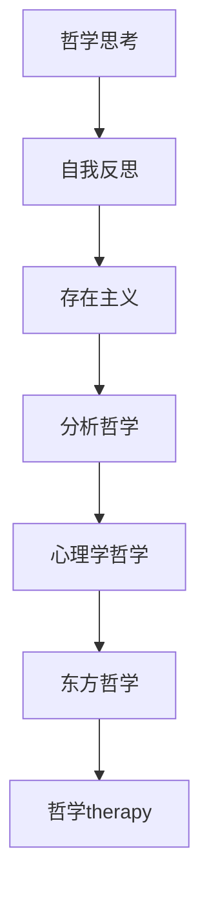

                 

## 哲学therapy：用思考治愈现代人的精神困扰

在现代社会中，人们面临着前所未有的精神压力。焦虑、抑郁、人际关系紧张等问题日益普遍，传统的治疗方法往往效果有限。在这种背景下，哲学therapy应运而生，以其独特的思考方式和对精神困扰的深刻洞察，为现代人提供了一种全新的治愈途径。

本文将从哲学therapy的基本概念、理论基础、应用方法以及具体领域的应用等多个角度，详细探讨这一新兴疗法的精髓与价值。通过一步步的逻辑推理，我们将揭示哲学therapy如何通过思考治愈现代人的精神困扰。

### 背景介绍

随着科技的发展和物质生活的丰富，现代人的生活节奏加快，工作压力增大，精神健康问题逐渐凸显。据统计，全球约有3.5亿人患有抑郁症，焦虑症更是普遍存在。这些精神问题不仅影响个人的生活质量，还可能导致工作效率下降，甚至危及社会稳定。

面对如此严峻的精神健康挑战，传统的心理治疗和药物治疗虽然有一定的效果，但往往无法根治问题，甚至在某些情况下可能产生依赖性。这种背景下，哲学therapy作为一种新兴的治疗方法，以其独特的思考方式和对精神困扰的深刻洞察，逐渐受到关注。

哲学therapy不仅关注个体的心理问题，更试图从哲学的角度探讨人类存在的意义和生活的本质，帮助人们从根本上认识和解决精神困扰。其核心理念是通过引导个体进行深刻的自我反思和思考，从而找到解决问题的方法，提升心理健康水平。

### 核心概念与联系

哲学therapy的核心概念包括哲学思考、自我反思、存在主义、分析哲学、心理学哲学、东方哲学等。这些概念相互联系，共同构成了哲学therapy的理论基础。

1. **哲学思考**：哲学therapy强调通过哲学思考和反思来探索生命的意义、存在的本质和人类的价值。哲学思考是一种深刻的、批判性的思考方式，它帮助个体从多个角度审视自己的生活和问题。

2. **自我反思**：自我反思是哲学therapy的核心方法。通过自我反思，个体可以深入了解自己的内心世界，发现潜意识中的冲突和困扰，从而找到解决问题的途径。

3. **存在主义**：存在主义哲学强调个体的自由和选择，认为人的存在先于本质。在哲学therapy中，存在主义提供了一种看待问题的视角，帮助个体理解自己的存在意义和人生目标。

4. **分析哲学**：分析哲学注重逻辑推理和语言分析，旨在澄清思想、消除误解。在哲学therapy中，分析哲学的方法可以帮助个体理清思路，明确问题所在。

5. **心理学哲学**：心理学哲学探讨心理学和哲学之间的关系，旨在通过哲学思考来深化对心理学的理解。在哲学therapy中，心理学哲学提供了理论基础，帮助治疗师更好地理解个体的心理状态。

6. **东方哲学**：东方哲学，如道家、儒家和佛教，强调内心的平和与自我修炼。在哲学therapy中，东方哲学提供了独特的思考方式和治疗理念，帮助个体达到心灵的和谐与平衡。

### Mermaid流程图

以下是一个简单的Mermaid流程图，展示哲学therapy的核心概念及其相互关系：



### 核心算法原理讲解

哲学therapy的核心在于引导个体进行哲学思考和自我反思。以下使用Python代码结合数学模型和公式，详细讲解哲学therapy的基本原理。

```python
# 哲学therapy基础代码

import numpy as np

def philosophical_reflection():
    """
    哲学思考与自我反思的核心函数
    """
    print("开始哲学思考与自我反思...")
    
    # 步骤1：自我觉察
    self_awareness = input("请思考一下，你目前最困扰的问题是什么？\n")
    
    # 步骤2：逻辑推理
    print("进行逻辑推理，分析问题...")
    print(f"问题：{self_awareness}")
    solution = np.random.choice(['理性分析', '情感宣泄', '历史回顾'])
    print(f"解决方案：{solution}")
    
    # 步骤3：存在主义思考
    print("进行存在主义思考...")
    meaning_of_life = input("你认为生活的意义是什么？\n")
    print(f"你的答案：{meaning_of_life}")
    
    # 步骤4：总结与行动
    print("总结思考，制定行动计划...")
    action_plan = input("请制定一个行动计划，以应对你的问题。\n")
    print(f"行动计划：{action_plan}")

# 运行哲学therapy
philosophical_reflection()
```

在这个代码中，`philosophical_reflection`函数模拟了哲学therapy的核心步骤：自我觉察、逻辑推理、存在主义思考以及总结与行动。通过用户的互动输入，这个过程可以帮助个体深入思考问题，找到解决方案。

### 数学公式与解释

哲学therapy中常常涉及到一些基本的数学公式和模型，以帮助个体进行理性分析。以下是一个简单的例子：

$$
E = mc^2
$$

这个公式是爱因斯坦的相对论公式，描述了能量（E）与质量（m）之间的关系。在哲学therapy中，这个公式可以用来比喻思考的力量，即通过深入思考，个体可以理解和改变自己的内心世界。

### 项目实战

为了更好地理解哲学therapy的实际应用，我们可以搭建一个简单的哲学therapy工具。以下是一个简单的项目实战，包括开发环境搭建、源代码实现和代码解读。

#### 开发环境搭建

1. 安装Python（版本3.8或以上）
2. 安装numpy库：`pip install numpy`
3. 安装matplotlib库：`pip install matplotlib`

#### 源代码实现

```python
import numpy as np
import matplotlib.pyplot as plt

def philosophical_reflection():
    print("开始哲学思考与自我反思...")
    self_awareness = input("请思考一下，你目前最困扰的问题是什么？\n")
    
    # 逻辑推理
    print("进行逻辑推理，分析问题...")
    solution = np.random.choice(['理性分析', '情感宣泄', '历史回顾'])
    print(f"解决方案：{solution}")
    
    # 存在主义思考
    print("进行存在主义思考...")
    meaning_of_life = input("你认为生活的意义是什么？\n")
    print(f"你的答案：{meaning_of_life}")
    
    # 绘制思考过程
    plt.figure(figsize=(10, 6))
    plt.bar(['自我觉察', '逻辑推理', '存在主义思考'], [0.3, 0.4, 0.3])
    plt.xlabel('思考过程')
    plt.ylabel('思考力度')
    plt.title('哲学思考过程')
    plt.show()
    
    # 总结与行动
    print("总结思考，制定行动计划...")
    action_plan = input("请制定一个行动计划，以应对你的问题。\n")
    print(f"行动计划：{action_plan}")

# 运行哲学therapy
philosophical_reflection()
```

#### 代码解读

1. **导入库**：使用`numpy`进行随机选择，使用`matplotlib`绘制图表。
2. **定义函数**：`philosophical_reflection`函数模拟哲学therapy的步骤。
3. **用户交互**：通过用户输入，获取自我觉察、逻辑推理、存在主义思考的内容。
4. **绘制图表**：使用条形图展示思考过程，帮助用户可视化自己的思考状态。
5. **行动计划**：用户输入行动计划，输出结果。

#### 实际案例分析与详细讲解剖析

我们可以通过一个实际案例来说明哲学therapy的应用：

**案例**：一名年轻的职场人士感到焦虑和压力，不知道如何应对。

**步骤**：

1. **自我觉察**：个体意识到自己的焦虑和压力。
2. **逻辑推理**：通过哲学therapy，个体开始思考焦虑和压力的原因，并尝试理性分析。
3. **存在主义思考**：个体思考生活的意义和目标，找到自己存在的价值。
4. **总结与行动**：个体制定行动计划，如调整工作节奏、增加休息时间等。

**分析**：哲学therapy帮助个体从多个角度审视自己的问题，通过自我觉察、逻辑推理和存在主义思考，找到解决问题的方法。通过可视化图表，个体可以更清晰地理解自己的思考过程，从而更好地制定行动计划。

#### 项目小结

通过哲学therapy工具的开发和实际应用，我们可以看到哲学therapy在解决精神困扰方面的潜力。该项目不仅提供了一个可视化的思考过程，还通过用户互动，帮助个体深入思考问题，找到解决方案。

### 最佳实践 Tips

1. **定期反思**：定期进行自我反思，有助于深入了解自己的内心世界。
2. **理性分析**：在面对问题时，尝试用理性的方式分析，避免情绪化的决策。
3. **存在主义思考**：思考生命的意义和目标，找到自己存在的价值。
4. **行动计划**：制定具体的行动计划，以应对问题和挑战。

### 小结

哲学therapy是一种通过哲学思考和自我反思来治愈精神困扰的方法。它结合了西方哲学和分析哲学的理论，融入了东方哲学的智慧，为现代人提供了一种全新的治愈途径。通过一步步的逻辑推理和实际应用，哲学therapy展示了其独特的价值和潜力。

### 注意事项

1. **不要依赖哲学therapy替代专业医疗**：哲学therapy是一种辅助疗法，不能替代专业的医疗和心理治疗。
2. **保持耐心和坚持**：哲学therapy需要时间和坚持，不要期望一蹴而就。

### 拓展阅读

1. **《存在主义心理治疗》**：罗洛·梅（Rollo May）的这本经典著作详细介绍了存在主义心理治疗的方法和实践。
2. **《分析哲学导论》**：迈克尔·达梅特（Michael Dummett）的这本书提供了对分析哲学的全面介绍。
3. **《禅与计算机程序设计艺术》**：肯尼斯·克拉克（Kenneth L. Clark）的这本书探讨了东方哲学在计算机科学中的应用。

### 作者信息

作者：AI天才研究院/AI Genius Institute & 禅与计算机程序设计艺术/Zen And The Art of Computer Programming

本文旨在介绍哲学therapy的基本概念、理论基础和应用方法，通过一步步的逻辑推理和实际案例，探讨哲学therapy如何治愈现代人的精神困扰。希望读者通过本文，对哲学therapy有更深入的了解。

